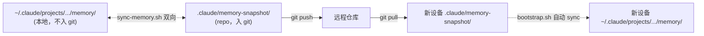

# Memory Snapshot

> 跨设备 memory 同步的 staging 区域。

## 用途

Claude Code 的 memory 文件（用户偏好、反馈、项目上下文）默认存在：

```
~/.claude/projects/<repo-path-hash>/memory/
```

这个路径是设备本地的，**不会随 git 仓库 clone 到新机器**。

`memory-snapshot/` 目录是 repo 内的 staging 区域，通过 `scripts/sync-memory.sh` 与设备本地 memory 双向同步：



## 怎么用

### 当前设备已有 memory，想推到 repo

```bash
# 1. 把要同步的文件名加入 .allowlist
echo "feedback-zero-npm-deps.md" >> .claude/memory-snapshot/.allowlist

# 2. 跑 sync（默认 mtime 较新者覆盖较旧者）
bash scripts/sync-memory.sh

# 3. commit + push
git add .claude/memory-snapshot/
git commit -m "chore: 同步 memory（feedback-zero-npm-deps）"
git push
```

### 新设备 clone 后初始化

`bash bootstrap.sh` 第 5 步会自动跑 sync-memory.sh，把 repo 中的 snapshot 同步到本地 ~/.claude/projects/.../memory/。

或手动：

```bash
bash scripts/sync-memory.sh
```

## 注意

- **Allowlist 是显式的**：不在 .allowlist 中的文件不会同步。新增 memory 文件需要先决定是否要跨设备分享，再加入。
- **隐私**：memory 可能含个人偏好、敏感反馈。**入 git 前确认 allowlist 没有列入敏感内容**。
- **冲突**：双向同步用 mtime 比较，较新覆盖较旧。同 mtime 不动作。如需强制方向，先 `touch` 想要保留的版本。

## 当前模板状态

本模板（quickStart 分支）的 `.allowlist` 是空的（仅注释）。模板用户开始记录自己的 memory 偏好后，按需启用。
