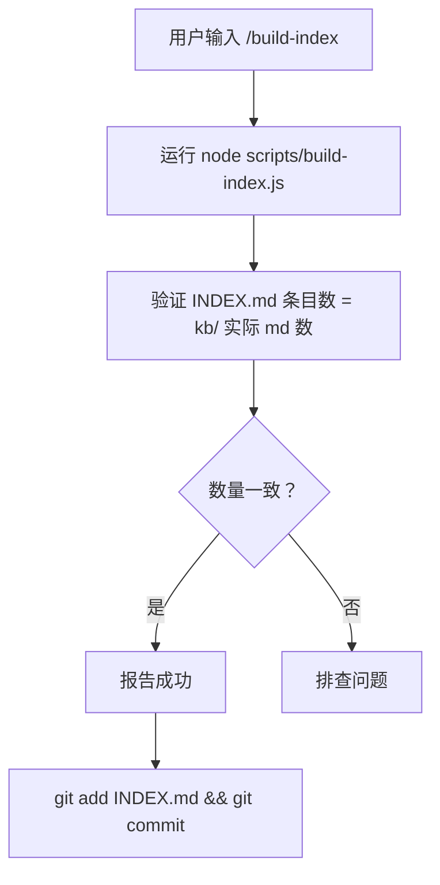

# Build Index (ANS AI Auto Notes 项目)

## 触发条件

**MUST invoke when**:
- 用户手动输入 `/build-index`
- 新增或删除了 `kb/**/*.md` 文件后需要重建索引

**MUST NOT invoke when**:
- 只是修改了 kb/ 文件内容（不需要重建索引，刷新浏览器即可）
- 修改了 `timeline/` 或 `memory/`（这些不在索引范围内）

## Current Context (Auto-detected)

INDEX.md entries: !`grep -c '^\- \[' INDEX.md 2>/dev/null || echo "INDEX.md not found"`

kb/ markdown files: !`find kb -name '*.md' -print | wc -l | tr -d ' '`

Status: !`idx=$(grep -c '^\- \[' INDEX.md 2>/dev/null || echo 0); kb=$(find kb -name '*.md' -print | wc -l | tr -d ' '); if [ "$idx" = "$kb" ]; then echo "IN SYNC ($idx entries)"; else echo "DRIFT: INDEX=$idx vs kb/=$kb"; fi`

## 执行步骤



### 1. 运行构建脚本

```bash
node scripts/build-index.js
```

预期输出：
```
[build-index] 扫描 kb/ 目录...
[build-index] 已生成 manifest.json (N 个文件, M 个顶层分类)
[build-index] 已生成 INDEX.md
[build-index] 完成
```

### 2. 验证一致性

```bash
# 统计 kb/ 实际 md 文件数
find kb -name "*.md" | wc -l

# 统计 INDEX.md 中的条目数（不含标题行）
grep -c "^- \[" INDEX.md
```

两者应该相等。如果不等，检查：
- 是否有 kb/ 文件缺少 frontmatter（build-index 会跳过）
- 是否有文件名包含特殊字符导致解析失败

### 3. Commit

```bash
git add INDEX.md
git commit -m "chore: rebuild INDEX.md"
```

**注意**：`manifest.json` 在 `.gitignore` 中，不需要 commit。

## 常见错误

| 错误 | 原因 | 修复 |
|------|------|------|
| `build-index` 跳过某些文件 | 文件缺少 frontmatter | 加 `---\ntitle: ...\n---` |
| INDEX.md 条目数 ≠ kb/ 文件数 | 文件名包含非法字符 | 重命名文件（只保留中文、字母、数字、连字符） |
| manifest.json 生成但 INDEX.md 没更新 | build-index.js bug | 检查 scripts/build-index.js 逻辑 |

## 关联文件

- `scripts/build-index.js` — 构建逻辑源码
- `INDEX.md` — 生成的索引文件（git tracked）
- `manifest.json` — 生成的清单文件（git ignored）
- `serve.sh` — 启动预览时会自动调用 build-index
