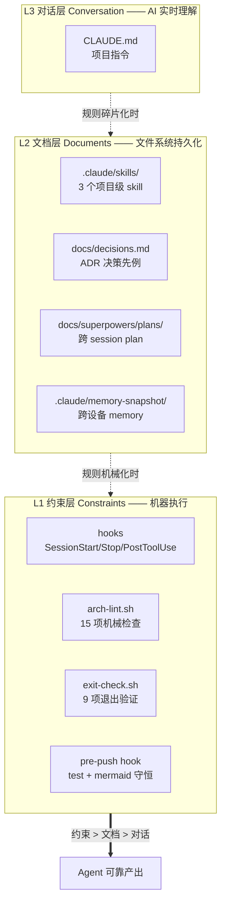

**[English](README_EN.md)** | 中文

# ANS AI Auto Notes — Harness KB 模板

> 基于 [Harness Engineering](https://www.anthropic.com/news/harness-engineering) 的个人知识库模板。AI 对话自动沉淀，机械化约束保证可维护，跨设备同步保证可移植。

## 一句话定位

**用 AI 对话写笔记，但 AI 必须遵守你的规则；规则不靠"对 AI 说"，靠 hooks + linter 机械执行。**

CLAUDE.md 再完美也会被忘，但一个 lint 脚本永远不会。

## 5 分钟 Quick Start

```bash
# 1. clone 模板
git clone <this-repo-url> my-kb
cd my-kb

# 2. 一键 onboarding（7 步：claude 探测 → install-hooks → 全局 settings → PostToolUse hook 注入 → memory sync → 构建索引 → 跑测试）
bash bootstrap.sh

# 3. 启动本地预览
./serve.sh
# 浏览器自动打开 http://localhost:8765

# 4. 个性化你的 KB
# - 改 CLAUDE.md 的「用户背景」段
# - 在 kb/ 下开始写笔记（AI 会自动按目录归类）
# - 用 git commit 定期保存
```

详细步骤见 [SETUP.md](SETUP.md)。

## 核心架构：Harness 三层模型



**核心理念**：能机械执行的不靠说，能写文件的不靠记。

## 6 大 Harness 组件

| 组件 | 实现 | 你能改的 |
|---|---|---|
| **上下文构建** | CLAUDE.md + skill description + INDEX.md | CLAUDE.md / skill |
| **工具定义** | `scripts/*.{js,sh}`（13+ 个） | 加新脚本 / 修现有 |
| **约束规则** | arch-lint 15 项 + skill 触发 | 加 lint 项 / 改 skill |
| **反馈回路** | exit-check 9 项 + arch-lint + pre-push | 加 hook / 改阈值 |
| **记忆管理** | memory-snapshot + ADR + plans + session-logs | 加 memory / ADR |
| **安全护栏** | pre-push (test + mermaid) + verify-claim hook | 加 hook 触发条件 |

## 工程能力清单

### 自动化检查（机械化约束）

- ✅ **arch-lint.sh 15 项**：frontmatter / 元信息头 / 死链 / 重复标题 / 磁盘 vs INDEX 一致性 / 大小写 / 行数限制 / memory 格式 / 零 npm 依赖 / 脚本被引用 / 文档→代码引用 / 标题 ID 契约 / 章节编号连续性 / **anchor 存活** / **内容具象度**
- ✅ **exit-check.sh 9 项**：markdown 格式 / git 状态 / INDEX vs kb 一致性 / overview.html 健康（12 子项）/ session 日志 / 权限审计 / 未 push 检查 / **沉淀声明审计** / **plans 状态汇总**
- ✅ **pre-push hook**：跑 test.sh + mermaid 守恒检查（防止误删图）
- ✅ **PostToolUse hook**（verify-claim.sh）：实时验证 AI 声称"已沉淀到 xxx.md"时文件确实存在

### 数据自动化

- ✅ **build-index.js**：扫描 kb/ → 生成 manifest.json（含全文搜索索引 + 反向链接图）+ INDEX.md
- ✅ **build-timeline.js**：从 git log 按 ISO 周聚合 → timeline.json（支持 `TIMELINE_SINCE` env 配置时间窗口）
- ✅ **list-open-plans.js**：解析 docs/superpowers/plans/ 中各 plan 的 status，列出未完成

### 跨设备/协作

- ✅ **bootstrap.sh**：新设备一键 onboarding（claude 探测 / install-hooks / settings / memory sync / 构建索引 / 跑测试）
- ✅ **sync-memory.sh**：memory 跨设备双向同步（mtime 较新者覆盖 + allowlist 控制范围）
- ✅ **install-hooks.sh**：git pre-push hook 一次性安装

### 编辑器辅助

- ✅ **split-doc.js**：半自动拆分大文件（>1500 行触发 lint），保留 lead text + 自动重编号 + 更新 INDEX

### 3 个项目级 skill（自动加载）

| Skill | 触发条件 |
|---|---|
| `auto-commit-discipline` | 完成一批文件变更 / 响应前未 commit |
| `kb-content-style` | 写入/编辑 kb/ 下任何 md |
| `kb-tdd-discipline` | 修改 scripts/ 或 tests/，或修 markdown 渲染/路径解析/lint bug |

## 目录结构

```
my-kb/
├── kb/                          ← 知识库主目录（按主题分类）
│   ├── 技术/
│   │   ├── AI/                  ← 5 子目录（基础/大模型/Claude-Code/AI-Coding/应用）
│   │   ├── Java/
│   │   └── 计算机基础/
│   ├── 实战/                    ← 排查记录、好文摘要、技巧
│   └── 读书笔记/
├── timeline/                    ← 按周归档的对话摘要（手维护，叙事性）
├── timeline.json                ← 自动生成（构建产物）
├── tests/                       ← 单元 + 集成测试（node --test，零依赖）
├── test.sh                      ← 测试入口（bash test.sh）
├── scripts/                     ← 14+ 个工程脚本（lint / hook / 数据构建 / 跨设备）
├── INDEX.md                     ← 总目录索引（build-index.js 自动生成）
├── manifest.json                ← 分类 + 搜索 + 反向链接数据（构建产物）
├── overview.html                ← 可视化导览页（fetch manifest + timeline）
├── server.js + serve.sh         ← 本地预览服务器（端口 8765）
├── bootstrap.sh + SETUP.md      ← 新设备 onboarding
├── exit-check.sh                ← Stop hook（9 项退出检查）
├── lint.sh                      ← markdown 格式检查（纯 bash awk）
├── CLAUDE.md                    ← 项目指令（AI 启动时加载）
├── docs/
│   ├── decisions.md             ← ADR 决策先例
│   └── superpowers/
│       ├── specs/               ← 设计文档
│       └── plans/               ← 实施 plan
├── .claude/
│   ├── settings.local.json      ← Hook 配置（不入 git）
│   ├── skills/                  ← 项目级 skill（入 git）
│   ├── memory-snapshot/         ← memory 跨设备 staging（入 git）
│   ├── session-logs/            ← session 日志（不入 git）
│   └── claim-ledger.log         ← 沉淀声明审计（不入 git）
└── memory/                      ← AI 自动记忆（已存在）
```

## 个性化你的 KB

模板拿到手后，3 件事让它变成"你的"：

### 1. 改 CLAUDE.md「用户背景」段

```markdown
## 用户背景

- 30 岁，软件工程师
- 关注 AI 应用、系统设计
- 在读《Designing Data-Intensive Applications》
```

AI 会按这个背景调整回答风格、举例子时选你熟悉的领域。

### 2. 开始写 kb/

直接对 AI 说"我们聊聊 X"，AI 会按规则把内容沉淀到 kb/ 对应目录。规则在 `.claude/skills/kb-content-style/SKILL.md` 中，包括：

- Mermaid 优先、保留 demo、反抽象化
- 同主题聚合（不按日期拆文件）
- 中文文件名 = frontmatter title
- 行数 >1000 关注 / >1500 必拆

### 3. 写下你的第一条 ADR

遇到分类争议时（"Spring AI vs LangChain 笔记放哪？"），AI 会先看 `docs/decisions.md`。决策后追加 ADR：

```markdown
## ADR-004: Spring AI vs LangChain 笔记归入 kb/技术/AI/应用/

- 日期: 2026-06-15
- 状态: 接受
- 背景: ...
- 决定: ...
- 理由: ...
```

下次遇到类似分类时，AI 会主动引用此 ADR。

## 进阶用法

### Plan 系统（跨 session 持久化任务）

长期任务（"重构整个 Java 笔记目录"）写到 `docs/superpowers/plans/YYYY-MM-DD-<topic>.md`，加 frontmatter `status: 进行中`。Stop hook 的 `[9/9]` 会列出所有未完成 plan，避免遗忘。完成后改 `status: completed`。

### split-doc 拆大文件

当 arch-lint 警告某文件 >1000 行：

```bash
node scripts/split-doc.js kb/技术/Java/jvm-gc.md --sections "GC 算法,GC 调优"
```

会生成 2 个新文件 + 原文件保留拆分提示链接 + 自动重建 INDEX.md。

### sync-memory 跨设备同步

设备 A 写了 memory 偏好，要在设备 B 用：

```bash
# 设备 A
echo "feedback-zero-npm-deps.md" >> .claude/memory-snapshot/.allowlist
bash scripts/sync-memory.sh
git add .claude/memory-snapshot/ && git commit -m "chore: 同步 memory" && git push

# 设备 B
git pull
bash bootstrap.sh   # 自动跑 sync-memory
```

### Worktree 工作流

复杂改动用 `using-git-worktrees` skill 隔离：

```
你: 用 worktree 重构 X
Claude: [自动 invoke using-git-worktrees skill 创建 worktree → 完成 → 集成]
```

详见 [superpowers 文档](https://github.com/anthropics/superpowers)。

## 常见问题

### 为什么是「零 npm 依赖」？

见 [`docs/decisions.md`](docs/decisions.md) ADR-002。简单说：KB 项目不需要复杂依赖，bash + Node 内置 + CDN 引入足够，避免依赖维护成本。

### CLAUDE.md 修改后多久生效？

下次 AI session 启动（SessionStart hook 触发）时立即生效。当前 session 内可手动告诉 AI "重读 CLAUDE.md"。

### 如果 lint 报错怎么办？

- 错误（❌）必须修才能 push（pre-push hook 拦截）
- 警告（⚠️）只提示，不阻断，可以累积修
- 看 `bash scripts/arch-lint.sh` 完整输出定位问题

### 怎么备份？

整个 repo 是 plain text，git push 到任意 remote（GitHub / GitLab / 私有 git 服务）即可。memory 通过 memory-snapshot 入 git 一起备份。

### 模板更新怎么办？

可以把本模板设为 upstream remote，定期 cherry-pick 工程升级（不要 merge，会冲突 kb/）：

```bash
git remote add template <this-repo-url>
git fetch template
git cherry-pick template/main -- scripts/  # 只迁工程文件
```

## 致谢

- [Harness Engineering](https://www.anthropic.com/news/harness-engineering) — Anthropic 提出的 AI 工程范式
- [superpowers](https://github.com/anthropics/superpowers) — Claude Code 的 skill 体系
- 所有给本项目提建议的早期用户

## License

MIT
