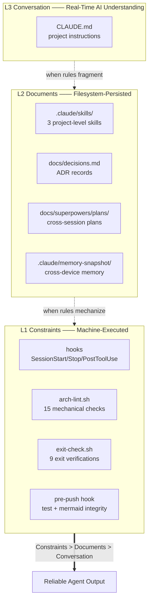

[中文](README.md) | **English**

# ANS AI Auto Notes — Harness KB Template

> Personal knowledge base template based on [Harness Engineering](https://www.anthropic.com/news/harness-engineering). AI conversations auto-distill into notes; mechanical constraints ensure maintainability; cross-device sync ensures portability.

## One-Liner

**Use AI to write notes, but AI must follow your rules — and the rules aren't enforced by "telling AI", they're enforced by hooks + linters.**

A perfect CLAUDE.md gets forgotten; a lint script never does.

## 5-Minute Quick Start

```bash
# 1. Clone the template
git clone <this-repo-url> my-kb
cd my-kb

# 2. One-command onboarding (7 steps: claude detection → install-hooks → settings → PostToolUse hook injection → memory sync → build index → run tests)
bash bootstrap.sh

# 3. Start local preview
./serve.sh
# Browser auto-opens http://localhost:8765

# 4. Personalize your KB
# - Edit CLAUDE.md "User Background" section
# - Start writing in kb/ (AI auto-categorizes by directory)
# - git commit periodically
```

See [SETUP.md](SETUP.md) for detailed steps.

## Core Architecture: Harness Three-Layer Model



**Core principle**: What can be mechanized shouldn't be told; what can be filed shouldn't be remembered.

## 6 Harness Components

| Component | Implementation | What You Edit |
|---|---|---|
| **Context Building** | CLAUDE.md + skill descriptions + INDEX.md | CLAUDE.md / skills |
| **Tool Definition** | `scripts/*.{js,sh}` (13+ scripts) | add new / modify existing |
| **Constraints** | arch-lint 15 items + skill triggers | add lint / modify skill |
| **Feedback Loops** | exit-check 9 items + arch-lint + pre-push | add hooks / adjust thresholds |
| **Memory Management** | memory-snapshot + ADR + plans + session-logs | add memory / write ADR |
| **Safety Rails** | pre-push (test + mermaid) + verify-claim hook | add hook conditions |

## Engineering Features

### Automated Checks (Mechanical Constraints)

- ✅ **arch-lint.sh 15 items**: frontmatter / metadata header / dead links / duplicate titles / disk-vs-INDEX consistency / case sensitivity / line-count limits / memory format / zero npm deps / script references / doc→code refs / heading ID contract / section number continuity / **anchor liveness** / **content concreteness**
- ✅ **exit-check.sh 9 items**: markdown format / git status / INDEX-vs-kb consistency / overview.html health (12 sub-items) / session log / permission audit / unpushed check / **claim audit** / **plans status summary**
- ✅ **pre-push hook**: runs test.sh + mermaid integrity check (prevents accidental diagram deletion)
- ✅ **PostToolUse hook** (verify-claim.sh): real-time verifies that when AI claims "saved to xxx.md", the file actually exists

### Data Automation

- ✅ **build-index.js**: scans kb/ → generates manifest.json (with full-text search index + backlinks graph) + INDEX.md
- ✅ **build-timeline.js**: aggregates git log by ISO week → timeline.json (configurable via `TIMELINE_SINCE` env)
- ✅ **list-open-plans.js**: parses status from plans, lists incomplete

### Cross-Device / Collaboration

- ✅ **bootstrap.sh**: one-command new-device onboarding (claude detect / install-hooks / settings / memory sync / build / test)
- ✅ **sync-memory.sh**: bidirectional memory sync (mtime-newer-wins + allowlist scope control)
- ✅ **install-hooks.sh**: git pre-push hook one-time installation

### Editor Helpers

- ✅ **split-doc.js**: semi-automated split of large files (>1500 lines triggers lint), preserves lead text + auto-renumbers + updates INDEX

### 3 Project-Level Skills (Auto-Loaded)

| Skill | Trigger |
|---|---|
| `auto-commit-discipline` | Finishing batch of file changes / before responding when uncommitted |
| `kb-content-style` | Writing/editing any md under kb/ |
| `kb-tdd-discipline` | Modifying scripts/ or tests/, or fixing markdown render/path resolve/lint bugs |

## Directory Structure

```
my-kb/
├── kb/                          ← knowledge base (categorized by topic)
│   ├── 技术/ (Technology)
│   │   ├── AI/                  ← 5 sub-dirs (Foundations/LLM/Claude-Code/AI-Coding/Applications)
│   │   ├── Java/
│   │   └── 计算机基础/ (CS Foundations)
│   ├── 实战/ (Real-world)
│   └── 读书笔记/ (Reading Notes)
├── timeline/                    ← weekly summaries (manually maintained, narrative)
├── timeline.json                ← auto-generated (build artifact)
├── tests/                       ← unit + integration tests (node --test, zero deps)
├── test.sh                      ← test entry (bash test.sh)
├── scripts/                     ← 14+ engineering scripts (lint / hook / data / cross-device)
├── INDEX.md                     ← table of contents (auto-generated by build-index.js)
├── manifest.json                ← classification + search + backlinks data (build artifact)
├── overview.html                ← visual navigator (fetches manifest + timeline)
├── server.js + serve.sh         ← local preview server (port 8765)
├── bootstrap.sh + SETUP.md      ← new device onboarding
├── exit-check.sh                ← Stop hook (9-item exit checks)
├── lint.sh                      ← markdown format check (pure bash awk)
├── CLAUDE.md                    ← project instructions (loaded at AI startup)
├── docs/
│   ├── decisions.md             ← ADR records
│   └── superpowers/
│       ├── specs/               ← design docs
│       └── plans/               ← implementation plans
├── .claude/
│   ├── settings.local.json      ← hook config (not in git)
│   ├── skills/                  ← project-level skills (in git)
│   ├── memory-snapshot/         ← cross-device memory staging (in git)
│   ├── session-logs/            ← session logs (not in git)
│   └── claim-ledger.log         ← claim audit log (not in git)
└── memory/                      ← AI auto-memory (existing)
```

## Personalize Your KB

3 things to make the template "yours" after cloning:

### 1. Edit CLAUDE.md "User Background"

```markdown
## User Background

- Software engineer, 30s
- Interested in AI applications, system design
- Currently reading "Designing Data-Intensive Applications"
```

AI will adjust its response style and example choices based on this.

### 2. Start Writing in kb/

Just tell AI "let's discuss X". AI will distill the conversation into kb/ following the rules in `.claude/skills/kb-content-style/SKILL.md`:

- Prefer Mermaid diagrams; preserve demos; avoid abstraction
- Aggregate by topic (don't split by date)
- Chinese filenames = frontmatter title
- >1000 lines → consider split; >1500 lines → must split

### 3. Write Your First ADR

When facing a classification dispute ("where does this Spring AI vs LangChain note go?"), AI checks `docs/decisions.md` first. After deciding, append an ADR:

```markdown
## ADR-004: Spring AI vs LangChain note placed in kb/技术/AI/应用/

- Date: 2026-06-15
- Status: Accepted
- Context: ...
- Decision: ...
- Rationale: ...
```

Next time AI faces a similar classification, it'll cite this ADR.

## Advanced Usage

### Plan System (Cross-Session Persistent Tasks)

Long-running tasks (e.g., "refactor entire Java directory") go in `docs/superpowers/plans/YYYY-MM-DD-<topic>.md` with frontmatter `status: 进行中`. Stop hook's `[9/9]` lists all incomplete plans to prevent forgetting. Mark `status: completed` when done.

### split-doc for Large Files

When arch-lint warns a file is >1000 lines:

```bash
node scripts/split-doc.js kb/技术/Java/jvm-gc.md --sections "GC 算法,GC 调优"
```

Generates 2 new files + original keeps split-link hints + auto-rebuilds INDEX.md.

### sync-memory for Cross-Device

Device A wrote a memory preference, want it on Device B:

```bash
# Device A
echo "feedback-zero-npm-deps.md" >> .claude/memory-snapshot/.allowlist
bash scripts/sync-memory.sh
git add .claude/memory-snapshot/ && git commit -m "chore: sync memory" && git push

# Device B
git pull
bash bootstrap.sh   # auto-runs sync-memory
```

### Worktree Workflow

For complex changes, use `using-git-worktrees` skill for isolation:

```
You: Refactor X in a worktree
Claude: [auto-invokes using-git-worktrees → completes → integrates]
```

## FAQ

### Why "Zero npm Deps"?

See [`docs/decisions.md`](docs/decisions.md) ADR-002. Short version: KB projects don't need complex deps; bash + Node built-ins + CDN imports are enough, avoiding dep maintenance overhead.

### How long until CLAUDE.md changes take effect?

Next AI session startup (SessionStart hook triggers). For the current session, manually tell AI "re-read CLAUDE.md".

### What if lint fails?

- Errors (❌) must be fixed before push (pre-push hook blocks)
- Warnings (⚠️) only inform, don't block; can accumulate
- See full `bash scripts/arch-lint.sh` output for details

### How to back up?

The whole repo is plain text. `git push` to any remote (GitHub / GitLab / private git) works. Memory backs up via memory-snapshot in git.

### How to update from template?

Set this template as upstream remote, periodically cherry-pick engineering upgrades (don't merge — kb/ would conflict):

```bash
git remote add template <this-repo-url>
git fetch template
git cherry-pick template/main -- scripts/  # only migrate engineering files
```

## Acknowledgments

- [Harness Engineering](https://www.anthropic.com/news/harness-engineering) — Anthropic's AI engineering paradigm
- [superpowers](https://github.com/anthropics/superpowers) — Claude Code's skill ecosystem
- All early users who provided feedback

## License

MIT
