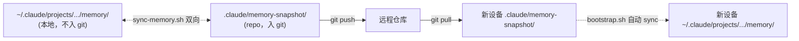
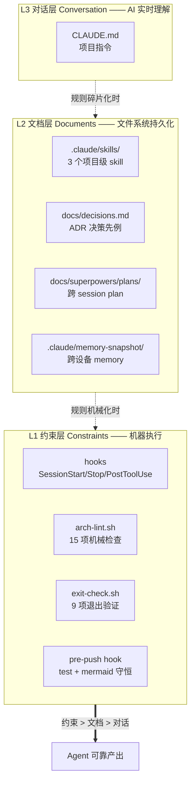
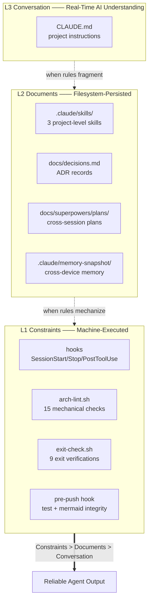
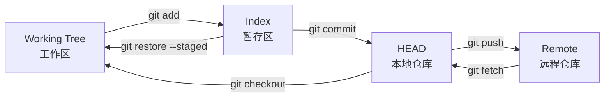

# quickStart 分支 Harness KB 模板化升级 Implementation Plan

> **For agentic workers:** REQUIRED SUB-SKILL: Use superpowers:subagent-driven-development (recommended) or superpowers:executing-plans to implement this plan task-by-task. Steps use checkbox (`- [ ]`) syntax for tracking.

**Goal:** 把 main 上 KB 系统升级 13 项的工程产物 + 文档框架复刻到 quickStart 分支，让它成为完整的 Harness KB 模板。

**Architecture:** 跨分支迁移任务。绝大多数 task 使用 `git show main:<path>` 取 main 版本的文件内容，直接落到 quickStart 同路径。文档类（README/CLAUDE/SETUP）需要按"模板"定位重写或调整。线性集成（无 worktree）：Group A 工程脚本 → Group B Hook&配置 → Group C Skill&ADR&memory → Group D 文档。

**Tech Stack:** bash + Node.js（零 npm 依赖，仅内置）+ git + markdown。

---

## File Structure

| 路径 | 操作 | 责任 | 组 |
|---|---|---|---|
| (分支切换) | `git checkout quickStart` | 入口 | T1 |
| `scripts/lib.js` | 替换 | 含 stripInline export | T2 |
| `tests/lib.test.js` | 替换 | 含 stripInline 5 测试 | T2 |
| `scripts/build-index.js` | 替换 | tokenize/buildSearchIndex/extractLinks/buildBacklinks | T2 |
| `tests/build-index.test.js` | 替换 | 同 main | T2 |
| `tests/search.test.js` | 新建 | 4 测试 | T2 |
| `tests/backlinks.test.js` | 新建 | 7 测试 | T2 |
| `scripts/build-timeline.js` | 新建 | git log → ISO 周聚合 | T3 |
| `tests/build-timeline.test.js` | 新建 | 6 测试 | T3 |
| `scripts/check-anchors.js` | 新建 | anchor 存活检查 | T3 |
| `tests/anchor-check.test.js` | 新建 | 4 测试 | T3 |
| `scripts/check-content-quality.sh` | 新建 | 内容具象度检查 | T3 |
| `tests/content-quality.test.js` | 新建 | 5 测试 | T3 |
| `scripts/verify-claim.sh` | 新建 | PostToolUse hook | T4 |
| `tests/verify-claim.test.js` | 新建 | 8 测试 | T4 |
| `scripts/sync-memory.sh` | 新建 | memory 双向 sync | T4 |
| `tests/sync-memory.test.js` | 新建 | 5 测试 | T4 |
| `scripts/list-open-plans.js` | 新建 | plans 状态解析 | T4 |
| `tests/plans-status.test.js` | 新建 | 8 测试 | T4 |
| `scripts/split-doc.js` | 新建 | 拆分助手 | T4 |
| `tests/split-doc.test.js` | 新建 | 8 测试（含 audit fix） | T4 |
| `scripts/session-log.sh` | 替换 | checkpoint + bash 3.2 fix | T5 |
| `tests/session-log.test.js` | 新建 | 3 测试 | T5 |
| `scripts/arch-lint.sh` | 替换 | 13→15 项 + 防御 | T5 |
| `scripts/preflight.sh` | 替换 | 同步 main | T5 |
| `bootstrap.sh` | 新建 | 7 步 onboarding | T6 |
| `SETUP.md` | 新建 | 人类可读 setup | T6 |
| `exit-check.sh` | 替换 | 7→9 项 | T7 |
| `.gitignore` | 替换 | `.claude/*` + 2 个 negation + 构建产物 | T7 |
| `.claude/skills/auto-commit-discipline/SKILL.md` | 新建 | 同 main | T8 |
| `.claude/skills/kb-content-style/SKILL.md` | 新建 | 同 main | T8 |
| `.claude/skills/kb-tdd-discipline/SKILL.md` | 新建 | 同 main + tests/ 树调整 | T8 |
| `docs/decisions.md` | 新建 | 3 条通用架构 ADR | T9 |
| `.claude/memory-snapshot/.allowlist` | 新建 | 空 + 注释 | T10 |
| `.claude/memory-snapshot/README.md` | 新建 | 用法说明 | T10 |
| `CLAUDE.md` | 替换 | main 153 行版 + 模板化 | T11 |
| `README.md` | 重写 | "Harness KB 模板"导向 | T12 |
| `README_EN.md` | 重写 | 同 README 翻译 | T13 |
| `说明.md` | 简化 | 检查与 README 重叠则简化 | T14 |
| `kb/实战/demo-harness-walkthrough.md` | 新建 | Git 工作流速查示范笔记 | T15 |
| `INDEX.md` | 重生成 | build-index 输出 | T16 |
| (push) | `git push origin quickStart` | 集成 | T17 |

---

## Execution Strategy

**前置条件**：当前在 main 分支，工作区干净（`git status` clean）。

**整体流程**：
1. T1 切换到 quickStart 分支
2. T2-T15 按 4 组顺序在 quickStart 上做改动，每个 task 独立 commit
3. T16 跑 build-index/build-timeline 重生成索引
4. T17 终验 + push

**Conventional Commits 中文**，参考 main 风格。每个 task 末尾跑 `bash test.sh` 确认无回归（仅工程类 task 需要）。

---

## Group 切换：Task 1

### Task 1: 切换到 quickStart 分支 + baseline 验证

**Files:**
- (no file changes, branch checkout only)

- [ ] **Step 1: 验证当前 main clean**

Run:
```bash
git status
git branch --show-current
```
Expected: `On branch main` + `nothing to commit, working tree clean`

如果不 clean，停止并报告 user。

- [ ] **Step 2: 切换到 quickStart 分支**

Run:
```bash
git checkout quickStart
git pull origin quickStart
```
Expected: `Switched to branch 'quickStart'` + 与 origin 同步

- [ ] **Step 3: 跑 baseline test 看现状**

Run:
```bash
bash test.sh 2>&1 | tail -10
```
Expected: 看到测试通过数（quickStart baseline 应该有一些测试，记录数字便于对比）。**记录 baseline test 数**（例如 X tests pass）。

- [ ] **Step 4: 跑 baseline arch-lint 看现状**

Run:
```bash
bash scripts/arch-lint.sh 2>&1 | tail -3
```
Expected: 13 项检查（quickStart 还是旧版 13 项），看 errors / warnings 数。**记录 baseline 数字**。

- [ ] **Step 5: 不需要 commit（仅环境切换）**

确认 cwd = quickStart 工作树，进入 Task 2。

---

## Group A：工程脚本 + 测试迁移（Task 2-5）

### Task 2: lib.js + build-index.js 升级（含 search/backlinks 字段）

**Files:**
- Modify: `scripts/lib.js` (replace from main)
- Modify: `tests/lib.test.js` (replace from main)
- Modify: `scripts/build-index.js` (replace from main)
- Modify: `tests/build-index.test.js` (replace from main)
- Create: `tests/search.test.js`
- Create: `tests/backlinks.test.js`

- [ ] **Step 1: 从 main 取最新版本**

Run:
```bash
git show main:scripts/lib.js > scripts/lib.js
git show main:tests/lib.test.js > tests/lib.test.js
git show main:scripts/build-index.js > scripts/build-index.js
git show main:tests/build-index.test.js > tests/build-index.test.js
git show main:tests/search.test.js > tests/search.test.js
git show main:tests/backlinks.test.js > tests/backlinks.test.js
```

- [ ] **Step 2: 验证文件内容（spot check）**

Run:
```bash
grep -c "stripInline" scripts/lib.js
grep -c "tokenize\|buildSearchIndex\|extractLinks\|buildBacklinks" scripts/build-index.js
```
Expected: `stripInline` 在 lib.js 出现 ≥4 次（top-level def + module.exports + buildToc 调用 ×2）；build-index.js 4 个新函数都有引用。

- [ ] **Step 3: 跑相关测试**

Run:
```bash
node --test tests/lib.test.js tests/build-index.test.js tests/search.test.js tests/backlinks.test.js 2>&1 | tail -10
```
Expected: 18 + 14 + 4 + 7 = **43 测试全部 pass，0 fail**。

如果有 fail：可能是 build-index.js 依赖了 quickStart 没有的某些 lib.js 函数 → STOP 报告。

- [ ] **Step 4: Commit**

```bash
git add scripts/lib.js tests/lib.test.js scripts/build-index.js tests/build-index.test.js tests/search.test.js tests/backlinks.test.js
git commit -m "refactor: 同步 main 的 lib.js + build-index.js 升级（A5 全文搜索 + 反向链接）

- lib.js: 提取 stripInline 为 top-level + module.exports
- build-index.js: 加 tokenize/buildSearchIndex/extractLinks/buildBacklinks
  manifest.json 加 searchIndex/searchFiles/backlinks 字段
- 新增 search.test.js (4) + backlinks.test.js (7) 共 11 个新测试
- lib.test.js 加 stripInline 5 个测试

来自 quickStart Harness 模板化升级 Group A T2"
```

---

### Task 3: 新建 lint 类脚本（build-timeline + check-anchors + check-content-quality）

**Files:**
- Create: `scripts/build-timeline.js`
- Create: `tests/build-timeline.test.js`
- Create: `scripts/check-anchors.js`
- Create: `tests/anchor-check.test.js`
- Create: `scripts/check-content-quality.sh`
- Create: `tests/content-quality.test.js`

- [ ] **Step 1: 从 main 取所有 6 个文件**

```bash
git show main:scripts/build-timeline.js > scripts/build-timeline.js
git show main:tests/build-timeline.test.js > tests/build-timeline.test.js
git show main:scripts/check-anchors.js > scripts/check-anchors.js
git show main:tests/anchor-check.test.js > tests/anchor-check.test.js
git show main:scripts/check-content-quality.sh > scripts/check-content-quality.sh
git show main:tests/content-quality.test.js > tests/content-quality.test.js
chmod +x scripts/check-content-quality.sh
```

- [ ] **Step 2: 跑相关测试**

```bash
node --test tests/build-timeline.test.js tests/anchor-check.test.js tests/content-quality.test.js 2>&1 | tail -5
```
Expected: 6 + 4 + 5 = **15 测试 pass，0 fail**。

- [ ] **Step 3: 验证 build-timeline 真能跑**

```bash
node scripts/build-timeline.js 2>&1 | head -3
```
Expected: 输出 `[build-timeline] 提取 git log (since=6 months ago)...` 然后生成 timeline.json。quickStart 的 git log 历史可能短，输出周数会少（≥1）。

- [ ] **Step 4: Commit**

```bash
git add scripts/build-timeline.js tests/build-timeline.test.js scripts/check-anchors.js tests/anchor-check.test.js scripts/check-content-quality.sh tests/content-quality.test.js
git commit -m "feat: 新增 lint 类工具（build-timeline + check-anchors + check-content-quality）

- build-timeline.js: 从 git log 按 ISO 周聚合 → timeline.json (A2)
  支持 TIMELINE_SINCE env 配置时间窗口（默认 6 months ago）
- check-anchors.js: 复用 lib.js slugify+stripInline 验证 anchor 存活 (B3)
- check-content-quality.sh: kb/ 非白名单 md 必须含 mermaid/代码块/表格 (A4)
- 共 15 个新测试

来自 quickStart Harness 模板化升级 Group A T3"
```

---

### Task 4: 新建高级工具类脚本（verify-claim + sync-memory + list-open-plans + split-doc）

**Files:**
- Create: `scripts/verify-claim.sh`
- Create: `tests/verify-claim.test.js`
- Create: `scripts/sync-memory.sh`
- Create: `tests/sync-memory.test.js`
- Create: `scripts/list-open-plans.js`
- Create: `tests/plans-status.test.js`
- Create: `scripts/split-doc.js`
- Create: `tests/split-doc.test.js`

- [ ] **Step 1: 从 main 取 8 个文件**

```bash
git show main:scripts/verify-claim.sh > scripts/verify-claim.sh
git show main:tests/verify-claim.test.js > tests/verify-claim.test.js
git show main:scripts/sync-memory.sh > scripts/sync-memory.sh
git show main:tests/sync-memory.test.js > tests/sync-memory.test.js
git show main:scripts/list-open-plans.js > scripts/list-open-plans.js
git show main:tests/plans-status.test.js > tests/plans-status.test.js
git show main:scripts/split-doc.js > scripts/split-doc.js
git show main:tests/split-doc.test.js > tests/split-doc.test.js
chmod +x scripts/verify-claim.sh scripts/sync-memory.sh
```

- [ ] **Step 2: 跑测试**

```bash
node --test tests/verify-claim.test.js tests/sync-memory.test.js tests/plans-status.test.js tests/split-doc.test.js 2>&1 | tail -5
```
Expected: 8 + 5 + 8 + 8 = **29 测试 pass，0 fail**。

- [ ] **Step 3: Commit**

```bash
git add scripts/verify-claim.sh tests/verify-claim.test.js scripts/sync-memory.sh tests/sync-memory.test.js scripts/list-open-plans.js tests/plans-status.test.js scripts/split-doc.js tests/split-doc.test.js
git commit -m "feat: 新增高级工具类脚本（verify-claim + sync-memory + list-open-plans + split-doc）

- verify-claim.sh: PostToolUse hook 验证 kb/+memory/ 写入 (B6)
  支持 stdin JSON + env var 双轨输入协议
  顶部含 # arch-lint-ignore-unref: 注释豁免孤儿检查
- sync-memory.sh: memory 双向同步（mtime 较新者覆盖）+ allowlist 控制 (A6)
- list-open-plans.js: 解析 frontmatter status 或 > 状态: 段，列出未完成 plan (A7)
- split-doc.js: 半自动拆分大文件，含 4 个 audit fix（h1+lead 保留、重编号、
  fname=title sanitize 一致、URL-encode 空格）(B2)
- 共 29 个新测试

来自 quickStart Harness 模板化升级 Group A T4"
```

---

### Task 5: 升级 session-log + arch-lint + preflight

**Files:**
- Modify: `scripts/session-log.sh` (replace from main)
- Create: `tests/session-log.test.js`
- Modify: `scripts/arch-lint.sh` (replace from main)
- Modify: `scripts/preflight.sh` (replace from main)

- [ ] **Step 1: 从 main 取文件**

```bash
git show main:scripts/session-log.sh > scripts/session-log.sh
git show main:tests/session-log.test.js > tests/session-log.test.js
git show main:scripts/arch-lint.sh > scripts/arch-lint.sh
git show main:scripts/preflight.sh > scripts/preflight.sh
```

- [ ] **Step 2: 验证 session-log 含 bash 3.2 修复**

```bash
grep "\${THRESHOLD}）" scripts/session-log.sh
```
Expected: 1 行匹配（line 26 附近的 `${THRESHOLD}）`，注意是 brace 边界）。

如果没有 → 取的是旧版本 → 重跑 Step 1。

- [ ] **Step 3: 验证 arch-lint 是 15 项**

```bash
grep -c "^echo \"\[[0-9]" scripts/arch-lint.sh
```
Expected: ≥ 15（应该有 15 个 echo 行 + 标题段，count 可能 15-30，关键是 ≥15）。

```bash
grep "\[15/15\]" scripts/arch-lint.sh
```
Expected: 1 行匹配 `[15/15] 内容具象度`。

- [ ] **Step 4: 跑 session-log 测试**

```bash
node --test tests/session-log.test.js 2>&1 | tail -5
```
Expected: **3 测试 pass**。

- [ ] **Step 5: 跑全量 test 确认无回归**

```bash
bash test.sh 2>&1 | grep -E "tests [0-9]+|fail [0-9]+" | head -3
```
Expected: 90+ tests pass, 0 fail。

- [ ] **Step 6: 跑 arch-lint 验证**

```bash
bash scripts/arch-lint.sh 2>&1 | tail -3
```
Expected: 0 errors。Warnings 数取决于 quickStart kb/ 当前内容（demo 文件可能触发部分 lint）。**记录数字**，后续 Group D 处理。

- [ ] **Step 7: Commit**

```bash
git add scripts/session-log.sh tests/session-log.test.js scripts/arch-lint.sh scripts/preflight.sh
git commit -m "refactor: 升级 session-log + arch-lint + preflight 同步 main

- session-log.sh: 加 .last-checkpoint 机制（commit 增量阈值 5）+
  bash 3.2 兼容修复（${VAR}） brace 边界）
- arch-lint.sh: 13 → 15 项（+ B3 anchor 存活 + A4 内容具象度）
  + 孤儿脚本豁免（# arch-lint-ignore-unref:）
  + ALL_WARN 防御性 \${VAR:-0} 兜底
  + REFERENCING 白名单加 bootstrap.sh
- preflight.sh: 同步 main 最新版
- 新增 session-log.test.js (3 tests)

来自 quickStart Harness 模板化升级 Group A T5"
```

---

## Group B：Hook + 配置 + 入口（Task 6-7）

### Task 6: bootstrap.sh + SETUP.md（新设备 onboarding）

**Files:**
- Create: `bootstrap.sh`
- Create: `SETUP.md`

- [ ] **Step 1: 从 main 取文件**

```bash
git show main:bootstrap.sh > bootstrap.sh
git show main:SETUP.md > SETUP.md
chmod +x bootstrap.sh
```

- [ ] **Step 2: 验证 bootstrap 7 步**

```bash
grep -c "^echo \"\[[0-9]/7\]" bootstrap.sh
```
Expected: 7（7 个步骤）。

- [ ] **Step 3: 不在本机跑 bootstrap（避免污染）**

bootstrap.sh 会注入 PostToolUse hook 到 .claude/settings.local.json，并修改本机 ~/.claude/projects/.../memory/ 目录。**Task 17 终验阶段会在临时 clone 中跑**，不在当前位置跑。

- [ ] **Step 4: Commit**

```bash
git add bootstrap.sh SETUP.md
git commit -m "feat: 新增 bootstrap.sh + SETUP.md（新设备 onboarding，B7）

- bootstrap.sh 7 步：claude 探测 → install-hooks → 全局 settings 检查 →
  注入 PostToolUse hook → memory sync → 构建索引 → 跑测试
- SETUP.md：人类可读步骤说明 + 手动 fallback + FAQ

来自 quickStart Harness 模板化升级 Group B T6"
```

---

### Task 7: exit-check + .gitignore（升级到 9 项）

**Files:**
- Modify: `exit-check.sh` (replace from main)
- Modify: `.gitignore` (replace from main)

- [ ] **Step 1: 从 main 取文件**

```bash
git show main:exit-check.sh > exit-check.sh
git show main:.gitignore > .gitignore
```

- [ ] **Step 2: 验证 exit-check 是 9 项**

```bash
grep -E "^echo \"\[[0-9]+/9\]" exit-check.sh | wc -l
```
Expected: 9（9 个 [N/9] echo 行）。

- [ ] **Step 3: 验证 .gitignore 有正确的 negation**

```bash
grep -E "^!?\.claude" .gitignore
```
Expected:
```
.claude/*
!.claude/skills/
!.claude/memory-snapshot/
```

- [ ] **Step 4: 跑 exit-check 验证**

```bash
bash exit-check.sh 2>&1 | grep -E "^\[" | head -10
```
Expected: 看到 `[1/9]` 到 `[9/9]` 全部输出，无 unbound variable 错误。

注意：[8/9] 沉淀审计可能输出"无沉淀声明记录"（quickStart 没 PostToolUse hook 注入）；[9/9] plans 状态会扫 `docs/superpowers/plans/`，可能列出 quickStart 现有的 2 个老 plan（无 status frontmatter 的会被识别为 open，**这是 Task 9 处理的问题**，本 task 不修）。

- [ ] **Step 5: Commit**

```bash
git add exit-check.sh .gitignore
git commit -m "refactor: 升级 exit-check 7→9 项 + .gitignore 同步 main

- exit-check.sh:
  + [8/9] 沉淀声明审计（B6）
  + [9/9] plans 状态汇总（A7）
  + 全文 [N/9] 编号
- .gitignore:
  + .claude/* 默认排除
  + !.claude/skills/ 入 git（项目级 skill 跨设备复用）
  + !.claude/memory-snapshot/ 入 git（memory 跨设备同步）
  + timeline.json 加入构建产物排除
  + .claude/session-logs/.last-checkpoint + claim-ledger.log 排除

来自 quickStart Harness 模板化升级 Group B T7"
```

---

## Group C：Skill + ADR + memory 模板（Task 8-10）

### Task 8: 3 个项目级 skill

**Files:**
- Create: `.claude/skills/auto-commit-discipline/SKILL.md`
- Create: `.claude/skills/kb-content-style/SKILL.md`
- Create: `.claude/skills/kb-tdd-discipline/SKILL.md`

- [ ] **Step 1: 创建目录 + 从 main 取文件**

```bash
mkdir -p .claude/skills/auto-commit-discipline .claude/skills/kb-content-style .claude/skills/kb-tdd-discipline
git show main:.claude/skills/auto-commit-discipline/SKILL.md > .claude/skills/auto-commit-discipline/SKILL.md
git show main:.claude/skills/kb-content-style/SKILL.md > .claude/skills/kb-content-style/SKILL.md
git show main:.claude/skills/kb-tdd-discipline/SKILL.md > .claude/skills/kb-tdd-discipline/SKILL.md
```

- [ ] **Step 2: 验证 frontmatter description 含触发动词**

```bash
for f in .claude/skills/*/SKILL.md; do
  echo "--- $f ---"
  head -5 "$f"
done
```
Expected: 每个 description 含 "Use when..." 触发短语。

- [ ] **Step 3: 验证 .gitignore 不排除（Task 7 已经加 negation）**

```bash
git check-ignore -v .claude/skills/auto-commit-discipline/SKILL.md 2>&1 || echo "NOT IGNORED (correct)"
```
Expected: `NOT IGNORED (correct)`（git check-ignore exit 1 = 文件未被 ignore）。

- [ ] **Step 4: Commit**

```bash
git add .claude/skills/
git commit -m "feat: 新增 3 个项目级 skill（A3 拆分）

- auto-commit-discipline: Git 规则 + 退出检查
  触发：完成一批文件变更 / 响应前未 commit / Stop hook 前
- kb-content-style: 笔记风格 + 文件拆分 + 章节编号 + 严禁口头沉淀
  触发：写入/编辑 kb/ 下任何 md
- kb-tdd-discipline: 测试纪律（软 TDD）
  触发：修改 scripts/ 或 tests/，或修 markdown 渲染/路径解析/lint bug

description 字段含 'Use when...' 短语保证 Claude Code 自动加载触发。

来自 quickStart Harness 模板化升级 Group C T8"
```

---

### Task 9: docs/decisions.md（3 条通用架构 ADR）

**Files:**
- Create: `docs/decisions.md`

- [ ] **Step 1: 写文件（不直接从 main 取，因为 main 含 ADR-003 KB uplift 是开发档案，不适合模板）**

```bash
cat > docs/decisions.md << 'EOF'
# Architecture Decision Records (ADR)

> 项目内重大架构决策、分类争议的归档。新决策追加 ADR，编号单调递增。
> 用途：让 AI 在分类摇摆或架构选择时有先例可循，避免目录漂移。

---

## ADR-001: AI 子树拆 5 个并列子目录（基础/大模型/Claude-Code/AI-Coding/应用）

- **日期**: 2026-05 起
- **状态**: 接受
- **背景**: kb/技术/AI/ 内容容易快速膨胀，单层目录文件数 >15 时混合多个子领域，AI 在分类时容易摇摆
- **选项**:
  - (a) 保持单层（按 frontmatter tag 分组）
  - (b) 拆 2 个子目录（基础 / 应用）
  - (c) 拆 5 个并列子目录（基础/大模型/Claude-Code/AI-Coding/应用）
- **决定**: (c)
- **理由**:
  - 5 个子领域边界清晰，每个 ≥3 文件
  - **物理目录拆分优于 metadata 字段**（见 ADR-003）
  - manifest + INDEX 由 build-index 自动生成，目录就是分类
  - AI 写新笔记时，目录路径就是分类提示，不需要额外判断

## ADR-002: 零 npm 依赖原则

- **日期**: 2026-05 起
- **状态**: 接受
- **背景**: KB 项目本质是 markdown + 简单脚本，引入 npm 依赖会带来：
  - package.json / node_modules 维护成本
  - 跨设备 onboarding 复杂度增加（npm install / 版本锁定）
  - 长期维护时供应链风险（依赖 deprecated / 安全漏洞）
- **选项**:
  - (a) 自由用 npm 包（react / marked / lunr 等成熟工具）
  - (b) 用 CDN 引入第三方库到浏览器 + Node 内置模块写脚本
  - (c) 完全零依赖，自己实现需要的工具
- **决定**: (b)
- **理由**:
  - 浏览器层：marked / mermaid 通过 CDN 引入，runtime 加载，不污染源码
  - 工具层：bash + Node 内置 (`fs/path/child_process`)，覆盖 95% 需求
  - 5% 复杂场景（如解析 YAML / 全文搜索）选择**手写而非引入** —— 可控且代码量都在可读范围
  - 由 `scripts/arch-lint.sh [9/15]` 自动检查脚本中是否有 `npm/yarn/pnpm` 调用
- **豁免**: 行内注释 `# ALLOW-DEP` 可以放行（应该极少用）

## ADR-003: 物理目录拆分优于 metadata 字段

- **日期**: 2026-05 起
- **状态**: 接受
- **背景**: 给 KB 内容分类有两种方法：
  - 物理目录：`kb/技术/AI/Claude-Code/xxx.md`
  - Metadata 字段：单一目录 + frontmatter `tags: [AI, Claude-Code]`
- **选项**:
  - (a) 物理目录优先，metadata 字段辅助
  - (b) Metadata 字段优先，目录扁平
  - (c) 完全用 metadata，不分目录
- **决定**: (a)
- **理由**:
  - 物理路径是**唯一确定的**，metadata 是**主观可漂移的**
  - AI 写新笔记时，目录路径直接显示在 file_path 参数中，分类天然清晰
  - manifest.json + INDEX.md 由 build-index 扫描目录树自动生成，无需 metadata 解析
  - Frontmatter 仅保留 `title` + `description`（最小集），分类信息靠目录
  - 跨子目录关联用 `> 关联: ../xxx/yyy.md` 显式链接，比隐式 tag 关联更可见
- **关联**: 用户偏好 `feedback-physical-structure-over-metadata`（如有 memory 系统）

---

## 新 ADR 模板

```markdown
## ADR-NNN: <短标题>

- **日期**: YYYY-MM-DD
- **状态**: 接受 / 已替换（被 ADR-XXX 替代） / 已弃用
- **背景**: <为什么需要决策>
- **选项**:
  - (a) ...
  - (b) ...
- **决定**: <选了哪个>
- **理由**: <为什么>
```

## 何时写 ADR

- **必写**：架构层面决策（目录拆分、技术栈选择、跨子系统接口设计）
- **必写**：分类争议（同一笔记可放 A 也可放 B 时，决定后追加 ADR 给后续 AI 看）
- **建议写**：明显违反"自然做法"的决策（"为什么不用 X"），后人会问的问题
- **不必写**：文件级实现细节（用 var 还是 let）、个人风格选择

## 在哪里看 ADR

CLAUDE.md 中「决策先例」段会引用本文件。AI 在写入 kb/ 或调整目录结构前，遇到分类歧义时会先查这里。
EOF
```

- [ ] **Step 2: 验证文件创建成功 + 含 3 条 ADR**

```bash
grep -c "^## ADR-" docs/decisions.md
```
Expected: ≥ 3（3 条 ADR + 1 个模板段）。

- [ ] **Step 3: Commit**

```bash
git add docs/decisions.md
git commit -m "feat: 新增 docs/decisions.md（B5 ADR 决策先例）

含 3 条通用架构 ADR：
- ADR-001: AI 子树拆 5 个并列子目录
- ADR-002: 零 npm 依赖原则
- ADR-003: 物理目录拆分优于 metadata 字段

不带 main 上的 ADR-003 KB uplift（开发档案，模板用户无意义）。
含 ADR 模板 + 何时写 / 在哪看 引导。

来自 quickStart Harness 模板化升级 Group C T9"
```

---

### Task 10: memory-snapshot 模板（.allowlist + README）

**Files:**
- Create: `.claude/memory-snapshot/.allowlist`
- Create: `.claude/memory-snapshot/README.md`

- [ ] **Step 1: 创建目录 + 文件**

```bash
mkdir -p .claude/memory-snapshot

cat > .claude/memory-snapshot/.allowlist << 'EOF'
# allowlist —— 控制 sync-memory.sh 同步范围
# 每行一个文件名（不含路径），仅这些文件会被双向同步
# 新增 memory 文件后需要手动加入此文件
#
# 示例（取消注释启用）:
# feedback-zero-npm-deps.md
# user-role-context.md
EOF

cat > .claude/memory-snapshot/README.md << 'EOF'
# Memory Snapshot

> 跨设备 memory 同步的 staging 区域。

## 用途

Claude Code 的 memory 文件（用户偏好、反馈、项目上下文）默认存在：

```
~/.claude/projects/<repo-path-hash>/memory/
```

这个路径是设备本地的，**不会随 git 仓库 clone 到新机器**。

`memory-snapshot/` 目录是 repo 内的 staging 区域，通过 `scripts/sync-memory.sh` 与设备本地 memory 双向同步：



## 怎么用

### 当前设备已有 memory，想推到 repo

```bash
# 1. 把要同步的文件名加入 .allowlist
echo "feedback-zero-npm-deps.md" >> .claude/memory-snapshot/.allowlist

# 2. 跑 sync（默认 mtime 较新者覆盖较旧者）
bash scripts/sync-memory.sh

# 3. commit + push
git add .claude/memory-snapshot/
git commit -m "chore: 同步 memory（feedback-zero-npm-deps）"
git push
```

### 新设备 clone 后初始化

`bash bootstrap.sh` 第 5 步会自动跑 sync-memory.sh，把 repo 中的 snapshot 同步到本地 ~/.claude/projects/.../memory/。

或手动：

```bash
bash scripts/sync-memory.sh
```

## 注意

- **Allowlist 是显式的**：不在 .allowlist 中的文件不会同步。新增 memory 文件需要先决定是否要跨设备分享，再加入。
- **隐私**：memory 可能含个人偏好、敏感反馈。**入 git 前确认 allowlist 没有列入敏感内容**。
- **冲突**：双向同步用 mtime 比较，较新覆盖较旧。同 mtime 不动作。如需强制方向，先 `touch` 想要保留的版本。

## 当前模板状态

本模板（quickStart 分支）的 `.allowlist` 是空的（仅注释）。模板用户开始记录自己的 memory 偏好后，按需启用。
EOF
```

- [ ] **Step 2: 验证文件**

```bash
ls -la .claude/memory-snapshot/
cat .claude/memory-snapshot/.allowlist | head -5
```
Expected: 看到 .allowlist + README.md，allowlist 内容是注释 + 空行。

- [ ] **Step 3: Commit**

```bash
git add .claude/memory-snapshot/
git commit -m "feat: 新增 memory-snapshot 模板（A6 跨设备同步）

- .allowlist: 空模板 + 头部注释说明
- README.md: 完整说明 memory 同步原理 + 怎么用 + 注意事项

不带 main 上的 8 个个人 memory 文件实际内容（个人偏好）。
模板用户开始用后，自己加入 allowlist 控制范围。

来自 quickStart Harness 模板化升级 Group C T10"
```

---

## Group D：用户面文档完全重写（Task 11-15）

### Task 11: CLAUDE.md 替换为 main 153 行版本 + 模板化调整

**Files:**
- Modify: `CLAUDE.md` (replace from main + 局部调整)

- [ ] **Step 1: 从 main 取文件**

```bash
git show main:CLAUDE.md > CLAUDE.md
```

- [ ] **Step 2: 验证行数**

```bash
wc -l CLAUDE.md
```
Expected: ~145-160 行（main 当前 153 行）。

- [ ] **Step 3: 把「用户背景」段改为占位提示**

读 CLAUDE.md 找「## 用户背景」段（约第 7 行），用 Edit 工具替换内容：

old_string:
```
## 用户背景

- 28 岁，男性，已婚未育
- 大厂 Java 后端程序员
- 近期在读李飞飞的《我看见的世界》
```

new_string:
```
## 用户背景

<!--
模板用户：把下面这段改成你自己的背景信息，AI 会根据这个调整回答风格。
建议包含：年龄段（影响话题深度）/ 职业（影响示例选择）/ 当前关注（影响话题倾向）。

例：
- 30 岁，软件工程师
- 关注 AI 应用、系统设计
- 在读《Designing Data-Intensive Applications》
-->

- (在此填写你的背景)
```

- [ ] **Step 4: 把「项目定位」段去个人化（如果含个人化措辞）**

读 CLAUDE.md 找「## 项目定位」段，用 Edit 工具检查并替换：

old_string:
```
## 项目定位

通过 AI 对话自动构建个人知识库。每次对话中，我除了回答问题，还要智能地对内容进行分类、归纳、总结，逐步沉淀为结构化的 markdown 知识库。
```

new_string:
```
## 项目定位

通过 AI 对话自动构建个人知识库。每次对话中，AI 除了回答问题，还要智能地对内容进行分类、归纳、总结，逐步沉淀为结构化的 markdown 知识库。

本项目基于 Harness Engineering 设计，用机械化约束（hooks + linter）+ 文档化沉淀（plan + ADR + memory）让 AI 协作可靠且可维护。
```

- [ ] **Step 5: 验证 skill 索引段路径都对**

```bash
grep -E "\.claude/skills/" CLAUDE.md
```
Expected: 看到 3 个 skill 路径都被引用（auto-commit-discipline / kb-content-style / kb-tdd-discipline）。

- [ ] **Step 6: 验证 Plan 段引用 docs/superpowers/plans/**

```bash
grep "docs/superpowers/plans" CLAUDE.md
```
Expected: ≥1 行匹配。

- [ ] **Step 7: 跑 arch-lint [11/15] 文档→代码引用一致性**

```bash
bash scripts/arch-lint.sh 2>&1 | grep -A2 "11/15"
```
Expected: `✓ 文档中引用的脚本/文件都存在`。

如果 fail：CLAUDE.md 引用了不存在的脚本（可能 quickStart 还没有），STOP 并 spot check。

- [ ] **Step 8: Commit**

```bash
git add CLAUDE.md
git commit -m "refactor: CLAUDE.md 替换为 main 153 行版本 + 模板化调整

- 同步 G3 skill 索引化结构（3 个 skill 索引段）
- 同步 Plan 系统段（指向 docs/superpowers/plans/）
- 同步 ADR 段（指向 docs/decisions.md）
- 「用户背景」改为占位提示（模板用户自填）
- 「项目定位」去个人化措辞，加 Harness Engineering 背景一句

来自 quickStart Harness 模板化升级 Group D T11"
```

---

### Task 12: README.md 完全重写为「Harness KB 模板」导向

**Files:**
- Modify: `README.md` (full rewrite)

- [ ] **Step 1: 写新 README.md**

完整内容（直接覆盖现有 README.md）：

```bash
cat > README.md << 'README_EOF'
# ANS AI Auto Notes — Harness KB 模板

> 基于 [Harness Engineering](https://www.anthropic.com/news/harness-engineering) 的个人知识库模板。AI 对话自动沉淀，机械化约束保证可维护，跨设备同步保证可移植。

## 一句话定位

**用 AI 对话写笔记，但 AI 必须遵守你的规则；规则不靠"对 AI 说"，靠 hooks + linter 机械执行。**

CLAUDE.md 再完美也会被忘，但一个 lint 脚本永远不会。

## 5 分钟 Quick Start

```bash
# 1. clone 模板
git clone https://github.com/<your-username>/ans-ai-auto-notes.git my-kb
cd my-kb

# 2. 一键 onboarding（7 步：claude 探测 → install-hooks → 全局 settings → PostToolUse hook 注入 → memory sync → 构建索引 → 跑测试）
bash bootstrap.sh

# 3. 启动本地预览
./serve.sh
# 浏览器自动打开 http://localhost:8765

# 4. 个性化你的 KB
# - 改 CLAUDE.md 的「用户背景」段
# - 在 kb/ 下开始写笔记（AI 会自动按目录归类）
# - 用 git commit 定期保存
```

详细步骤见 [SETUP.md](SETUP.md)。

## 核心架构：Harness 三层模型



**核心理念**：能机械执行的不靠说，能写文件的不靠记。

## 6 大 Harness 组件

| 组件 | 实现 | 你能改的 |
|---|---|---|
| **上下文构建** | CLAUDE.md + skill description + INDEX.md | CLAUDE.md / skill |
| **工具定义** | `scripts/*.{js,sh}`（13+ 个） | 加新脚本 / 修现有 |
| **约束规则** | arch-lint 15 项 + skill 触发 | 加 lint 项 / 改 skill |
| **反馈回路** | exit-check 9 项 + arch-lint + pre-push | 加 hook / 改阈值 |
| **记忆管理** | memory-snapshot + ADR + plans + session-logs | 加 memory / ADR |
| **安全护栏** | pre-push (test + mermaid) + verify-claim hook | 加 hook 触发条件 |

## 工程能力清单

### 自动化检查（机械化约束）

- ✅ **arch-lint.sh 15 项**：frontmatter / 元信息头 / 死链 / 重复标题 / 磁盘 vs INDEX 一致性 / 大小写 / 行数限制 / memory 格式 / 零 npm 依赖 / 脚本被引用 / 文档→代码引用 / 标题 ID 契约 / 章节编号连续性 / **anchor 存活** / **内容具象度**
- ✅ **exit-check.sh 9 项**：markdown 格式 / git 状态 / INDEX vs kb 一致性 / overview.html 健康（12 子项）/ session 日志 / 权限审计 / 未 push 检查 / **沉淀声明审计** / **plans 状态汇总**
- ✅ **pre-push hook**：跑 test.sh + mermaid 守恒检查（防止误删图）
- ✅ **PostToolUse hook**（verify-claim.sh）：实时验证 AI 声称"已沉淀到 xxx.md"时文件确实存在

### 数据自动化

- ✅ **build-index.js**：扫描 kb/ → 生成 manifest.json（含全文搜索索引 + 反向链接图）+ INDEX.md
- ✅ **build-timeline.js**：从 git log 按 ISO 周聚合 → timeline.json（支持 `TIMELINE_SINCE` env 配置时间窗口）
- ✅ **list-open-plans.js**：解析 docs/superpowers/plans/ 中各 plan 的 status，列出未完成

### 跨设备/协作

- ✅ **bootstrap.sh**：新设备一键 onboarding（claude 探测 / install-hooks / settings / memory sync / 构建索引 / 跑测试）
- ✅ **sync-memory.sh**：memory 跨设备双向同步（mtime 较新者覆盖 + allowlist 控制范围）
- ✅ **install-hooks.sh**：git pre-push hook 一次性安装

### 编辑器辅助

- ✅ **split-doc.js**：半自动拆分大文件（>1500 行触发 lint），保留 lead text + 自动重编号 + 更新 INDEX
- ✅ **rename-mapping.js**：批量重命名 md 文件（含 frontmatter title 同步）

### 3 个项目级 skill（自动加载）

| Skill | 触发条件 |
|---|---|
| `auto-commit-discipline` | 完成一批文件变更 / 响应前未 commit |
| `kb-content-style` | 写入/编辑 kb/ 下任何 md |
| `kb-tdd-discipline` | 修改 scripts/ 或 tests/，或修 markdown 渲染/路径解析/lint bug |

## 目录结构

```
my-kb/
├── kb/                          ← 知识库主目录（按主题分类）
│   ├── 技术/
│   │   ├── AI/                  ← 5 子目录（基础/大模型/Claude-Code/AI-Coding/应用）
│   │   ├── Java/
│   │   └── 计算机基础/
│   ├── 实战/                    ← 排查记录、好文摘要、技巧
│   └── 读书笔记/
├── timeline/                    ← 按周归档的对话摘要（手维护，叙事性）
├── timeline.json                ← 自动生成（构建产物）
├── tests/                       ← 单元 + 集成测试（node --test，零依赖）
├── test.sh                      ← 测试入口（bash test.sh）
├── scripts/                     ← 14+ 个工程脚本（lint / hook / 数据构建 / 跨设备）
├── INDEX.md                     ← 总目录索引（build-index.js 自动生成）
├── manifest.json                ← 分类 + 搜索 + 反向链接数据（构建产物）
├── overview.html                ← 可视化导览页（fetch manifest + timeline）
├── server.js + serve.sh         ← 本地预览服务器（端口 8765）
├── bootstrap.sh + SETUP.md      ← 新设备 onboarding
├── exit-check.sh                ← Stop hook（9 项退出检查）
├── lint.sh                      ← markdown 格式检查（纯 bash awk）
├── CLAUDE.md                    ← 项目指令（AI 启动时加载）
├── docs/
│   ├── decisions.md             ← ADR 决策先例
│   └── superpowers/
│       ├── specs/               ← 设计文档
│       └── plans/               ← 实施 plan
├── .claude/
│   ├── settings.local.json      ← Hook 配置（不入 git）
│   ├── skills/                  ← 项目级 skill（入 git）
│   ├── memory-snapshot/         ← memory 跨设备 staging（入 git）
│   ├── session-logs/            ← session 日志（不入 git）
│   └── claim-ledger.log         ← 沉淀声明审计（不入 git）
└── memory/                      ← AI 自动记忆（已存在）
```

## 个性化你的 KB

模板拿到手后，3 件事让它变成"你的"：

### 1. 改 CLAUDE.md「用户背景」段

```markdown
## 用户背景

- 30 岁，软件工程师
- 关注 AI 应用、系统设计
- 在读《Designing Data-Intensive Applications》
```

AI 会按这个背景调整回答风格、举例子时选你熟悉的领域。

### 2. 开始写 kb/

直接对 AI 说"我们聊聊 X"，AI 会按规则把内容沉淀到 kb/ 对应目录。规则在 `.claude/skills/kb-content-style/SKILL.md` 中，包括：

- Mermaid 优先、保留 demo、反抽象化
- 同主题聚合（不按日期拆文件）
- 中文文件名 = frontmatter title
- 行数 >1000 关注 / >1500 必拆

### 3. 写下你的第一条 ADR

遇到分类争议时（"Spring AI vs LangChain 笔记放哪？"），AI 会先看 `docs/decisions.md`。决策后追加 ADR：

```markdown
## ADR-004: Spring AI vs LangChain 笔记归入 kb/技术/AI/应用/

- 日期: 2026-06-15
- 状态: 接受
- 背景: ...
- 决定: ...
- 理由: ...
```

下次遇到类似分类时，AI 会主动引用此 ADR。

## 进阶用法

### Plan 系统（跨 session 持久化任务）

长期任务（"重构整个 Java 笔记目录"）写到 `docs/superpowers/plans/YYYY-MM-DD-<topic>.md`，加 frontmatter `status: 进行中`。Stop hook 的 `[9/9]` 会列出所有未完成 plan，避免遗忘。完成后改 `status: completed`。

### split-doc 拆大文件

当 arch-lint 警告某文件 >1000 行：

```bash
node scripts/split-doc.js kb/技术/Java/jvm-gc.md --sections "GC 算法,GC 调优"
```

会生成 2 个新文件 + 原文件保留拆分提示链接 + 自动重建 INDEX.md。

### sync-memory 跨设备同步

设备 A 写了 memory 偏好，要在设备 B 用：

```bash
# 设备 A
echo "feedback-zero-npm-deps.md" >> .claude/memory-snapshot/.allowlist
bash scripts/sync-memory.sh
git add .claude/memory-snapshot/ && git commit -m "chore: 同步 memory" && git push

# 设备 B
git pull
bash bootstrap.sh   # 自动跑 sync-memory
```

### Worktree 工作流

复杂改动用 `using-git-worktrees` skill 隔离：

```
你: 用 worktree 重构 X
Claude: [自动 invoke using-git-worktrees skill 创建 worktree → 完成 → 集成]
```

详见 [Harness Engineering 笔记](kb/技术/AI/Claude-Code/Harness%20Engineering%EF%BC%9AAI%20Agent%20%E6%97%B6%E4%BB%A3%E7%9A%84%E5%B7%A5%E7%A8%8B%E8%8C%83%E5%BC%8F.md)（如果你保留了这篇 demo）或 [superpowers 文档](https://github.com/anthropics/superpowers)。

## 常见问题

### 为什么是「零 npm 依赖」？

见 [`docs/decisions.md`](docs/decisions.md) ADR-002。简单说：KB 项目不需要复杂依赖，bash + Node 内置 + CDN 引入足够，避免依赖维护成本。

### CLAUDE.md 修改后多久生效？

下次 AI session 启动（SessionStart hook 触发）时立即生效。当前 session 内可手动告诉 AI "重读 CLAUDE.md"。

### 如果 lint 报错怎么办？

- 错误（❌）必须修才能 push（pre-push hook 拦截）
- 警告（⚠️）只提示，不阻断，可以累积修
- 看 `bash scripts/arch-lint.sh` 完整输出定位问题

### 怎么备份？

整个 repo 是 plain text，git push 到任意 remote（GitHub / GitLab / 私有 git 服务）即可。memory 通过 memory-snapshot 入 git 一起备份。

### 模板更新怎么办？

可以把本模板设为 upstream remote，定期 cherry-pick 工程升级（不要 merge，会冲突 kb/）：

```bash
git remote add template https://github.com/<original-template-repo>.git
git fetch template
git cherry-pick template/main -- scripts/  # 只迁工程文件
```

## 致谢

- [Harness Engineering](https://www.anthropic.com/news/harness-engineering) — Anthropic 提出的 AI 工程范式
- [superpowers](https://github.com/anthropics/superpowers) — Claude Code 的 skill 体系
- 所有给本项目提建议的早期用户

## License

MIT
README_EOF
```

- [ ] **Step 2: 验证 mermaid 块语法 + 引用文件存在**

```bash
grep -c "^\`\`\`mermaid" README.md
grep -E "\(SETUP\.md\)|\(docs/decisions\.md\)" README.md | head -3
```
Expected: 1 个 mermaid 块；2 个 markdown 链接被引用。

- [ ] **Step 3: 跑 arch-lint 验证不会破坏检查**

```bash
bash scripts/arch-lint.sh 2>&1 | grep -E "ERROR|FAIL" | head -5
```
Expected: 无 ERROR/FAIL 行（README 不在 kb/ 不参与大部分 kb lint）。

- [ ] **Step 4: Commit**

```bash
git add README.md
git commit -m "refactor: README.md 完全重写为「Harness KB 模板」导向

新结构：
- 一句话定位 + 5 分钟 Quick Start
- 核心架构 Mermaid 三层模型图
- 6 大 Harness 组件覆盖表
- 工程能力清单（lint / 数据自动化 / 跨设备 / 编辑器辅助 / 3 skill）
- 目录结构（main 最新版本）
- 个性化你的 KB（CLAUDE.md / kb/ / ADR）
- 进阶用法（Plan / split-doc / sync-memory / Worktree）
- 常见问题 FAQ

移除原 README 的个人化「作者初衷 / 故事」段落，定位明确为模板。

来自 quickStart Harness 模板化升级 Group D T12"
```

---

### Task 13: README_EN.md 同步翻译重写

**Files:**
- Modify: `README_EN.md` (full rewrite, English translation of T12)

- [ ] **Step 1: 写新 README_EN.md**

完整内容（直接覆盖现有 README_EN.md）：

```bash
cat > README_EN.md << 'README_EN_EOF'
# ANS AI Auto Notes — Harness KB Template

> Personal knowledge base template based on [Harness Engineering](https://www.anthropic.com/news/harness-engineering). AI conversations auto-distill into notes; mechanical constraints ensure maintainability; cross-device sync ensures portability.

## One-Liner

**Use AI to write notes, but AI must follow your rules — and the rules aren't enforced by "telling AI", they're enforced by hooks + linters.**

A perfect CLAUDE.md gets forgotten; a lint script never does.

## 5-Minute Quick Start

```bash
# 1. Clone the template
git clone https://github.com/<your-username>/ans-ai-auto-notes.git my-kb
cd my-kb

# 2. One-command onboarding (7 steps: claude detection → install-hooks → settings → PostToolUse hook injection → memory sync → build index → run tests)
bash bootstrap.sh

# 3. Start local preview
./serve.sh
# Browser auto-opens http://localhost:8765

# 4. Personalize your KB
# - Edit CLAUDE.md "User Background" section
# - Start writing in kb/ (AI auto-categorizes by directory)
# - git commit periodically
```

See [SETUP.md](SETUP.md) for detailed steps.

## Core Architecture: Harness Three-Layer Model



**Core principle**: What can be mechanized shouldn't be told; what can be filed shouldn't be remembered.

## 6 Harness Components

| Component | Implementation | What You Edit |
|---|---|---|
| **Context Building** | CLAUDE.md + skill descriptions + INDEX.md | CLAUDE.md / skills |
| **Tool Definition** | `scripts/*.{js,sh}` (13+ scripts) | add new / modify existing |
| **Constraints** | arch-lint 15 items + skill triggers | add lint / modify skill |
| **Feedback Loops** | exit-check 9 items + arch-lint + pre-push | add hooks / adjust thresholds |
| **Memory Management** | memory-snapshot + ADR + plans + session-logs | add memory / write ADR |
| **Safety Rails** | pre-push (test + mermaid) + verify-claim hook | add hook conditions |

## Engineering Features

### Automated Checks (Mechanical Constraints)

- ✅ **arch-lint.sh 15 items**: frontmatter / metadata header / dead links / duplicate titles / disk-vs-INDEX consistency / case sensitivity / line-count limits / memory format / zero npm deps / script references / doc→code refs / heading ID contract / section number continuity / **anchor liveness** / **content concreteness**
- ✅ **exit-check.sh 9 items**: markdown format / git status / INDEX-vs-kb consistency / overview.html health (12 sub-items) / session log / permission audit / unpushed check / **claim audit** / **plans status summary**
- ✅ **pre-push hook**: runs test.sh + mermaid integrity check (prevents accidental diagram deletion)
- ✅ **PostToolUse hook** (verify-claim.sh): real-time verifies that when AI claims "saved to xxx.md", the file actually exists

### Data Automation

- ✅ **build-index.js**: scans kb/ → generates manifest.json (with full-text search index + backlinks graph) + INDEX.md
- ✅ **build-timeline.js**: aggregates git log by ISO week → timeline.json (configurable via `TIMELINE_SINCE` env)
- ✅ **list-open-plans.js**: parses status from plans, lists incomplete

### Cross-Device / Collaboration

- ✅ **bootstrap.sh**: one-command new-device onboarding (claude detect / install-hooks / settings / memory sync / build / test)
- ✅ **sync-memory.sh**: bidirectional memory sync (mtime-newer-wins + allowlist scope control)
- ✅ **install-hooks.sh**: git pre-push hook one-time installation

### Editor Helpers

- ✅ **split-doc.js**: semi-automated split of large files (>1500 lines triggers lint), preserves lead text + auto-renumbers + updates INDEX
- ✅ **rename-mapping.js**: bulk rename md files (with frontmatter title sync)

### 3 Project-Level Skills (Auto-Loaded)

| Skill | Trigger |
|---|---|
| `auto-commit-discipline` | Finishing batch of file changes / before responding when uncommitted |
| `kb-content-style` | Writing/editing any md under kb/ |
| `kb-tdd-discipline` | Modifying scripts/ or tests/, or fixing markdown render/path resolve/lint bugs |

## Directory Structure

```
my-kb/
├── kb/                          ← knowledge base (categorized by topic)
│   ├── 技术/ (Technology)
│   │   ├── AI/                  ← 5 sub-dirs (Foundations/LLM/Claude-Code/AI-Coding/Applications)
│   │   ├── Java/
│   │   └── 计算机基础/ (CS Foundations)
│   ├── 实战/ (Real-world)
│   └── 读书笔记/ (Reading Notes)
├── timeline/                    ← weekly summaries (manually maintained, narrative)
├── timeline.json                ← auto-generated (build artifact)
├── tests/                       ← unit + integration tests (node --test, zero deps)
├── test.sh                      ← test entry (bash test.sh)
├── scripts/                     ← 14+ engineering scripts (lint / hook / data / cross-device)
├── INDEX.md                     ← table of contents (auto-generated by build-index.js)
├── manifest.json                ← classification + search + backlinks data (build artifact)
├── overview.html                ← visual navigator (fetches manifest + timeline)
├── server.js + serve.sh         ← local preview server (port 8765)
├── bootstrap.sh + SETUP.md      ← new device onboarding
├── exit-check.sh                ← Stop hook (9-item exit checks)
├── lint.sh                      ← markdown format check (pure bash awk)
├── CLAUDE.md                    ← project instructions (loaded at AI startup)
├── docs/
│   ├── decisions.md             ← ADR records
│   └── superpowers/
│       ├── specs/               ← design docs
│       └── plans/               ← implementation plans
├── .claude/
│   ├── settings.local.json      ← hook config (not in git)
│   ├── skills/                  ← project-level skills (in git)
│   ├── memory-snapshot/         ← cross-device memory staging (in git)
│   ├── session-logs/            ← session logs (not in git)
│   └── claim-ledger.log         ← claim audit log (not in git)
└── memory/                      ← AI auto-memory (existing)
```

## Personalize Your KB

3 things to make the template "yours" after cloning:

### 1. Edit CLAUDE.md "User Background"

```markdown
## User Background

- Software engineer, 30s
- Interested in AI applications, system design
- Currently reading "Designing Data-Intensive Applications"
```

AI will adjust its response style and example choices based on this.

### 2. Start Writing in kb/

Just tell AI "let's discuss X". AI will distill the conversation into kb/ following the rules in `.claude/skills/kb-content-style/SKILL.md`:

- Prefer Mermaid diagrams; preserve demos; avoid abstraction
- Aggregate by topic (don't split by date)
- Chinese filenames = frontmatter title
- >1000 lines → consider split; >1500 lines → must split

### 3. Write Your First ADR

When facing a classification dispute ("where does this Spring AI vs LangChain note go?"), AI checks `docs/decisions.md` first. After deciding, append an ADR:

```markdown
## ADR-004: Spring AI vs LangChain note placed in kb/技术/AI/应用/

- Date: 2026-06-15
- Status: Accepted
- Context: ...
- Decision: ...
- Rationale: ...
```

Next time AI faces a similar classification, it'll cite this ADR.

## Advanced Usage

### Plan System (Cross-Session Persistent Tasks)

Long-running tasks (e.g., "refactor entire Java directory") go in `docs/superpowers/plans/YYYY-MM-DD-<topic>.md` with frontmatter `status: 进行中`. Stop hook's `[9/9]` lists all incomplete plans to prevent forgetting. Mark `status: completed` when done.

### split-doc for Large Files

When arch-lint warns a file is >1000 lines:

```bash
node scripts/split-doc.js kb/技术/Java/jvm-gc.md --sections "GC 算法,GC 调优"
```

Generates 2 new files + original keeps split-link hints + auto-rebuilds INDEX.md.

### sync-memory for Cross-Device

Device A wrote a memory preference, want it on Device B:

```bash
# Device A
echo "feedback-zero-npm-deps.md" >> .claude/memory-snapshot/.allowlist
bash scripts/sync-memory.sh
git add .claude/memory-snapshot/ && git commit -m "chore: sync memory" && git push

# Device B
git pull
bash bootstrap.sh   # auto-runs sync-memory
```

### Worktree Workflow

For complex changes, use `using-git-worktrees` skill for isolation:

```
You: Refactor X in a worktree
Claude: [auto-invokes using-git-worktrees → completes → integrates]
```

## FAQ

### Why "Zero npm Deps"?

See [`docs/decisions.md`](docs/decisions.md) ADR-002. Short version: KB projects don't need complex deps; bash + Node built-ins + CDN imports are enough, avoiding dep maintenance overhead.

### How long until CLAUDE.md changes take effect?

Next AI session startup (SessionStart hook triggers). For the current session, manually tell AI "re-read CLAUDE.md".

### What if lint fails?

- Errors (❌) must be fixed before push (pre-push hook blocks)
- Warnings (⚠️) only inform, don't block; can accumulate
- See full `bash scripts/arch-lint.sh` output for details

### How to back up?

The whole repo is plain text. `git push` to any remote (GitHub / GitLab / private git) works. Memory backs up via memory-snapshot in git.

### How to update from template?

Set this template as upstream remote, periodically cherry-pick engineering upgrades (don't merge — kb/ would conflict):

```bash
git remote add template https://github.com/<original-template-repo>.git
git fetch template
git cherry-pick template/main -- scripts/  # only migrate engineering files
```

## Acknowledgments

- [Harness Engineering](https://www.anthropic.com/news/harness-engineering) — Anthropic's AI engineering paradigm
- [superpowers](https://github.com/anthropics/superpowers) — Claude Code's skill ecosystem
- All early users who provided feedback

## License

MIT
README_EN_EOF
```

- [ ] **Step 2: 验证 mermaid 块 + 关键链接**

```bash
grep -c "^\`\`\`mermaid" README_EN.md
grep -c "docs/decisions" README_EN.md
```
Expected: 1 mermaid block; ≥1 ADR ref.

- [ ] **Step 3: Commit**

```bash
git add README_EN.md
git commit -m "refactor: README_EN.md 完全重写（同步 README.md 中文版结构）

英文翻译保持原结构，关键术语保留中文 path（如 kb/技术/AI/）方便目录识别。

来自 quickStart Harness 模板化升级 Group D T13"
```

---

### Task 14: 说明.md 检查并简化

**Files:**
- Modify: `说明.md`

- [ ] **Step 1: 读现有内容判断**

```bash
wc -l 说明.md
head -30 说明.md
```

- [ ] **Step 2: 用 Edit 工具简化**

如果说明.md 主要内容与 README 重叠（介绍项目用法），用 Write 替换为指向 README 的引导文件：

```bash
cat > 说明.md << 'EOF'
# 说明

本项目的完整介绍、Quick Start、架构图、工程能力清单和常见问题，请见：

- 📘 [README.md](README.md)（中文）
- 📘 [README_EN.md](README_EN.md)（English）

设备初始化步骤：

- 🛠️ [SETUP.md](SETUP.md)

项目指令（AI 启动时加载）：

- 🤖 [CLAUDE.md](CLAUDE.md)

架构决策记录：

- 📋 [docs/decisions.md](docs/decisions.md)
EOF
```

如果说明.md 含独特的内容（如作者注、特殊使用场景说明），保留这部分 + 加一行指向 README。

- [ ] **Step 3: Commit**

```bash
git add 说明.md
git commit -m "refactor: 说明.md 简化为指向 README 的导航文件

避免与 README.md 内容重复维护，模板用户从 README 入口即可。

来自 quickStart Harness 模板化升级 Group D T14"
```

---

### Task 15: 新建 kb/实战/demo-harness-walkthrough.md（Git 工作流速查示范）

**Files:**
- Create: `kb/实战/demo-harness-walkthrough.md`

- [ ] **Step 1: 写示范笔记**

```bash
cat > "kb/实战/demo-harness-walkthrough.md" << 'EOF'
---
title: "Git 工作流速查（Harness 示范笔记）"
description: "示范一篇符合 Harness KB 规范的笔记长什么样：Mermaid 流程图、表格对比、anchor 链接、双向关联"
---

# Git 工作流速查（Harness 示范笔记）

> 最后整理: 2026-06-02 | 来源: 通用知识 + 项目实战
> 关联: [demo-reading-notes](../读书笔记/demo-reading-notes.md) — 演示双向关联

## 一句话定位

这是一篇**示范笔记**，目的不是真的学 git，而是给模板用户看："符合 Harness KB 规范的笔记长什么样"。

## 1. Git 状态机（Mermaid 流程图）

Git 的核心抽象是 4 个区域 + 区域间的搬运操作：



理解了这个图，90% 的 git 命令就是在搬运数据。

## 2. 常用命令对比表

### merge vs rebase

| 维度 | `git merge` | `git rebase` |
|---|---|---|
| **历史形态** | 保留分叉，多一个 merge commit | 线性，无 merge commit |
| **commit hash** | 不变 | **变**（rebase 重写 commit）|
| **冲突处理** | 一次性解决 | 逐个 commit 解决（可能多次） |
| **何时用** | 共享分支（main、develop） | 私人 feature 分支 |
| **不能用** | / | 已 push 的 commit（force push 风险） |

### git reset 三种 mode

| 模式 | 影响范围 | 何时用 |
|---|---|---|
| `--soft` | 只动 HEAD，IDX/WT 不变 | 想合并最近几个 commit 但保留改动 |
| `--mixed`（默认） | 动 HEAD + IDX，WT 不变 | 想撤销 add，保留改动 |
| `--hard` | HEAD + IDX + WT 全动 | **危险**：彻底放弃改动 |

⚠️ 用 `--hard` 前先 `git stash` 或 `git branch backup-xxx` 备份。

## 3. 实战场景

### 场景 1: 误 commit 了密钥/敏感文件

```bash
# 还没 push
git reset --soft HEAD~1   # 撤回 commit，保留改动在 IDX
# 编辑文件移除密钥
git restore --staged secret-file
git commit -m "fix: remove secret"

# 已经 push（更麻烦）
# 1. 立即 rotate 密钥（最重要）
# 2. 用 git filter-repo 重写历史
# 3. force push（团队协调）
```

### 场景 2: 想拆一个大 commit 成几个小的

```bash
git reset --soft HEAD~1   # 撤回 commit，IDX 保留全部改动
git reset                 # 把 IDX 也清空（改动还在 WT）
git add file1
git commit -m "feat: A"
git add file2
git commit -m "fix: B"
```

### 场景 3: rebase 中遇到冲突

```bash
git rebase main
# CONFLICT: ...
# 编辑文件解决冲突
git add <conflicted-file>
git rebase --continue
# 或者放弃: git rebase --abort
```

## 4. 项目内的应用

本 KB 项目用了几个 git 进阶能力（详见 [CLAUDE.md](../../CLAUDE.md)「Git 规则」段）：

- **Pre-push hook 跑 test.sh + mermaid 守恒**：`scripts/git-hooks/pre-push`
- **Conventional Commits**：`feat: / fix: / docs: / refactor: / chore:`
- **≥5 commits 未 push 时 Stop hook 自动 push**：`exit-check.sh [7/9]`
- **永不 amend 已 push 的 commit**：见 `auto-commit-discipline` skill

## 5. 进阶资源

- [Pro Git Book](https://git-scm.com/book) — 官方权威教程
- `man git-<command>` — 每个命令的完整文档
- [Oh Shit, Git!?!](https://ohshitgit.com/) — 常见翻车场景速查

## 笔记说明

本文示范了符合 KB 规范的几个要素：

| 要素 | 本文体现 |
|---|---|
| Mermaid 图 | §1 Git 状态机 flowchart |
| 表格对比 | §2 merge vs rebase / reset 三模式 |
| 代码块 demo | §3 实战场景三段 bash |
| anchor 内链 | §4 引用 CLAUDE.md「Git 规则」段（`#git-规则`）|
| 跨文件关联 | 顶部 `> 关联: ../读书笔记/demo-reading-notes.md` |
| 元信息头 | `> 最后整理: ... | 来源: ...` |
| frontmatter | `title:` + `description:` |

模板用户：把这文件当模板用，按你的真实主题写笔记即可。
EOF
```

- [ ] **Step 2: 验证 frontmatter + 至少 1 个 mermaid + 至少 1 个表格**

```bash
head -5 "kb/实战/demo-harness-walkthrough.md"
grep -c "^\`\`\`mermaid" "kb/实战/demo-harness-walkthrough.md"
grep -cE "^\|.*\|.*\|" "kb/实战/demo-harness-walkthrough.md"
```
Expected: frontmatter 含 title + description；mermaid 块 1 个；表格行数 ≥10。

- [ ] **Step 3: Commit**

```bash
git add "kb/实战/demo-harness-walkthrough.md"
git commit -m "feat: 新增 Harness 示范笔记（Git 工作流速查）

主题选择 Git 工作流（中性、模板用户人人能理解）。
演示 4 类 Harness KB 规范：
- Mermaid 流程图（Git 状态机）
- 表格对比（merge vs rebase, reset 三模式）
- 代码块 demo（3 个实战场景）
- 双向关联（与 demo-reading-notes 关联）

文末「笔记说明」段解释每个要素如何体现，让模板用户照葫芦画瓢。

来自 quickStart Harness 模板化升级 Group D T15"
```

---

## Task 16: 重生成索引 + timeline

**Files:**
- Modify: `INDEX.md` (auto-generated)
- Modify: `manifest.json` (build artifact, gitignored)
- Modify: `timeline.json` (build artifact, gitignored)

- [ ] **Step 1: 重新构建 manifest + INDEX**

```bash
node scripts/build-index.js
```
Expected: 输出"已生成 manifest.json"+"已生成 INDEX.md"，包含新增的 demo-harness-walkthrough.md。

- [ ] **Step 2: 生成 timeline.json**

```bash
node scripts/build-timeline.js
```
Expected: 输出"已生成 timeline.json (N 周)"。N 可能很小（quickStart commit 历史短）。

- [ ] **Step 3: 验证 INDEX 含新 demo**

```bash
grep "demo-harness-walkthrough" INDEX.md
```
Expected: 1 行匹配，链接到新 demo 文件。

- [ ] **Step 4: 验证 manifest 含全部新字段**

```bash
node -e "const m=require('./manifest.json'); console.log('keys:', Object.keys(m), 'tokens:', Object.keys(m.searchIndex||{}).length, 'backlinks:', Object.keys(m.backlinks||{}).length);"
```
Expected: keys 含 `categories, searchIndex, searchFiles, backlinks`，tokens > 100。

- [ ] **Step 5: Commit**

```bash
git add INDEX.md
git commit -m "chore: 重生成 INDEX.md（含新增 demo-harness-walkthrough）

manifest.json 和 timeline.json 是构建产物（已 .gitignore），不入 commit。
任意机器跑 \`node scripts/build-index.js\` + \`node scripts/build-timeline.js\` 即可生成。

来自 quickStart Harness 模板化升级 Group D T16"
```

---

## Task 17: 终验 + push

**Files:**
- (no file changes, verification + push)

- [ ] **Step 1: 跑全量 test**

```bash
bash test.sh 2>&1 | tail -10
```
Expected: ≥ 100 tests pass，0 fail。

- [ ] **Step 2: 跑 arch-lint**

```bash
bash scripts/arch-lint.sh 2>&1 | tail -5
```
Expected: 0 errors。Warnings 数 ≤ 2（demo 文件可能触发 1-2 个内容质量警告，可接受）。

- [ ] **Step 3: 跑 exit-check**

```bash
bash exit-check.sh 2>&1 | tail -10
```
Expected: 全部 [1/9]-[9/9] 输出，无 unbound variable 错误。可能有 [8/9] 沉淀审计 输出"无沉淀声明记录"（quickStart 没本地 PostToolUse hook，正常）。

- [ ] **Step 4: 跑 fresh bootstrap 验证（在临时 clone 中，不污染本机）**

```bash
TEMP=$(mktemp -d) && \
git clone $(pwd) "$TEMP/template-test" && \
cd "$TEMP/template-test" && \
git checkout quickStart && \
bash bootstrap.sh 2>&1 | tail -15 && \
cd - && \
rm -rf "$TEMP" "$HOME/.claude/projects/$(echo $TEMP | tr '/' '-')-template-test" 2>/dev/null
```
Expected: bootstrap 7 步全 ✓，最后 "Bootstrap 完成"。

如果 fail 在某步，按错误信息修复（可能是 quickStart 缺某个文件 / 路径错）。

- [ ] **Step 5: Push**

```bash
git push origin quickStart 2>&1 | tail -10
```
Expected: pre-push hook 跑 test.sh + mermaid 守恒检查全通过，push 成功。

- [ ] **Step 6: 切回 main**

```bash
git checkout main
git status
```
Expected: 切回 main 干净。

- [ ] **Step 7: 终验报告**

向用户汇报：
- 提交链 commit SHAs（git log --oneline origin/quickStart -20）
- 测试通过数（X/Y）
- arch-lint warnings（具体是哪些）
- bootstrap 验证状态
- 文档主要变化（README/CLAUDE/SETUP/skill/ADR）

---

## Self-Review

按 writing-plans 的 self-review 4 项：

**1. Spec coverage**: 检查 spec 各组是否都有 task：
- ✅ Group A 工程脚本 (17 文件) → Task 2-5
- ✅ Group B Hook + 配置 → Task 6-7
- ✅ Group C Skill + ADR + memory → Task 8-10
- ✅ Group D 文档 → Task 11-15
- ✅ 重生成 INDEX → Task 16
- ✅ 终验 + push → Task 17

**2. Placeholder scan**: 完整代码 + 完整命令，无 TBD/TODO。

**3. Type consistency**: scripts 名字、test 文件名前后一致。

**4. 命令真实性**: 每个 `git show main:<path>` 假设 main 上文件存在 — 已验证（main 最新 commit f8c5cd4 含全部 14 个新文件）。

---

## 总览统计

| 维度 | 值 |
|---|---|
| Task 数 | 17 |
| Commits 预期 | 16（每 task 1 个 + Task 1 不 commit） |
| 新增文件 | ~30（脚本 14 + 测试 11 + skill 3 + 文档 5） |
| 修改文件 | ~10（CLAUDE / README / README_EN / 说明 / arch-lint / 等） |
| 测试预期 | 112 全套（与 main 一致） |
| Wall clock | ~30-60 分钟（subagent-driven）/ 60-90 分钟（inline） |
