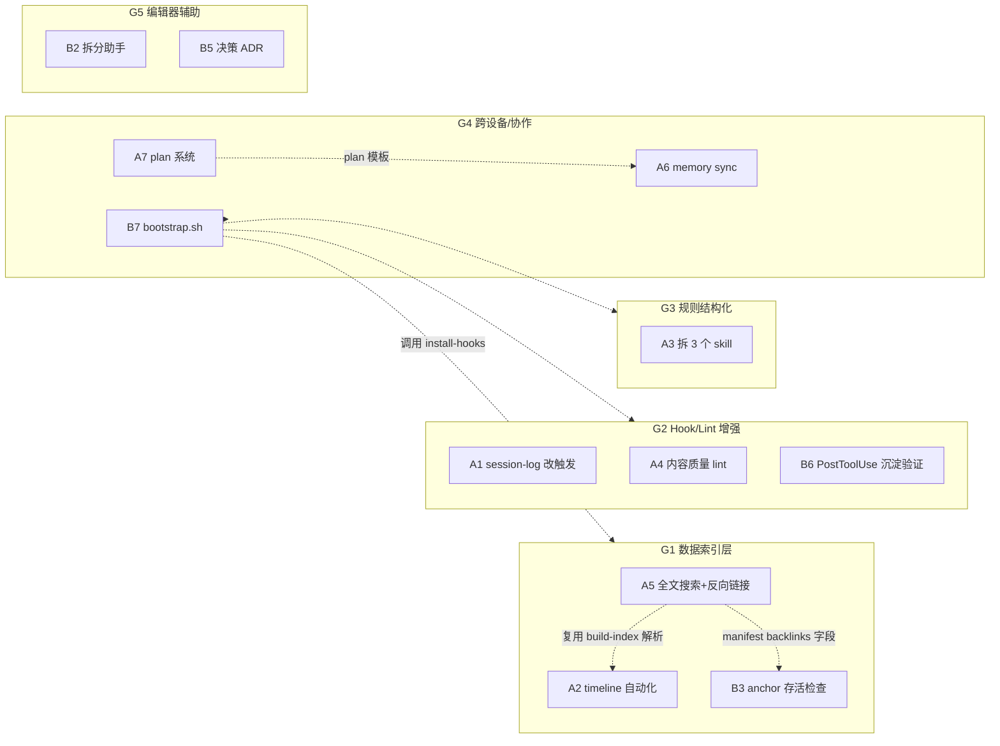
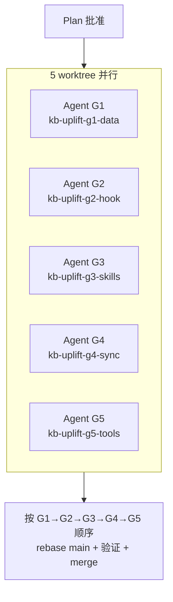

# 设计：KB 系统升级 13 项（数据 / Hook / 规则 / 同步 / 编辑器辅助）

> 日期: 2026-06-01 | 状态: 待实现 | 类型: master spec（含 5 组并行执行）

## 背景

2026-06-01 audit 暴露了 ANS AI Auto Notes 项目的几类结构性问题：

- **AI 自律漏规则**：CLAUDE.md 203 行 + 多个隐性约定，每次冷启动都漏几条（本次 session 漏了 auto-commit 规则）
- **文档化机制空转**：30 天 176 commits，但 `.claude/session-logs/` 只 3 个文件，Stop hook 触发不匹配真实使用流
- **手维护数据**：`timeline.json` 全靠人工，git log 已经含同样信息
- **跨设备假设缺失**：`memory/` 在 `~/.claude/projects/...`，clone repo 到新机器 memory 全丢
- **拆分疲劳**：3 个 md 文件长期 >1000 行警告，但拆分代价大（重命名 + 子文件 + 交叉链 + INDEX）
- **机制盲区**：anchor 链接没有存活检查、内容质量风格规则只靠 AI 自律、新设备 onboarding 无文档

13 项改动按变更面分 5 组，组间几乎独立可并行：

| 组 | 项 | 主题 |
|---|---|---|
| G1 数据索引层 | A2 / A5 / B3 | timeline 自动化、全文搜索 + 反向链接、anchor 存活检查 |
| G2 Hook/Lint 增强 | A1 / A4 / B6 | session-log 改触发、内容质量 lint、PostToolUse 沉淀验证 |
| G3 规则结构化 | A3（含 B1） | 拆 3 个项目级 skill |
| G4 跨设备/协作 | A6 / A7 / B7 | memory 双向 sync、plan 系统、bootstrap.sh |
| G5 编辑器辅助 | B2 / B5 | 拆分助手、决策 ADR |

## 总体架构与依赖



### 冲突文件清单（影响并行调度）

| 文件 | 涉及组 | 冲突缓解 |
|---|---|---|
| `scripts/build-index.js` | G1 (A2, A5, B3) | 组内串行，A5 先做、A2 复用解析、B3 用 lib.js |
| `scripts/arch-lint.sh` | G1 (B3), G2 (A4) | 各加一项 lint，行号不重叠，rebase 时简单 merge |
| `CLAUDE.md` | G3 (A3), G5 (B5) | G3 大改动（缩成索引），G5 只加 1 行，G5 等 G3 完成后 rebase |
| `.claude/settings.local.json` | G2 (B6), G4 (B7) | 各加一段配置，rebase 时手动合并 |
| `exit-check.sh` | G2 (A1) | 单组改动，无冲突 |

### 并行 worktree 调度



集成顺序选 `G1→G2→G3→G4→G5` 的理由：G1 是数据层最底层；G2/G3 不依赖；G4 的 B7 bootstrap 要 reference 前面所有改动；G5 的 B5 要等 G3 把 CLAUDE.md 改完。

## 各组详细 design

### G1 数据索引层（worktree: `kb-uplift-g1-data`）

#### G1.0 前置重构：lib.js 导出 stripInline

- **背景**：B3 anchor 检查需要 `slugify(stripInline(text))`，但当前 `stripInline` 是 `buildToc` 内嵌局部函数（scripts/lib.js:50），不可 require
- **改动**：把 `stripInline` 提为 top-level function，加入 `module.exports` 和 `window` 全局
- **测试**：`tests/lib.test.js` 加 stripInline 单测（覆盖 backtick / 粗体 / 斜体 strip）
- **必须先做**：B3 依赖此重构

#### A2 timeline 自动化（仅 timeline.json）

- **新文件**：`scripts/build-timeline.js`
- **数据源**：`git log --since="6 months ago" --name-only --pretty=format:"%h|%ai|%s"`
- **聚合粒度**：ISO 周（YYYY-Www），输出 `timeline.json` 字段：
  ```
  [
    {
      week: "2026-W22 (05.25 - 05.31)",
      entries: [
        {
          date: "2026-05-31",
          summary: "<commit subject 聚合>",
          links: [{label: <frontmatter title>, url: <path>}]
        }
      ]
    }
  ]
  ```
  保留现有 JSON schema（`weeks[].entries[].summary + links[]`），向后兼容 overview.html 渲染
- **范围澄清**：**仅自动化 `timeline.json`**。`timeline/*.md`（按周叙事性周报）**保留手维护**——其文字含"为什么改 / 感悟"等人类才能写的内容。未来若叙事性也要自动化（基于 LLM 总结），单独立项
- **手维护层**：保留 `timeline-highlights.json`（标记"高光周"摘要 + 关键事件），overview 同时 fetch 合并
- **修改**：`timeline.json` 加入 `.gitignore`（构建产物，需 `git rm --cached timeline.json` 一次）；`overview.html` 同时 fetch 两个文件合并
- **测试**：`tests/build-timeline.test.js`（fixture git log → 验证聚合输出 + schema 与现有 timeline.json 兼容）

#### A5 全文搜索 + 反向链接

- **修改**：`scripts/build-index.js`、`scripts/app.js`、`overview.html`
- **全文索引**：
  - 解析每 md 正文（去除 ```mermaid``` / ``` 代码块，保留标题/段落文本）+ frontmatter title/description
  - 分词：中英混合 regex（中文按字符 + 英文按 \w+），转小写
  - 输出 `manifest.json` 新字段 `searchIndex: { token: [fileIdx...] }`（倒排表）
- **反向链接**：
  - 扫描所有 md 的 `[xxx](./path.md)`、`[xxx](../path.md)`、`[[name]]` 链接
  - 解析为绝对路径 → 构建反向图
  - 输出 `manifest.json` 新字段 `backlinks: { "kb/a.md": ["kb/b.md", ...] }`
- **前端**：
  - 顶部加搜索框 `<input id="search">`，输入实时 filter（debounce 100ms）
  - 文件视图底部加"被以下文件引用"区，从 backlinks 渲染
- **测试**：`tests/search.test.js`、`tests/backlinks.test.js`

#### B3 anchor 存活检查

- **依赖**：G1.0（stripInline 必须先 export）
- **新文件**：`scripts/check-anchors.js`（arch-lint.sh 调用）
- **修改**：`scripts/arch-lint.sh` 加 `[14/14] anchor 存活检查` → `node scripts/check-anchors.js`
- **算法**：
  - 用 `grep -roE '\]\([^)]*\.md#[^)]+\)' kb/` 提取所有含 `#anchor` 的链接
  - 对每个 `(target.md, anchor)` 二元组：
    - Read target.md，extract H1-H6 标题
    - 用 `scripts/lib.js` 的 `slugify(stripInline(...))` 算 slug 集
    - 验证 anchor ∈ slug 集
- **报告级别**：警告（不阻断 SessionStart），列出失效 anchor + 来源文件
- **测试**：`tests/anchor-check.test.js`（fixture 含有效 + 失效 anchor，验证报告）

### G2 Hook/Lint 增强（worktree: `kb-uplift-g2-hook`）

#### A1 session-log 改触发条件

- **修改**：`scripts/session-log.sh`、`exit-check.sh [5/7]`
- **状态文件**：`.claude/session-logs/.last-checkpoint`（仅记录"上次生成日志时的 HEAD SHA"）
- **触发逻辑**：
  - Stop hook 调用 session-log.sh
  - 读 `.last-checkpoint`，计算 `git rev-list <last-sha>..HEAD --count`
  - **≥5 才生成新日志**；否则静默退出
- **日志内容**（从 git log 自动汇总）：
  - `commits` 列表（hash + subject）
  - `涉及主题`：按 commit 涉及文件读 frontmatter title 去重
  - `today 累计 commits`
- **同日多次**：仍 append 到同一文件；checkpoint 推进到最新 HEAD
- **测试**：`tests/session-log.test.js`（mock git log，验证触发判定 + 输出格式）

#### A4 内容质量 lint

- **修改**：`scripts/arch-lint.sh` 加 `[15/15] 内容具象度`
- **白名单**：脚本顶部声明
  ```bash
  CONTENT_QUALITY_WHITELIST=(
    "kb/读书笔记"   # 读书笔记可以是纯文字
  )
  ```
- **检查规则**：每个非白名单 md 至少含以下任一：
  - ` ```mermaid ` 块
  - ` ``` ` 任意代码块
  - `| ... | ... |` 表格（至少一行）
- **报告级别**：警告，列出缺具象元素的文件路径
- **测试**：`tests/content-quality.test.js`

#### B6 PostToolUse 沉淀验证 hook

- **修改**：`.claude/settings.local.json` 加 PostToolUse hook 配置
- **新文件**：`scripts/verify-claim.sh`
- **触发条件**：
  - matcher: `Write|Edit`
  - 路径筛选：tool input 的 file_path 必须以 `kb/` 或 `memory/` 开头（脚本内判断）
- **验证内容**：
  - 写入后立刻 `[ -f "$file_path" ]` 验证文件存在
  - append 到 `.claude/claim-ledger.log`（一行：`timestamp | tool | file_path | exists/missing`）
- **集成**：`exit-check.sh` 加 `[8/8] 沉淀声明审计`，读 ledger 列出本 session 中 `missing` 的条目
- **测试**：手动测试（hook 行为难以单测）

### G3 规则结构化（worktree: `kb-uplift-g3-skills`）

#### A3 拆 3 个项目级 skill

**首次引入 `.claude/skills/` 目录**（当前不存在）。Claude Code 自动从 `.claude/skills/` 加载项目级 skill，与 `~/.claude/skills/` 全局 skill 并存。

新建目录与文件：

```
.claude/skills/
├── auto-commit-discipline/
│   └── SKILL.md
├── kb-content-style/
│   └── SKILL.md
└── kb-tdd-discipline/
    └── SKILL.md
```

每个 SKILL.md 含 frontmatter：

```yaml
---
name: auto-commit-discipline
description: Use when finishing a batch of file edits OR before responding to user (auto-commit trigger). Also use when Claude Code is about to exit. Enforces conventional commit format, ≥5 auto-push, no skipping hooks.
---
```

**内容拆分映射**：

| Skill | 来自 CLAUDE.md 段落 |
|---|---|
| `auto-commit-discipline` | 「Git 规则」+「会话退出检查」(主要执行部分) |
| `kb-content-style` | 「笔记风格规则」+「文件拆分规则」+「章节编号与标题 ID 规则」 |
| `kb-tdd-discipline` | 「测试纪律（软 TDD）」全段 |

**CLAUDE.md 改动**：对应段落缩成一行索引：
```markdown
### Git 规则
详见 [.claude/skills/auto-commit-discipline/SKILL.md](.claude/skills/auto-commit-discipline/SKILL.md)
```

**触发条件设计**（关键，影响 superpowers 自动加载）：description 字段必须含明确触发动词（"Use when..."），与场景关键词。

**测试**：手动验证（在新 session 中触发场景，看 Skill tool 是否被自动调用）。

### G4 跨设备/协作（worktree: `kb-uplift-g4-sync`）

#### A6 memory 双向 sync

- **新文件**：`scripts/sync-memory.sh`
- **同步路径**：
  - 源 A：`~/.claude/projects/-Users-xuhu-workspace-xuhuLocal-ans-ai-auto-notes/memory/`
  - 源 B：`.claude/memory-snapshot/`（repo，入 git）
- **算法**：对每个 allowlist 文件，`mtime` 较新者覆盖较旧者（rsync `--update` 语义）
- **Allowlist**：`.claude/memory-snapshot/.allowlist`，每行一个文件名（基于安全考虑，新增 memory 需手动加白名单）
- **使用流程**：
  - 用户改了重要 memory 后 → `bash scripts/sync-memory.sh`
  - 新设备 clone 后 → bootstrap.sh 自动跑一次（覆盖方向：snapshot → 本机）
- **exit-check 提示**：检测到 `~/.claude/projects/.../memory/` 有变更但 snapshot 未更新时，提示用户跑 sync
- **测试**：`tests/sync-memory.test.js`（fixture 两侧文件 + 不同 mtime，验证同步方向）

#### A7 plan 系统

- **复用路径**：`docs/superpowers/plans/`（superpowers writing-plans 默认输出位置）
- **CLAUDE.md 加一句**：
  ```markdown
  ### Plan 系统
  长期任务的 plan 位于 `docs/superpowers/plans/`。新 plan 通过 superpowers `writing-plans` skill 生成。
  ```
- **exit-check 加 `[9/9] plans 状态汇总`**：扫 `docs/superpowers/plans/*.md`，从 frontmatter `status:` 或 H1 下方 `> 状态:` 段提取，列出 `进行中` 的 plan
- **测试**：`tests/plans-status.test.js`

#### B7 bootstrap.sh

- **新文件**：项目根 `bootstrap.sh` + `SETUP.md`
- **步骤序列**（每步失败即终止 + 打印诊断）：
  1. 探测 `claude --version`，记录版本（未安装则提示安装链接）
  2. `bash scripts/install-hooks.sh`（pre-push hook）
  3. 检查 `~/.claude/settings.json` 是否存在（不存在则提示手动创建，给出 minimal 模板）
  4. 检查 `~/.claude/projects/.../memory/` 目录是否存在；不存在则 mkdir + 从 `.claude/memory-snapshot/` 复制
  5. `node scripts/build-index.js`（生成 manifest.json + INDEX.md）
  6. `bash test.sh`（全绿才算 bootstrap 成功）
- **SETUP.md**：人类可读版本（步骤说明 + FAQ + 截图占位）
- **测试**：手动验证（在干净 vm/docker 跑）

### G5 编辑器辅助（worktree: `kb-uplift-g5-tools`）

#### B2 拆分助手

- **新文件**：`scripts/split-doc.js`
- **用法**：
  ```bash
  node scripts/split-doc.js kb/.../big.md --sections "章节A,章节B"
  ```
- **算法**：
  - 用 lib.js 解析 md → 拆出每个 H2 段落（按 `^## ` 切割）
  - 抽出 `--sections` 指定的章节 → 生成新 md 文件（文件名按章节标题，遵循中文文件名规则）
  - 在原文件留替换标记：
    ```
    > 已拆分到 [[新文件标题]]：<原章节摘要 1 行>
    ```
  - 自动跑 `node scripts/build-index.js`
- **错误处理**：章节名不匹配 / 输出文件已存在 → 报错退出
- **测试**：`tests/split-doc.test.js`（fixture md 文件 → 验证拆分结果 + INDEX 数量）

#### B5 决策先例 ADR

- **新文件**：`docs/decisions.md`
- **格式**：单文件，每决策一段，ID 单调递增
  ```markdown
  ## ADR-001: <短标题>

  - 日期: YYYY-MM-DD
  - 状态: 接受 / 已替换 / 已弃用
  - 背景: <为什么需要决策>
  - 选项: <考虑过的方案>
  - 决定: <选了什么>
  - 理由: <为什么>
  ```
- **CLAUDE.md 加一句**：
  ```markdown
  ### 决策先例
  遇到分类歧义或重大架构决策，先看 [`docs/decisions.md`](docs/decisions.md)。新决策追加 ADR。
  ```
- **首批种子 ADR**：补 1-2 条已知历史决策作为示例（例如 "AI 子树 5 个子目录划分理由"）
- **不强制每决策必写**：只在 AI 摇摆或人主动判断时补 ADR

## 测试策略

| 组 | 测试要求 |
|---|---|
| G1 | TDD 强制（markdown 渲染 / 路径解析 / frontmatter 解析高风险区） |
| G2 | hook 脚本 dry-run + arch-lint 新增项必须有 fixture 测试 |
| G3 | skill 文件无需测试（纯文档） |
| G4 | sync 脚本必须 fixture 测试（双向覆盖逻辑易错） |
| G5 | split-doc 必须 TDD（路径解析） |
| 总验收 | 5 worktree 全完成 + `bash test.sh` 全绿 + `bash scripts/arch-lint.sh` 0 错误 |

## 集成与验收

1. 每 worktree 完成后：
   - 自测 `bash test.sh` 全绿
   - push 自己 branch（`kb-uplift-gN-xxx`）
2. 主仓串行集成（顺序 G1→G2→G3→G4→G5）：
   - 每组 rebase 到 main
   - 解决冲突文件（参考第 2 节冲突清单）
   - 跑全量 test + arch-lint
   - merge 到 main
3. 全部 merge 后：
   - 跑 `bash bootstrap.sh` 验证 fresh setup 流程
   - 验证 overview.html 搜索 + 反向链接可用
   - 写一条 ADR 记录本次升级（dogfood B5）

## YAGNI 清单（刻意不做）

- A2 timeline 不做"自动识别周高光"（人工 highlights 文件足够）
- A5 搜索不做模糊匹配 / 拼音 / 同义词（vanilla 倒排够用）
- B6 沉淀 ledger 不做 LLM 语义匹配（基础文件存在性已覆盖 80% 场景）
- A6 memory 不做冲突合并 UI（mtime 较新者覆盖）
- A7 不重建 plan 模板（复用 superpowers writing-plans 输出）
- B2 拆分助手不做交互式 prompt（命令行参数足够）
- B7 bootstrap.sh 不自动改 `~/.claude/settings.json`（敏感文件，仅提示）

## 风险与缓解

| 风险 | 缓解 |
|---|---|
| 5 worktree 并行后冲突文件 rebase 难 | 冲突文件清单提前列出（第 2 节），每组改动尽量在文件不同位置 |
| skill 触发条件设计不当导致不自动加载 | A3 完成后手动测试触发场景，迭代 description |
| memory snapshot 包含敏感信息 | allowlist 机制 + 用户每次手动加入 |
| timeline 自动化丢失人工 highlights | 保留 `timeline-highlights.json` 手维护层 |
| anchor 检查产生大量历史失效告警 | 首次跑后批量修复历史失效链接，后续作为正常 lint |
