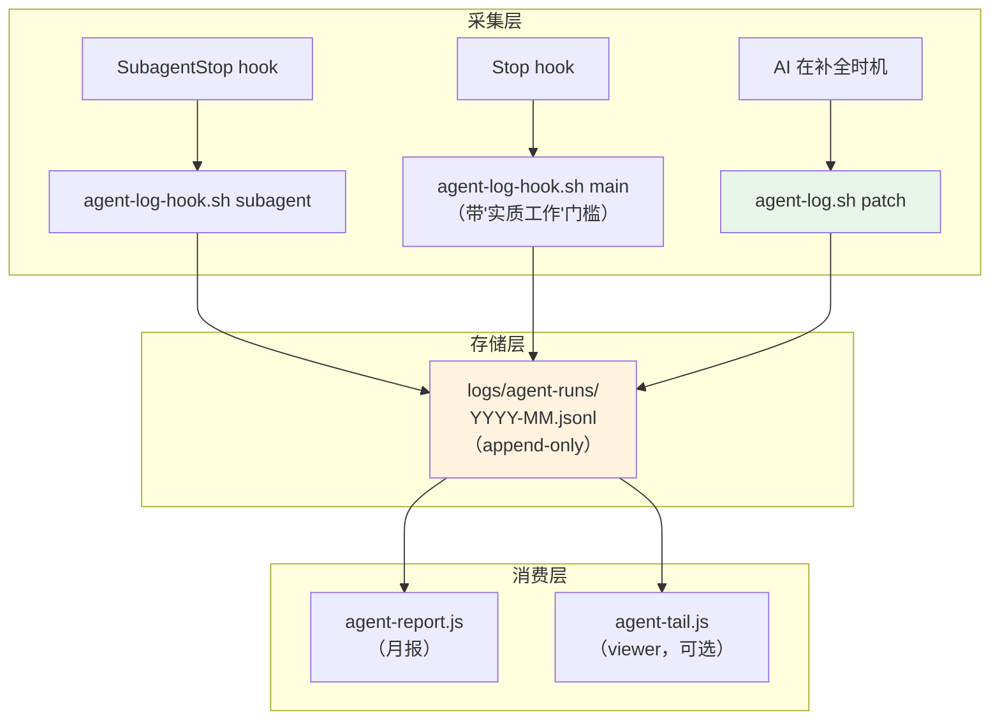
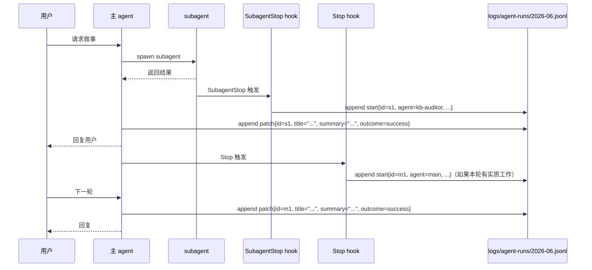

# Agent Runs 通用日志系统设计

> 目标：用一个通用的事件日志记录主 / 子 agent 的每次"实质工作"，方便后续做深度分析（agent 调用频次、耗时分布、失败率、工具使用习惯等）。

## 1. 背景与目标

### 1.1 触发场景

CLAUDE.md §6 计划补 3 个项目级 subagent（kb-auditor / plan-executor / idea-extractor）。一旦多个 agent 并存，需要一个**统一的事件日志**回答这类问题：
- 这个月 kb-auditor 被调了几次？平均耗时？哪几次失败？
- 主 agent 哪些任务最吃 context（spawn 子最多 / 工具调用最频繁）？
- 我（用户）和 AI 协作的整体节奏是怎样的？

### 1.2 目标

- **采集**：主 agent 每轮实质工作 + 每次 subagent 调用，自动记录一行日志
- **schema**：结构化字段，便于程序分析（不只是人读）
- **append-only**：永不修改历史行，新信息追加新行（event sourcing）
- **消费**：1 个月报脚本立刻可用；1 个 viewer 脚本作为可选 polish
- **零侵入**：不修改现有 hook 链路的语义；与 session-log.sh 各司其职

### 1.3 非目标（YAGNI）

- ❌ 实时 dashboard / SPA 集成
- ❌ 跨项目日志聚合
- ❌ Token / Cost 统计（transcript 解析复杂，未来按需加）
- ❌ 警报系统（失败率高时告警）

---

## 2. 整体架构



**三层职责**：
- 采集层：hook 写"机械字段"，AI 补"语义字段"
- 存储层：按月分文件 JSONL，永不修改已写入行
- 消费层：月报 + viewer 都做 fold（按 id 合并 start + patch）

---

## 3. Schema 设计（Event Sourcing）

### 3.1 两种事件

JSONL 每行一个 JSON object，`event` 字段区分类型：

**`event: "start"`** — agent 完成一轮工作时由 hook 写入

```json
{
  "event": "start",
  "id": "r-2026-06-02-21-50-3a7f",
  "time": "2026-06-02T21:50:14+08:00",
  "agent": "main",
  "parent_id": null,
  "tools_used": ["Read", "Edit", "Bash"],
  "files_changed": ["kb/课程笔记/识别自动化机会的方法论.md"],
  "duration_ms": 487213,
  "outcome": "unknown",
  "model": "claude-opus-4-7",
  "title": null,
  "summary": null
}
```

**`event: "patch"`** — AI 在结束时机追加，补全 title/summary/outcome

```json
{
  "event": "patch",
  "id": "r-2026-06-02-21-50-3a7f",
  "time": "2026-06-02T21:51:02+08:00",
  "title": "修复 kb 含空格 .md 链接",
  "summary": "218 处链接包裹为 <尖括号>，47 文件。加 fix 脚本和防回归检查",
  "outcome": "success"
}
```

### 3.2 字段语义

| 字段 | 类型 | 写入方 | 必填 | 说明 |
|------|------|--------|------|------|
| `event` | "start" \| "patch" | 全部 | ✅ | 区分事件类型 |
| `id` | string | 全部 | ✅ | `r-YYYY-MM-DD-HH-MM-<rand4>`，全局唯一 |
| `time` | ISO 8601 | 全部 | ✅ | 事件发生时刻 |
| `agent` | "main" \| "<subagent-name>" | start | ✅ | spawn 来源 |
| `parent_id` | string \| null | start | ❌ | subagent 的 parent_id 指向调用方 main 的 id |
| `tools_used` | string[] | start | ✅ | 本次用到的工具去重列表 |
| `files_changed` | string[] | start | ✅ | Edit/Write/NotebookEdit 改过的文件相对路径 |
| `duration_ms` | number | start | ✅ | 工作总耗时 |
| `outcome` | "success" \| "partial" \| "blocked" \| "unknown" | start/patch | ✅ | start 写 "unknown"，patch 补 |
| `model` | string | start | ✅ | 模型 ID |
| `title` | string \| null | start/patch | ⚠️ | start 写 null，patch 补 |
| `summary` | string \| null | start/patch | ⚠️ | 同上 |

### 3.3 Fold 规则（读取时按 id 合并）

```
按 id 分组 → 取该 id 的 start 事件作为 base
         → 按 time 顺序应用每个 patch（后写覆盖先写）
         → 输出最终 record
```

实现在 `scripts/lib-agent-log.js` 提供 `foldEvents(events) → record[]`，月报和 viewer 都复用。

### 3.4 schema 演进策略

- 加字段：start 事件加新字段，旧记录缺该字段读取时 fallback 默认值
- 删字段：永不真删，月报忽略该字段即可
- 改字段语义：新增字段 + deprecated 旧字段，禁止原字段含义改变

---

## 4. 采集机制

### 4.1 SubagentStop hook → agent-log-hook.sh subagent

Claude Code 在 subagent 结束时触发 `SubagentStop` hook，stdin 传入 JSON 含 `transcript_path`：

```json
{ "transcript_path": "/path/to/subagent-transcript.jsonl", "subagent_name": "kb-auditor", ... }
```

`scripts/agent-log-hook.sh subagent` 做的事：
1. 从 stdin 拿 transcript_path 和 subagent_name
2. 读 transcript JSONL，统计：
   - `duration_ms` = last_message.time - first_message.time
   - `tools_used` = uniq(tool_use blocks 的 name)
   - `files_changed` = 从 ToolUse Edit/Write/NotebookEdit 抽 file_path
   - `model` = transcript 中 assistant message 的 model 字段
3. 生成 id（`r-YYYY-MM-DD-HH-MM-<rand4>`，可从 transcript 时间戳确定）
4. 追加一行 start 事件到 `logs/agent-runs/YYYY-MM.jsonl`

> Plan 阶段需验证：Claude Code 实际 SubagentStop hook 的 stdin JSON schema。如果没有 `subagent_name` 字段，备选方案是从 transcript 第一个 user message 内容或 transcript 文件路径推断 agent 名。

### 4.2 Stop hook → agent-log-hook.sh main

Claude Code 在主 agent 一轮回复结束时触发 `Stop` hook。

`scripts/agent-log-hook.sh main`：
1. 同样从 stdin 拿 transcript_path
2. **门槛判断**：本轮（自上次 Stop 以来）有任一**写入/副作用工具**调用 → 写一条 start；否则 skip（纯聊天 / 纯查询）
   - 写入/副作用工具白名单：`Edit` / `Write` / `NotebookEdit` / `Bash` / `Task`（spawn subagent）
   - 只读工具（不触发）：`Read` / `Grep` / `Glob` / `WebFetch` / `WebSearch` / `TodoWrite` / `AskUserQuestion`
3. 字段抽取同 subagent
4. `parent_id` = null（主 agent 没有 parent）

### 4.3 AI 补全 → agent-log.sh patch

主对话或 subagent 结束工作后，AI 调用：

```bash
bash scripts/agent-log.sh patch \
  --id last \
  --title "修复 kb 含空格 .md 链接" \
  --summary "218 处链接包裹..." \
  --outcome success
```

- `--id last` 是语法糖，指**当前月份** JSONL 文件最后一条 start 事件的 id（不跨月，避免月初歧义）
- `--id <full-id>` 指定具体 id（如补昨天的）
- patch 命令本身做 append（写一行 `event:"patch"`），永不修改原行

### 4.4 数据流时序图



---

## 5. 存储 & gitignore

- **路径**：`logs/agent-runs/2026-06.jsonl`
- **按月分文件**：避免单文件无限增长；月报脚本默认读当月
- **README**：`logs/agent-runs/README.md` 说明 schema + 怎么用
- **gitignore**：顶层 `logs/` 不在现有 `.gitignore` 范围内 → 默认进 git
- **大小预期**：每月 ~100-500 条记录，<100KB，可承受

---

## 6. 消费工具

### 6.1 月报脚本：scripts/agent-report.js

```bash
node scripts/agent-report.js          # 当月报告
node scripts/agent-report.js 2026-06  # 指定月份
node scripts/agent-report.js --since 2026-04  # 多月汇总
```

输出示例（注：以下数字假设 3 个 subagent 已上线，本 spec 落地时只有 main 数据）：

```
========== Agent Runs 月报 2026-06 ==========

总调用数: 87
  主 agent: 52
  kb-auditor: 18
  plan-executor: 12
  idea-extractor: 5

按 agent 统计:
  agent         count  avg_dur(s)  success%  blocked%
  main             52       142.3     94.2%      1.9%
  kb-auditor       18        78.5    100.0%      0.0%
  plan-executor    12       324.1     83.3%      8.3%
  idea-extractor    5        45.2     80.0%     20.0%

工具使用 Top 5:
  Bash: 213 次
  Read: 178 次
  Edit: 92 次
  Grep: 67 次
  Write: 21 次

失败/阻塞记录（outcome != success）:
  - r-2026-06-15-14-23 plan-executor blocked: "测试一直 hang，未定位"
  - ...
```

### 6.2 Viewer 脚本：scripts/agent-tail.js（可选 polish）

```bash
node scripts/agent-tail.js          # 渲染当月最近 20 条
node scripts/agent-tail.js -n 50    # 最近 50 条
node scripts/agent-tail.js -f       # follow（tail -f 风格）
```

输出（终端友好表格）：

```
时间               agent          标题                              耗时    outcome
2026-06-02 21:51  main           修复 kb 含空格 .md 链接           8m07s   ✓
2026-06-02 22:14  kb-auditor     审 Transformer.md 深度           1m23s   ✓
2026-06-02 22:30  main           开始日志系统设计                  -       …
```

落地排序：月报脚本必做（plan 任务）；viewer 排在 plan 最后一步（用户已确认）。

---

## 7. AI 补全纪律（新 feedback memory）

新增 `memory/feedback-agent-log-patch.md`：

```markdown
---
name: feedback-agent-log-patch
description: subagent 调用结束 / 主 agent 完成一轮实质工作后，必须立即 patch agent-log 补 title/summary/outcome
metadata:
  type: feedback
---

完成一轮实质工作后（spawn 了 subagent / 改了文件 / 跑了脚本），
在向用户发送响应前必须调用：

  bash scripts/agent-log.sh patch --id last \
    --title "<本轮一句话标题>" \
    --summary "<干了啥的 1-3 句>" \
    --outcome success|partial|blocked

**Why**: hook 只能采集机械字段（工具、文件、耗时），title/summary 反映任务的"为什么和结果"——
没有 AI 补的话日志只能做"工具使用频次"这种浅层分析。

**How to apply**:
- 触发时机：和 auto-commit-discipline 同位（每完成一批文件变更后）
- 偷懒识别：如果你刚跑了 `git commit` 但没 patch agent-log，那就是漏了
- 跳过条件：本轮纯聊天 / 纯回答问题（hook 也不会写 start 事件，自然不用 patch）
```

补到 `MEMORY.md` 索引。

---

## 8. 测试策略

- `tests/agent-log.test.js`：
  - hook 脚本对 sample transcript JSONL 的字段抽取正确（duration / tools / files / model）
  - patch 命令对 `--id last` 解析正确
  - fold 函数对 start + N patch 合并结果正确
- `tests/agent-report.test.js`：
  - 月报脚本对 sample JSONL 的统计正确（count / avg / success% / 按 agent 分组）
- arch-lint.sh 不改（日志不是 KB 内容，不在它的检查范围内）

---

## 9. 与现有系统的关系

| 现有 | 关系 |
|------|------|
| `scripts/session-log.sh` | 互补：session-log 记 git commit 级别的"日报"；agent-log 记 agent 调用级别的"任务流水"。两者粒度不同，并存。 |
| `.claude/session-logs/` | 不动 |
| `.claude/settings.local.json` 中现有 hook | 在 `Stop` 和 `SubagentStop` 数组各加一条调用，不影响已有 hook |
| `exit-check.sh` | 不动 |
| `verify-claim.sh` (PostToolUse) | 不动 |
| `arch-lint.sh` | 不动 |

---

## 10. 落地步骤（粗，由 plan 阶段细化）

1. **基础设施**：`scripts/lib-agent-log.js`（id 生成、event 写入、fold 函数）+ 单测
2. **采集脚本**：`scripts/agent-log-hook.sh`（subagent / main 两个子命令）+ 单测
3. **patch 命令**：`scripts/agent-log.sh patch ...` + 单测
4. **Hook 接入**：`.claude/settings.local.json` 加 Stop / SubagentStop 调用
5. **月报脚本**：`scripts/agent-report.js` + 单测
6. **AI 纪律**：`memory/feedback-agent-log-patch.md` + `MEMORY.md` 索引
7. **README**：`logs/agent-runs/README.md`（schema + 用法 + fold 规则）
8. **Viewer 脚本**：`scripts/agent-tail.js`（可选，最后一步）

---

## 11. Open Questions（设计阶段已闭合，列在此供 plan 阶段确认）

- ✅ 主 agent 粒度：每轮实质工作（Stop hook + 工具调用门槛）
- ✅ schema 详细度：增强版（含 parent_id / tools / files / outcome / model）
- ✅ 采集机制：hook 写机械字段 + AI 补语义字段
- ✅ 存储位置：`logs/agent-runs/YYYY-MM.jsonl`，进 git
- ✅ append-only：event sourcing 模式，start + patch
- ✅ 消费工具：月报必做，viewer 可选
