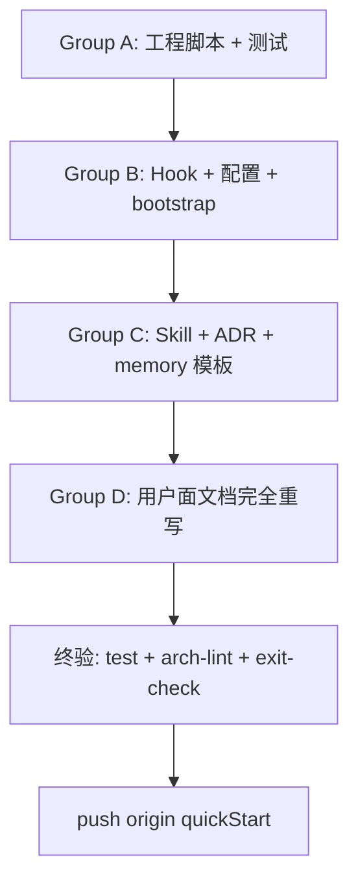

# 设计：quickStart 分支 Harness KB 模板化升级

> 日期: 2026-06-02 | 状态: 待实现 | 类型: 跨分支迁移 spec

## 背景

`quickStart` 分支当前是 main 的"裸骨架快照"（commit `643d71b`，2026-05 创建），含完整工程结构但缺 74 个 main commits 的 KB 系统升级（13 项 G1-G5）。本轮升级把 main 上的工程产物 + 文档框架复刻到 quickStart，让它成为**完整的 Harness KB 模板**：任何人 clone + `bash bootstrap.sh` 即可获得 main 同等 harness 能力，但 kb/ 是空模板。

**quickStart 缺的 14 个文件**（spot check）：
- 脚本：`build-timeline.js` / `check-anchors.js` / `check-content-quality.sh` / `verify-claim.sh` / `sync-memory.sh` / `list-open-plans.js` / `split-doc.js` / `bootstrap.sh`
- 文档：`SETUP.md` / `docs/decisions.md`
- Skill：3 个 `.claude/skills/*/SKILL.md`
- 升级：`scripts/lib.js`（缺 stripInline export）、`scripts/build-index.js`（缺 search/backlinks）、`scripts/arch-lint.sh`（13 项 vs main 15 项）、`scripts/session-log.sh`（无 checkpoint 机制）、`exit-check.sh`（7 项 vs main 9 项）

**保持 quickStart 性质**：不带任何用户个人 KB / memory / timeline 周报 / 个人化 README 表述。

## 总体策略

按变更类型分 4 组（线性集成，无需 worktree）：



不迁移：
- ADR-003 KB uplift（main 的开发历程，模板用户无意义）
- 5 个集成期 audit notes（仅 main 开发档案）
- timeline/*.md 周报（个人叙事性内容）

## Group A：工程脚本 + 测试迁移

**改动文件清单**（17 项）：

| 来源 (main) | 目标 (quickStart) | 操作 |
|---|---|---|
| `scripts/lib.js` | `scripts/lib.js` | 替换（含 stripInline export） |
| `tests/lib.test.js` | `tests/lib.test.js` | 替换（含 stripInline 测试 +5） |
| `scripts/build-index.js` | `scripts/build-index.js` | 替换（含 tokenize / buildSearchIndex / extractLinks / buildBacklinks） |
| `tests/build-index.test.js` | `tests/build-index.test.js` | 替换 |
| — | `scripts/build-timeline.js` + `tests/build-timeline.test.js` | 新建（含 TIMELINE_SINCE env） |
| — | `scripts/check-anchors.js` + `tests/anchor-check.test.js` | 新建 |
| — | `scripts/check-content-quality.sh` + `tests/content-quality.test.js` | 新建 |
| — | `scripts/verify-claim.sh` + `tests/verify-claim.test.js` | 新建 |
| — | `scripts/sync-memory.sh` + `tests/sync-memory.test.js` | 新建 |
| — | `scripts/list-open-plans.js` + `tests/plans-status.test.js` | 新建 |
| — | `scripts/split-doc.js` + `tests/split-doc.test.js` | 新建（含 4 个 audit fix 后的版本） |
| — | `tests/search.test.js` + `tests/backlinks.test.js` | 新建 |
| `scripts/session-log.sh` | `scripts/session-log.sh` | 替换（含 checkpoint + bash 3.2 ${VAR} 修复） |
| `scripts/arch-lint.sh` | `scripts/arch-lint.sh` | 替换（13 → 15 项 + 孤儿豁免 + 防御 `${VAR:-0}`） |

实施方式：从 main 直接 `git show main:<path> > <quickStart 中相同路径>`，逐个验证。

## Group B：Hook + 配置 + 入口

| 文件 | 操作 |
|---|---|
| `bootstrap.sh` | 新建（7 步：claude 探测 → install-hooks → 全局 settings 检查 → 注入 PostToolUse → memory sync → 构建索引 → 跑测试） |
| `SETUP.md` | 新建（人类可读 setup 文档 + FAQ） |
| `exit-check.sh` | 替换（7 → 9 项：[8/9] 沉淀审计 + [9/9] plans 状态） |
| `.gitignore` | 替换：`.claude/*` + `!.claude/skills/` + `!.claude/memory-snapshot/` + 加 `timeline.json` + `.claude/session-logs/.last-checkpoint` + `.claude/claim-ledger.log` 段 |
| `scripts/preflight.sh` | 替换（同步 main 最新版本） |

`.claude/settings.local.json` **不入 git**（按 .gitignore 规则）。模板用户跑 bootstrap 时会被注入 PostToolUse hook。

## Group C：Skill + ADR + 记忆模板

| 文件 | 操作 |
|---|---|
| `.claude/skills/auto-commit-discipline/SKILL.md` | 新建（直接 cp main） |
| `.claude/skills/kb-content-style/SKILL.md` | 新建（cp + 检查 frontmatter title 段是否需要去个人化） |
| `.claude/skills/kb-tdd-discipline/SKILL.md` | 新建（cp + 把 tests/ 树例子按 quickStart 实际更新） |
| `docs/decisions.md` | 新建，含 3 条**通用架构 ADR**：<br>• ADR-001: AI 子树拆 5 个并列子目录（基础/大模型/Claude-Code/AI-Coding/应用）<br>• ADR-002: 零 npm 依赖原则<br>• ADR-003: 物理目录拆分优于 metadata 字段（来自 feedback-physical-structure-over-metadata） |
| `.claude/memory-snapshot/.allowlist` | 新建（空文件 + 头部注释说明） |
| `.claude/memory-snapshot/README.md` | 新建（解释 memory snapshot 用法） |

注意：不带 main 上的 8 个 memory 文件实际内容（个人偏好），仅留 README + allowlist 模板。

## Group D：用户面文档完全重写

### `README.md` — 完全重写为「Harness KB 模板」导向

新结构：
```
1. 一句话定位：基于 Harness Engineering 的个人知识库模板
2. 5 分钟 Quick Start (git clone + bash bootstrap.sh + ./serve.sh)
3. 核心能力（mermaid 三层模型 + 6 组件 + 15 项 arch-lint + 9 项 exit-check + 3 skill + ADR 体系）
4. 目录结构（main 最新版本）
5. 个性化你的 KB（改 CLAUDE.md 用户背景 / 加 kb/ / 写 ADR）
6. 进阶用法（split-doc / sync-memory / build-timeline / Plan 系统 / Worktree）
7. 常见问题
```

原 README 的"作者初衷"等个人化段落全部移除。

### `README_EN.md` — 同步翻译重写

按 README.md 结构翻译。

### `CLAUDE.md` — 替换为 main 的 153 行 G3 缩减版 + 模板化调整

具体调整：
- 「用户背景」段保留但内容改占位提示：`<!-- 模板用户：把这段改成你自己的背景 -->`
- 「项目定位」去掉个人化措辞
- skill 索引 / Plan 段 / 退出检查段全部从 main 复制
- 知识库结构示例段更新为 main 最新版本

### `说明.md` — 检查并简化

如果与 README 重叠 → 简化为 1 句话指向 README；否则保持。

### `kb/实战/demo-harness-walkthrough.md` — 新建示范笔记

主题：**Git 工作流速查**（中性话题，模板用户人人能理解）

演示 4 类 harness 能力 in action：
1. Mermaid 流程图（git 状态机：working tree / index / HEAD / remote）
2. 表格（常见命令对比：merge vs rebase, reset 三种 mode）
3. anchor 链接（章节内链 + 链接到同目录其他 demo）
4. 与其他 demo 双向关联（`> 关联: ../读书笔记/demo-reading-notes.md`）

控制在 80-150 行。**目的**：让模板用户看到"什么样的笔记是符合规范的"。

### `INDEX.md` — 由 build-index 自动生成

跑一次 `node scripts/build-index.js` 重生成（含新 demo）。

### `timeline.json` — 加入 .gitignore

构建产物，从 git tracking 移除（与 main 一致）。bootstrap.sh 跑 build-timeline 自动生成。

## 测试策略

所有迁移过来的脚本必须保留 main 版本的测试。**期望测试数**（main 实测分布）：

| 测试文件 | main 数量 | quickStart 期望 |
|---|---|---|
| lib.test.js | 18 | 18（含 stripInline 5 个） |
| build-index.test.js | 14 | 14 |
| server.test.js | 12 | 12（不变） |
| link-renderer.test.js | 9 | 9（不变） |
| verify-claim.test.js | 8 | 8（新建） |
| split-doc.test.js | 8 | 8（新建，含 4 个 audit fix 测试） |
| plans-status.test.js | 8 | 8（新建） |
| backlinks.test.js | 7 | 7（新建） |
| build-timeline.test.js | 6 | 6（新建，含 buildGitLogCmd 2 个） |
| sync-memory.test.js | 5 | 5（新建） |
| content-quality.test.js | 5 | 5（新建） |
| search.test.js | 4 | 4（新建） |
| anchor-check.test.js | 4 | 4（新建） |
| session-log.test.js | 3 | 3（新建，含 bash 3.2 回归 1 个） |
| integration.test.js | 1 | 1（kb 内容少但仍通过，覆盖现有 demo） |
| **总计** | **112** | **112** |

## 集成顺序

线性集成 **A → B → C → D → 终验**：

```bash
# 切到 quickStart 分支
git checkout quickStart
git pull origin quickStart

# Group A：工程脚本 + 测试（跑 test.sh 验证）
# Group B：Hook + 配置（跑 arch-lint + exit-check 验证）
# Group C：Skill + ADR + 记忆模板
# Group D：文档完全重写 + 跑 build-index 重生成 INDEX.md

# 终验
bash test.sh
bash scripts/arch-lint.sh
bash exit-check.sh
bash bootstrap.sh    # 在 mktemp clone 中跑

# Push
git push origin quickStart
```

每组完成后单独 commit，**Conventional Commits 中文**（参考 main 风格）。

## 验收标准

- `bash test.sh` ≥ 100 tests pass
- `bash scripts/arch-lint.sh` 0 errors（warnings ≤ 2，预期 demo 文件可能触发内容质量警告，按需补内容或加白名单）
- `bash exit-check.sh` 干净
- `bash bootstrap.sh` 在 fresh 临时 clone 中跑通 7 步
- README 中的 quick start 命令真实可用（手动验证）
- 模板用户视角：clone + bootstrap 后能立刻 `./serve.sh` 看到 demo 内容渲染 + 试用 split-doc / sync-memory 等工具

## YAGNI 清单（刻意不做）

- 不写 ADR-003 "KB uplift 13 项整体决策"（这是 main 的开发历程，模板用户拿到时这事已经发生过了）
- 不带 5 个集成期 audit notes（`docs/superpowers/integration-notes/g4.md` 等）
- 不带 main 上的 6 个 memory 文件实际内容（仅留模板）
- 不带 timeline/*.md 周报（个人叙事性）
- 不在 kb/ 加额外个人内容（保留现有 2 demo + 加 1 个 demo-harness-walkthrough）
- 不为 demo-harness-walkthrough 写多语言版本

## 风险与缓解

| 风险 | 缓解 |
|---|---|
| arch-lint 在内容稀少的 quickStart 上误报（[15/15] 内容质量、[3/15] 死链） | 跑一遍后按需给 demo 加 mermaid/表格/代码 满足 lint，或 demo 列入 check-content-quality 白名单 |
| bootstrap.sh 在 quickStart 跑时 build-timeline 生成空 timeline.json | 测试验证；空 git log 时输出 `[]` 不报错 |
| README 完全重写删了用户精心设计的"作者故事"段落 | spec self-review 后让用户 review，被否决就改方案 |
| .claude/skills/ 在新机器 clone 后是否真能被 Claude Code 自动发现 | bootstrap 完成后 SETUP.md 提示用户重启 Claude Code session 让 skill 生效 |
| memory-snapshot 模板里如果没合理 example，模板用户不会用 | README + memory-snapshot/README.md 两处明确说明用法 |

## 集成与最终交付

完成后 push origin quickStart，给用户交付清单：
- 修复 commits 数（预期 4 组各 1-2 个 commit + 终验，约 6-8 commits）
- 测试通过数 / arch-lint warnings / exit-check 状态
- bootstrap 验证截图（终端输出）
- README 改写前后对比关键差异
