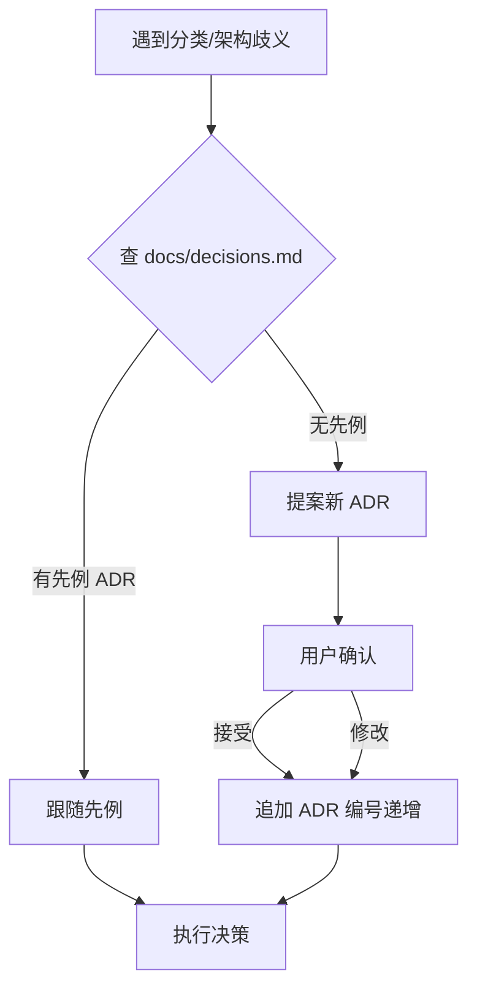

> 最后整理: 2026-08-01 | 来源: 对话讲解 + 本项目 docs/decisions.md 实践

## ADR 是什么

**ADR = Architecture Decision Record（架构决策记录）**。Michael Nygard 提出的模式：把每个重要的架构/分类决策，按固定格式记成一条，编号单调递增，存到一个文件里。

核心目的：**让"为什么这么决定"不靠人脑记忆**。三个月后你忘了为什么 AI 笔记放 `技术/AI/应用/` 而不是 `技术/AI/`，翻 ADR 就能找到当时的理由。

## 为什么需要（场景）

知识库运营里最常见的摇摆：

```
你：Spring AI vs LangChain 的对比笔记，放哪？
AI（第 1 次）：放 技术/AI/应用/
AI（第 3 次）：放 技术/AI/大模型/  ← 因为聊到大模型了
AI（第 7 次）：放 技术/编程语言/   ← 因为聊到多语言了
```

没有 ADR，分类会随对话上下文漂移，目录结构越来越乱。有了 ADR，AI 在分类歧义时**先查历史决策**，有先例就跟随，没先例就提案新 ADR——决策被固化下来，不再每次从零拍。

## ADR 格式

每条 ADR 用固定字段，便于 AI 快速解析：

| 字段 | 内容 | 示例 |
|---|---|---|
| 编号 | 单调递增，不回收 | `ADR-001` |
| 标题 | 短，决策本身 | `AI 子树拆 5 个子目录` |
| 日期 | 决策时间 | `2026-05 起` |
| 状态 | 接受 / 提案 / 废弃 | `接受` |
| 背景 | 为什么要做这个决策 | `AI/ 内容膨胀到 >15 文件，混合多子领域` |
| 选项 | 考虑过的备选 | `(a) 保持单层 (b) 拆 2 个 (c) 拆 5 个` |
| 决定 | 选了哪个 | `(c)` |
| 理由 | 为什么选这个 | `5 子领域边界清晰，物理目录就是分类` |

## 本项目怎么用



- **文件位置**：`docs/decisions.md`（单一文件，所有 ADR 按编号顺序排列）
- **编号规则**：单调递增（ADR-001、ADR-002…），**编号一旦分配永不回收**——即使决策被废弃，编号也留着（废弃状态），不把旧编号分给新决策
- **AI 调度**：CLAUDE.md 的"决策先例（ADR）"章节告诉 AI——遇到分类歧义先看 `docs/decisions.md`，新争议点决策后追加 ADR
- **模板用户**：quickStart 分支的 `docs/decisions.md` 含 3 个示例 ADR + 一个"新 ADR 模板"代码块，fork 后照着写

## 真实示例：ADR-001（本项目）

> AI 子树内容膨胀，是按 frontmatter tag 隐式分组，还是物理拆子目录？

**背景**：`kb/技术/AI/` 单层 >15 文件，混了基础概念 / 大模型 / Claude Code / AI Coding / 应用 5 个子领域。

**选项**：
- (a) 保持单层，用 frontmatter `tags` 字段分组
- (b) 拆 2 个子目录（基础 / 应用）
- (c) 拆 5 个并列子目录

**决定**：(c) 拆 5 个物理子目录。

**理由**（记下来就不会再摇摆）：
- 物理目录就是分类——`build-index.js` 扫目录生成 manifest，overview.html 按目录树渲染，用户一眼看到分类
- frontmatter tag 是隐式的，AI 容易写错或漏写，物理目录是强约束
- 5 个子领域每个 ≥3 文件，边界清晰

这个决策记下来后，后续所有 AI 相关笔记都按 5 子目录归类，再没漂移过。

> 关联：[[../技术/AI/Claude-Code/Harness Engineering：AI Agent 时代的工程范式.md]]（Harness 三层模型里 ADR 属于"文档层"）、本仓库 `docs/decisions.md`（完整 ADR 列表）
