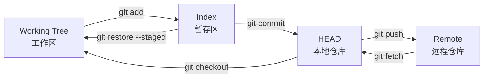

# Git 工作流速查（Harness 示范笔记）

> 最后整理: 2026-06-02 | 来源: 通用知识 + 项目实战
> 关联: [demo-reading-notes](../读书笔记/demo-reading-notes.md) — 演示双向关联

## 一句话定位

这是一篇**示范笔记**，目的不是真的学 git，而是给模板用户看："符合 Harness KB 规范的笔记长什么样"。

## 1. Git 状态机（Mermaid 流程图）

Git 的核心抽象是 4 个区域 + 区域间的搬运操作：



理解了这个图，90% 的 git 命令就是在搬运数据。

## 2. 常用命令对比表

### merge vs rebase

| 维度 | `git merge` | `git rebase` |
|---|---|---|
| **历史形态** | 保留分叉，多一个 merge commit | 线性，无 merge commit |
| **commit hash** | 不变 | **变**（rebase 重写 commit）|
| **冲突处理** | 一次性解决 | 逐个 commit 解决（可能多次） |
| **何时用** | 共享分支（main、develop） | 私人 feature 分支 |
| **不能用** | / | 已 push 的 commit（force push 风险） |

### git reset 三种 mode

| 模式 | 影响范围 | 何时用 |
|---|---|---|
| `--soft` | 只动 HEAD，IDX/WT 不变 | 想合并最近几个 commit 但保留改动 |
| `--mixed`（默认） | 动 HEAD + IDX，WT 不变 | 想撤销 add，保留改动 |
| `--hard` | HEAD + IDX + WT 全动 | **危险**：彻底放弃改动 |

⚠️ 用 `--hard` 前先 `git stash` 或 `git branch backup-xxx` 备份。

## 3. 实战场景

### 场景 1: 误 commit 了密钥/敏感文件

```bash
# 还没 push
git reset --soft HEAD~1   # 撤回 commit，保留改动在 IDX
# 编辑文件移除密钥
git restore --staged secret-file
git commit -m "fix: remove secret"

# 已经 push（更麻烦）
# 1. 立即 rotate 密钥（最重要）
# 2. 用 git filter-repo 重写历史
# 3. force push（团队协调）
```

### 场景 2: 想拆一个大 commit 成几个小的

```bash
git reset --soft HEAD~1   # 撤回 commit，IDX 保留全部改动
git reset                 # 把 IDX 也清空（改动还在 WT）
git add file1
git commit -m "feat: A"
git add file2
git commit -m "fix: B"
```

### 场景 3: rebase 中遇到冲突

```bash
git rebase main
# CONFLICT: ...
# 编辑文件解决冲突
git add <conflicted-file>
git rebase --continue
# 或者放弃: git rebase --abort
```

## 4. 项目内的应用

本 KB 项目用了几个 git 进阶能力（详见 [CLAUDE.md](../../CLAUDE.md)「Git 规则」段）：

- **Pre-push hook 跑 test.sh + mermaid 守恒**：`scripts/git-hooks/pre-push`
- **Conventional Commits**：`feat: / fix: / docs: / refactor: / chore:`
- **≥5 commits 未 push 时 Stop hook 自动 push**：`exit-check.sh [7/9]`
- **永不 amend 已 push 的 commit**：见 `auto-commit-discipline` skill

## 5. 进阶资源

- [Pro Git Book](https://git-scm.com/book) — 官方权威教程
- `man git-<command>` — 每个命令的完整文档
- [Oh Shit, Git!?!](https://ohshitgit.com/) — 常见翻车场景速查

## 笔记说明

本文示范了符合 KB 规范的几个要素：

| 要素 | 本文体现 |
|---|---|
| Mermaid 图 | §1 Git 状态机 flowchart |
| 表格对比 | §2 merge vs rebase / reset 三模式 |
| 代码块 demo | §3 实战场景三段 bash |
| anchor 内链 | §4 引用 CLAUDE.md「Git 规则」段（`#git-规则`）|
| 跨文件关联 | 顶部 `> 关联: ../读书笔记/demo-reading-notes.md` |
| 元信息头 | `> 最后整理: ... | 来源: ...` |
| frontmatter | `title:` + `description:` |

模板用户：把这文件当模板用，按你的真实主题写笔记即可。
