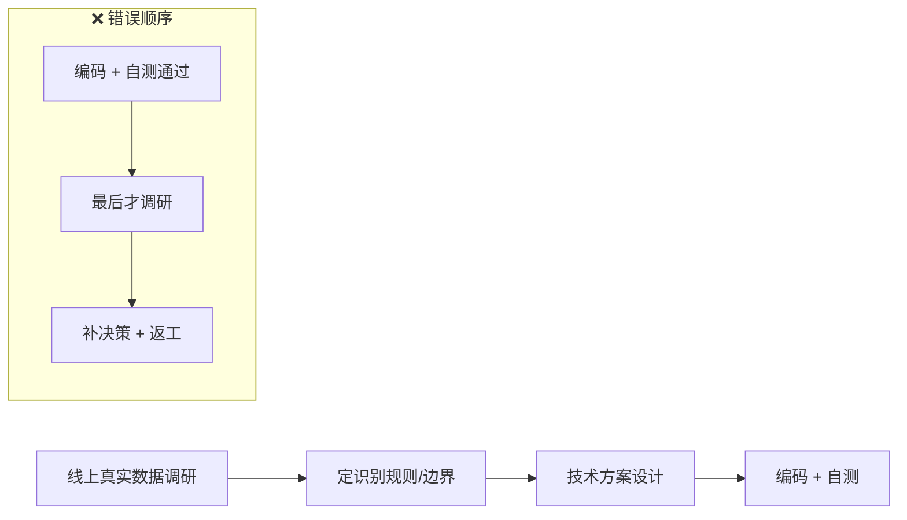

# 设计前未做数据调研导致返工

> 最后整理: 2026-08-21 | 来源: OMMUSIC-3593553（LRC 翻译歌词自动识别拆分）踩坑复盘

> 关联: [ADR 架构决策记录](<./ADR 架构决策记录.md>) — 决策先例归档方式
> 关联: [外部参考链接](<./外部参考链接.md>) — 相关方法论资料

## 一句话定位

做一个「自动识别某类数据」的需求时，设计阶段**没有先用线上真实数据摸清数据脏度和边界**，识别规则是基于「臆想的干净输入」拍脑袋定的，结果功能都自测通过、准备上线了，才第一次拉真实数据验证核心假设，发现真实数据远比想像脏，被迫补决策 + 返工。

---

## 1. 背景：一个真实的翻车案例

**需求**（OMMUSIC-3593553）：版权方（believe、太合等）上传的歌词常是「原文 + 译文」合在一份 LRC 里（同一毫秒时间戳下紧挨两行）。系统要自动识别：发现「同一毫秒恰好两行」→ 第 1 行原文、第 2 行译文 → 拆出翻译写入 translrc、原文清掉译文行。

**核心判定规则**只有一条假设：**「同一毫秒恰好两行 = 原文 + 译文」**。

**踩坑时间线**：

| 时间 | 发生了什么 |
|------|-----------|
| 08-05 ~ 08-06 | 设计文档 + 全部核心决策一次性定稿，开始编码 |
| 08-13 | 16 个 case 真实环境自测**全部通过**，功能「已经做完」 |
| 08-21（最后一天） | 才第一次拉**半年 208 万条**歌词变更离线分析 |
| 08-21 | 基于调研结果补「元信息标签过滤」决策 13，返工 |

**问题**：功能都自测通过、准备上线了，才第一次用真实数据验证那条核心假设——结果发现真实数据里 285 种「`[标签:`」脏形态，远超设计时的想像。

---

## 2. 真实数据暴露了什么（设计时完全没想到的脏形态）

用 208 万条歌词变更 + 10.2 万条配对做了量化，发现「同毫秒恰好两行」里混着三类东西：

| 配对类型 | 数量 | 占比 | 设计时是否想到 |
|---------|------|------|--------------|
| 真翻译 | 93762 | 92.05% | ✅ |
| **角色词误配对**（作词/作曲/混音等同毫秒碰撞） | 7844 | **7.7%** | ❌ 完全没想到 |
| **元信息标签误配对**（`[ti:]`/`[ar:]`/`[by:]`） | 257 | 0.25% | ❌ 完全没想到 |

再钻一层，真实脏数据的面貌比「3 类」复杂得多——光「`[标签:`」形态就枚举出 **285 种**：

- **该过滤的 LRC 标准标签**只有 6 个：`ti/ar/by/al/offset/length`（歌名/歌手/制作者/专辑/偏移/时长）
- **不该过滤的**（会被误删真歌词）：
  - `[Chorus:]`/`[Verse:]`/`[Hook:]`/`[Intro:]`/`[Outro:]` —— 是歌词正文结构，过滤会误删真歌词
  - `[Johnny:]`/`[Kenny:]`/`[Absinthe:]` —— 演唱者人名，属歌词正文
  - `[composer:]`/`[lyricist:]`/`[arr:]` —— 作词/作曲/编曲角色词，集合开放
  - `[NaN:NaN]`/`[00:]`/`[01:]` —— 时间戳被误解析成标签形态
- **角色词**更失控：半年冒出来 **1580 种**（作词/作曲/混音/编曲/制作人…），还混入大量人名（饭卡/阿浩/鹅），**根本无法可靠自动过滤**——最后只能甩给运营「确认是否接受 7.7% 残留」。

---

## 3. 根因：顺序反了 + 自测样例的盲区

### 根因 1：顺序反了

正确顺序应是：
```
先数据调研 → 再定识别规则/边界 → 再设计 → 再编码
```
实际是：
```
编码 + 自测全通过 → 最后一天才调研 → 补决策 13 返工
```
「数据调研」从「设计的前置」变成了「上线的兜底」，本质上是把该前置验证的动作推迟到了错误的位置。

### 根因 2：自测通过 ≠ 方案正确

08-13 的 16 个 case 全过，但那些都是**人工构造的理想样例**：
```
[00:05.00]第一句歌词
[00:05.00]First line
```
恰恰漏掉了真实数据里最容易踩的脏形态（元信息标签、角色词、时间戳误配）。**真实数据是一次性、大批量、非构造的，是构造样例永远凑不齐的。**

### 根因 3：边界决策没有数据佐证

决策 13「只过滤 6 个标准标签、零误伤真翻译」之所以能做出，靠的是 208 万条 / 10.2 万配对的量化佐证；「角色词不纳入过滤」这个**放弃**决定，也是数据证明「集合开放 + 混入人名 + 1500+ 种，过滤必误伤」才敢下。**没有数据，这些「做/不做哪个边界」的决策都只能拍脑袋。**

---

## 4. 提炼的方法论（铁律）

> 识别/解析/分类/规则判定类需求，设计「什么算 A、什么算 B」的判定规则之前，**必须先用线上真实样本跑一遍，摸清数据脏度与边界，再定规则和兜底范围**。否则规则基于「臆想的干净输入」设计，注定返工。

五条铁律：



1. **顺序不可颠倒**：先数据调研 → 再定规则 → 再设计 → 再编码。
2. **核心假设必须用真实数据验证**：判定依据在真实样本上跑一遍，不臆想。
3. **自测通过 ≠ 方案正确**：自测样例是构造的，凑不齐真实脏数据。
4. **边界/兜底/阈值决策必须由真实数据量化佐证**：能回答「误伤多少」。
5. **调研结论落到方案**：分布表/样本枚举/误伤率量化写进设计文档作为依据。

---

## 5. 可复用检查清单（设计前自检）

- [ ] 方案里每条判定规则，是否都已在真实数据上验证过、而非臆想？
- [ ] 边界/兜底/阈值，是否有真实数据的量化佐证（不是「我觉得」）？
- [ ] 是否先做了数据调研、才定的方案（顺序对）？
- [ ] 调研产物（分布表/样本枚举/误伤率）是否写进了设计文档？
- [ ] 能否回答「为什么会误伤、误伤多少」？

---

## 6. 落地位置

- **用户级全局铁律**：已写入 `~/.claude/CLAUDE.md`（所有 session 自动加载，规避 raven 更新覆盖）。
- **知识库 memory**：`memory/feedback-design-data-investigation-first.md`。
- **团队分享文档**：OMMUSIC-3593553 需求目录下的独立踩坑复盘 md（面向人阅读）。
