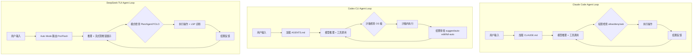

# AI 编程工具：CLI Agent 与 GUI IDE 全景对比

> 最后整理: 2026-05-18 | 来源: 多轮对话

## 一句话定位

AI 编程工具分两大形态——**终端 Agent**（Part A）和 **GUI IDE**（Part B），各自代表不同的人机协作哲学：

| 形态 | 工具 | 特点 |
|------|------|------|
| **终端 Agent** | Claude Code | 推理最强，Agent Loop 最成熟，权限系统最完善 |
| | Codex CLI | 速度最快，OS 级沙箱最安全，执行入口最多样 |
| | DeepSeek-TUI | 成本碾压，1M 上下文，并行处理独门优势 |
| **GUI IDE** | Cursor | "精准手术刀"——你告诉它改哪里 |
| | Windsurf | "协作副驾驶"——它感知你要去哪 |

**选哪一个，取决于你优先考虑模型能力、工程安全、成本，或交互形态。**

> 关联: [claude-code-architecture](../Claude-Code/Claude Code 整体架构 & 工作流程.md) — Claude Code 技术架构 | [llm-agent-mcp](../大模型/Agent 与 MCP.md) — Agent 与 MCP 基础

---

# Part A · 终端 AI 编程 Agent

---

## 0. 速览：一句话概括各自的核心卖点

```
Claude Code:    "我推理最深，复杂重构交给我"        → SWE-bench 80.9%
Codex CLI:      "我速度最快，安全最硬"              → Terminal-Bench 77.3%, OS 级沙箱
DeepSeek-TUI:   "我便宜到不心疼，上下文最大"         → ¥10/次, 1M tokens, RLM 并行
```

---

## 1. 背景信息

| | Claude Code | Codex CLI | DeepSeek-TUI |
|---|---|---|---|
| **开发者** | Anthropic（官方） | OpenAI（官方） | Hunter Bown（个人） |
| **语言** | TypeScript (Node.js) | Rust（codex-rs，~60 crates） | Rust (ratatui TUI) |
| **许可证** | 闭源 | Apache 2.0 | MIT |
| **GitHub Star** | — | 62K-72K | 23K+ |
| **默认模型** | Claude Opus/Sonnet/Haiku | GPT-5.3/5.4/5.5 + Codex-Spark | DeepSeek V4 Pro/Flash |
| **订阅费** | $20-200/月 | $20/月起 | 无（纯按量） |
| **发布** | 2024 | 2025.4（Rust 重写 2026） | 2026.1 |

---

## 2. 核心架构差异：三个 Agent 框架怎么跑起来的

### 2.1 三段式对比



三者的 Agent Loop 本质相同（读→想→做→检查→循环），但**关键环节的设计哲学完全不同**：

| 环节 | Claude Code | Codex CLI | DeepSeek-TUI |
|------|------------|-----------|-------------|
| **项目约定** | CLAUDE.md 自动加载 | AGENTS.md 权限提示 | 需改写为 Skill，手动激活 |
| **安全模型** | 权限三层（allow/deny/ask） | OS 级沙箱（Seatbelt/Landlock/Seccomp） | 模式切换（Plan/Agent/YOLO） |
| **执行隔离** | 权限沙箱 | **真正的 OS 内核隔离** | side-git 快照回滚 |
| **错误处理** | 自我纠正能力最强 | 成熟 | 走错后容易越陷越深 |

### 2.2 安全模型：最深层的差异

这是三者设计哲学差异最大的地方：

```
Claude Code:   prompt 级别 → "这个命令需要你审批"
Codex CLI:     内核级别  → "这个进程连文件系统都碰不到"
DeepSeek-TUI:  模式级别  → "YOLO 模式下全自动"
```

Codex CLI 的安全是最"硬"的——它直接在操作系统层面隔离：

| 平台 | 技术 | 效果 |
|------|------|------|
| macOS | Apple Seatbelt | 进程只能访问项目目录，网络可控 |
| Linux | Bubblewrap + Seccomp | 文件系统隔离 + 危险 syscall 过滤 |
| Windows | Restricted Tokens + Proxy Egress | 访问权限限制 + 代理网络策略 |

Claude Code 的 allow/deny/ask 是基于 prompt 的权限管控——灵活、细粒度，但本质上还是依赖模型遵守规则。TUI 的 YOLO 模式就更激进了，全自动放行。

**从安全角度**：Codex CLI > Claude Code > DeepSeek-TUI。但对于日常开发，Claude Code 的 allow/deny/ask 已经够用。

---

## 3. 性能和基准

| 指标 | Claude Code | Codex CLI | DeepSeek-TUI |
|------|------------|-----------|-------------|
| **SWE-bench** | **80.9%** | ~75.2% | 无正式分数 |
| **Terminal-Bench** | 65.4% | **77.3%** | 无正式分数 |
| **上下文窗口** | 200K（原生）/ 1M（部分模型） | 200K-1M（按模型） | **1M**（V4 全系统一） |
| **吞吐速度** | ~100 tok/s | **240+ tok/s**（GPT-5.3-Codex-Spark 达 1000+） | 取决于 DS API |
| **冷启动** | Node.js 启动时间 | **<200ms**（Rust 零依赖二进制） | ~12MB 内存，快速启动 |

Codex CLI 的速度优势来自两个层面：GPT-5.3-Codex-Spark 专为代码优化的模型架构 + 在 Cerebras WSE-3 硬件上跑（首个非 NVIDIA 生产 LLM 部署）。Claude Code 的模型推理更深，但单次调用更慢。

### 3.1 实测：修同一个 Bug 任务

| 维度 | DeepSeek-TUI | Codex CLI | Claude Code |
|------|-------------|-----------|-------------|
| 发现 Bug 数 | 3/4（漏 1 个） | **4/4** | **4/4** |
| 修复成功率 | 3/3 | **4/4** | **4/4** |
| 耗时 | ~13 分钟 | ~10 分钟 | **~8 分钟** |
| 成本 | **¥2-5** | $40-80 | $30-60 |

> DeepSeek-TUI 漏掉的那个逻辑错误后来被 Codex 审计发现——Agent 工程成熟度还差半步。

---

## 4. 各自独有优势

### 4.1 Codex CLI 的独门绝活

**1. 多执行入口**：Codex CLI 不只是个 TUI，它是一个完整的平台：

```
codex                  → 交互式 TUI（Ratatui）
codex exec             → CI/CD 非交互模式（支持 --ephemeral 临时环境）
codex app-server       → JSON-RPC 给 VS Code/Cursor/JetBrains/Xcode 集成
codex mcp-server       → 把自己暴露为 MCP 工具
codex remote-control   → 远程 headless 操控（v0.130.0）
codex cloud            → 云端沙箱执行 + 可视化 Dashboard
```

这是三者中**执行形态最丰富**的。Claude Code 只有 CLI + IDE 扩展，DeepSeek-TUI 只有 TUI + HTTP serve。

**2. Cloud Sandbox（云端沙箱）**：每次任务在云端独立容器中执行，完全不碰本地文件系统。结果需要你显式批准才合并回来。这对于审查第三方代码、处理不可信 PR 特别有用。

**3. 开源透明**：Apache 2.0，62K+ Star，640+ 版本发布，400+ 贡献者。全部代码可审计。Claude Code 是闭源的。

**4. 速度碾压**：GPT-5.3-Codex-Spark 是专门为代码优化的模型，在 Cerebras WSE-3 上跑到 1000+ tok/s。这意味着它能更快地读完大文件、更快地生成修改。

**5. Voice Input**：空格键触发语音输入（v0.105.0）。

### 4.2 Claude Code 的独门绝活

**1. 推理深度**：SWE-bench 80.9%，复杂多文件重构最强。Opus 4.7 的推理能力仍是标杆。

**2. Agent Teams 多智能体协同**：多个 Agent 分派不同任务协同工作。

**3. CLAUDE.md 项目记忆**：自动加载，项目约定一次定义永久生效。TUI 需要手动改写，Codex 用 AGENTS.md（功能类似但生态不同）。

**4. 成熟生态**：slash commands、hooks、MCP、VS Code/JetBrains 扩展、自定义 Agent。

### 4.3 DeepSeek-TUI 的独门绝活

**1. RLM 1-16 路并行子代理**：唯一支持真正并行批量处理的工具。

```
传统:  任务1 → 任务2 → 任务3 → ...  （串行，等得心累）
RLM:   任务1 ↘
       任务2 → 汇总  （并行，10 个模块的文档一起更新）
       任务3 ↗
```

**2. 成本碾压**：¥10 开发一个应用 vs $40-80（Codex CLI）/ $30-60（Claude Code）。对个人开发者，这是决定性的。

**3. 1M token 上下文**：V4 全系统一支持 1M，不像其他两个依赖特定模型。

**4. Auto Mode 智能路由**：自动在 Pro/Flash 间切换，把省钱自动化。

**5. 9 个 Provider**：不会被任何一个模型供应商锁定。

---

## 5. 全方位对比矩阵

| 维度 | Claude Code | Codex CLI | DeepSeek-TUI |
|------|------------|-----------|-------------|
| **一、模型相关** | | | |
| 默认模型 | Claude Opus/Sonnet/Haiku | GPT-5.x + Codex-Spark | DeepSeek V4 Pro/Flash |
| SWE-bench | **80.9%** | ~75.2% | — |
| Terminal-Bench | 65.4% | **77.3%** | — |
| 吞吐速度 | ~100 tok/s | **240-1000+ tok/s** | 取决于 API |
| 上下文窗口 | 200K-1M | 200K-1M | **1M**（全系统一） |
| 图片输入 | ✅ | ✅ | ❌（纯文本） |
| **二、安全相关** | | | |
| 安全模型 | 权限 allow/deny/ask | **OS 内核级沙箱** | 模式 Plan/Agent/YOLO |
| 沙箱技术 | 权限沙箱 | Seatbelt/Landlock/Seccomp | Seatbelt/Landlock（v0.8+） |
| 云端沙箱 | ❌ | ✅ 每任务独立容器 | ❌ |
| 工作区回滚 | ❌ | ❌ | ✅ side-git 快照 |
| **三、工程成熟度** | | | |
| Agent Loop 稳定性 | **最高** | 高 | ⚠️ 差半步 |
| 工具调用质量 | **几乎不出错** | 成熟 | ⚠️ 偶有错乱 |
| 错误恢复 | **最强** | 强 | 走错后容易越陷越深 |
| 开源 | ❌ 闭源 | ✅ Apache 2.0 | ✅ MIT |
| 维护方 | Anthropic 公司 | OpenAI 公司 | 个人开发者 |
| **四、执行形态** | | | |
| 交互式 TUI | ✅ | ✅ | ✅ |
| CI/CD 非交互 | ✅ | ✅ `codex exec` | ✅ `deepseek` 单次 |
| IDE 集成 | ✅ VS Code/JetBrains | ✅ app-server JSON-RPC | ❌ |
| HTTP 服务 | ❌ | ❌ | ✅ `serve --http` |
| MCP Server | ❌ | ✅ | ✅ |
| Cloud 执行 | ❌ | ✅ `codex cloud` | ❌ |
| Remote Control | ❌ | ✅ v0.130.0 | ❌ |
| Voice Input | ❌ | ✅ v0.105.0 | ❌ |
| **五、生态与扩展** | | | |
| 项目记忆 | CLAUDE.md 自动加载 | AGENTS.md 权限提示 | 需改写 Skill，手动激活 |
| MCP 协议 | 客户端 | 客户端 + Server | 客户端 + Server |
| Skills/Hooks | ✅ | ✅ hooks 系统 | ✅ 跨工具兼容 |
| LSP 诊断 | ❌ | ❌ | ✅ 编辑后实时检查 |
| Provider 灵活性 | 仅 Anthropic | 仅 OpenAI | **9 个 Provider** |
| **六、成本** | | | |
| 订阅费 | $20-200/月 | $20/月起 | 0 |
| 单次任务 | $30-60 | $40-80 | **¥2-10** |
| 月重度使用 | $150-200 | $150-200 | **¥50-100** |

---

## 6. 用 DeepSeek V4 时的兼容性

这是个重要的实际考量——如果你想用 DeepSeek V4，哪些工具能用？

| 工具 | 适配状态 | 说明 |
|------|---------|------|
| **Claude Code** | ⚠️ 固定模式可用 | 环境变量直连 `/anthropic` 端点，97%+ 兼容；但不能动态切模型 |
| **Codex CLI** | ❌ 不可用 | `reasoning_content` 字段处理有问题，工具调用必报错 |
| **DeepSeek-TUI** | ✅ 原生适配 | 为 V4 量身打造，完整支持 reasoning_content + thinking stream |

> DeepSeek V4 强制要求 tool_call 消息携带 `reasoning_content` 字段——这是导致 Codex CLI 直接不可用的根因，Claude Code 靠 DeepSeek 官方的适配层兜底，TUI 是原生实现。

这意味着：**如果你选 DeepSeek V4，Codex CLI 直接出局；选 GPT-5.x 则 Claude Code 和 TUI 都不能用；选 Claude Opus 则只有 Claude Code 能用。** 模型选择和工具选择是高度耦合的。

---

## 7. 怎么选？——场景决策树

### 7.1 按模型选择（这是最重要的第一层决策）

```
你用什么模型？
├── Claude Opus/Sonnet → Claude Code（唯一解）
├── GPT-5.x            → Codex CLI（唯一解）
├── DeepSeek V4        → Claude Code 或 DeepSeek-TUI（Codex CLI 不支持）
└── 本地/多模型混合     → DeepSeek-TUI（9 个 Provider）
```

### 7.2 当模型可以任选时，按场景选工具

```
你的首要考量是？
├── 复杂推理、架构重构     → Claude Code + Opus（SWE-bench 80.9%，最强推理）
├── 安全合规、不可信代码     → Codex CLI（OS 级沙箱 + Cloud Sandbox 隔离执行）
├── 个人开发、成本敏感       → DeepSeek-TUI（¥10/次，性价比碾压）
├── 日常编码、最快速响应     → Codex CLI（240+ tok/s，编辑体验最流畅）
├── 批量并行、多模块处理     → DeepSeek-TUI（RLM 是独门优势）
├── CI/CD 自动化           → Codex CLI（`codex exec --ephemeral` 设计就是干这个的）
├── 超大代码库、1M 上下文   → DeepSeek-TUI（架构原生支持）
├── 多 IDE 集成             → Claude Code 或 Codex CLI
├── 需要切换多种模型          → DeepSeek-TUI（9 个 Provider）
└── 开源审计                → Codex CLI（Apache 2.0）> DeepSeek-TUI（MIT）> Claude Code（闭源）
```

### 7.3 现实中的最优解：组合使用

```
复杂架构决策       → Claude Code + Opus（推理兜底）
日常编码/CR        → Codex CLI + GPT-5.x（速度快，安全好）
批量处理/省钱任务   → DeepSeek-TUI + V4 Flash（RLM 并行，成本极低）
```

三个工具不是互斥的。Skills 目录可以共享，同个仓库交替使用没有额外成本。

---

## 8. 安全提醒

- **DeepSeek-TUI**：v0.8.23 之前有个 CVE-2026-45311（`run_tests` 默认自动批，可 RCE），确保升级
- **Codex CLI**：2026.4 月 Axios 第三方工具安全事件，OpenAI 建议 Mac 用户更新
- **Claude Code**：权限系统设计最成熟，暂无重大安全漏洞

---

## 9. 补充：如果把不同模型接到不同 Agent 框架

有开发者测试了"DeepSeek V4 推理 + Claude 合成输出"的混合架构（DeepClaude）：

| 任务 | 单模型 | 混合 | 结论 |
|------|--------|------|------|
| 简单代码生成 | 87% | 89% | 差异不显著，延迟翻倍不划算 |
| 架构级 Code Review | 71% | **91%** | 提升明显 |
| 回归 Bug 调试 | 67% | **88%** | 提升显著 |

核心发现：混合架构在长链推理任务上有价值，但简单任务性价比低（延迟 ≈ 两者之和 + 编排成本）。

> 💡 一个有意思的现象：Codex CLI 和 DeepSeek-TUI 的主要作者都不是传统程序员出身（一个是 OpenAI 团队，一个是法学院学生），但他们用 AI 辅助造出了顶级 AI 编程工具。这本身就在证明 AI 编程正在大幅降低软件开发的准入门槛——不管你最后选了哪个工具。

---

# Part B · GUI IDE：Cursor vs Windsurf

终端 Agent 之外，还有一类把 AI 集成进图形化 IDE 的方案。两个主流产品都是 VS Code fork，但**交互哲学完全相反**——一个等你下指令，一个主动感知。

## B.1 Cursor —— 以"上下文"为核心

想象你在 Terminal 里问 Claude Code 一个问题，它能读你的整个项目、改文件、跑命令。Cursor 就是把这个体验搬进了图形化 IDE。

```
传统 Copilot:  你写代码 → 它猜下一行（只看当前文件）
Cursor:        你选一堆文件 → 它全部读完 → 在某个文件里改代码
```

### 核心机制

- **Cmd+K 就地编辑**：选中一段代码，用自然语言说"把这个改成流式调用"，它在原位替换
- **Tab 补全（Cursor Tab）**：不只是补一行，能跳多个位置、补整个函数体，预测你下一步编辑哪里
- **Composer（Agent 模式）**：给它一个任务描述，它能跨多个文件改代码、跑终端命令、看 lint 错误自己修
- **上下文来源**：当前文件 + @ 引用的文件/文档/网页 + 最近查看的文件 + 全局 codebase 索引

### 与 Claude Code 的对比

| | Cursor | Claude Code |
|---|---|---|
| 形态 | GUI IDE | 终端 CLI |
| 编辑方式 | 原位 diff 预览，逐个 accept/reject | 直接写文件 |
| 使用场景 | 喜欢 IDE 图形交互 | 喜欢终端一条命令到底 |

## B.2 Windsurf —— 以"流程"为核心

Windsurf 是 Codeium 公司做的，口号是 "Flow State"（心流）。核心理念：**AI 不应该等你下指令，而应该感知你在干什么，主动参与**。

```
Cursor 模式:  你选中代码 → 按 Cmd+K → 输入指令 → AI 执行
Windsurf 模式: 你改了一个函数名 → AI 自动检测到 → 提示"要把引用它的 3 个文件也改了吗？"
```

### 核心机制

- **Cascade（级联智能）**：AI 持续分析你的操作意图，不是等你问才回答。比如你开始写一个 REST 接口，它自动推断你需要 controller → service → repository 全套
- **多步骤自动执行**：跟 Claude Code 更像——它能自动创建文件、安装依赖、跑测试，然后在结果上迭代
- **Supercomplete**：比 Cursor Tab 更激进，能预测你接下来要做的多步编辑

### 交互模型差异

```
Cursor 的交互模型：
  用户主动 → 选上下文 → 发指令 → AI 响应

Windsurf 的交互模型：
  AI 持续感知 → 预判意图 → 主动建议 → 用户确认
  用户也可以主动 → 发指令 → AI 多步执行
```

## B.3 Cursor vs Windsurf 对比

| | Cursor | Windsurf |
|---|---|---|
| 设计哲学 | 精准手术刀——你告诉它改哪里 | 协作副驾驶——它感知你要去哪 |
| 核心优势 | 上下文控制精细，diff 预览好 | 主动感知意图，流程级自动化 |
| 适合人群 | 喜欢掌控感的开发者 | 想要更少操作的开发者 |
| AI 模型 | 自带 + 可接 Claude/OpenAI 等 | 自带 + 可接外部模型 |

两边的方向其实在收敛——Cursor 在加 Agent 自动化，Windsurf 在加强上下文控制。选哪个更多是交互偏好问题，能力和 Claude Code 本质上是同一类东西的不同 UI 形态。

---

## 10. 模型分层与对抗审查：团队级的模型使用策略

除了"一个任务用一个模型"，美团在 31 万行代码重构中实践了一套**模型分层 + 跨厂商对抗审查**策略，值得参考。

### 10.1 模型分层：不同任务用不同模型

```
复杂任务（架构设计、技术方案） → 最强推理模型（Opus/GPT-5）
日常编码（CRUD、单元测试）     → 性价比模型（Sonnet/GPT-5）
自查/Review                    → 不同厂商模型交叉审查
```

这和 DeepClaude 混合架构（第 9 节）的思路不同——不是一次任务里混用多个模型，而是**按任务类型路由到不同模型**，在日常工作中持续分摊成本。

### 10.2 高阶模型审查低阶模型

用高配模型作为 Judge Model，审查低阶模型产出的编码。原理很简单——高配模型的推理能力更强，更容易发现低配模型遗漏的边界条件、异常处理和逻辑漏洞。

```
低成本模型 → 日常编码产出
高配模型   → 作为 Judge，审查低阶模型的产出
           → 发现低阶模型遗漏的边界条件、异常处理、逻辑漏洞
```

### 10.3 不同厂商模型对抗互相审核

```
Claude 写代码 → GPT 审查
GPT 写代码   → Claude 审查
```

**为什么有效？** 不同厂商的模型在训练数据、架构、偏好上不同，犯同样错误的概率大幅降低。实测下来 CR 覆盖面更全。这和 [Harness Engineering](../Claude-Code/Harness Engineering：AI Agent 时代的工程范式.md) 中双 LLM 交叉校验（串行校验模式）是同一个原理。

### 10.4 怎么在现实中落地

```
个人开发者:
  日常编码: 用一个性价比模型
  提交前审查: 切换到另一个厂商的模型自查一轮
  成本几乎为零（切换模型不花钱，只花 token）

团队级别:
  编码阶段: 统一使用性价比模型 + AI Rule 约束风格
  Pre-PR 阶段: 不同厂商模型对抗互相审核
  人工 CR: 只聚焦业务语义
```

> 关联: [AI Coding 团队治理](./AI Coding 团队治理：从个人提效到团队工程化.md) — Pre-PR 机制、零排期重构完整案例
> 关联: [Harness Engineering](../Claude-Code/Harness Engineering：AI Agent 时代的工程范式.md) — 双 LLM 交叉校验四种实现方式
