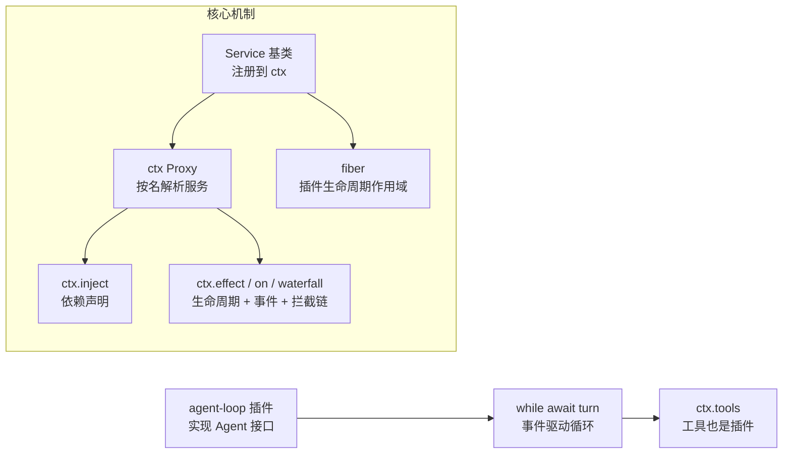
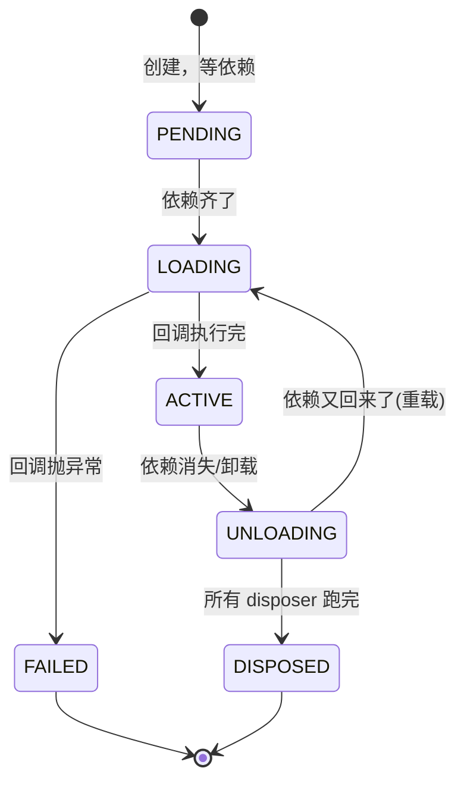
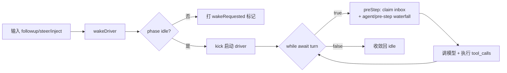

# DSH（DeepSeek Harness）插件架构与循环调度

> 最后整理: 2026-08-20 | 来源: 对话 + DSH 源码分析

> 关联: [Claude Code 整体架构 & 工作流程](../Claude-Code/Claude Code%20整体架构%20&%20工作流程.md) — Claude Code 闭源 Harness 对照 | [Harness Engineering](../Claude-Code/Harness%20Engineering：AI%20Agent%20时代的工程范式.md) — Model + Harness = Agent | [AI 编程工具全景对比](AI%20编程工具：CLI%20Agent%20与%20GUI%20IDE%20全景对比.md) — 终端 Agent 选型

## 0. 一句话定位

**DSH（DeepSeek Harness）** 是 DeepSeek 2026-08-13 开源的 Agent 运行框架（MIT 协议，TypeScript，github.com/deepseek-ai/deepseek-harness）。它不是模型，而是"手脚"：官方公式 **Model + Harness = Agent**。社区称之为"Agent 领域的 Linux 时刻"——发布 42 小时 star 破 10 万。

"一切皆插件（Everything is a Plugin）"是它的核心口号。本文用源码（`vendor/cordis/` + `packages/core/agent-loop/`）+ Java/Spring 类比拆解它到底是什么意思、怎么跑起来、代价是什么。



---

## 1. "一切皆插件" = 依赖注入容器，不是总线

第一反应是"模块化？总线？"——都对了一半。准确类比：**DSH 的插件系统 ≈ Spring IoC 容器，但连内核都是可注入的 Bean**。

### 1.1 插件 = 注册到 ctx 上的服务（≈ Spring Bean）

每个服务继承 `Service` 基类，构造时把自己注册进上下文（`vendor/cordis/src/service.ts:42`）：

```ts
constructor(protected ctx: Context, name: string) {
  // ...
  self.ctx.reflect.provide(name, self)  // 相当于 ApplicationContext 按名注册
}
```

llm、fs、bash、subagent、agent-loop……所有能力都是这种 Service。

### 1.2 ctx = 按名解析的 Proxy（≈ ApplicationContext）

`context.ts:74`：`ctx` 是 Proxy，读 `ctx.llm` 时动态解析到已注册的 llm 服务：

```ts
const self = new Proxy<this>(this, ReflectService.handler)
```

`ctx.xxx` ≈ `context.getBean("xxx")`，只是用属性语法替代方法调用。**"总线感"就来自这个 Proxy——但它是服务解析代理，不是消息总线。**

### 1.3 装配 = cordis.yml（≈ bean 定义文件）

`examples/headless-agent/cordis.yml` 就是一段插件清单：

```yaml
- id: llm-deepseek
  name: '@deepseek-ai/dsh-llm-deepseek'   # 注册一个 llm 服务
  config:
    thinking: enabled
- id: bash
  name: '@deepseek-ai/dsh-bash-local'     # 注册 bash 服务
- id: agent-spine
  name: '@deepseek-ai/dsh-agent-spine-demo'  # 组装成完整 agent
```

换 LLM 提供商？把 `llm-deepseek` 那行换成 `dsh-llm-pi-ai`，一个配置替换，不改代码。

### 1.4 依赖声明（≈ @Autowired）

```ts
ctx.inject(['fs', 'llm'], (ctx) => { ... })
```

声明"我需要 fs 和 llm"，容器保证它们在才执行。

### 1.5 生命周期 + 事件 + 拦截（≈ @PostConstruct + 事件 + AOP）

- `ctx.effect(execute)` — 加载时执行，返回销毁函数（卸载时调用）
- `ctx.on(event, listener)` — 订阅事件
- `ctx.waterfall(name, ...args)` — **有顺序的拦截链**，每个监听器可调 `next()`，≈ Spring AOP 环绕通知

### 1.6 热插拔 = fiber（每个插件一个生命周期作用域）

每次 `ctx.plugin(plugin)` 启动一个 **fiber**（`fiber.ts`），上下文销毁时自动 dispose 该 fiber 的所有 effect——**插件的安装/卸载是一个可独立回滚的事务**。

### 1.7 与 Spring 的本质差异：内核也是 Bean

Spring 里 BeanFactory 本身是特权层，不可替换。DSH 的激进处（`core/README.md`）：

> "dsh-agent-loop is the only package that contains concrete loop logic. Everything else is an abstract service or a plugin against extension points."
> （agent-loop 是整个 harness 里唯一包含具体循环逻辑的包，其他全是抽象服务或扩展点）

**Agent Loop（思考→行动→再思考）是 Agent 的"内核"**，Claude Code 里闭源写死；DSH 里 `dsh-agent` 只定义 `Agent` 接口（零循环依赖），`dsh-agent-loop` 实现它。想自定义循环？写个新插件实现 `Agent` 接口，替换注册即可。**连内核都是可注入的 Bean。**

### 1.8 Java 心智模型对照表

| DSH 概念 | 对应 Java/Spring |
|---|---|
| `Service` 基类 + `super(ctx, name)` | `@Component` + bean 注册 |
| `ctx`（Proxy 按名解析） | `ApplicationContext.getBean(name)` |
| `ctx.inject(['fs','llm'], fn)` | `@Autowired` |
| `ctx.effect()` / `ctx.on()` | `@PostConstruct` / `@PreDestroy` / 事件 |
| `ctx.waterfall()` | AOP 拦截器链 |
| cordis.yml 插件清单 | bean 定义 XML |
| **`ctx.agentLoop` 可替换** | **ApplicationContext 本身可换实现（Spring 做不到）** |

---

## 2. Bean 怎么管理 Bean：响应式依赖，不是中央装配

机制核心在 `fiber.ts` + `reflect.ts`。不是 Spring 那种"容器启动时按顺序 new 一遍"，而是**每个插件自己是一个 fiber，靠"依赖声明 + 可用性通知"协作**。

### 2.1 每个插件是一个 6 态状态机

`fiber.ts:147`：



- **PENDING**：声明 `inject: ['fs', 'llm']`，服务没注册，先等着
- **ACTIVE**：服务已 `provide`，别的插件可用它
- **UNLOADING**：依赖消失，逆序执行所有 disposer

### 2.2 依赖驱动 + epoch 指纹（fiber.ts:597-623）

```ts
_checkImpl(name) {
  const impl = this.ctx.reflect._getImpl(name, true)  // 查服务注册表
  if (!impl) return delete this._store[name]          // 没注册 → 依赖不满足
  this._store[name] = impl                            // 在 → 记入依赖快照
}

_refresh() {
  let epoch = ''
  for (const name of Object.keys(this.inject)) {
    const impl = this._store[name]
    if (!impl) { epoch = INACTIVE; break }  // 任一缺失 → 整个插件 PENDING
    epoch += ':' + impl.fiber.uid            // 用"提供方 fiber uid"做指纹
  }
  this._setEpoch(epoch)
}
```

精妙点：**epoch 指纹**。提供方 fiber 一换（uid 变），依赖它的插件 epoch 就变 → 自动重载。所以"bean 管理 bean"是：

> **注册表（reflect.store）+ 依赖声明（inject）+ 指纹（epoch）+ 状态机（PENDING→ACTIVE）**

### 2.3 注册/卸载 = 广播通知（reflect.ts:277-336）

```ts
provide(name, value) {
  return this.ctx.fiber.effect(() => {
    this.store[key] = impl
    if (this.ctx.fiber.state === ACTIVE) {
      this.notify([name])     // 注册了 → 通知所有依赖它的 fiber
    }
    return async () => {
      delete this.store[key]
      this.notify([name])     // 卸载了 → 再次通知（让依赖方重载）
    }
  }, `ctx.provide(${name})`)
}
```

`notify()` 遍历所有已注册插件的 fiber，检查谁声明 `inject` 含该服务，有则 `_checkImpl` + `_refresh` 重算 epoch。**没有中央调度器顺序装配**，是"注册 = 广播，卸载 = 广播，依赖方靠指纹感知变化自动重载"——相当于 Spring 的 `@Autowired` 加上"依赖变化时自动 re-init"。

---

## 3. 循环调度：agent-loop 的事件驱动 + 收敛循环

核心两个方法：`wakeDriver()`（agent.ts:172）和 `kick()` → `while (await this.turn()) {}`（agent.ts:212）。

### 3.1 事件驱动，不是一直空转

```ts
private wakeDriver(wakeAfterAbort = false): void {
  if (this.phase.kind !== 'idle') {
    // 正在跑 → 只打标记，当前轮收敛后自己消费
    this.phase.wakeRequested = true
    return
  }
  // 空闲 → 启动 driver
  this.setPhase({ kind: 'running', ... })
  this.loopCtx.agents.withInitiator(this, () => this.kick())
}
```

**关键**：agent 空闲时 phase = `idle`，**不占 CPU**。只有新输入（`followup`/`steer`/`inject` → `send()` → `wakeDriver()`）才启动。就像 Spring 的异步任务队列：空闲不轮询，有活才被唤醒。

### 3.2 核心循环：turn 里跑 step

```ts
private async kick(): Promise<void> {
  try {
    while (await this.turn()) {}   // 循环的核心：返回 false 即收敛空闲
  } catch { /* 异常在 driver 边界被吞掉，不崩进程 */ }
}
```

`preStep()`（agent.ts:225）：

```ts
const claimed = this.inbox.claim(target, position.turn)  // 从 inbox 队列取输入
const context = this.runtimeContext.project(...)          // 组装 prompt 上下文
const decision = await this.dispatch.waterfall(
  'agent/pre-step', { messages: claimed, ...position, signal },
  () => Promise.resolve({ kind: 'enter', ... })           // 默认放行
)
```

**工具也是插件**——注册在 `ctx.tools` 上。循环每步调 `agent/pre-step` waterfall，消息发给模型，模型返回 tool_calls，`tool-calls.ts` 通过 `ctx.tools` 查工具执行。**工具调用本身就是"循环调度到插件"**。



---

## 4. 性能开销：有影响，但按事件分摊

"装了一堆插件会慢吗？"——**会，但被设计成"按事件分摊"而不是"全局分摊"**。

### 4.1 启动期：固定开销 + notify O(N²)

每个插件加载：config 校验（`fiber.ts:50`）+ fiber 创建 + `_checkImpl` + 注册触发 `notify()`。`notify()`（reflect.ts:314）**遍历全量已注册插件**检查依赖——每注册/卸载一个服务 O(插件数)，最坏启动时 O(插件数²)。但只发生在装配时刻，一次性。

### 4.2 热路径：每次请求的固定税

**① 每次 `ctx.xxx` 读服务都走 waterfall**（reflect.ts:153）：`internal/get` 瀑布每次读 ctx 上的服务都触发——循环里 `ctx.tools`/`ctx.llm`/`ctx.systemPrompt` 每读一次 dispatch 一次。

**② 每个循环事件都要 dispatch**（events.ts:165），两个隐性成本：

```ts
dispatch(type, args) {
  ...
  return (this._hooks[name] || [])
    .filter(hook => hook.global || !filter || filter.call(thisArg, hook.ctx))  // 过滤
    .map(hook => hook.callback.bind(thisArg))                                   // 每次 bind！
}
```

- **每次 dispatch 都 `.filter().map()` 重建数组**
- **每次都对每个匹配监听器 `.bind()` 新函数**——无缓存，纯分配

### 4.3 兜底设计

**① 按事件名隔离**（events.ts:172）：监听器存 `_hooks[eventName]` 数组，发 `agent/pre-step` 只遍历监听它的插件，**不扫全量**。所以正确认知是：

> 慢，但**不是"插件总数 × 每次请求"**，而是 **"监听同一热事件的插件数 × 该事件触发次数"**。

**② 上下文过滤（isolate）**：子 agent 的监听器通过 `filter.call` 排除，不参与父作用域分发。但过滤本身每次也要算。

### 4.4 结论

| 场景 | 插件数影响 | 严重度 |
|---|---|---|
| 启动/装配 | 每个插件固定开销 + notify O(N²) | 一次性，几十个插件可忽略 |
| 每次请求 | 只和"监听热事件的插件数"成正比；`.filter().map().bind()` 无缓存 | 低-中 |
| **占绝对大头** | **模型 API 调用**（网络+推理+token），秒级 | 插件开销是微秒级 |

真正的性能杀手是"很多插件监听同一热事件"（如几十个 `ctx.on('agent/pre-step')`）。DSH agent-loop README 强调"新行为进插件，别塞进循环"——不是洁癖，是保热路径干净。

---

## 5. 互发事件死循环边界：框架不设防，架构兜底

### 5.1 事实：Cordis 没有任何防递归保护

搜索整个 `vendor/cordis/src/`——**无深度计数、无重入保护、无循环检测**。两个插件互相订阅事件，监听器里互相 `ctx.emit()`，没有任何机制拦住。

### 5.2 同步 emit 实际是"爆栈"不是"死循环"

`emit` 是同步的（events.ts:194）：`dispatch('emit').map(cb => cb(...args))`。互发事件是**同步递归**：

```
ctx.emit('X') → A 监听器 → ctx.emit('Y') → B 监听器 → ctx.emit('X') → ...
```

JS 调用栈有深度上限（V8 约一万层），实际结果是 **`RangeError: Maximum call stack size exceeded`（栈溢出崩进程）**，不是永远转圈。只有异步事件（`parallel`/`serial`）才会真正无限挂死。

### 5.3 但架构设计降低了误踩概率：事件不是驱动通道

DSH 里事件是**通知（side channel）**，不是**指令（control channel）**。agent 循环推进权在 inbox + `turn()` 返回值手里（见 §3），插件互发事件只是旁观者互相喊话，**改变不了循环是否推进**。真正的"循环"必须通过 `followup()/steer()` 往 inbox 塞消息。

**这是设计带来的保护，不是机制层面的护栏**——插件作者真写互发，一样崩。

### 5.4 Java 类比：Spring 也这样

Spring 的 `ApplicationEventPublisher.publishEvent` + `@EventListener` **一模一样**——同步监听器互发事件就是爆栈，同样无防递归保护。这是事件驱动系统的普遍特性：

> 事件循环检测成本高、收益低（正常代码不写互发），框架把职责交给插件作者——**约定：监听器里不要 emit 会触发自己的事件**。

### 5.5 结论

| 事实 | 结论 |
|---|---|
| Cordis 无任何防递归/循环检测 | 是，机制层不设防 |
| 同步 emit 互发 | 栈溢出崩溃（RangeError），不是无限转圈 |
| 事件不是循环驱动通道 | 架构上降低误踩概率，非强制 |
| 异步事件互发 | 真正挂死/内存泄漏（少见，框架内部事件都是同步） |
| Java 类比 | Spring 事件监听器同样无保护 |

**"两个插件互相订阅会死循环"——理解正确，Cordis 确实不设防。**只是（1）同步事件表现为爆栈而非死循环，（2）DSH 靠"事件不驱动循环、循环由 inbox 驱动"降低误踩概率，这是约定不是机制。

---

## 6. 相关与延伸

- [Claude Code 整体架构 & 工作流程](../Claude-Code/Claude Code%20整体架构%20&%20工作流程.md) — 闭源 Harness 的 REPL 循环、Hooks、上下文管理，与 DSH 对照
- [Harness Engineering：AI Agent 时代的工程范式](../Claude-Code/Harness%20Engineering：AI%20Agent%20时代的工程范式.md) — Model + Harness = Agent 的范式基础
- [AI 编程工具：CLI Agent 与 GUI IDE 全景对比](AI%20编程工具：CLI%20Agent%20与%20GUI%20IDE%20全景对比.md) — Claude Code / Codex / DeepSeek-TUI 三方选型
- DSH 源码：`vendor/cordis/`（8 个文件的核心框架）+ `packages/core/agent-loop/`（唯一含循环逻辑的包）
- 深入方向：agent-loop 内部 driver（ReactLoopAgent）逐 turn/step 推进细节、cordis.yml 的 include/insert/patch 覆盖机制
