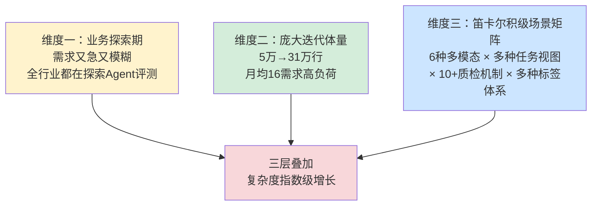
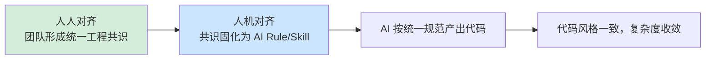
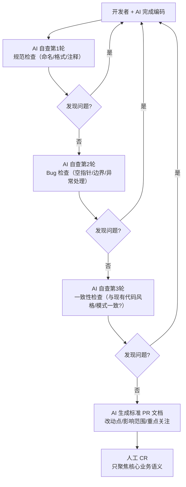
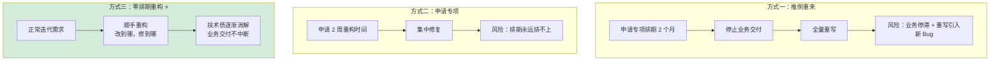
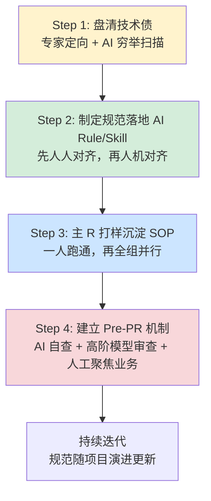
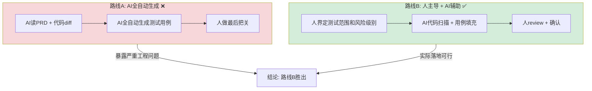

# AI Coding 团队治理：从个人提效到团队工程化

> 最后整理: 2026-05-17 | 来源: 美团技术博客《用Agent评测思路管理AI Coding —— 31万行代码AI重构的实践》(2026-05-07)

## 背景：三层复杂度叠加

美团 Agent 评测系统从 2025 年 6 月的不足 5 万行，快速膨胀至 31 万行，保持着月均 16 个需求（80% 业务 + 20% 技术）的高负荷运转。更关键的是，这个系统面对的是三层复杂度的叠加：



系统底层支持 **6 种多模态数据评测**，上层构建了多种核心任务视图和精细化业务动作，配套 **十余种质检机制**，交织着多种标签体系与动态分配策略。这意味着系统每天需要稳健处理 **成百上千种截然不同的复杂业务流组合**。

更棘手的是人的因素：

- 团队规模一年内 **增至 3 倍**，技术背景高度复杂——涵盖高并发、机器学习离线训练、管理后端开发以及实习生
- **90% 以上代码由 AI 辅助编写**，没有统一规范约束
- 旧架构采用 **"按需求建包"模式**，Controller 等复杂逻辑揉在一个包内，形成了严重的"面条式代码"

团队发现了一个反直觉的事实：**AI Coding 不会自动收敛复杂度**——没有统一规范的约束，不同背景的同学各自用 AI Coding，系统反而会以极快的速度加速腐化。他们在不停止业务交付的前提下完成了这场重构。

---

## 为什么要重构？三个具体痛点

### 痛点一：业务模型亟需升级，"烟囱式"功能开发

旧有数据模型扩展能力不足，几乎每新增一种业务形式都需要新增代码来实现，导致"烟囱式"功能越堆越多。旧架构无法支撑探索性业务。

### 痛点二：代码严重腐化，"牵一发而动全身"

"按需求建包"的开发模式导致代码缺乏合理的工程分层。在 31 万行的体量下，一个看起来不起眼的接口，背后可能挂着一串极长的调用链。很多地方文档不全、大量隐式逻辑和历史兼容分支藏在细节里。日常开发"牵一发而动全身"，一线同学开发异常痛苦。

### 痛点三：协作模式风险放大，AI Coding 加速腐化

> 如果代码库本身风格混乱、团队对规范理解不一致，AI 不会自动纠偏，反而会把差异进一步放大，导致多人协作下持续产出"千人千面"的代码。

大模型生成代码时，会强依赖当前上下文和现有代码模式。代码库本身混乱 + 不同背景的人各自用 AI → AI 把混乱进一步放大。因此，**AI Coding 时代的研发规范已经升级为约束 AI 产出、阻止系统继续长新债的基础设施**，远不止协作建议那么简单。

---

## 三条核心经验

> 关联: [Harness Engineering](../Claude-Code/harness-engineering.md) — AI 时代工程范式 | [AI 编程递进路径](./ai-coding-levels.md) — 6 个 Level | [AI 编程工具](./ai-coding-tools.md) — CLI Agent + GUI IDE 全景对比
> 关联: [外部参考链接](../../../实战/external-references.md) — 本文原文链接

---

## 经验一："人人对齐 → 人机对齐"

这是全文最核心的方法论。灵感来自团队自己做 Agent 评测的经验——先有评估标准，再让模型对齐标准。



### 为什么顺序不能颠倒

```
❌ 跳过"人人对齐"直接写 AI Rule →
   团队每个人对"好代码"的理解不同
   → AI Rule 被不同人解释成不同版本
   → 看似有规范，实际各写各的

✅ 先"人人对齐" →
   拉齐分层原则、建模方式、依赖边界等核心共识
   → 再固化为 AI Rule（always 加载级别）
   → AI 产出的代码风格统一
```

### 具体怎么做

团队从 Agent 评测工作中提炼出一条原则：**1 个"独裁者"好过 10 个"民主者"**——需要一位强有力的角色拉齐所有成员的工程标准。管理 AI Coding 与评测 Agent 的底层逻辑一模一样：先通过规范拉齐团队的工程标准（人人对齐），再通过 AI Rule 和 Skill 约束大模型的生成结果（人机对齐）。

| 阶段 | 动作 | 示例 |
|------|------|------|
| **人人对齐** | 核心开发坐下来，对齐分层原则、命名规范、依赖方向、错误处理模式。针对最容易产生分歧的领域职责，围绕"编排类"与"能力类"的职责边界进行组内统一 | "Service 层不直接调 DAO，必须通过 Manager 层" |
| **人机对齐** | 将对齐结果写成 AI Rule（always 级）+ Skill（渐进式加载）。关键一步是没有把规范停留在文档层面，而是落地为 AI 可执行的约束 | CLAUDE.md 中写死分层规则，AI 每次自动加载 |

**Demo：一个 AI Rule 的写法示例**

```
# 项目架构约束（always 加载）

## 分层规则
- Controller 只做参数校验和路由，不写业务逻辑
- Service 层编排业务逻辑，不直接操作数据库
- Manager 层封装对 DAO/外部 API 的调用
- 依赖方向：Controller → Service → Manager → DAO，禁止反向依赖

## 错误处理
- 业务异常统一用 BizException(code, message)
- Controller 层用 @ControllerAdvice 统一兜底
- 禁止在 Service 层 try-catch 后吞异常

## 命名规范
- 数据库查询方法以 get/list/count 开头
- 写操作方法以 save/update/delete 开头
- 布尔返回值方法以 is/has/can 开头
```

---

## 经验二：Pre-PR 机制——AI 先自查，人再审查

随着 AI 编码效率飙升，Code Review 成了全链路瓶颈。文章用了一个很精准的比喻——**"木桶效应"**：

> AI 极大地压缩了编码时间，压力系统性地向下游 CR 环节集中。**如果 CR 效率不提升，AI Coding 的提效红利会被 CR 瓶颈吞掉。**

一个人的代码量从每天几百行变成几千行，Reviewer 根本看不过来。团队的共识是：

> **人工 CR 的价值，应该从"你写得对吗？"转变为"我们是否在正确的约束下解决正确的问题？"**

### Pre-PR 流程



### Pre-PR vs 传统 PR 对比

```
传统 PR 流程:
  开发者写代码 → 提交 PR → Reviewer 从头看到尾
  Reviewer 时间: 60% 花在"这个变量命名不对""这里少了个 null check"

Pre-PR 流程:
  开发者 + AI 写代码 → AI 自查 3 轮修复基础问题 → 提交 PR + AI 生成的 PR 文档
  Reviewer 时间: 90% 花在"这个业务逻辑对吗""这个设计合理吗"
```

### AI 自查的五个维度

| 维度 | 检查内容 | 举例 |
|------|---------|------|
| **规范类** | 命名、格式、注释、导入排序 | "方法名 `doSomething` 不符合命名规范" |
| **Bug 类** | 空指针、数组越界、资源未关闭、并发安全 | "第 42 行 `user.getName()` 前未判空" |
| **异常处理** | 是否吞异常、错误信息是否有用、是否区分业务/系统异常 | "catch 块只有 `log.error` 没有向上抛，调用方感知不到" |
| **一致性** | 与现有代码风格是否一致、是否复用已有工具类 | "项目中已有 `DateUtils.format()`，这里自己又写了一遍" |
| **性能** | N+1 查询、大循环内 IO、缓存遗漏 | "循环内调用 RPC，批量接口已存在但未使用" |

### 高阶模型审查低阶模型

美团的实践里还有一个有意思的策略——**模型分层**：

```
复杂任务（架构设计、技术方案）    → Opus/GPT-5（最强推理）
日常编码（CRUD、单元测试）        → Sonnet/GPT-5（性价比）
自查/Review                       → 不同厂商模型交叉审查
```

不同厂商的模型错误模式不同，让 GPT 审查 Claude 写的代码（或反过来），比同一个模型自查更容易发现问题。

---

## 经验三：零排期重构——技术债作为"顺带动作"

这是全文最反直觉的一条经验。

### 三种技术债治理方式对比



### 具体怎么做

```
❌ 传统思路:
  "这个模块的异常处理很乱，我们要申请一周专门重构"
  → 排期会上被业务需求挤掉，永远排不上

✅ 零排期思路:
  需求: "用户列表接口加一个按部门筛选的功能"
  
  正常做法:
    在 UserService.listUsers() 里加一个 if (deptId != null) 完事
    1 小时搞定
  
  零排期做法:
    1. 加筛选功能（10 分钟）
    2. 这个方法的异常处理太乱，顺手修了（15 分钟）
    3. 发现了 N+1 查询，改成批量查询（15 分钟）
    4. 发现部门信息缓存没设 TTL，顺手加了（10 分钟）
    5. PR 描述里标注：本次顺便修了 3 个技术债（见 checklist）
    总共 50 分钟，比正常多 40 分钟，但技术债减了 3 个
```

### 关键原则

- **改到哪，修到哪**——不改的代码不动，改到的代码顺手修干净
- **不另起炉灶**——不在需求之外"顺手"做大重构
- **PR 里标注清楚**——让 Reviewer 知道哪些是需求变更，哪些是顺手修的技术债
- **控制范围**——每次顺手修不超过需求的 30% 工作量，防止范围蔓延

### 真实案例

文章中给了两个具体案例：

```
案例 1: 借着某个核心功能迭代需求
  → 顺势设计并落地了全新的业务模型
  → 一举兼容了多条业务链路

案例 2: 借着某个功能升级需求
  → 设计了全新的质检业务模型
  → 3 月下旬完成全量迁移
  → 兼容了多条业务链路 + 多视图、多区域的复杂交叉验证
```

**核心难点不在技术，在拆解能力**——哪些业务需求能"顺带"消化哪些技术债，需要逐个判断：既不能让重构拖慢业务交付，也不能让业务需求绕过技术债继续堆新债。用原文的话说——**"重构不需要排期，需要拆解能力。"**

---

## 落地行动指南

### 四步法全景



### Step 1: 盘清技术债

**不是让 AI 全量扫描**——31 万行代码让 AI 漫无目的地扫，要么信息过载，要么漏掉关键问题。

```
正确姿势: "专家经验定向 + AI 辅助穷举"

1. 核心开发圈定高危方向（根据线上故障、CR 槽点、历史坑位）
   → 比如"异常处理""并发安全""缓存策略"三个方向

2. 针对每个方向，用 AI 做穷举扫描
   → Prompt: "扫描所有 Service 类，列出 try-catch 后只打日志没向上抛的方法"
   → Prompt: "扫描所有使用 synchronized 的代码，检查锁粒度是否合理"

3. 人工 review AI 的扫描结果，定级 P0/P1/P2
```

美团用这个方式发现了 **3 个 P0、2 个 P1 技术债**，以及 **10 个隐藏极深的性能隐患**——这些问题靠人工 Code Review 几乎不可能穷举。

### Step 2: 规范落地为 AI Rule/Skill

规范不落地到 AI 工具链里，就是一纸空文。

```
规范文档（Wiki/飞书）    → 人会忘，新人不看
AI Rule（always 加载）   → AI 每次自动加载，强制执行
Skill（渐进式加载）      → 特定场景激活（如 code-review Skill）
```

**always 级 Rule vs Skill 的选择**：

| 类型 | 适用场景 | 例子 |
|------|---------|------|
| **always Rule** | 每次对话都要遵守的基础约束 | 分层规则、命名规范、禁止的行为 |
| **Skill** | 特定任务才需要的流程 | Pre-PR 自查 Skill、发布前检查 Skill |

### Step 3: 主 R 打样 → SOP 分发

100% 借助 AI 完成工程分层与解耦重构。将过去"按需求建包"的面条式代码，逐步迁移到标准四层架构：

```
Starter 层      → 启动入口、配置
Application 层  → 业务编排、接口契约
Infrastructure 层 → 数据访问、外部 API 封装
Common 层       → 通用工具、基础模型
```

按业务域组织（而非按需求建包），每个域内部再分层。

**这次重构的重点不只是物理目录的调整**——更是借此机会系统性治理历史代码中的深度耦合问题，尤其是底层数据对象 PO 在全链路中的泄露与上浮。分三步推进：

```
Step 1: 补齐业务对象与数据转换层
  → 收口散落各处的 PO ↔ BO 转换逻辑
  → 消除"每个 Service 自己写一套转换"的乱象

Step 2: 在 Application 层重建接口契约
  → 严格阻断底层数据对象向上层泄露
  → Controller/Service 只依赖 BO，不感知 PO

Step 3: 基于新契约修复上游全链路的参数依赖
  → PO 改了不再需要改 20 个上游调用方
  → 接口契约成为上下游之间的"防火墙"
```

**推广模式**：由重构主 R 亲自完成两个最复杂包的迁移，在过程中沉淀出一套可让 AI 执行的标准化迁移 SOP。有了 SOP，重构工作不再依赖某一个人的经验——团队其他成员只需按照 SOP 指导 AI 完成剩余包的迁移，研发本人聚焦业务语义验收和 Code Review 即可。

```
第一周: 主 R 用自己的模块做试点
  → 用 AI 按规范重构最复杂的 2 个包
  → 记录过程：哪些 prompt 好用、哪些坑要避开
  → 产出: SOP 文档 + prompt 模板 + Pre-PR 检查清单

第二周起: 全组推广
  → 组员拿 SOP 跑自己的模块，按 SOP 指导 AI
  → 遇到问题主 R 答疑
  → SOP 持续迭代
```

通过"主 R 打样 → SOP 分发 → 全组并行执行"，快速完成了**十余个核心包**的工程结构迁移。

### Step 4: Pre-PR 机制

见上文经验二。关键是：**不增加流程负担，而是让 AI 替人干脏活**。Reviewer 拿到的是已过滤掉基础错误的代码。

---

## Human-in-the-Loop AI 辅助测试 SOP（5 步法）

美团团队 100% 的需求由研发兼任测试（RD as QA）。在探索 AI 辅助自测时，团队自然演化出两条路线：

### 两条路线的较量



**路线 A 为什么失败了？** AI 缺乏全局业务认知，极度依赖 PRD 质量，容易漏掉隐性关联的高危场景。同时会发散出大量无价值的边缘用例，反而增加 Review 负担。用原文的话说——"AI 不知道什么不该测"。

**路线 B 为什么可行？** 人负责判断"测什么、测多深"，AI 负责"扫描代码、生成步骤"的脏活累活。本质上是"人做决策，AI 做执行"。

与专业 QA 团队交流后，团队确认了路线 B，并沉淀为一套 Human-in-the-loop 的测试 SOP：

### 5 步 SOP 详解

| 步骤 | 目标 | 人做什么 | AI 做什么 | AI 提效点 |
|------|------|---------|----------|----------|
| **Step 1<br/>建立范围** | 确定要测哪些接口 | 审核并确认最终测试范围，排除误报 | 从流量监控 + 代码变更双向扫描，自动收集受影响接口清单 | **省去人工逐个翻代码找接口的时间**，避免遗漏 |
| **Step 2<br/>风险分级** | 决定每个接口测多深 | 根据 AI 提供的信息判定风险等级，决定测试深度 | 读代码回答三个问题：改了多少、分支在哪、旧数据是否兼容 | **把"读代码评估风险"从小时级压缩到分钟级** |
| **Step 3<br/>设计分组** | 最小化用例数量 | 审核分组合理性，补充业务特殊场景 | 用判定表方法"先拆后合"，自动生成最小 Case 组合 | 组合爆炸的场景下，**AI 比人算得快且不易出错** |
| **Step 4<br/>生成步骤** | 写出可执行的测试步骤 | 校验步骤是否匹配实际改动，补充边界条件 | 按"一步操作、多维验证"模板展开，匹配改动级别生成步骤 | **批量生成结构化用例**，人只需 Review 不需从零写 |
| **Step 5<br/>验证覆盖** | 确保不漏不多 | 最终确认覆盖矩阵无盲区 | 自动生成接口 × 维度的覆盖矩阵，标记未覆盖项 | 交叉验证靠人肉极易遗漏，**AI 做矩阵比对零成本** |

### 关键设计原则

- **AI 负责"生成"和"扫描"**：读代码、找接口、算组合、填模板、做矩阵——这些都是体力活
- **人负责"判断"和"确认"**：定范围、判风险、审合理性、补场景、验覆盖——这些需要业务认知
- **每步都有 Human-in-the-loop**：AI 输出后不是直接通过，而是等人确认后才进入下一步

这跟 Pre-PR 的思路一脉相承：让 AI 干它能干好的脏活累活，把人的精力留给只有人能做的判断。

---

## AI 重新定义了"经验"的价值边界

这是文章中一个很有洞察的观点：

```
过去:
  初级工程师 → 只能看见自己写的几千行代码
  高级工程师 → "泡三年"才能建立整个系统的代码全局感
  经验价值 = "能看全"

现在:
  AI 可以秒读整个 31 万行代码库
  → 任何人都能用 AI 获得代码全局感
  → 经验价值从"能看全"转移到"能判断什么重要"
```

**一个具体例子**：

> 团队工程师利用 AI 短时间内精准定位了 10 个隐藏极深的性能隐患——包括不合理的缓存 TTL、循环内的 RPC 调用、缺失的批量接口。这些问题散落在 31 万行代码中，传统方式靠人工 Review 几乎不可能穷举。但 AI 能快速扫描全量代码找出可疑模式——关键是**人要知道让 AI 找什么**。

**这意味着**：老工程师的价值不再是"我知道代码里有什么"，而是"我知道什么模式可能出问题，然后让 AI 去找"。

---

## 与本项目的关联

这篇文章本质上是 **Harness Engineering 在团队级别的实践**：

| Harness 组件 | 本文对应实践 |
|-------------|------------|
| **上下文构建** | AI Rule（always 加载）告诉 AI 项目规范 |
| **工具定义** | Skill（渐进式加载）给 AI 特定任务的能力 |
| **约束规则** | 分层规则、命名规范、依赖方向 |
| **反馈回路** | Pre-PR 自查 → 高阶模型审查 → 人工 CR |
| **记忆管理** | 规范随项目演进持续更新 |
| **安全护栏** | Human-in-the-loop 测试 SOP，每步有人把关 |

这也对应了 [AI 编程递进路径](./ai-coding-levels.md) 中的 **Level 4（Skill/Workflow）→ Level 5（多 Agent 协作）**的跃迁——从个人用好 AI 到团队用好 AI。

> 关联: [Harness Engineering](../Claude-Code/harness-engineering.md) — 六个核心组件详解
> 关联: [AI 编程递进路径](./ai-coding-levels.md) — L4 Skill → L5 多 Agent
> 关联: [AI 编程工具](./ai-coding-tools.md) — Claude Code/Codex CLI/DeepSeek-TUI + Cursor/Windsurf
> 关联: [外部参考链接](../../../实战/external-references.md) — 本文原文链接
