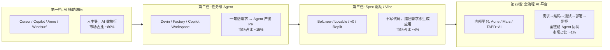
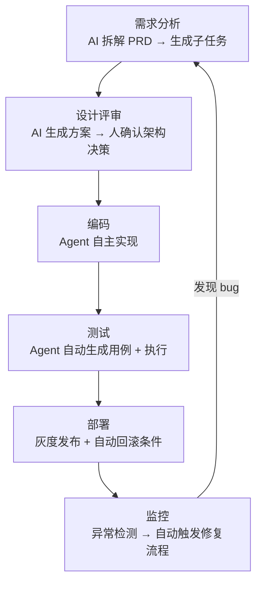
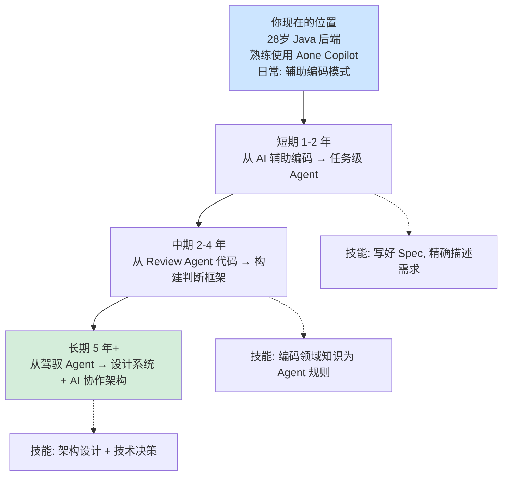

# AI 时代的开发者角色进化：2026 年市场全景与职业重塑

> 最后整理: 2026-05-31 | 来源: 对话讨论 + 行业动态

> 关联: [AI Coding 分层](./ai-coding-levels.md) — L0-L5 递进路径，每种模式的能力模型
> 关联: [Vibe → SDD → 驾驭工程](./vibe-coding-to-harness.md) — 三阶段演进，Harness 工程实践
> 关联: [AI Coding 团队治理](./ai-coding-team-governance.md) — 美团 31 万行重构，Pre-PR 机制

---

## 1. 2026 年中：AI 开发范式市场全景

先给一个大图——目前市面上不是只有"全 Agent 开发"这一种形态，而是四档自动化程度并存。绝大部分团队还在第一档，你同事那种"全 Agent"反而是少数中的少数。



### 1.1 第一档：AI 辅助编码（市场主流，~80% 开发者）

**代表产品**：GitHub Copilot、Cursor、Windsurf、JetBrains AI Assistant、Aone Copilot、通义灵码

这就是你日常的状态。开发者自己写代码，AI 做 inline 补全、chat 问答、选中代码重构。人和 AI 是"结对编程"关系——人主导决策，AI 做执行。

**一个典型 Java 程序员的一天（2026 年版）**：

```
09:30  打开 IDEA，Aone Copilot 常驻右侧面板
10:00  接到需求"用户中心加一个手机号换绑功能"
       → 先用 Copilot Chat 问："分析 UserController 和相关 Service 的现有逻辑"
       → AI 读了 5 个文件，给出调用链和修改建议
10:30  在 Controller 里写方法签名，Copilot 补全了参数校验逻辑
       → 人确认校验规则（短信验证码 5 分钟有效）
11:00  写 Service 层核心逻辑，这部分自己动手——
       换绑涉及新旧手机号双因子验证，逻辑复杂
       → 写完主体后，用 Copilot 补异常处理和日志埋点
14:00  写单元测试——几乎全交给 AI 生成
       → "给 UserService.changePhone() 生成测试用例"
       → AI 生成 12 个用例，人检查覆盖了并发换绑场景
15:00  提交 PR，CodeRabbit 自动 review，指出一个 N+1 查询
       → 人修复后合入
```

**人写了多少代码？**
- Controller 层（参数校验、路由）：人写 20%，AI 补全 80%
- Service 层（核心业务逻辑）：人写 70%，AI 补全 30%
- 单元测试：人写 5%（定义测试场景），AI 生成 95%
- **总体：约 40-50% 的代码量由 AI 产出**

**核心特征**：
- AI 是"更强的自动补全 + 智能问答"，不是自主决策者
- 人始终在循环内，每一步都需要人确认
- 复杂业务逻辑、架构决策仍然靠人

### 1.2 第二档：任务级 Agent（增长最快，~15% 开发者）

**代表产品**：Devin (Cognition)、Factory、GitHub Copilot Workspace、Codex CLI、Claude Code

这就是你同事描述的模式。给一个 Issue 或一句话需求，Agent 自己读代码库 → 建分支 → 写代码 → 跑测试 → 提交 PR。人只看最终 PR diff，决定合入还是打回。

**实际工作流示例**：

```
人: "Issue #3421: 订单列表接口超时，需要加 Redis 缓存，TTL 5 分钟"

Agent 自主执行:
  1. 读 OrderController.list() 和相关 Service
  2. 分析慢查询 → 发现是联表查了 4 张表
  3. 方案：先查订单主表 → 缓存命中则直接返回 → 未命中查关联表
  4. 写 Redis 缓存层（Cache-Aside 模式）→ 加 @Cacheable 注解
  5. 跑现有测试 → 2 个失败（缓存 key 冲突）
  6. 修复 key 命名 → 重新跑 → 全绿
  7. 提交 PR，附分析报告："瓶颈在 OrderItem 表的全表扫描，
     加了缓存后预计 QPS 从 200 → 2000"

人做的事:
  1. 读 Agent 的分析报告 → 确认瓶颈判断正确
  2. Review PR diff → 确认缓存失效策略合理（更新时主动失效）
  3. 追问一个问题："并发情况下会不会出现缓存雪崩？"
  4. Agent 回复已加随机 TTL（4-6 分钟区间）→ 通过
  5. 点击 Merge
```

**和第一档的本质区别**：

| 维度 | Copilot 模式 | Agent 模式 |
|------|------------|-----------|
| 你给什么 | "帮我补全这个方法" | "解决这个 Issue" |
| AI 做什么 | 在当前文件光标附近补全 | 跨文件读代码 → 建分支 → 写代码 → 跑测试 → 提 PR |
| 你什么时候介入 | 每一步 | 只在最后看 diff |
| 你需要懂什么 | 当前方法的输入输出 | 整个模块的业务逻辑和架构 |
| 工具调用 | 不需要 | Agent 自己调 git/test/lint/部署 |

**谁在用？**
- **创业公司/独立开发者**：Devin 用得多，因为人少活多，自动化够用就行
- **大厂**：更多是用内部 Agent（如 Aone 的智能修复），但限制在特定流程（如"自动修 Sonar 告警"），不是"完整的端到端自主开发"
- **大厂为什么保守？** 内部系统太复杂、权限管控太细、合规要求太多，通用 Agent 搞不定。一个订单系统可能涉及 20+ 微服务，Agent 的上下文窗口装不下

### 1.3 第三档：Spec-Driven / Vibe Coding（~4%，但增长迅猛）

**代表产品**：Bolt.new、Lovable、Replit Agent、v0.dev

你不需要写代码，甚至不需要知道用了什么技术栈。你写一份规格说明（或直接口述需求），AI 从零生成整个应用。

**适用场景**：
- 原型验证（"帮我做一个跟 Uber 差不多的打车 App，先跑通流程"）
- 内部工具（"给运营做个数据看板，能筛选日期和地区"）
- Landing Page、营销页面
- 个人小项目

**不适合的场景**：
- 复杂业务系统（分布式事务、状态机、遗留系统集成）
- 对性能和安全性有严格要求的系统
- 需要长期维护的大型项目

**为什么只有 4%？** 因为大部分生产系统不是"从零开始"的，而是在已有代码上增量开发。而 Vibe Coding 工具目前最擅长的是"从零生成"。

### 1.4 第四档：Platform Engineering + AI 全流程（~1%，内部平台）

**代表**：阿里 Aone、字节 Mars、腾讯 TAPD + AI、Google 内部工具链

这就是你同事描述的理想形态，也是 Aone 想做的方向。AI 嵌入整个软件交付生命周期：



**现在实际落地了多少？**

坦率说，真正能做到"一句话修 bug → 全自动上线"的团队极少。大部分卡在三个地方：

**卡点 1：测试验证不可靠**
> Agent 改了代码，测试覆盖率不够，不敢自动合入。你说"全绿"，但测试本身可能没覆盖到关键路径。大厂代码仓的测试覆盖率能做到 80% 就是优秀了，剩下 20% 的盲区恰恰是 bug 高发地。

**卡点 2：上下文窗口不够**
> 大型 Java 项目动辄几十万行、几百个微服务。Agent 一次只能看到有限的文件。它改了 Service A，不知道会影响 Service B 的调用方。除非有完整的契约测试（Pact/Spring Cloud Contract），否则"改 A 坏 B"是常态。

**卡点 3：权限和合规**
> 自动改代码 → 自动部署的链路太危险——金融、支付、用户隐私相关的代码，出一次事故就是 P0。必须有人的门禁。

**谁真的做到了？**
- 内部工具的团队（影响面小，出问题也不致命）
- 有极强工程基础设施的团队（字节的 Mars 能做到是因为他们有全链路的自动化测试 + 灰度 + 自动回滚）
- 非核心业务的团队

---

## 2. 全 Agent 开发模式的真实图景

把你同事描述的那个流程展开，看看每个环节到底发生了什么：

```
用户: "订单列表接口超时了，帮我修一下"

主 Agent（编排层）:
├── 调度 日志 Agent → 查 ELK → "p99 延迟 3.2s，瓶颈在数据库查询"
├── 调度 代码 Agent → 读 OrderService → "联表查了 4 张表，无索引"
├── 调度 Bug Agent  → 在 TAPD 创建缺陷 → 关联日志和根因分析
├── 调度 实现 Agent → 创建分支 → 加索引 + Redis 缓存 → 跑测试
├── 调度 Review Agent → "缓存 key 设计有并发冲突风险" → 实现 Agent 修复
├── 调度 部署 Agent → 灰度 10% → 观察 5 分钟 → p99 降至 180ms
│                        → 全量发布
└── 生成报告: "根因: 缺索引+N+1查询 | 修复: 加索引+Cache-Aside |
               验证: 灰度压测通过 | 建议: 后续加慢查询告警"

人做的事: 看报告 → 确认 → 点"同意上线"
```

**这个流程在 2026 年能不能跑通？**

**能，但有严格前提**：
1. 系统有完整的可观测性（日志、链路追踪、指标都在一个平台）
2. 代码有足够高的测试覆盖率（至少 70%，且测试质量好）
3. 有灰度发布 + 自动回滚能力
4. 不是首次遇到这类问题（Agent 的行为模式是 pattern matching，全新类型的故障它不知道怎么修）
5. 非核心链路（支付、认证、数据一致性要求高的场景不能这么玩）

**大部分团队缺的不是 Agent 能力，而是 1-3 的基础设施**。

---

## 3. 核心问题：人不写代码了，经验用来干啥？

这个问题比你想象的更深刻。我从三个层面拆开讲。

### 3.1 类比：编程语言抽象层级上移的历史

每一次抽象层级上移，底层技能没有消失，而是变成了一种**"看到问题能穿透到底层"的能力**：

```
1960s: 汇编程序员 → 手写每条 CPU 指令
1990s: C 程序员     → 内存管理、指针操作
2010s: Java 程序员  → 不需要管内存，但需要理解 GC 原理来调优
2020s: AI 辅助程序员 → 不需要手写 CRUD，但需要审查 Agent 产出的代码

关键规律:
  每一代程序员"不用操心"的事，恰好是上一代程序员的核心技能
  但上一代的核心技能并没有消失——
  它变成了"当自动化出错时，你知道去哪里看"的能力
```

**一个具体的例子**：

> 你现在写 Java，不用像 C 程序员那样 `malloc/free`。但当你遇到 Full GC 频繁的问题时，你知道那是堆内存不足——这个直觉来自于"虽然你不用管内存分配，但你学过 JVM 内存模型"。
>
> AI 时代同理。Agent 帮你写了缓存层代码，但当你看到它设置的 TTL 是固定值 300s 时，你的经验告诉你"这会导致缓存雪崩"——你不需要手写防止雪崩的代码，但你需要**认得出这个模式是错的**。

### 3.2 具体技能映射：Java 程序员经验的新用途

| 你过去的经验 | 典型场景 | 在 Agent 时代的新用途 |
|------------|---------|---------------------|
| 知道慢 SQL 怎么优化 | EXPLAIN 看执行计划、加索引 | 审查 Agent 产出时，一眼看出它用了 N+1 查询 |
| 经历过生产事故 | 凌晨 3 点被叫起来修 bug | 知道什么代码模式会导致问题，写成 Agent 的 review checklist |
| 踩过分布式事务的坑 | 转账丢钱/重复扣款 | 设计 Agent 验证流程时，知道事务边界必须人工确认 |
| 重构过大型项目 | 拆单体 → 微服务 | 能把复杂需求拆成 Agent 可独立执行的小任务 |
| 知道团队代码风格 | 统一的异常处理、日志规范 | 能写有效的 coding rules 喂给 Agent |
| 评审过上百个 PR | 能快速定位设计问题 | 在 Agent 产出的 PR 中，不被语法正确性迷惑，聚焦架构合理性 |
| 和 PM 撕过需求 | "这个需求技术上做不了" | 能把模糊业务需求翻译成 Agent 可执行的 Spec |

**关键洞察**：经验没有贬值，**它在价值链上的位置往上移了**。

```
之前的价值链:
  需求理解 → 架构设计 → 编码实现(你花时间最多) → 测试验证(你花时间第二多) → Code Review

之后的价值链:
  需求理解(更深了) → 写 Spec(新技能) → Agent 编码实现 → Agent 跑测试 → 你 Review(更深了)
                            ↑                                  ↑
                     经验用在这里                      经验也用在这里
```

### 3.3 四个新角色（不是职称，是能力维度）

#### 角色一：Specification 设计师

Agent 能不能产出正确代码，90% 取决于你的需求描述有多精确。这比写代码难——

**写好 Spec 需要的能力**：
- 把模糊业务需求翻译成结构化的验收条件
- 预判边界情况（Agent 通常想不到"并发退款时怎么办"）
- 设计测试场景验证 Agent 的产出
- **本质上是在脑中先"执行"一遍代码，然后把关键路径写成约束**

**例子**：PM 说"用户可以用积分兑换优惠券"，你的 Spec 要覆盖：
```
正向:
  - 积分足够 → 扣积分 → 发优惠券
  - 积分刚好够 → 扣到 0 → 发券

边界:
  - 积分不够 → 提示"还差 X 积分"
  - 优惠券库存为 0 → 提示"已兑完"
  - 同一优惠券每人限兑 1 次 → 提示"已兑换过"

并发:
  - 用户同时点两次兑换 → 只扣一次积分，只发一张券
  - 最后 1 张券多人同时兑换 → 只有 1 人成功

异常:
  - 扣积分成功但发券失败 → 积分回滚
  - 网络超时 → 不做重复扣积分
```

这就是你的经验在起作用——你知道分布式系统里什么事可能出错。

#### 角色二：Code Review 从"找低级错误"变成"找设计缺陷"

以前 Code Review，30% 时间花在"变量命名"、"空指针检查"、"日志格式"这种能被 lint/AI 自动搞定的事上。Agent 帮你搞定了这些。

剩下 70% 才是真正需要经验的：

| Review 维度 | 以前（人工代码） | 现在（Agent 代码） |
|------------|--------------|-----------------|
| 语法正确性 | 偶尔有错，人找 | Agent 基本不错 |
| 业务逻辑 | 人写，人对 | Agent 理解可能有偏差，人必须对 |
| 架构设计 | 人设计，人 Review | Agent 无全局架构意识，人必须把关 |
| 安全漏洞 | 偶尔有，人找 | Agent 更容易引入（它会复制它见过的反模式） |
| 性能问题 | 偶发 | Agent 更可能引入（它不关心索引/缓存/连接池） |
| 并发正确性 | 有经验的能规避 | Agent 基本不考虑并发场景 |

**结论**：Agent 代码的 Review 难度其实**更高了**——因为低级的混在高级里，看不出来。你需要更深的经验来穿透"代码看起来对"的假象。

#### 角色三：Agent 判断框架的构建者

Agent 不稀缺，稀缺的是**领域知识库和判断规则**。这些东西只能由经验丰富的人来构建：

```
建一个 Agent 的判断框架，包含三个层次:

1. 知识层 —— Agent 需要知道的上下文
   - 这个系统的边界在哪？（哪些服务是上游，哪些是下游）
   - 核心业务约束是什么？（支付必须幂等、订单状态机不可逆）
   - 数据库 schema 的含义是什么？（每个字段的业务语义）

2. 规则层 —— Agent 的行为边界
   - 什么代码不能自动改？（支付逻辑、核心状态机）
   - 什么情况必须人工确认？（数据库 schema 变更、API 协议变更）
   - 哪些日志 pattern 对应什么故障类型？（Snowflake ID 重复 → 时钟回拨）

3. 验证层 —— 如何确认 Agent 做得对
   - 改了支付代码 → 必须跑全量回放测试
   - 改了缓存逻辑 → 必须有并发压测
   - 改了接口签名 → 必须有兼容性检查
```

这不是写代码，而是**把团队经验编码化为 Agent 能消费的约束系统**。能做好这件事的人，前提是——你自己踩过那些坑。

#### 角色四：系统架构与"不可 AI 化"的决策

AI 可以建议技术选型，但最终决策由人做。原因很简单：**决策的后果由人承担**。

```
AI 能说: "建议用 Redis 做缓存，性能更好"
AI 不能说: "如果 Redis 挂了导致 10 分钟服务不可用，这个风险我承担"

人能说: "在这个场景下，Redis 单点风险太大，
         我们用本地缓存 + 消息总线同步的方案，
         哪怕数据有 2 秒延迟，也比全挂了强"
```

这类决策需要的是：
- 理解 trade-off 的深度
- 对系统故障模式的肌肉记忆
- 对业务损失的心理预估

**这些 AI 没有，也不会有——因为它们不需要为自己的建议承担后果**。

### 3.4 "还有多少 Agent 需要开发？"——一个诚实的回答

你问"会有那么多 Agent 需要开发吗？"，这个问题背后其实在问**"我的职业生涯会不会被 AI 吃掉"**。

**一个有用的类比**：

> 2000 年的 Java Web 开发——Struts、Hibernate 刚出来时，也有人说"以后不需要程序员了，拖拽就能开发系统"。实际上呢？程序员没消失，但"写 Servlet"的技能变成了"配置 Spring Bean"、"理解 AOP 原理"、"设计微服务"。
>
> Agent 时代同理。市面上不会需要 100 万个 Agent 产品。但你也不需要去开发 Agent 产品。

**你需要的是**：

**做 AI 做不了的事**：

| AI 能做 | AI 做不了（你的护城河） |
|---------|---------------------|
| 写 Controller/Service/Mapper | 决定哪些逻辑放在哪个微服务 |
| 生成单元测试 | 判断测试覆盖是否足够 |
| 分析慢 SQL | 判断是加索引还是改架构 |
| 写 Spec（辅助） | 和 PM/运营对齐需求，理解"为什么" |
| 自动部署 | 决定灰度比例和回滚触发条件 |
| 查日志找异常 | 判断一个异常是 bug 还是 feature |

**把 Agent 用好的能力** > 开发 Agent 的能力（大多数开发者）：
- 就像你不需要开发 Spring Framework，但你需要精通它
- 未来的核心技能是"知道什么时候用 Agent、怎么指挥 Agent、怎么验证 Agent"

**构建内部工具链的能力**（少数开发者）：
- 每个公司都有自己的特殊系统、特殊流程
- 需要人来把通用 Agent 能力和内部系统串起来
- 比如写 MCP Server 让 Agent 能查内部日志、调用内部 API

**跨团队沟通、需求澄清、技术方案评审**（永远不会被替代）：
- 这些事需要理解上下文、建立信任、权衡多方利益
- AI 没有 skin in the game，不可能真正负责

---

## 4. 总结：你现在的位置和方向



**你现在接触的 Aone Copilot 内部工作方式**，刚好卡在"第一档→第二档"的过渡带。你的优势是：
- 你已经在用 Agent 了，不是零基础
- 你对 Java 生态有深度理解，这不是 AI 短期能取代的
- 你 28 岁，正好处在从"写代码的人"进化到"设计系统 + 驾驭 AI 的人"的黄金窗口

**一个务实的建议**：不要焦虑"全 Agent 开发会不会让我失业"。把注意力放在——**你的经验在价值链的哪个环节能产生最大杠杆**。答案大概率不是"和 Agent 比写代码速度"，而是"让 Agent 写到 90 分之后，用你的经验把它拉到 98 分"。
