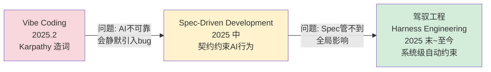
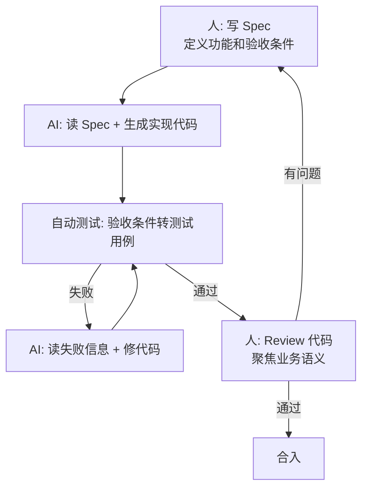
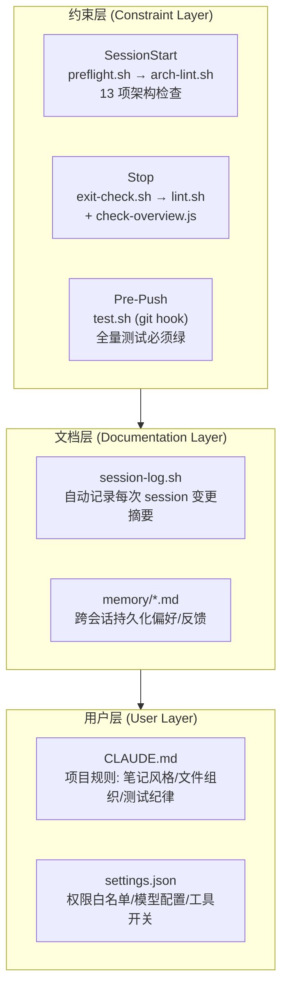
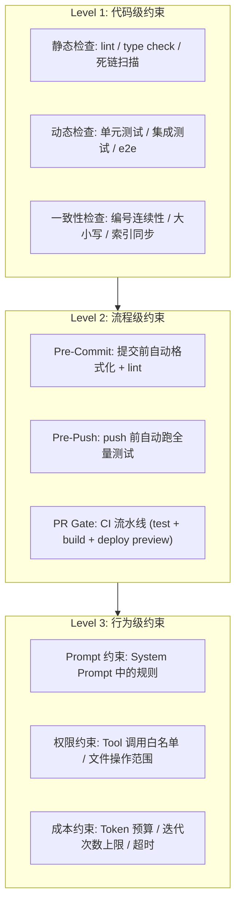

# 从 Vibe Coding 到 Spec-Driven 到驾驭工程

> 最后整理: 2026-05-24 | 来源: 对话讨论

> 关联: [AI Coding 团队治理](<./AI Coding 团队治理：从个人提效到团队工程化.md>) — Pre-PR 机制、人机对齐方法论、31 万行重构实践
> 关联: [AI Coding 分层](<./AI 编程的递进路径：从古法编程到多 Agent 协作.md>) — AI Coding 五个能力层级
> 关联: [Agent 开发实战](<../应用/Agent 开发实战：选型、框架与思维转换.md>) — 从编码视角看 Agent 开发范式
> 关联: [AI 时代开发者角色进化](<./AI 时代的开发者角色进化：2026 年市场全景与职业重塑.md>) — 2026 年市场全景，开发者经验如何迁移

---

## 1. 三阶段全景图

从"让 AI 写代码"到"让 AI 在约束下写代码"，每一步都解决了上一步的致命问题：



---

## 2. 第一阶段：Vibe Coding（氛围编程）

### 起源

2025 年 2 月，Andrej Karpathy（前 Tesla AI 总监、OpenAI 联合创始人）在 X 上发了一句话，造出了这个词：

> "There's a new kind of coding I call 'vibe coding', where you fully give in to the vibes, embrace exponentials, and forget that the code even exists."

翻译：**你只管描述想要什么，AI 噼里啪啦生成代码，你觉得差不多就接受，不行就 AI 再改。你甚至不用看代码。**

### 实际体验

```
传统编程:  思考 → 设计 → 写代码 → 调试 → 重构 → 测试
Vibe Coding: "帮我做一个 TODO 应用" → AI 生成 →
            "再加个暗色模式" → AI 改 →
            "这个按钮换个颜色" → AI 改 →
            ...你始终在看效果，很少看代码
```

Karpathy 自己的描述：

> "It's not really coding — I just see stuff, say stuff, run stuff, and copy paste stuff, and it mostly works."

**这是怎么做到的**：Cursor/Copilot/Claude Code 让 AI 可以读整个项目上下文、编辑文件、跑命令。你不需要手动定位文件、手动改代码——描述意图就行。

### 致命问题

| 问题 | 表现 |
|------|------|
| **代码你其实不懂** | AI 生成了 2000 行，功能跑通了，但里面有 bug 你不知道，有安全漏洞你不知道，架构不合理你也不知道 |
| **改 A 坏 B 无法感知** | "改一下登录逻辑"→ AI 改了 5 个文件 → 功能 OK → 但注册流程坏了 → 你根本不知道，直到用户报 bug |
| **积累"垃圾资产"** | 每次 vibe 都让代码更混乱一点，缺乏结构一致性。三个月后没人敢动 |

Karpathy 自己也承认：

> "I admit I sometimes get too lazy to read the diff. For throwaway weekend projects it's fine, but for anything serious..."

**本质问题**：vibe coding 把**质量担保**完全交给了 AI——而 AI 不具备你的上下文（业务规则、安全需求、性能约束）。它生成的代码"看起来对"但"可能藏着错"。

---

## 3. 第二阶段：Spec-Driven Development（规约驱动开发）

### 为什么会出现

Vibe coding 的痛点催生了下一步：**在你和 AI 之间加一层"契约"**。

```
Vibe Coding:    你说一句话 → AI 生成代码 → 你看效果
Spec-Driven:    你写一份 Spec → AI 按 Spec 实现 → 测试验证 Spec
                       ↑
                  Spec = 可验证的契约
```

**Spec 是什么**：一份用自然语言（或结构化格式）写的规约，描述"这个功能要做什么"，而不是"怎么做"。关键特征是**可验证**——写完 Spec 后，能通过测试判断"实现是否符合 Spec"。

### 一个 Spec 长什么样

```markdown
## Spec: 退款功能

### 验收条件
- [ ] 已签收且 7 天内的订单可以退款
- [ ] 未签收的订单不可退款，返回"订单未签收，暂不支持退款"
- [ ] 超过 7 天的订单不可退款，返回"已超过退款期"
- [ ] 退款金额 > 1000 元时，进入人工审核流程
- [ ] 退款成功后，订单状态变为"已退款"，发送通知

### 边界条件
- 订单号不存在 → "订单号无效"
- 同一订单重复退款 → "该订单已退款"
- 并发退款请求 → 最终只退款一次

### 安全约束
- 只允许退款自己的订单（通过 token 校验 userId）
- 退款原因不能包含 SQL 注入/脚本注入
```

### 和传统需求文档的区别

```
传统 PRD:    给"人"看的，人可以模糊理解 → 开发自己补充细节
SDD Spec:    给"AI + 测试"看的，必须精确到可以自动验证

传统 PRD:    "支持退款功能"
SDD Spec:    "已签收且 7 天内的订单可以退款，未签收返回 X，超期返回 Y"

关键差异: Spec 里有验收条件，可以写成测试用例，AI 实现完后自动判断是否满足
```

### SDD 的完整流程



**核心变化**：人的角色从"写代码"变成"写 Spec + Review 代码"。代码生成交给 AI，但**通过 Spec 约束它生成什么，通过测试验证它生成对了没有**。

### Spec-Driven 解决了什么

| Vibe 的问题 | SDD 怎么解决 |
|------------|------------|
| 代码你其实不懂 | Spec 写明了行为期望，代码不符合 → 测试发现 → AI 重写 |
| 改 A 坏 B 无法感知 | Spec 的验收条件覆盖了所有关键路径，改动后全量跑测试 |
| 积累"垃圾资产" | Spec 本身是活文档，代码结构跟着 Spec 走，一致性有保障 |

### Spec-Driven 的局限

SDD 仍然有两个盲区：

1. **Spec 本身可能是错的**：你写的 Spec 假设"退款后发邮件通知"，但合规要求其实是"短信通知"。AI 完美实现了错误的 Spec。
2. **跨文件的约束没法覆盖**：Spec 说"这个接口要返回 200"，但实现改了 10 个文件，其中一个改了公共工具函数，影响了 20 个其他接口——Spec 不知道这些影响。

---

## 4. 第三阶段：驾驭工程（Harness Engineering）

### 是什么

> 驾驭工程的核心理念：**不是依赖人每次手动检查 AI 的输出，而是在 AI 的工作流程中嵌入自动化约束——让 AI 在"笼子"里工作，笼子的边界由你的规则定义。**

"Harness" 就是马具/缰绳。强马（强力 AI）跑得飞快，但如果没有缰绳，它会跑偏甚至把你甩下来。驾驭工程 = 给 AI 套上缰绳，让它只能在安全边界内发挥能力。

### 和 SDD 的关系

```
SDD:          人定 Spec → AI 实现 → 测试验证 Spec
              ↑ 约束的是"这次要做什么"

驾驭工程:       AI 实现 → 自动检查链路（hooks / lint / test / gate）
              ↑ 约束的是"AI 怎么做 + 不能破坏什么"

两者互补: SDD 管"输入侧"（做什么），驾驭工程管"输出侧"（做得对不对 + 有没有搞破坏）
```

### 驾驭工程的核心机制：多层自动 Gate

以本项目（ans-ai-auto-notes）的实际配置为例——Claude Code 的 hook 体系就是一个典型的驾驭工程实现：



**关键设计**：这些不是"人记得做"的检查，而是**自动触发**的。AI 每次启动自动跑 lint，每次退出自动审计，每次 push 前自动跑测试——人不需要记住、不需要手动操作。

### 驾驭工程的三个层次



**Level 1**：传统 CI 里的 lint + test。任何 AI 生成的代码都必须通过。

**Level 2**：把检查嵌入到 AI 的工作流节点（启动/提交/push/退出），让 AI 在"做下一件事之前"必须过门禁。这一步是把"人记得检查"变成"系统自动检查"。

**Level 3**：直接限制 AI 的能力边界——它能调哪些工具、能改哪些文件、单次操作 Token 上限。相当于在 AI 外围修了一堵墙。

### 三阶段的实际体验对比

用同一个场景看三个阶段的不同：

```
任务: "帮我把所有 md 文件的标题格式统一一下"

Vibe Coding:
  你: "帮我把所有 md 文件的标题格式统一一下"
  AI: 改了几十个文件 → 有些标题ID乱了 → 有些链接断了 → 没人发现
  等你写新文章时才发现 TOC 跳转失效 → git blame 发现是 3 天前引入的

SDD:
  你: 写 Spec "标题格式统一规则 + 验收条件 + 交叉链接必须有效"
  AI: 按 Spec 改了文件
  测试: 自动验证"每个标题可跳转"、"每个链接指向存在的文件"
  → 当场发现 2 个死链 → AI 修复 → 通过 → 合入

驾驭工程:
  你: "帮我把所有 md 文件的标题格式统一一下"
  AI 修改中:
    → Pre-commit hook 自动跑 lint → 发现格式问题 → AI 自动修正
    → 改完主动跑 build-index.js 重建索引
    → 主动跑 arch-lint.sh → 发现 1 个编号跳号 → AI 修正
    → 主动跑 test.sh → 全部绿
    → AI commit
  你完全没介入，但所有检查都自动完成了

  下次启动:
    → SessionStart hook 自动跑 arch-lint.sh（13 项检查）
    → 即使上次 AI 漏了什么，这次立刻发现
```

### 驾驭工程 vs 传统工程质量体系的区别

| 维度 | 传统 QA | 驾驭工程 |
|------|--------|---------|
| **触发方式** | 人触发（手动跑测试/提 PR 触发 CI） | **事件驱动**自动触发（会话启动/停止/提交/push） |
| **覆盖范围** | 代码质量（lint + test） | **代码 + 知识 + 流程 + 行为** 四维覆盖 |
| **反馈速度** | 分钟级（CI 跑完才知道） | **秒级**（hook 在事件发生时立即执行） |
| **执行主体** | 人（决定什么时候跑什么检查） | **系统**（自动编排检查链路） |
| **应对对象** | 人写的代码 | **AI 生成的代码**——速度更快、量更大、需要更高频检查 |

### 本项目作为驾驭工程的一个实例

```
AI（Claude Code）是"主力开发者"
Harness 是"自动化 QA 体系"

AI 的工作边界:
  ✅ 可以: 读写 kb/ 下的 md 文件、编辑脚本、跑 build-index、跑 test、创建 commit
  ⚠️ 需确认: 引入 npm 依赖、改变目录结构、修改 CLAUDE.md
  ❌ 禁止: 手改 INDEX.md（自动生成）、裸 force push

SessionStart Gate:
  → preflight.sh: 上次 session 摘要、git 状态、manifest 过期检查
  → arch-lint.sh: 13 项机械检查（AI 不参与判断，纯脚本判定）

Stop Gate:
  → exit-check.sh: lint + overview 健康 + session 日志 + 未 push 检查

Pre-Push Gate:
  → test.sh: 所有测试必须通过 + mermaid 守恒检查

结果:
  41 个 md 文件、0 个架构错误、2 个已知行数警告
  跨文件链接、编号连续性——全部由 AI 在 harness 内完成
  人只参与了"确认内容方向"，没有参与"检查代码质量"
```

---

## 5. 三阶段演进逻辑总结

```
Vibe Coding:
  "让 AI 写，我相信它"
  问题: AI 不可靠，会静默引入 bug

    ↓ 驱动力: "需要一层契约约束 AI 的行为"

Spec-Driven Development:
  "先写 Spec，AI 按 Spec 实现，测试验证 Spec"
  问题: Spec 管不到全局影响、跨文件破坏、流程性遗漏

    ↓ 驱动力: "需要系统级的自动化约束，而非依赖人每次检查"

驾驭工程 (Harness Engineering):
  "给 AI 套上缰绳——定义它能做什么、不能做什么、每次做了什么之后自动检查什么"
  核心: 从"人检查 AI"变成"系统约束 AI"
```

一句话记法：
- **Vibe Coding** = 放马跑（爽但危险）
- **SDD** = 有了目的地和地图（知道去哪，但路上还是可能摔）
- **驾驭工程** = 给马套上缰绳 + 路两旁修护栏（既给了方向，又限制了偏离）

---

## 6. 实际例子：同一个需求三种做法

需求：给系统加一个"导出 Excel"功能。

### Vibe Coding 做法

```
"帮我写一个 Spring Boot 的 Excel 导出接口"
→ AI 生成代码 → 粘贴进去 → 能跑就行
→ 问题：大数据量 OOM？并发导出？权限校验？不知道，上线后再说
```

### Spec Coding 做法

```
1. 写规格：
   - 支持最大 10 万行导出
   - 超过 1 万行用异步任务 + 下载链接（不阻塞 HTTP 连接）
   - 需要 EXPORT 权限
   - 支持自定义列选择

2. 写测试：
   test_export_small_data_sync()
   test_export_large_data_async()
   test_export_without_permission_403()
   test_export_custom_columns()

3. 让 AI 实现 → 跑测试 → 不通过就修 → 全绿 → 完成
   上线后不慌——有测试兜底
```

### Harness Engineering 做法

```
1. 设计通用的"功能开发 Skill"（一次设计，每次复用）：
   - brainstorming → 确认方案
   - writing-plans → 拆解任务
   - TDD 开发 → 测试先行
   - verification → 自动验证

2. 设计 Memory：
   - 记住"项目中导出功能统一用 EasyExcel"
   - 记住"大数据量必须走异步（>1万行）"
   - 记住"所有接口都要权限注解"
   - 记住"文件存储统一用 MinIO，返回预签名 URL"

3. 以后任何人说"加个导出功能"：
   → Agent 自动按 Skill 流程走
   → 自动从 Memory 中获取项目约束
   → 产出质量一致，不依赖某个人的 prompt 能力
   → 团队新人不需要老员工 pair，AI 按你设计的系统自动引导
```

---

## 7. 升级路径

```
Level 1 → Level 2 (Vibe → Spec):
  关键转变: 从"问 AI"到"约束 AI"
  具体做法: 学会先写测试/规格，再让 AI 实现
  标志: 你不再说"看起来差不多"，而是说"测试过了"

Level 2 → Level 3 (Spec → Harness):
  关键转变: 从"约束单次任务"到"设计持续系统"
  具体做法: 把你的工作模式编码成 Skill/Memory/Workflow
  标志: 你不再亲自做每件事，而是设计系统让 AI 自主完成
        新人来了不需要你 pair，AI 按你设计的系统自动引导

当前定位:
  多数程序员在 Vibe → Spec 的过渡期
  少数先行者在 Spec → Harness 的探索期
  完全不碰 AI 编程的人正在被快速拉大差距
```

> 关联: [AI Coding 团队治理](<./AI Coding 团队治理：从个人提效到团队工程化.md>) — 美团 31 万行重构中的人机对齐 + Pre-PR 机制，是驾驭工程在团队规模上的实践
> 关联: [Agent 运维与韧性](<../应用/Agent 应用运维与韧性：架构之外的生存指南.md>) — 可观测性/成本/熔断/Prompt 金丝雀发布，是驾驭工程在 Agent 应用运维侧的细化
> 关联: [Agent 开发实战](<../应用/Agent 开发实战：选型、框架与思维转换.md>) — 从编码视角看 Agent 开发范式
