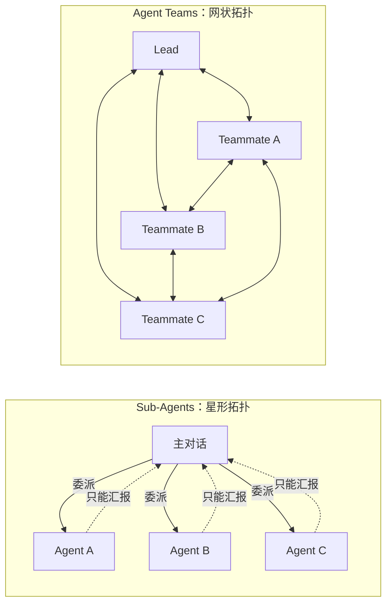
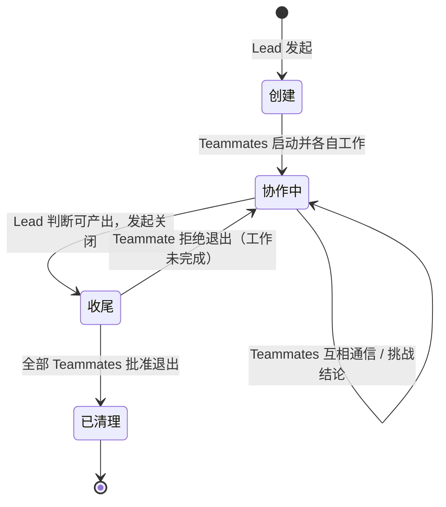
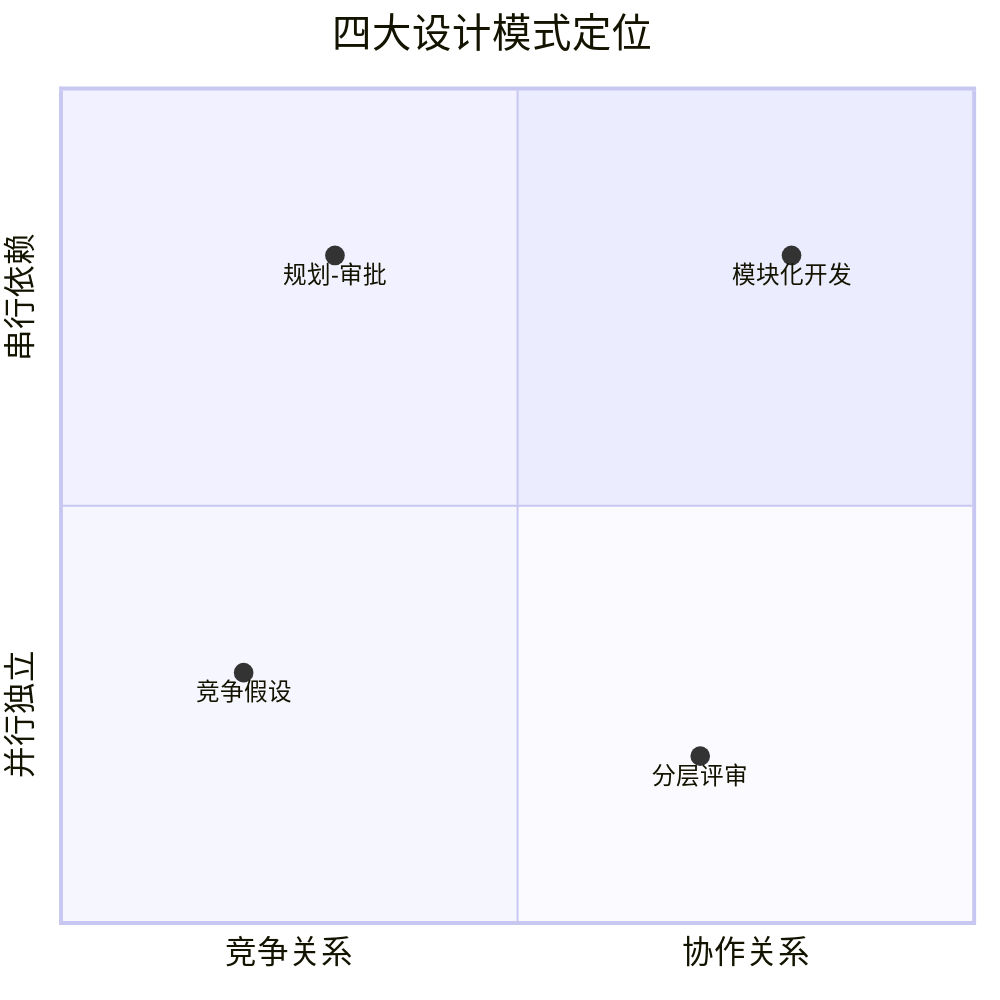
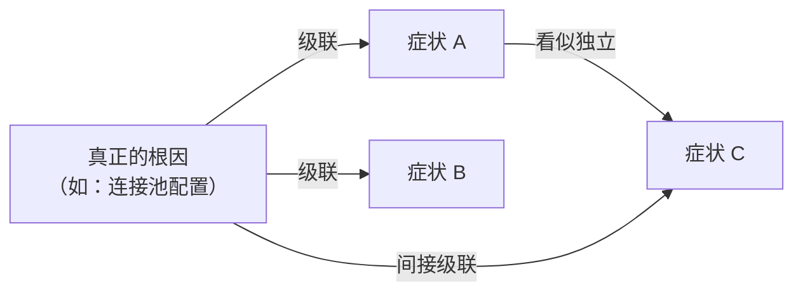
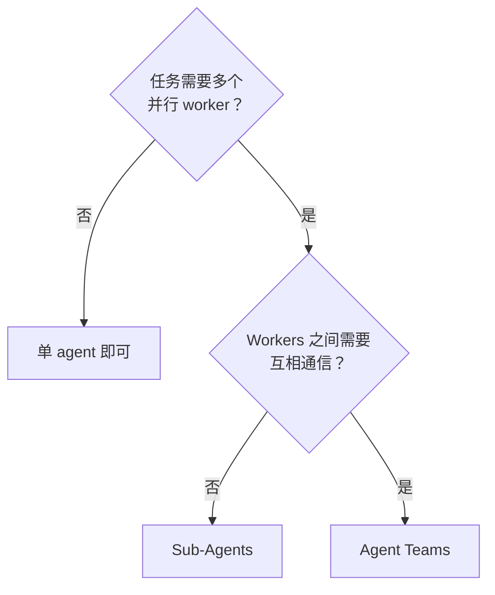
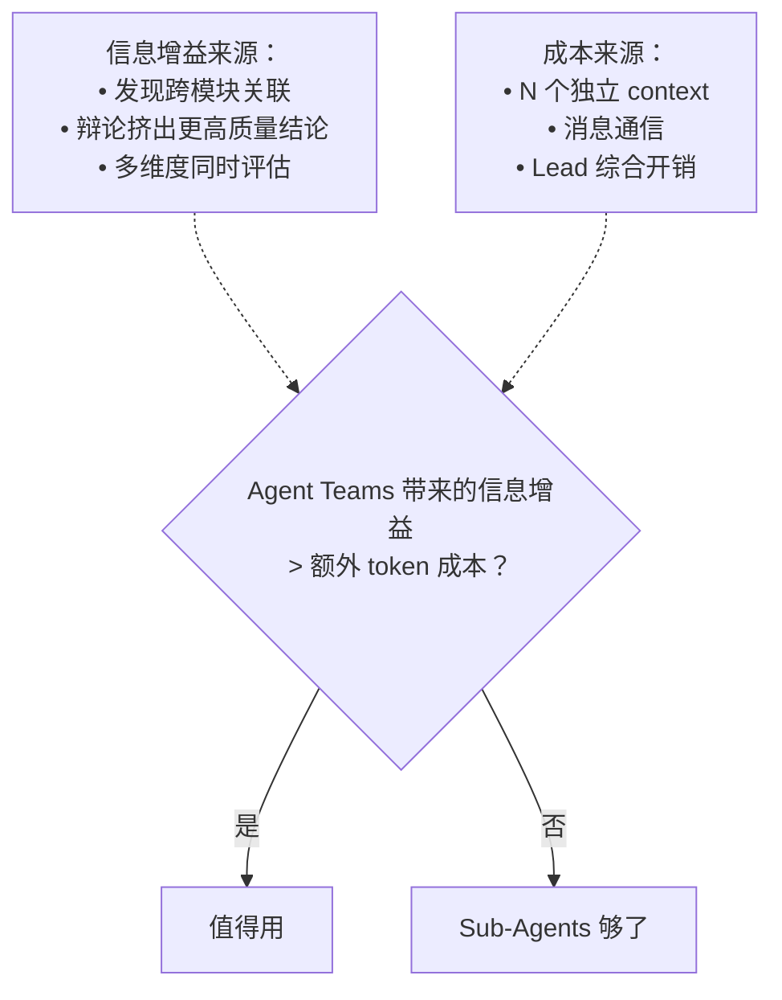

# Agent Teams 多会话协作架构

> 最后整理: 2026-06-16 | 来源: 黄佳《Claude Code 工程化实战》第 8 讲（概念提炼）+ 官方文档

> 关联: [子智能体（subagents）机制与实战](./子智能体（subagents）机制与实战.md) — Sub-Agents 的底层机制
> 关联: [并行探索与流水线编排](./并行探索与流水线编排.md) — Sub-Agents 的两种编排拓扑
> 关联: [从 Sub-Agent 到 Multi-Agent 的工程指南](<./从 Sub-Agent 到 Multi-Agent 的工程指南.md>) — 多智能体系统的宏观选型
> 关联: [子代理专题总结与综合案例](./子代理专题总结与综合案例.md) — 六讲知识体系总结 + 电商大促五阶段编排案例

---

## 2026-06-16 - Agent Teams 概念提炼

### §1 从树状到网状：通信拓扑的本质跃迁

Sub-Agents 和 Agent Teams 的区别不是"功能多少"，而是**通信拓扑**的根本不同：



**星形的局限**：当 Agent A 的发现可能改变 Agent B 的调查方向时，星形拓扑下这个信息必须经过主对话中转——而主对话可能根本意识不到这个关联的价值。

**网状的价值**：Teammates 之间可以直接发消息、互相质疑、主动关联。这不是一个便利性改进，而是一个**认知能力的跃迁**——系统具备了"交叉验证"的能力。

---

### §2 启用条件

实验性功能，默认关闭。启用方式：

```json
{
  "env": {
    "CLAUDE_CODE_EXPERIMENTAL_AGENT_TEAMS": "1"
  }
}
```

或 `export CLAUDE_CODE_EXPERIMENTAL_AGENT_TEAMS=1`。生产环境需评估官方 limitations 页面。

---

### §3 组件模型

| 组件 | 职责 | 类比 |
|------|------|------|
| **Team Lead** | 协调分配、综合结论、管理生命周期 | 项目经理 |
| **Teammates** | 独立执行，各自有独立 context window | 团队成员 |
| **Task List** | 共享任务，支持依赖声明和自动解锁 | 看板 |
| **Mailbox** | 点对点消息系统 | IM |

Teammates **不继承 Lead 的对话历史**——创建时必须给足上下文。团队配置和任务数据由 Claude Code 自动管理在 `~/.claude/teams/` 和 `~/.claude/tasks/` 下。

---

### §4 生命周期



**关键机制**：Teammate 有权拒绝关闭请求——这赋予了 Teammates 自主判断"工作是否完成"的能力，避免 Lead 过早收工。清理只应由 Lead 执行。

---

### §5 四大设计模式

四种模式本质上是在两个维度上的不同组合：**Teammates 之间的关系**（竞争 vs 协作）和**任务的结构**（并行独立 vs 串行依赖）。



#### 模式一：竞争假设（Competing Hypotheses）

**核心思想**：对同一问题，让多个 Teammates 各自持有不同假设，互相辩论挑战，最终存活下来的假设更接近真相。

**适用场景**：根因不明确、存在多种可能解释的调查类任务（bug 诊断、故障排查、方案评估）。

**为什么有效**：顺序调查有**锚定效应**——一旦第一个理论被探索，后续调查会不自觉偏向它。多个独立调查者主动互相反驳，打破了这种认知偏见。

**与 Sub-Agents 并行探索的区别**：Sub-Agents 的并行探索是"各查各的 → 主对话综合"，explorers 之间无法互相质疑。Agent Teams 的竞争假设多了**互相挑战**这一关键环节——这不只是信息收集，而是科学方法论中的"同行评审"。

#### 模式二：分层评审（Parallel Review）

**核心思想**：多个 Teammates 从不同专业维度审查同一对象，互相通报关联发现。

**适用场景**：PR Review、架构评审、安全审计等需要多维度评估的任务。

**与 Sub-Agents 的区别**：Sub-Agents 也能做并行 review，但 reviewer 之间看不到彼此的发现。Agent Teams 模式下，安全 reviewer 发现的输入验证问题可以立刻通报给性能 reviewer——"这个 SQL 注入漏洞同时也是性能隐患"。

#### 模式三：模块化开发（Module Ownership）

**核心思想**：每个 Teammate 负责一个模块的文件所有权，通过共享 Task List 协调依赖关系。

**适用场景**：新功能开发涉及多个独立模块（前端/后端/数据库/测试）。

**关键机制**：
- **任务依赖声明**：任务可以声明依赖其他任务，被阻塞的不可认领
- **文件所有权隔离**：每个 Teammate 只编辑自己负责的文件，避免写冲突
- **自动解锁**：依赖完成后，下游任务自动可认领

#### 模式四：规划-审批（Plan Approval）

**核心思想**：Teammate 在实施前必须先提交方案，由 Lead 按预设标准审批。

**适用场景**：高风险任务、方向容易跑偏的复杂重构。

**与 Sub-Agents 流水线的区别**：Sub-Agents 的流水线编排（Locator → Analyzer → Fixer → Verifier）是**预定义的阶段链**，每个阶段的职责固定。Plan Approval 是**动态审批门**——Lead 的审批标准由用户在 prompt 中设定，可以灵活调整。

---

### §6 级联故障发现：Agent Teams 的杀手级场景

Agent Teams 最大的价值不在于"更快"，而在于**发现跨模块的因果关系**。

**典型问题**：一个系统出现多个看似无关的症状（响应慢、数据异常、偶发崩溃）。每个症状背后可能有独立 bug，但更常见的真相是：**少数根因通过级联效应产生了多个症状**。



**为什么 Sub-Agents 做不到**：每个 sub-agent 只看到一个症状，找到一个解释就停了（锚定效应）。而且 sub-agents 之间不能通信，无法发现"我查的数据库问题可能是你查的 session 问题的上游"。

**Agent Teams 的解法**：每个 Teammate 带着不同假设调查不同症状，初步发现后互相通信。当 Session 侦探说"Redis 连接数在 5 分钟后突增"，数据库侦探立刻意识到"这和我的连接池耗尽时间线吻合"——级联链浮现。

---

### §7 选型决策



**核心判据只有一个：Workers 是否需要互相通信？**

| 信号 | 指向 |
|------|------|
| 各 worker 的结论互不影响 | Sub-Agents |
| 一个 worker 的发现可能改变另一个的方向 | Agent Teams |
| 需要辩论、挑战、交叉验证 | Agent Teams |
| 只需要汇总多个独立结果 | Sub-Agents |
| Token 预算紧张 | Sub-Agents |

---

### §8 成本分析

Agent Teams 的 token 成本**显著高于** Sub-Agents：每个 Teammate 是独立的 Claude 实例，有独立 context window，消息通信额外消耗 token，团队越大成本越高。

**ROI 判断框架**：



---

### §9 实践要点

从工程角度总结的关键注意事项：

| 要点 | 原因 |
|------|------|
| **创建时给足上下文** | Teammates 不继承 Lead 对话历史，信息不足会导致无效工作 |
| **文件所有权隔离** | 两个 Teammates 编辑同一文件会互相覆盖——这是最常见的问题 |
| **任务粒度适中** | 太细协调开销 > 收益；太粗缺少检查点，返工风险大。自包含单元 + 明确交付物 |
| **定期检查进度** | 不要让 team 无人看管跑太久，Lead 可能在 Teammates 完成前就开始下一步 |
| **从只读任务起步** | 初次使用从 PR 审查、调研、bug 调查开始，避免并行写代码的协调挑战 |
| **通过 Lead 清理** | Teammates 的 team 上下文可能不完整，清理操作只应由 Lead 执行 |

---

### §10 与应用层 Multi-Agent 的边界

Agent Teams 是 Claude Code **开发工具层**的 Multi-Agent 实现，不是构建面向用户的 Multi-Agent 系统的框架：

| 维度 | Agent Teams | 应用层 Multi-Agent |
|------|-------------|-------------------|
| 服务对象 | 开发者自己 | 外部终端用户 |
| 运行环境 | Claude Code CLI | 业务系统 |
| 技术栈 | Claude Code 内置 | Agent SDK / Anthropic API |

> 关联: [Headless 模式与 Agent SDK](<./Headless 模式与 Agent SDK.md>) — §15 headless vs 自建 Agent 选型

---

### §11 本项目应用评估

本项目目前的多 agent 协作全在 Sub-Agents 层面（Explore / code-reviewer / kb-auditor / idea-extractor / plan-executor），尚未使用 Agent Teams。

**是否值得引入？** 当前评估是**不急需**：

- 本项目的 sub-agent 任务都是"独立探索 → 主对话综合"模式，不需要 workers 互相通信
- KB 审查场景中 kb-auditor 的单一 reviewer 已经够用
- Agent Teams 的 token 成本对日常 KB 维护偏贵

**未来可能场景**：如果 KB 规模继续增长，可以用竞争假设模式做"KB 架构健康度多视角审查"——但这是锦上添花，不是痛点。
