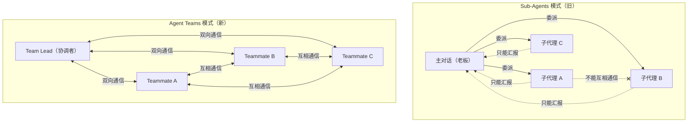
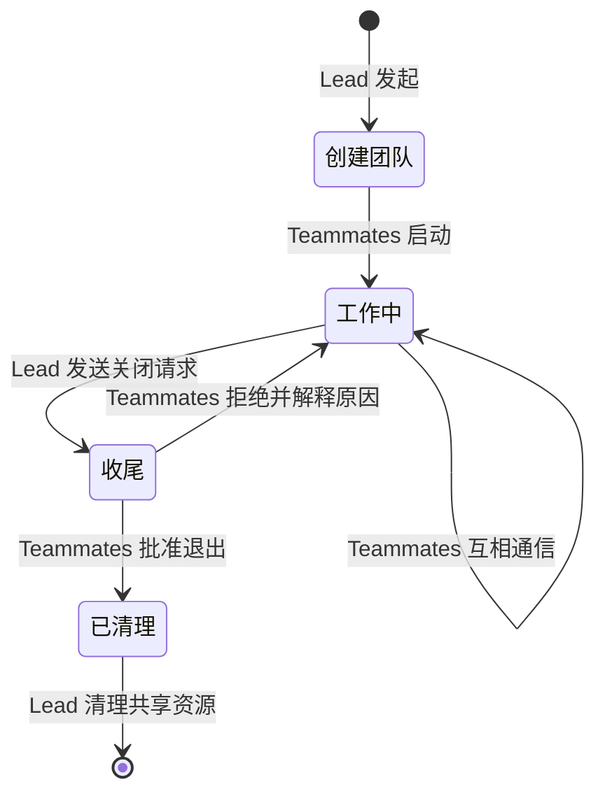
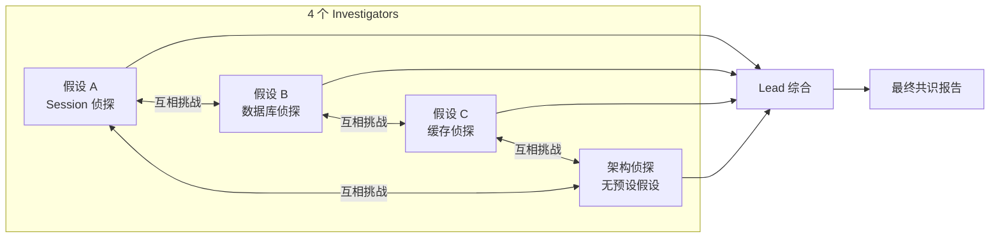
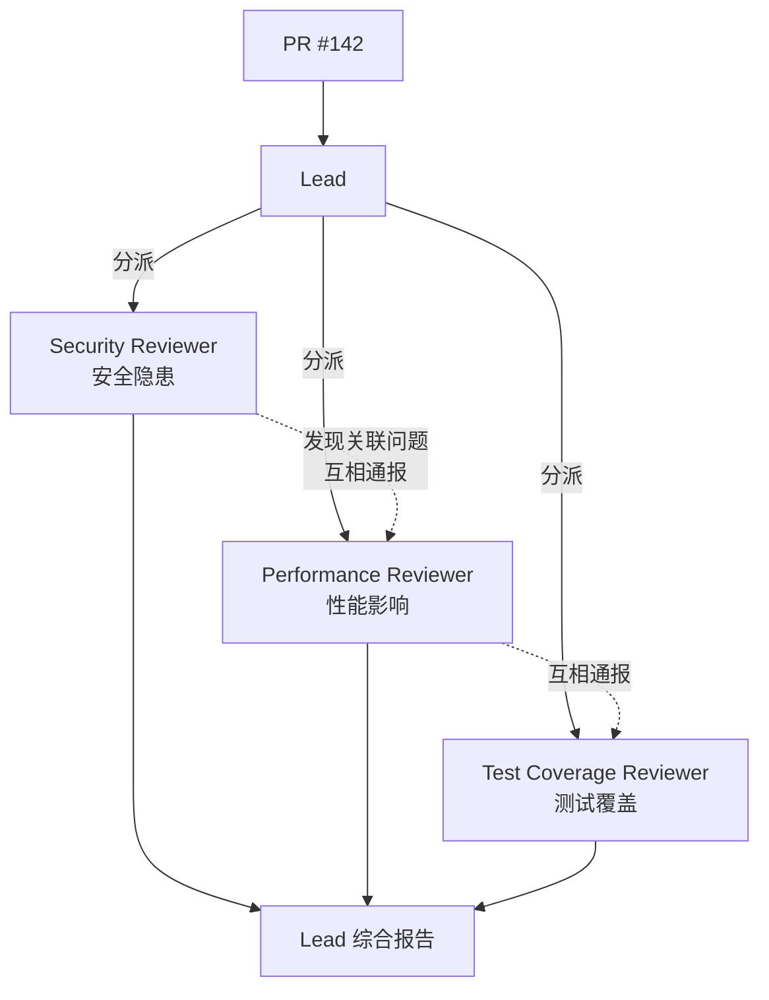
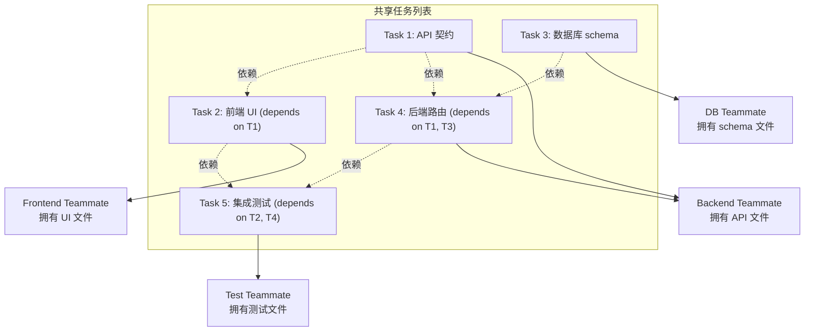
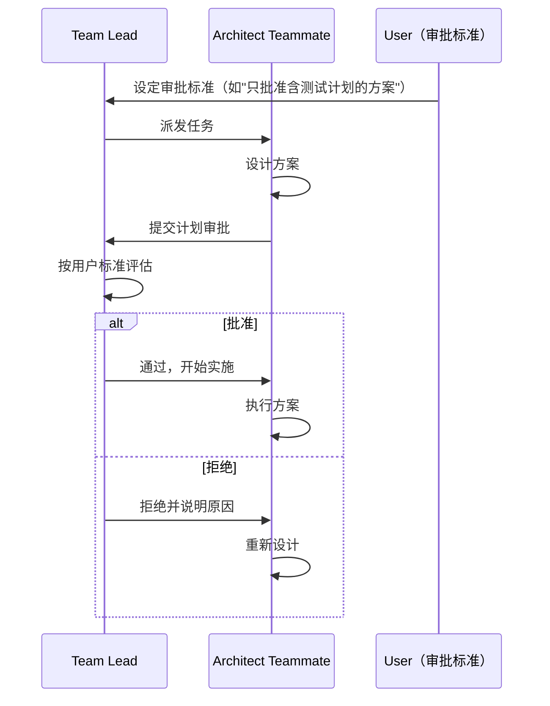
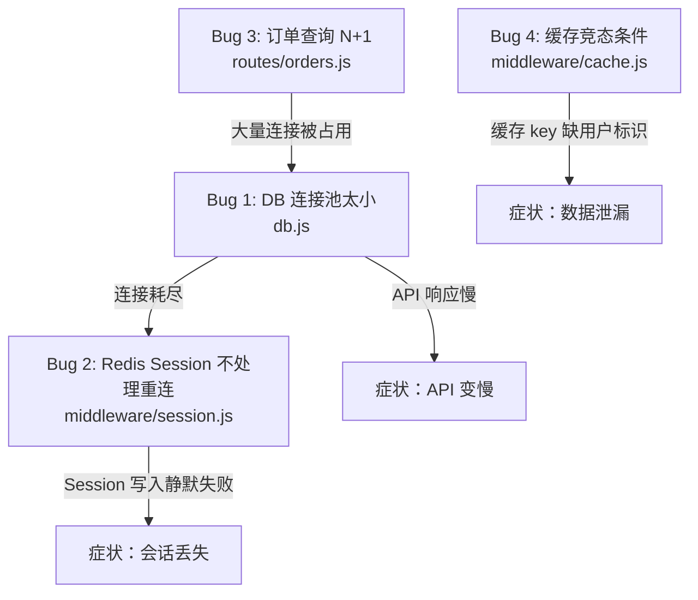
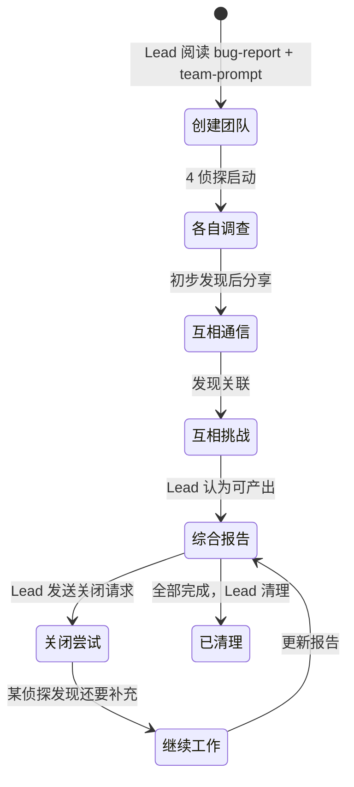
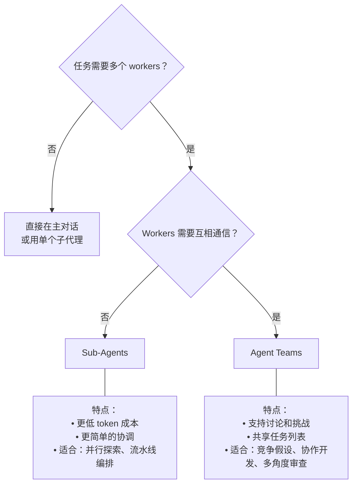

# Agent Teams 多会话协作架构

> 最后整理: 2026-06-16 | 来源: 黄佳《Claude Code 工程化实战》课程第 8 讲（SubAgent 终章）

> 关联: [子智能体（subagents）机制与实战](./子智能体（subagents）机制与实战.md) — Sub-Agents 的底层机制（spawn、context 隔离、tools 白名单）
> 关联: [并行探索与流水线编排](./并行探索与流水线编排.md) — Sub-Agents 的两种编排拓扑
> 关联: [从 Sub-Agent 到 Multi-Agent 的工程指南](<./从 Sub-Agent 到 Multi-Agent 的工程指南.md>) — 多智能体系统的宏观选型
> 关联: [Harness Engineering：AI Agent 时代的工程范式](<./Harness Engineering：AI Agent 时代的工程范式.md>) — 多 Agent 协作是 Harness 的工程化延伸

---

## 2026-06-16 - Agent Teams 全景

### §1 一句话定位

**Agent Teams = 多个独立 Claude Code 实例组成团队，Teammates 之间可以互相通信、挑战结论，而不只是向主对话汇报。**



**本质区别**：Sub-Agents 是"老板委派 → 员工汇报"的树状结构；Agent Teams 是"Lead 协调 + Teammates 协作"的网状结构。

---

### §2 启用与创建

Agent Teams 是**实验性功能**，默认关闭。两种启用方式：

```json
// settings.json
{
  "env": {
    "CLAUDE_CODE_EXPERIMENTAL_AGENT_TEAMS": "1"
  }
}
```

```bash
# 或 shell 环境
export CLAUDE_CODE_EXPERIMENTAL_AGENT_TEAMS=1
```

⚠️ **官方警告**：实验性功能有已知限制（详见官网 limitations），生产环境谨慎评估。

#### 创建团队的两种方式

| 方式 | 说明 |
|------|------|
| **自然语言** | 直接告诉 Claude "创建一个 agent team 来..."，Claude 按需创建 |
| **@-mention** | 用 `@teammate-name` 在对话中显式创建 |

```bash
# 自然语言创建
我在设计一个 CLI 工具来追踪代码库中的 TODO 注释。
创建一个 agent team 从不同角度探索这个问题：
一个 teammate 负责 UX，一个负责技术架构（用最好的模型），
一个扮演审评质疑者（用普通模型）。
```

---

### §3 团队组件与数据存储

一个 Agent Team 由以下组件构成：

| 组件 | 角色 | 说明 |
|------|------|------|
| **Team Lead** | 协调者 | 分配任务、综合结果、管理生命周期 |
| **Teammates** | 执行者 | 各自独立工作，独立 context window |
| **Task List** | 共享任务列表 | 支持任务依赖、自动解锁 |
| **Mailbox** | 消息系统 | Teammates 之间互相发消息 |

#### 本地数据存储

```
~/.claude/teams/{team-name}/config.json   ← 团队配置（members 数组）
~/.claude/tasks/{team-name}/              ← 任务列表
```

团队配置中的 `members` 数组记录每个 Teammate 的名称、agent ID、类型。Teammates 读取此文件来发现其他成员。这些由 Claude Code 自动管理，不需要手动操作。

---

### §4 显示模式与生命周期

Agent Teams 支持两种显示模式（具体显示方式由 Claude Code 管理）：



#### 关闭与清理流程

1. **关闭请求**：Lead 向 Teammate 发送关闭请求，Teammate 可以：
   - **批准**：优雅退出
   - **拒绝**：并解释原因（如"报告还没完成"），继续工作
2. **清理**：全部 Teammates 退出后，Lead 清理共享的团队资源
3. **清理原则**：
   - 清理前先关闭所有 Teammates
   - **只让 Lead 执行清理**（Teammates 的 team 上下文可能不正确）
   - 如需人工指示清理，也通过 Lead 发起

---

### §5 四大协作设计模式

从官方文档和工程实践中提炼的核心设计模式。

#### 模式一：竞争假设（Competing Hypotheses）

**适用场景**：根因不明确，需要从多个方向同时验证（bug 调查、故障诊断）。

**核心机制**：多个 Teammates 各自持有不同假设，互相挑战、试图推翻对方理论，像科学辩论一样。



**启动 prompt 示例**：

```text
用户报告应用在发送一条消息后就退出了，而不是保持连接。
生成 5 个 agent teammates 调查不同的假设。
让它们互相对话，试图推翻对方的理论，像科学辩论一样。
将最终共识更新到 findings 文档。
```

**工程价值**：

- **避免锚定效应**：多个独立调查者各自寻找证据
- **辩论机制**：每个假设必须经受挑战才能"存活"
- **最终"存活"的假设更可能是真正的根因**：顺序调查受锚定偏见影响，多独立调查者主动反驳才能挤出真相

#### 模式二：分层评审（Parallel Review）

**适用场景**：代码审查、PR Review 等需要多维度评估的任务。



**工程价值**：

- 每个维度都得到充分关注，不会因为注意力分散而遗漏
- 并行执行，时间成本不增加
- 不同专家可能发现关联问题（Security 发现的输入验证问题可能影响 Performance）

#### 模式三：模块化开发（Module Ownership）

**适用场景**：新功能开发，涉及多个独立模块（前端/后端/数据库/测试）。



**关键机制**：

- **任务依赖**：任务可以声明依赖其他任务，被阻塞的任务不能被认领
- **自动解锁**：依赖任务完成后，被阻塞的任务自动变为可认领
- **文件所有权**：每个 Teammate 负责不同的文件，避免冲突

#### 模式四：规划-审批（Plan Approval）

**适用场景**：复杂或高风险任务，需要在实施前确认方案。



**控制审批标准**（通过 prompt 影响 Lead 判断）：

```text
生成一个 architect teammate 来重构认证模块。
要求在修改任何代码前先提交计划等待审批。
只批准包含测试计划的方案。
拒绝任何修改数据库 schema 的方案。
```

---

### §6 实战项目：全栈 Bug 猎人

**项目场景**：ShopStream 电商应用（Express.js），植入多个相互关联的 bug。三个看似独立的症状：会话丢失、API 变慢、数据泄漏。

#### 级联故障链



#### 为什么需要 Agent Teams

| 维度 | Sub-Agents 模式 | Agent Teams 模式 |
|------|----------------|------------------|
| 单调查者行为 | 容易"锚定"，找到一个 bug 后就满意 | 多个侦探互相挑战，挤出更多真相 |
| 跨视角关联 | 子代理之间不能通信，看不到别人的发现 | Teammates 互相分享，发现级联效应 |
| 根因链完整性 | 只能发现独立 bug | 能发现 Bug 1 → Bug 2 → Bug 3 的因果链 |

**关键发现**：Session 侦探和数据库侦探各自的发现互相对照，才能看到"sticky session 5 分钟切换 → 新 Redis 连接被创建 → 连接耗尽"的完整链条。

#### 启动 prompt（竞争假设模式）

```text
阅读 bug-report.md 中描述的三个症状。然后创建一个 agent team 来调查这些问题。

生成 4 个 investigator teammates：
- "Session 侦探"：假设根因在 Session/Redis 层
- "数据库侦探"：假设根因在数据库连接和查询层
- "缓存侦探"：假设根因在缓存机制
- "架构侦探"：不预设假设，从整体架构角度分析

每个 teammate 的 prompt 中包含：
1. buggy-app/ 目录包含完整的应用代码
2. 他们需要用 Read/Grep/Glob 工具审查代码
3. 找到可疑问题后，要发消息告诉其他 teammates
4. 如果其他 teammate 的发现与自己的发现有关联，要主动指出
5. 特别注意：三个症状可能不是独立的，要寻找它们之间的因果关系

要求所有 teammates 在完成初步调查后互相分享发现，
并尝试挑战彼此的结论。

最终综合所有发现，生成一份按照 findings-template.md 格式的调查报告。
```

#### 执行流程观察



**有趣的细节**：Lead 尝试关闭时，某位侦探拒绝退出（"报告还需补充根因分析"），体现了 Teammates 的自主性。

---

### §7 Sub-Agents vs Agent Teams：选型决策树



#### 维度对比

| 维度 | Sub-Agents | Agent Teams |
|------|-----------|-------------|
| **通信拓扑** | 树状（只能向主对话汇报） | 网状（互相通信） |
| **Token 成本** | 低 | 显著高（每个 Teammate 独立 context） |
| **协调复杂度** | 低 | 高（消息通信消耗额外 token） |
| **成熟度** | GA | 实验性 |
| **适合任务** | 并行探索、流水线编排 | 竞争假设、协作开发、多角度审查 |
| **核心机制** | 派出去-带回来 | 组队讨论 |

#### 一句话决策

**Workers 需要互相通信 → Agent Teams；只需汇报结果 → Sub-Agents。**

---

### §8 Token 成本考量

Agent Teams 使用的 token **显著高于**单会话或子代理：

- 每个 Teammate 是独立的 Claude 实例，有独立的 context window
- 消息通信消耗额外 token
- 团队越大，成本越高

#### 适合 Agent Teams 的任务特征

- 并行探索能带来真正的价值
- 讨论和挑战能提高结果质量
- 任务复杂度值得额外成本

#### 不适合 Agent Teams 的任务特征

- 常规任务，单会话就够
- 任务之间没有协作需求
- 预算有限的场景

---

### §9 最佳实践

| # | 实践 | 说明 |
|---|------|------|
| 1 | **给 Teammates 足够的上下文** | Teammates 不继承 Lead 的对话历史，生成时要给足信息 |
| 2 | **合理拆分任务粒度** | 太小协调开销 > 收益；太大则无检查点增加返工风险。每个 Teammate 5-6 个任务较合适 |
| 3 | **避免文件冲突** | 两个 Teammates 编辑同一文件会覆盖。拆分时确保每个 Teammate 拥有不同的文件集 |
| 4 | **监控并引导** | 不要让 team 无人看管运行太久。定期检查进度，纠正偏离方向 |
| 5 | **从研究和审查任务开始** | 初学 Agent Teams 从边界清晰、不写代码的任务开始（PR 审查、调研、bug 调查） |
| 6 | **让 Lead 等待 Teammates 完成** | Lead 可能在 Teammates 完成前就开始下一步，必要时提示"等待 teammates 完成后再继续" |

#### 任务粒度量化参考

- 任务最好是**自包含单元**，产出明确的交付物（一个函数、一个测试文件、一份审查报告）
- 每个 Teammate **5-6 个任务**比较合适
- 让所有人保持忙碌，便于 Lead 在某人卡住时重新分配

---

### §10 与 Multi-Agent 架构的关系

Agent Teams 是 Claude Code 在**开发工具层**的 Multi-Agent 实现，但它不是应用层的 Multi-Agent 系统设计：

| 维度 | Agent Teams（开发工具） | 应用层 Multi-Agent（如客服系统） |
|------|------------------------|--------------------------------|
| **服务对象** | 开发者自己 | 外部终端用户 |
| **运行环境** | Claude Code CLI | 业务系统（Web/后端） |
| **技术栈** | Claude Code 内置 | Agent SDK / Anthropic API |
| **目标** | 提升开发效率 | 解决业务流程问题 |

> 关联: [Headless 模式与 Agent SDK](<./Headless 模式与 Agent SDK.md>) — Claude Code headless vs 自建 Agent 的选型决策

---

### §11 思考题（课程原题，留作回顾）

1. 回顾之前用子代理做的任务。哪些场景如果用"竞争假设"模式效果更好？
2. "模块化开发"模式中，两个 Teammates 需要修改同一接口文件（如 API 契约），如何处理文件冲突？
3. 对比 Sub-Agents 的"流水线编排"和 Agent Teams 的"规划-审批"模式。两者解决的问题有什么不同？
4. 设计一个技术方案评审：三个 Teammates 分别代表"性能优先""可维护性优先""快速交付优先"三种立场。给 Lead 什么指令能产出高质量决策？
5. 全栈 Bug 猎人项目中，如果用子代理（而非 Agent Teams）调查，哪些关联会被遗漏？

---

### §12 本项目目前的应用状态

本项目（ans-ai-auto-notes）**尚未启用 Agent Teams**——目前的多 agent 协作都在 Sub-Agents 层面（Explore / code-reviewer / kb-auditor / idea-extractor / plan-executor）。

**潜在应用场景**（待评估）：

- **KB 架构审查**：多个 Teammates 分别从"结构合理性 / 内容深度 / 链接完整性 / 风格一致性"四个维度审查整个 KB
- **长篇笔记重构**：对于 §5 警告的 5 个超 1000 行文件，多个 Teammates 并行拆分不同章节
- **复杂主题调研**：如调研"Claude Code vs Cursor vs Windsurf 的 Multi-Agent 实现差异"，多个 Teammates 各负责一个工具

但当前优先级不高——Sub-Agents 已经覆盖了大部分需求，Agent Teams 的 token 成本对日常维护场景偏贵。

---

## 附：Claude Code 官方最佳实践补充

> 来源: 课程末尾总结

1. **实验性功能限制**：详见官网 limitations 章节
2. **权限配置**：同 Sub-Agents 通过 `tools` 字段控制，但 Teammates 之间通信权限由 Lead 管理
3. **清理安全**：永远通过 Lead 清理，不要直接 kill Teammates 进程
