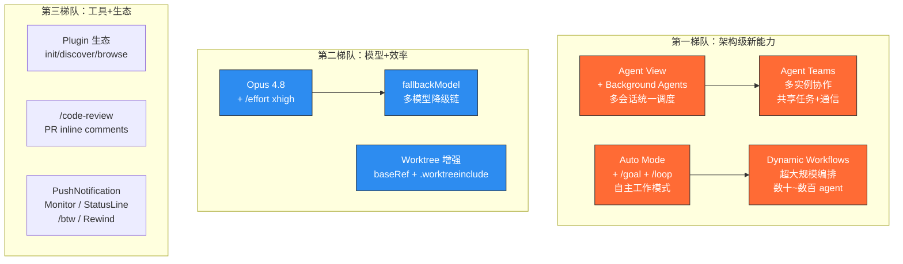
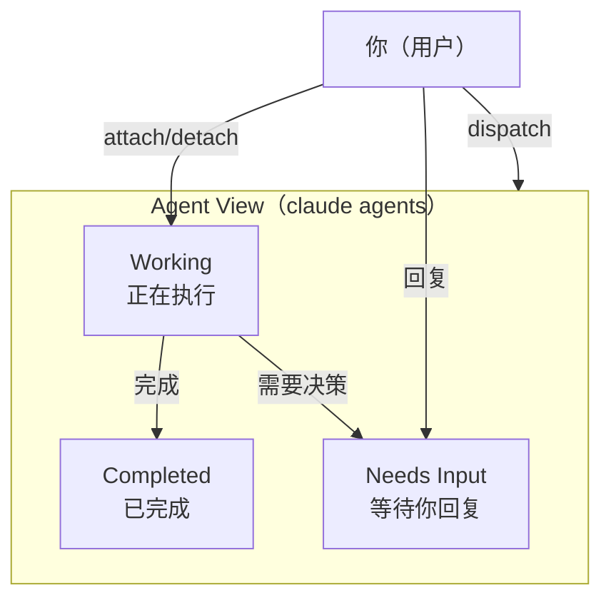
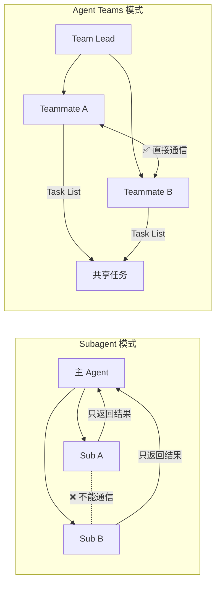
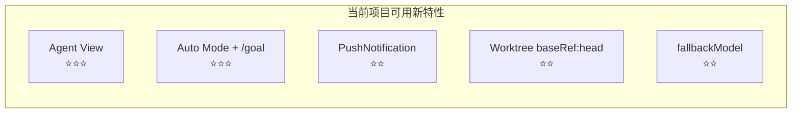
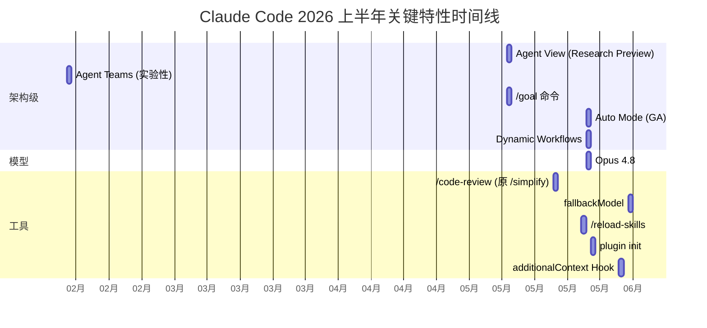

# Claude Code 2026 上半年新特性与项目实践

> 最后整理: 2026-06-08 | 来源: [官方 Changelog](https://code.claude.com/docs/en/changelog) + 官方文档交叉验证

> 关联: [Claude Code 整体架构 & 工作流程](<./Claude Code 整体架构 & 工作流程.md>) — 主架构鸟瞰
> 关联: [子智能体（subagents）机制与实战](./子智能体（subagents）机制与实战.md) — subagent 底层机制
> 关联: [从 Sub-Agent 到 Multi-Agent 的工程指南](<./从 Sub-Agent 到 Multi-Agent 的工程指南.md>) — 四种多智能体模式
> 关联: [并行探索与流水线编排](./并行探索与流水线编排.md) — 并行/流水线编排实战
> 关联: [Plugins 插件体系](<./Plugins 插件体系.md>) — 插件底层机制
> 关联: [Claude Code 进阶工作流：从能用到高效](<./Claude Code 进阶工作流：从能用到高效.md>) — 日常工作流实战

---

## §1 背景：为什么需要这份笔记

黄佳《Claude Code 工程化实战》课程大约在 2026 年 2-3 月定稿。但从 2026 年 1 月到 6 月，Claude Code 迭代了近 40 个版本（v2.1.126 → v2.1.166），引入了多个架构级新能力。课程中提到的 subagent、skill、hook、MCP 等基础概念仍然成立，但上层的编排能力、自主工作模式、多会话管理有了质变。

本文按"影响量级"分三个梯队梳理，每个特性标注**课程是否覆盖**和**对当前项目的可利用度**。

---

## §2 特性全景图



---

## §3 第一梯队：架构级新能力

### 3.1 Agent View + Background Agents

**课程覆盖**：❌ 未覆盖（课程只讲了 subagent，没有 Background Agent 概念）

**是什么**：`claude agents` 命令打开一个统一面板，管理所有 Claude Code 会话——运行中的、等待输入的、已完成的。每个 background session 是一个完整的 Claude Code 对话，不需要终端一直打开。



**核心操作**：

| 操作 | 方式 |
|------|------|
| 打开 Agent View | `claude agents` |
| 把当前会话转后台 | `/bg` 或 `←←` |
| Pin 重要会话 | `Ctrl+T`（pin 后不被 idle 回收） |
| 恢复后台会话 | `/resume`（v2.1.144 起支持 bg 会话） |
| 编程接口 | `claude agents --json`（集成 tmux/状态栏） |
| 文件隔离 | 每个后台会话自动 worktree 隔离 |

**与 subagent 的本质区别**：

| 维度 | Subagent | Background Agent |
|------|----------|------------------|
| 生命周期 | 一次性，跑完即销毁 | 持久化，可 pin/resume/detach |
| Context | 寄生在主进程，独立 context | 完全独立的 Claude Code 实例 |
| 交互 | 不能直接与用户对话 | 可以 attach 进去直接对话 |
| 文件隔离 | 默认共享主 agent 工作目录 | 自动 worktree 隔离 |

### 3.2 Agent Teams（实验性）

**课程覆盖**：黄佳课程末尾提到"Agent Teams 很适合整合进 SubAgent 专题"但未展开

**是什么**：多个 Claude Code 实例组成"团队"，有 team lead、共享任务列表、成员间直接通信。

**启用**（实验性，默认关闭）：

```json
// ~/.claude/settings.json
{
  "env": {
    "CLAUDE_CODE_EXPERIMENTAL_AGENT_TEAMS": "1"
  }
}
```

**架构四要素**：

| 组件 | 作用 |
|------|------|
| **Team Lead** | 创建团队、spawn 成员、协调工作的主会话 |
| **Teammates** | 独立的 Claude Code 实例，各自有完整 context |
| **Task List** | 共享任务列表（pending/in_progress/completed + 依赖） |
| **Mailbox** | 成员间直接通信的消息系统 |

**与 subagent 的关键区别**：subagent 只能向主 agent 汇报结果，成员之间不能通信。Agent Teams 的成员可以互相发消息、共享发现、甚至互相挑战对方的结论。



**最佳场景**：
- 多视角代码审查（安全/性能/测试覆盖各一个 teammate）
- 竞争假说调试（多个 teammate 并行测试不同理论，互相挑战）
- 跨层协调（前端/后端/测试各一个 teammate）

**关键限制**：
- 不支持 session resumption（resume 后 in-process teammates 不恢复）
- 一次只能管理一个 team
- teammate 不能创建自己的 team（不能嵌套）
- Token 成本显著高于 subagent

### 3.3 Auto Mode + /goal + /loop

**课程覆盖**：❌ 未覆盖

**Auto Mode**：Claude 在执行工具调用时，由安全分类器自动判断是否需要用户确认。低风险操作（如读文件）自动放行，高风险操作（如删文件）仍弹确认。相比固定的权限模式（Accept-Edit / Accept-All），Auto Mode 更智能、中断更少。

**`/goal` 命令**（v2.1.139+）：设定完成条件，Claude 跨多轮持续工作直到达标。会显示实时进度面板。

```
/goal 审计所有 kb/ 下超过 800 行的文件，给每个文件写 audit report

→ Claude 自主逐个处理，不用你每次说"继续"
→ 实时面板显示进度
→ 达标后自动停止
```

**`/loop` 命令**：动态定时循环执行任务。配合 `ScheduleWakeup` 工具自主调节检查间隔（cache-aware——5 分钟内保持 prompt cache 热，超过则拉长间隔避免浪费）。

**`CronCreate` 工具**：在会话内创建 cron 定时任务，会话存活期间有效（7 天自动过期）。

**`PushNotification` 工具**：长任务完成时推送桌面/手机通知，把注意力拉回来。

### 3.4 Dynamic Workflows（v2.1.154+）

**课程覆盖**：❌ 未覆盖

最重量级的编排能力——跨数十到数百个 agent 编排工作。`/workflows` 查看运行状态，关键词 `ultracode` 触发。目前仍在早期阶段，适合大规模代码库的全面重构/迁移/审计等超大任务。

---

## §4 第二梯队：模型 + 效率提升

### 4.1 Opus 4.8

**发布**：2026-05-28（v2.1.154）

| 维度 | 变化 |
|------|------|
| 默认 effort | high（之前是 medium） |
| 最大 effort | `/effort xhigh`（新增级别，用于最难任务） |
| Fast mode | Opus 4.8 上 2x 速率，2.5x 速度提升 |
| Effort 滑块 | 改名为 Faster ↔ Smarter |

### 4.2 fallbackModel（v2.1.166）

配置最多 3 个备选模型，主模型过载时自动降级：

```json
// settings.json
{
  "fallbackModel": ["claude-sonnet-4-6", "claude-haiku-4-5"]
}
```

工程价值：长时间自主工作（/goal、/loop）时，不会因为 API 过载而中断。

### 4.3 Worktree 增强

| 特性 | 说明 | 启用方式 |
|------|------|---------|
| `baseRef: "head"` | 从当前 HEAD 创建分支（保留未 push 的 commit） | `settings.json: {"worktree": {"baseRef": "head"}}` |
| `.worktreeinclude` | 自动复制 `.env` 等 gitignored 文件到新 worktree | 项目根目录放 `.worktreeinclude` 文件 |
| subagent isolation | subagent frontmatter 加 `isolation: worktree` | agent 定义文件里加字段 |
| PR 分支 | `claude --worktree "#1234"` 从 PR 创建 worktree | CLI flag |

---

## §5 第三梯队：工具 + 生态增强

### 5.1 Plugin 生态成熟

| 能力 | 说明 |
|------|------|
| `claude plugin init <name>` | 脚手架一键创建 plugin 骨架 |
| `/plugin` Discover/Browse | 展示组件清单 + token 成本预估 + 最后更新日期 |
| `--plugin-url` / `--plugin-dir` | 直接加载 URL 或本地 zip 插件 |
| 依赖链管理 | 有被依赖关系的 plugin 不能 disable |
| `.claude/skills/` 自动加载 | 无需 marketplace 注册 |
| `/reload-skills` | 不重启即重新扫描 skill 目录 |

### 5.2 /code-review（原 /simplify）

```
/code-review              → 标准审查
/code-review --fix        → 审查 + 自动修复
/code-review --comment    → 在 GitHub PR 上写 inline comments
```

### 5.3 其他实用工具

| 工具/命令 | 用途 | 版本 |
|----------|------|------|
| `/btw` | 主对话内的"侧问"，不中断当前任务流 | 较早 |
| `Monitor` 工具 | 流式监控后台进程输出（`tail -f` + `grep`） | 较早 |
| `StatusLine` | 底栏持续显示自定义状态信息 | 较早 |
| `MessageDisplay` Hook | 变换/隐藏 assistant 消息文本 | v2.1.152 |
| `Rewind + Summarize` | 压缩早期 context 到指定位置 | v2.1.141 |
| `/context all` | 查看每个 skill/plugin 的 token 消耗 | 近期 |
| `additionalContext` in Stop Hook | Stop/SubagentStop hook 返回额外上下文继续当前 turn | v2.1.163 |
| `SessionStart` 设 session title | hook 通过 `hookSpecificOutput.sessionTitle` 设标题 | v2.1.152 |

---

## §6 与当前项目（ans-ai-auto-notes）的落地分析

### 6.1 可立即利用的



| 特性 | 结合方式 | 优先级 |
|------|---------|--------|
| **Agent View** | 同时开多个 session 做不同 KB 主题的深度笔记写入，Agent View 统一监控进度 | ⭐⭐⭐ |
| **Auto Mode + /goal** | 设 goal 如"审计所有 >800 行的 KB 文件并输出 audit report"，Claude 自主逐个处理 | ⭐⭐⭐ |
| **PushNotification** | kb-auditor 等长任务完成时推送通知，不用盯着终端等 | ⭐⭐ |
| **Worktree baseRef:head** | subagent worktree 基于当前分支而非 origin/main，能看到未 push 的新 KB 文件 | ⭐⭐ |
| **fallbackModel** | 长时间 /goal 或 /loop 工作时，API 过载自动降级不中断 | ⭐⭐ |
| **/reload-skills** | 改完 skill 定义后不用重启 session | ⭐⭐ |
| **additionalContext in Stop Hook** | exit-check.sh 发现问题后可以返回额外上下文让 Claude 继续修复，而非只是打印警告 | ⭐⭐ |

### 6.2 中期可探索的

| 特性 | 结合方式 | 优先级 |
|------|---------|--------|
| **Agent Teams** | 多视角 KB 审查（深度/链接/视觉化各一个 teammate），但 token 成本高，适合大批量 audit | ⭐ |
| **/loop + CronCreate** | 定时检查 KB 健康度（如每小时跑 arch-lint），有问题自动修复 | ⭐ |
| **Plugin init** | 把当前 superpowers 重构为标准 plugin 骨架，便于版本管理 | ⭐ |

### 6.3 暂不需要的

| 特性 | 原因 |
|------|------|
| Dynamic Workflows | 当前 63 篇 KB，规模不需要数十~数百 agent 编排 |
| Agent Teams 常态化 | 单人项目，token 成本 ROI 不合算 |
| /code-review --comment | 不是代码项目，不产 PR review |

### 6.4 建议的配置改动

以下可以立即加到项目配置中获益：

```json
// ~/.claude/settings.json 或 .claude/settings.local.json
{
  "fallbackModel": ["claude-sonnet-4-6"],
  "worktree": {
    "baseRef": "head"
  }
}
```

---

## §7 特性演进时间线



---

## §8 总结：课程知识 + 新特性的协同

黄佳课程打下的基础（subagent/skill/hook/MCP/headless/plugin）仍然是 Claude Code 的核心骨架。2026 上半年的新特性主要在**两个方向**上扩展：

1. **从"单会话内编排"到"多会话编排"**：subagent → Background Agent → Agent Teams → Dynamic Workflows，编排粒度越来越大
2. **从"人机交互"到"自主工作"**：Accept-Edit → Auto Mode → /goal → /loop → CronCreate，人工介入越来越少

对于当前项目（单人维护的知识库），最有价值的组合是：

```
Auto Mode + /goal（自主工作）
  + Agent View（多会话监控）
  + fallbackModel（稳定性保障）
  + Worktree baseRef:head（subagent 看到最新改动）
  + PushNotification（完成通知）
```

这套组合让 Claude Code 从"你说一步我做一步"进化到"你给目标我自主完成"。
