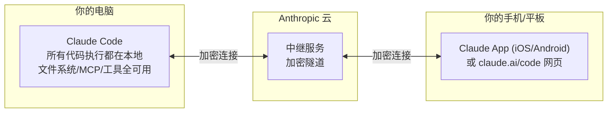
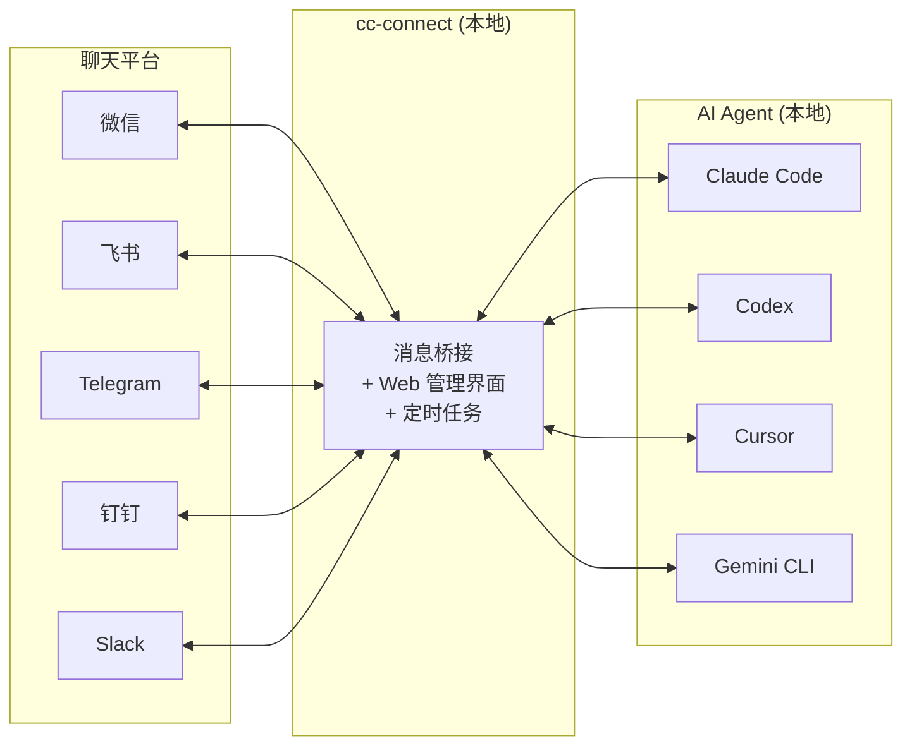

# Claude Code 远程操控：Remote Control 与 cc-connect

> 最后整理: 2026-05-11 | 来源: 对话讨论

## 两个容易混淆的东西

围绕"用手机操控 Claude Code"，目前有两个主要方案，来源完全不同：

| | Remote Control（官方） | cc-connect（第三方开源） |
|------|----------------------|---------------------|
| **来源** | Anthropic 官方功能 | 社区开源 ([GitHub](https://github.com/chenhg5/cc-connect)) |
| **入口** | Claude App / claude.ai/code | 微信/飞书/钉钉/Telegram 等 |
| **支持 Agent** | 仅 Claude Code | Claude Code + Codex + Cursor + Gemini CLI 等 10+ |
| **交互体验** | 完整编程界面，`@` 补全文件路径 | 纯文本聊天窗口 |
| **适合场景** | 离开电脑后继续编程 | 把 AI Agent 当聊天机器人用 |
| **依赖** | Claude Pro/Max/Team 订阅 | 免费，自己配 API |

---

## Remote Control：官方远程控制

Claude Code v2.1.51 推出的官方功能（研究预览阶段），核心理念是"在电脑上启动任务，在手机上继续"。

### 架构



**关键点**：代码始终在本地执行，手机只是远程终端窗口。没有任何代码或文件上传到云端。

### 使用方式

```bash
# 方式1：专用远程控制服务器模式
claude remote-control
# 启动后显示 QR 码 + URL，手机扫码接入

# 方式2：在已有会话中开启
claude --remote-control
# 或在会话内输入命令
/remote-control

# 支持的参数
claude remote-control --name "My Project"  # 自定义会话标题
claude remote-control --spawn worktree     # 每个会话独立 git worktree
claude remote-control --capacity 32        # 最大并发会话数
```

### 连接方式

1. **扫 QR 码** — 终端显示的二维码，用 Claude App 扫
2. **打开 URL** — 在任意浏览器访问 claude.ai/code
3. **会话列表** — 在 Claude App 中按名称查找，绿色状态点表示在线

### 典型工作流

```
早上9点: 在电脑上 claude remote-control，启动项目
通勤路上: 手机打开 Claude App，扫码接入
  → "帮我看看昨天提交的 PR 有没有 lint 问题"
  → Claude Code 在电脑上执行 git/lint 命令，结果实时返回手机
午饭时: 手机上继续
  → "把那个 API 的返回格式改一下，加个 total 字段"
  → Claude Code 在电脑上改代码、跑测试
下午回到电脑: 终端里能看到所有远程操作的历史
```

---

## cc-connect：第三方消息桥接

cc-connect 是社区开源项目（Go 语言，MIT 协议），定位是**通用的消息桥接器**——把本地 AI Agent 连接到你日常使用的聊天平台。

### 架构



### 支持的平台

| 平台 | 连接方式 | 需要公网IP？ |
|------|---------|------------|
| 微信（个人号） | iLink 长轮询 | 不需要 |
| 企业微信 | WebSocket / Webhook | 不需要(WS) |
| 飞书 | WebSocket | 不需要 |
| 钉钉 | Stream | 不需要 |
| Telegram | Long Polling | 不需要 |
| Slack | Socket Mode | 不需要 |
| Discord | Gateway | 不需要 |
| 微博私信 | WebSocket | 不需要 |
| LINE | Webhook | 需要 |
| QQ | WebSocket | 不需要 |

微信接入的背景：2026 年 3 月微信开放了 **iLink Bot API**（OpenClaw），允许第三方通过官方协议接入微信，cc-connect 基于此实现**合规接入**（非逆向工程）。

### 安装与使用

```bash
# 安装
npm install -g cc-connect
# 或
brew install cc-connect

# 配置（推荐 Web UI）
cc-connect web    # 打开浏览器配置界面

# 启动
cc-connect
```

### 核心功能

- **多 Agent 支持**：Claude Code / Codex / Cursor / Gemini CLI / Kimi CLI 等 10+
- **多项目管理**：`/dir` 切换工作目录，每个项目独立 Agent + 平台配置
- **定时任务**：`/cron add 0 6 * * * 每天总结 GitHub trending`
- **模型切换**：`/model switch gpt-4o`
- **语音输入**：发语音消息，自动 STT 转文字后发给 Agent
- **图片发送**：Agent 生成的截图/图表可以发回聊天
- **Web 管理界面**：v1.3.0 新增，可视化管理项目、Agent、定时任务

### 类似项目

| 项目 | 特点 |
|------|------|
| **cc-connect** | 功能最全，11 平台 + 10+ Agent |
| **cc-wechat** | 专注微信，扫码即用 |
| **cc-weixin** | 基于微信官方 iLink Bot API |
| **gewe-cc** | 任务完成后自动微信通知 + 等待下一步指令 |

---

## 怎么选

| 你的需求 | 推荐 |
|---------|------|
| 离开电脑后继续编程，要完整体验 | **Remote Control** |
| 想在微信/飞书群里给 AI 发指令 | **cc-connect** |
| 团队协作，多人共用一个 Agent | **cc-connect**（群聊模式） |
| 只用 Claude Code，要最稳定 | **Remote Control** |
| 要同时操控多个不同 Agent | **cc-connect** |

两者不互斥，可以同时使用。

> 关联: [Claude Code 架构](<./Claude Code 整体架构 & 工作流程.md>) — Claude Code 整体架构与工作流程
> 关联: [Agent 开发实战](<../应用/Agent 开发实战：选型、框架与思维转换.md>) — Agent 开发范式与设计要点
