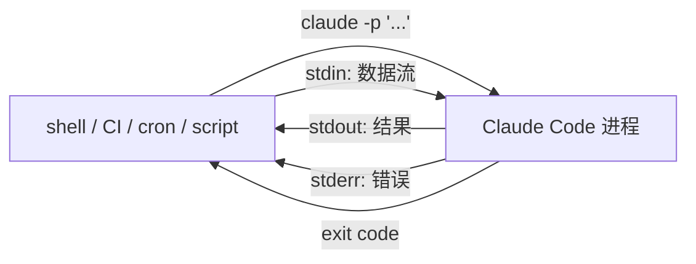
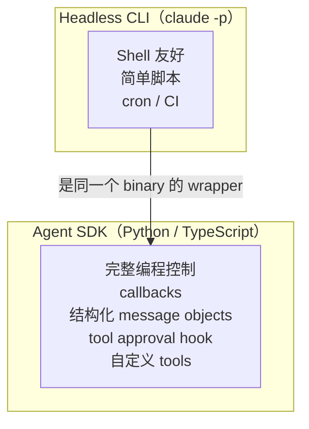

# Headless 模式与 Agent SDK

> 最后整理: 2026-06-02 | 来源: 黄佳《Claude Code 工程化实战》课程 + [Claude Code Headless 官方文档](https://code.claude.com/docs/en/headless)

> 关联: [Claude Code 整体架构 & 工作流程](<./Claude Code 整体架构 & 工作流程.md>) — 交互模式下的整体架构
> 关联: [子智能体（subagents）机制与实战](./子智能体（subagents）机制与实战.md) — `--agent` 在 headless 里的用法
> 关联: [Hooks 事件全景与拦截机制](<./Hooks 事件全景与拦截机制.md>) — `Setup` event 专为 headless 设计
> 关联: [从 Sub-Agent 到 Multi-Agent 的工程指南](<./从 Sub-Agent 到 Multi-Agent 的工程指南.md>) — 生产 Multi-Agent 部署中 Headless 作为运行时入口

---

## §1 一句话定位

**Headless 模式 = Claude Code 不打开 TUI、不进 REPL，给一个 prompt、跑完、打印结果、退出**。是 Claude Code 作为 shell 工具/CI 步骤/cron 任务/subprocess 调用时的形态。



跟交互模式的区别只是**输入输出形态**，内部 agentic loop 完全一致——同样的工具、同样的 skill/subagent/MCP/hook 加载（除非 `--bare`）。

---

## §2 最小例子三连

```bash
# 1. 问一个问题
claude -p "What does the auth module do?"

# 2. 修一个 bug（带工具白名单）
claude -p "Find and fix the bug in auth.py" --allowedTools "Read,Edit,Bash"

# 3. 管道喂数据
cat build-error.txt | claude -p 'concisely explain the root cause' > output.txt
```

`-p` 是 `--print` 缩写：不进入 REPL，跑完打印 stdout 后退出。所有 CLI flag 都能跟 `-p` 一起用。

---

## §3 `--bare`：CI 救星

**新的最佳实践**：CI / 脚本场景**总是加 `--bare`**。

`--bare` 跳过所有 auto-discovery：

```text
不加 --bare 时会自动加载：
- ~/.claude/CLAUDE.md
- 项目 CLAUDE.md
- ~/.claude/agents/ ~/.claude/skills/ ~/.claude/commands/
- .claude/agents/ .claude/skills/ .claude/commands/
- .claude/settings.json
- .mcp.json
- ~/.claude.json 里的 MCP server
- 所有 hooks
- 所有 plugins
- 自动 memory 系统
- ...
```

加 `--bare` 后**这些都不读**。好处：

- **启动快**（少读几十个文件）
- **可重现**（不被本地"刚好在用的某个 hook"污染）
- **跨机一致**（团队 A 装了 X plugin、团队 B 没装，结果一致）
- **CI 安全**（CI runner 上的 `~/.claude` 残留不会影响）

需要什么显式传：

| 想加载 | flag |
|--------|------|
| 系统 prompt 追加 | `--append-system-prompt` 或 `--append-system-prompt-file` |
| 设置 | `--settings <file-or-json>` |
| MCP server | `--mcp-config <file-or-json>` |
| 自定义 agent | `--agents '<JSON>'` |
| Plugin | `--plugin-dir <path>` 或 `--plugin-url <url>` |

⚠️ Bare 模式跳过 OAuth 和 keychain，认证必须从 `ANTHROPIC_API_KEY` 或 `apiKeyHelper` 来（Bedrock/Vertex/Foundry 用各自的凭证）。

```bash
# CI 典型用法
claude --bare -p "Summarize this file" --allowedTools "Read"
```

> 文档明确说：**`--bare` 未来会成为 `-p` 的默认行为**。早用早适应。

---

## §4 输出格式三选

`--output-format` 控制 stdout 格式：

| 格式 | 适合 | stdout 内容 |
|------|------|-----------|
| `text`（默认） | 人读 | Claude 的最终回复纯文本 |
| `json` | 脚本解析 | 一个完整 JSON：result + session_id + cost + 元数据 |
| `stream-json` | 实时流 | 每行一个 JSON event（NDJSON） |

### JSON 模式

```bash
claude -p "Summarize this project" --output-format json
```

返回：

```json
{
  "result": "...",
  "session_id": "...",
  "total_cost_usd": 0.045,
  "usage": { ... },
  ...
}
```

```bash
# 提取 result 字段
claude -p "Summarize" --output-format json | jq -r '.result'
```

CI 场景特别适合用 `total_cost_usd` 做成本预算告警。

### Schema 强约束输出

```bash
claude -p "Extract function names from auth.py" \
  --output-format json \
  --json-schema '{"type":"object","properties":{"functions":{"type":"array","items":{"type":"string"}}},"required":["functions"]}'
```

返回的 JSON 里有 `structured_output` 字段保证符合 schema：

```bash
claude -p "..." --output-format json --json-schema '...' | jq '.structured_output'
```

这是把 Claude 当**结构化抽取器**的最佳用法。

### Stream-JSON 模式

```bash
claude -p "Write a poem" --output-format stream-json --verbose --include-partial-messages
```

每行一个事件 JSON。**典型事件类型**：

| event type / subtype | 含义 |
|---------------------|------|
| `system/init` | 第一个事件：session 元数据（model、tools、plugins） |
| `system/plugin_install` | （仅 `CLAUDE_CODE_SYNC_PLUGIN_INSTALL`）plugin 安装进度 |
| `system/api_retry` | API 调用因 5xx/rate_limit 重试，含 `attempt`/`max_retries`/`retry_delay_ms`/`error_status` |
| `stream_event` + `text_delta` | LLM 流式生成的 token（最常见，要拼起来才是完整文本） |
| `tool_use` | Claude 调工具 |
| `tool_result` | 工具返回 |
| `result` | 最终结果 |

**只显示流式文本**（用 jq 过滤）：

```bash
claude -p "Write a poem" --output-format stream-json --verbose --include-partial-messages | \
  jq -rj 'select(.type == "stream_event" and .event.delta.type? == "text_delta") | .event.delta.text'
```

`-r` 输出 raw string（无引号），`-j` 不加换行 → token 连续流出。

---

## §5 权限的 headless 配置

交互模式可以弹窗问"允许 Bash 吗？"，headless 没法弹窗。需要预授权：

```bash
# 工具白名单
claude -p "Run tests and fix failures" \
  --allowedTools "Bash,Read,Edit"

# 更细：只允许特定 Bash 命令
claude -p "Create a commit" \
  --allowedTools "Bash(git diff *),Bash(git log *),Bash(git status *),Bash(git commit *)"

# 模式级
claude -p "Apply lint fixes" --permission-mode acceptEdits
```

### Permission mode 选择

| 模式 | 行为 | 适合 |
|------|------|------|
| `default` | 凡需要权限都报错退出 | 严格的 CI |
| `acceptEdits` | 文件编辑、`mkdir`/`touch`/`mv`/`cp` 自动允许，其他仍需 `--allowedTools` | 自动化批量修改 |
| `dontAsk` | 凡不在 allow 列表的都拒绝 | 锁死安全的 CI |
| `auto` | 后台分类器评估 | 中等自动化场景 |
| `bypassPermissions` | 跳过所有权限检查 ⚠️ | **危险**，仅在隔离环境用 |

CLI flag `--permission-mode <mode>` 设全局，`--allowedTools` 是额外白名单。

---

## §6 续接对话：--continue / --resume

跨次调用保持上下文：

```bash
# 第一次
claude -p "Review this codebase for performance issues"

# 续上一次最近的对话
claude -p "Now focus on the database queries" --continue
claude -p "Generate a summary of all issues found" --continue
```

明确指定 session ID：

```bash
session_id=$(claude -p "Start a review" --output-format json | jq -r '.session_id')
claude -p "Continue that review" --resume "$session_id"
```

适合：CI 里跑长任务分阶段、批处理多文件复用同一 context。

---

## §7 CI 集成范例

### 7.1 package.json script

```json
{
  "scripts": {
    "lint:claude": "git diff main | claude --bare -p \"you are a typo linter. for each typo in this diff, report filename:line on one line and the issue on the next. return nothing else.\" --allowedTools Read"
  }
}
```

> 注意是**管道喂 diff**（不是让 Claude 自己跑 `git diff`），所以不需要 Bash 权限。脚本更可移植。

### 7.2 GitHub Action（PR 自动 typo 检查）

```yaml
name: Claude typo check
on:
  pull_request:

jobs:
  typo:
    runs-on: ubuntu-latest
    steps:
      - uses: actions/checkout@v4
        with:
          fetch-depth: 0
      - name: Install Claude Code
        run: npm install -g @anthropic-ai/claude-code
      - name: Check for typos
        env:
          ANTHROPIC_API_KEY: ${{ secrets.ANTHROPIC_API_KEY }}
        run: |
          git fetch origin main
          git diff origin/main HEAD | claude --bare -p \
            "you are a typo linter. list filename:line then the issue, nothing else." \
            --allowedTools Read \
            --output-format json | jq -r '.result'
```

### 7.3 Git pre-commit hook 调用 Claude

`.git/hooks/pre-commit`：

```bash
#!/bin/bash
# 用 Claude 做 commit message 建议
STAGED=$(git diff --cached --name-only)
if [ -z "$STAGED" ]; then exit 0; fi

git diff --cached | claude --bare -p \
  "suggest a conventional commit message for these changes. one line only, no markdown" \
  --allowedTools Read \
  --output-format json | jq -r '.result' > .git/COMMIT_EDITMSG_SUGGESTION

echo "建议的 commit message 在 .git/COMMIT_EDITMSG_SUGGESTION"
```

> 注意这是个**建议**而非阻断——Claude 提示给人类决定。Claude 自己阻断 commit 风险太大。

---

## §8 输入：stdin / pipe / 文件

### Pipe 输入

```bash
cat build-error.txt | claude -p 'explain root cause'
echo "fix this" | claude -p
```

⚠️ Claude Code v2.1.128 起 stdin 限 10MB。超过会报错非零退出。**大输入写到文件、prompt 里引用路径**：

```bash
# 错误
cat huge-log.txt | claude -p "summarize"

# 正确
claude -p "summarize /tmp/huge-log.txt" --allowedTools "Read"
```

### `--input-format stream-json`

让外部程序往 Claude Code 喂结构化事件。这是 Agent SDK 的低级接口——对一般用户来说，直接用 Python/TypeScript SDK 更友好。

---

## §9 自定义 system prompt

```bash
gh pr diff "$1" | claude -p \
  --append-system-prompt "You are a security engineer. Review for vulnerabilities." \
  --output-format json
```

| flag | 作用 |
|------|------|
| `--append-system-prompt "..."` | 追加到默认 system prompt 后 |
| `--append-system-prompt-file path` | 从文件读 |
| `--system-prompt "..."` | **完全替换**默认 prompt（极慎用，会丢失 Claude Code 内置行为） |

通常用 append 即可——保留 Claude Code 自带行为 + 加你的角色。

---

## §10 Headless 不能用的功能

| 功能 | 原因 |
|------|------|
| Plan mode | 需交互 |
| AskUserQuestion 工具 | 无法弹窗 |
| User-invoked slash commands（`/code-review`、`/debug`） | 仅交互模式生效 |
| 内置命令（`/help`、`/compact`） | 同上 |
| 后台 subagent 需用户审批 | 自动拒绝（用 `--allowedTools` 预批） |
| TUI 元素（statusline、agents UI） | 无 TUI |

替代方案：
- 想 plan 再做？分两步：先 `claude -p "plan only, output as JSON"` 拿到计划，再 `claude -p "execute this plan: $(cat plan.json)"`
- 想用 `/code-review`？把内容描述给 Claude："review the diff for security and style issues..."

---

## §11 Claude Code 命令 vs Agent SDK



| | Headless CLI | Agent SDK |
|---|--------------|-----------|
| 入口 | `claude -p "..."` | `import { Anthropic } from '@anthropic-ai/sdk'` 或 Python 包 |
| 适合 | shell 脚本、CI、cron | 长跑应用、自定义 tool、嵌入业务系统 |
| 流控制 | `--output-format stream-json` | 原生流式 callback |
| Tool approval | `--allowedTools` 预批 | callback 实时决策 |
| 学习曲线 | 低（shell 即可） | 中（要写代码） |

**计费提醒**：2026 年 6 月 15 日起，订阅计划下的 Agent SDK 和 `claude -p` 用量**会算到独立的月度 Agent SDK credit**，和交互订阅额度分开。重度 CI 用户注意预算。

---

## §12 实战：调试 headless 的几个手段

### 12.1 加 `--verbose`

```bash
claude --verbose -p "..."
```

打印更多内部日志到 stderr。

### 12.2 输出 system prompt 看注入了什么

```bash
claude -p "what's your system prompt? just print it verbatim"
```

调试时确认 CLAUDE.md / skills / hooks 注入是否符合预期。

### 12.3 检查 plugin_errors

`--output-format stream-json` 时第一个 `system/init` 事件里有 `plugins` 和 `plugin_errors` 字段——CI 里**应该 fail-fast** 如果 plugin 没加载：

```bash
INIT=$(claude --bare --output-format stream-json --verbose -p "ping" | head -1)
if echo "$INIT" | jq -e '.plugin_errors' >/dev/null; then
  echo "Plugin failed to load"; exit 1
fi
```

### 12.4 重试事件

`system/api_retry` 事件告诉你 Claude Code 在重试 API 调用。生产监控可以：
- 统计重试次数（>3 表示供应商不稳）
- 看 `error` 字段分类（`rate_limit` / `server_error` / ...）

---

## §13 决策卡

| 场景 | 用什么 |
|------|--------|
| shell 一次性问 Claude 问题 | `claude -p "..."` |
| CI 自动检查（typo、PR 审查） | `claude --bare -p` + GitHub Action |
| 长跑的 Web 服务里嵌 Claude | Agent SDK（Python/TS） |
| 复杂多轮交互（plan + execute + review） | 交互模式（不是 headless） |
| 你只想结构化抽取（JSON 输出） | `claude -p --output-format json --json-schema` |
| 流式给用户看 token | `--output-format stream-json` + 前端拼 |
| pre-commit / post-commit 自动检查 | `claude --bare -p` 在 git hook 里 |

---

## §14 本项目目前的 headless 用法

本项目（ans-ai-auto-notes）目前**没有用 headless 模式**——所有 AI 协作都在交互模式。

**可能的未来用例**：
- pre-push hook 跑 `claude --bare -p "review the staged changes for typos in Chinese kb/ files"` 自动 typo 检查
- GitHub Action 在 PR 上自动跑 "summarize what this PR changes in the knowledge base"
- cron 任务每周一跑"分析过去一周的 timeline.json，提示有没有学得很浅的主题需要展开"

但这些都属于**先用够交互模式**再考虑的优化，不是当务之急。
