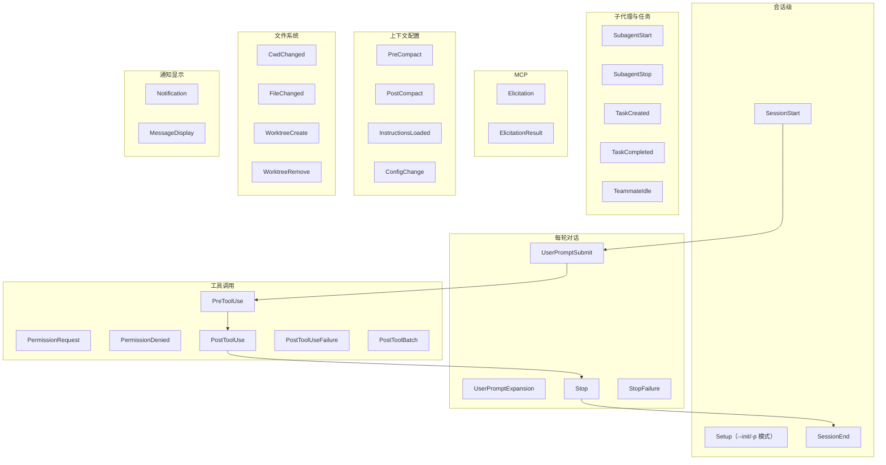

# Hooks 事件全景与拦截机制

> 最后整理: 2026-06-02 | 来源: 黄佳《Claude Code 工程化实战》课程 + [Claude Code Hooks 官方文档](https://code.claude.com/docs/en/hooks)

> 关联: [Harness Engineering：AI Agent 时代的工程范式](<./Harness Engineering：AI Agent 时代的工程范式.md>) — 约束工程的三层模型，hook 是"约束层"主要载体
> 关联: [子智能体（subagents）机制与实战](./子智能体（subagents）机制与实战.md) — SubagentStart/Stop 事件、subagent frontmatter 内的 hooks
> 关联: [Skills 渐进式披露架构](<./Skills 渐进式披露架构.md>) — skill frontmatter 内的 hooks 字段

---

## §1 一句话定位

Hooks 是 Claude Code 在自己生命周期的特定时刻**回调外部 shell 命令**的机制。这些 shell 可以：

- **观测**（记日志、推通知）
- **修改**（往主 context 注入额外信息、改 tool input）
- **阻断**（让 Claude 不能跑这个工具、不能停下、不能 compact）

是把"对 AI 的纪律"从软约束（写在 prompt 里希望 Claude 遵守）变成**硬约束**（不允许就是不允许）的核心机制。

---

## §2 30 个事件全景图

按生命周期分 8 大类，**这是当前 Claude Code 支持的完整事件清单**（之前以为只有 8 个，实际 30 个）：



### 完整事件表（按类别）

#### 会话级

| 事件 | 触发时机 | 阻断/修改 |
|------|---------|---------|
| `SessionStart` | 会话开始或恢复 | ❌ 不可阻断；可注入 `additionalContext`/`initialUserMessage`/`sessionTitle`/`watchPaths`/`reloadSkills` |
| `Setup` | `--init-only` 或 `-p` 模式下用 `--init`/`--maintenance`（CI 场景） | ❌ 不可阻断；可注入 `additionalContext` |
| `SessionEnd` | 会话终止 | ❌ 不可阻断（纯副作用） |

#### 每轮对话

| 事件 | 触发时机 | 阻断/修改 |
|------|---------|---------|
| `UserPromptSubmit` | 用户提交 prompt 后、Claude 处理前 | ✅ 阻断 + 注入 context + 设 session title |
| `UserPromptExpansion` | 命令（如 `/skillname`）展开为 prompt 之前 | ✅ 可阻断展开 |
| `Stop` | Claude 回复完成 | ✅ 可阻断（让 Claude 继续而非停下） |
| `StopFailure` | turn 因 API 错误结束 | ❌ 输出和 exit code 均被忽略 |

#### 工具调用

| 事件 | 触发时机 | 阻断/修改 |
|------|---------|---------|
| `PreToolUse` | 工具调用执行前 | ✅ `permissionDecision: allow/deny/ask/defer` + 改 tool input |
| `PermissionRequest` | 权限对话框出现时 | ✅ 允许/拒绝 + 改 input |
| `PermissionDenied` | auto 模式分类器拒绝时 | ❌ 不可阻断；可返 `retry: true` 让模型重试 |
| `PostToolUse` | 工具调用成功后 | ❌ 不可阻断；可通过 stderr 反馈给 Claude |
| `PostToolUseFailure` | 工具调用失败后 | ❌ 同上 |
| `PostToolBatch` | **一批并行工具调用全部完成后**、下次模型调用前 | ✅ 可中断 agentic loop |

#### 子代理与任务

| 事件 | 触发时机 | 阻断/修改 |
|------|---------|---------|
| `SubagentStart` | 生成 subagent 时 | ❌ 不可阻断；可注入 context |
| `SubagentStop` | subagent 结束时 | ✅ 可阻断（让 subagent 继续） |
| `TaskCreated` | 通过 `TaskCreate` 工具创建任务时 | ✅ 可阻断（回滚创建） |
| `TaskCompleted` | 任务被标记为完成时 | ✅ 可阻断（阻止标记） |
| `TeammateIdle` | agent team 队友即将进入 idle | ✅ 可阻断（让队友继续） |

#### MCP

| 事件 | 触发时机 | 阻断/修改 |
|------|---------|---------|
| `Elicitation` | MCP server 请求用户输入时 | ✅ 阻断 + 返 `action` + `content` |
| `ElicitationResult` | 用户响应后、回 server 前 | ✅ 阻断（动作变 decline）/ 覆写 content |

#### 上下文配置

| 事件 | 触发时机 | 阻断/修改 |
|------|---------|---------|
| `PreCompact` | 上下文压缩前 | ✅ 可阻断压缩 |
| `PostCompact` | 压缩完成后 | ❌ 不可阻断 |
| `InstructionsLoaded` | `CLAUDE.md` 或 `.claude/rules/*.md` 被加载入 context | ❌ 仅观测 |
| `ConfigChange` | 会话中配置文件变更时 | ✅ 可阻断（`policy_settings` 除外） |

#### 文件系统

| 事件 | 触发时机 | 阻断/修改 |
|------|---------|---------|
| `CwdChanged` | 工作目录变更（cd） | ❌ 适合 direnv 等响应式工具 |
| `FileChanged` | 被监控文件磁盘变化 | ❌ 仅观测 |
| `WorktreeCreate` | 创建 worktree 时 | ✅ **任何非零 exit 都阻断**（替代默认 git 行为） |
| `WorktreeRemove` | 移除 worktree | ❌ 不可阻断 |

#### 通知显示

| 事件 | 触发时机 | 阻断/修改 |
|------|---------|---------|
| `Notification` | Claude Code 发送通知时 | ❌ 不可阻断 |
| `MessageDisplay` | 助手消息正在显示时 | ❌ 不可阻断；可通过 `displayContent` **替换屏幕显示文本**（display-only，transcript 和 Claude 看到的仍是原文） |

---

## §3 阻断机制的三档

### 档 1: Exit code 2（最常用）

适用绝大多数事件：脚本退出码 = 2 → 阻断 + stderr 内容反馈给 Claude。

适用列表：`PreToolUse`、`PermissionRequest`、`UserPromptSubmit`、`UserPromptExpansion`、`Stop`、`SubagentStop`、`TeammateIdle`、`TaskCreated`、`TaskCompleted`、`ConfigChange`、`PostToolBatch`、`PreCompact`、`Elicitation`、`ElicitationResult`。

> ⚠️ **大多数事件 exit 1 不算阻断**——只是普通错误。要阻断必须 exit 2。**例外**：`WorktreeCreate` 任何非零 exit 都阻断。

### 档 2: JSON `decision: "block"`

向 stdout 输出 JSON，顶层 `decision: "block"`：

```json
{
  "decision": "block",
  "reason": "tests are failing; fix them before submitting"
}
```

适用：`UserPromptSubmit`、`UserPromptExpansion`、`PostToolUse`、`PostToolUseFailure`、`PostToolBatch`、`Stop`、`SubagentStop`、`ConfigChange`、`PreCompact`。

### 档 3: `hookSpecificOutput` 富控制

最强大档。能改 tool input、改 permission decision、替换显示文本：

```json
{
  "hookSpecificOutput": {
    "permissionDecision": "deny",
    "permissionReason": "git push to main is blocked by policy"
  }
}
```

适用：`PreToolUse`（permission decision + input 修改）、`PermissionRequest`、`PermissionDenied`（retry）、`Elicitation`、`ElicitationResult`、`MessageDisplay`、`WorktreeCreate`。

---

## §4 配置位置与合并

四个层级，**合并而非覆盖**（同事件的多个 hook 都会跑）：

| 位置 | 范围 | commit 进 git |
|------|------|--------------|
| `.claude/settings.json` | 项目级（团队共享） | ✅ |
| `.claude/settings.local.json` | 项目本地（不共享） | ❌（.gitignore） |
| `~/.claude/settings.json` | 用户全局 | — |
| Plugin 的 `hooks/hooks.json` | plugin 启用的地方 | 跟 plugin 走 |
| Managed settings 目录 | 组织级 | 由 IT 部署 |

### 基础格式

```json
{
  "hooks": {
    "PreToolUse": [
      {
        "matcher": "Write|Edit",
        "hooks": [
          {
            "type": "command",
            "command": "./scripts/format-on-save.sh"
          }
        ]
      }
    ],
    "Stop": [
      {
        "hooks": [
          {
            "type": "command",
            "command": "./scripts/check-status.sh"
          }
        ]
      }
    ]
  }
}
```

字段说明：

| 字段 | 说明 |
|------|------|
| `matcher` | （可选）匹配 tool name 或 agent type 等。支持 `\|` 分隔多个 |
| `hooks[].type` | 通常是 `command` |
| `hooks[].command` | 要执行的 shell |
| `hooks[].shell` | 可选 `powershell`（Windows） |

---

## §5 完整 Demo：Stop hook 自动 push

本项目 `.claude/settings.local.json` 的 Stop hook 就是个好例子——会话结束时跑各种检查 + 累积 5 个未 push 的 commit 时自动 push。

下面写一个**新场景**：禁止在 main 分支用 `git commit --no-verify`。

`./scripts/block-no-verify-on-main.sh`：

```bash
#!/bin/bash
# PreToolUse hook：当尝试在 main 上 git commit --no-verify 时阻断
INPUT=$(cat)
CMD=$(echo "$INPUT" | jq -r '.tool_input.command // empty')

# 不是 Bash 工具直接放行
[ -z "$CMD" ] && exit 0

# 不是 git commit 放行
echo "$CMD" | grep -qE '^git commit' || exit 0

# 不带 --no-verify 放行
echo "$CMD" | grep -qE '\-\-no-verify' || exit 0

# 检查当前分支
BRANCH=$(git rev-parse --abbrev-ref HEAD 2>/dev/null)
if [ "$BRANCH" = "main" ] || [ "$BRANCH" = "master" ]; then
  echo "Blocked: --no-verify is not allowed on $BRANCH branch" >&2
  exit 2
fi

exit 0
```

`.claude/settings.json`：

```json
{
  "hooks": {
    "PreToolUse": [
      {
        "matcher": "Bash",
        "hooks": [
          { "type": "command", "command": "./scripts/block-no-verify-on-main.sh" }
        ]
      }
    ]
  }
}
```

`chmod +x ./scripts/block-no-verify-on-main.sh`，重启 session 生效。之后 Claude 在 main 上想跑 `git commit --no-verify` 会被拦下，stderr 内容反馈给 Claude，它会调整策略。

---

## §6 Hook 输入格式（stdin JSON）

每个 hook 启动时，Claude Code 把上下文以 JSON 写到 stdin。脚本用 `jq` 解析。

### PreToolUse 输入

```json
{
  "session_id": "...",
  "transcript_path": "...",
  "cwd": "...",
  "hook_event_name": "PreToolUse",
  "tool_name": "Bash",
  "tool_input": {
    "command": "git push --force origin main",
    "description": "Force push"
  }
}
```

### UserPromptSubmit 输入

```json
{
  "hook_event_name": "UserPromptSubmit",
  "prompt": "用户输入的原文",
  "session_id": "..."
}
```

### SubagentStart 输入

```json
{
  "hook_event_name": "SubagentStart",
  "agent_type": "code-reviewer",
  "task": "..."
}
```

### Hook 环境变量

| 变量 | 内容 |
|------|------|
| `CLAUDE_PROJECT_DIR` | 项目根目录绝对路径 |
| `CLAUDE_SESSION_ID` | 当前 session ID |
| `$TOOL_INPUT` | （部分事件）tool input 文本 |

`CLAUDE_PROJECT_DIR` 特别有用——hook 在哪个 cwd 启动不确定，但这个变量稳定指向项目根。

---

## §7 Hook 在 subagent 和 skill 里的特殊形态

### Subagent frontmatter 内的 hook

只在该 subagent 激活时生效，subagent 结束自动清理：

```yaml
---
name: code-reviewer
hooks:
  PreToolUse:
    - matcher: "Bash"
      hooks:
        - type: command
          command: "./scripts/validate-command.sh $TOOL_INPUT"
  PostToolUse:
    - matcher: "Edit|Write"
      hooks:
        - type: command
          command: "./scripts/run-linter.sh"
---
```

frontmatter 里的 `Stop` 事件会自动转换为 `SubagentStop`（语义对齐）。

### Skill frontmatter 内的 hook

格式同上，仅在该 skill 激活期间生效。详见 [Skills 渐进式披露架构 §15](<./Skills 渐进式披露架构.md>)。

### Plugin 的 hook

放在 `<plugin>/hooks/hooks.json`，格式与 `.claude/settings.json` 的 `hooks` 字段一致。Plugin 加载时自动注册。

---

## §8 PostToolBatch：一个被低估的事件

`PostToolBatch` 在**一批并行工具调用全部完成后**触发，下一次模型调用之前。它能：

- 中断 agentic loop（exit 2 或 `decision: block`）
- 让你统一检查"刚跑完一批"的状态

典型用途：
- 检查跑了一批文件修改后，project 是否还能 build
- 跑完一批 Bash 后，检查磁盘空间
- 监控 token 消耗，发现暴涨就喊停

```json
{
  "hooks": {
    "PostToolBatch": [
      {
        "hooks": [
          { "type": "command", "command": "./scripts/check-budget.sh" }
        ]
      }
    ]
  }
}
```

`check-budget.sh` 里查 OpenTelemetry/log，如果 token 超阈值，exit 2 + stderr "budget exceeded"。

---

## §9 MessageDisplay：display-only 改写

这个事件是个奇特设计——可以**改用户屏幕上看到的内容**，但 transcript 和 Claude 看到的还是原文。

典型场景：
- 把 Claude 输出里的 emoji 自动转 ASCII（你团队风格）
- 把内部代号自动翻译成中文（如 "Project Phoenix" → "凤凰项目"）
- 高亮某些关键词

```json
{
  "hookSpecificOutput": {
    "displayContent": "改后的展示内容"
  }
}
```

**警告**：这是"善意欺骗用户"机制，谨慎用——transcript 和 Claude 看到的是原文，display 和实际可能不一致。

---

## §10 阻断机制总结表

| 想做的事 | 用哪个事件 + 机制 |
|---------|----------------|
| 禁某种 Bash 命令 | `PreToolUse` matcher `Bash` + exit 2 |
| 禁 Edit 写某些路径 | `PreToolUse` matcher `Edit` + 检查 `tool_input.file_path` + exit 2 |
| 阻止 Claude 用未跑的测试声明 done | `Stop` hook 跑 test，失败时 exit 2 + 输出"测试未跑" |
| commit 前格式化 | `PreToolUse` matcher `Bash(git commit *)` + 跑 prettier，失败 exit 2 |
| 文件变更后跑 lint | `PostToolUse` matcher `Edit\|Write` + 跑 linter（不阻断，只反馈） |
| Session 启动注入项目状态 | `SessionStart` + stdout 输出 `additionalContext` JSON |
| Compact 前先存 snapshot | `PreCompact` + 调脚本备份 transcript |
| Subagent 启动时建 DB 连接 | `SubagentStart` matcher `db-agent` + 启动脚本 |
| 每次提交 prompt 后记日志 | `UserPromptSubmit` + append 到 log（不阻断） |
| 监控 Claude 是否在浪费 token | `PostToolBatch` + 查 metrics |

---

## §11 性能注意

每个 hook 都是 fork shell 进程的开销。
- `PreToolUse` 这种**每次工具调用都跑**的，必须轻量（典型 <100ms）
- 重活（跑 test、build）放 `Stop`、`PostToolBatch` 这种低频事件
- 避免在 `PreToolUse` 里调网络
- shell 脚本里用 `set -uo pipefail` 防止异常被吞

---

## §12 调试技巧

### 12.1 Hook 没跑？

1. 检查脚本可执行（`chmod +x`）
2. 重启 session（settings.json 修改不一定 hot reload）
3. Claude Code 加 `--debug` 跑，看 hook 调用日志
4. 在 hook 脚本里加 `echo "hook fired" >> /tmp/hook.log`

### 12.2 Hook 阻断但 Claude 没意识到？

- 检查是不是 exit 1 而非 exit 2
- stderr 的内容会反馈给 Claude，必须输出有用错误信息（"Blocked: ..."）

### 12.3 看 hook 接收到什么

在脚本开头：

```bash
INPUT=$(cat)
echo "$INPUT" >> /tmp/hook-input.log
# 后续逻辑用 $INPUT 替代 stdin
```

---

## §13 本项目的实际 hook 配置

本项目的 hook 配置见 `.claude/settings.local.json`，三大块：

| 事件 | 脚本 | 作用 |
|------|------|------|
| `SessionStart` | `scripts/preflight.sh` → `scripts/arch-lint.sh` | 10 项机械检查（frontmatter、死链、文件大小写、行数等） |
| `Stop` | `exit-check.sh` → `lint.sh` + `check-overview.js` + `session-log.sh` + `permission-audit.sh` + 未 push 检查 | markdown 格式、INDEX 一致性、≥5 commits 未 push 自动 push |

这就是 [Harness Engineering](<./Harness Engineering：AI Agent 时代的工程范式.md>) 三层模型中的"约束层"——把"用户希望 AI 怎么做"硬编码成 shell 检查，而不是写在 prompt 里希望 Claude 自觉。

> 设计原则：UserPromptSubmit hook 已被本项目移除（机械提醒被淘汰），改由 Claude 自己主动 auto-commit。说明 hook 不是越多越好——能在 AI 端解决的就不要放 hook。
