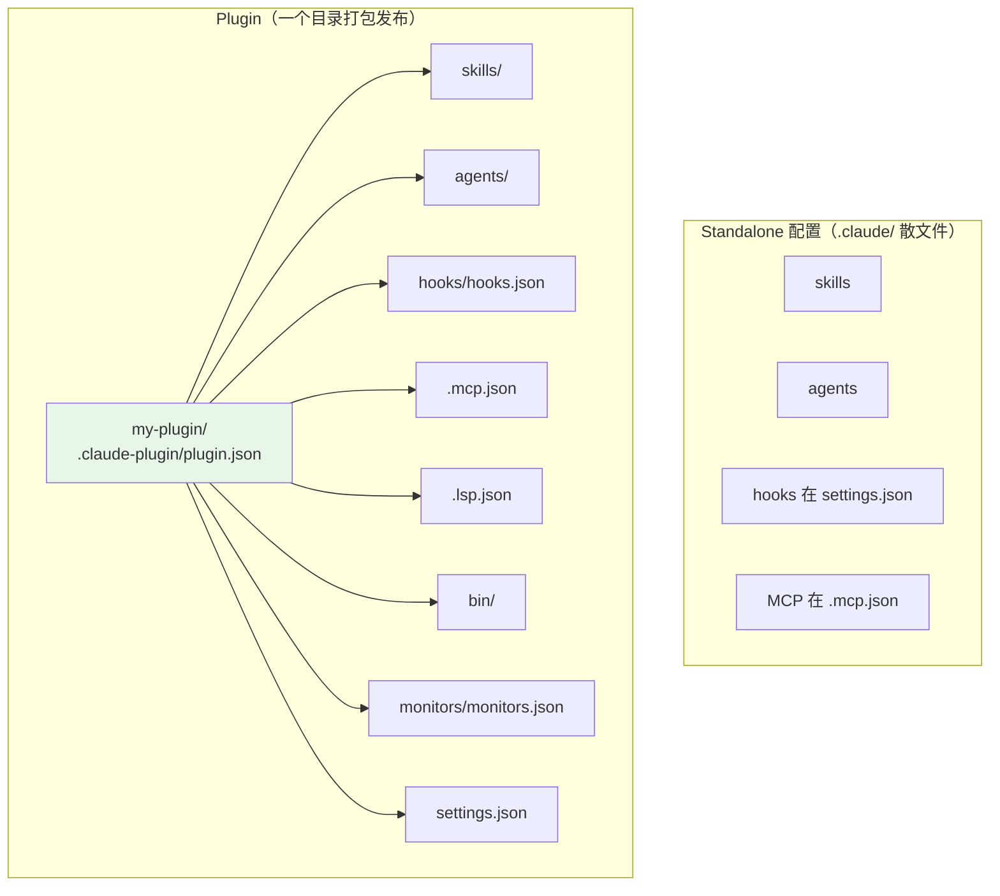

# Plugins 插件体系

> 最后整理: 2026-06-02 | 来源: 黄佳《Claude Code 工程化实战》课程 + [Plugins 文档](https://code.claude.com/docs/en/plugins) + [Plugins Reference](https://code.claude.com/docs/en/plugins-reference)

> 关联: [子智能体（subagents）机制与实战](./子智能体（subagents）机制与实战.md) — plugin 内 agents/ 目录的特殊限制
> 关联: [Skills 渐进式披露架构](<./Skills 渐进式披露架构.md>) — plugin skill 的命名空间
> 关联: [Hooks 事件全景与拦截机制](<./Hooks 事件全景与拦截机制.md>) — plugin hooks 配置
> 关联: [MCP 集成实战（含 Spring AI）](<./MCP 集成实战（含 Spring AI）.md>) — plugin MCP server

---

## §1 一句话定位

**Plugin = 把 skills + agents + hooks + MCP servers + LSP + monitors + bin/ 二进制 打包成可发布、可版本管理、可装卸的单元**。

是 Claude Code 生态分发的标准方式。相当于：
- VSCode 的 extension
- Vim 的 plugin
- npm 的 package



---

## §2 选 plugin 还是 standalone

| 维度 | Standalone（`.claude/`） | Plugin |
|------|----------------------|--------|
| Skill 命名 | `/hello`（短） | `/my-plugin:hello`（带命名空间） |
| 适合 | 个人/单项目 | 团队共享、社区分发 |
| 安装 | 手动复制文件 | `/plugin install` 一键 |
| 版本管理 | git history | manifest `version` 字段 |
| 更新 | 用户手动 pull | 用户 `/plugin update` 或自动 |
| 命名冲突 | 同名只能存一个 | namespace 隔离永远不冲突 |
| 适用场景 | 实验、调试、个人偏好 | 正式产品、跨项目复用 |

**官方建议**：先用 standalone 在 `.claude/` 快速迭代，**确定方案后转 plugin** 用于分发。

### 决策

- 我自己用、改完即生效 → standalone
- 团队多人用，要保证大家版本一致 → plugin（即使不发布，私有 git repo 即可）
- 想被社区使用 → plugin + marketplace

---

## §3 Plugin 目录结构

```text
my-plugin/
├── .claude-plugin/
│   └── plugin.json          # 唯一 manifest 文件
├── skills/                   # 注意：在 plugin 根，不在 .claude-plugin/ 里！
│   ├── hello/SKILL.md
│   └── deploy/SKILL.md
├── commands/                 # 老式 markdown commands（新版优先用 skills/）
├── agents/                   # subagent 定义
│   └── reviewer.md
├── hooks/
│   └── hooks.json            # 同 settings.json 的 hooks 字段
├── .mcp.json                 # MCP server 配置
├── .lsp.json                 # LSP server 配置
├── monitors/monitors.json    # 后台监控（自动启动）
├── bin/                      # 启用时 PATH 注入的可执行
├── settings.json             # 启用时应用的默认 settings（如指定 agent）
└── README.md                 # 文档
```

### ⚠️ 最常见错误

> Don't put `commands/`, `agents/`, `skills/`, or `hooks/` inside the `.claude-plugin/` directory.

`.claude-plugin/` **只**放 `plugin.json`。其他子目录全在 plugin 根。

---

## §4 Manifest Schema

`.claude-plugin/plugin.json`：

```json
{
  "name": "my-first-plugin",
  "description": "A greeting plugin to learn the basics",
  "version": "1.0.0",
  "author": {
    "name": "Your Name"
  },
  "homepage": "https://github.com/you/plugin",
  "repository": "https://github.com/you/plugin",
  "license": "MIT"
}
```

| 字段 | 必需 | 说明 |
|------|------|------|
| `name` | ✅ | 唯一 ID，也是 skill 命名空间（`/my-first-plugin:hello`） |
| `description` | ✅ | plugin manager 浏览/安装时显示 |
| `version` | ❌ 但**强烈建议** | 不写时**每个 git commit 算新版本**，用户被频繁打扰更新 |
| `author` | ❌ | 归属信息 |
| `homepage` / `repository` / `license` | ❌ | 元信息 |

### Version 字段的陷阱

不写 `version`：
- plugin 通过 git 分发时，每个 commit 都被当作新版本
- 用户看到 `/plugin` 里频繁的"有更新"提示
- 你随手 push 个 README 修改 = 全用户被打扰

正式发布**必须显式写 `version`**：

```json
{ "version": "1.0.0" }
```

bump 版本（语义化）才是用户看到更新的信号。

---

## §5 Quickstart：30 秒写一个 plugin

```bash
mkdir -p my-first-plugin/.claude-plugin
mkdir -p my-first-plugin/skills/hello
```

`my-first-plugin/.claude-plugin/plugin.json`：

```json
{
  "name": "my-first-plugin",
  "description": "A greeting plugin to learn the basics",
  "version": "1.0.0"
}
```

`my-first-plugin/skills/hello/SKILL.md`：

```markdown
---
description: Greet the user with a personalized message
---

# Hello Skill

Greet the user named "$ARGUMENTS" warmly and ask how you can help them today. Make the greeting personal and encouraging.
```

测试：

```bash
claude --plugin-dir ./my-first-plugin
# 在 Claude 里
/my-first-plugin:hello Alex
```

修改后 `/reload-plugins` 热加载，不用重启 session。

---

## §6 Plugin 能打包的资源全清单

每类资源有专门目录，加载行为不同：

| 资源 | 目录 | 行为 |
|------|------|------|
| **Skills** | `skills/<name>/SKILL.md` | 自动注册成 `/plugin:skill` |
| **Commands**（老式） | `commands/<name>.md` | 同上，但 skills 是新方向 |
| **Subagents** | `agents/<name>.md` | 启用时可被主 agent 派发 |
| **Hooks** | `hooks/hooks.json` | 启用时全局注册（同 settings.json 格式） |
| **MCP servers** | `.mcp.json` 或 `plugin.json` 内联 | 启用时自动连接 |
| **LSP servers** | `.lsp.json` | 启用时给 Claude 提供语言智能 |
| **Background monitors** | `monitors/monitors.json` | 启用时自动开 tail/watch 任务 |
| **Bin executables** | `bin/` | 启用时加进 PATH（Bash 工具能直接调） |
| **Default settings** | `settings.json` | 启用时应用 |

### Plugin Subagent 的安全限制

❌ 不支持 `hooks`、`mcpServers`、`permissionMode` 字段（静默忽略）。

原因：plugin 可能来自第三方，给它们这些权限风险太大。详见 [子智能体 §10](./子智能体（subagents）机制与实战.md)。

### Plugin MCP 的环境变量

| 变量 | 含义 |
|------|------|
| `${CLAUDE_PLUGIN_ROOT}` | plugin 自带文件根目录 |
| `${CLAUDE_PLUGIN_DATA}` | plugin 持久状态目录（更新后保留） |
| `${CLAUDE_PROJECT_DIR}` | 项目根 |

详见 [MCP 集成实战 §10](<./MCP 集成实战（含 Spring AI）.md>)。

### Monitors（被低估的功能）

```json
// monitors/monitors.json
[
  {
    "name": "error-log",
    "command": "tail -F ./logs/error.log",
    "description": "Application error log"
  }
]
```

每行 stdout 自动作为 notification 推给 Claude。**plugin 启用时自动启动**，不需要 prompt Claude。

典型用途：
- 监控 build log，构建失败时告诉 Claude
- 监控数据库查询慢日志
- 监控某个 API endpoint 的健康状态

### Default Settings (`settings.json`)

只支持 `agent` 和 `subagentStatusLine` 字段。

```json
{
  "agent": "security-reviewer"
}
```

启用 plugin 后，主 thread 自动切到 `security-reviewer` agent。**这意味着 plugin 能彻底改变 Claude Code 的默认行为**——它是 plugin 最强的接管钩子。

---

## §7 安装与管理

### 7.1 三种安装方式

```bash
# 开发期：本地路径（不进 marketplace）
claude --plugin-dir ./my-plugin

# 从 ZIP（CI 产物分发）
claude --plugin-dir ./my-plugin.zip
claude --plugin-url https://example.com/my-plugin.zip

# 从 marketplace 一键装
/plugin install <plugin-name>@<marketplace>
```

`--plugin-dir` 可重复，加载多 plugin：

```bash
claude --plugin-dir ./plugin-one --plugin-dir ./plugin-two
```

### 7.2 Marketplace

Anthropic 官方维护**两个公共 marketplace**：

| Marketplace | 内容 | 接入方式 |
|------------|------|---------|
| `claude-plugins-official` | Anthropic 精选 | 自动可用，无需添加 |
| `claude-community` | 社区提交（审核后） | `/plugin marketplace add anthropics/claude-plugins-community` |

私有 marketplace 也支持（把 marketplace.json 放在私有 git repo）。

### 7.3 安装路径

装好的 plugin 默认在 `~/.claude/plugins/<plugin-name>/`。可以 `cd` 进去看源码（学习别人怎么写）。

### 7.4 提交到社区 marketplace

通过 in-app form：
- claude.ai：[claude.ai/settings/plugins/submit](https://claude.ai/settings/plugins/submit)
- console：[platform.claude.com/plugins/submit](https://platform.claude.com/plugins/submit)

提交前**本地必须跑过** `claude plugin validate`（CI 也会跑）。

审核通过后被 pin 到具体 commit SHA。后续 git push 会自动更新这个 pin（CI bot 做的）。

---

## §8 Skills-directory Plugin（特殊形态）

可以在普通 skill 目录里加 `.claude-plugin/plugin.json` 让它**变成 plugin**：

```bash
claude plugin init my-tool
# 创建 ~/.claude/skills/my-tool/{.claude-plugin/plugin.json, SKILL.md}
```

效果：
- 这个 skill 同时是 plugin，能挂带 agents/hooks/MCP/monitors
- 加载为 `my-tool@skills-dir`
- 不需要 marketplace 或 install 步骤
- 在 `.claude/skills/` 下（项目级）需先 accept workspace trust dialog

适合：想给某个 skill 加更多 power（如自带 hook 自动跑），但不想正式发布成 plugin。

---

## §9 转 standalone → plugin（迁移指南）

已有 `.claude/skills/`、`.claude/agents/` 想打成 plugin 分发：

```bash
# 1. 创建结构
mkdir -p my-plugin/.claude-plugin

# 2. manifest
cat > my-plugin/.claude-plugin/plugin.json <<'EOF'
{
  "name": "my-plugin",
  "description": "Migrated from standalone",
  "version": "1.0.0"
}
EOF

# 3. 复制资源
cp -r .claude/commands my-plugin/   # 如有
cp -r .claude/agents   my-plugin/
cp -r .claude/skills   my-plugin/

# 4. hooks：从 settings.json 抽出 hooks 字段
mkdir my-plugin/hooks
# 把 settings.json 的 hooks 对象写到 my-plugin/hooks/hooks.json

# 5. 测试
claude --plugin-dir ./my-plugin
```

迁移**前后行为差异**：

| | Standalone | Plugin |
|---|-----------|--------|
| Skill 调用 | `/hello` | `/my-plugin:hello` |
| Hook 格式 | `settings.json` 的 hooks 字段 | `hooks/hooks.json`（结构相同） |
| 分发 | 手动复制 | `/plugin install` |

迁移完可以删除原 `.claude/` 下的对应文件（plugin 版本会优先生效）。

---

## §10 Debug Plugin

### 10.1 检查目录结构

最常见的错误是把 `skills/` 放进了 `.claude-plugin/`。**只有 `plugin.json` 在 `.claude-plugin/` 里**，其他全在 plugin 根。

### 10.2 验证

```bash
claude plugin validate
```

出错信息会指出问题。

### 10.3 看加载情况

```bash
claude --plugin-dir ./my-plugin --output-format stream-json --verbose -p "ping" | head -1
# 第一行是 system/init 事件，含 plugins 和 plugin_errors 字段
```

CI 里**强烈建议** fail fast：

```bash
if echo "$INIT" | jq -e '.plugin_errors' >/dev/null; then exit 1; fi
```

### 10.4 修改后没生效

`/reload-plugins` 热加载 skills/agents/hooks/MCP/LSP。

skill 文件文本变更可以**实时识别**（live change detection）；hooks/agents/MCP 需要 `/reload-plugins`。

---

## §11 Plugin Hints（CLI 推荐安装）

如果 Anthropic 把你的 plugin 列入官方 marketplace，**你的 CLI 工具可以从命令行提示用户安装它**。

实战例子：你做了个工具叫 `foo`，运行时检测到用户用 Claude Code 但没装 `foo` 配套的 plugin → 输出 `/plugin install foo-helper@claude-plugins-official` 提示。

这是 plugin 生态的一个推广钩子——你的 CLI 和你的 plugin 双向引流。

---

## §12 实战清单：什么时候开始考虑做 plugin

| 信号 | 行动 |
|------|------|
| 你的 `.claude/skills/` 已经有 10+ skill 且稳定 | 考虑打成 plugin 给自己跨项目用 |
| 团队多人用同一套 skill+agent | 必须 plugin（避免每人手动同步） |
| 想给同事用某个工作流 | plugin + 私有 git repo + `--plugin-dir` |
| 想给社区贡献 | plugin + 提交 marketplace |
| 你的 skill 需要带 hook 自动跑 | skills-directory plugin |
| 你的工具需要 MCP server 配套 | plugin 内置 MCP |

### 反例：什么时候**不该**做 plugin

- 只你一个人用、只在一个项目 → standalone 就好
- 还在快速迭代、每天改十次 → 等稳定再 plugin
- 只是想要个 `/foo` 命令 → 直接 `.claude/skills/foo/SKILL.md`

**plugin 的成本**：要写 manifest、要维护版本、命名空间会让你打多 8 个字符（`/my-plugin:foo`）。这些都值得，但**仅当你要分发**。

---

## §13 本项目目前没用 plugin

本项目（ans-ai-auto-notes）当前所有 skill/hook 都是 `.claude/` 散文件。原因：

- 单人项目，没分发需求
- 项目高度耦合（kb-tdd-discipline、kb-content-style 等都假设了 kb/ 这个特定结构）
- 不想为了"未来可能要打包"承担命名空间的认知成本

但有一个**例外**：[superpowers](.claude/plugins/) 这个 plugin 是用 plugin 形态引入的（外部社区作品）。

如果未来想把"知识库自动构建"这套工具链分享出去，可能的形态是 plugin：
- skill：`/build-index`、`/check-overview`、`/rename-mapping`
- hook：SessionStart、Stop（preflight + arch-lint）
- monitor：watch kb/ 文件变化触发 build-index
- bin：把 build-index.js 当可执行打进 plugin
