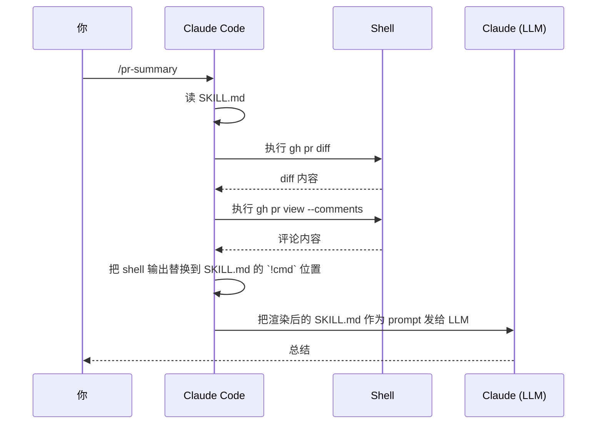

# Skills 渐进式披露架构

> 最后整理: 2026-06-02 | 来源: 黄佳《Claude Code 工程化实战》课程 + [Claude Code Skills 官方文档](https://code.claude.com/docs/en/skills)

> 关联: [子智能体（subagents）机制与实战](./子智能体（subagents）机制与实战.md) — skill 和 subagent 的边界
> 关联: [Hooks 事件全景与拦截机制](<./Hooks 事件全景与拦截机制.md>) — skill frontmatter 内的 hooks 字段
> 关联: [Superpowers TDD Skill 工作流拆解](<./Superpowers TDD Skill 工作流拆解.md>) — 一个具体 skill 的实战拆解
> 关联: [从 Sub-Agent 到 Multi-Agent 的工程指南](<./从 Sub-Agent 到 Multi-Agent 的工程指南.md>) — Skills 作为最轻量多智能体模式的定位

---

## §1 一句话定位

**Skill = 给 Claude 的"按需加载的小书"**。frontmatter 永久驻留主 context 让 Claude 知道"我有这本书"，body 只在调用时才翻开，supporting files 在 body 指引下才取出。

这套机制叫**渐进式披露（progressive disclosure）**，是 Claude Code 把"100+ 个 skill 同时挂在 session 上"这件事变可行的关键。

---

## §2 三层架构详解

```mermaid
graph TB
    subgraph L1["Layer 1: 启动即加载（永久驻留主 context）"]
        FM["frontmatter<br/>name + description + when_to_use"]
        FM_Cost["≈ 100-200 tokens / skill"]
    end

    subgraph L2["Layer 2: 调用时加载（进入主 context，留到 session 结束）"]
        Body["SKILL.md body<br/>详细指令"]
        Body_Cost["每次调用一次性加载<br/>典型 500-3000 tokens"]
    end

    subgraph L3["Layer 3: body 指引下加载（按需读取）"]
        Refs["references/*.md<br/>详细参考文档"]
        Scripts["scripts/*<br/>可执行脚本（Bash 调用）"]
        Assets["assets/*<br/>模板/示例文件"]
        L3_Cost["完全按需 Read/Bash"]
    end

    Trigger["Claude 决定要用 skill X"] --> Body
    Body -.body 里写'参考 reference.md'.-> Refs
    Body -.body 里写'跑 helper.py'.-> Scripts

    style L1 fill:#e8f5e9
    style L2 fill:#fff3e0
    style L3 fill:#f3e5f5
```

### 每层的具体加载时机

| 层 | 何时加载 | 内容 | 留存时长 |
|----|---------|------|---------|
| **L1 frontmatter** | session 启动 / live change | name + description + when_to_use（截断到 1536 字符） | 整个 session |
| **L2 body** | Claude 调用 `Skill` 工具时 | `---` 之间字段以外的全部 markdown body | 主对话剩余时长（被 compact 时按 25K token 预算保留） |
| **L3 supporting files** | body 中明确引用时 | `references/*.md`、`scripts/*`、`assets/*` | 只在 Read/Bash 调用时，看完即丢 |

### Token 经济学

文档原文给出的精确数字：
- skill listing budget 默认 = **context window 的 1%**（200K window → 2K 字符）
- 单个 skill 的 description + when_to_use **上限 1536 字符**
- compact 时所有重新挂回的 skill 共享 **25,000 token 预算**，每个保留前 5,000 token

**实战含义**：你挂 30 个 skill，启动多花的 context ≈ 5-10K tokens。但完整 body 总和可能 100KB+。**100 倍杠杆**。

---

## §3 Skill 文件物理结构

skill 是个目录，`SKILL.md` 是入口：

```text
my-skill/
├── SKILL.md           # 主入口（必需）
├── reference.md       # 详细 API 文档（按需 load）
├── examples.md        # 用法示例（按需 load）
├── template.md        # 模板供 Claude 填空
└── scripts/
    ├── helper.py      # 可执行脚本（Bash 调用，不 load 进 context）
    └── validate.sh
```

**Tip**：官方建议 `SKILL.md` ≤ 500 行。详细内容拆到 supporting files。

### Skill 的四种存储位置

| 位置 | 路径 | 适用 |
|------|------|------|
| Enterprise | 由 managed settings 控制 | 组织所有人 |
| Personal | `~/.claude/skills/<name>/SKILL.md` | 你的所有项目 |
| Project | `.claude/skills/<name>/SKILL.md` | 仅当前项目（可 commit） |
| Plugin | `<plugin>/skills/<name>/SKILL.md` | plugin 启用的地方（命名空间 `plugin:skill`） |

同名时优先级：**enterprise > personal > project**。Plugin 用 `plugin-name:skill-name` 命名空间，永远不会冲突。

如果 `.claude/commands/foo.md` 和 `.claude/skills/foo/SKILL.md` 共存，**skill 胜出**。

### 命令名怎么来

| skill 位置 | 命令名来源 |
|-----------|-----------|
| `.claude/skills/deploy-staging/SKILL.md` | 目录名 → `/deploy-staging` |
| `.claude/commands/deploy.md` | 文件名 → `/deploy` |
| `my-plugin/skills/review/SKILL.md` | 目录名 + plugin 命名空间 → `/my-plugin:review` |
| `my-plugin/SKILL.md`（plugin 根） | frontmatter `name` 字段 → `/my-plugin:<name>` |

只有 plugin 根的 SKILL.md 情况下，`name` 字段才决定命令名。其他情况 `name` 只是显示标签。

---

## §4 Frontmatter 全字段

```yaml
---
name: my-skill
description: What this skill does. Use when X, Y, or Z.
disable-model-invocation: true
allowed-tools: Read Grep Bash(git diff *)
---
```

完整字段表：

| 字段 | 必填 | 说明 |
|------|------|------|
| `name` | ❌ | 显示标签。默认取目录名 |
| `description` | 推荐 | **核心字段**。Claude 看这个决定何时用 |
| `when_to_use` | ❌ | 补充触发场景（追加在 description 后，共享 1536 字符上限） |
| `argument-hint` | ❌ | autocomplete 时的提示，如 `[issue-number]` |
| `arguments` | ❌ | 命名位置参数（用于 `$name` 替换） |
| `disable-model-invocation` | ❌ | `true` = 只能你手动 `/name` 调，Claude 不能自动调 |
| `user-invocable` | ❌ | `false` = 不出现在 `/` 菜单，只 Claude 能调 |
| `allowed-tools` | ❌ | skill 激活时**免权限询问**的工具（不限制可用范围） |
| `disallowed-tools` | ❌ | skill 激活时**移除**这些工具（如 autonomous 循环里禁 AskUserQuestion） |
| `model` | ❌ | 该 skill 激活时切到指定模型（仅当回合） |
| `effort` | ❌ | low/medium/high/xhigh/max 推理预算 |
| `context` | ❌ | `fork` = 在分叉的 subagent 里跑这个 skill |
| `agent` | ❌ | `context: fork` 时指定用哪个 agent 类型 |
| `hooks` | ❌ | skill 生命周期内才生效的 hook |
| `paths` | ❌ | glob 模式，限定 skill 只在编辑匹配文件时自动激活 |
| `shell` | ❌ | `bash`（默认）或 `powershell` |

### 谁能调用：两个字段的组合

| 配置 | 你能调 | Claude 能调 | description 加载到 context 吗 |
|------|--------|------------|---------------------------|
| 默认 | ✅ | ✅ | ✅ 总在 |
| `disable-model-invocation: true` | ✅ | ❌ | ❌ 不进 context |
| `user-invocable: false` | ❌ | ✅ | ✅ 总在 |

**典型用法**：
- `disable-model-invocation: true` —— 有副作用的命令（`/deploy`、`/commit`、`/send-slack-message`）：你不希望 Claude "感觉代码 ready 了" 就自己部署
- `user-invocable: false` —— 背景知识（如 `legacy-system-context`）：用户不会想到去 `/legacy-system-context`，但 Claude 应该在相关时自动读

---

## §5 动态 context 注入：`!` 语法

skill 的杀手锏功能：在 Claude 看到 skill body 之前，**先跑一段 shell 命令，把输出塞进 body**。

```yaml
---
name: pr-summary
description: Summarize changes in a pull request
allowed-tools: Bash(gh *)
---

## Pull request context
- PR diff: !`gh pr diff`
- PR comments: !`gh pr view --comments`
- Changed files: !`gh pr diff --name-only`

## Your task
Summarize this pull request...
```

执行流程：



**关键事实**：
- Shell 在 Claude 看到 body **之前**执行（预处理，不是 Claude 主动调）
- Shell 输出**只渲染一次**，不会被再次扫描（命令输出里的 `` !`cmd` `` 不会触发二次执行）
- 行内形式只在 `!` 在行首或紧跟空白时才识别（`KEY=!`cmd`` 被当字面文本）
- 多行命令用 ```` ```! ```` 围栏：

````markdown
```!
node --version
npm --version
git status --short
```
````

**安全开关**：managed settings 里可设 `"disableSkillShellExecution": true`，所有 user/project/plugin skill 的 shell 注入都失效（bundled skill 不受影响）。

---

## §6 参数传递：$ARGUMENTS 及变种

调用 skill 时传参：

```text
/fix-issue 123
```

skill body 里写：

```yaml
---
name: fix-issue
description: Fix a GitHub issue
disable-model-invocation: true
---

Fix GitHub issue $ARGUMENTS following our coding standards.
```

Claude 实际看到："Fix GitHub issue 123 following our coding standards"

完整替换变量：

| 变量 | 含义 |
|------|------|
| `$ARGUMENTS` | 整串参数原文 |
| `$ARGUMENTS[N]` | 第 N 个位置参数（0 起），shell 风格分词，多词用引号包 |
| `$N` | `$ARGUMENTS[N]` 的简写（`$0` `$1`...） |
| `$name` | frontmatter `arguments: [issue, branch]` 里命名的 |
| `${CLAUDE_SESSION_ID}` | 当前 session ID（用于日志、缓存） |
| `${CLAUDE_EFFORT}` | 当前推理预算等级 |
| `${CLAUDE_SKILL_DIR}` | skill 所在目录（用于引用 bundled script） |

**注意**：skill body 里没写 `$ARGUMENTS` 也传了参，Claude Code 会自动在末尾追加 `ARGUMENTS: <value>`，所以 Claude 总能看到。

```yaml
---
name: migrate-component
arguments: component from to
---

Migrate the $component from $from to $to. Preserve all existing behavior and tests.
```

`/migrate-component SearchBar React Vue` 会把 `$component`→SearchBar，`$from`→React，`$to`→Vue。

---

## §7 Skill 内容生命周期：什么时候被丢

Skill body 进入主 context 后**不会被重新读**——Claude 不会每个 turn 都再 Read 一次 SKILL.md。这有两层含义：

**含义 1**：写指令时按"长期生效的规则"写，不要写"本次回答完就忽略我"。

**含义 2**：被 compact 时有特殊规则：
- compact 后**只重新挂回最近调用过的每个 skill**
- 每个保留前 5,000 token
- 总预算 25,000 token，从最近调用的开始填，老的可能被整块丢

如果你发现"调用了 skill 但 Claude 后续 turn 行为不像在用它"——大概率是被 compact 丢了。补救：再调用一次。

---

## §8 自定义 commands 与 skills 合并

**Claude Code 已经把 commands 并入 skills**：

- `.claude/commands/deploy.md` 和 `.claude/skills/deploy/SKILL.md` 都创建 `/deploy`
- 二者运行机制一致
- 旧 `.claude/commands/` 文件继续工作
- skill 比 command 多三个能力：
  - 支持 supporting files（多文件结构）
  - 支持完整 frontmatter（invocation control 等）
  - 支持 Claude 自动加载（command 通常要用户手动调）

**新写都建议用 skill 形式**。已有 commands 不强制迁移。

---

## §9 在 subagent 里跑 skill：context: fork

```yaml
---
name: deep-research
description: Research a topic thoroughly
context: fork
agent: Explore
---

Research $ARGUMENTS thoroughly:
1. Find relevant files using Glob and Grep
2. Read and analyze the code
3. Summarize findings with specific file references
```

执行时：
1. 创建一个新的隔离 context（fork subagent）
2. skill body 作为 prompt 给 subagent
3. `agent: Explore` 提供执行环境（model、tools、permissions）
4. 结果总结后返回主对话

**这是 skill 和 subagent 的"反向耦合"**：

| 模式 | 主从关系 |
|------|---------|
| Skill 用 `context: fork` | Skill 决定任务内容，借 agent 类型的工具/模型来执行 |
| Subagent 用 `skills` 字段 | Subagent 决定身份，预加载 skill 内容作为知识 |

两者底层用同一套机制。详见 [子智能体（subagents）机制与实战](./子智能体（subagents）机制与实战.md) — §9 高级用法（context: fork） + §15 skills 预加载 vs 嵌套 spawn 取舍（什么时候用 skills 字段替代再 spawn 一个 subagent）。

**警告**：`context: fork` 只对**有明确任务指令**的 skill 有意义。如果你的 skill 只是"用这些 API 约定"这种 reference 内容，fork 出来的 subagent 拿不到 actionable prompt，会空跑。

---

## §10 预审批工具：allowed-tools

```yaml
---
name: commit
disable-model-invocation: true
allowed-tools: Bash(git add *) Bash(git commit *) Bash(git status *)
---
```

skill 激活期间，这些工具调用**免权限弹窗**——直接执行。

**注意区分**：
- `allowed-tools` = 跳过审批，**不限制可用工具**（其他工具仍可用，只是会问你）
- `disallowed-tools` = 从可用池中**移除**

要禁某 skill 调某工具，去 `/permissions` 写 deny 规则。

**项目级 skill 的工具预审批**：放在 `.claude/skills/` 的 skill 的 `allowed-tools` 字段，**必须等你 accept 项目 trust 对话框后才生效**——和 `.claude/settings.json` 的 permission rules 同等机制。审视项目 skill 后再 trust，因为 skill 可以给自己很大权限。

---

## §11 实战 demo：summarize-changes

最小可用 skill，演示 frontmatter + 动态注入：

```bash
mkdir -p ~/.claude/skills/summarize-changes
```

`~/.claude/skills/summarize-changes/SKILL.md`：

```markdown
---
description: Summarizes uncommitted changes and flags anything risky. Use when the user asks what changed, wants a commit message, or asks to review their diff.
---

## Current changes

!`git diff HEAD`

## Instructions

Summarize the changes above in two or three bullet points, then list any
risks you notice such as missing error handling, hardcoded values, or
tests that need updating. If the diff is empty, say there are no
uncommitted changes.
```

测试两种方式：
- 自动：随便改个文件，然后问 "What did I change?"
- 手动：`/summarize-changes`

两种都应该返回 diff 摘要 + 风险列表。

---

## §12 调试 skill 的几个手段

### 12.1 skill 没触发？

1. 检查 description 是否包含用户会自然说出的关键词（不是技术术语）
2. `/doctor` 看 skill listing budget 是否溢出（你 skill 太多，老 skill 的 description 被截）
3. 提问改得更接近 description 的措辞
4. 如果是 user-invocable 的，直接 `/skill-name` 测试 body 是否正确

### 12.2 skill 触发太频繁？

1. description 写更具体的触发条件
2. 加 `disable-model-invocation: true` 改为手动

### 12.3 description 被截断？

skill listing 默认占 context window 1%。skill 多了会被截。
- 调高：`skillListingBudgetFraction: 0.02`（2%）或 `SLASH_COMMAND_TOOL_CHAR_BUDGET` 环境变量
- 把低频 skill 设为 `"name-only"`（在 `skillOverrides`）腾出预算
- 单 skill 的 description+when_to_use 硬上限 1536 字符（`maxSkillDescriptionChars` 可调）

### 12.4 skillOverrides：从 settings 控制 skill 可见性

```json
{
  "skillOverrides": {
    "legacy-context": "name-only",
    "deploy": "off"
  }
}
```

四种状态：

| 值 | 列给 Claude | 出现在 `/` 菜单 |
|----|------------|---------------|
| `"on"` | 名 + 描述 | ✅ |
| `"name-only"` | 只名 | ✅ |
| `"user-invocable-only"` | 隐藏 | ✅ |
| `"off"` | 隐藏 | ❌ |

用于：你不想改 skill 文件本身（如团队共享 repo 里的 skill），但想本地禁用。`/skills` 菜单按 Space 切换 + Enter 保存到 `.claude/settings.local.json`。

---

## §13 决策卡：什么时候写 skill

| 你在做的事 | 该用 |
|----------|------|
| 反复把同一段说明 paste 进 chat | skill |
| CLAUDE.md 里有一段在膨胀，从"事实"变成"过程" | 把过程拆成 skill |
| 想 Claude 在某些任务自动加载某段知识 | skill（写好 description） |
| 想自己手动触发的命令 | skill + `disable-model-invocation: true` |
| 任务输出冗长会污染主对话 | subagent，不是 skill |
| 任务需要完全独立的进程跑 | Agent SDK，不是 skill |

---

## §14 常见坑

| 坑 | 现象 | 解决 |
|---|------|------|
| description 没写"何时用" | "this skill helps with code" → Claude 永远不调 | 写"Use when user X, Y, or Z" |
| body 用一次性指令（如"现在做 X"） | 后续 turn 行为飘 | 写成长期规则形式 |
| skill 多了 description 被截 | 关键词消失，触发失败 | 调 `skillListingBudgetFraction` 或精简 description |
| `!cmd` 不在行首 | 没执行，留成字面 | `!` 前必须是空白或行首 |
| Commands/skills 同名 | 不确定谁生效 | skill 胜出 |
| `context: fork` 但 skill 没任务 | subagent 空跑 | fork 模式必须包含 actionable 指令 |
| Plugin skill `disable-model-invocation: true` 被预加载 | 提示报错 | 预加载和"可被 Claude 调用"是同一池子，禁了就不能预加载 |
| skill body 太长 | 每个 turn 都吃 token | 拆 supporting files，body 走 navigation 角色 |

---

## §15 与 hook、permission 的协同

skill 可以在 frontmatter 内写 hooks：

```yaml
---
name: my-skill
hooks:
  PreToolUse:
    - matcher: "Edit"
      hooks:
        - type: command
          command: "./scripts/precheck.sh"
---
```

效果：只在该 skill 激活期间，Edit 工具被这个 hook 拦截校验。详见 [Hooks 事件全景与拦截机制](<./Hooks 事件全景与拦截机制.md>)。

权限维度有三个手柄：
- 全局禁 skill：`/permissions` 加 `Skill` 到 deny
- 禁特定 skill：`Skill(commit)` 或前缀 `Skill(review-pr *)`
- 单 skill 隐藏：`disable-model-invocation: true`
