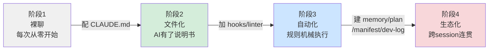
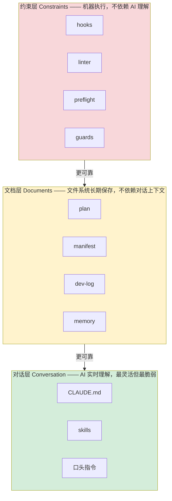
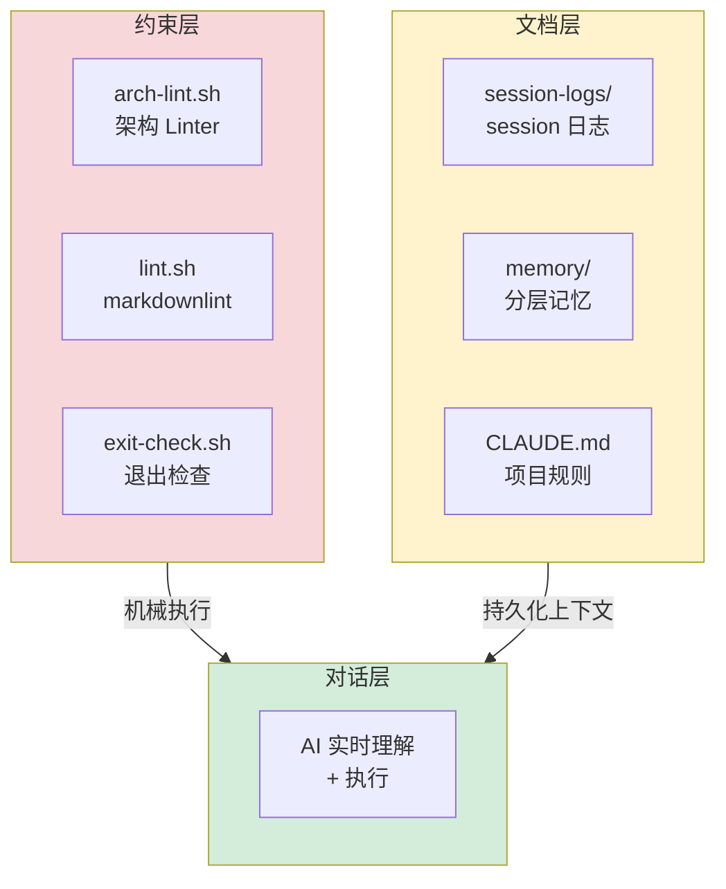

# Claude Code 进阶工作流：从能用到高效

> 最后整理: 2026-05-17 | 来源: 知乎问答《claude code使用感受如何？》作者"先用起来"（产品经理），255 赞同，2026-04-18

## 一句话定位

你的 CLAUDE.md 配好了，skills 也装了，但总觉得"不够顺"——换项目丢偏好、新 session 断片、AI 无视规则。**问题的根源不在配置的"好不好"，而在规则的"执行方式"。**

这篇文章讲的是：一个人如何用系统化思路，把 Claude Code 工作流从"能用"推到"高效"。

> 关联: [Claude Code 架构](./claude-code-architecture.md) — 技术架构与内部机制 | [Harness Engineering](./harness-engineering.md) — 个人/团队级 Harness 体系 | [别学歪了：Harness 不是新概念](./harness-engineering.md#harness-不是新概念自检你的现有体系) — 同作者系列第三篇：机械约束/分离评估/工件化
> 关联: [外部参考链接](../../../实战/技巧/external-references.md) — 本文原文链接

---

## 一、四阶段成熟度模型：你在哪一个？



| 阶段 | 名称 | 特征 | 你在这里，如果… |
|------|------|------|---------------|
| 1 | **裸聊** | 直接对话，每次从头开始 | 没有 CLAUDE.md，每次都要重新解释需求 |
| 2 | **文件化** | CLAUDE.md + skills，AI 有了"说明书" | 配好了基础环境，但总感觉"不够顺" |
| 3 | **自动化** | hooks + linter + guards，规则机械执行 | AI 偶尔还要手动纠正，session 间缺连续性 |
| 4 | **生态化** | memory + plan + dev-log + manifest，跨 session 连贯 | 多项目同时推进，长周期任务不再断片 |

**大多数教程——包括很多写得很好的入门文章——停在阶段 2。** 阶段 2 的天花板在于：CLAUDE.md 写得再详细，规则本质上是"建议"，AI 在复杂任务中可能忽略。进阶的本质是**把规则从"靠说"变成"靠执行"。**

---

## 二、核心洞察：约束 > 文档 > 对话

这是贯穿阶段 3 和阶段 4 的核心原则——**"三层模型"**：



### 为什么对话层天然不可靠

**第一，上下文有限。** 上下文窗口再大也有边界。你在 session 开头说"记住用 TypeScript"，到第 50 轮对话时，前面的指令可能已经被压缩了。

**第二，session 会断。** 关掉终端，明天重开，对话层的讨论——进度、方案选择、放弃理由——全部消失。CLAUDE.md 还在，但上下文没了。

**第三，AI 会"选择性遗忘"。** 规则就在 CLAUDE.md 里，AI 在处理复杂业务逻辑时也可能忽略。不是不听话，是注意力分配问题。

### 三层类比

```
对话层 = 口头约定   → "我跟你说了啊"
文档层 = 书面合同   → "白纸黑字写着的"
约束层 = 智能合约   → "自动执行，绕不过去"

进阶的本质 = 把规则从对话层往上推
  能写成文件的，不靠说
  能机械执行的，不靠文件
```

### 和 Harness Engineering 的关系

作者明确提到，这三层模型和 Harness Engineering 的思路一致：

| Harness 概念 | 对应三层模型 |
|-------------|------------|
| Guides（前馈控制） | 约束层 hooks |
| Sensors（反馈控制） | 约束层 linter |
| Context Engineering | 文档层 plan、manifest、memory |

区别在于：Harness Engineering 更多讲团队级 Agent 治理，这篇文章讲的是**一个人怎么用同样的思路把自己的 Claude Code 工作流系统化**。

---

## 三、阶段 3：自动化——让规则自己执行

阶段 3 的核心手段是 **hooks**。Claude Code 支持在特定事件时自动执行 shell 命令。这些命令由 harness（Claude Code 本身）执行，**不是 AI 执行的**——不消耗 context，不依赖 AI 的"理解"，每次都会跑。

### 3.1 SessionStart Hook：环境体检 + 架构守卫

```json
{
  "hooks": {
    "SessionStart": [
      { "command": "python3 scripts/preflight.py", "timeout": 10 },
      { "command": "python3 scripts/arch_lint.py", "timeout": 10 }
    ]
  }
}
```

**preflight.py** — 环境体检，检查三件事：

```
1. 环境变量是否齐全（API Key、数据库连接串等）
2. 外部 API 是否可达（curl 一下关键端点）
3. 本地数据是否过期（缓存文件时间戳检查）
```

任何一项有问题，session 一开始就能看到告警，不用等干了半天才发现。

**arch_lint.py** — 架构守卫，扫描代码中的架构违规：

```
比如规则："所有 HTTP 请求必须通过统一的 API Client"
如果 AI 在上个 session 直接 import requests 手写了 URL
→ SessionStart 时 linter 就会抓到并告警
```

> **写在 CLAUDE.md 里的规则是建议，跑在 hook 里的 linter 是法律。**

### 3.2 Stop Hook：下班自动存档

这个比 SessionStart 更关键——收工时状态怎么保存。

```json
{
  "hooks": {
    "Stop": [{
      "command": "bash scripts/session-log.sh",
      "timeout": 5
    }]
  }
}
```

**session-log.sh** 自动收集 git 信息，生成结构化日志：

```markdown
## 2026-04-15 Session #2
- **项目**: my-project
- **时间**: 14:00 - 17:30
- **文件变更**: 8 files changed, +240/-60 lines
- **Commits**: 3 (feat: user auth, fix: validation, refactor: middleware)
- **Plan 进度**: Phase 1: 2/4 → 4/4 (已完成)
- **明日继续**: Phase 2 权限管理模块
```

明天开 session，AI 直接读这个日志文件，知道昨天做了什么、做到哪了、今天从哪继续。**Session 状态从"在脑子里"变成"在文件里"。**

### 对话层 vs 约束层对比

| 场景 | 对话层做法 | 约束层做法 |
|------|-----------|-----------|
| 环境检查 | CLAUDE.md 写"请先确认环境变量" | SessionStart hook 自动跑 preflight |
| 架构规则 | CLAUDE.md 写"请通过统一接口获取数据" | Linter 自动扫描 + 告警 |
| Session 状态 | "你还记得昨天做到哪了吗？" | Stop hook 自动存档，下次直接读 |

> **但凡需要你提醒 AI 的事情，最终都应该变成不需要提醒的事情。**

---

## 四、阶段 4：生态化——让系统有记忆、有连续性

阶段 3 解决"单个 session 内"的效率问题。阶段 4 解决"跨 session、跨项目"的连续性问题。

### 4.1 Memory 分层——不是所有记忆都平等

```
稳定层（MEMORY.md）
  → 长期有效的核心规则
  → 月级 review，删过时条目
  → 例："所有项目统一用 TypeScript"

项目层（memory/*.md）
  → 项目特定的偏好和决策，带时间戳
  → 周级维护，超两周未更新标记"可能过期"
  → 例："接口从 v2 迁移到 v3，2026-04-10"

流水层（dev-log/）
  → 每日 session 摘要
  → 日级写入，只供查阅，不供 AI 主动回忆
  → 例："今天完成了用户认证模块的 Phase 1"
```

**关键操作**：不删的 memory 是负债不是资产。三个月前记的"接口用 v2"，现在已升到 v3，AI 还在用旧信息干活——比什么都不记更危险。每月花 10 分钟 review，删过时条目。

### 4.2 Plan 文件化——跨 session 的状态追踪

```markdown
# 用户认证模块开发计划

## Phase 1: 基础架构
- [x] 创建数据模型
- [x] 实现注册接口
- [ ] 实现登录接口
  > **Decision:** 选了 JWT 而非 Session，因为后续要支持移动端
- [ ] 密码加密与存储

## Phase 2: 权限管理
- [ ] 角色与权限定义
- [ ] 鉴权中间件实现
```

两个关键做法：

1. **完成一步立刻打勾。** `- [ ]` → `- [x]` 持久化到文件。下个 session 的 AI 读文件就知道做到哪了。

2. **非显而易见的决策立刻记录。** 为什么选 JWT？当时讨论了什么？这些对话随 session 结束消失，但 `> **Decision:**` 注释留在文件里。三天后的你（或 AI）不用重新讨论。

配一个简单脚本查进度：

```bash
$ python scripts/plan_status.py plans/auth-module.md
Phase 1: 2/4 (50%)  |  Phase 2: 0/2 (0%)
Decisions: 1 recorded
```

### 4.3 Manifest 依赖管理——多项目不翻车

项目超过一两个，有了共享基础库，问题就来了——改了基础库的接口签名，下游项目全炸了。AI 不知道有谁在用这个函数。

每个项目/模块写一个 `manifest.yaml`，**双向声明**依赖关系：

```yaml
# shared-utils/manifest.yaml
name: shared-utils
version: "1.2.0"
type: library
interfaces:
  - name: format_date
  - name: parse_config
  - name: send_notification
consumers:
  - web-app
  - api-server
  - background-worker
```

有了这个声明：

```
想删 send_notification？
  → 先查 manifest → background-worker 在用 → 不能直接删

想改 parse_config 的参数？
  → 先更新两边的 manifest → 确认兼容 → 再改代码
```

**核心是双向声明**：A 的 manifest 说"我依赖 B"，B 的 manifest 说"A 是我的消费者"。AI 可以在执行变更前自动检查 manifest 判断影响范围，而不是凭上下文"记忆"来猜。

### 4.4 Dev-log 指标——用数据驱动反思

通过 hook 自动记录每个 session 的关键指标：

| 指标 | 示例值 |
|------|--------|
| Session 数 | 3 |
| 文件变更 | 12 files, +380/-90 lines |
| Commits | 5 |
| Plan 完成率 | Phase 1: 75% → 100% |
| Token 消耗 | ~120K |

积累一两周后，开始发现模式：

- **哪类任务效率高？** token 少但代码变更多 → 需求明确、方案清晰
- **哪类任务 token 烧得猛？** token 大但产出少 → 需求不清，AI 在反复试错
- **Scope creep 什么时候发生？** plan 完成率连续几天不涨 → 新任务不断插入，原计划被挤占

---

## 五、五条原则

从几个月的实践中提炼——不是技巧，是判断依据：

### 1. 约束 > 文档 > 对话

能机械执行的不靠说，能写文件的不靠记。CLAUDE.md 再完美，也不如一个 linter 靠谱。**这是最核心的一条。**

### 2. Memory 需要淘汰机制

不删的 memory 是负债。每月 review，删过时条目，将验证过的临时记录提升为稳定规则。**记忆越少越准确，远好过记忆又多又旧。**

### 3. 文件是唯一可靠的跨 session 载体

Plan 状态、决策记录、session 摘要，全部落盘到文件系统。不信任对话上下文，不信任 AI 的"记忆"，不信任你自己的记忆。**文件在，状态就在。**

### 4. Skills 的复利来自框架化

单次 prompt 是消耗品——用一次就没了。一个带模板、带流程、带质量关卡的 skill，用十次和用一百次的边际成本趋近于零。**判断标准：某个流程手动做了三次以上，就该 skill 化。**

### 5. 先跑通再优化，但跑通后必须提炼

不要过早抽象——第一次怎么快怎么来。但跑通了、验证有效了，花 15 分钟固化成 hook 或 skill。否则下次还是从零开始，**经验没有累积效应。**

---

## 六、回到开头的三个场景

文章开头提了三个经典痛点，用这套系统后的解法：

| 痛点 | 解法 |
|------|------|
| 换项目目录，AI 忘了偏好 | 全局 CLAUDE.md + 分层 memory 系统，跨项目提供一致上下文 |
| 新 session 断片，不知道做到哪了 | Plan 文件有 checkbox 状态，dev-log 有昨天的 session 摘要 |
| AI 无视 CLAUDE.md 里的规则 | Linter hook 在 session 开始就已扫描完，违规代码无处藏身 |

**这三个问题的共同点：都不能靠"写更好的 prompt"来解决。它们需要系统层面的保障。**

---

## 七、与本项目的关联

这篇文章的核心思路和我们知识库项目的 Harness 体系高度吻合：

| 本文概念 | 本项目对应 |
|---------|-----------|
| **约束层** hooks + linter | `lint.sh`、`exit-check.sh`、`check-overview.js` |
| **文档层** plan + dev-log + manifest | `INDEX.md`、`timeline/`、`manifest.json` |
| **对话层** CLAUDE.md | `CLAUDE.md`（项目规则） |
| **SessionStart hook** | `CLAUDE.md` 自动加载（每次会话自动读取规则） |
| **Memory 分层** | `memory/` 目录（user/profile + feedback + project） |
| **Plan 文件化** | 本知识库本身就是 plan + dev-log 的实践——每次会话的变更自动沉淀为文件 |

**已实施的改进（2026-05-17）**：

受本文启发，项目已从阶段 2 → 阶段 3/4 升级，实现了完整的三层模型覆盖：



| 层级 | 文件 | 触发时机 | 作用 |
|------|------|---------|------|
| **约束层** | `scripts/arch-lint.sh` | SessionStart | 机械检查 frontmatter 完整性、交叉链接有效性、元信息头规范、重复标题 |
| **约束层** | `lint.sh` | Stop | markdown 格式校验 |
| **约束层** | `exit-check.sh` | Stop | 格式 + git 状态 + INDEX 日期 + overview.html 健康 + session-log |
| **文档层** | `scripts/session-log.sh` | Stop → 写入文件 | 自动从 git diff 生成 session 日志（变更文件、主题、建议 commit） |
| **文档层** | `scripts/preflight.sh` | SessionStart | 遗留变更提醒 + 上次 session 摘要 + manifest 过期 + INDEX 日期 + **memory 淘汰检查** + 架构 linter |
| **文档层** | `memory/*.md` | 跨 session | 所有记忆文件带 `lastUpdated` 时间戳，>14 天未更新自动告警 |

**Memory 淘汰机制**：
- 所有 13 个 memory 文件已添加 `lastUpdated` 字段
- SessionStart 时自动检查：超过 14 天未更新的标记"可能过期"
- MEMORY.md 为稳定层（月级 review），单个 `*.md` 为项目层（周级维护）
- session-logs 为流水层（日级写入，只供查阅）

**效果**：
- SessionStart → 自动显示上次做到哪了、memory 有无过期、架构有无违规、INDEX 日期是否最新
- Stop → 自动生成 session 日志 + 输出可执行的 commit 命令
- 架构 linter 首次运行即发现并修复了 **3 个死链**（跨目录引用路径错误）

> 关联: [Harness Engineering](./harness-engineering.md) — 三层模型与 Harness 六组件的对照
> 关联: [Claude Code 架构](./claude-code-architecture.md) — Hook 系统技术细节
> 关联: [AI Coding 团队治理](../AI-Coding/ai-coding-team-governance.md) — 团队级实践（美团案例）
> 关联: [外部参考链接](../../../实战/技巧/external-references.md) — 本文原文链接
