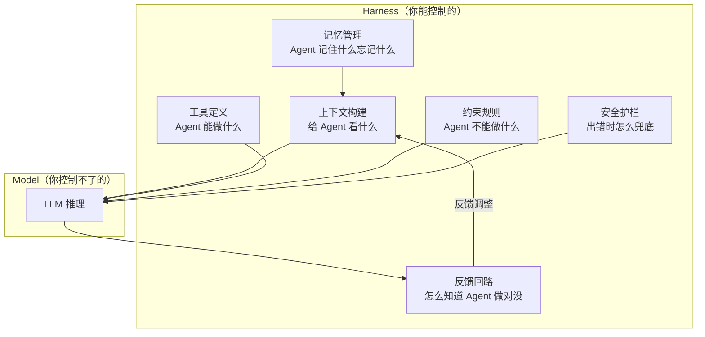
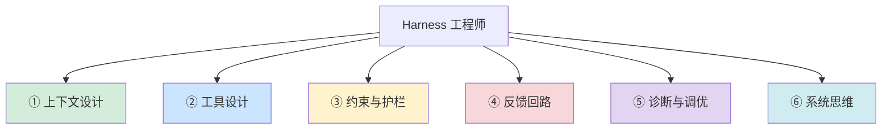
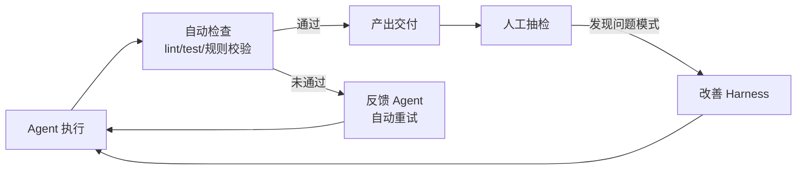
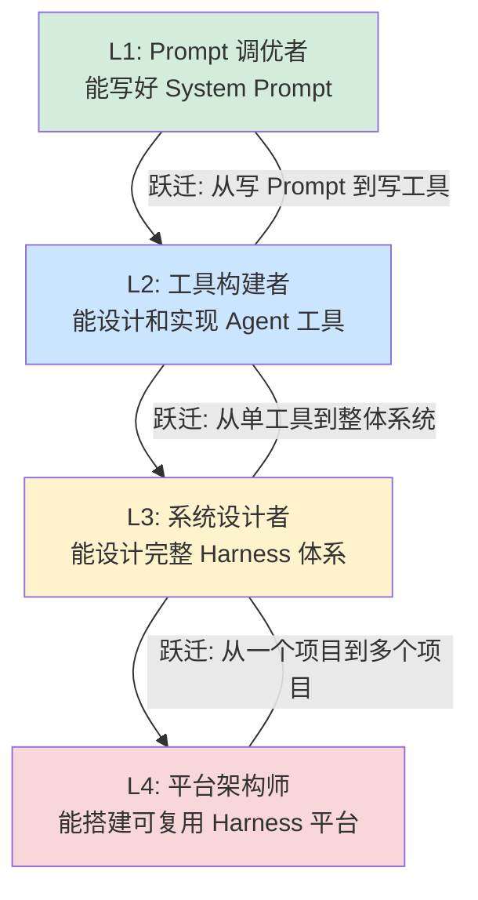
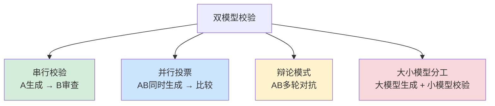

# Harness Engineering：AI Agent 时代的工程范式

> 最后整理: 2026-05-12 | 来源: 对话讨论

## 什么是 Harness Engineering

Harness Engineering（驾驭工程）是 2026 年初火起来的新概念，继 Prompt Engineering 之后的下一代工程范式。

**一句话定义**：围绕 AI Agent 构建的约束、反馈与控制系统，让 Agent 在人类设定的边界内自主、可靠地工作。

### 核心公式

```
Agent = Model + Harness

Model  → LLM 本身（Claude/GPT 等），你控制不了它怎么思考
Harness → 模型之外的一切工程基础设施，你能控制的部分
```



### 用本知识库项目举例

CLAUDE.md 就是 Harness 的一部分：

| Harness 组件 | 对应实现 | 作用 |
|-------------|---------|------|
| **上下文构建** | CLAUDE.md 中的项目规则 | 告诉 Agent 项目结构、文件组织规则 |
| **工具定义** | `build-index.js`、`lint.sh` | Agent 可调用的工具 |
| **约束规则** | "不要手改 overview.html"、"子目录最多两层" | 限制 Agent 不能做什么 |
| **反馈回路** | `exit-check.sh`、`check-overview.js` | 执行后自动检查产出 |
| **记忆管理** | `memory/` 目录下的 feedback 文件 | 跨会话记住用户偏好和教训 |
| **安全护栏** | markdownlint 格式检查 | 防止产出不合规内容 |

### 和之前概念的关系

```
Prompt Engineering   → 怎么写好一句话让 LLM 回答好
Context Engineering  → 怎么把正确的信息喂给 LLM
Harness Engineering  → 怎么设计整个系统让 Agent 可靠工作
```

| 维度 | Prompt Engineering | Context Engineering | Harness Engineering |
|------|-------------------|--------------------|--------------------|
| **关注点** | 一次对话写好 | 每次输入信息完整 | 整个 Agent 系统 |
| **范围** | System Prompt | Prompt + 检索内容 | Prompt + 工具 + 约束 + 反馈 + 记忆 + 护栏 |
| **迭代方式** | 改 Prompt 措辞 | 改检索策略 | 改系统架构 |
| **类比** | 写一封好的邮件 | 整理好参考资料 | 设计整套工作流程 |

### 为什么现在火了

Agent 不可靠的原因，80% 不是模型不够聪明，而是 Harness 没设计好：

```
常见 Agent 失败原因:
  ❌ "模型太笨了"        → 其实是上下文没给对
  ❌ "Agent 乱调工具"    → 其实是工具 description 写得不好
  ❌ "Agent 跑偏了"      → 其实是缺少约束规则
  ❌ "Agent 重复犯错"    → 其实是没有记忆和反馈回路
  ❌ "Agent 产出不可控"  → 其实是没有护栏和校验
```

**核心理念：当 Agent 表现不好时，不是换更强的模型，而是改善 Harness。**

实际例子：

```
场景: Agent 写代码总是忘记加单元测试

❌ Prompt 思路: 在 Prompt 加一句 "每次写代码都要写测试"
   → 有时管用，有时 Agent 就是忘

✅ Harness 思路:
   1. 工具约束: "运行测试"设为必选工具，提交前自动执行
   2. 反馈回路: 提交后自动跑 CI，不通过自动打回
   3. 记忆机制: 写进 CLAUDE.md，每次会话自动加载
   4. 护栏检查: exit-check.sh 检查是否有新增测试文件
   → 系统性保证，不依赖 Agent "记得住"
```

---

## Harness 不是新概念——自检你的现有体系

> 来源: 知乎专栏"先用起来"《别学歪了：Harness 不是新概念，是你已经在做的事》(2026-04-16)

### 一句话认知

**Harness = 套在 LLM 外面的运行时控制系统**，让 Agent 能稳定地完成长任务。

模型是发动机，Harness 是整辆车的底盘、变速箱、刹车、导航。具体管什么：做计划、测试、失败重试、上下文压缩、多 Agent 分工、操作审批、中间结果持久化。

**如果你认真配置过 Claude Code 的规则体系，你已经在做 Harness Engineering——只是不自知。**

### CC 源码六原则自检

有人从 Claude Code 源码里提炼了六条 Harness 工程原则，对照检查就能看出自己做到了什么程度：

| 原则 | CC 内部怎么做 | 说明 |
|------|-------------|------|
| **Prompts as Control Surface** | 用自然语言指令引导模型行为，不硬编码规则引擎 | CLAUDE.md 就是你的 Control Surface |
| **Fail-Closed Defaults** | 新能力默认关闭，出错回退到安全行为 | Operational Guards（preflight + guards）|
| **A/B Test Everything** | 89 个 Feature Flag，不做大爆炸发布 | 新 skill/流程先小范围验证 |
| **Observe Before Fixing** | 先建可观测性，再动手修 | dev-log 体系就是你的 Observability |
| **Cache-Aware Design** | 严格区分静态/动态 prompt，缓存优化 | CC 内部处理，用户无需关心 |
| **Latch for Stability** | 状态锁定避免振荡 | CC 内部处理，用户无需关心 |

4/6 已有，2/6 是底层 runtime 的事。**这说明什么？如果你在认真配置 Claude Code 的规则体系，你已经在做 Harness Engineering。**

### 三个值得有意识强化的方向

#### 一、机械约束替代文档约束

Codex 团队原话：**"Agent 会复制已有的坏模式，没有机械约束，坏模式指数级扩散。"**

文档约束本质上是"请求"，机械约束才是"强制"。作者写了一个 lint 脚本扫描绕过统一 API 的直接 import，发现了 49 个历史违规——分散在 31 个文件中，之前完全不知道。

**关键认知转变**：重要规则不能只靠 prompt 约束，要用代码强制。**约束比文档管用，Linter 比 Prompt 管用。**

```
文档约束: CLAUDE.md 写"不允许直接调 XXX"
机械约束: SessionStart hook 自动跑 grep，检测到违规立即报红
```

本项目已落实的例子：
- `arch-lint.sh` 机械扫描 frontmatter 完整性、死链、重复标题
- `preflight.sh` 检查遗留未提交变更、memory 过期、manifest 一致性
- `permission-audit.sh` 自动扫描新脚本 vs allowlist

#### 二、分离评估——模型不能可靠地评估自己

Anthropic 在三代 Harness 架构演进中发现：**让模型给自己的工作打分，它倾向于过度自信。**

解法：引入独立的 Evaluator Agent——生成代码的和验证代码的不是同一个 Agent。独立的 agent 没有"我做的一定是对的"这个心理包袱。

应用到本项目：
- 关键产出（如架构 linter 的检查规则设计）交付前，用独立 subagent 做验证
- 写进 CLAUDE.md 变成 always-on 规则，不靠每次手动记得

#### 三、跨 Session 工件化——文件系统是最可靠的记忆

Codex 团队 3 个工程师、5 个月、100% Agent 生成代码，核心做法：**每个任务步骤的产出都写入文件系统，不依赖会话记忆。**

作者检查了自己的 19 个 active plans，全部 0% 进度——不是工作没做，是做了之后没人去打勾。Plan 写完就变成了"忘了就忘了"的文档。

```
❌ 依赖 memory: "上次做到的进度应该在上下文里"
✅ 依赖文件: Plan 文件 checkbox 打勾 + Decision log，下次 session AI 直接读
```

**Memory 会过期、会被压缩、会在上下文切换时丢失。文件系统不会。**

### 给 CC 用户的三条直接建议

| # | 建议 | 怎么做 |
|---|------|--------|
| 1 | **审计 CLAUDE.md，找到值得机械化的规则** | 挑出最重要的 2-3 条"不允许/必须"规则，写 grep/lint 检查配 hook |
| 2 | **关键产出不要让同一个 session 自评** | 开新 subagent，把原始需求和产出喂给它，让它独立评价 |
| 3 | **Plan 文件是跨 session 的状态机** | 加 checkbox，每完成一步打勾，每个非显而易见的决策写 Decision log |

### 一句话总结

**Harness Engineering 不是要你学新东西，而是给你已经在做的事一个更清晰的认知框架。** 从"会用工具"到"会驾驭工具"，差的就是这层自觉。

### 系列文章结构

作者"先用起来"的四篇系列，合在一起是完整的路线图：

| 篇目 | 解决什么问题 | 关键词 |
|------|------------|--------|
| 从能用到高效 | 全局路线图——从哪开始、怎么演进 | 四阶段、约束>文档>对话、plan 持久化 |
| 建立个人 AI 工作框架 | 整理——skill 装了一堆怎么整合 | 四层框架、skill 审计、做减法 |
| **本文：Harness 不是新概念** | 执行——怎么把约束落地为 hooks 和 linter | 机械约束、分离评估、跨 session 工件化 |
| 从 nuwa-skill 吸收认知框架 | 判断——怎么让 AI 用高手的思维方式思考 | 认知框架注入、三步吸收法、角色映射 |

> 关联: [Claude Code 进阶工作流](./claude-code-advanced-workflow.md) — 同作者的系列第一篇（四阶段模型、约束>文档>对话三层模型）
> 关联: [外部参考链接](../../../实战/external-references.md) — 系列文章链接汇总

---

## 团队级 Harness：从个人到团队的规模化实践

上面的讨论偏个人视角（一个人 + 一个 Agent），但真正有挑战的是**团队级别的 AI Coding 治理**。

> 详细内容请参考：[AI Coding 团队治理：从个人提效到团队工程化](../AI-Coding/ai-coding-team-governance.md)
>
> 核心要点：
> - "人人对齐 → 人机对齐" 方法论
> - Pre-PR 机制（AI 自查 3 轮 → AI 生成 PR 文档 → 人工聚焦业务语义）
> - 美团 31 万行代码 AI 重构实践
> - 团队级 Harness 六大组件对照

---

## Harness 工程师的六项核心能力



### ① 上下文设计——给 Agent 看什么

上下文不是越多越好，而是要精准：

```
❌ 差: 把整个代码库全塞给 Agent → 信息过载，注意力稀释
✅ 好: 精心设计 CLAUDE.md → 项目结构、规范、规则一目了然
```

### ② 工具设计——让 Agent 能做什么

- 粒度合适：太粗 LLM 不知道什么时候用，太细 LLM 选择困难
- description 即 API 文档：LLM 只看 description 决策
- 返回值要充足：返回 `success` 不够，要返回完整的上下文信息

### ③ 约束与护栏——让 Agent 不能做什么

**区分初级和高级 Harness 工程师的关键**——初级只想让 Agent 能做事，高级考虑怎么让 Agent 不出事。

```
三类约束:
  硬约束（代码强制）→ 退款金额 > 订单金额直接拒绝，不依赖 LLM
  软约束（Prompt 引导）→ "输出前检查隐私信息"，大部分遵守
  兜底机制（出错补救）→ 输出后用正则/小模型二次校验
```

### ④ 反馈回路——怎么知道 Agent 做对没

没有反馈的 Agent 就像没有测试的代码——看起来能跑，但不知道对不对。



### ⑤ 诊断与调优——Agent 出问题怎么排查

```
Agent 表现不好 →
  1. 看上下文: Agent 拿到足够信息了吗？ → 补 CLAUDE.md / 工具返回值
  2. 看工具: 选对工具了吗？参数对吗？   → 改 description / 合并工具
  3. 看约束: 做了不该做的事吗？          → 加硬约束 / 加护栏
  4. 看反馈: Agent 知道自己做错了吗？     → 加检查脚本 / 加测试
  5. 最后才考虑: 模型能力不够？           → 这通常是最后手段
```

### ⑥ 系统思维——全局设计能力

优秀的 Harness 工程师设计的是可持续迭代的系统：可复用、可演化、可度量。

---

## 成长路径：四个阶段



| 阶段 | 能做什么 | 核心技能 |
|------|---------|---------|
| **L1 Prompt 调优者** | 写好 System Prompt，单次任务表现好 | Prompt Engineering、Few-shot |
| **L2 工具构建者** | 设计 Function Calling 工具、理解工具粒度 | 工具设计、API 设计、Agent 框架 |
| **L3 系统设计者** | 设计完整 Harness（上下文+工具+约束+反馈+记忆） | 系统思维、反馈回路、可观测性 |
| **L4 平台架构师** | 搭建可复用的 Harness 平台，服务多项目/团队 | 平台工程、标准化、Eval 体系 |

### 各阶段跃迁的具体技能

**L1 → L2（从 Prompt 到工具）**：

- 理解 Function Calling 完整机制
- 能用 Spring AI / LangChain 实现带工具调用的 Agent
- 理解 description 对 LLM 决策的影响
- 能设计合理的工具粒度和参数

**L2 → L3（从工具到系统）**：

- 能设计 CLAUDE.md / AGENTS.md 级别的上下文规范
- 能搭建自动化检查链路（lint → test → review）
- 能设计记忆机制（跨会话知识持久化）
- 能做 Agent 行为的可观测性（日志、链路追踪）
- 能做 Agent 产出的质量评估（eval 框架）

**L3 → L4（从项目到平台）**：

- 能设计可复用的 Harness 模板（如 Superpowers Skill 体系）
- 能搭建 Agent Eval 平台（自动化评估不同任务上的表现）
- 能设计 Harness 的版本管理和 A/B 测试
- 能输出团队级别的 Harness 最佳实践

---

## 反馈回路进阶：双 LLM 交叉校验

交叉校验是 Harness 反馈回路的高级实现——用另一个独立模型来校验产出质量。

### 为什么需要两个模型

单模型有"自我一致性幻觉"——你问它"你确定吗？"它大概率说"是的"。用同一个模型检查自己 ≈ 让考生自己批改试卷。两个不同模型的训练数据、架构、偏好不同，犯同样错误的概率大幅降低。

### 五个适合交叉校验的场景

| 场景 | 怎么校验 | 为什么有效 |
|------|---------|-----------|
| **代码生成** | A 写代码，B 审查找 bug | 两个模型错误模式不同 |
| **事实性内容** | A 生成回答，B 对比 RAG 原文一致性 | 拦截幻觉 |
| **安全/合规** | A 正常处理，B（小模型）做安全分类 | 检测泄露/敏感信息 |
| **翻译** | A 英→中翻译，B 中→英回译，比较差异 | 回译差异大→翻译有问题 |
| **复杂推理** | A 和 B 独立推理，比较结论 | 一致→置信度高 |

### 四种实现方式



#### 串行校验（最常用）

```
用户请求 → 模型A生成 → 模型B审查 → 通过则输出 / 不通过则重做

伪代码:
  result = claude.generate(user_input)
  review = gpt.review(f"审查以下回答是否准确: {result}")
  if review.pass:
      return result
  else:
      return claude.generate(f"有以下问题请修正: {review.issues}")
```

**优点**：简单、容易落地。**缺点**：延迟翻倍。

#### 并行投票（适合高可靠场景）

```
用户请求 → A 和 B 同时生成 → 第三方判断一致性 → 一致则输出 / 不一致则人工

伪代码:
  result_a, result_b = await gather(claude(input), gpt(input))
  if judge("两个回答核心事实一致？", result_a, result_b):
      return result_a
  else:
      return flag_for_human_review(result_a, result_b)
```

**优点**：两个独立意见，可靠性最高。**缺点**：成本翻倍。

#### 辩论模式（适合复杂决策）

```
A 给观点 → B 质疑/反驳 → A 回应 → 多轮直到共识

  Round 1: A 回答问题
  Round 2: B 指出逻辑漏洞
  Round 3: A 修正回答
  Round 4: B "没有发现新问题" → 结束
```

**优点**：对抗挤出高质量。**缺点**：多轮调用，延迟成本高。

#### 大小模型分工（性价比最高）

```
大模型（Claude/GPT-4）生成复杂回答
小模型（GPT-4o-mini/Qwen-7B）做简单校验

  大模型生成回答
    → 小模型判断: 包含隐私信息？ yes/no（安全校验）
    → 小模型判断: 数字和日期和参考资料一致？（事实校验）
  校验成本低（小模型便宜 10-50 倍），延迟增加少
```

### 怎么选

| 场景 | 推荐方式 | 原因 |
|------|---------|------|
| 客服答疑（高频低风险） | 大小模型分工 | 成本敏感，小模型做事实校验够用 |
| 代码生成 | 串行校验 | 生成和审查天然是两步 |
| 金融/法律/医疗（低频高风险） | 并行投票 | 需要最高可靠性 |
| 复杂技术决策 | 辩论模式 | 需要从多角度充分论证 |

### 实际产品中的应用

| 产品 | 实现方式 |
|------|---------|
| **Claude Code** | 主 session 写代码 + code-reviewer 子 Agent 独立审查（同模型不同上下文） |
| **OpenAI Agents SDK** | Engineer → Reviewer 的 Handoff 环形流程 |
| **Cursor** | 多模型混用——Sonnet 写代码，小模型做 lint/补全 |
| **企业级 RAG** | 大模型生成 + 小模型幻觉检测（对比原文一致性） |

### 注意事项

交叉校验不是万能的：
- 两个模型可能犯同样的错（相同训练数据导致的共同偏差）
- 校验模型本身也可能误判
- 不是所有场景都需要——简单 FAQ 单模型 + RAG 就够，创意写作没有"对错"之分
- 最终兜底还是需要人工抽检

---

## 用户视角：不写代码怎么实现双模型校验

上面的四种实现方式偏开发者视角。作为用户（比如用 Claude Code 维护知识库），有更简单的操作方式。

### 知识库维护：大小模型分工

| 方式 | 怎么做 | 难度 |
|------|--------|------|
| **手动两步法** | Claude Code 产出 → 复制到 ChatGPT/DeepSeek 问"检查有没有错" | 零成本 |
| **cc-connect 群聊** | 群里绑定多个 Bot，@Claude 写内容 → @GPT 校验 | 需要配置 |
| **校验脚本** | 写 bash 脚本用 DeepSeek API 自动校验最新修改的 md 文件 | 写个脚本 |

校验脚本示例（加到 exit-check.sh 中）：

```bash
# 用 DeepSeek API（便宜）校验最新修改的文件
FILE=$(git diff --name-only HEAD~1 | grep "\.md$" | head -1)
curl -s https://api.deepseek.com/chat/completions \
  -H "Authorization: Bearer $DEEPSEEK_API_KEY" \
  -d '{"model":"deepseek-chat","messages":[{
    "role":"user",
    "content":"检查以下内容有无事实错误:\n'"$(cat $FILE)"'"
  }]}' | jq '.choices[0].message.content'
```

### 编码时：技术方案辩论

| 方式 | 怎么做 | 难度 |
|------|--------|------|
| **双窗口手动对比** | Claude Code 给方案 → 复制到 ChatGPT 让它质疑 → 综合判断 | 零成本 |
| **Claude Code 内调 API** | 让 Claude Code 用 bash + curl 调另一个模型 API 做辩论 | 需 API Key |
| **Dify/Coze 工作流** | 可视化编排：Claude 给方案 → GPT 质疑 → Claude 回应 → 循环 | 注册平台 |

Claude Code 内辩论的用法——直接告诉它：

```
"我有一个技术方案，请你先给出你的观点，
 然后用 curl 调用 DeepSeek API 让它从反面论证，
 最后你综合两方观点给出最终建议。"
```

Claude Code 会自己执行 bash 调用另一个 API，拿到结果后综合分析。

**建议路径**：从手动复制粘贴开始 → 频繁使用后升级到脚本化 → 长期使用搭 Dify 工作流。

> 关联: [Agent 开发实战](../应用/agent-development-practice.md) — 四大设计范式、vs 传统 Java 开发
> 关联: [AI Coding 团队治理](../AI-Coding/ai-coding-team-governance.md) — 美团31万行代码重构：人人对齐→人机对齐、Pre-PR、零排期重构
> 关联: [Claude Code 进阶工作流](./claude-code-advanced-workflow.md) — 个人级 Harness 实践：约束>文档>对话 三层模型、hooks/memory/plan/manifest
> 关联: [Claude Code 架构](./claude-code-architecture.md) — Claude Code 的 Harness 实现（REPL 循环、工具链、上下文管理）
> 关联: [Claude Code 远程操控](./claude-code-remote-control.md) — cc-connect 多 Bot 群聊
> 关联: [Agent 与 MCP](../大模型/llm-agent-mcp.md) — MCP 协议、Skill 概念
> 关联: [LLM 应用设计](../应用/llm-app-design.md) — 幻觉防控、可观测性
