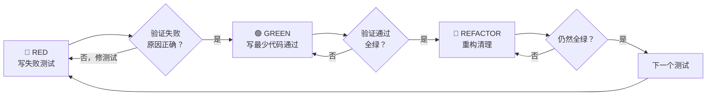
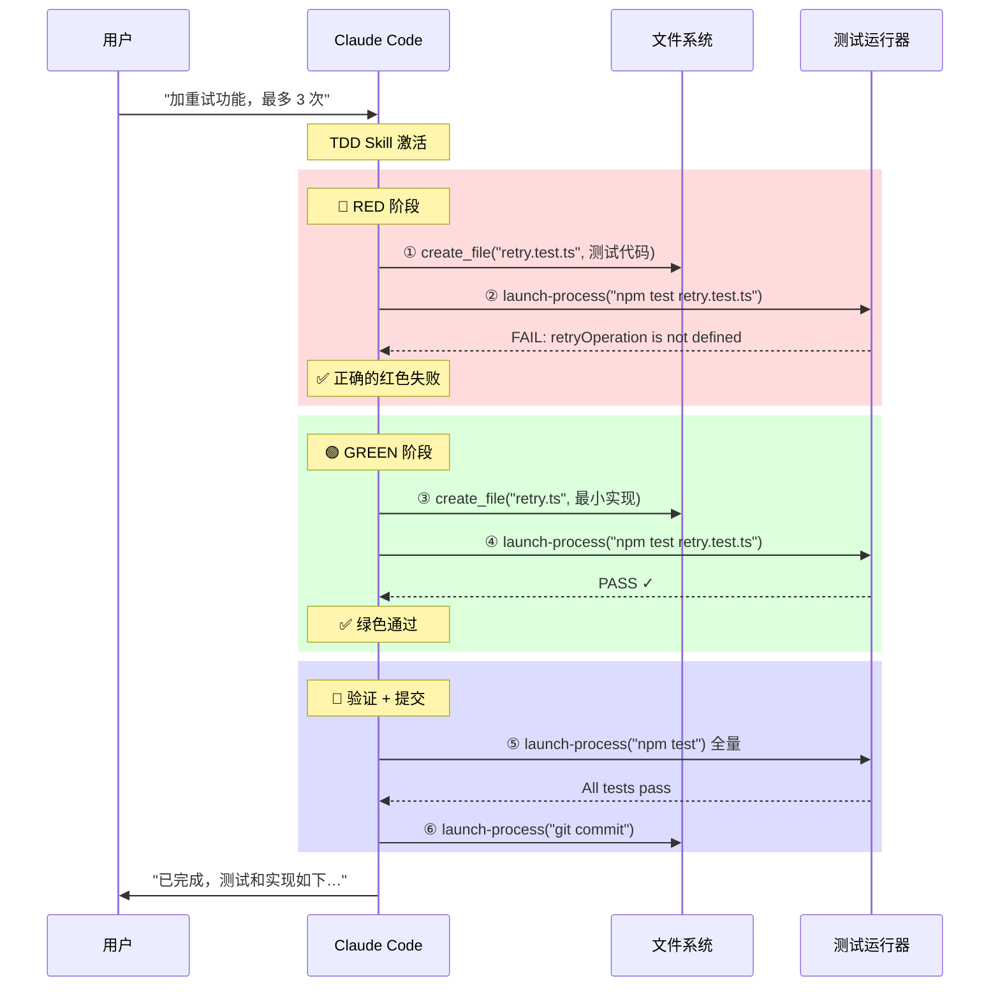

# Superpowers TDD Skill 工作流拆解

> 最后整理: 2026-05-18 | 来源: 对话 + superpowers TDD skill 源码分析

> 关联: [Agent与MCP](../大模型/llm-agent-mcp.md) — Skill 的定位与五者关系
> 关联: [claude-code-architecture](./claude-code-architecture.md) — Claude Code 整体架构
> 关联: [harness-engineering](./harness-engineering.md) — 约束工程三层模型

---

## §1 TDD 是什么

**TDD = Test-Driven Development（测试驱动开发）**，核心理念：

> 先写测试，看它失败，再写最少的代码让它通过。

### 铁律循环：Red-Green-Refactor



| 阶段 | 做什么 | 关键约束 |
|------|--------|---------|
| **RED** | 写一个会失败的测试 | 只测一个行为，命名清晰 |
| **验证 RED** | 跑测试，确认失败原因是"功能不存在" | 不是拼写错误、不是环境问题 |
| **GREEN** | 写最少代码让测试通过 | 不过度设计，不加 YAGNI 功能 |
| **验证 GREEN** | 跑测试，确认通过 + 其他测试没坏 | 失败了改代码不改测试 |
| **REFACTOR** | 重构（重命名、提取函数、消除重复） | 测试必须保持绿色 |

### 为什么必须先看失败？

> 如果测试一写就通过，你无法证明这个测试真的在"测某件事"。
> 先看到红色失败 = 证明测试有效。

---

## §2 Superpowers TDD Skill 的角色

**一句话定位：它是一个给 LLM 的"纪律注入器"。**

没有 TDD Skill 时，LLM 天生倾向：
```
用户: "加个重试功能"
LLM:  直接写 retry.ts（可能过度设计）
      → 补一个 retry.test.ts（事后补测试，从未失败过）
      → 声称 "done"
```

有 TDD Skill 时，LLM 行为被强制改变：
```
用户: "加个重试功能"
LLM:  先写 retry.test.ts → 跑测试看它失败
      → 再写 retry.ts 最小实现 → 跑测试看它通过
      → 重构 → 确认仍通过
      → 声称 "done"（有证据）
```

### Superpowers Skill 的 Iron Law（铁律）

```
❌ 没有失败的测试 → 禁止写任何生产代码
```

如果 LLM 不小心先写了代码？Skill 要求：**删掉，从头来。不能"参考"。**

---

## §3 有 TDD Skill 时的 LLM 交互全流程

### 例子：用户说 "帮我加一个重试功能，失败时最多重试 3 次"

#### 用户视角

**用户只说了 1 句话，收到 1 次最终回复。** 中间过程全自动。

#### LLM 内部工具调用链（Agentic Loop）



### 工具调用计数

| 步骤 | 工具调用 | 目的 |
|------|---------|------|
| ① | `create_file` | 写测试 |
| ② | `launch-process` | 验证 RED（看到失败） |
| ③ | `create_file` | 写实现 |
| ④ | `launch-process` | 验证 GREEN（看到通过） |
| ⑤ | `launch-process` | 全量回归 |
| ⑥ | `launch-process` | git commit |

**总计：6 次工具调用，用户只说 1 句话。**

---

## §4 复杂功能：多轮 Red-Green 循环

如果需求包含多个行为（"重试 3 次 + 全部失败抛异常 + 支持自定义次数"），每个行为一轮循环：

```
循环 1: 测试"重试 3 次成功"       → 红 → 绿 (4 次调用)
循环 2: 测试"3 次都失败抛异常"    → 红 → 绿 (4 次调用)
循环 3: 测试"自定义重试次数"      → 红 → 绿 (4 次调用)
最后:   全量测试 + commit           (2 次调用)
```

**总计约 14 次工具调用，用户仍然只说了 1 句话。**

每个循环的模式完全一致：
1. 写测试 → 2. 跑测试确认失败 → 3. 写代码 → 4. 跑测试确认通过

---

## §5 有 vs 无 TDD Skill 对比

| 维度 | **无 TDD Skill** | **有 TDD Skill** |
|------|-----------------|-----------------|
| LLM 第一步 | 直接写实现代码 | 先写测试文件 |
| 工具调用数 | ~3 次（写+测+提交） | ~6 次/行为（红+绿各一轮） |
| 测试是否曾失败 | ❌ 从未失败过 | ✅ 每个都先看到失败 |
| 过度设计风险 | 高（LLM 倾向加 YAGNI） | 低（只写测试要求的最小实现） |
| 重构安全性 | 低（测试覆盖不确定） | 高（每个行为都有针对性测试） |
| 证明力 | "我写了测试，应该没问题" | "测试曾失败，现在通过了" |
| 速度体感 | 更快（少几次调用） | 稍慢但更可靠 |

### 核心价值

> **多出来的那几轮工具调用，本质上是在"买保险"** —— 每一轮红色失败都是在证明"这个测试真的有用"。

---

## §6 常见误解澄清

### "测试后补不是一样吗？"

**不一样。** 根本区别：

| | 测试先写（TDD） | 测试后补 |
|--|----------------|---------|
| 回答的问题 | "代码**应该**做什么？" | "代码**实际**做了什么？" |
| 偏见 | 无（功能还不存在） | 有（被实现"洗脑"了） |
| 边界发现 | 写测试时被迫想到 | 依赖记忆（大概率遗漏） |
| 通过 = 有效？ | ✅ 先失败后通过 = 有效 | ❓ 直接通过 = 证明不了什么 |

### "LLM 自己跑测试不也是手动测试吗？"

不是。区别：
- **手动测试**：一次性、无记录、改了代码要重测
- **自动化测试**：永久存在、每次改动自动回归、CI 里持续运行

TDD Skill 让 LLM 产出的是**自动化测试**，不是手动验证。

### "TDD 会让 LLM 更慢吗？"

工具调用多 2-3 次（约 10 秒），但：
- 省去了后续 debug 时间（找 bug → 复现 → 修 → 验证 = 分钟级）
- 省去了"测试到底有没有用"的不确定性
- 让重构变得安全（随时可改，测试兜底）

**TDD 的成本是前置的、可预测的；不写 TDD 的成本是后置的、不可预测的。**

---

## §7 Superpowers 其他 Skill 的类似模式

TDD 不是唯一的"纪律型 Skill"。Superpowers 还有多个刚性流程 Skill：

### systematic-debugging（系统调试）

**Iron Law:** `NO FIXES WITHOUT ROOT CAUSE INVESTIGATION FIRST`

**强制四阶段流程：**
1. **Phase 1: 根因调查** — 读错误信息、稳定复现、检查近期变更、在多组件系统中逐层添加诊断日志、追溯数据流
2. **Phase 2: 模式分析** — 找到相似的正常代码、对比差异、理解依赖
3. **Phase 3: 假设与测试** — 单一假设 + 最小改动验证，不通过就换新假设（不堆叠修复）
4. **Phase 4: 实施** — 先写失败测试 → 单一修复 → 验证 → 如 3 次修复失败则停下来质疑架构

**防止的坏习惯：** "我觉得可能是 X，先改改试试" → 随机修复 → 引入新 bug

---

### brainstorming（头脑风暴设计）

**Hard Gate:** `Do NOT write any code until you have presented a design and the user has approved it.`

**强制 9 步清单：**
1. 探索项目上下文（文件、文档、近期提交）
2. 评估是否需要可视化伴侣（单独一条消息征求同意）
3. **逐个**问澄清问题（一次一个，偏好多选题）
4. 提出 2-3 个方案 + 权衡 + 推荐
5. 分节呈现设计，每节征求确认
6. 写设计文档到 `docs/superpowers/specs/YYYY-MM-DD-<topic>-design.md`
7. Spec 自检（placeholder 扫描、内部一致性、歧义检查）
8. 用户 review 设计文档
9. 交接给 `writing-plans` skill（不直接写代码）

**防止的坏习惯：** 用户说"加个功能" → LLM 直接开始写代码 → 方向跑偏

---

### verification-before-completion（完成前验证）

**Iron Law:** `NO COMPLETION CLAIMS WITHOUT FRESH VERIFICATION EVIDENCE`

**强制 5 步 Gate Function：**
1. **IDENTIFY** — 什么命令能证明这个声明？
2. **RUN** — 执行完整命令（新鲜的、完整的）
3. **READ** — 读完整输出，检查 exit code，计数失败
4. **VERIFY** — 输出是否确认了声明？
5. **ONLY THEN** — 才能做出声明

**红旗词汇（触发即违规）：** "should pass"、"probably works"、"seems to"、"Great!"、"Done!"

**防止的坏习惯：** "改完了，应该没问题" → 不跑测试就声称完成

---

### writing-plans（撰写实现计划）

**定位：** 在有 spec/需求后、写代码前，生成精细到 2-5 分钟一步的实现计划。

**关键约束：**
- 每步必须含**完整代码**（不允许 placeholder / "TBD" / "类似 Task N"）
- 每步必须含**精确文件路径**和**预期命令输出**
- 遵循 TDD 节奏：写测试 → 跑失败 → 写实现 → 跑通过 → commit
- 完成后提供两种执行方式：Subagent-Driven（推荐）或 Inline Execution

**防止的坏习惯：** 一边想一边写 → 架构混乱 → 返工

---

### 共同模式

所有刚性 Skill 的本质一样：

```
正常 LLM:  需求 → 直接行动 → 声称完成（可能错）
有 Skill:  需求 → 强制流程 → 每步验证 → 有证据地声称完成
```

**它们不是让 LLM 变慢，而是把"不可预测的后置返工成本"转化为"可预测的前置流程成本"。**
