# 从 Sub-Agent 到 Multi-Agent 的工程指南

> 最后整理: 2026-06-10 | 来源: 黄佳《Claude Code 工程化实战》课程"量体裁衣：从Sub-Agents到Multi-Agent的工程指南"章节 + 生产实践 + Claude Code 官方文档

> 关联: [子智能体（subagents）机制与实战](./子智能体（subagents）机制与实战.md) — Sub-Agent 机制的底层细节
> 关联: [Skills 渐进式披露架构](<./Skills 渐进式披露架构.md>) — Skills 模式的实现原理
> 关联: [Headless 模式与 Agent SDK](<./Headless 模式与 Agent SDK.md>) — 生产 agent 的运行时入口
> 关联: [Agent 开发实战：选型、框架与思维转换](<../应用/Agent 开发实战：选型、框架与思维转换.md>) — 更广义的 Agent 开发视角
> 关联: [并行探索与流水线编排](./并行探索与流水线编排.md) — 并行/流水线两种编排的工程实现 + 交接契约设计

---

## §1 四种多智能体设计模式

多智能体系统不是"一上来就搞多进程"，而是一个**渐进式演进**的光谱。黄佳课程把它归纳为四种模式，从轻到重：

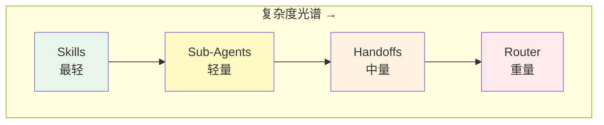

### 1.1 Skills — 渐进式加载（最轻量）

**本质**：不是真正的"多 agent"，而是**单 agent 按需加载不同知识/能力**。

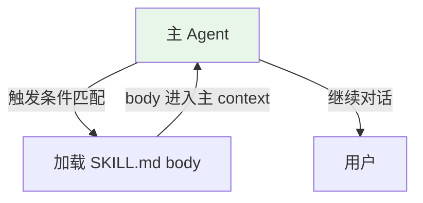

**工作方式**：
- 主 agent 始终只有一个 context window
- Skills 通过 frontmatter 触发条件按需注入
- 注入后就是主 context 的一部分，不隔离

**适用场景**：
- 主 agent 能力需要"切换模式"（写代码模式 vs 写文档模式）
- 需要的是**知识/规则**，不是**独立执行能力**
- context window 还没到瓶颈

**局限**：
- 所有 skill 共享同一个 context——加载多了会挤占
- 没有权限隔离（skill 能用主 agent 的所有工具）
- 没有"角色分离"——同一个 agent 既是创作者又是审查者

**现实类比**：一个人翻开不同的参考手册来解决不同问题。

### 1.2 Sub-Agents — 独立 Context 派发

**本质**：主 agent 把任务**扇出**给多个独立 context 的子 agent，子 agent 完成后**只返回结论**给主 agent。

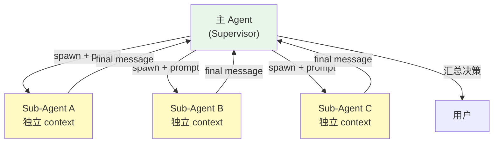

**工作方式**：
- 主 agent 是编排者（Supervisor），负责"派谁做什么"+"汇总结果"
- 子 agent 有独立 context，看不到主对话历史
- 子 agent 跑完销毁，不保持状态
- 通信是**单向的**：主→子（任务）→主（结果），子与子之间不通信

**适用场景**：
- 任务天然可拆分（并行搜索、独立审查）
- 需要 context 隔离（大量文件读取不污染主对话）
- 需要权限隔离（子 agent 只读，不能写）
- 需要模型降级（用 Haiku 做低成本预处理）

**局限**：
- 子 agent 之间不能直接通信
- 没有"交接"概念——不能把整个对话连带历史转给另一个 agent
- 反馈循环需要主 agent 手动编排（spawn → 收结果 → 判断 → 再 spawn）

**现实类比**：经理派三个下属分别调研，汇报后经理做决策。下属之间不直接沟通。

### 1.3 Handoffs — 交接模式

**本质**：一个 agent 完成自己的部分后，**把对话控制权完整移交**给下一个 agent，包括对话历史和中间状态。

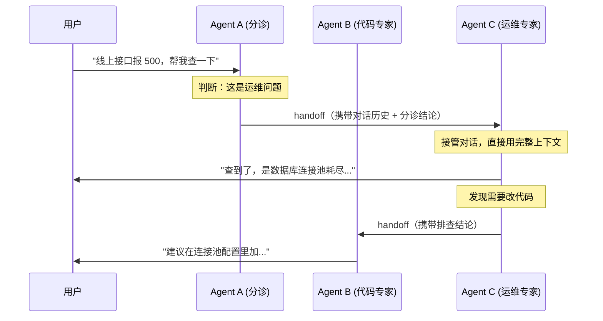

**工作方式**：
- Agent A 完成自己的职责后，调用 `handoff()` 把**完整 conversation state** 转给 Agent B
- Agent B 从 A 停下的地方继续，**能看到之前所有对话**
- 像接力赛——棒在谁手里，谁就是当前活跃 agent
- 同一时刻只有一个 agent 活跃

**适用场景**：
- 对话流程有**明确阶段**（分诊→专科→处方）
- 下游 agent 需要**完整上下文**才能工作（不是摘要，是全部历史）
- 用户感知上应该是"一个连续对话"，不是"被转来转去"

**与 Sub-Agent 的关键区别**：

| 维度 | Sub-Agent | Handoff |
|------|-----------|---------|
| 对话历史 | 子 agent 看不到主对话 | 下游 agent 继承完整历史 |
| 控制权 | 始终在主 agent | 移交给下游 agent |
| 用户感知 | 用户只和主 agent 交互 | 用户可能感知到"换人了" |
| 回传 | 子 agent 返回摘要给主 | 下游 agent 直接和用户对话 |
| 并行 | 可以并行多个子 agent | 同时只有一个活跃 |

**局限**：
- 每次 handoff 携带完整历史→token 成本累积
- 链条太长会导致 context 溢出
- 难以并行（天然串行模式）
- 需要明确的"交接协议"——什么时候交、交给谁、带什么

**现实类比**：医院分诊台→专科医生→手术室，每一步都拿着完整病历交接。

### 1.4 Router — 路由分发模式

**本质**：一个轻量级 Router 快速判断问题类型，**并行分发**给多个专家 agent，各专家独立处理后汇总（或由 Router 选择最优答案）。

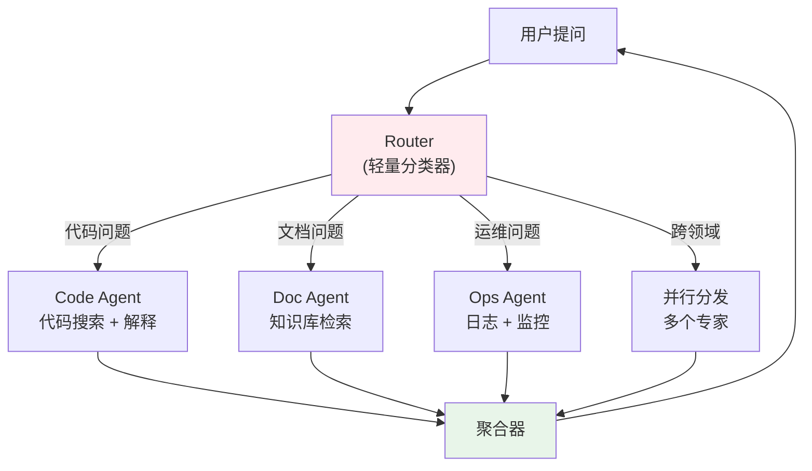

**工作方式**：
- Router 本身**不做深度推理**，只做分类（可以用 Haiku 或甚至规则引擎）
- 分类后把问题路由到对应的专家 agent
- 专家 agent 各自独立处理（可并行）
- 聚合器（可能就是 Router 自己）合并结果返回用户

**适用场景**：
- 问题类型多样，不同类型需要不同工具集/知识库/模型
- 需要低延迟（Router 快速分类 + 并行处理 比串行快）
- 用户量大，需要按类型做资源隔离和扩缩容
- 偶尔有跨领域问题需要多专家协作

**与 Handoff 的关键区别**：

| 维度 | Handoff | Router |
|------|---------|--------|
| 流向 | 串行（A→B→C） | 并行（Router→多个专家） |
| 决策者 | 当前活跃 agent 决定交给谁 | Router 统一决策 |
| 历史 | 完整历史传递 | 各专家通常只拿到问题+必要上下文 |
| 适合 | 流程型任务（阶段明确） | 分类型任务（类型多样） |

**局限**：
- Router 分类错误→整个链路走偏
- 跨领域问题的"并行分发"后合并困难
- 需要额外的聚合逻辑
- 系统整体复杂度最高

**现实类比**：公司前台接电话，转给对应部门处理，或者重要事项同时通知多个部门。

---

## §2 四种模式的选型决策树

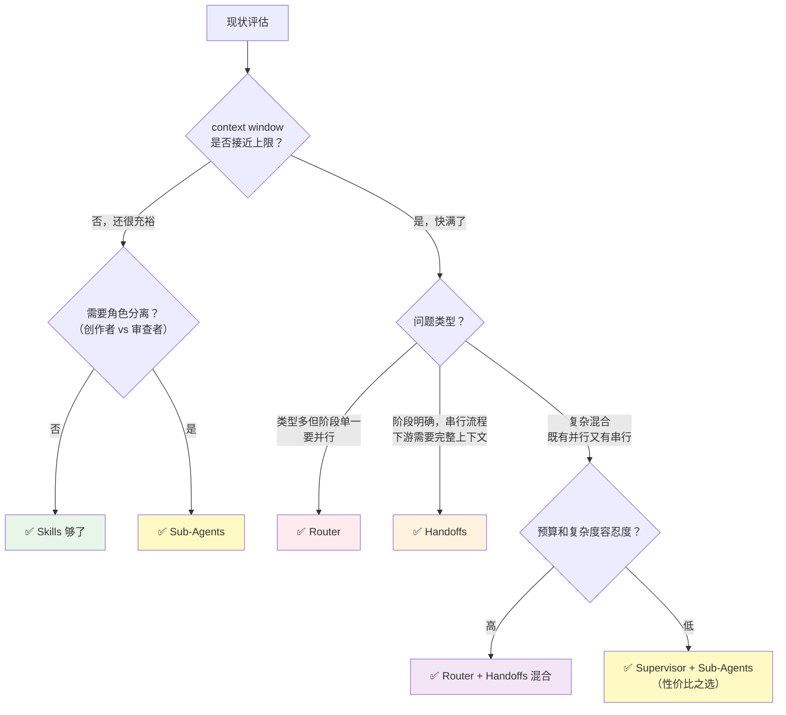

### 升级的三个触发信号

| 信号 | 表现 | 对应升级 |
|------|------|---------|
| **Context 溢出** | 回答质量下降、"忘记"前面的指令、工具调用错乱 | Skills → Sub-Agents 或 Router |
| **角色冲突** | 自己写的代码自己审查放水、不同任务的指令互相干扰 | Skills → Sub-Agents |
| **串味/跑偏** | 回答 A 问题时混入 B 问题的上下文、调错工具 | 单 Agent → Router 或 Sub-Agents |

---

## §3 Supervisor + Sub-Agents 模式详解

这是最常用的 Multi-Agent 入门模式——**一个编排者 + 多个执行者**。

### 架构拆解

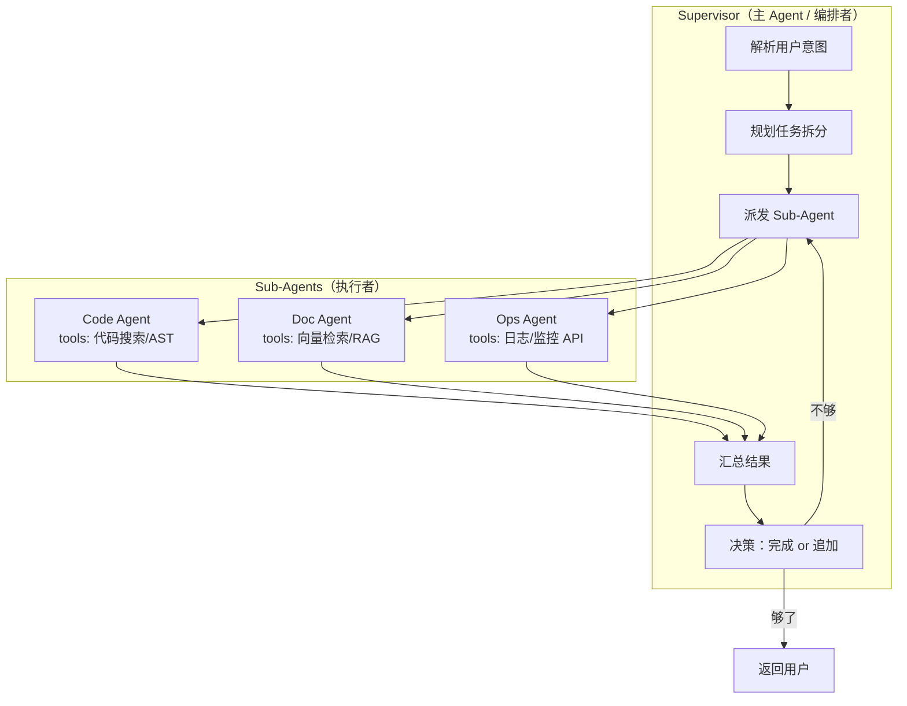

### 核心职责分离

| 角色 | 职责 | 不该做的事 |
|------|------|----------|
| **Supervisor** | 理解意图、拆任务、选 agent、合结果、做决策 | 不该自己去读文件、查日志 |
| **Sub-Agent** | 在限定范围内深度执行一个子任务 | 不该判断整体方向、不该和其他 Sub-Agent 通信 |

### 为什么叫 "Supervisor"

不是所有使用 Sub-Agent 的场景都叫 Supervisor 模式。**Supervisor 特指**：

1. 主 agent 的**主要工作是编排**，而不是自己执行
2. 主 agent **持有全局状态**（知道所有 sub-agent 的进展）
3. 主 agent 有**反馈循环能力**（根据结果决定是否追派）

对比：简单的"主 agent 派一个 sub-agent 查个东西"不算 Supervisor，那只是"委托"。

---

## §4 Claude Code 本地 Sub-Agent vs 生产 Multi-Agent：本质区别

这是你提到的一个关键认知。两者虽然都叫"agent"，但运行模型完全不同：

```mermaid
graph LR
    subgraph Local["Claude Code 本地 Sub-Agent"]
        direction TB
        L1["单进程单机器"]
        L2["共享文件系统"]
        L3["无网络通信"]
        L4["session 级生命周期"]
        L5["无部署/运维"]
    end

    subgraph Prod["生产 Multi-Agent 系统"]
        direction TB
        P1["多进程/多容器/多机器"]
        P2["通过 API/消息队列通信"]
        P3["各自独立部署、独立扩缩"]
        P4["持久化状态/长期运行"]
        P5["需要监控/告警/降级策略"]
    end

    Local -.."设计思想相通<br/>但工程实现完全不同"..-> Prod
```

| 维度 | Claude Code Sub-Agent | 生产 Multi-Agent |
|------|----------------------|-----------------|
| **运行环境** | 本地 CLI 进程内 | 云端容器/Serverless |
| **通信方式** | 函数调用（Agent tool） | HTTP/gRPC/消息队列 |
| **生命周期** | 跑完即销毁 | 长期运行/按需唤起 |
| **状态管理** | 无状态（context 用完丢） | 数据库/Redis 持久化 |
| **扩缩容** | 不存在 | 按流量自动扩缩 |
| **故障处理** | 主 agent 收到错误，人工决策 | 重试/降级/熔断/告警 |
| **可观测性** | session log | 分布式追踪/metrics/日志 |
| **成本模型** | 按 token 直接付费 | token + 基础设施 + 运维人力 |

**关键洞察**：Claude Code 的 sub-agent 是**设计模式的本地原型**。它帮你验证"这个任务拆分合不合理""角色分离有没有价值"。验证完后，真要上生产，工程实现会换一套东西（Agent SDK / LangGraph / CrewAI / 自研框架）。

---

## §5 生产环境 Multi-Agent 部署实例

### 实例 1：电商客服系统（Router + Handoff 混合）

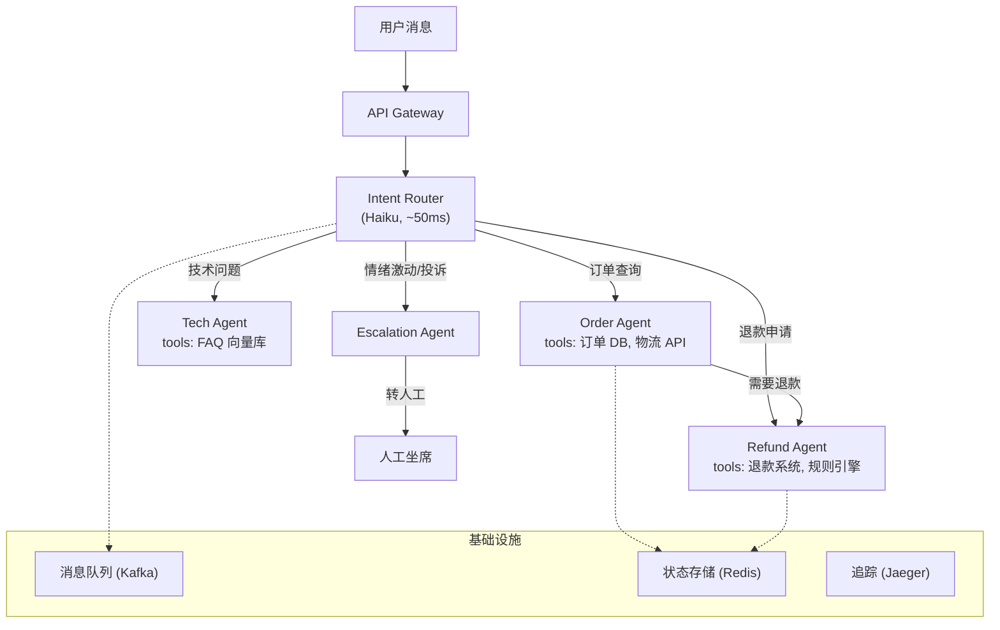

**部署特点**：
- Router 用 Haiku（快、便宜），专家 Agent 用 Sonnet
- 每个 Agent 独立容器，按 QPS 独立扩缩
- 通过 Kafka 异步通信（非实时场景）/ HTTP 同步（实时对话）
- Redis 存对话状态，支持 Agent 间 handoff
- Jaeger 做分布式追踪，每次对话一条 trace

### 实例 2：代码 Review 流水线（Supervisor + Sub-Agents）

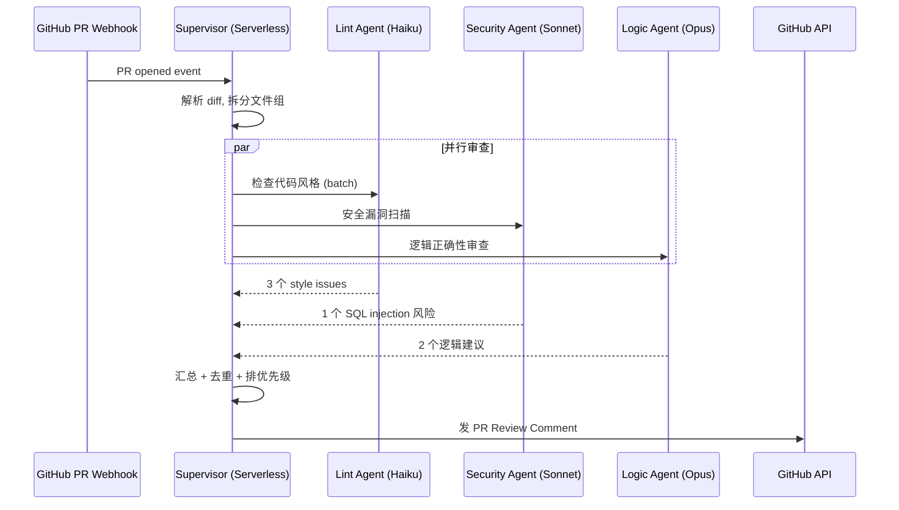

**部署特点**：
- Supervisor 跑在 AWS Lambda（事件触发，用完释放）
- Sub-Agents 通过 Anthropic Batch API 调用（省钱 50%）
- 不同 Agent 用不同模型——Lint 用最便宜的、安全用 Sonnet、逻辑用 Opus
- 无状态设计——每次 PR 是独立的，不需要持久化

### 实例 3：企业知识助手（本文课后题原型）

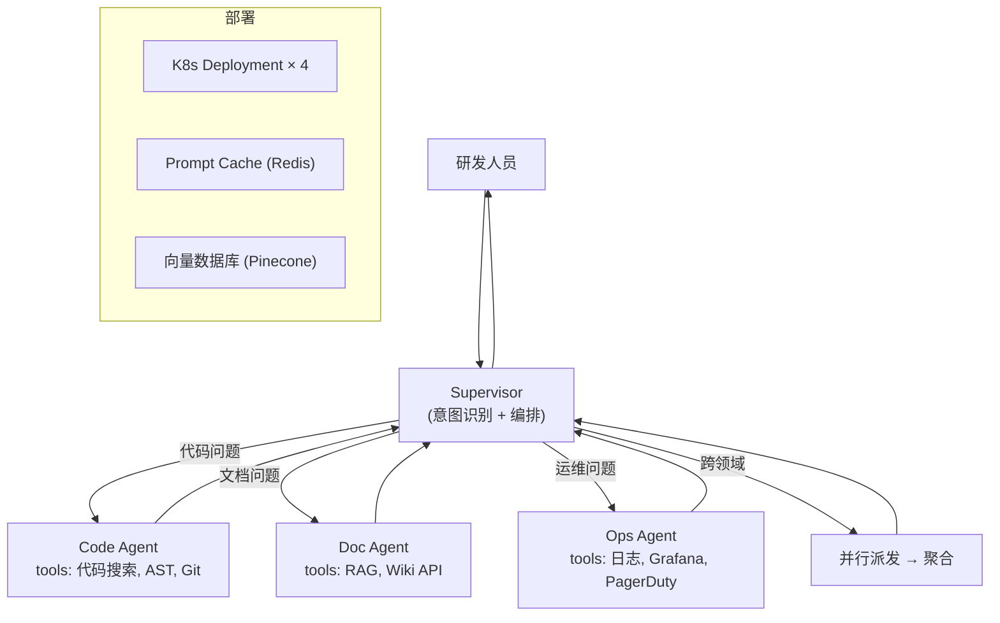

**部署特点**：
- 每个 Agent 是独立的 K8s Deployment，可以独立升级
- Supervisor 和 Sub-Agent 之间用内部 gRPC（低延迟）
- 向量数据库给 Doc Agent 专用（不和其他 Agent 共享连接池）
- Prompt Cache 在 Redis 里——相似问题命中缓存直接返回

---

## §6 当前知识库项目的架构选型分析

### 项目特征

| 维度 | 现状 |
|------|------|
| 用户数 | 1 人（单人知识库） |
| 运行环境 | 本地 CLI（Claude Code） |
| 部署需求 | 无（不需要服务化） |
| 任务类型 | 知识沉淀、文件管理、质量审查 |
| 并发需求 | 无（一个人同时只做一件事） |
| context 压力 | 中等（大文件审查时较大） |

### 三种方案对比

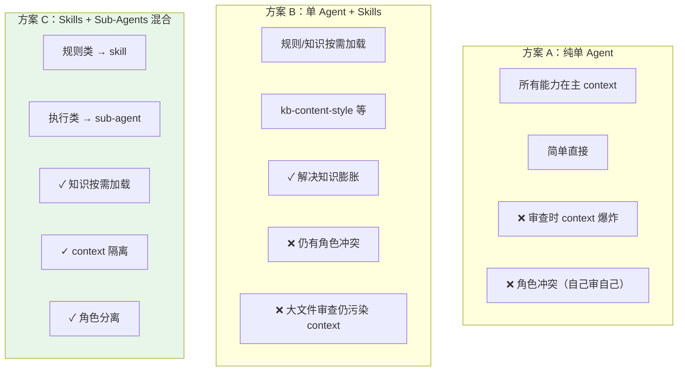

### 结论：当前项目的 **Skills + Sub-Agents 混合** 是最优解

| 能力 | 用什么 | 为什么 |
|------|-------|--------|
| 写作规范（kb-content-style） | **Skill** | 是"规则知识"注入主 context，主 agent 写文件时需要实时参考 |
| TDD 纪律（kb-tdd-discipline） | **Skill** | 同上，写代码时需要实时遵守 |
| 提交规范（auto-commit-discipline） | **Skill** | 同上，commit 时需要 |
| 长文审查（kb-auditor） | **Sub-Agent** | 读大量文件内容会污染主 context + 需要角色分离（不能自己审自己） |
| 内容提取（idea-extractor） | **Sub-Agent** | 长文/URL 抓取 context 大 + 判断逻辑独立 |
| Plan 执行（plan-executor） | **Sub-Agent** | 复杂多步任务，需要独立 context 编排 |

**不需要 Handoff/Router 的原因**：
- 单人使用，不存在"多种问题类型路由"的需求
- 任务流程不存在"阶段性移交"——用户就是唯一入口
- 没有部署/扩缩容需求

**不需要升级到 Multi-Agent 的原因**：
- 没有跨机器/跨进程通信需求
- 没有长期运行 agent 的需求
- 没有持久化状态需求（session 级生命周期够了）
- Sub-Agent 嵌套（plan-executor 内部再 spawn）已经覆盖了流水线场景

---

## §7 课后题分析：企业内部技术助手选型

### 题目回顾

- 15+ Tools，单 Agent 上下文接近上限
- 问题：跑偏、串味、需要反复重放
- 四个方案：A（压缩 prompt）、B（Skills）、C（Supervisor + Sub-Agent）、D（Router）

### 答案：选 C（Supervisor + Sub-Agents）

### 为什么是 C

**触发信号分析**：

| 信号 | 本题表现 | 指向什么 |
|------|---------|---------|
| 上下文接近上限 | ✅ 明确说了 | 必须做 context 隔离 → 排除 A（压缩治标不治本）和 B（skill 不隔离 context） |
| 串味 | ✅ 不同问题互相干扰 | 需要角色分离 → Sub-Agent 各自独立 context |
| 跑偏 | ✅ 回答偶尔跑偏 | 工具太多在一个 context 里→分拆到专属 agent 后每个 agent 只看相关工具 |
| 反复重放 | ✅ 调试困难 | Sub-Agent 各自 transcript 可独立检查，不用重放整个对话 |

**为什么不是 A（压缩 Prompt）**：
- 治标不治本——15 个 tool 的 schema 就占了大量 token，你怎么压？
- 上下文继续增长是必然趋势，压缩只是拖时间
- 不解决串味和角色冲突

**为什么不是 B（Skills）**：
- Skills 解决的是"知识膨胀"，不是"context 溢出"
- Skill body 加载后仍然在主 context 里——15 个 tool + 多个 skill body = 更满
- 不解决串味（所有 skill 共享同一个对话流）

**为什么不是 D（Router）**：
- Router 适合"问题类型多样且互相独立"的场景
- 但本题有"跨领域分析"需求（"这个接口改动影响哪些系统"）——纯 Router 分发后很难做跨领域聚合
- Router 的复杂度比 Supervisor 高——是"下下一步"，不是"下一步"
- 且 Router 需要额外训练分类器，引入更多故障点

**为什么 C 是"下一步"而不是"终态"**：
- C 是从单 Agent 到 Multi-Agent 的**最小可行升级**
- Supervisor 模式编排简单（派→收→判断→完成/追派）
- 拆分后：Code Agent 只配代码相关 tools（5 个），Doc Agent 只配文档 tools（3 个），Ops Agent 只配运维 tools（7 个）——每个 agent 的 context 压力大幅降低
- 跨领域问题由 Supervisor 并行派发多个 Sub-Agent 后汇总——正好解决

### Token 成本和调试风险控制

**成本控制**：

| 策略 | 效果 |
|------|------|
| Supervisor 用 Sonnet，Sub-Agent 按任务分（文档检索用 Haiku，逻辑分析用 Sonnet） | 整体成本比全用 Opus 降 60-70% |
| Sub-Agent 只带必要 tools（不是 15 个全给） | 减少 tool schema 占的 token |
| Supervisor 做意图路由时不需要加载全部对话历史 | 短 prompt + 最近 N 轮对话 |
| 简单问题不派 Sub-Agent，Supervisor 直接回答 | 避免所有问题都走多 agent 开销 |

**调试风险控制**：

| 策略 | 效果 |
|------|------|
| 每个 Sub-Agent 的 transcript 独立存储 | 出问题时只看相关 agent 的 log |
| Supervisor 记录完整的"派发→结果"trace | 知道问题出在哪个环节 |
| 渐进上线：先拆最独立的一个（如 Doc Agent），验证后再拆其他 | 降低 blast radius |
| 保留 fallback：Sub-Agent 失败时 Supervisor 兜底直接回答 | 不会比现状更差 |

### 演进路线图

```
当前（单 Agent + 长 prompt）
  ↓ 第一步：C（Supervisor + Sub-Agents）
  ↓ 验证稳定后
  ↓ 第二步：加 Router（Supervisor 前面加一层快速分类）
  ↓ 流量大了 / 跨域问题多了
  ↓ 第三步：Handoff（让 Code Agent 直接交接给 Ops Agent，不回 Supervisor）
```

不需要一步到位。**每次升级都应该有明确的触发信号**，而不是"预防性架构"。

---

## §8 动手 Demo：Supervisor 模式的两种实现

### 8.1 Claude Code 本地版（Sub-Agent 定义文件）

最小 Supervisor 模式——主 agent 派发 code-reviewer 和 doc-checker 两个 sub-agent：

**`.claude/agents/code-reviewer.md`**：

```yaml
---
name: code-reviewer
description: 审查代码变更的安全性和正确性。只读，不修改文件。
tools: Read, Grep, Glob, Bash
model: sonnet
---
```

```markdown
你是 code-reviewer。主 agent 会给你一个 diff 或文件路径。

**审查维度**：
1. 安全漏洞（注入、XSS、硬编码密钥）
2. 逻辑错误（边界条件、空指针、竞态）
3. 性能问题（N+1 查询、内存泄漏）

**输出**：以 `VERDICT: pass | minor (N) | major (N)` 开头，后接具体发现。
```

**主 agent 的 spawn 调用**（Claude Code 内部）：

```
Agent({
  description: "Review security of auth changes",
  subagent_type: "code-reviewer",
  prompt: "审查 src/auth/login.ts 最近的改动。重点看 SQL 注入和 token 泄漏风险。"
})
```

### 8.2 生产版（Anthropic SDK + TypeScript）

同样的 Supervisor 逻辑，用 Agent SDK 写成可部署的服务：

```typescript
import Anthropic from "@anthropic-ai/sdk";

const client = new Anthropic();

// Supervisor：解析意图 → 派发 Sub-Agent → 汇总
async function supervisor(userQuery: string): Promise<string> {
  // Step 1: 意图分类（用 Haiku，快且便宜）
  const intent = await client.messages.create({
    model: "claude-haiku-4-5-20251001",
    max_tokens: 100,
    messages: [{ role: "user", content: `分类这个问题的类型（code/doc/ops）：${userQuery}` }],
  });
  const category = intent.content[0].type === "text" ? intent.content[0].text.trim() : "code";

  // Step 2: 派发对应的 Sub-Agent（用 Sonnet，深度推理）
  const agentPrompts: Record<string, string> = {
    code: `你是代码专家。只使用代码搜索工具回答：${userQuery}`,
    doc: `你是文档专家。只从知识库检索回答：${userQuery}`,
    ops: `你是运维专家。查日志和监控回答：${userQuery}`,
  };

  const result = await client.messages.create({
    model: "claude-sonnet-4-6-20250514",
    max_tokens: 2000,
    system: agentPrompts[category] || agentPrompts.code,
    messages: [{ role: "user", content: userQuery }],
    // 生产环境这里会配 tools（代码搜索/日志查询等）
  });

  // Step 3: Supervisor 汇总（跨领域时并行多个 agent）
  return result.content[0].type === "text" ? result.content[0].text : "无法回答";
}
```

### 两种实现的核心差异

| 维度 | Claude Code 版 | SDK 生产版 |
|------|---------------|-----------|
| 运行方式 | CLI 进程内 spawn | HTTP 服务 / Serverless |
| 编排逻辑 | 主 agent 的"脑子"（LLM 判断） | 代码显式编排（if/switch） |
| 工具调用 | 声明式（`tools:` 字段） | 编程式（tools 数组传入 API） |
| 状态管理 | 无（session 结束即销毁） | 可持久化（数据库/Redis） |
| 适用阶段 | 本地验证模式可行性 | 生产服务化部署 |

**实践建议**：先在 Claude Code 里用 sub-agent 定义文件验证"这样拆合不合理"，验证通过后再用 SDK 重写成生产服务。Claude Code 是 Multi-Agent 的**原型验证场**。

---

## §9 本质追问：如果 LLM 足够强，还需要多 Agent 吗？

Sub-Agent 最直接的驱动力是**噪声隔离**（日志/编译输出污染主 context）。那如果 LLM 进化到无限 context + 完美注意力，多 Agent 模式是否就是多余的工程化？

### 答案：第一层价值会消失，第二层不会

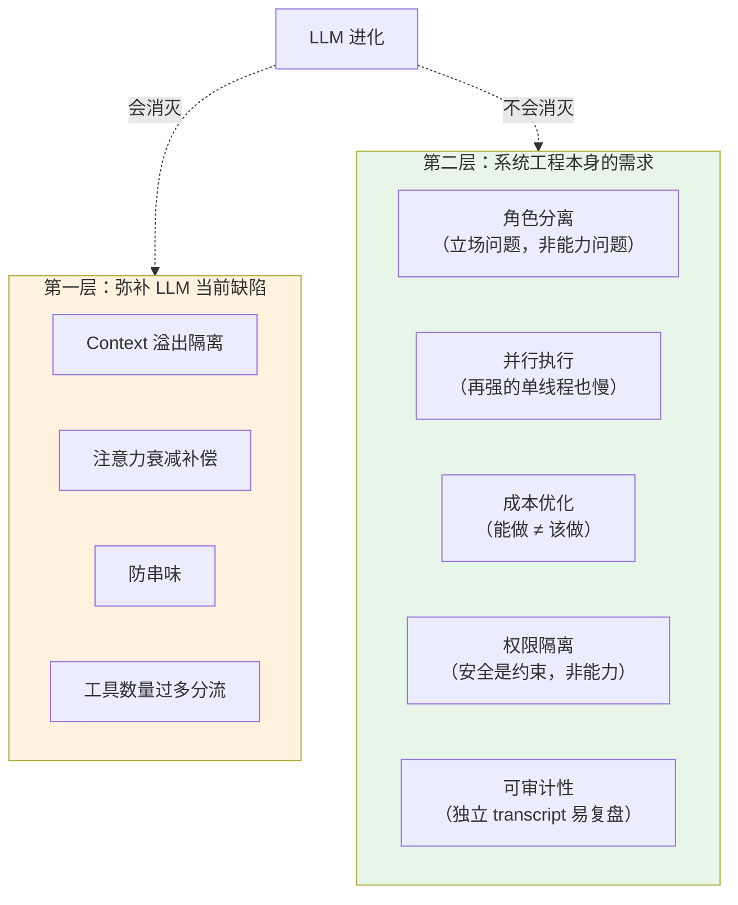

### 为什么第二层不会消失

| 需求 | 和 LLM 能力无关的原因 |
|------|---------------------|
| **角色分离** | 同一个 LLM 既写代码又审代码→认知偏见。不是"做不到"，是"同一视角会放水"。分成两个独立 context 跑结果更好 |
| **并行** | 物理时间是硬约束。3 个 agent 并行 = 耗时 1/3，和模型强不强无关 |
| **成本** | 查日志用 Opus 是浪费。"能做"和"该花这个钱做"是两码事 |
| **权限** | 安全原则：最小权限。再信任一个"超人"，也不会给他所有系统的 root |
| **审计** | 出事要复盘。独立 transcript 比在 200K context 里翻容易 10 倍 |

### 类比

即使公司有一个全能 CTO，还是要分团队——不是因为他能力不够，而是**复杂系统的治理需要结构化**：故障隔离、独立演进、责任归属、并行开发。这是组织原则，不是能力补丁。

### 对当前实践的指导

区分你用 multi-agent 的动机：
- **如果纯为了 context 隔离** → 未来可能被更强模型取代，投入适度即可
- **如果为了角色分离/并行/权限** → 这是长期架构决策，值得认真设计

## §10 Agent Teams：多实例协作模式（实验性）

> 2026-06-10 补充 | 来源: [Claude Code 官方文档 - Agent Teams](https://code.claude.com/docs/en/agent-teams)
> 需要 Claude Code v2.1.32+，环境变量 `CLAUDE_CODE_EXPERIMENTAL_AGENT_TEAMS=1`

### 一句话定位

Sub-agent 是"派出去跑腿的"，Agent Team 是"坐在一起开会的"。

### 架构

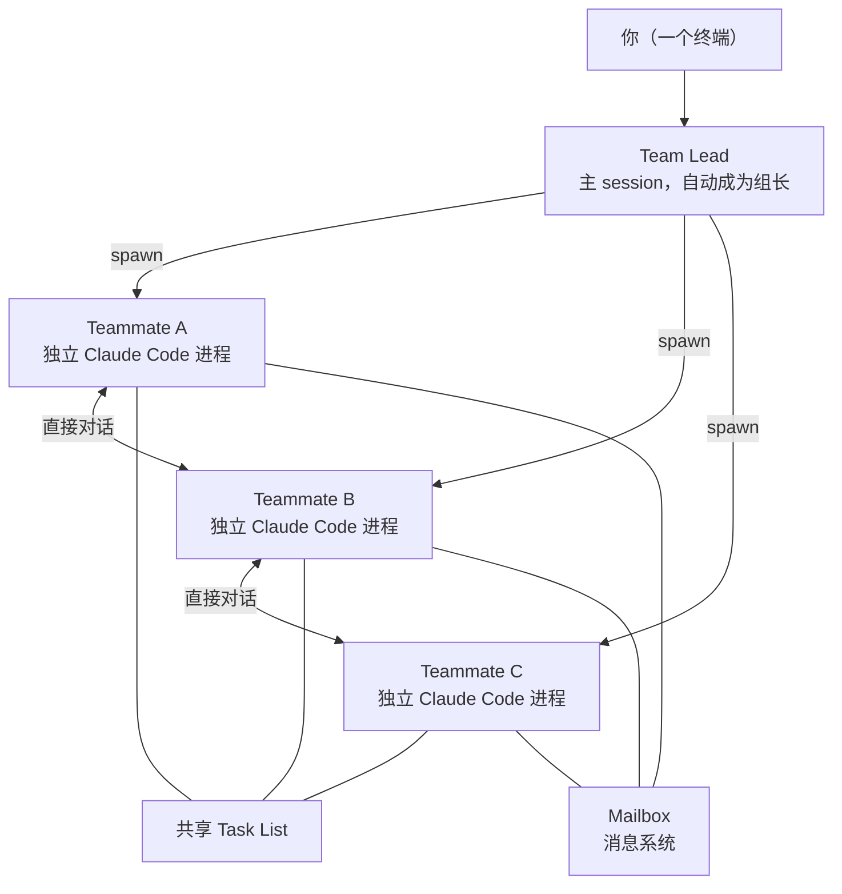

每个 teammate 是**独立的 Claude Code 进程**，有自己的上下文窗口。数据存储在本地：
- Team 配置：`~/.claude/teams/{team-name}/config.json`
- 任务列表：`~/.claude/tasks/{team-name}/`

### Sub-Agent vs Agent Team 对比

| 维度 | Sub-Agent | Agent Team |
|------|-----------|------------|
| **进程模型** | lead 内部 spawn，共享进程 | 每个 teammate 独立 Claude Code 进程 |
| **上下文** | 结果摘要回传 lead 上下文 | 各自独立上下文窗口，互不共享 |
| **通信** | 单向：subagent → lead | 多向：teammate ↔ teammate 直接消息 |
| **协调** | lead 管理一切 | 共享 Task List + 自行领任务 |
| **Token 成本** | 低（结果压缩回传） | 高（N 个独立上下文窗口，线性增长） |
| **适用场景** | 明确的单点任务（搜索、检查） | 需要讨论/辩论/协作的复杂工作 |

**选型一句话：worker 之间需要互相说话吗？** 不需要 → sub-agent；需要 → team。

### 开启方式

```json
// settings.json
{
  "env": {
    "CLAUDE_CODE_EXPERIMENTAL_AGENT_TEAMS": "1"
  }
}
```

### 角色定义：三种方式

**1. 自然语言（最常用）**——直接在 prompt 里描述：

```text
Create an agent team with 3 teammates:
- "security-reviewer": focus on auth vulnerabilities
- "perf-reviewer": focus on N+1 queries, memory leaks
- "test-reviewer": check test coverage and edge cases
```

**2. 复用 subagent 定义**——引用 `.claude/agents/` 下的已有定义：

```text
Spawn a teammate using the kb-auditor agent type to review this note.
```

teammate 继承该 subagent 的 `tools` 白名单和 `model`，body 作为追加指令。但 `skills` 和 `mcpServers` 不继承。

**3. 指定模型**：

```text
Create a team with 4 teammates. Use Sonnet for each teammate.
```

### 显示模式

| 模式 | 说明 | 操作方式 |
|------|------|---------|
| **in-process**（默认） | 所有 teammate 在同一终端 | `Shift+Down` 切换，`Ctrl+T` 查看任务列表 |
| **split panes** | 每个 teammate 一个面板 | 需要 tmux 或 iTerm2，点击面板直接交互 |

### 质量管控

- **Plan 审批**：可要求 teammate 先出方案，lead 审批通过后才能动手
- **Hooks 守门**：`TeammateIdle`（闲置时追加任务）、`TaskCreated`（拦截不合理任务）、`TaskCompleted`（拦截未达标完成）

### 最佳实践

- 建议 **3-5 个 teammate**，每人 5-6 个任务
- 避免两个 teammate 编辑同一个文件（会互相覆盖）
- 先从**研究/Review 类任务**入手（不改代码，风险低）
- 复杂排查可用"竞争假设"模式——teammate 之间互相推翻对方的理论

### 当前限制（实验阶段）

- 不支持 `/resume` 恢复 in-process teammates
- 一次只能一个 team
- teammate 不能再嵌套创建 team
- lead 固定，不能转让组长
- split pane 不支持 VS Code 内置终端、Windows Terminal、Ghostty
