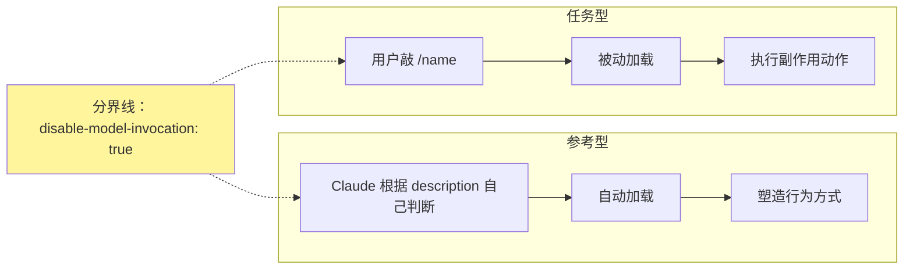
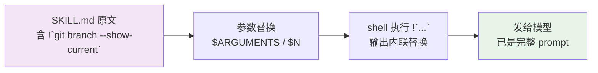
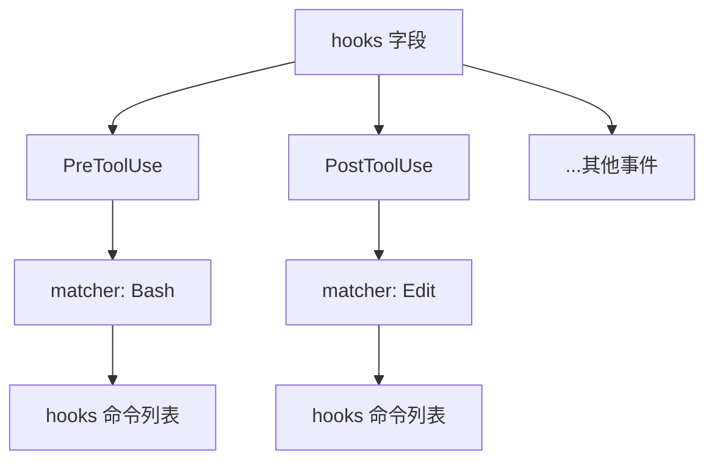
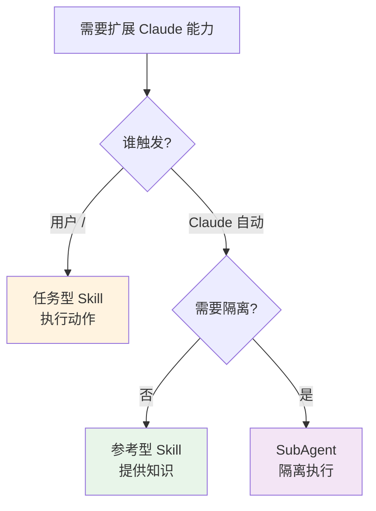

# 任务型 Skills（斜杠命令）实战

> 最后整理: 2026-06-30 | 来源: 黄佳《Claude Code 工程化实战》课程 §5（概念提炼）

> 关联: [Skills 渐进式披露架构](<./Skills 渐进式披露架构.md>) — 任务型是同一套机制的另一面
> 关联: [Hooks 事件全景与拦截机制](<./Hooks 事件全景与拦截机制.md>) — Skill 内 Hooks 的宿主
> 关联: [子智能体（subagents）机制与实战](<./子智能体（subagents）机制与实战.md>) — 与 context: fork 的组合

---

## §1 一句话定位

**任务型 Skill = 给 Claude 的"快捷动作按钮"**。用户 `/name` 触发后执行有副作用的动作（提交代码、部署、生成 PR 等），绝不主动触发。

和参考型的核心差异，用一个字段划清：



> **释题"令行禁止"**：这个词对工程师有天然亲近感，在 Claude Code 里可以直接翻译为 `disable-model-invocation: true`——没有用户触发，Claude 绝不主动执行。

---

## §2 Skills 与 Commands 的历史演进

早期版本里，斜杠命令（`.claude/commands/*.md`）和 Skills（`.claude/skills/<name>/SKILL.md`）是两个独立组件。**新版 Claude Code 中 Commands 已合并为 Skills 的子集**，两个目录都会创建 `/name` 命令。

| 维度 | `.claude/commands/` | `.claude/skills/<name>/` |
|------|--------------------|--------------------------|
| 历史 | 旧组件 | 新组件 |
| 能力 | 单文件，简单命令 | 支持辅助文件（references/scripts/assets） |
| frontmatter | 有限 | 完整字段（含 hooks、context、model） |
| 同名冲突 | 被覆盖 | **Skill 优先** |

**实践建议**：已有 commands 不必迁移，新建命令统一放 skills 目录。

---

## §3 任务型 Skill 的核心机制

### 与参考型的对比

| 维度 | 参考型 | 任务型 |
|------|--------|--------|
| 触发 | Claude 根据 description 自动加载 | 用户 `/name` 手动触发 |
| 关键字段 | `description` 写 Use when... | `disable-model-invocation: true` |
| 用途 | 提供知识 / 塑造行为 | 执行动作 / 产生副作用 |
| 例子 | api-conventions、kb-content-style | commit、deploy、pr-create |
| Token 留存 | 主 context 剩余时长 | 主 context 剩余时长（无差异） |
| 是否允许自动触发 | 是 | **否** |

### 作用域

- **项目级**：`.claude/skills/`（随 git 分发，团队共享）
- **用户级**：`~/.claude/skills/`（跨项目个人习惯）

**团队标准化**的最佳实践：任务型放项目级（流程固化），个人习惯放用户级（跨项目复用）。

---

## §4 `$ARGUMENTS` 参数传递

### 单参数

`/fix-issue 123` → `$ARGUMENTS = "123"`，整体注入 body 中所有 `$ARGUMENTS` 占位符。

### 多参数（位置参数）

`/pr-create "Add auth" "JWT"` → `$1 = "Add auth"`，`$2 = "JWT"`，`$0` 是命令名本身。

### 边界处理

如果 body 里**根本没定义 `$ARGUMENTS`**，但用户调用时传了参，Claude Code 会自动在内容末尾追加 `ARGUMENTS: <用户输入>`，参数不会丢失。

### 其他注入变量

- `${CLAUDE_SESSION_ID}`：当前会话 ID，用于把外部日志关联回对话。
- `argument-hint`：frontmatter 字段，给使用者看的参数提示（如 `[commit message]`），不是强制约束。

### 实战含义

`argument-hint` 是文档性的，Claude 不会基于它做参数校验；真正的参数解析由占位符 `$ARGUMENTS` / `$N` 驱动。

---

## §5 `!`command`` 动态上下文注入

### 问题场景

用户输入 `/pr-create "Add auth"` 时，模型收到的只是 prompt 文本，**不知道**当前分支、待合并 commit、改了哪些文件。不预注入的话，模型会多花 3-5 次工具调用去收集这些信息。

### 机制

`!`command`` 是 Skill 文件的**预处理器**：



**关键顺序**：先替换 `$ARGUMENTS`，再执行 `!`command``。这意味着用户输入会进入 shell 命令——**必须在 `allowed-tools` 中严格限制可执行范围**，否则有注入风险。

### 工程价值

1. **省 token**：减少 3-5 次探索性工具调用
2. **一致性**：每次执行看到的上下文格式固定，模型输出更稳定
3. **确定性**：不依赖模型的"会不会想到去查分支"的判断

### 什么时候不用 `!`command``

如果信息是**高度动态、分支依赖**的（比如"根据变更类型决定调用哪个 linter"），让 Claude 自己探索更合适——预注入只能处理"已知要查什么"的场景。

---

## §6 Skill 内 Hooks

### 与全局 Hooks 的对比

| 维度 | 全局 Hooks（settings.json） | Skill 内 Hooks（frontmatter） |
|------|---------------------------|------------------------------|
| 生效范围 | 整个 session | **仅该 Skill 执行期间** |
| 分发方式 | 不随 git（settings.local.json） | 随 Skill 一起分发 |
| 适用场景 | 团队统一约束（lint、审计） | Skill 专属安全网（日志、格式化） |
| 配置位置 | `.claude/settings.*.json` | SKILL.md frontmatter 的 `hooks:` 字段 |

### 三层树形结构

Skill 内 Hooks 不是一行一行平铺的，而是按 **"事件 → 匹配规则 → 命令列表"** 三层嵌套：



这种结构是为了支持**多事件 × 多工具 × 多动作**的组合扩展。

### 常用模式

- **审计日志**：`PreToolUse` 在 Bash 前记录将要执行的命令
- **代码格式化**：`PostToolUse` 在 Edit 后自动跑 prettier
- **结果校验**：`PostToolUse` 在 Write 后跑 lint 验证产物

---

## §7 七步设计清单

设计一个任务型 Skill，按顺序回答七个问题：

| # | 问题 | 对应字段 |
|---|------|---------|
| 1 | 动作是什么？ | `name` / 目录名 |
| 2 | 谁能触发？ | `disable-model-invocation: true` |
| 3 | 需要什么权限？ | `allowed-tools`（精确到命令级） |
| 4 | 启动时需要什么上下文？ | `!`command`` 预注入 |
| 5 | 执行中需要什么安全网？ | `hooks` |
| 6 | 输出量大不大？ | 大则 `context: fork` |
| 7 | 用什么模型？ | `model`（简单用 haiku，复杂用 sonnet） |

### 四大设计原则

**单一职责**：一个命令做一件事。`/commit` `/push` `/review` 好过 `/git-all-in-one`。

**清晰命名**：从命令名就能知道它做什么。`/test:unit` `/deploy:staging` 好过 `/do-stuff`。

**有意义的参数提示**：`argument-hint: [commit message]` 好过 `[args]`。

**权限最小化**：`allowed-tools` 精确到命令级。

| ✅ 精确授权 | ❌ 过于宽泛 |
|-----------|------------|
| `Bash(git status:*)`、`Bash(git add:*)`、`Bash(git commit:*)` | `Bash(*)` |
| `Bash(npm test:*)` | `Bash(npm:*)` |

### 错误处理

body 中必须显式处理错误路径：先检查前置条件（是否在 git 仓库、有无未提交变更），不满足时告知用户并停止，而不是直接往下跑。

---

## §8 命名空间与作用域组织

### 命名空间

目录名成为前缀，用冒号 `:` 分隔：

```text
.claude/commands/
├── commit.md          → /commit
├── review.md          → /review
└── git/
    ├── status.md      → /git:status
    ├── log.md         → /git:log
    └── sync.md        → /git:sync
```

好处：相关命令归类，避免命名冲突，输入 `/git:` 会提示所有 git 相关命令。

### 作用域策略

| 类型 | 位置 | 用途 |
|------|------|------|
| 团队标准流程 | 项目级 `.claude/skills/` | 随 git 分发，团队共享 |
| 个人习惯命令 | 用户级 `~/.claude/skills/` | 跨项目复用 |
| 项目专属命令 | 项目级（git 追踪） | 特定项目的部署/构建流程 |

---

## §9 三种能力扩展机制的共存

任务型 Skill、参考型 Skill、SubAgent 不是互斥的，而是互补的三件套：



### 三者的定位

| 机制 | 触发 | 上下文 | 典型用途 |
|------|------|--------|---------|
| 任务型 Skill | 用户 `/` | 主对话 | 提交、部署、PR |
| 参考型 Skill | Claude 自动 | 主对话 | 规范、约定、风格指南 |
| SubAgent | Claude 派发 | 隔离 context | 探索性任务、并行工作 |

### 组合使用

任务型 Skill 可以通过 `context: fork` 在子代理中隔离执行——大量输出不会污染主对话上下文。例如 `/review` 这种会产生大段反馈的命令，特别适合 fork 出去跑。

**成熟团队工具箱**的典型组织：参考型提供"怎么写代码"的规范，任务型提供"跑什么动作"的快捷方式，SubAgent 处理"需要独立跑一阵"的长任务。

---

## §10 方法论沉淀：命令的价值在于积累

任务型 Skill 的本质是**把重复的对话模式固化为可复用的快捷方式**。团队标准化流程就是把最佳实践沉淀为命令——这是 Skills 体系最具"复利效应"的部分。

> 一个工程师每天用 5 次 `/commit`，一年省 1000 次手动输入。团队 5 人就是 5000 次。命令的价值不在单次省时，而在**积累**。
