# 子代理专题总结与综合案例

> 最后整理: 2026-06-23 | 来源: 黄佳《Claude Code 工程化实战》加餐"子代理专题总结 & 练习"

> 关联: [子智能体（subagents）机制与实战](./子智能体（subagents）机制与实战.md) — Sub-Agents 的底层机制（spawn、context 隔离、tools 白名单）
> 关联: [并行探索与流水线编排](./并行探索与流水线编排.md) — 并行/流水线两种编排拓扑 + 交接契约 + 混合模式
> 关联: [Agent Teams 多会话协作架构](./Agent%20Teams%20多会话协作架构.md) — 从星形到网状拓扑的跃迁、四大协作设计模式
> 关联: [从 Sub-Agent 到 Multi-Agent 的工程指南](./从%20Sub-Agent%20到%20Multi-Agent%20的工程指南.md) — 四种多智能体模式（Skills/Sub-Agents/Handoffs/Router）的宏观选型

---

## §1 两层能力模型：结构化分工 vs 认知协作

六讲子代理的知识体系可以归纳为**两层能力**，它们解决的是完全不同层面的问题：

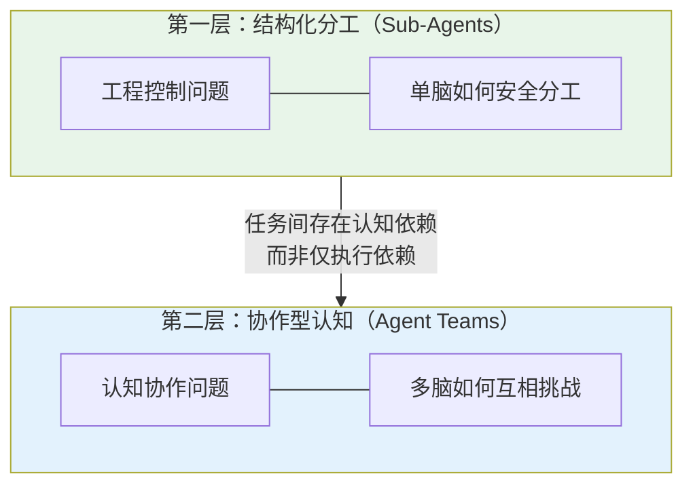

### 1.1 第一层：Sub-Agents — 单脑安全分工

Sub-Agents 解决的是**工程控制问题**：主对话的 context window 是有限的、昂贵的、需要保持清洁的。当一个任务需要大量搜索、日志分析、测试执行时，把这些"脏活"隔离到独立的 context window 里，主对话只接收结论。

核心关键词：**隔离、权限、信噪比、可审计**。

### 1.2 第二层：Agent Teams — 多脑互相挑战

当任务之间不只是**执行依赖**，而是**认知依赖**时，Sub-Agents 就不够了。

认知依赖的四种典型场景：

| 场景 | 为什么 Sub-Agents 不够 |
|------|----------------------|
| 多个假设可能互相关联 | 各子代理独立汇报，主对话可能看不出关联 |
| 不同视角可能互相推翻 | 星形拓扑下没有"辩论"机制 |
| 架构决策需要立场冲突 | 单一 agent 容易锚定偏见、过早收敛 |
| 根因链需要跨模块拼接 | 跨模块的因果关系需要交叉验证 |

Agent Teams 的价值：Teammates 之间可以**直接发消息、互相质疑、主动关联**——系统具备了"交叉验证"的认知能力。

---

## §2 四种子代理使用模式

在 Sub-Agents 层面，课程归纳了四种使用模式，从轻到重形成一个**渐进式复杂度阶梯**：

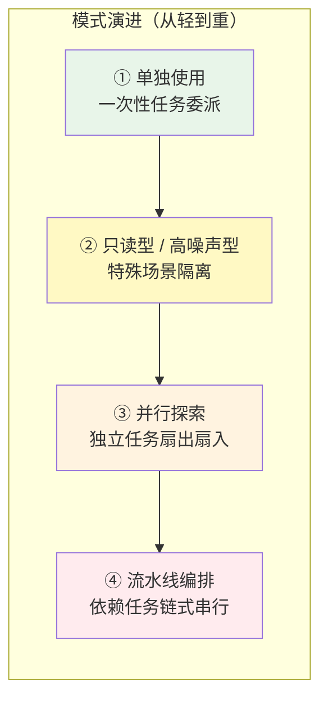

### 2.1 模式一：单独使用

最简单的形式——把一次性任务委派给一个子代理，拿到结论后继续。

### 2.2 模式二：只读型 + 高噪声型

两种特殊场景的隔离策略：

| 类型 | 典型场景 | 关键配置 |
|------|---------|---------|
| **只读型** | 代码审查、架构分析 | `tools` 白名单仅含 Read/Grep/Glob |
| **高噪声型** | 测试执行、日志分析 | 大量输出留在子代理 context，主对话只看摘要 |

### 2.3 模式三：并行探索

多个独立子任务同时扇出，各自执行后聚合结论到主对话。

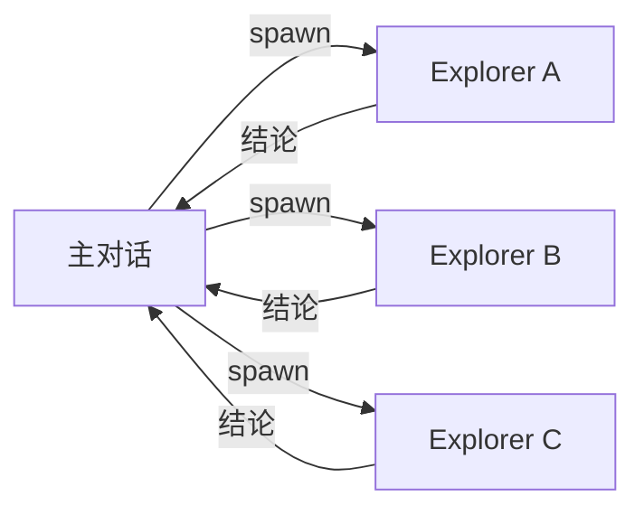

**前提**：各子任务之间无信息依赖。核心价值是**速度 + context 清洁**。

### 2.4 模式四：流水线编排

有执行依赖的任务链式串行，上游产出作为下游输入。

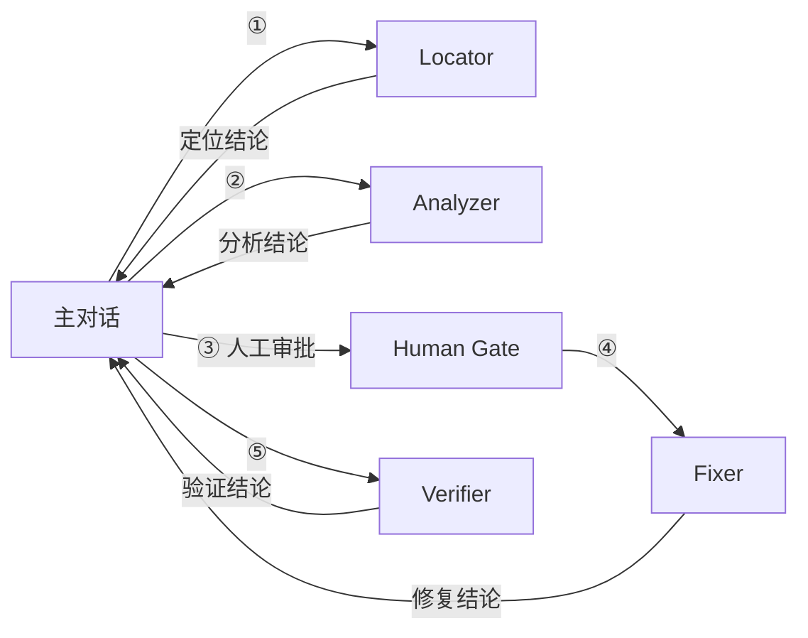

**核心价值**：职责清晰 + 权限递进 + 可审计。关键阶段可设**人工审批**节点。

---

## §3 综合案例：电商大促支付超时排查

这个案例把四种子代理模式和 Agent Teams 串成一个完整的五阶段编排方案。

### 3.1 五阶段全景

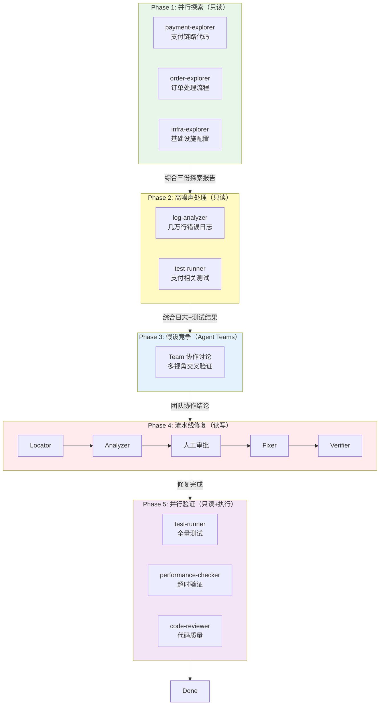

### 3.2 各阶段权限设计

| 阶段 | 模式 | 权限 | 理由 |
|------|------|------|------|
| Phase 1 | 并行探索 | **只读** | 只是了解现状，不需要改任何代码 |
| Phase 2 | 高噪声处理 | **只读** | 分析日志和跑测试，不改源码 |
| Phase 3 | Agent Teams | **只读** | 讨论和决策阶段，尚未确定修复方案 |
| Phase 4 | 流水线修复 | **读写**（仅 Fixer） | 只有 Fixer 有写权限，且需人工审批 |
| Phase 5 | 并行验证 | **只读 + 执行** | 验证修复效果，跑测试，不改代码 |

**核心原则**：整个五阶段中，**只有 Phase 4 的 Fixer 有写权限**。这就是最小权限原则在复杂场景中的体现——绝大多数子代理都是只读的，写权限只在"确定要改"的那个精确环节开放。

### 3.3 Phase 3 为什么需要 Agent Teams

如果 Phase 3 只用 Sub-Agents（星形拓扑），风险在于：

- 每个子代理只向主对话汇报，**无法互相质疑**
- infra 的连接池问题和 N+1 查询之间可能存在**级联关系**，但星形拓扑下这个关联可能被遗漏
- 主对话可能过早收敛到一个看似合理但实际不完整的假设

Agent Teams 让多个 Teammates 可以**直接通信、互相挑战假设、拼接跨模块的因果链**，从而避免锚定偏见和单视角误判。

---

## §4 贯穿始终的工程方法论

六讲课程不是"学会配置子代理"，而是培养一种**工程判断力**——面对任何场景，能判断是否需要子代理、需要什么样的子代理、如何组合它们。

### 4.1 三讲方法论汇总

| 讲次 | 方法论 | 核心框架 |
|------|--------|---------|
| **第 5 讲** | 痛点驱动设计 | 痛点 → 缺什么 → 选机制 → 画边界 → 验证 |
| **第 6 讲** | 信噪比优化 | 信噪比框架 + 输出格式设计 + 模型选择验证 |
| **第 7 讲** | 编排设计 | 交接契约 + 编排者决策 + 混合模式选型 |

### 4.2 方法论的共同主线

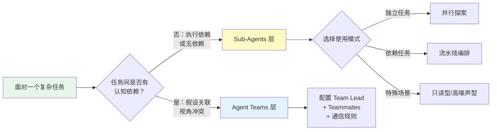

**判断起点不是"我该用哪种子代理"，而是"这个任务的依赖结构是什么"。**

---

## §5 假期思考题

### 5.1 设计题：为自己的项目设计子代理编排方案

参考电商案例，为自己项目中的一个复杂问题设计完整的子代理编排方案。要求：

- 明确用了哪些模式（并行/流水线/只读型/高噪声型/Agent Teams）
- 标注每个子代理的权限（只读 vs 读写）
- 标注人工介入点

### 5.2 反思题：不用子代理会怎样

回到电商大促支付超时案例，假设**只在主对话中让 AI 一步步排查和修复**：

| 阶段 | 反思问题 |
|------|---------|
| Phase 1（探索） | 哪些信息最容易被遗漏或相互覆盖？为什么？ |
| Phase 2（日志/测试） | 高噪声输出对后续判断有哪些具体干扰？ |
| Phase 4（修复） | 没有权限隔离时，AI"好心修改"可能带来哪些工程风险？ |
| 全局 | 从审计、回滚、团队协作的角度看，"单对话全包"有哪些不可控点？ |

**核心追问**：子代理真正解决的不是"能力问题"（AI 能不能做），而是哪一类"工程风险"？

> 答案方向：子代理解决的是**可控性风险**——context 污染导致的信息遗漏、权限不受控导致的意外修改、单视角导致的锚定偏见、无法审计导致的不可回滚。这些都不是 AI"做不到"，而是 AI"做了但没人知道它做了什么、为什么做"。

---

## §6 知识图谱：六讲内容的完整关联

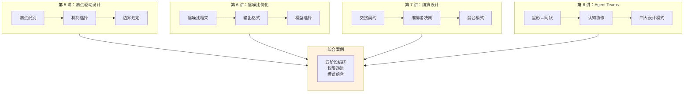

## §7 反思练习：不用子代理会怎样（2026-06-23）

> 课程假期作业第二题的完整作答。通过反证法揭示子代理真正解决的工程风险类型。

### 7.1 Phase 1（问题探索）：单对话的遗漏与覆盖

如果只在主对话中一步步探索支付链路、订单流程、基础设施配置，信息会按**线性顺序**涌入同一个 context window。核心问题有三个：

**锚定效应导致的选择性关注**：如果 AI 先看支付链路，发现了一个慢 SQL，它的注意力就会**被这个发现锚定**。后续看订单流程和基础设施时，会倾向于寻找"支持慢 SQL 是根因"的证据，而不是挑战这个假设。这是认知心理学中的确认偏误——在单对话中没有机制来强制"忘记"先前结论。

**跨维度关联的丢失**：支付链路报超时，可能是因为连接池满了；连接池满了可能是因为订单服务的某个批量查询占用了太多连接；而那个批量查询是上周新上的功能。这种**跨三个模块的因果链**需要同时 hold 住三个维度的信息才能拼接。单对话中，看到第三个维度时，第一个维度的细节可能已经被 context compaction 压缩或丢弃。

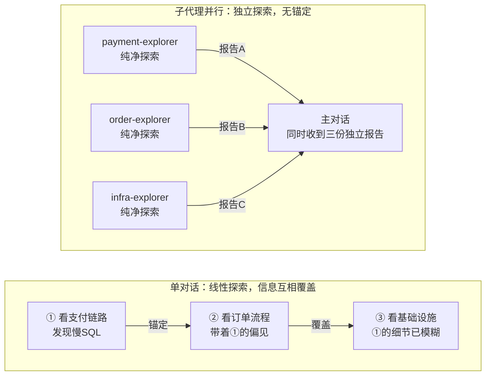

**信息覆盖的具体表现**：

| 容易遗漏的信息 | 原因 |
|--------------|------|
| 非主链路的旁路配置（如 MQ 消费者的超时设置） | AI 聚焦在主链路上，旁路被视为"不相关" |
| 最近才变更的配置（如连接池参数被运维调过） | 没有独立探索者专门查变更记录 |
| 跨团队的依赖（如支付网关的限流策略变更） | 单对话中缺乏"外部依赖"这个视角 |

### 7.2 Phase 2（日志/测试分析）：高噪声的具体干扰

大促期间的错误日志可能有**几万行**。如果这些全部灌入主对话的 context window：

**Token 挤出效应**：几万行日志可能消耗数万 tokens，直接挤占 context window 的空间。Phase 1 的探索结论、代码结构理解、配置细节都会被 context compaction 压缩甚至丢弃。**AI 记住了日志中的错误模式，但忘了代码长什么样。**

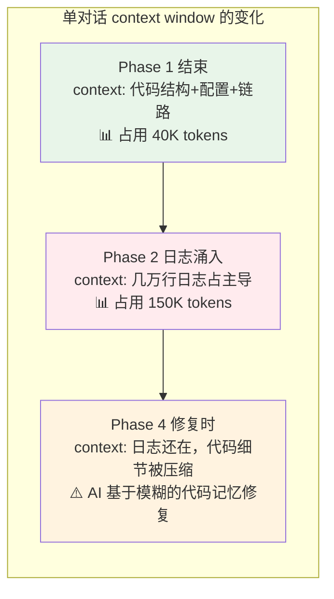

**虚假模式匹配**：几万行日志中一定有看起来"可疑"的错误堆栈。AI 会对第一个高频错误模式产生**虚假相关性判断**——"这个 NullPointerException 出现了几千次，一定是根因"。但实际上它可能是一个已知的、被 catch 住的无害异常，真正的问题藏在一个出现频率很低的超时日志里。

**信号被噪声淹没的具体场景**：

| 信号（真正有用） | 被什么噪声淹没 | 后果 |
|---------------|-------------|------|
| 一条 `ConnectionPool exhausted` 日志 | 几千条正常的 INFO/WARN 日志 | 根因被忽视，去追无关的 NPE |
| 某个测试用例的间歇性失败 | 几十个因环境不稳定导致的 flaky test 报错 | 真正的回归被当成"环境问题"跳过 |
| 错误日志中的时间规律（整点突发） | 连续的错误堆栈流 | 错过"定时任务触发"这个关键线索 |

**子代理的解法**：log-analyzer 子代理在自己的 context window 里消化几万行日志，**只输出结构化的结论**（按频率排序的错误类型表 + 时间分布 + 异常模式摘要）。主对话看到的是一张表，不是几万行文本。

### 7.3 Phase 4（修复阶段）：AI"好心修改"的工程风险

没有权限隔离时，AI 拥有完整的写权限。它的"好心"会带来以下风险：

**范围蔓延（Scope Creep）**：AI 在修支付超时的时候，"顺便"发现了一个代码风格问题，顺手重构了。或者发现一个日志级别不对，改了一下。这些修改本身可能没有错，但**扩大了变更范围**，让 code review 和回滚都变得更复杂。

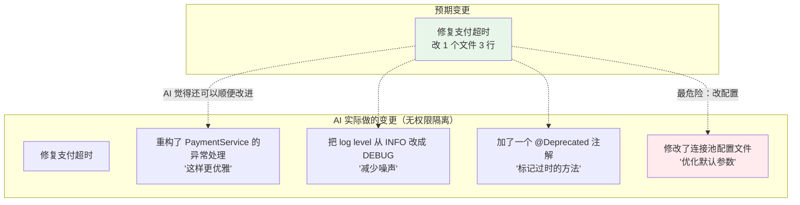

**具体风险清单**：

| 风险类型 | 具体表现 | 工程后果 |
|---------|---------|---------|
| **连带修改引入新 bug** | AI 重构异常处理时，漏掉了一个 catch 分支 | 支付超时修好了，但引入了一个新的空指针 |
| **配置文件的"优化"** | AI 修改了连接池最大连接数、超时阈值等 | 这些配置可能影响其他服务，且变更不在代码 review 的预期范围内 |
| **测试代码的"改进"** | AI 为了让测试通过，调整了断言条件 | 测试通过了，但测试的保护能力被削弱 |
| **跨服务修改** | AI 发现上游调用方也有问题，一并修改 | 变更跨越了服务边界，影响其他团队的代码 |

**流水线模式如何防御**：

- Locator 只负责定位，不碰代码
- Analyzer 只负责分析根因，不碰代码
- 人工审批节点：人在看到分析结论后决定是否修复、修复范围是什么
- Fixer 只执行**审批通过的修复方案**，不"顺便改进"
- Verifier 验证修复是否符合预期

### 7.4 "单对话全包"的不可控点

从审计、回滚、团队协作三个角度分析：

**审计角度——推理链不可追溯**：

单对话的 transcript 是一个连续的、不断被 compaction 压缩的文本流。当事故发生后想复盘"AI 当时为什么做了这个决定"，你会发现：

- 早期探索的推理过程已经被压缩成摘要，关键细节丢失
- AI 在 Phase 2 看到了哪些日志、为什么得出那个结论——原始日志已经不在 context 中
- 各个阶段的决策之间缺乏**显式的交接契约**，只有隐含在对话流中的隐式推理

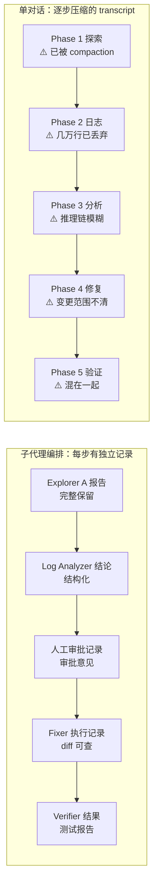

**回滚角度——变更边界模糊**：

子代理编排中，每个阶段有清晰的边界：Phase 1-3 只读，Phase 4 有明确的 diff，Phase 5 只验证。回滚时你知道"只需要 revert Phase 4 的那个 commit"。

单对话中，AI 可能在 Phase 4 修复时顺手改了 5 个文件，其中 3 个是"顺便优化"。回滚时你要么全部 revert（丢失有效修复），要么手动挑选（容易出错）。

**团队协作角度——无法分工和复用**：

| 维度 | 子代理编排 | 单对话全包 |
|------|----------|----------|
| **分工** | 不同人负责不同阶段的编排配置 | 只能一个人从头盯到尾 |
| **复用** | code-reviewer 子代理可以在其他项目复用 | 排查经验锁死在 transcript 里 |
| **并行** | 三个人各跑一个 explorer | 只能串行地在同一个对话里看 |
| **交接** | 交接契约是显式的结构化数据 | 交接靠"继续读对话历史" |

### 7.5 终极总结

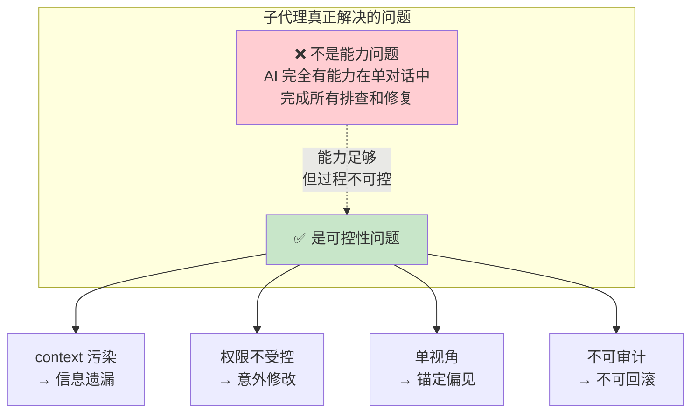

**一句话总结**：子代理真正解决的不是"能力问题"（AI 能不能做），而是**"可控性风险"**——context 污染导致的信息遗漏、权限不受控导致的意外修改、单视角导致的锚定偏见、推理链不可审计导致的事后无法回滚。AI 在单对话中**能做到**，但**做得不透明、不可控、不可审计**。

---

## §8 设计题指引：如何找到自己的复杂场景（2026-06-23）

> 课程假期作业第一题的解题思路。

### 8.1 什么样的任务适合做编排设计

不是所有任务都值得用子代理。适合编排设计的任务有三个特征：

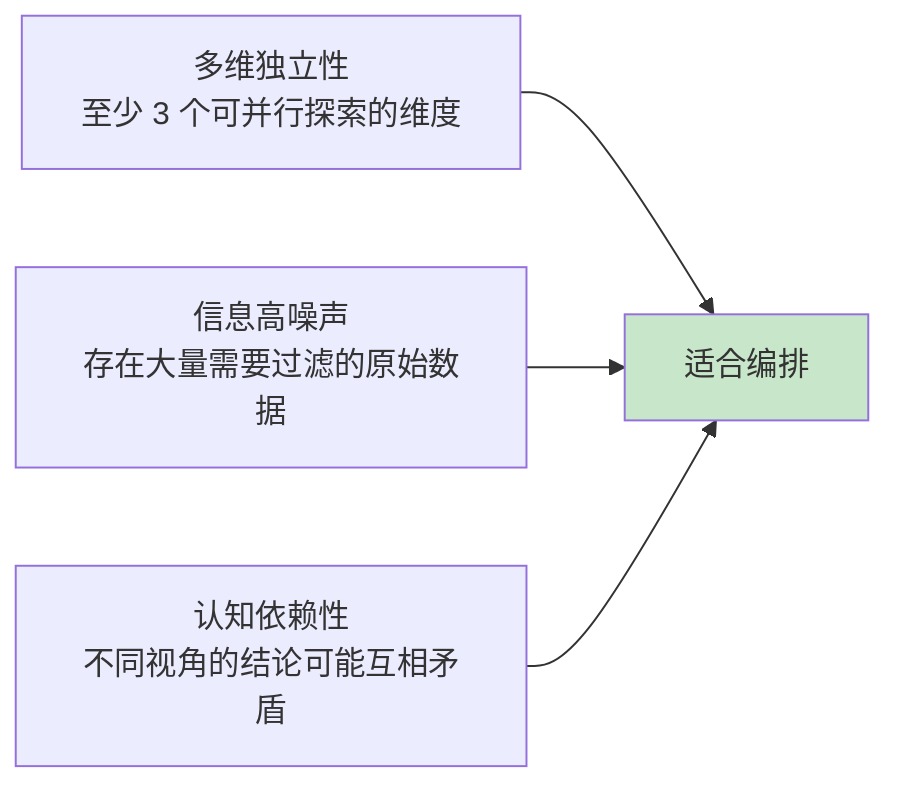

### 8.2 Java 后端开发的常见复杂场景

| 场景 | 并行维度 | 噪声源 | 认知冲突点 | 适合作业 |
|------|---------|--------|----------|---------|
| **线上 OOM 排查** | heap dump、GC 日志、代码变更、调用链路 | GC 日志几万行 | 内存泄漏 vs 突发流量 vs 配置不当 | ⭐⭐⭐ |
| **跨服务链路超时治理** | 网关、RPC、DB、MQ 各层配置 | 链路追踪数据量大 | 单点慢 vs 级联放大 vs 配置不一致 | ⭐⭐⭐ |
| **核心表分库分表迁移** | 数据量评估、分片策略、双写方案、回滚方案 | 数据量统计 | 分片键选择影响业务查询模式 | ⭐⭐ |
| **生产环境死锁排查** | 锁竞争分析、事务隔离级别、SQL 执行计划、并发模式 | 慢查询日志 | 业务逻辑顺序 vs DB 锁顺序 | ⭐⭐⭐ |
| **大促容量评估与压测** | 各服务容量、DB 瓶颈、缓存命中率、限流配置 | 压测结果数据量大 | 各服务瓶颈互相影响 | ⭐⭐ |

### 8.3 作答模板

```
## 场景：[你的具体场景]

### Phase 1: 并行探索（只读）
├── explorer-A: [维度A]，权限: Read/Grep/Glob
├── explorer-B: [维度B]，权限: Read/Grep/Glob
└── explorer-C: [维度C]，权限: Read/Grep/Glob

### Phase 2: 高噪声处理（只读）
├── log-analyzer: [噪声源]，权限: Read/Bash(只读命令)
└── test-runner: [相关测试]，权限: Bash(只执行测试)

### Phase 3: 假设竞争（Agent Teams，如果需要）
└── 团队讨论: [认知冲突点]，权限: 只读

### Phase 4: 流水线修复（读写）
└── Locator → Analyzer → [人工审批] → Fixer → Verifier
    权限: 仅 Fixer 有写权限

### Phase 5: 并行验证（只读+执行）
├── test-runner: 全量测试
├── performance-checker: 性能验证
└── code-reviewer: 代码审查
```

---

**一句话总结**：子代理系统的核心能力不是"让 AI 做更多事"，而是**让 AI 做事的过程对人类可见、可控、可审计**。
