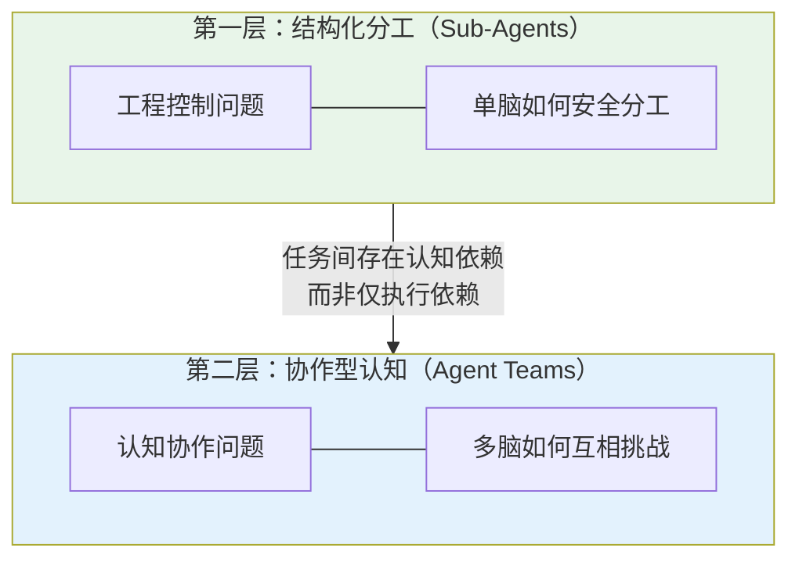
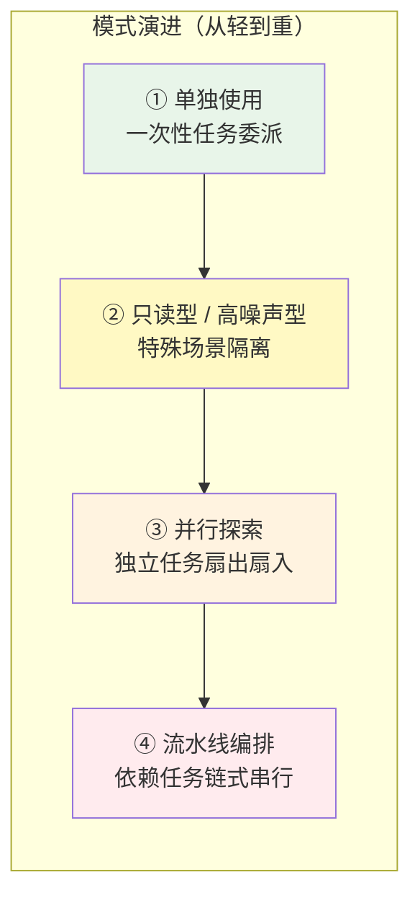
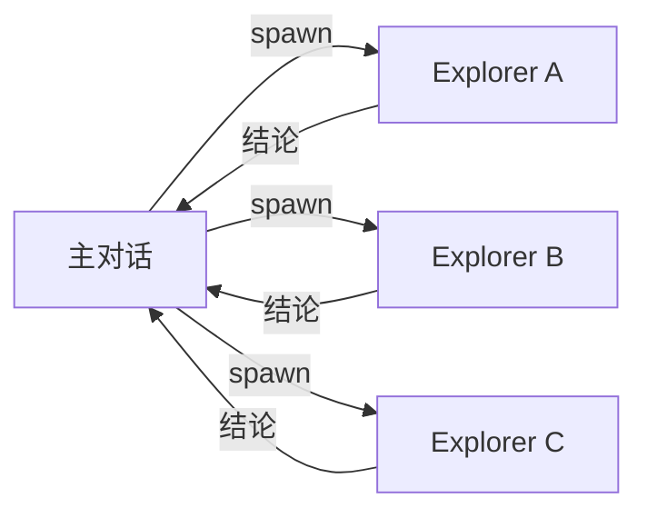
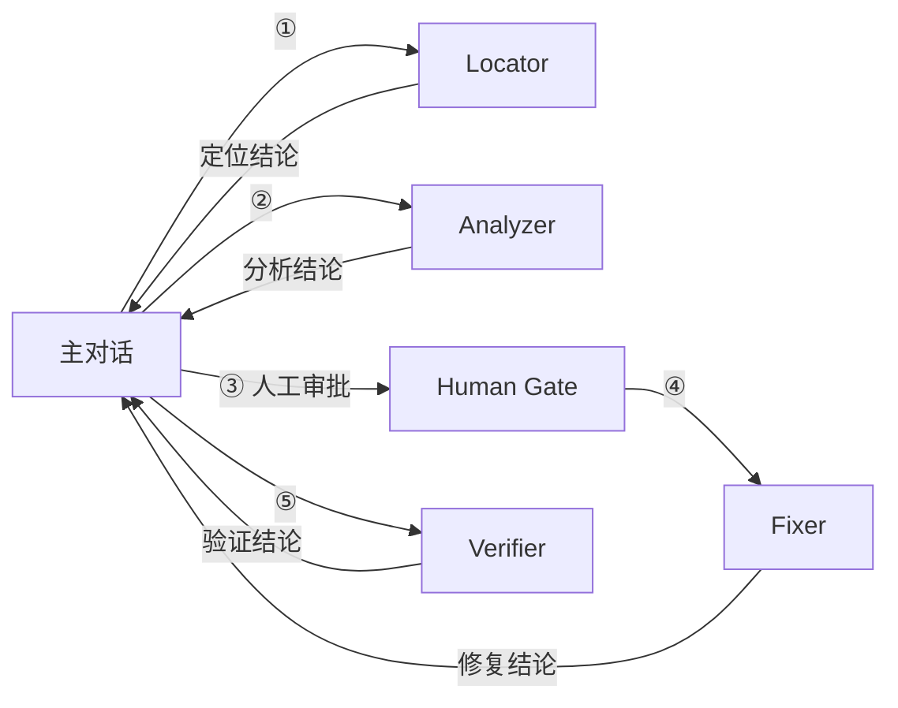
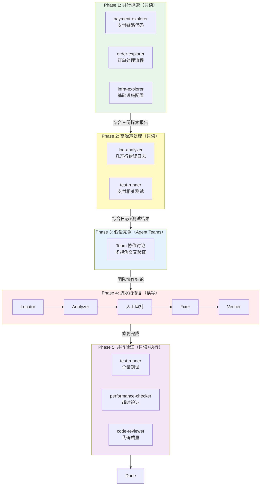
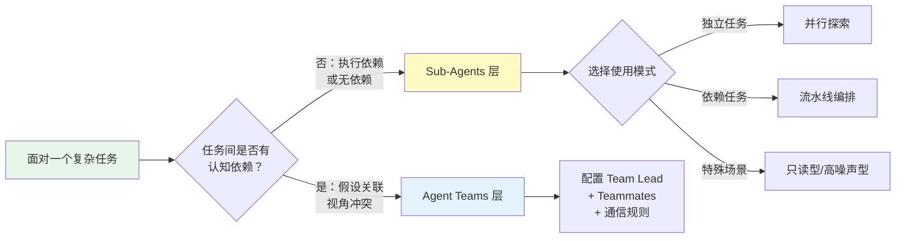
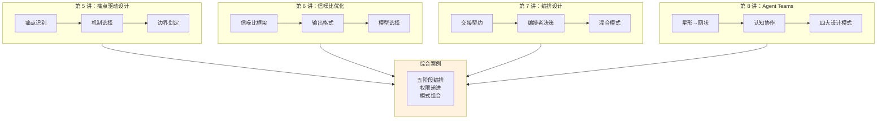

# 子代理专题总结与综合案例

> 最后整理: 2026-06-23 | 来源: 黄佳《Claude Code 工程化实战》加餐"子代理专题总结 & 练习"

> 关联: [子智能体（subagents）机制与实战](./子智能体（subagents）机制与实战.md) — Sub-Agents 的底层机制（spawn、context 隔离、tools 白名单）
> 关联: [并行探索与流水线编排](./并行探索与流水线编排.md) — 并行/流水线两种编排拓扑 + 交接契约 + 混合模式
> 关联: [Agent Teams 多会话协作架构](./Agent%20Teams%20多会话协作架构.md) — 从星形到网状拓扑的跃迁、四大协作设计模式
> 关联: [从 Sub-Agent 到 Multi-Agent 的工程指南](./从%20Sub-Agent%20到%20Multi-Agent%20的工程指南.md) — 四种多智能体模式（Skills/Sub-Agents/Handoffs/Router）的宏观选型

---

## §1 两层能力模型：结构化分工 vs 认知协作

六讲子代理的知识体系可以归纳为**两层能力**，它们解决的是完全不同层面的问题：

### 1.1 第一层：Sub-Agents — 单脑安全分工

Sub-Agents 解决的是**工程控制问题**：主对话的 context window 是有限的、昂贵的、需要保持清洁的。当一个任务需要大量搜索、日志分析、测试执行时，把这些"脏活"隔离到独立的 context window 里，主对话只接收结论。

核心关键词：**隔离、权限、信噪比、可审计**。

### 1.2 第二层：Agent Teams — 多脑互相挑战

当任务之间不只是**执行依赖**，而是**认知依赖**时，Sub-Agents 就不够了。

认知依赖的四种典型场景：

| 场景 | 为什么 Sub-Agents 不够 |
|------|----------------------|
| 多个假设可能互相关联 | 各子代理独立汇报，主对话可能看不出关联 |
| 不同视角可能互相推翻 | 星形拓扑下没有"辩论"机制 |
| 架构决策需要立场冲突 | 单一 agent 容易锚定偏见、过早收敛 |
| 根因链需要跨模块拼接 | 跨模块的因果关系需要交叉验证 |

Agent Teams 的价值：Teammates 之间可以**直接发消息、互相质疑、主动关联**——系统具备了"交叉验证"的认知能力。

---

## §2 四种子代理使用模式

在 Sub-Agents 层面，课程归纳了四种使用模式，从轻到重形成一个**渐进式复杂度阶梯**：

### 2.1 模式一：单独使用

最简单的形式——把一次性任务委派给一个子代理，拿到结论后继续。

### 2.2 模式二：只读型 + 高噪声型

两种特殊场景的隔离策略：

| 类型 | 典型场景 | 关键配置 |
|------|---------|---------|
| **只读型** | 代码审查、架构分析 | `tools` 白名单仅含 Read/Grep/Glob |
| **高噪声型** | 测试执行、日志分析 | 大量输出留在子代理 context，主对话只看摘要 |

### 2.3 模式三：并行探索

多个独立子任务同时扇出，各自执行后聚合结论到主对话。

**前提**：各子任务之间无信息依赖。核心价值是**速度 + context 清洁**。

### 2.4 模式四：流水线编排

有执行依赖的任务链式串行，上游产出作为下游输入。

**核心价值**：职责清晰 + 权限递进 + 可审计。关键阶段可设**人工审批**节点。

---

## §3 综合案例：电商大促支付超时排查

这个案例把四种子代理模式和 Agent Teams 串成一个完整的五阶段编排方案。

### 3.1 五阶段全景

### 3.2 各阶段权限设计

| 阶段 | 模式 | 权限 | 理由 |
|------|------|------|------|
| Phase 1 | 并行探索 | **只读** | 只是了解现状，不需要改任何代码 |
| Phase 2 | 高噪声处理 | **只读** | 分析日志和跑测试，不改源码 |
| Phase 3 | Agent Teams | **只读** | 讨论和决策阶段，尚未确定修复方案 |
| Phase 4 | 流水线修复 | **读写**（仅 Fixer） | 只有 Fixer 有写权限，且需人工审批 |
| Phase 5 | 并行验证 | **只读 + 执行** | 验证修复效果，跑测试，不改代码 |

**核心原则**：整个五阶段中，**只有 Phase 4 的 Fixer 有写权限**。这就是最小权限原则在复杂场景中的体现——绝大多数子代理都是只读的，写权限只在"确定要改"的那个精确环节开放。

### 3.3 Phase 3 为什么需要 Agent Teams

如果 Phase 3 只用 Sub-Agents（星形拓扑），风险在于：

- 每个子代理只向主对话汇报，**无法互相质疑**
- infra 的连接池问题和 N+1 查询之间可能存在**级联关系**，但星形拓扑下这个关联可能被遗漏
- 主对话可能过早收敛到一个看似合理但实际不完整的假设

Agent Teams 让多个 Teammates 可以**直接通信、互相挑战假设、拼接跨模块的因果链**，从而避免锚定偏见和单视角误判。

---

## §4 贯穿始终的工程方法论

六讲课程不是"学会配置子代理"，而是培养一种**工程判断力**——面对任何场景，能判断是否需要子代理、需要什么样的子代理、如何组合它们。

### 4.1 三讲方法论汇总

| 讲次 | 方法论 | 核心框架 |
|------|--------|---------|
| **第 5 讲** | 痛点驱动设计 | 痛点 → 缺什么 → 选机制 → 画边界 → 验证 |
| **第 6 讲** | 信噪比优化 | 信噪比框架 + 输出格式设计 + 模型选择验证 |
| **第 7 讲** | 编排设计 | 交接契约 + 编排者决策 + 混合模式选型 |

### 4.2 方法论的共同主线

**判断起点不是"我该用哪种子代理"，而是"这个任务的依赖结构是什么"。**

---

## §5 假期思考题

### 5.1 设计题：为自己的项目设计子代理编排方案

参考电商案例，为自己项目中的一个复杂问题设计完整的子代理编排方案。要求：

- 明确用了哪些模式（并行/流水线/只读型/高噪声型/Agent Teams）
- 标注每个子代理的权限（只读 vs 读写）
- 标注人工介入点

### 5.2 反思题：不用子代理会怎样

回到电商大促支付超时案例，假设**只在主对话中让 AI 一步步排查和修复**：

| 阶段 | 反思问题 |
|------|---------|
| Phase 1（探索） | 哪些信息最容易被遗漏或相互覆盖？为什么？ |
| Phase 2（日志/测试） | 高噪声输出对后续判断有哪些具体干扰？ |
| Phase 4（修复） | 没有权限隔离时，AI"好心修改"可能带来哪些工程风险？ |
| 全局 | 从审计、回滚、团队协作的角度看，"单对话全包"有哪些不可控点？ |

**核心追问**：子代理真正解决的不是"能力问题"（AI 能不能做），而是哪一类"工程风险"？

> 答案方向：子代理解决的是**可控性风险**——context 污染导致的信息遗漏、权限不受控导致的意外修改、单视角导致的锚定偏见、无法审计导致的不可回滚。这些都不是 AI"做不到"，而是 AI"做了但没人知道它做了什么、为什么做"。

---

## §6 知识图谱：六讲内容的完整关联

**一句话总结**：子代理系统的核心能力不是"让 AI 做更多事"，而是**让 AI 做事的过程对人类可见、可控、可审计**。
