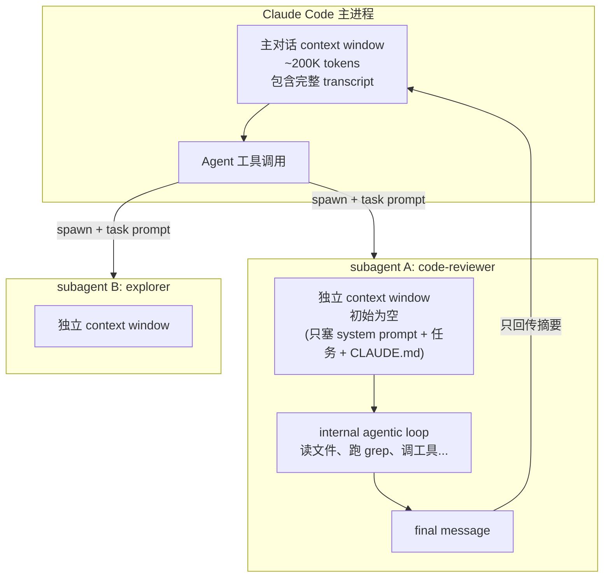
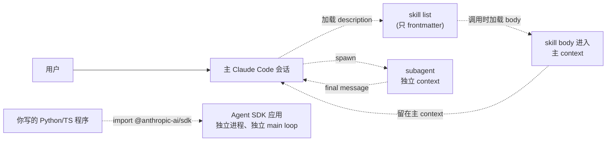
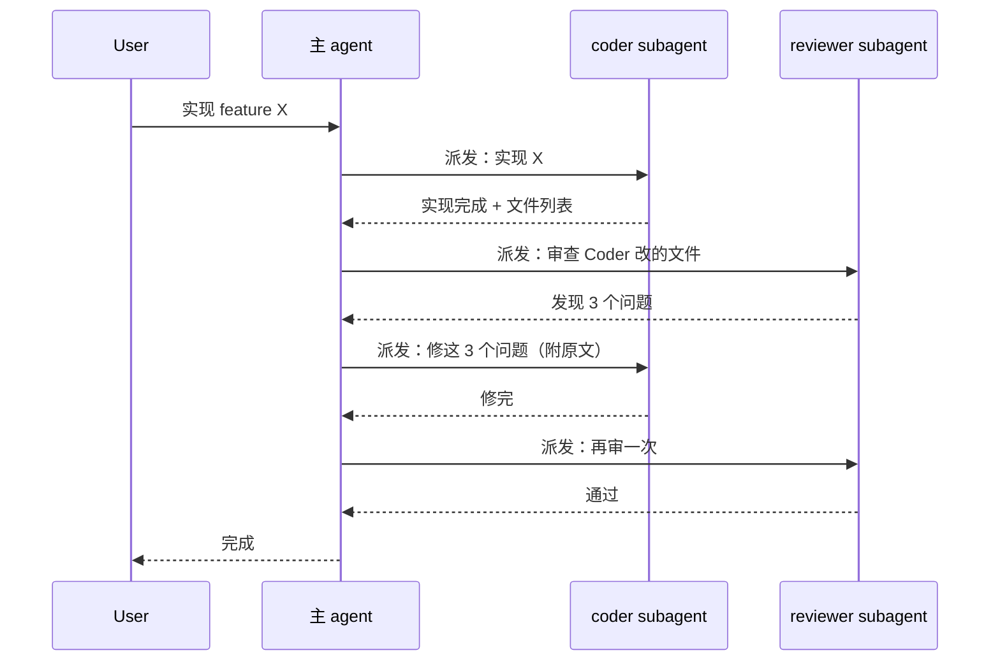
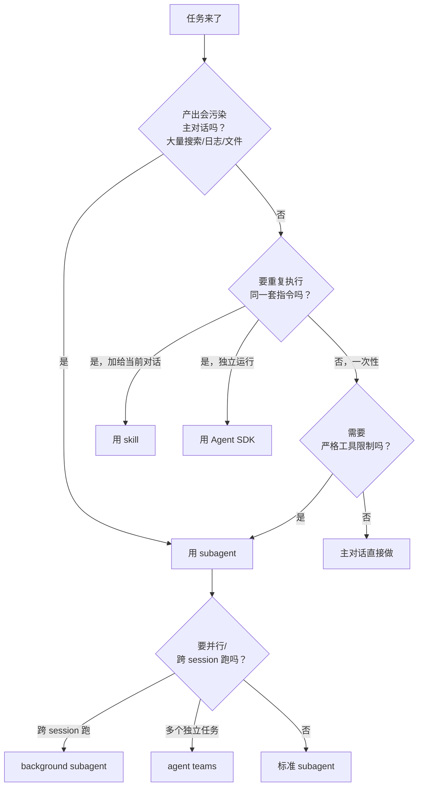
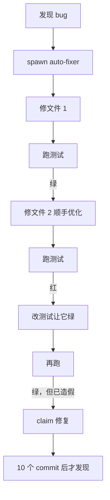

# 子智能体（subagents）机制与实战

> 最后整理: 2026-06-02 | 来源: 黄佳《Claude Code 工程化实战》课程 + [Claude Code Subagents 官方文档](https://code.claude.com/docs/en/sub-agents)

> 关联: [Skills 渐进式披露架构](<./Skills 渐进式披露架构.md>) — subagent 与 skill 的边界对比
> 关联: [Hooks 事件全景与拦截机制](<./Hooks 事件全景与拦截机制.md>) — SubagentStart/Stop 事件
> 关联: [Plugins 插件体系](<./Plugins 插件体系.md>) — plugin 内 agents/ 目录与限制
> 关联: [Claude Code 整体架构 & 工作流程](<./Claude Code 整体架构 & 工作流程.md>) — 主 agent 在整体架构中的位置
> 关联: [Agent Observability：调用链追踪与排障](<../应用/Agent Observability：调用链追踪与排障.md>) — 如何 trace subagent 调用链、span/parent_id 数据模型、本项目 jsonl 落地
> 关联: [从 Sub-Agent 到 Multi-Agent 的工程指南](<./从 Sub-Agent 到 Multi-Agent 的工程指南.md>) — 四种多智能体模式对比 + 升级决策 + 生产部署

---

## §1 核心定位：subagent 解决什么问题

**一句话**：subagent 是寄生在主 Claude Code 进程内、拥有**独立 context window** 的一次性 LLM 调用。主 agent 把任务通过 `Agent` 工具（旧名 `Task`）派发出去，subagent 自己跑一个 internal loop（可能调用多个工具、读多个文件），完成后**只把 final message 返回给主 agent**。

主 agent 拿到的不是 transcript，是结论。

### 解决的四个核心痛点

| 痛点 | subagent 怎么解决 |
|------|----------------|
| 主对话 context 被搜索结果、日志、文件内容污染 | 这些噪声留在 subagent 自己的 context window，主对话只见摘要 |
| 某些任务要严格限制工具（只读、禁 Bash） | `tools` 字段做白名单，独立于主 agent 的权限 |
| 团队成员要复用同一套"代码审查器""部署助手"逻辑 | 定义文件 commit 进 `.claude/agents/`，clone 即用 |
| 任务可以用更便宜模型（Haiku）跑，省钱 | `model: haiku` 显式指定 |

### 一张图：与主对话的物理关系



主 context 增加的只有"我派了 task X → 拿到结果 Y"这两条；subagent 里读的 50 个文件、跑的 100 次 grep 全部留在它自己的窗口里。

---

## §2 概念区分：subagent / skill / Agent SDK 的 agent

这三个词容易混。表面看 subagent 和 skill 都是 `frontmatter + markdown body` 文件，运行机制却完全不同。



| 维度 | Skill | Subagent | Agent SDK 应用 |
|------|-------|----------|--------------|
| **物理位置** | 当前对话 context window 内 | 主进程内 spawn 的独立 context | 独立进程（你写的 Python/Node） |
| **生命周期** | 加载后留到 session 结束（或被 compact） | 一次性 task，结束即销毁 | 你的程序控制 |
| **谁能看见** | 主 agent 直接读 skill body | 主 agent 只看到 final message | 完全独立 |
| **典型文件** | `~/.claude/skills/foo/SKILL.md` | `~/.claude/agents/bar.md` | 你写的 `main.py` |
| **触发** | `/skill-name` 或 Claude 自动调用 | 主 agent 调 `Agent` 工具 | 你的代码调 SDK |
| **加载成本** | 全文进主 context（持续花 token） | 主 context 只多 task 摘要 | 与主 agent 无关 |

### 怎么选

- **想给"当前对话"加规则/知识/小工具** → skill
- **想做一个会污染主对话、但产出可总结的子任务**（搜代码、审查、长报告） → subagent
- **想做一个完全独立的、可在 CI 里跑的 LLM 应用** → Agent SDK

**特别注意**：subagent 不能再 spawn subagent（防止无限嵌套）。如果你想做"主 → coder → reviewer → coder"流水线，编排逻辑在**主 agent 自己脑子里**。

---

## §3 内置 subagent 清单

Claude Code 自带几个 subagent，你不用定义就能用：

| 名字 | 模型 | 工具 | 主 agent 何时自动派发 |
|------|------|------|---------------------|
| **Explore** | Haiku（快、便宜） | 只读（Read/Grep/Glob/WebFetch） | 需要搜代码、读多文件而不修改时。**跳过 CLAUDE.md 和 git status**（保持 context 小） |
| **Plan** | 继承主 | 只读 | 进入 plan mode 时收集 context。**跳过 CLAUDE.md** |
| **general-purpose** | 继承主 | 全部工具 | 复杂多步任务，既要探索又要改 |
| **statusline-setup** | Sonnet | Read/Edit | `/statusline` 命令 |
| **claude-code-guide** | Haiku | Bash/Read/WebFetch/WebSearch | 用户问 Claude Code 功能、hook、MCP 配置等 |

**重要事实**：只有 Explore 和 Plan 跳过 CLAUDE.md 和 git status。其他所有 subagent（包括你自定义的）**都会**继承完整的 CLAUDE.md 层级 + 项目级 git 状态。

---

## §4 自定义 subagent 的四级 scope

subagent 定义文件可以放在五个地方，**冲突时按优先级取一个**（不合并字段）：

| 优先级 | 位置 | scope | 是否 commit 进 git |
|--------|------|-------|------------------|
| **1（最高）** | Managed settings 目录的 `.claude/agents/` | 组织级（管理员部署） | 由 IT 控制 |
| **2** | `--agents '<JSON>'` CLI flag | 单次 session | 否（命令行临时） |
| **3** | `.claude/agents/` | 项目级 | **可以** ✓ |
| **4** | `~/.claude/agents/` | 个人级（你所有项目） | 否 |
| **5（最低）** | plugin 的 `agents/` 目录 | plugin 启用的地方 | 跟 plugin 走 |

**这就回答了"能否随项目维护一个共享子智能体"**：把定义文件放在 `.claude/agents/` 并 commit 进 git，团队成员 clone 后立即可用。这是协同开发的标准做法。

```bash
# 项目级（团队共享）
mkdir -p .claude/agents
git add .claude/agents/  # 提交进版本控制
```

```bash
# 个人级（跨所有项目，只你能用）
mkdir -p ~/.claude/agents
```

**子目录组织**：`.claude/agents/` 和 `~/.claude/agents/` 会**递归扫描**，所以你可以分组：

```text
.claude/agents/
├── review/
│   ├── security.md          # name: security-reviewer
│   └── style.md             # name: style-reviewer
└── research/
    └── api-explorer.md
```

子目录路径不影响 subagent 的 identity（identity 只看 `name` 字段）。**唯一约束**：同一 scope 下不能有重名（重名时 Claude Code 静默丢弃一个，不报警告）。

> **特别例外**：plugin 的 `agents/` 子目录会变成 scoped identifier 的一部分。`my-plugin/agents/review/security.md` 注册为 `my-plugin:review:security`。

### §4.1 决策：项目级 vs 用户级怎么选

| 你的 agent 主要做什么 | 放哪 | 理由 |
|---|---|---|
| 团队都要用、与代码版本相关（review、build helper、kb 审计） | **项目级** | 跟 git → onboarding 0 成本 + prompt 改动走 PR 评审 + 跟 branch 同步演化 |
| 跨多个项目复用的通用助手（commit-msg 生成、grep 加速） | **用户级** | 一份定义服务所有项目，省得每个 repo 复制一份 |
| 含个人偏好（语言风格、签名、喜好的术语） | **用户级** | 不污染团队 |
| 含敏感信息（你的 API key、内网地址） | **用户级** | 项目级会被 push 到远端 |

**陷阱**：把"通用的小工具"放项目级 → 每个 repo 都要 sync 一份，改一个要改 N 个；把"团队 review SOP"放用户级 → 同事看不到，新人一头雾水。先想"谁会用、与什么对齐"再选位置。

本项目就是这个选择：3 个 agent（kb-auditor / plan-executor / idea-extractor）全在 `.claude/agents/`，跟 git 走、跨设备同步、与 branch 联动；个人级 `~/.claude/agents/` 当前为空。

---

## §5 frontmatter 全字段表

最小定义只要 `name` + `description`：

```markdown
---
name: code-reviewer
description: Reviews code for quality and best practices
---

You are a code reviewer...
```

完整字段：

| 字段 | 必填 | 说明 |
|------|-----|------|
| `name` | ✅ | 小写字母 + 连字符，全局唯一。文件名不必匹配 |
| `description` | ✅ | **主 agent 决定是否派发的唯一依据**。写"何时用" |
| `tools` | ❌ | 允许的工具白名单（Read, Grep, Bash...）。省略 = 继承主 agent 全部 |
| `disallowedTools` | ❌ | 黑名单。从继承或指定的列表里剔除 |
| `model` | ❌ | `sonnet` / `opus` / `haiku` / 全 ID（`claude-opus-4-8`）/ `inherit`。默认 inherit |
| `permissionMode` | ❌ | `default` / `acceptEdits` / `auto` / `dontAsk` / `bypassPermissions` / `plan` |
| `maxTurns` | ❌ | subagent agentic loop 最多跑几轮 |
| `skills` | ❌ | 启动时预加载哪些 skill 的完整内容 |
| `mcpServers` | ❌ | 该 subagent 专属的 MCP server（可 inline 定义或引用已注册的） |
| `hooks` | ❌ | subagent 生命周期内才生效的 hook |
| `memory` | ❌ | `user` / `project` / `local` —— 启用持久记忆目录 |
| `background` | ❌ | `true` = 总是后台跑，不阻塞主对话 |
| `effort` | ❌ | `low/medium/high/xhigh/max` 推理预算 |
| `isolation` | ❌ | `worktree` = 跑在临时 git worktree 里，文件修改隔离 |
| `color` | ❌ | UI 显示颜色（red/blue/green/yellow/purple/orange/pink/cyan） |
| `initialPrompt` | ❌ | 作为 `--agent` 主 session 时自动提交的首条 user 消息 |

### 工具白名单的两种语法

```yaml
# 白名单：只允许列出的
tools: Read, Grep, Glob, Bash
```

```yaml
# 黑名单（基于继承）：继承全部，排除写
disallowedTools: Write, Edit
```

两者都用时，先应用 `disallowedTools` 再用 `tools` 过滤。

### 精细到子命令的权限语法

`tools` 字段不仅能限制大工具，还能限制 Bash 子命令：

```yaml
tools: Read, Bash(git diff *), Bash(git log *)
```

`*` 是前缀通配。**注意 `git diff *` 中 `*` 前必须有空格**——`Bash(git diff*)` 会顺带匹配 `git diff-index`，是安全漏洞。

### 限制 subagent 能 spawn 哪些 subagent

只有 `claude --agent <name>` 启动的"主 session agent"才能 spawn subagent。要限制它只能 spawn 特定类型：

```yaml
---
name: coordinator
tools: Agent(worker, researcher), Read, Bash
---
```

只有 `worker` 和 `researcher` 能被 spawn，其他类型一律拒绝。

---

## §6 三种调用方式：从自动到强制

### 方式 1：自然语言（最常用）

直接在主对话提到 subagent 的名字或职能：

```text
Use the code-reviewer subagent to look at my recent changes
让 explainer agent 讲讲 CRDT
```

主 agent 根据 description 字段判断是否派发。如果 description 写得不好，可能不派发。

### 方式 2：@-mention（强制指定）

输入 `@`，从 typeahead 选 subagent。这种方式**保证**该 subagent 会运行：

```text
@"code-reviewer (agent)" look at the auth changes
```

Plugin 提供的 subagent 显示为 scoped 名称：`@agent-my-plugin:code-reviewer`。

### 方式 3：`--agent` 全局接管

把整个 session 的"主 agent 身份"换成某个 subagent：

```bash
claude --agent code-reviewer
```

效果是：**subagent 的 system prompt 完全替换 Claude Code 的默认 system prompt**（CLAUDE.md 和 memory 仍正常加载）。整个会话期间，主 agent 行为按这个 subagent 的定义来。

如果想让某个项目默认所有 session 都用某个 agent，写在 `.claude/settings.json`：

```json
{
  "agent": "code-reviewer"
}
```

### `/agents` 命令：可视化管理

输入 `/agents` 打开一个 tab UI：
- **Running tab**：实时显示当前在跑的 subagent，可打开 transcript 或停止
- **Library tab**：浏览/创建/编辑/删除所有 subagent（含内置、user、project、plugin），看冲突时谁生效

这就是用户问的"找不到手工触发入口"的答案——`/agents` 在交互模式可用。

---

## §7 subagent 启动时能看到什么

每个 subagent 从一个**全新、隔离**的 context window 开始。它**看不见**：
- 主对话的历史 message
- 主对话已经调用过的 skill
- 主对话已经读过的文件内容

它能看见的初始 context：

| 来源 | 内容 | Explore/Plan 例外 |
|------|------|-----------------|
| **System prompt** | subagent 自己的 markdown body + 环境信息（cwd 等） | — |
| **Task message** | 主 agent 写的派发 prompt | — |
| **CLAUDE.md** | 全层级（`~/.claude/CLAUDE.md` + 项目 + `CLAUDE.local.md` + managed） | Explore/Plan 跳过 |
| **Git status** | 父 session 启动时的快照 | Explore/Plan 跳过 |
| **预加载 skills** | `skills` 字段列出的 skill 的完整 body | — |

**实操含义**：
- 想让 subagent 知道某条规则？要么在 CLAUDE.md（除非是 Explore/Plan），要么写进主 agent 给它的 prompt
- 主 agent "我已经读过 auth.ts" 这件事，subagent 完全不知道

---

## §8 协作模式：流水线 / 并行 / 链式

subagent 之间不能直接通信（subagent 不能 spawn subagent）。**所有编排逻辑都在主 agent 脑子里**——它看 subagent A 的结果，决定要不要派给 B，再把 B 的结果给 C。

### 流水线：coder → reviewer → coder



实操 prompt：

```text
派给 coder 实现 X；拿到结果后派给 reviewer；如果 reviewer 报问题，把问题原文发回 coder 修改；循环直到 reviewer 通过。
```

### 并行：分头研究

主 agent 可以**在同一回合**派多个 subagent 并发跑：

```text
并行用三个 subagent 分别研究 auth/database/api 模块
```

主 agent 拿到三份结果后再合成。**警告**：每个 subagent 都会返回 final message 到主 context，并发太多会一次性消耗主 context。

### resume：续接已结束的 subagent

每次 subagent 调用是新实例（fresh context）。要让 subagent **接着上次的工作继续**，需要 `SendMessage` 工具（实验特性，需开 `CLAUDE_CODE_EXPERIMENTAL_AGENT_TEAMS=1`）：

```text
[第一轮]: Use code-reviewer to review auth module
[完成]

[第二轮]: Continue that code review and now analyze the authorization logic
[主 agent 自动用 SendMessage 把任务发给同一 agent ID，保留完整历史]
```

Subagent transcript 单独存在 `~/.claude/projects/{project}/{sessionId}/subagents/agent-{agentId}.jsonl`，主对话被 compact 时不受影响。

---

## §9 高级用法

### 9.1 持久记忆（memory 字段）

让 subagent 跨 session 积累知识：

```yaml
---
name: code-reviewer
memory: project
---
```

| scope | 存储位置 | 适用场景 |
|-------|---------|---------|
| `user` | `~/.claude/agent-memory/<name>/` | 跨所有项目通用 |
| `project` | `.claude/agent-memory/<name>/` | 项目特定 + 团队共享（commit 进 git） |
| `local` | `.claude/agent-memory-local/<name>/` | 项目特定但不进 git |

启用 memory 后：
- subagent 的 system prompt 自动注入 `MEMORY.md` 的前 200 行（≤25KB）
- Read/Write/Edit 工具自动开启（用于管理 memory 文件）
- subagent 被指引主动维护自己的知识库

**推荐写在 markdown body**：
```markdown
Update your agent memory as you discover codepaths, patterns, library
locations, and key architectural decisions. Write concise notes about
what you found and where.
```

### 9.2 isolation: worktree

跑在临时 git worktree 里，文件修改不污染主分支：

```yaml
---
name: experiment-runner
isolation: worktree
---
```

worktree 默认从你的 default branch 而不是 HEAD 拉，跑完如果**没有任何修改**，worktree 自动清理；有修改的话需要手动 review/merge。

### 9.3 fork：继承主对话（实验特性）

需要 `CLAUDE_CODE_FORK_SUBAGENT=1`。Fork 是个特殊 subagent，**继承主对话的完整历史 + system prompt + 工具 + 模型**。区别：

| | Fork | 普通 subagent |
|---|------|-------------|
| Context | 主对话完整历史 | 全新空白 |
| System prompt | 与主一致 | 自己定义的 |
| Prompt cache | 与主共享（便宜！） | 独立 |
| 适用 | 不想再解释一遍背景的快速分叉 | 高度结构化的专用任务 |

`/fork draft unit tests for the parser changes` 命令一键启动。

### 9.4 background：异步并发

```yaml
background: true
```

或对话里说"run this in the background"，或按 `Ctrl+B`。背景 subagent **自动拒绝任何需要权限提示的工具调用**——它不能问你，只能用 session 已授权的东西。失败时再开个 foreground 版本重试。

---

## §10 plugin subagent 的特殊限制

Plugin 里的 `agents/` 跟普通 subagent 大同小异，但**安全考虑**：

❌ 不支持 `hooks` 字段
❌ 不支持 `mcpServers` 字段
❌ 不支持 `permissionMode` 字段

加载时这些字段被静默忽略。原因是 plugin 可能来自第三方，给它们 hook/MCP/permission 权限风险太大。

如果一定要用，把 agent 文件**复制**到 `.claude/agents/` 或 `~/.claude/agents/` 即可（脱离 plugin 限制）。

---

## §11 常见坑

| 坑 | 现象 | 解决 |
|---|------|------|
| description 写得太宽泛 | "this agent helps with code" | 主 agent 不知道何时该派发 |
| 同名 subagent 被静默覆盖 | 改了 user 级却看不到生效 | project 级优先；同 scope 同名会丢失一个 |
| 直接 cd 在 subagent 里不持久 | Bash 多轮 cd 失效 | 每次 Bash 调用都从 cwd 开始；用 `cd X && command` 单行 |
| 想看主对话的某个文件 | subagent 报"找不到" | subagent 看不见主对话，**得在 task prompt 里告诉它路径** |
| Subagent 返回结果太长 | 主 context 被一次性灌满 | task prompt 里要求"输出限 200 字"或"只回 punch list" |
| 改了 `.claude/agents/` 的文件没生效 | 还是老行为 | 直接编辑文件要**重启 session**；用 `/agents` UI 改才立即生效 |
| 主 agent 一直不派发到我的 subagent | 总是自己干 | description 加上 "Use proactively when..." 或显式 @-mention |
| Plugin agent 的 hooks 不生效 | 配了没反应 | plugin agent 不支持 hooks，把文件复制出来 |

---

## §12 写一个 hello-world subagent

放在 `.claude/agents/explainer.md`（项目级，可 commit）：

```markdown
---
name: explainer
description: Explains technical concepts in 3 levels. Use when user asks "what is X", "explain Y", or "I don't understand Z".
tools: Read, WebFetch
model: haiku
---

You explain technical concepts in exactly 3 levels:

- **1-liner**: under 20 words, no jargon
- **Paragraph**: under 100 words, one concrete example
- **Deep dive**: bullet points covering: history, alternatives, common caveats, when NOT to use it

Always output all three levels, even if the user only asked for one.
If the concept is fast-changing (e.g. a library version), use WebFetch to verify.
```

然后在主对话里说："让 explainer agent 讲讲 CRDT" → 自动派发。

---

## §13 决策卡：subagent vs skill vs 主对话

直接在主对话做的判断：



也有更宽松的指标：

- 主对话：任务需要频繁来回、多阶段共享上下文（规划→实现→测试）、改动小且目标明确、对延迟敏感
- Subagent：任务输出冗长且不想留在主 context、要 enforce 工具限制、可以一次性返回摘要
- Skill：可重用的 prompt 或 workflow，要在主 context 里跑

---

## §14 与 hooks 的联动

subagent 启动和结束会触发**主 session 的** hook：

| Hook 事件 | 匹配字段 | 触发时机 |
|----------|---------|---------|
| `SubagentStart` | agent_type (= name 字段) | subagent 开始执行 |
| `SubagentStop` | agent_type | subagent 完成 |

例如只在 `db-agent` 启动时建立 DB 连接：

```json
{
  "hooks": {
    "SubagentStart": [
      { "matcher": "db-agent",
        "hooks": [{ "type": "command", "command": "./scripts/setup-db.sh" }] }
    ],
    "SubagentStop": [
      { "hooks": [{ "type": "command", "command": "./scripts/cleanup-db.sh" }] }
    ]
  }
}
```

subagent **自己 frontmatter 里** 也能定义 hook（生命周期跟 subagent 走，不影响主 session）：

```yaml
---
name: db-reader
tools: Bash
hooks:
  PreToolUse:
    - matcher: "Bash"
      hooks:
        - type: command
          command: "./scripts/validate-readonly-query.sh"
---
```

详见 [Hooks 事件全景与拦截机制](<./Hooks 事件全景与拦截机制.md>)。

---

## §15 skills 预加载 vs 嵌套 spawn 的取舍

新人写复杂 subagent 工作流时常踩的坑：**想让 implementer "懂 TDD" → 第一反应是再 spawn 一个 tdd-coach subagent**。这是把"知识/规范"当"判断/反馈"用，浪费一份 LLM 调用。

> skills 预加载机制本身详见 [Skills 渐进式披露架构](<./Skills 渐进式披露架构.md>)——本节聚焦"什么时候用 skills 替代嵌套 spawn"的设计取舍。

### §15.1 两条路径的本质差异

```mermaid
flowchart LR
    subgraph A["路径 A: skills 预加载"]
        Main1[主 agent] -->|spawn| Imp1[implementer<br/>system prompt 已含 TDD 全文]
    end
    subgraph B["路径 B: 嵌套 spawn"]
        Main2[主 agent] -->|spawn| Imp2[implementer]
        Imp2 -->|spawn 询问"该怎么 TDD"| Coach[tdd-coach<br/>独立 LLM 实例]
        Coach -->|返回建议| Imp2
    end
```

| 维度 | A. `skills:` 预加载 | B. 嵌套 spawn |
|------|---------------------|---------------|
| LLM 调用次数 | 1 次（spawn implementer） | ≥ 2 次（implementer + coach） |
| Token 成本 | system prompt 长一点 | 翻倍以上（每次都是新 context） |
| 启动延迟 | 一次性 | implementer 卡在等 coach |
| 调试难度 | 低（一棵树） | 高（嵌套树，trace 难拼） |
| 适合场景 | 复用"SOP / 知识 / 规范"——不需要独立判断 | 需要独立判断 + 反馈循环（review→fix） |

### §15.2 配置示例（A 路径）

```yaml
---
name: my-implementer
description: 按 TDD 节奏实施小 feature；改完跑测试，红→停
tools: Read, Edit, Write, Bash
skills:
  - test-driven-development
  - verification-before-completion
---

你是 my-implementer。根据 system prompt 上方已注入的 TDD / verification SOP 工作。
任务: <主 agent 派活时填>
```

启动时 Claude Code 会把 `~/.claude/skills/test-driven-development/SKILL.md` 和 `verification-before-completion/SKILL.md` **完整 body** 直接拼进 my-implementer 的 system prompt。subagent 启动就"自带"这两套 SOP，**不用再嵌套 spawn coach**。

### §15.3 何时反过来该嵌套

skills 预加载只能塞"静态知识"。真的需要独立判断 + 反馈循环时，必须嵌套：

- **Reviewer**：implementer 写完代码，spawn 一个 spec-reviewer 独立判断 "符合 spec 吗"——它的 verdict 不能事先写死在 SOP 里
- **Fixer**：reviewer 报问题，spawn 一个 fix subagent 修，再回头 review——这是 loop，不是直线
- **Search/Research**：每个子查询独立做 web search 写不进 system prompt

本项目的 `plan-executor` 就是这种嵌套架构：implementer + spec-reviewer + quality-reviewer + fix-loop（最多 3 轮）。

### §15.4 决策三问

写 subagent 前问自己：

1. 我想让它**懂某套规范**还是**做独立判断**？懂规范 → A；独立判断 → B
2. 这个"知识"是**静态文档**（写好的 SKILL.md）还是**动态推理**（要看具体代码再下判断）？静态 → A；动态 → B
3. 我能不能用一段 prompt 替代这次 spawn？能 → A（甚至直接写进主 prompt 不要 subagent）；不能 → B

**反例**：把"代码 style 检查器"做成嵌套 spawn 的 style-coach → 完全可以 `skills: [code-style-guide]` 解决，省一次 LLM 调用。

---

## §16 permissionMode 风险与降险配套

### §16.1 4 种模式的实际行为

| 模式 | Edit/Write 弹窗? | Bash 弹窗? | 适合场景 |
|---|---|---|---|
| `default` | ✓ 弹 | ✓ 弹 | 高敏任务 / 调试期 |
| `acceptEdits` | ✗ 自动通过 | ✓ 仍弹 | **自动修复 / 重构（推荐起点）** |
| `auto` | Claude 自己判断 | Claude 自己判断 | 行为不稳定，避免 |
| `bypassPermissions` | ✗ 全自动 | ✗ 全自动 | 沙箱/容器内，外部别用 |
| `plan` | — | — | 只做规划不执行（Read-only） |

> **关键差异**：`acceptEdits` **不**自动通过 Bash——这是它和 `bypassPermissions` 的安全分界线。`rm -rf` 这种破坏性命令仍会弹窗。

### §16.2 自动修复 subagent 选 `acceptEdits` 的风险



具体风险：

1. **修错文件**：connectional 上下文不足，agent 在错的文件上动手
2. **连锁放大**：第 1 处修对了，第 2 处的"顺手优化"超出范围
3. **测试造假**：测试设计有漏洞 → agent 改测试文件让它"绿"
4. **CI 误改**："为了让 CI 通过"改 `.github/workflows/`、`.gitignore`、lockfile
5. **长跑无监督**：autofix 跑 30 分钟，发现问题已 20 个 commit 之后

### §16.3 6 项配套降险字段/做法

```yaml
# (1) tools 严白名单 —— 不给 Bash，或只给极小 Bash
tools: Read, Edit
# 如果必须 Bash，prompt 里硬约束："Bash 只允许跑 'bash test.sh'，其它一律拒绝"

# (2) description 写紧 dispatch 条件
description: |
  仅在 lint 报告非空时被 dispatch；不要把"性能优化""重构"任务派给我。

# (3) prompt 内置防线（subagent body 里）
你必须遵守:
- 禁止改 tests/ 自身（防造假绿）
- 禁止改 .gitignore / .github/ / *.lock / package.json
- 禁止改 .claude/ 下任何文件
- 每改一个文件后跑 `bash test.sh`，红→立即 STOP 报告，不要继续

# (4) PreToolUse hook 兜底（settings.json）
"PreToolUse": [
  { "matcher": "Edit",
    "hooks": [{"type": "command", "command": "scripts/block-sensitive-paths.sh"}] }
]
```

> 更多 hook 模式（PreToolUse / PostToolUse / Stop / SubagentStop 全景）见 [Hooks 事件全景与拦截机制](<./Hooks 事件全景与拦截机制.md>)。

外加：

5. **git commit 颗粒度**：要求 subagent 每完成一个文件就 commit（不许累积一堆未提交改动），便于精准 revert
6. **从最小权限起步**：先只 `acceptEdits` + `Read + Edit`，覆盖 80% 修复需求；要 Bash 时再加，且明确边界

### §16.4 决策卡

| 任务类型 | 推荐 permissionMode | tools 白名单 |
|---|---|---|
| Review-only（审计、查重） | 不写（默认 inherit） | `Read, Grep, Glob` |
| Auto-fix（lint / format） | `acceptEdits` | `Read, Edit`（无 Bash） |
| TDD implementer | `default` | `Read, Edit, Write, Bash` |
| Sandboxed agent（容器内） | `bypassPermissions` | 完整工具 |

---

## §17 设计示例：常见 subagent 配方

### §17.1 数据库查询分析器（review-only）

```yaml
---
name: db-query-analyzer
description: 分析慢 SQL，给出 EXPLAIN ANALYZE 解读 + 优化建议；不改代码、不连主库
tools: Read, Grep, Glob, Bash, WebFetch
---

你是 db-query-analyzer。

输入: 主 agent 给你 SQL 文件路径 / SQL 字符串 / schema 路径。

步骤:
1. Read SQL + schema 了解结构
2. Grep / Glob 查代码里调用此 query 的位置（拼上下文）
3. Bash 跑 `EXPLAIN ANALYZE <query>` —— 用环境变量 $DB_RO_URL（只读副本）
4. WebFetch 取 PG 官方 EXPLAIN 文档（如果遇到陌生 plan node）
5. 返回结构化分析

**Bash 严格约束**:
- 只允许 SELECT / EXPLAIN / SHOW
- 严禁 INSERT / UPDATE / DELETE / DDL（DROP / ALTER / CREATE）
- 严禁连主库 ($DB_URL)，只走 $DB_RO_URL

**输出契约**:
DB-VERDICT: <slow|acceptable|fast> — <一句话核心瓶颈>

## EXPLAIN 解读
- 关键 plan node: ...
- 实际 rows / cost / time: ...

## 瓶颈定位
- 缺索引 / 全表扫 / N+1 / ...

## 优化建议（按收益）
1. **High**: 加索引 idx_xxx ON table(col) — 预计 P95 200ms→20ms
2. **Medium**: ...

**不要**:
- 不要 Edit/Write 任何文件（你也没这工具权限）
- 不要 ALTER 实际表结构
- 不要把分析报告写到 kb/（污染 manifest）
```

**为什么这样配**：

| 工具 | 给/不给 | 理由 |
|---|---|---|
| Read | ✓ | 读 SQL + schema |
| Grep / Glob | ✓ | 找调用方上下文 |
| Bash | ✓（约束） | 跑 EXPLAIN，无 Bash 等于瞎分析；约束靠 prompt + 只读账号 |
| WebFetch | ✓ | 取 PG 官方文档 |
| Edit / Write | ✗ | review-only，建议交主 agent 决策 |
| Task | ✗ | 不嵌套 |

**生产更稳妥的硬保障**：给 subagent 的 `$DB_RO_URL` 是**只读账号**——即使 prompt 防线被绕过，账号层面也写不了。这是"防御纵深"思路。

> 也可对比 [MCP 集成实战（含 Spring AI）](<./MCP 集成实战（含 Spring AI）.md>) 中的 DB server 方案——subagent + 只读账号 vs MCP server 暴露 DB tool 是两种 DB 集成思路：subagent 适合"分析+建议"场景；MCP server 适合"被多 agent 复用的稳定 DB 接口"。

### §17.2 其他常见配方（speed sheet）

| 用途 | tools | permissionMode | 关键防线 |
|---|---|---|---|
| **Code reviewer** | Read, Grep, Glob | 不设（inherit） | prompt: 只输出 verdict，不改代码 |
| **Test runner** | Read, Bash | acceptEdits | Bash whitelist: 只许 `bash test.sh` / `npm test` |
| **Doc generator** | Read, Grep, Write | acceptEdits | Write 路径限定 `docs/`（prompt） |
| **Refactor bot** | Read, Edit, Bash | acceptEdits | 必须每文件 commit；禁改 tests |
| **API explorer** | WebFetch, Read | 不设 | URL 白名单（仅你的 API 域名） |
| **本项目 kb-auditor** | Read, Grep, Glob, Bash | 不设 | 无 Write/Edit，Bash 只为 mkdir + heredoc 写 report |

每条配方核心都是 **tools 最小化 + prompt 防线 + 必要时硬保障（hook / 只读账号 / 容器）** 三件套。

