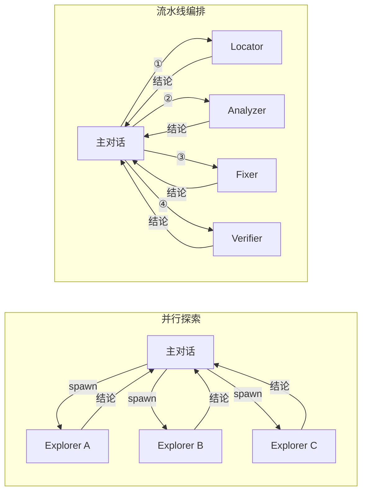
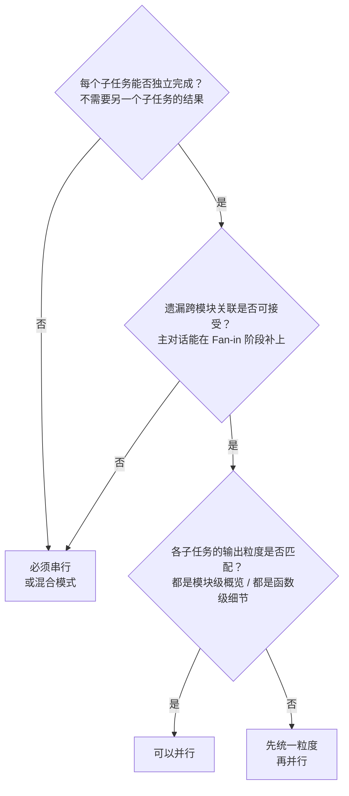
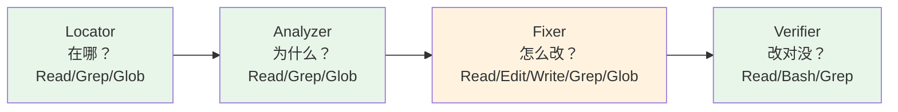
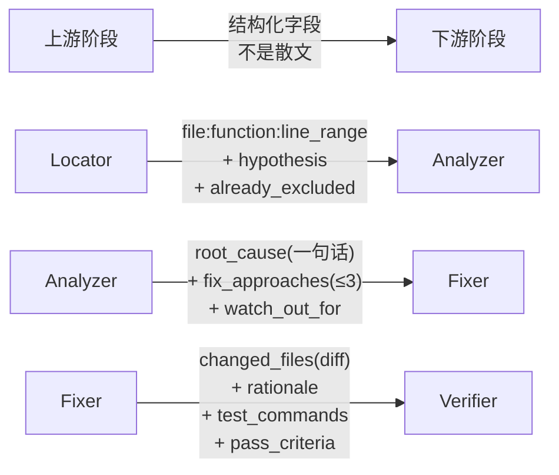
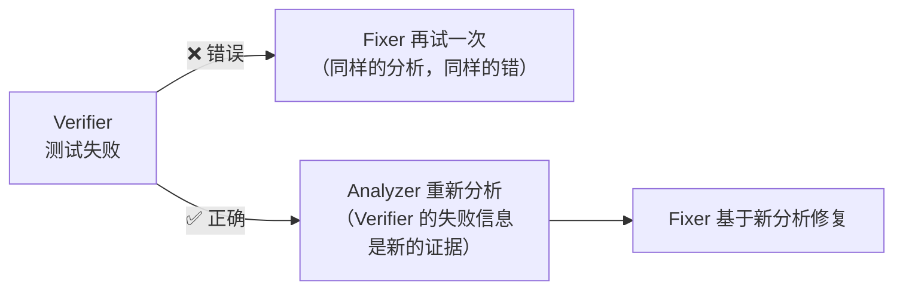
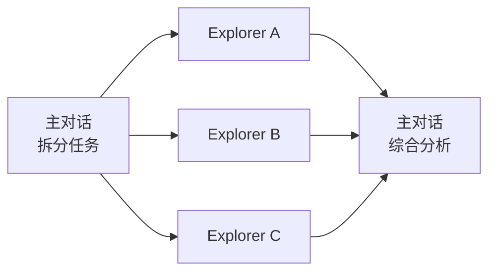
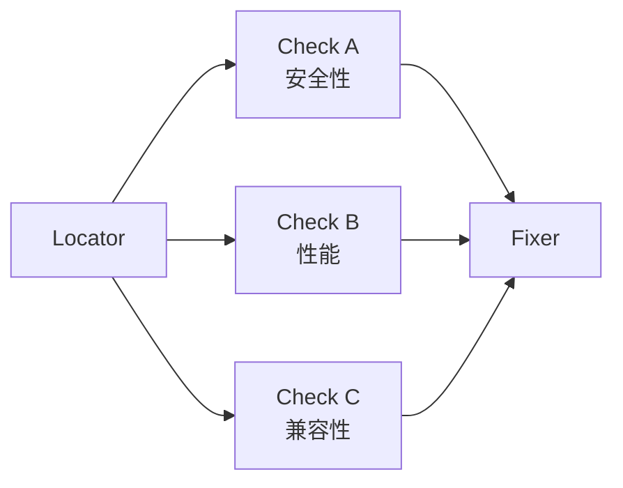
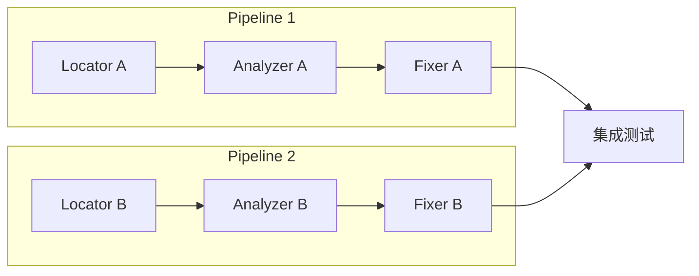
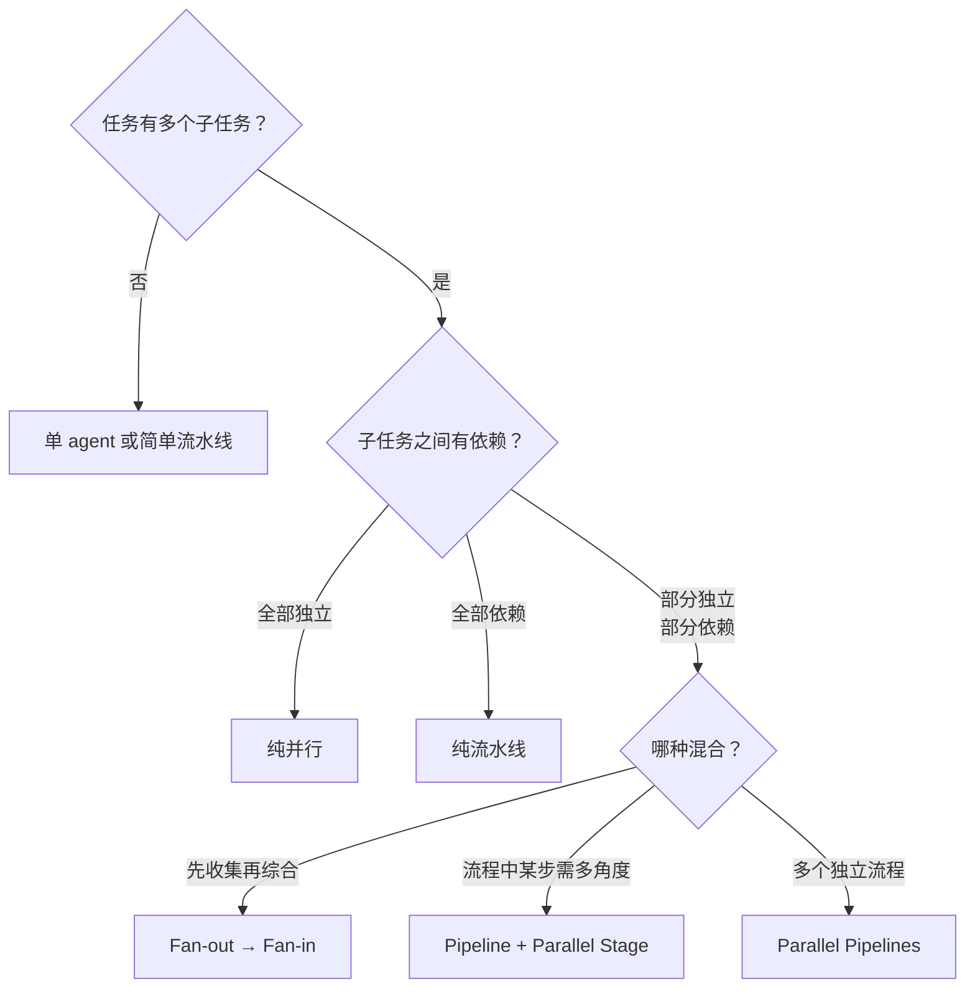

# 并行探索与流水线编排

> 最后整理: 2026-06-08 | 来源: 黄佳《Claude Code 工程化实战》+ 实践验证

> 关联: [子智能体（subagents）机制与实战](./子智能体（subagents）机制与实战.md) — subagent 的底层机制（spawn、context 隔离、tools 白名单）
> 关联: [从 Sub-Agent 到 Multi-Agent 的工程指南](<./从 Sub-Agent 到 Multi-Agent 的工程指南.md>) — 四种多智能体模式的宏观选型（Skills/Sub-Agents/Handoffs/Router）
> 关联: [Claude Code 整体架构 & 工作流程](<./Claude Code 整体架构 & 工作流程.md>) — 主 agent 的 REPL 循环与工具层

---

## §1 两种编排模式的本质区分

子代理的调度不外乎两种拓扑：

| 维度 | 并行探索 | 流水线编排 |
|------|---------|-----------|
| **拓扑** | 扇出→聚合（Fan-out → Fan-in） | 链式串行（A → B → C → D） |
| **前提** | 各子任务之间**无信息依赖** | 下游**依赖**上游的产出 |
| **核心价值** | 速度 + 主对话 context 清洁 | 职责清晰 + 权限递进 + 可审计 |
| **模型选择** | haiku（广度探索，够用且快） | sonnet（需要推理深度） |
| **典型场景** | 多模块代码探索、多维度信息收集 | Bug 修复、代码迁移、需求→方案→实现→验证 |



**核心约束**：子代理不能嵌套 spawn 子代理。所有编排逻辑都在主对话——主对话是唯一的编排者，不是旁观者。

---

## §2 并行探索的工程要点

### 2.1 独立性是并行的前提

并行看起来美好，但有一个容易忽略的前提：**各子代理的任务之间不能有信息依赖**。

举例：三个 Explorer 分别探索 auth / database / api 模块。auth-explorer 发现 JWT token 里有 role 字段，db-explorer 发现 users 表有 role 列，api-explorer 发现 `/admin/*` 路由检查 role——三个发现之间有关联，但因为并行执行，每个子代理都不知道其他两个发现了什么。

这不是 bug，而是设计约束。**子代理负责"收集原始情报"，主对话负责"连点成线"。**

### 2.2 独立性检查清单

在决定并行之前，过三个问题：



### 2.3 并行探索的配置模板

一个典型的并行探索子代理遵循四个原则：

| 原则 | 做法 | 原因 |
|------|------|------|
| 只读工具 | `tools: Read, Grep, Glob` | 探索不需要修改任何东西 |
| 快模型 | `model: haiku` | 广度任务不需要深度推理 |
| 边界明确 | prompt 里限定"Stay within X domain" | 防止越界探索无关代码 |
| 输出格式统一 | 所有 explorer 用相同的报告结构 | 便于主对话 Fan-in 综合 |

### 2.4 前台与后台执行

子代理默认在前台运行。并行场景下多个子代理同时跑会占满终端：

- **Ctrl+B**：将正在前台运行的子代理切换到后台继续执行
- 后台运行的**限制**：无法弹出权限确认对话框。所以需要审批的操作（如 Bash）要么提前 `permissionMode: bypassPermissions` 授权（仅限可信场景），要么留在前台
- 只读探索子代理（tools 只有 Read/Grep/Glob）不需要权限审批，切后台完全没问题

---

## §3 流水线编排的工程要点

### 3.1 职责分离 + 权限递进

流水线的每个阶段只做一件事，工具权限按需逐步升级：



- 阶段 1-2 只读：只需要理解代码
- 阶段 3 加 Edit/Write：需要改代码（**权限跨越点**）
- 阶段 4 加 Bash：需要跑测试

每个节点都可以**单独替换、回滚、审计**——这是流水线相对于"一个大 agent 从头做到尾"的核心优势。

### 3.2 不能嵌套 = 主对话是编排者

```
❌ 错误想象：Locator 自动调用 Analyzer → Analyzer 自动调用 Fixer → ...
✅ 实际架构：主对话 → 调 Locator → 收结果 → 调 Analyzer → 收结果 → ...
```

这个约束带来三个工程好处：

1. **全局视野**：主对话看到每个阶段的输出，可随时判断继续/重试/中止
2. **权限天然隔离**：子代理只有自己配置的工具，不可能通过嵌套绕过限制
3. **可调试性**：每个阶段的输入输出都经过主对话，不存在"黑盒嵌套"

### 3.3 Resume 保障长流水线

流水线越长，中途被打断的风险越大。Claude Code 的 Resume 机制在这里发挥作用：

- 每次对话历史持久化到 `~/.claude/`
- `claude --resume` 恢复主对话的完整上下文
- 已完成阶段的结果保留在主对话历史中，无需重跑

工程价值：
- 今天跑完 Locator + Analyzer，明天接着 Fixer + Verifier
- 审批可以异步——Analyzer 完成后关机走人，第二天 resume 回来确认再继续

---

## §4 交接契约（Handoff Contract）

### 4.1 为什么交接契约是流水线的核心

流水线最容易出问题的不是每个阶段本身，而是**阶段之间的信息传递**。

反面案例：Locator 输出"bug 可能在 auth 模块里" → Analyzer 收到后不知道是哪个文件、哪个函数 → 被迫自己重新 Grep 一遍 → 流水线形同虚设。

**判断标准**：如果下游收到上游的输出后，还需要自己重复上游的搜索工作，说明交接契约设计不合格。

### 4.2 契约设计原则



每对阶段之间的契约应包含：

| 阶段过渡 | 上游必须提供 | 下游期望收到 |
|---------|------------|------------|
| Locator → Analyzer | 具体文件路径 + 函数名 + 行号范围 + 怀疑理由 + 已排除项 | 明确的调查范围 + 症状 + 已排除项 |
| Analyzer → Fixer | 根因定位（一句话）+ 修复方向（≤3 方案）+ 推荐方案 + 边界条件 | "改什么" + "怎么改" + "别碰什么" |
| Fixer → Verifier | 变更文件清单 + 修改理由 + 测试命令 + 通过标准 | 变更范围 + 验证方法 + 预期结果 |

### 4.3 在 prompt 中落地

交接契约写在子代理定义文件的 `## Handoff to XXX` 章节，用结构化字段而不是一句模糊的"告诉下一阶段该关注什么"：

```markdown
## Handoff to Analyzer
- **Primary suspect**: [file:function:line_range]
- **Symptoms to reproduce**: [具体步骤]
- **Hypothesis**: [为什么怀疑这里]
- **Already excluded**: [搜索过但排除的位置及原因]
- **Related files to check**: [可能受影响的其他文件]
```

---

## §5 编排者的四种介入形式

主对话作为编排者，有四种介入深度可选：

```mermaid
graph TD
    subgraph "形式一：全自动"
        L1["Locator"] -->|自动| A1["Analyzer"] -->|自动| F1["Fixer"] -->|自动| V1["Verifier"]
    end

    subgraph "形式二：关键阶段审批 ⭐推荐"
        L2["Locator"] -->|自动| A2["Analyzer"] -->|人工审批| F2["Fixer"] -->|自动| V2["Verifier"]
    end

    subgraph "形式三：逐阶段审批"
        L3["Locator"] -->|审批| A3["Analyzer"] -->|审批| F3["Fixer"] -->|审批| V3["Verifier"]
    end

    subgraph "形式四：回退重试"
        L4["Locator"] -->|自动| A4["Analyzer"] -->|自动| F4["Fixer"]
        F4 -.->|"方向不对<br/>回退"| A4
    end
```



**关键决策点**：Analyzer → Fixer 是流水线中成本最高的跨越——从只读到读写。在此处审查根因分析、确认方向正确再继续，是性价比最高的介入方式。

---

## §6 失败处理与死循环预防

### 6.1 回退到分析，而非重试执行



**原因**：Verifier 的失败信息是新的证据，应该反馈给 Analyzer 重新判断根因，而不是让 Fixer 用同样的前提"再猜一次"。Fixer 只负责执行，不负责判断方向。

### 6.2 重试上限

| 范围 | 建议上限 | 超出后 |
|------|---------|--------|
| 同一阶段重试 | 2 次 | 停下来重新审视问题 |
| 整个流水线回退 | 1 次 | 人工介入深度分析 |

如果 AI 在反复循环但没有进展，通常有三种原因：
1. 问题比预想的复杂，需要更多上下文
2. 根因不在当前代码中（配置 / 环境 / 数据问题）
3. 子代理的 prompt 对这类问题的覆盖不够

---

## §7 混合模式：真实项目的常态

纯并行或纯流水线在实际工程中较少见，更常见的是混合编排。三种典型混合模式：

### 7.1 Fan-out → Fan-in（扇出聚合）

**场景**：接手新项目，先并行探索各模块，再综合分析。



主对话充当 Split 和 Synthesize 两个角色——拆分任务、分发、收集、综合。

### 7.2 Pipeline + Parallel Stage（流水线嵌套并行）

**场景**：定位到问题位置后，需要从多个维度同时分析（安全性/性能/兼容性），再综合决定修复方案。



### 7.3 Parallel Pipelines（多条流水线并行）

**场景**：同时修复多个互不相关的 bug，每个 bug 走独立流水线，最后统一集成测试。



### 7.4 混合模式决策树



---

## §8 设计原则速查

### 并行探索

1. **明确边界**：每个子代理只关注自己的领域
2. **统一格式**：所有子代理输出格式一致，便于综合
3. **用快模型**：探索任务用 haiku 更高效
4. **只读权限**：探索不需要修改任何东西
5. **验证独立性**：并行前检查子任务是否真正独立

### 流水线编排

1. **职责分离**：每个阶段只做一件事
2. **权限递进**：只在必要时给写权限
3. **交接契约化**：Handoff 用结构化字段，不是模糊散文
4. **可中断**：允许人工介入任何阶段
5. **可回滚**：修复阶段要考虑回滚方案
6. **失败回退到分析，而非重试执行**
7. **在读写跨越点设置人工审批**（Analyzer → Fixer）
8. **不要在子代理 prompt 里写"完成后调用 XXX"**——子代理做不到嵌套 spawn

---

## §9 思考：流水线模式的泛化

Bug 修复只是流水线的一个实例。同样的"定位→分析→执行→验证"骨架可以套用到：

| 场景 | Locator 等价 | Analyzer 等价 | Fixer 等价 | Verifier 等价 |
|------|-------------|--------------|-----------|--------------|
| 代码迁移 | 找出待迁移代码 | 分析依赖和影响 | 执行迁移改动 | 跑测试验证 |
| 功能开发 | 需求分析/定位切入点 | 技术方案设计 | 编码实现 | 测试+集成验证 |
| 性能优化 | 定位热点 | 分析瓶颈根因 | 实施优化 | 基准测试对比 |
| 安全审计 | 扫描可疑代码 | 评估漏洞等级 | 修复漏洞 | 渗透测试验证 |

骨架不变，每个阶段的 prompt 和 tools 按场景替换。交接契约的结构也类似——上游给下游的"调查范围+分析结论+执行建议+验证标准"。
