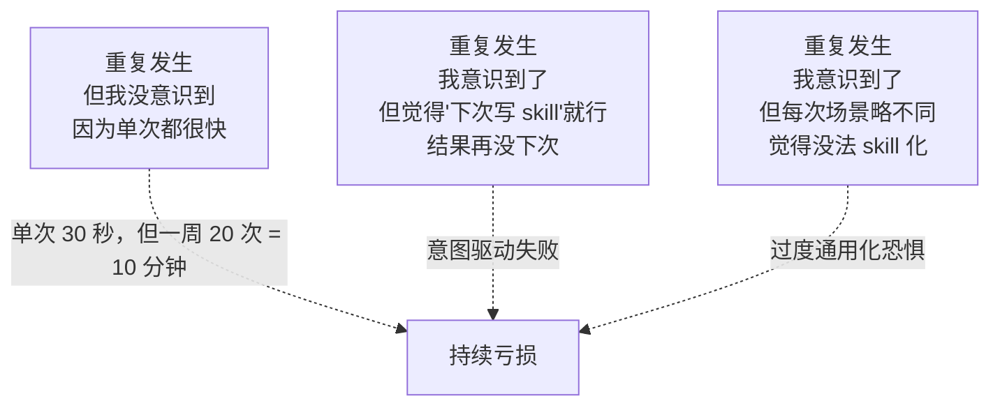
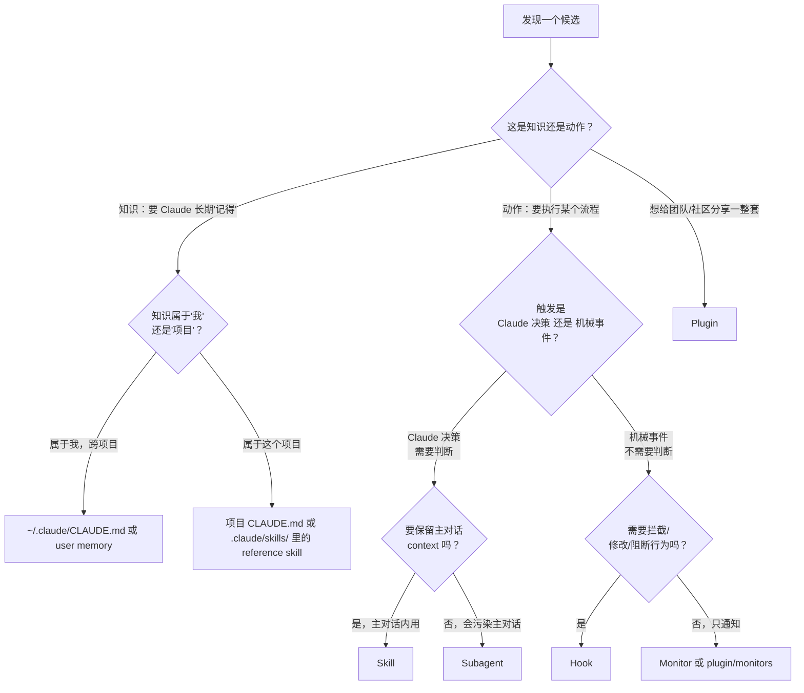

# 识别自动化机会的方法论

> 最后整理: 2026-06-02 | 来源: 黄佳《Claude Code 工程化实战》课程提出的元问题 + 个人实践沉淀

> 关联: [Skills 渐进式披露架构](./Skills 渐进式披露架构.md) — skill 是自动化的主要载体
> 关联: [Hooks 事件全景与拦截机制](./Hooks 事件全景与拦截机制.md) — hook 是机械化自动化的兜底
> 关联: [子智能体（subagents）机制与实战](./子智能体（subagents）机制与实战.md) — subagent 是上下文隔离类自动化
> 关联: [Harness Engineering：AI Agent 时代的工程范式](./Harness Engineering：AI Agent 时代的工程范式.md) — 自动化是约束工程的"上游"

---

## §1 问题定位

黄佳老师在课程里抛出的问题：

> "你工作中有哪些重复性任务可以通过 Commands 或 Skills 自动化？"

这其实是个**元能力**的训练问题。技术上 Commands/Skills/Hooks 怎么写，文档都写了——但**识别"哪些事情值得自动化"是个独立的、容易缺位的能力**。

很多程序员的真实困境不是"不会写 skill"，而是"想不起来这件事其实可以 skill 化"。**这是观察能力，不是技术能力。**

---

## §2 为什么"识别"这么难

三个心理障碍：



| 障碍 | 反例 |
|------|------|
| **单次成本太低** | "我只是再问一次 'how to use git rebase'，半秒就发 prompt 了" → 累计一周 50 次都没意识到 |
| **意图驱动失败** | "下次再写 skill" → 没有下次 |
| **过度通用化恐惧** | "每次场景略不同" → 其实 80% 一样 |

---

## §3 五种实操观察法

### 3.1 复述检测法（最简单）

> 向 Claude Code 描述任务时，**如果听到自己开头几句话和上次/上上次几乎一样**——就是信号。

具体步骤：
1. 提交 prompt 后，**回头看一眼自己刚写的 prompt 开头 20 字**
2. 这周内类似 prompt 出现过吗？
3. 出现过 ≥3 次 → skill 候选

**例子**：
- "读一下 INDEX.md 然后告诉我..." → 出现 5 次 → skill `/audit-index`
- "看看 server.js 和 lib.js 然后..." → 出现 3 次 → skill `/server-context`

### 3.2 三次法则（最铁律）

```
第 1 次手动做 → 没事
第 2 次手动做 → 留意一下
第 3 次手动做 → 必须 skill / command / hook 化
```

不要再想"等以后"。第 3 次发生时立刻动手——**因为你已经证明这不是一次性事件**。

写不下手时用 5 分钟下限：5 分钟做不出来就先记到 `kb/实战/自动化候选.md`，每周末统一处理。

### 3.3 倒序考古（事后比预测准）

打开你的 shell history 或 Claude Code transcript，**用红笔标出**任何看着觉得"这操作我做过 N 次"的。

```bash
# Shell history TOP 30
history | awk '{$1=""; print}' | sort | uniq -c | sort -rn | head -30
```

```bash
# Claude Code 历史（如果保留了 session log）
ls ~/.claude/session-logs/ | xargs grep -h "^>" | sort | uniq -c | sort -rn | head -30
```

**为什么这比预测准**：你"预测自己将重复什么"的能力很差（脑补未来），但"看自己过去做过什么"的判断很准（数据说话）。

### 3.4 Stop hook 自动收集

在 Stop hook 里记录每次会话的"用户首条 prompt"+"主要动作"：

```bash
# ~/.claude/hooks/log-prompt.sh （UserPromptSubmit hook）
#!/bin/bash
INPUT=$(cat)
PROMPT=$(echo "$INPUT" | jq -r '.prompt | .[0:100]')  # 前 100 字
echo "{\"date\":\"$(date -u +%Y-%m-%dT%H:%M:%SZ)\",\"prompt\":\"$PROMPT\"}" \
  >> ~/.claude/usage-log.jsonl
exit 0
```

周末跑：

```bash
jq -s 'group_by(.prompt | .[0:30]) | map({pattern:.[0].prompt[0:30], n:length}) | sort_by(-.n)' \
  ~/.claude/usage-log.jsonl | head -20
```

**输出 TOP 20 重复 prompt pattern**——直接的自动化候选清单。

### 3.5 触发器思维

观察**机械触发关系**：A 总是跟着 B 发生。这是 hook 的天然候选。

| 触发器 | 跟随动作 | 该自动化方式 |
|--------|---------|-----------|
| commit 完成 | 总要看 status 确认 | Stop hook 自动跑 `git status` |
| test 失败 | 总要看 log 找 root cause | PostToolUse + 失败时自动 print 关键 log |
| 新文件创建 | 总要校验 frontmatter | PreToolUse Write/Edit + 校验脚本 |
| 改完 README | 总要更新 TOC | PostToolUse Edit + matcher README.md + 重生成 TOC |
| 退出 session 前 | 总要 push | Stop hook ≥N commits 未 push 自动 push |

**关键**：触发器思维比"任务思维"更接近 hook 本质——hook 是"在 X 之后/之前 总是要 Y"。

---

## §4 工具决策树：自动化对应到哪种工具

不同信号 → 不同工具。**搞错工具是浪费**。



### 几个常见误判

| 错误选择 | 应该是 | 为什么 |
|---------|-------|--------|
| 用 hook 实现"每次写代码前提醒用 TDD" | skill（[kb-tdd-discipline](.claude/skills/kb-tdd-discipline/SKILL.md)） | 这是要"教 Claude 怎么做"，不是阻断机械行为 |
| 用 skill 实现"commit 后自动 push" | hook（Stop） | 这是机械触发，不需 Claude 判断 |
| 用 hook 实现"对外接 API 用 OAuth" | CLAUDE.md / skill | 这是规则知识，不是阻断行为 |
| 用 skill 实现"调一个 API 服务" | MCP | MCP 才是工具/数据接入的标准方式 |
| 用 subagent 实现"每次回答前 check 一下 best practice" | skill | subagent 浪费——这是要给主对话加规则 |
| 用 hook 实现"分析这个长 log" | subagent | hook 不能跑 LLM；subagent 才隔离 context |

---

## §5 候选清单：怎么把"它"变成可执行 todo

发现候选后，按下面表格分类记录（建议放 `kb/实战/自动化候选.md`）：

| 列 | 内容 |
|----|------|
| 候选描述 | 一句话说"什么事我重复做" |
| 发生频次 | 每周/每月几次（数据，不是估计） |
| 单次时长 | 平均花多少分钟 |
| 累计成本 | 频次 × 时长（按周算） |
| 工具选择 | skill / hook / subagent / MCP / plugin |
| 自动化难度 | trivial / easy / medium / hard |
| 优先级 | 累计成本 / 难度 = ROI |
| 下次行动 | 写出来或推迟到 X 时 |

**只填累计成本 > 30 分钟/周且难度 ≤ medium 的**。其他算"忍受 cost"，不值得。

---

## §6 本项目（ans-ai-auto-notes）的候选清单

按 §5 表格，**当前还没自动化但应该考虑的**：

| 候选 | 频次/周 | 单次 | 累计 | 工具 | 难度 | 优先级 | 行动 |
|------|--------|------|------|------|------|--------|------|
| 新建 md 时校验 frontmatter title = 文件名 | 5-10 次 | 30s | 5 min | **PreToolUse hook（Write）** | easy | ⭐⭐⭐ | 写！ |
| 课程笔记追加时自动 link 到对应专题文件 | 3 次 | 1 min | 3 min | skill `/append-to-course` | easy | ⭐⭐ | 写 |
| 沉淀新主题前查 INDEX.md 看是否已有相关文件 | 2-3 次 | 1 min | 2-3 min | skill `/check-existing` | trivial | ⭐⭐ | 写 |
| commit message 写 conventional 前缀的小检查 | 10+ 次 | 10s | 1.7 min | 已有 auto-commit-discipline skill | — | ✓ 已自动化 |
| 看哪个 timeline week 还没填 | 1 次 | 2 min | 2 min | skill `/timeline-status` | easy | ⭐ | 推迟 |
| Mermaid 图渲染后人工对比 ASCII 草图 | 2-3 次 | 1 min | 2-3 min | 难 skill 化（视觉判断） | hard | ❌ | 忍受 |

**已经自动化的盘点**（作为对比，理解哪些已被覆盖）：

| 已自动化 | 用什么 |
|----------|------|
| memory 14 天过期检查 | SessionStart hook |
| INDEX.md 与 kb/ 数量一致性 | Stop hook + check-overview.js |
| 退出前格式校验 | Stop hook + lint.sh |
| 中文文件名 = title 验证 | arch-lint.sh（SessionStart） |
| ≥5 commits 未 push 自动 push | Stop hook |
| 写 kb/ 时自动加载内容风格规则 | kb-content-style skill |
| 修 scripts/ 时自动加载 TDD 规则 | kb-tdd-discipline skill |
| 完成一批变更立即 commit | auto-commit-discipline skill |

---

## §7 训练这种意识的"日常练习"

### 7.1 周末 10 分钟例行

每周日花 10 分钟做：
1. `history | tail -300` 看本周敲过什么命令
2. `ls ~/.claude/session-logs/` 看本周和 Claude 聊过什么
3. 找出 1-2 个候选，更新 `kb/实战/自动化候选.md`
4. ≥3 周还在清单里没动 → 强制本周做完

### 7.2 "无聊就是信号" 启发式

如果做某件事的过程中，**你脑子里冒出"好烦啊又来一遍"**——这就是身体在告诉你这是个自动化候选。

不要等"理性分析"。先记到候选清单。

### 7.3 跟自己复盘："为什么这次还在手动"

每次手动做一件应该自动化的事时，问自己：
- 当时是不是觉得"算了下次再说"？
- 当时是不是觉得"今天没空"？
- 当时是不是觉得"还不确定值不值得"？

**这三个答案都是耍流氓**。真正的原因通常是：你不知道用什么工具（决策树没掌握）或者你不会写。这两个原因都能解决。

### 7.4 偷别人的 skill

最有效的学习——直接看别人写的 skill。
- 看 superpowers 仓库的所有 skill
- 看本项目 `.claude/skills/` 里的 3 个 skill
- 装一两个社区 plugin，进 `~/.claude/plugins/<name>/skills/` 翻

**模式比规则容易学**。看 10 个 skill 你就有感觉了。

---

## §8 反向：什么时候**不该**自动化

不是所有重复都该消灭。**两类要保留**：

### 8.1 "正念" 类操作

每次手动做能强化你对系统的理解。

例子：
- 每周手动跑 `git log --since='1 week ago' --oneline` 看自己改了什么 → 帮你保持对项目状态的感知
- 每次手动看 `manifest.json` 检查新文件分类 → 帮你形成对知识库版图的脑图

自动化掉这些 = 失去内省机会。

### 8.2 "稀缺触发" 类操作

频次低于"每月 1 次"的，自动化的维护成本可能超过收益。

例子：
- 季度性的 memory 大清理
- 半年一次的 plan 复审
- 偶尔的目录重组

这些**保留为 ad-hoc 流程 + 检查清单**（写在某个 SKILL.md 的 reference 里）比 hook 化更好。

---

## §9 一句话总结

> **每次你向 AI 说"这就像上次那样……"——按下暂停键，问自己：上次到底什么样子？该被记进 skill 吗？**

自动化能力不是工具能力，是**注意力训练**。注意自己什么时候在重复，比学会怎么写 hook 更重要。
