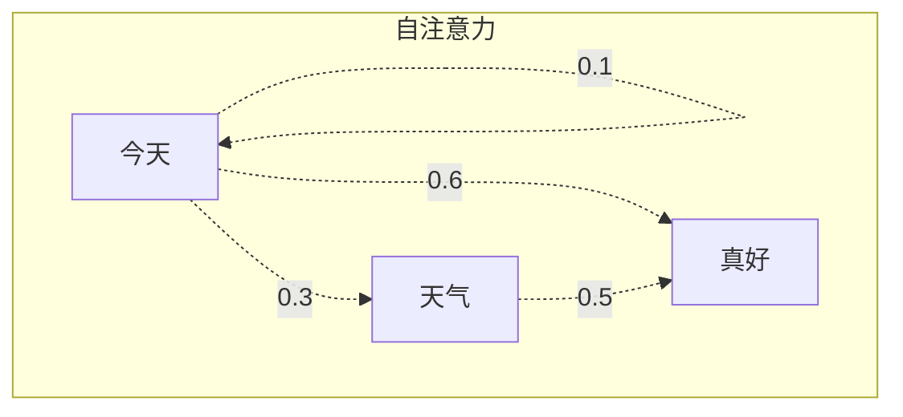

> 最后整理: 2026-05-21 | 来源: AI 对话自动沉淀

## 2026-05-21 - 什么是大语言模型（LLM）？

### 一句话版本

大语言模型 = 一个超大的"下一个字预测器"。你给它前半句话，它猜后半句。

### 核心原理图

```mermaid
graph LR
    A[输入: "今天天气"] --> B[Transformer 模型]
    B --> C[概率分布]
    C --> D[输出: "真好"]
    
    style B fill:#f9f,stroke:#333
```

### 为什么叫"大"？

| 模型 | 参数量 | 类比 |
|------|--------|------|
| GPT-2 | 1.5B | 一本百科全书 |
| GPT-4 | ~1.8T | 整个图书馆 |
| Claude | 未公开 | 同量级 |

### Demo：Token 化过程

```python
# 文本不是一个字一个字处理的，而是切成 token
text = "今天天气真好"
tokens = tokenizer.encode(text)
# tokens ≈ [12345, 67890, 11111]  每个 token 是一个子词
```

### 关键概念 QA

**Q: LLM 是"理解"语言还是"模仿"语言？**

A: 严格来说是统计模仿——它学会了语言的模式，但是否"理解"仍有争议。实用角度看，效果上等价于理解。

---

## 2026-05-21 - Transformer 自注意力机制

### 直觉类比

想象你在读一篇文章，读到"它"的时候，你的大脑会自动回溯前文找到"它"指代什么。自注意力机制做的就是这件事——让每个词"看到"序列中所有其他词。



> 关联: ../计算机基础/（如有图灵机相关笔记可在此链接）
