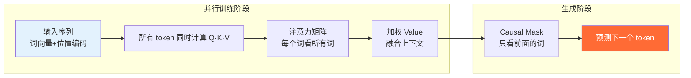

# Transformer 架构

> 最后整理: 2026-05-04 | 来源: 多轮对话

> 关联: [我看见的世界 — 李飞飞](<../../../读书笔记/我看见的世界 — 李飞飞.md>) — 阅读上下文与历史脉络

## 一句话定位

2017 年 Google 论文 "Attention is All You Need" 提出。核心是**"让每个词直接看到句子里所有其他词"**——抛弃 RNN 的串行传递，所有词同时互相看，靠自注意力（Self-Attention）决定谁对谁重要。

---

## 1. 为什么 RNN 不够用

```
RNN 方式（串行传递）:
"那只" → "猫" → "因为" → "它" → "饿了" → "所以" → "跑到了" → "厨房"
  ↓        ↓        ↓        ↓        ↓        ↓         ↓         ↓
 h₁  →   h₂  →   h₃  →   h₄  →   h₅  →   h₆  →    h₇  →    h₈
                                                        ↑
                                "跑"读到这，关于"猫"的记忆(h₂)已经很淡了
```



RNN 两个硬伤：
- **串行**：h₇ 必须等 h₆ 算完，h₆ 必须等 h₅ 算完 → GPU 并行能力浪费
- **长距离衰减**：每传一步梯度乘一个系数，传 300 步梯度归零 → 长文本学不动

---

## 2. Transformer 的核心洞察：不传了，直接问

```
Transformer 方式（并行查询）:
                  ┌─────────────────────────────┐
                  │  "跑" 同时看所有词:           │
                  │                              │
                  │  "猫"     0.72 ← 强相关！     │
                  │  "厨房"   0.18               │
                  │  "饿了"   0.06               │
                  │  "那只"   0.04               │
                  └─────────────────────────────┘

无论"猫"和"跑"之间隔了多少个词，关联度都是一次点积算出来的。
```

---

## 3. 自注意力（Self-Attention）：公式拆解

### 3.1 三个角色：Query、Key、Value

对每个词，用三套共享的权重矩阵生成三个向量：

```
每个词的向量 ──┬── × W_Q ──→ Query  (查询向量: "我在找谁？关联什么？")
              ├── × W_K ──→ Key    (钥匙向量: "我是谁？我有什么特征？")
              └── × W_V ──→ Value  (值向量:   "我的实际内容是什么？")
```

W_Q、W_K、W_V 是全网络共享的，和 CNN 的卷积核、RNN 的 W_xh 一样——训练出来的。

### 3.2 注意力分数：Q 和 K 的匹配

```
例: d_k = 4 (Key 的维度，实际模型通常用 64)

"跑"的 Query = [0.3, -0.2, 0.5, 0.1]
"猫"的 Key   = [0.4, -0.1, 0.3, 0.2]

点积 = 0.3×0.4 + (-0.2)×(-0.1) + 0.5×0.3 + 0.1×0.2
     = 0.12 + 0.02 + 0.15 + 0.02
     = 0.31

除以 √d_k = √4 = 2:  0.31/2 = 0.155  ← 缩放到合理范围
经过 softmax 后:      0.155 → 某个归一化权重
```

为什么要除以 √d_k？因为 d_k 很大时（比如 64），点积会很大，softmax 会变得极端（趋近于 0 或 1），梯度消失。除以 √d_k 保持数值稳定。

### 3.3 完整计算流程

```
输入句子: "那只猫饿了"

Step 1 — 对每个词生成 Q, K, V:

            Q              K              V
  "那只" [0.3,-0.1]  [0.2, 0.4]   [0.5,-0.2]
  "猫"  [0.5, 0.2]  [0.1,-0.3]   [0.8, 0.1]
  "饿了" [0.1, 0.4]  [0.3, 0.2]   [0.3, 0.6]

Step 2 — 计算注意力矩阵 (Q × K^T / √d_k):

                "那只"  "猫"   "饿了"
  "那只"的Q  [  0.31    0.12   0.25  ]
  "猫"的Q   [  0.18    0.42   0.35  ]   ← 每行是一个词"看"所有词
  "饿了"的Q [  0.22    0.28   0.38  ]

Step 3 — Softmax 归一化 (每行变成概率分布):

                "那只"  "猫"   "饿了"
  "那只"     [  0.42    0.28   0.30  ]
  "猫"       [  0.22    0.45   0.33  ]  ← "猫"对自己关注最多 (0.42)
  "饿了"     [  0.25    0.32   0.43  ]

Step 4 — 用注意力权重加权 Value:

  "猫"的新表示 = 0.22 × V("那只") + 0.42 × V("猫") + 0.33 × V("饿了")
              = 0.22×[0.5,-0.2] + 0.42×[0.8,0.1] + 0.33×[0.3,0.6]
              = [0.11,-0.04] + [0.34,0.04] + [0.10,0.20]
              = [0.55, 0.20]  ← 这个新向量融合了全句上下文
```

每个词都经过 Step 4，得到一个新的向量——这个新向量不再只是"这个词本身"，而是"这个词 + 它和全句所有词的关系"。

**所有词同时算，不需要等上一个。**

---

## 4. 多头注意力（Multi-Head Attention）

单个注意力头可能只关注一种关系（比如语法关系）。多头注意力就是用多套不同的 W_Q、W_K、W_V，同时从不同角度做注意力：

```
Head 1 (W_Q¹, W_K¹, W_V¹): 关注语法结构
  → "跑"高关注"猫"（主谓关系）

Head 2 (W_Q², W_K², W_V²): 关注语义内容
  → "跑"高关注"厨房"（动作的目的地）

Head 3 (W_Q³, W_K³, W_V³): 关注修饰关系
  → "猫"高关注"那只"（指代关系）

...

8 个头的输出拼接起来 → 再过一层线性变换 → 融合成一个向量
```

**关键维度约束**：每个头的输出维度 = `d_model / h`（原始 Transformer：d_model=512, h=8, 每头 64 维）。
- 拼接 8 个头：8 × 64 = 512 → **拼接后维度刚好等于 d_model**
- 最后的线性变换矩阵 W^O 是 (d_model × d_model)，作用不是降维（维度本来就对），而是把"独立学到的多视角信息"做加权混合，让不同头的输出能互相组合

**不同头的分工不是人为分配的**——和 CNN 的多个卷积核一样，从头随机初始化出发，梯度下降驱动各自占据不同的"生态位"。

---

## 5. 位置编码（Positional Encoding）

Transformer 并行处理所有词，不知道谁在前谁在后。需要手动注入位置信息：

```
"猫 吃了 鱼" vs "鱼 吃了 猫" → 词袋相同，意思相反

位置编码: 给每个位置一个唯一的信号向量
  位置 1: [0.0, 1.0, 0.0, 0.04, ...]
  位置 2: [0.8, 0.6, 0.0, 0.08, ...]
  位置 3: [0.9, 0.1, 0.0, 0.12, ...]

词向量 + 位置向量 = 最终的输入
 [0.2, 0.5, ...] + [0.0, 1.0, ...] = [0.2, 1.5, ...]
```

原始论文用正弦/余弦函数生成（有数学优雅性）。**截至 2026 年，主流 LLM 几乎清一色使用 RoPE（旋转位置编码）**——LLaMA 系列、Qwen、Claude、GPT-4 类模型都是；少数模型用 ALiBi（如早期 BLOOM）。BERT/GPT-2 时代的"可学习位置嵌入"已经基本不再使用。核心目的都一样：**给并行赋予顺序**，但 RoPE 在长上下文外推时表现明显更好，这也是它一统江湖的原因。

---

## 6. Transformer Block 的完整结构

```
        输入 (词向量 + 位置编码)
                    │
                    ▼
    ┌───────────────────────────────┐
    │   Multi-Head Self-Attention   │  ← "每个词和其他所有词交流"
    └───────────────┬───────────────┘
                    │
                    ├──→ + 残差连接 ──→ LayerNorm  (Add & Norm)
                    │
                    ▼
    ┌───────────────────────────────┐
    │     Feed-Forward Network      │  ← "每个词独自思考（同样的变换）"
    └───────────────┬───────────────┘
                    │
                    ├──→ + 残差连接 ──→ LayerNorm  (Add & Norm)
                    │
                    ▼
              输出 → 送入下一个 Block
```

堆 N 层这样的 Block（GPT-3 有 96 层），每一层都在上一层的表示之上再加工一轮。

残差连接（Add）：把输入直接加到输出上，防止深层网络梯度消失。LayerNorm：把每个样本的特征归一化，稳定训练。

---

## 7. 三类架构

| 架构 | 代表模型 | 注意力方式 | 擅长的任务 |
|------|---------|-----------|-----------|
| Encoder-only | BERT | 双向（每个词能看到前后所有词） | 分类、情感分析、NER |
| Decoder-only | GPT, Claude | 单向（每个词只能看到它之前的词） | 文本生成、对话 |
| Encoder-Decoder | T5, BART | Encoder 双向理解输入，Decoder 单向生成输出 | 翻译、摘要 |

ChatGPT/Claude 本质是巨大的 Decoder-only Transformer——给定上文，不断预测下一个最可能的词。

---

## 8. 为什么 Transformer 是大模型的底座

Transformer 之前，扩大模型规模收益递减。Transformer 的架构特性改变了这一局面：

| 特性 | 为什么能支持 Scale |
|------|-------------------|
| **天然并行** | Attention 所有词同时算 → GPU/TPU 利用率拉满 → 训练快 = 允许更大模型 |
| **长距离建模** | 任意两词 O(1) 关联 → 丢进去的书越多，模型越受益（不是越混乱） |
| **架构简洁** | 就 Attention + FFN 两个组件重复堆 → 堆 96 层不需要重新设计 |
| **通用性** | 同一套架构处理文本、图像（ViT）、语音、代码 → 多模态融合的基础 |

这三样合在一起，产生了 **Scaling Law**：模型越大 + 数据越多 → 能力越强，而且这个趋势没有明显的天花板。

---

## 9. 计算复杂度：O(n²) 的代价

### 9.1 为什么是 O(n²)

注意力矩阵是方的——每个词都要和所有其他词算一次点积：

```
序列长度 n=10:     10×10 = 100 次点积       → 不痛不痒
序列长度 n=1,000:  1,000×1,000 = 10⁶ 次点积  → 还行
序列长度 n=100,000: 10⁵×10⁵ = 10¹⁰ 次点积    → 爆了（一本书的篇幅）
序列长度 n=1,000,000: 10¹² 次点积             → 完全不可行（一个代码库）
```

序列翻一倍，计算量翻四倍。显存也一样——注意力矩阵要完整存着。

### 9.2 那为什么 Transformer 还是赢了 RNN？

```
RNN:  O(n) 计算量，但每一步等上一步 → 1000 步串行
      实际训练 1000 token ≈ 1000 × 单步时间

Transformer: O(n²) 计算量，但所有步同时算 → 1 步并行
             实际训练 1000 token ≈ 1 × 单步时间
```

在 GPU 上，并行 O(n²) 跑得比串行 O(n) 快得多——直到 n 大到真的算不动为止。

**本质：用计算复杂度换关联质量 + 并行性。** RNN 的串行瓶颈是架构级的，堆 GPU 解决不了。Transformer 的 O(n²) 是计算级的，堆 GPU + 算法优化能缓解。

### 9.3 现代模型的优化方案

| 方案 | 思路 | 效果 | 代表 |
|------|------|------|------|
| **Flash Attention** | 不分块算完整矩阵，利用 GPU SRAM 减少显存读写 | 显存从 O(n²) 降到接近 O(n)，速度快 2-4 倍 | 几乎所有现代模型 |
| **滑动窗口** | 每个词只看周围 k 个词 | O(n×k) 替代 O(n²) | Mistral |
| **分组注意力 (GQA)** | 多个 Query 头共享同一组 Key/Value | KV 缓存减少 4-8 倍 | LLaMA 2/3, Claude |
| **稀疏注意力** | 只算部分位置，跳过不重要的 | 计算量显著降低 | GPT-3 部分层 |
| **状态空间模型** | 完全放弃注意力，回归类似 RNN 的 O(n) 思路 | 线性复杂度，但关联质量待验证 | Mamba, RWKV |

**一个具体数字：** 70B 参数模型处理 128K 上下文，原始自注意力需要 ~64GB 显存只存注意力矩阵。Flash Attention 能压到 ~8GB。

---

## 10. 与 CNN / RNN 的核心区别

| 维度 | CNN | RNN | Transformer |
|------|-----|-----|-------------|
| 擅长处理 | 图像/空间 | 序列（短） | 序列（长） |
| 核心机制 | 卷积核滑动 | 循环隐藏状态 | 自注意力 |
| 计算方式 | 空间并行 | 逐时间步串行 | 全并行 |
| 长距离依赖 | 不适用 | 弱（梯度消失） | 强（O(1) 关联） |
| 架构复杂度 | 卷积+池化+全连接 | 单递归单元 | Attention+FFN 重复堆 |
| 代表模型 | ResNet, AlexNet | LSTM 机器翻译 | GPT-4, Claude, BERT |

> 延伸: [llm](../大模型/LLM（大语言模型）.md) — Transformer Decoder 如何堆成 LLM | [llm-prompt-rag](<../大模型/Prompt 与 RAG.md>) — 如何使用大模型 | [llm-agent-mcp](<../大模型/Agent 与 MCP.md>) — Agent 与工具生态
