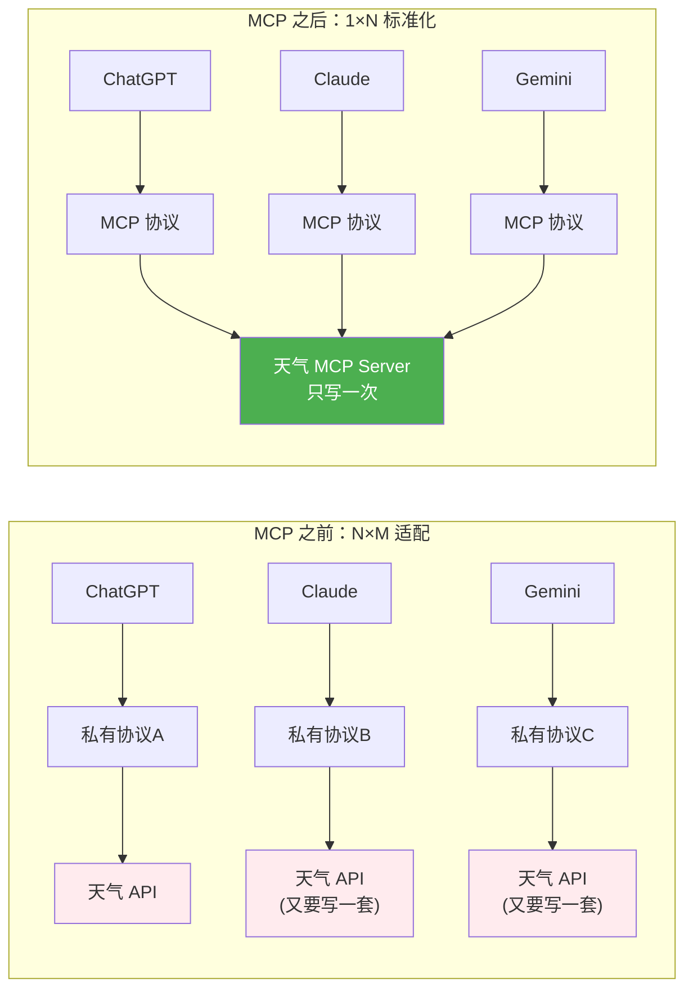

# Agent 与 MCP 生态

> 最后整理: 2026-05-05 | 来源: 多轮对话

## 一句话定位

Agent 是"能调用工具、多步循环完成任务"的 LLM 应用形态。MCP 是连接 Agent 和外部工具的开放协议。微调是让通用模型学会你的领域。

> 关联: [llm](./llm.md) — LLM 核心原理 | [llm-prompt-rag](./llm-prompt-rag.md) — Prompt 与 RAG 体系 | [ai-agent-tools](../应用生态/ai-agent-tools.md) — Agent 工具生态对比 | [claude-code-architecture](../应用生态/claude-code-architecture.md) — Claude Code 整体架构与工作流程

---

## 1. Agent（智能体）：让 LLM 能做事

### 1.1 普通 LLM vs Agent

```
普通 LLM:
  你: "帮我查一下今天北京天气"
  LLM: "抱歉，我无法获取实时数据"

Agent:
  你: "帮我查一下今天北京天气"  
  Agent 思考: 用户需要实时天气 → 我应该调用天气 API
  Agent 动作: 调用 weather_api("北京", "2026-05-04")
  收到结果: {"晴", "15°C-25°C"}
  Agent 输出: "今天北京晴天，气温 15°C 到 25°C。"
```

### 1.2 Agent 的核心循环

```
        ┌──────────────────────────┐
        │     Agent 循环             │
        │                          │
        │  ┌─────────┐             │
        │  │  思考    │ ← LLM 分析当前状态，决定下一步
        │  └────┬────┘             │
        │       │                  │
        │       ▼                  │
        │  ┌─────────┐             │
        │  │  行动    │ → 调用工具 (搜索/计算/API/写文件...)
        │  └────┬────┘             │
        │       │                  │
        │       ▼                  │
        │  ┌─────────┐             │
        │  │  观察    │ ← 工具返回结果
        │  └────┬────┘             │
        │       │                  │
        │       ▼                  │
        │  任务完成？ → 是 → 输出结果
        │       │                  │
        │       否 → 回到"思考"    │
        └──────────────────────────┘
```

### 1.3 具体例子：订机票 Agent

```
你: "帮我订一张 5 月 10 号北京飞上海的机票，要早上的航班"

Agent 循环:
  Round 1: 思考(需要搜航班) → 动作(search_flights) → 观察(15个航班)
  Round 2: 思考(筛选早上的) → 动作(输出候选列表) → 观察(用户选CA1234)
  Round 3: 思考(需要下单)   → 动作(book_flight)   → 观察(订单创建成功)
  输出: "已为您预定 CA1234，5月10日 08:30 北京→上海，订单号 ORDER-8842。"
```

### 1.4 Agent 的关键：Function Calling（函数调用）

**Function Calling 是 LLM 的一种"输出格式能力"——LLM 不会真的调用函数，它只是输出一个结构化的 JSON 说"我想调这个函数"。**

```
用户: "北京今天天气怎么样？"

LLM 内部推理: "我不知道实时天气，但我可以调一个天气查询函数"
LLM 输出（不是文字回复，是 JSON）:
{
  "function_call": "getWeather",
  "arguments": {"city": "北京", "date": "2026-05-04"}
}

框架层（Spring AI / LangChain）收到这个 JSON:
  → 找到 getWeather 的实现（本地函数 / HTTP API / MCP 工具）
  → 真正执行: httpGet("https://weather-api.com/beijing")
  → 拿到结果: {"temp": 25, "weather": "晴"}

把结果塞回 LLM:
  "之前你说要查天气，结果回来了：25度，晴天"

LLM 最终输出:
  "北京今天晴天，气温 25°C，适合出门~"
```

**Function Calling ≠ MCP：**
- Function Calling = LLM 的能力（"如何决定调哪个工具"），是 LLM 输出的 JSON 格式
- MCP = 工具提供协议（"如何暴露工具"），是工具被找到和调用的标准化方式
- MCP 暴露的工具可以被 Function Calling 选中调用；但 Function Calling 也可以调非 MCP 的普通函数（你自己代码里 `@Bean` 注册的 Java 函数）

Agent 的能力取决于它能调用什么工具：

```
内置工具:
  - 搜索 (Google/Bing API)
  - 计算器 (精确算术)
  - 代码执行 (Python 沙箱)
  - 文件读写
  - 数据库查询

自定义工具:
  - 你的内部 API (查订单、发邮件、创建工单)
  - 第三方服务 (Slack、Jira、GitHub)
  - 浏览器自动化 (打开网页、填表单)
```

---

## 2. MCP（Model Context Protocol）：AI 界的 USB-C

### 2.0 MCP 解决了什么痛点



### 2.1 解决什么问题

```
之前: 每个 LLM 平台对接外部工具都是私有协议
  ChatGPT Plugins → OpenAI 私有协议
  Claude Tools    → Anthropic 私有格式  
  Gemini Tools    → Google 私有格式
  → 工具开发者要为每个平台写一套适配代码

MCP 之后:
  任何 LLM ←→ MCP 协议 ←→ 任何工具/数据源
  → 写一次 MCP Server，所有支持 MCP 的 LLM 都能用
```

### 2.2 架构：Client-Server

```
┌──────────────────────────────────────────────────┐
│                                                  │
│  ┌──────────┐    ┌──────────┐    ┌────────────┐  │
│  │ LLM Host │ → │ MCP      │ → │ MCP        │  │
│  │ (Claude) │    │ Client   │    │ Server A   │  │
│  └──────────┘    │ (协议层)  │    │ (文件系统)  │  │
│                  └──────────┘    └────────────┘  │
│                       │                          │
│                       │         ┌────────────┐   │
│                       ├────────→│ MCP        │   │
│                       │         │ Server B   │   │
│                       │         │ (Postgres) │   │
│                       │         └────────────┘   │
│                       │                          │
│                       │         ┌────────────┐   │
│                       └────────→│ MCP        │   │
│                                 │ Server C   │   │
│                                 │ (天气 API)  │   │
│                                 └────────────┘   │
└──────────────────────────────────────────────────┘
```

MCP Server 暴露三种能力：

| 能力 | 含义 | HTTP 类比 |
|------|------|-----------|
| **Resources** | 暴露数据（"我能读这些文件/数据库"） | GET |
| **Tools** | 可执行操作（"我能发邮件、查天气"） | POST |
| **Prompts** | 预定义 Prompt 模板（"我擅长代码审查"） | 静态资源 |

---

## 3. MCP 协议实现内幕

### 3.1 通信层：JSON-RPC 2.0

MCP 底层是 **JSON-RPC 2.0**，通过 stdio（标准输入输出）或 HTTP SSE 传输：

```
MCP Client                         MCP Server
    │                                   │
    │  → {"jsonrpc":"2.0",              │
    │     "method":"tools/list",        │  (发现工具)
    │     "id":1}                       │
    │                                   │
    │                    {"jsonrpc":"2.0",│
    │                     "id":1,        │
    │                     "result":{     │
    │                       "tools":[    │
    │                         {"name":"query_db",
    │                          "description":"执行SQL查询",
    │                          "inputSchema":{
    │                            "properties":{
    │                              "sql":{"type":"string"}
    │                            }}}]}}   │
    │                                   │
    │  → {"jsonrpc":"2.0",              │
    │     "method":"tools/call",        │  (调用工具)
    │     "params":{                    │
    │       "name":"query_db",          │
    │       "arguments":{               │
    │         "sql":"SELECT SUM(amount) │
    │          FROM orders              │
    │          WHERE date > '...'"}}    │
    │     "id":2}                       │
    │                                   │
    │                    {"jsonrpc":"2.0",│
    │                     "id":2,        │
    │                     "result":{     │
    │                       "content":[  │
    │                         {"type":"text",
    │                          "text":"销售额: ¥1,234,567"}
    │                       ]}}          │
```

### 3.2 Agent 怎么知道何时调用

Agent 不是"配置了 MCP 就自动会用"，分为两步：

```
Step 1: LLM 推理时
  系统 Prompt 中注入了工具列表:
  "你可以使用以下工具:
   - query_db(sql): 执行 SQL 查询
   - send_email(to, subject, body): 发送邮件"

  LLM 处理用户输入 → 判断"这需要查数据库" → 输出工具调用指令

Step 2: Agent 框架拦截
  框架检测到 LLM 输出的是工具调用 → 真正执行 MCP 请求
  → 收到结果 → 把结果重新注入对话 → LLM 继续生成最终回复
```

**MCP 只定义"怎么调用工具"的协议。LLM 什么时候调用、为什么调用——是 Agent 框架 + Prompt 驱动的。**

---

## 4. MCP 服务发现与自定义开发

### 4.1 怎么发现：配置文件，不是注册中心

**MCP 没有注册中心——通过 JSON 配置文件静态声明。**

```
~/.claude/claude_desktop_config.json:

{
  "mcpServers": {
    "postgres": {
      "command": "npx",
      "args": ["-y", "@anthropic/mcp-server-postgres", "postgresql://localhost/mydb"]
    },
    "my-tool": {
      "command": "java",
      "args": ["-jar", "/path/to/my-mcp-server.jar"]
    }
  }
}
```

启动时 Claude Code 读这个文件 → 对每个 Server 启动子进程 → 通过 stdio 建立 JSON-RPC 通道。

### 4.2 与 Dubbo 对比

| | Dubbo | MCP |
|------|-------|-----|
| 注册中心 | Zookeeper/Nacos | 无，JSON 文件静态配置 |
| 服务发现 | 动态注册+发现 | 启动时读文件，启动子进程 |
| 通信协议 | Dubbo 协议 (TCP) | JSON-RPC 2.0 (stdio/HTTP) |
| 接口定义 | Java Interface | JSON Schema (inputSchema) |
| 提供者 | Provider 注册到注册中心 | 子进程，由 Client 启动和管理 |

### 4.3 写一个 Java MCP Server（伪代码）

```java
public class MyMcpServer {
    public static void main(String[] args) {
        while (true) {
            String request = readLine(System.in);
            JsonRpcRequest req = parse(request);
            
            switch (req.method) {
                case "tools/list":
                    respond(new Tool[]{
                        new Tool("query_orders", "查询用户订单",
                            Map.of("userId", "string")),
                        new Tool("refund", "发起退款",
                            Map.of("orderId", "string", "amount", "number"))
                    });
                    break;
                    
                case "tools/call":
                    if (req.params.name.equals("query_orders")) {
                        List<Order> orders = db.query(
                            "SELECT * FROM orders WHERE user_id = ?",
                            req.params.arguments.get("userId"));
                        respond(orders);
                    }
                    break;
            }
        }
    }
}
```

本质就是：读 stdin → 解析 JSON-RPC → 执行业务逻辑 → 写 stdout。

### 4.4 Java 方案一：Spring AI MCP Server（推荐）

Spring AI 官方提供了 `spring-ai-starter-mcp-server`，直接把标注好的 Bean 暴露为 MCP 工具。和 Controller 共享 Service 层，不改原有代码。

**架构**：

```
人类/Web ──HTTP──→  Controller ──→ Service ──→ DB
                         ↑              ↑
Claude Code ──stdio──→ MCP Server ────┘
                         ↑
               @Tool 方法（新的入口，共享同一个 Service）
```

**依赖**（`pom.xml`）：

```xml
<dependency>
    <groupId>org.springframework.ai</groupId>
    <artifactId>spring-ai-starter-mcp-server-webmvc</artifactId>
    <version>1.0.0-M7</version>
</dependency>
```

**代码**——和 Controller 共享 Service：

```java
@RestController
public class OrderController {

    @Autowired
    private OrderService orderService;

    // ← 原有 HTTP 接口，不动
    @GetMapping("/api/orders")
    public List<Order> queryOrders(@RequestParam String userId) {
        return orderService.queryByUser(userId);
    }
}

// ← 新增 MCP 工具，共享同一个 Service
@Component
public class OrderMcpTools {

    @Autowired
    private OrderService orderService;

    @Tool(description = "根据用户ID查询订单列表，返回订单号、金额、状态")
    public List<Order> queryOrders(
        @ToolParam(description = "用户ID") String userId) {
        return orderService.queryByUser(userId);
    }

    @Tool(description = "根据订单号发起退款，返回退款单号")
    public String refundOrder(
        @ToolParam(description = "订单号") String orderId,
        @ToolParam(description = "退款金额(元)") double amount) {
        return orderService.refund(orderId, amount);
    }
}
```

启动类：

```java
@SpringBootApplication
@EnableMcpServer   // ← 加这一个注解
public class Application {
    public static void main(String[] args) {
        SpringApplication.run(Application.class, args);
    }
}
```

**配置 Claude Code**（`.mcp.json`）：

```json
{
  "mcpServers": {
    "order-service": {
      "command": "java",
      "args": ["-jar", "target/your-app.jar"]
    }
  }
}
```

### 4.5 Java 方案二：纯手写（零依赖）

不用任何框架。本质：`while(readLine) → switch method → 调 Service → writeLine`。

```java
public class McpServer {
    private static final ObjectMapper mapper = new ObjectMapper();

    public static void main(String[] args) throws Exception {
        BufferedReader in = new BufferedReader(new InputStreamReader(System.in));
        OrderService orderService = new OrderService();  // 或手动初始化 Spring

        String line;
        while ((line = in.readLine()) != null) {
            JsonNode req = mapper.readTree(line);
            String method = req.get("method").asText();
            int id = req.get("id").asInt();

            String response;
            if ("tools/list".equals(method)) {
                response = buildToolListJson(id);
            } else if ("tools/call".equals(method)) {
                response = handleCall(id, req, orderService);
            } else {
                response = errorJson(id, "unknown method: " + method);
            }

            System.out.println(response);
            System.out.flush();
        }
    }

    private static String handleCall(int id, JsonNode req, OrderService svc) {
        String name = req.get("params").get("name").asText();
        JsonNode args = req.get("params").get("arguments");

        Object result;
        if ("query_orders".equals(name)) {
            result = svc.queryByUser(args.get("userId").asText());
        } else if ("refund_order".equals(name)) {
            result = svc.refund(args.get("orderId").asText(), args.get("amount").asDouble());
        } else {
            result = Map.of("error", "unknown tool: " + name);
        }

        return """
        {"jsonrpc":"2.0","id":%d,
         "result":{"content":[{"type":"text","text":%s}]}}
        """.formatted(id, escapeJson(mapper.writeValueAsString(result)));
    }
    // buildToolListJson, errorJson, escapeJson 省略...
}
```

### 4.6 两个方案对比

| | Spring AI MCP | 手写 |
|------|-------------|------|
| 代码量 | `@Tool` 注解 + `@EnableMcpServer` | ~150 行样板 |
| Schema 生成 | 从方法签名 + `@ToolParam` 自动推断 | 手写 JSON Schema |
| 参数类型映射 | 自动（String→string, int→integer 等） | 手动从 JsonNode 提取 |
| 和现有 Controller 的关系 | 同名 Service，两个入口 | 同名 Service，两个入口 |
| 依赖 | 一个 starter | 零依赖 |
| 适合 | 生产，多工具 | 学习原理，1-2 个工具 |

### 4.7 和 Dubbo/Nacos 的对比

| | Dubbo + Nacos | MCP |
|------|-------------|-----|
| 注册中心 | Nacos 动态注册 | 无——JSON 文件静态声明 |
| 服务发现 | 启动时订阅注册中心 | 启动时读 `.mcp.json`，spawn 子进程 |
| 通信协议 | Dubbo 协议（TCP 长连接） | JSON-RPC 2.0 over stdio |
| 接口定义 | Java Interface | JSON Schema（由 `@Tool` 注解推断） |
| 提供者 | Provider 注册到 Nacos | 子进程，由 Client 管理生命周期 |
| 调用方式 | RPC 代理，透明调用 | Agent 框架收到 LLM tool_call → 发 JSON-RPC |

---

## 5. `@Tool` 注解的内部机制

### 5.1 启动阶段：做了什么

和 `@GetMapping` 是同类东西——标记方法为"外部可调用入口"。启动时三步：

```
① 扫描: ApplicationContext.getBeansWithAnnotation(Tool.class)
        → 找到所有带 @Tool 的 Bean 和它们的 public 方法

② 提取: 对每个 @Tool 方法反射读取:
   @Tool(description = "查询订单")          → tool.description
   @ToolParam(description = "用户ID")       → inputSchema.userId.description
   String userId                             → inputSchema.userId.type = "string"
   int amount                                → inputSchema.amount.type = "integer"

③ 注册: 存入 Map<String, ToolCallback>
   key = "queryOrders"
   value = (arguments) → method.invoke(bean, deserialize(args))
```

**Java → JSON Schema 类型映射**：

| Java 类型 | JSON Schema type |
|-----------|-----------------|
| String | `"string"` |
| int / Integer / long | `"integer"` |
| double / BigDecimal | `"number"` |
| boolean | `"boolean"` |
| List\<String\> | `{"type":"array","items":{"type":"string"}}` |
| 自定义 DTO | `{"type":"object","properties":{...}}` |

如果一个 `@Tool` 方法的参数是自定义 DTO，Spring AI 会递归展开其字段，自动生成完整的 JSON Schema。

### 5.2 工具发现：tools/list 流程

```
Claude Code 启动
  │
  ├─ 读 .mcp.json → 找到 command + args
  ├─ spawn 子进程 → Java 应用启动
  │     └─ Spring Boot init
  │          └─ @EnableMcpServer → 注册 MCP 端点
  │               └─ 扫描所有 @Tool → 构建注册表 (Map<String, ToolCallback>)
  │
  ├─ 发 tools/list ──stdin──→ {"method":"tools/list", "id":1}
  │                           │
  │                     Java  └─ 遍历注册表 → 生成工具列表 JSON → stdout
  │
  └─ 收到 [{"name":"queryOrders","description":"...","inputSchema":{...}}, ...]
       │
       └─ 注入 LLM System Prompt:
           "你可以使用以下工具:
            - queryOrders(userId): 查询订单
            - refundOrder(orderId, amount): 发起退款"
```

**LLM 看到的不是 Java 代码，是 `tools/list` 返回的 JSON Schema。**

### 5.3 完整请求链路：从你说一句话到方法被调用

```
你: "帮我查 user_id=123 的订单"
          │
          ▼
① LLM 推理（第 1 次，不出声）
   看到 System Prompt 里有工具 "queryOrders(userId)"
   → 判断: 用户要查订单，该调 queryOrders
   → LLM 输出 tool_call JSON（不是文字回复）:
     {"tool_calls":[{"function":{"name":"queryOrders",
                     "arguments":{"userId":"123"}}}]}

② Claude Code MCP Client 拦截
   拼 JSON-RPC:
   {"jsonrpc":"2.0","method":"tools/call","id":42,
    "params":{"name":"queryOrders","arguments":{"userId":"123"}}}

③ 通过 stdin → Java 子进程

④ Spring AI 收到 → 解析 method="tools/call"
   → 从注册表 Map 找到 "queryOrders" 的 ToolCallback
   → 反序列化 arguments → userId="123"
   → 反射调用: method.invoke(orderMcpTools, "123")

⑤ 你的 @Tool 方法执行
   queryOrders("123")
     → orderService.queryByUser("123")    ← 走到已有的 Service
       → SELECT * FROM orders WHERE user_id = '123'
         → 返回 List<Order> [Order#8842, Order#8843]

⑥ 序列化 → JSON → 装进 MCP 响应格式
   {"jsonrpc":"2.0","id":42,
    "result":{"content":[{"type":"text","text":"[{\"orderId\":8842,...}]"}]}}

⑦ stdout → Claude Code 收到结果

⑧ 把结果喂回 LLM（第 2 次推理）
   "之前你让我查的订单结果: 订单#8842 ¥299 已发货, 订单#8843 ¥158 待付款"

⑨ LLM 组织自然语言:
   "你共有 2 个订单: #8842 ¥299 已发货, #8843 ¥158 待付款"
```

**关键：每次工具调用 = LLM 被调了 2 次**（第 1 次决定调哪个工具，第 2 次把工具结果组织成自然语言）。如果对话涉及多个工具调用（先查订单 → 再发起退款），每一步都是一次独立的 LLM 推理 + 工具执行循环。

### 5.4 一句话总结

`@Tool` → 启动时反射扫描生成 JSON Schema → `tools/list` 返回给 LLM → LLM 决定调用 → 框架反射执行你标注的方法 → 结果序列化返回 → LLM 组织成自然语言。

和 Spring MVC 的 `@GetMapping` → DispatcherServlet → 反射调用 Controller 是同一条思路，只是协议从 HTTP 换成了 JSON-RPC over stdio。

```
L1: 基座模型 (Foundation Model)
    GPT-4, Claude, DeepSeek, Qwen, LLaMA
    → 纯文本进，纯文本出

L2: 对话产品 (Chat Product)
    ChatGPT, Claude.ai, 通义千问 App
    → 模型 + 聊天 UI + 多轮对话记忆

L3: Agent 框架 (Agent Framework)
    LangChain Agent, AutoGPT, CrewAI, Dify
    → 模型 + 工具调用 + 多步循环

L4: 垂直领域 Agent 产品  ← Claude Code 在这
    Claude Code (编程), Cursor (编程), Devin (编程), Harvey (法律)
    → 针对特定领域深度优化的完整 Agent

L5: 插件/技能系统  ← Superpowers 在这
    扩展 L4 产品的行为和工作流
```

### 5.1 Claude Code 工作原理

**Claude Code = 编程 Agent。** 内部结构和 Agent 循环完全一致：

```
Claude Code 内部循环:

  你: "帮我把这个 bug 修了"
      │
      ▼
  ┌─────────┐
  │  LLM    │ ← Claude 模型 (云端 GPU) — 分析任务，制定计划
  └────┬────┘
      │ "我需要先读代码找到 bug"
      ▼
  ┌──────────┐
  │ 工具执行  │ → Read/Grep/Bash/Edit/Write
  └────┬─────┘
      ▼
  观察结果 → 任务没完成 → 回到 LLM 继续思考
      │
      完成 → 输出结果
```

核心能力 = **Claude 模型**（推理，云端）+ **工具集**（Read/Write/Edit/Bash/Grep，本机执行）。

### 5.2 Claude Code 修 bug 的完整多轮流程

```
你: "帮我修 UserService 的 NPE bug"

┌─────────────────────────────────────────────┐
│ LLM 调用 #1: 理解任务                        │
│ 输出: "搜索 UserService"                    │
│ 工具: Grep("UserService")                   │
├─────────────────────────────────────────────┤
│ LLM 调用 #2: 看到搜索结果                    │
│ 输出: "读取 UserService.java"               │
│ 工具: Read("src/.../UserService.java")      │
├─────────────────────────────────────────────┤
│ LLM 调用 #3: 看到代码                        │
│ 输出: "第 42 行 NPE，我来改"                 │
│ 工具: Edit(第42行, 加 null 检查)             │
├─────────────────────────────────────────────┤
│ LLM 调用 #4: Edit 成功                       │
│ 输出: "跑测试验证"                           │
│ 工具: Bash("mvn test -Dtest=UserServiceTest")│
├─────────────────────────────────────────────┤
│ LLM 调用 #5: 测试通过                        │
│ 输出: "修复完成。总结: 42行加了null检查"       │
│ (不再调用工具，直接返回给用户)                │
└─────────────────────────────────────────────┘
```

**本质：LLM 思考 → 调用工具 → 观察结果 → 再思考 → 循环直到完成。** 每轮工具调用本地执行，不消耗 LLM token。

### 5.3 Skill 到底是什么：结构化配置包，不是 MCP

**Skill = 一个可复用的"能力模板包"**，内容就是三样东西：

| 组成部分 | 例子（`superpowers:systematic-debugging`） |
|---------|-------------------------------------------|
| **Prompt 片段** | "你是系统调试专家，遵循以下步骤..." |
| **行为规则** | "必须先复现 bug 再修改代码" |
| **工作流约束** | "步骤 1: 复现 → 步骤 2: bisect → 步骤 3: 写假设 → 步骤 4: 验证 → 步骤 5: 修复" |

**Skill 不具备任何"执行能力"**——不能执行 bash、不能读文件、不能调 API、不能做任何 I/O。它只是一个**纯文本的规则注入包**，被 Agent 框架加载后拼接到 System Prompt 里。

**Skill（文档型）vs Skill（Superpowers 型）**：
- 文档型 Skill：一本操作手册，你翻看后照着做（cheat sheet）
- Superpowers Skill：一个**技能芯片**，插进大脑后你自动会了这套流程——有明确的触发条件、优先级、工具链约束，被 Agent 框架识别后**主动改变行为模式**

```
没有 Superpowers:
  你: "帮我规划功能" → Claude Code 直接写代码 → 可能跑偏

有 Superpowers:
  你: "帮我规划功能"
    → brainstorming 技能: 探索 → 提问 → 设计 → 确认
    → writing-plans 技能: 写实现计划 → 确认
    → subagent-driven-development: 分派子 Agent 逐个实现
```

**Superpowers = Claude Code 的插件/技能系统。** 不是独立工具，是给 Claude Code 装"工作流"。本质是一套预定义的 Prompt 模板 + 工作流指令，告诉 Claude Code 在不同场景下应该怎么行为。

| | Claude Code | Superpowers |
|------|-------------|-------------|
| 是什么 | Agent 产品 (L4) | 插件/技能系统 (L5) |
| 独立运行 | 可以 | 不可以，依附 Claude Code |
| 提供什么 | LLM + 工具执行能力 | 预定义工作流 + 最佳实践 |
| 类比 | IDE | IDE 的插件 |

---

## 6. 微调（Fine-tuning）：让通用模型学你的领域

### 6.1 基座模型 vs 微调后模型

```
基座模型 (Base Model):
  训练数据: 互联网海量文本
  能力: 什么都会一点，什么都不精
  问题: 不懂你的业务术语

微调后模型 (Fine-tuned Model):
  在基座模型基础上，用你的特定数据再训练一小轮
  能力: 学会了你的领域知识、输出格式、语气风格
```

### 6.2 具体例子

```
基座模型面对客服:
  用户: "我的订单三天了还没发货"
  模型: "很抱歉听到这个，你可以联系客服..." ← 太泛了

微调后 (1000条真实客服对话训练):
  用户: "我的订单三天了还没发货"
  模型: "已为您查询，订单 #20260504-0032 状态为'待拣货'，
         预计明天发货。我已标记加急处理。是否需要修改收货地址？"
```

### 6.3 全量微调 vs LoRA

| 方式 | 做法 | 成本 |
|------|------|------|
| **全量微调** | 更新模型的全部参数 | 多张 A100/H100 GPU |
| **LoRA** | 只训练一小部分新增参数，原参数不动 | 一张消费级显卡 |

LoRA 的思路：不修改原模型权重，旁边挂两个小矩阵（A 和 B），只训练它们。效果接近全量微调，成本降几个数量级。

---

## 7. 五个概念的关系全景

```
                         ┌──────────────┐
                         │   用户输入     │
                         └──────┬───────┘
                                │
                         ┌──────▼───────┐
                         │   Prompt     │  ← "你现在是客服，可以查订单、退款..."
                         │   (指令)     │     告诉 LLM 有什么工具、怎么用
                         └──────┬───────┘
                                │
                         ┌──────▼───────┐
                         │     LLM      │
                         │  (大脑)      │
                         └──────┬───────┘
                                │
                   ┌────────────┼────────────┐
                   │            │            │
         输出文字回复    Function Calling    需要外部信息
         (直接回答)    (输出 JSON: "调XX")    但不知道该调谁
                   │            │            │
                   │    ┌───────▼───────┐    │
                   │    │ 工具怎么来的？ │    │
                   │    └───────┬───────┘    │
                   │            │            │
                   │   ┌────────┼────────┐   │
                   │   │        │        │   │
                   │ 本地函数  HTTP API  MCP │
                   │ (@Bean)  (REST)  (标准协议)
                   │   │        │        │   │
                   │   └────────┼────────┘   │
                   │            │            │
                   │    ┌───────▼───────┐    │
                   │    │   执行结果     │    │
                   │    └───────┬───────┘    │
                   │            │            │
                   │    ┌───────▼───────┐    │
                   │    │  结果喂回 LLM │    │
                   │    └───────┬───────┘    │
                   │            │            │
                   └────────────┼────────────┘
                                │
                         ┌──────▼───────┐
                         │   最终回复     │
                         └──────────────┘
```

### 概念对照表

| 概念 | 类比 | 在这个架构中的角色 |
|------|------|-------------------|
| **Agent** | 一个有手有脚、能自主决策的机器人 | 顶层概念，组合以下所有 |
| **Prompt** | 机器人的"大脑指令" | 告诉 LLM 干什么、怎么干、有什么工具可用 |
| **Skill** | 可插拔的"能力芯片" | 往 Prompt 注入一套规则 + 工作流 + 约束 |
| **Function Calling** | LLM 的"决策输出格式" | 不是调函数，是输出 JSON 说"我想调这个" |
| **MCP** | 机器人的"API 适配器层" | 统一标准去连接外部系统（暴露工具） |

### 具体例子：Claude Code 修 bug

```
Agent:  Claude Code 本身（能自主决策：读哪个文件、改哪里、跑什么测试）
Prompt: 系统 prompt "你是 Claude..." + 用户指令 "修复登录 bug"
Skill:  superpowers:systematic-debugging → 注入 "必须先复现再改代码" 等规则
Function Calling: LLM 输出 {"function": "bash", "args": {"cmd": "git log"}}
MCP:    暴露了 "执行 bash"、"读写文件"、"git" 等工具给 Agent
```

一个完整的实际产品通常是：**微调后的模型 + RAG + Agent 能力 + Skill 工作流 + 精心设计的 Prompt**。

```
例: 智能客服系统

  用户提问
     │
     ▼
  Prompt (含系统指令、用户画像、对话历史)
     │
     ▼
  RAG 检索 (产品知识库 → 找到相关文档)
     │
     ▼
  Agent 决策 (需要查订单号? 调退款 API? 还是直接回答?)
     │  ← Function Calling 输出 {"function": "queryOrder"}
     │  ← MCP 暴露 queryOrder 工具的实现
     ▼
  微调后的 LLM 生成回答
```

> 关联: [llm](./llm.md) — LLM 核心原理
> 关联: [llm-prompt-rag](./llm-prompt-rag.md) — Prompt 与 RAG 体系
