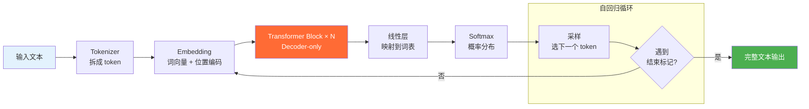

# LLM（大语言模型）核心原理

> 最后整理: 2026-05-06 | 来源: 多轮对话

> 关联: [我看见的世界 — 李飞飞](../../../读书笔记/我看见的世界.md) — 阅读上下文与历史脉络

## 一句话定位

LLM（Large Language Model）本质上是一个**巨大的 Decoder-only Transformer**——给它一段文本，它预测下一个最可能的词。一个词一个词地接下去，就形成了连贯的输出。

> **本文件聚焦 LLM 核心原理。** Prompt/RAG/向量数据库 → [llm-prompt-rag](./llm-prompt-rag.md) | Agent/MCP/微调/工具生态 → [llm-agent-mcp](./llm-agent-mcp.md)

---

## 1. 什么是 LLM：从 Transformer 到大模型

你已经理解了 Transformer 的 Decoder-only 架构（GPT/Claude 那一类）。LLM 就是把这个架构**做到极致**：

```
GPT-2  (2019):  15 亿参数,  40GB 训练数据
GPT-3  (2020):  1750 亿参数, 570GB 训练数据
GPT-4  (2023):  ~1.8 万亿参数 (推测), ~13 万亿 token 训练数据

参数越多 + 数据越多 → 能力越强, 且没有明显天花板 (Scaling Law)
```

**2025-2026 年的转向：稠密参数停滞、MoE 路线主导。** 单纯堆稠密参数的边际收益放缓，主流前沿模型（GPT-5、Claude Opus 4.x、Gemini 2.x、DeepSeek-V3、Llama 4）转向 **MoE（Mixture of Experts）架构**——总参数巨大、但每次推理只激活其中一小部分（如 DeepSeek-V3 总参数 671B、激活 37B；Llama 4 Scout/Maverick 同思路）。同样能力下推理成本和访存量大幅降低，定价能压到 70B 稠密模型的 50% 左右。

架构本身没变——还是 Attention + FFN 堆 N 层。变的是**规模 + 激活方式**。

```
Transformer Block × N

GPT-2:   N = 48
GPT-3:   N = 96
GPT-4:   N = 120 (推测)
```



**规模不只是量变，会引发质变——涌现能力（Emergent Abilities）：**

- 小模型（<10B）：能做翻译、摘要，但推理能力弱
- 中模型（10B-100B）：开始出现初步的逻辑推理
- 大模型（>100B）：突然会写代码、做数学题、多步推理、理解隐含意图

这些能力在训练数据中没有被显式标注过——纯粹是"见多了"自动涌现的。

---

## 2. 大模型都是 Transformer 吗？是"猜"的吗？

### 2.1 架构层面：是的

**GPT、Claude、Qwen（通义千问）、DeepSeek、LLaMA、Gemini、Mistral——全部是 Decoder-only Transformer。** 架构层面基本一样：

```
都是: 输入 → Embedding → Transformer Block × N → 输出下一个词的概率分布
差异主要在:
  - 训练数据的质量和配比
  - Tokenizer 设计（怎么分词）
  - 位置编码方案（RoPE vs ALiBi vs 正弦）
  - 注意力优化（GQA、滑动窗口等）
  - RLHF/DPO 对齐训练的方式
```

### 2.2 原理层面：也是的，但不只是"猜"

**技术上，它们都是"下一个词预测器"——给定前面的词，输出下一个词的概率分布。** 但把这种能力称为"猜"会严重低估它：

```
"猜"的误导:
  随机、蒙、没有理解只有概率 → 抛硬币

实际上:
  给定 "2x + 4 = 30, 2x = 26, x = "
  模型要在全部词汇中（~50000 个候选词），给 "13" 分配远超其他词的概率

  它为什么能做到？
  ┌─────────────────────────────────────────────┐
  │ 核心洞察:                                    │
  │ 在足够多的高质量文本上做"下一个词预测"，     │
  │ 会迫使模型内化理解能力。                     │
  │                                             │
  │ → 不是"为了理解而学"                        │
  │ → 而是"要填对空，就必须真懂"                 │
  └─────────────────────────────────────────────┘
```

**类比：** 让一个学生做一亿道完形填空，但填空材料里有数学推导、法律条文、代码调试、历史分析。他为了填对空，被迫学会了算术、理解了法律逻辑、掌握了代码语义。不是老师教的——是任务本身逼出来的。

```
Transformer 架构提供:
  - 处理长距离关系的能力（自注意力）
  - 并行训练的能力（Scaling 的前提）
  - 极简的堆叠结构（Attention + FFN 无限重复）

海量高质量数据提供:
  - 语言模式（语法、修辞）
  - 推理模式（归纳、演绎、类比）
  - 知识事实（历史、地理、科学）
  - 世界运转的规律（因果关系编码在文本叙事里）

两者叠加 → 涌现能力:
  推理、编程、翻译、分析、创作
  ↑ 没有一条能力是被显式编程进去的
  ↑ 全部是从"预测下一个词"这个唯一的训练目标中涌现出来的
```

**所以：是"猜"（概率预测），但不是"瞎猜"。** 这个"猜"的过程迫使模型构建了世界模型和推理能力——因为不真懂，就算不准。

> 关联: [transformer](../基础/transformer.md) — Transformer 架构详解
> 关联: [cnn](../基础/cnn.md) — CNN 分层特征的涌现，与此处的"能力涌现"是同一类现象

---

## 3. 因果推理与逐字生成：底层的两个关键机制

### 3.1 Causal Mask（因果掩码）：只准看过去

Decoder-only Transformer 训练时，不是让每个词看所有词——而是用一个三角形 Mask 限制它只能看"过去的词"：

```
训练时，输入 "那只猫因为它饿了所以跑到了厨房":

          那  只  猫  因  为  它  饿  了  所  以  跑  到  了  厨  房
   "那"   ✓   ✗   ✗   ✗   ✗   ✗   ✗   ✗   ✗   ✗   ✗   ✗   ✗   ✗
   "只"   ✓   ✓   ✗   ✗   ✗   ✗   ✗   ✗   ✗   ✗   ✗   ✗   ✗   ✗
   "猫"   ✓   ✓   ✓   ✗   ✗   ✗   ✗   ✗   ✗   ✗   ✗   ✗   ✗   ✗
   "因"   ✓   ✓   ✓   ✓   ✗   ✗   ✗   ✗   ✗   ✗   ✗   ✗   ✗   ✗
   ...
   "厨"   ✓   ✓   ✓   ✓   ✓   ✓   ✓   ✓   ✓   ✓   ✓   ✓   ✓   ✗
   "房"   ✓   ✓   ✓   ✓   ✓   ✓   ✓   ✓   ✓   ✓   ✓   ✓   ✓   ✓

每个词只能看到它前面的词（包括自己）
```

**因果关系的推论不是"实时推理"出来的，而是训练时学的。** 在几十万亿 token 上反复做"看到前面→预测下一个"，注意力权重自然学会了词语之间的因果关联。

### 3.2 自回归生成：为什么一个字一个字往外蹦

```
用户输入: "今天天气怎么"

Step 1: 模型处理整个输入 → 预测下一个 token 的概率分布
        "样" 概率最高 (0.72)
        输出 "样"

Step 2: 把 "样" 追加到输入: "今天天气怎么样"
        重新跑整个序列的注意力 → 预测下一个 token
        "？" 概率最高 (0.51)
        输出 "？"

Step 3: 模型预测到 EOS（结束标记）或达到最大长度 → 停止

完整过程:
  你: "今天天气怎么样"
  LLM: "今" → "今天" → "今天天" → "今天天气" → ...
       ↑ 每次循环内部都要重新跑整个序列
```

**每次只输出一个 token，但底层每一步都要重新计算整个序列的注意力。** 这就是 KV Cache 存在的原因——之前算过的 Key 和 Value 缓存起来，新 token 只需算增量部分。

---

## 4. 自回归生成：输出越多越慢吗

**没有 KV Cache 时：是的，每生成一个新 token 都要 O(n²)。**

```
生成第 1 个 token: 序列长度 100，注意力 ≈ 100² = 10,000
生成第 2 个 token: 序列长度 101，注意力 ≈ 101² = 10,201
生成第 1000 个 token: 序列长度 1100，注意力 ≈ 1100² = 1,210,000

总计算量 ≈ Σ(k²) → 无法接受
```

**有 KV Cache 时：每生成一个新 token 降到 O(n)。**

---

## 5. KV Cache：为什么缓存有效

### 5.1 没有 Cache 时的浪费

```
生成第一个新 token 时:
  序列 [t₁, t₂, t₃, t₄] → 计算所有 K, V

生成第二个新 token 时:
  序列 [t₁, t₂, t₃, t₄, t₅] → 又重新算了 t₁-t₄ 的 K, V
  ↑ 完全没变，但重算了一次
```

### 5.2 KV Cache 做什么

回顾注意力计算：每个 token 生成 Q（Query）、K（Key）、V（Value）。Q·K 算注意力权重，再乘 V。

```
第一轮 (处理 t₁-t₄):
  正常算出所有 K, V
  把 K₁₋₄ 和 V₁₋₄ 存到显存 ← KV Cache

第二轮 (新增 t₅):
  只算 t₅ 的 Q, K, V                ← O(1) 新计算
  注意力: Q₅ · [K₁, K₂, K₃, K₄, K₅] ← 前 4 个从 Cache 读，不要重算
          × [V₁, V₂, V₃, V₄, V₅]    ← 前 4 个从 Cache 读
  K₅, V₅ 追加到 Cache
```

**每次只算新 token 的 K、V，历史从 Cache 读。** 新增计算量 O(n)（新 token 和所有历史做注意力），而不是 O(n²)（所有 token 两两重算）。

### 5.3 输出阶段有 Cache 吗

**有，而且输出阶段是 KV Cache 最重要的场景。** 输入几百 token，输出几千 token——每次输出新 token，前面积累的所有 K/V 都在 Cache 里，只需算新 token 那部分。

### 5.4 KV Cache vs Prompt Cache：两层加速

这是两个完全不同的东西，名字都带 Cache 而已：

| 维度 | KV Cache（GPU 内部） | Prompt Cache（API 商业特性） |
|------|----------------------|------------------------------|
| 发生在 | 单次推理过程中，生成 token 之间 | 跨请求之间 |
| 存储位置 | GPU 显存 | API 服务端 |
| 粒度 | 每个 token 的 K, V 向量 | prompt 前缀的完整中间计算结果 |
| 谁在做 | 所有推理框架（vLLM、TGI、llama.cpp） | DeepSeek、OpenAI、Anthropic 等 |
| 收费 | 免费（内部实现细节） | 命中折扣按厂商不同：Anthropic 约 10%、OpenAI 50%、DeepSeek 约 10-50% |
| 生命周期 | 一次对话内有效，对话结束就丢了 | 跨请求有效（通常几分钟到几小时） |

```
一次 API 调用同时享受两层 Cache:

第 50 轮对话来了:
  prompt = [system + 第1-49轮历史 + 新问题]

Prompt Cache 命中:
  system + 第1-48 轮 → 缓存命中，直接读中间结果
  第 49 轮 + 新问题 → 重新计算

进入 Decode 阶段:
  每生成一个新 token:
    新 token 的 K,V → 计算
    历史 token 的 K,V → 从 KV Cache 读（GPU 显存内）
```

**类比：**

```
KV Cache:
  考试做题，草稿纸上算过的中间步骤留着不擦
  下一题直接引用，不用重算
  → 草稿纸 = GPU 显存

Prompt Cache:
  上次考试的整张卷子被老师复印存档
  这次考试题目和前 80% 一样，老师直接让你抄上次的答案
  缓存命中部分按厂商打折（Anthropic 约 1 折、OpenAI 5 折）
  → 老师的存档 = API 服务端缓存
```

---

## 6. HTTP SSE 流式输出：一字一字怎么传到你屏幕

前面讲了自回归生成——模型内部确实是一个 token 一个 token 串行输出。但这些 token 怎么从服务器传到你的浏览器？

### 6.1 核心：一次 POST，响应分批到达

**不需要多次请求。** 浏览器发一次 HTTP POST，服务器用一个长响应分批推送，每生成一个（或几个）token 就推一块。

```
你 → POST "讲个笑话" → 服务器          ← 就这一次请求

服务器 → chunk 1: "从前"              ← 同一个响应，分批推送
服务器 → chunk 2: "有"                ← write + flush
服务器 → chunk 3: "个"                ← ...
服务器 → chunk N: [DONE]              ← 流结束
```

### 6.2 flush 是什么意思

**flush = 把攒在输出缓冲区里的数据立刻推到网络上，不等缓冲区满。**

正常情况下，程序 `write()` 后数据会先放进内存缓冲区（几 KB），攒满才真正发出去——这是为了减少网络包数量。但如果等缓冲区满了再发，用户就会看到卡顿。

SSE 的做法：每生成一个 token，`write()` → 立刻 `flush()` → 网络栈立即发包。

```java
// 服务端伪代码：一个请求进来，循环往外写
@PostMapping("/chat")
public void chat(ChatRequest req, HttpServletResponse resp) {
    resp.setContentType("text/event-stream");
    var out = resp.getOutputStream();

    for (String token : llm.generateStream(req.prompt())) {
        out.write(("data: " + token + "\n\n").getBytes());
        out.flush();  // 立刻推出去，不等缓冲区满
    }
    out.write("data: [DONE]\n\n".getBytes());
    out.flush();
}
```

**flush 本身的成本几乎为零**——只是一次系统调用（几微秒），把缓冲区内容推入 TCP 发送队列。真正的资源消耗在 GPU 推理上，不在网络传输方式上。

### 6.3 一图总结

```
HTTP 层面:  Transfer-Encoding: chunked（分块传输编码）
数据格式:   text/event-stream（SSE 标准格式）
每个 chunk:  data: {"token":"我"}\n\n

TCP 连接:   1 条 / 请求（跟普通 HTTP 完全一样）
内存:       操作系统 TCP 发送缓冲区（几十 KB），几乎可忽略
```

**不是 WebSocket，不需要长连接。** 就是普通的 HTTP 请求，只是响应被切片了。

---

## 7. GPU 推理吞吐量与实际成本

### 7.1 推理的两个阶段

```
用户输入 "北京天气怎么样" → 模型         模型 → 逐 token 输出 "北京今天晴天..."
┌──────────────────────┐              ┌──────────────────────┐
│      PRE-FILL         │              │       DECODE          │
│   (预填充，一次完成)    │      →       │  (自回归解码，循环 N 次) │
├──────────────────────┤              ├──────────────────────┤
│ 所有输入 token 并行计算 │              │ 每步生成 1 个 token    │
│ 瓶颈: 算力 (compute)   │              │ 瓶颈: 显存带宽 (memory) │
│ 速度: 快 (几千 t/s)    │              │ 速度: 慢 (几十 t/s 单请求)│
└──────────────────────┘              └──────────────────────┘
```

**关键洞察**：decode 阶段每生成一个 token 都要重新读取全部模型参数（70B 模型 = ~140 GB），所以瓶颈是显存带宽，不是算力。

### 7.2 A100 80GB 跑 70B 模型的实际推算

```
A100 SXM 80GB 物理上限:
  ● 显存带宽 (HBM2e):         2,039 GB/s
  ● 算力 (FP16):              312 TFLOPS
  ● 模型参数 (70B, FP16):      ~140 GB

Decode 阶段单步:
  ● 需要读取全部参数:          140 GB
  ● 理论单步耗时:              140 / 2,039 ≈ 69 ms → 14.5 steps/s
  ● 单请求:                    ~15 tokens/s（纯串行）

Continuous Batching 改变游戏（同时处理多个请求）:
  ● 处理 64 个请求，参数只读 1 次（所有人共享），KV cache 额外读 ~2 GB
  ● 单步: (140 + 2) / 2,039 ≈ 70 ms，但产出 64 个 token
  ● 实际 decode 吞吐:          14.5 × 64 ≈ 900 t/s
  ● Prefill 吞吐:              ~3,000 t/s（算力受限，但 batch 更大）

典型混合负载（prefill + decode 混合）:  ~1,500 总 t/s
```

### 7.3 单卡成本 vs 收入推演

```
每小时产出:  1,500 × 3,600 = 5,400,000 tokens/h
A100 租金:   ~$2.00/h（按时）/ ~$1.00/h（包年包月折合）
每百万 token 推理成本:  $2.00 / 5.4M × 1M ≈ $0.37/M

按 API 定价区分输入输出（假设输入:输出 = 3:1）:
┌──────────┬────────┬──────────┬──────────┐
│          │ 占比    │ 推理成本   │ API 定价  │
├──────────┼────────┼──────────┼──────────┤
│ 输入 token│ 75%    │ ~$0.10/M  │ $0.27/M   │
│ 输出 token│ 25%    │ ~$0.90/M  │ $1.10/M   │
└──────────┴────────┴──────────┴──────────┘

加权成本: 75% × $0.10 + 25% × $0.90 = $0.30/M token
加权定价: 75% × $0.27 + 25% × $1.10 = $0.48/M token

毛利率:   ($0.48 - $0.30) / $0.48 ≈ 37.5%
单卡理论月毛利: $972 × 730 = ~$700,000/h → 实际负载 60% → ~$42,000/月
```

### 7.4 MoE（Mixture of Experts，混合专家）

**核心思想：模型很大，但每次推理只激活一小部分参数。**

```
DeepSeek-V3:
  总参数:   671B
  激活参数:  37B（约 5.5%）
  推理时显存占用:  ~74 GB（而不是 671B 的 ~1.3TB）
```

#### 工作原理

```
                    输入 token
                        │
                   ┌────▼────┐
                   │ Router   │  ← 门控网络，决定"派给谁"
                   │ (轻量)    │
                   └────┬────┘
                        │
          ┌─────────────┼─────────────┐
          │             │             │
     ┌────▼────┐  ┌────▼────┐  ┌────▼────┐
     │ Expert 1 │  │ Expert 2 │  │ Expert 3 │  ← 很多个"专家"FFN
     │ (激活)    │  │ (不激活)  │  │ (激活)    │     只有 top-k 被选中
     └────┬────┘  └────┬────┘  └────┬────┘
          │             │             │
          └─────────────┼─────────────┘
                        │
                   加权求和 → 输出
```

每个 token 进来，Router 会判断这个 token 适合哪个"专家"，选 top-2 或 top-3 个专家来处理。其他专家完全不参与，不占算力、不占显存带宽。

#### 类比理解：医院分诊

```
传统稠密模型:
  来了个病人 → 全院 671 个医生一起会诊
  每个人都要了解病情、发表意见 → 慢且贵

MoE:
  来了个病人 → 分诊台（Router）判断是骨科问题
  → 只叫 2 个骨科专家（37B 激活参数）
  → 其他 600+ 个专家在休息，不消耗资源
```

#### 关键对比

| 维度 | 稠密模型 (Dense) | MoE 模型 |
|------|------------------|----------|
| 总参数量 | 70B | 671B |
| 每次推理激活 | 70B（全部） | 37B（~5.5%） |
| 智能水平 | 70B 级别 | 接近 671B 级别 |
| 推理成本 | 70B 级别 | 接近 37B 级别 |
| 训练成本 | 低 | 高（要训练 Router 和所有 Expert） |

**MoE 的魔法：用更多参数换取更高的"知识密度"，但推理时只花少量参数的钱。**

训练时所有专家都会被训练到（Router 会轮换），所以总知识量是 671B 级别的。推理时只激活一小部分，成本是 37B 级别的。

#### 为什么不是所有公司都用 MoE

MoE 的训练比稠密模型复杂得多——Router 要学好"分诊"不容易。如果 Router 分错了专家，效果会断崖式下降。所以 MoE 是**训练难、推理便宜**，适合有算力资源的大厂。

#### DeepSeek MoE 为什么更赚钱

```
DS V3 671B 总参数，单次推理只激活 37B
推理访存量:  ~74 GB（激活参数 × 2 bytes），约为 70B 稠密模型的一半
Decode 单步:  74 / 2,039 ≈ 36 ms → 28 t/s（比 70B 稠密快近 1 倍）
Continuous batching batch=64:  28 × 64 ≈ 1,800 t/s

推理成本约降到 70B 稠密的 50%:
  ● DS 成本:  ~$0.15/M (输入) + ~$0.50/M (输出)
  ● DS 定价:  $0.27/M (输入) + $1.10/M (输出)
  ● 毛利率:   ~50-60%

对手用稠密模型跑相同智能 → 推理成本可能是 DS 的 5-10 倍
DS 定价低但仍然赚钱 → MoE 架构优势带来的护城河
```

> 关联: [transformer](../基础/transformer.md) — 自注意力机制的计算细节
> 延伸: MoE 架构详解 → [本节 7.4](#74-moemixture-of-experts混合专家)
> 延伸: 模型量化推理优化 → [本节 8](#8-模型量化推理加速与显存压缩)
> 延伸: Prompt/RAG/向量数据库 → [llm-prompt-rag](./llm-prompt-rag.md)
> 延伸: Agent/MCP/Claude Code → [llm-agent-mcp](./llm-agent-mcp.md)
> 延伸: 图片/视频/音频生成原理 → [generative-ai](./generative-ai.md)

---

## 8. 模型量化：推理加速与显存压缩

### 8.1 量化是什么

**量化就是把模型的权重从高精度数值转换为低精度数值。**

训练时的大模型权重通常是 FP32（32位浮点数），每个权重占 4 字节。量化就是把这些权重降到 INT8（8位整数，占 1 字节）甚至 INT4（4位整数，占 0.5 字节）。

```
训练精度: FP32 → 每个权重 4 bytes
半精度:   FP16 → 每个权重 2 bytes
量化后:   INT8 → 每个权重 1 byte  (减少 75% 显存)
          INT4 → 每个权重 0.5 byte (减少 87.5% 显存)
```

**量化的三个收益：**

| 收益 | 说明 |
|------|------|
| **显存减少** | 最主要目的。70B 模型 FP16 需要 ~140GB 显存，INT4 只要 ~35GB，消费级显卡就能跑 |
| **推理加速** | 低精度计算更快，INT8 比 FP16 推理快 2-4 倍（具体看硬件） |
| **功耗降低** | 移动端/边缘设备特别重要，INT8 比 FP32 省电 10 倍以上 |

### 8.2 一个简单的例子

假设模型里有一个权重值是 `0.12345678`（FP32）：

```
FP32:  0.12345678  ← 训练时的精度
FP16:  0.1234      ← 半精度，损失不大
INT8:  12          ← 量化后（需要缩放因子还原）
INT4:  5           ← 更低精度，损失更大但还能用
```

**关键洞察：模型对精度损失非常鲁棒。** 从 FP32 到 INT8，精度通常只下降 1-2%，但显存和速度改善巨大。

### 8.3 类比理解

就像把一张 4K 照片压缩成 1080P：

- 文件大小大幅减少
- 在手机屏幕上看几乎看不出区别
- 加载和显示速度也更快

量化就是给模型做"有损压缩"，在可接受的精度损失下换取巨大的效率提升。

### 8.4 量化的时机

| 类型 | 说明 | 适用场景 |
|------|------|----------|
| **PTQ（Post-Training Quantization）** | 训练后直接量化，不需要重新训练 | 社区最常用，工具链成熟 |
| **QAT（Quantization-Aware Training）** | 训练时就模拟量化过程，精度更好但成本高 | 大厂/性能敏感场景 |

目前大模型社区最常用的是 PTQ，成熟工具链包括 `bitsandbytes`、`llama.cpp`（GGUF 格式）、`AWQ` 等。
