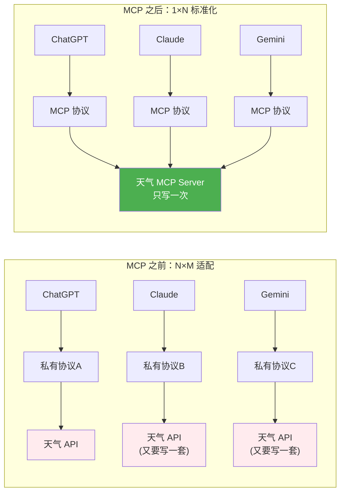
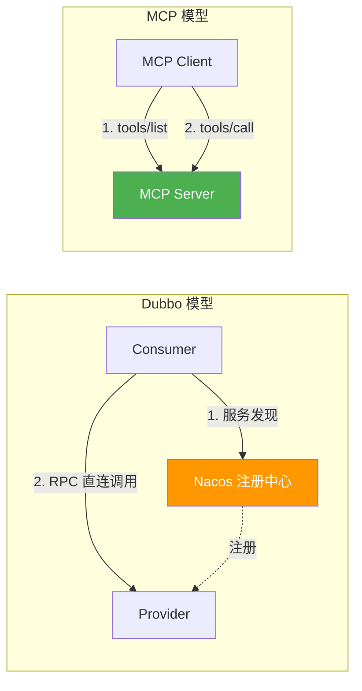

> 最后整理: 2026-05-18 | 来源: 从 llm-agent-mcp.md 拆分

**一句话定位**：MCP（Model Context Protocol）是 AI 工具调用的标准化协议——写一次 Server，所有支持 MCP 的 LLM 都能用。本文深入协议实现内幕、通信机制与自定义开发方案。

---

## 1. MCP（Model Context Protocol）：AI 界的 USB-C

### 1.0 MCP 解决了什么痛点



### 1.1 解决什么问题

```
之前: 每个 LLM 平台对接外部工具都是私有协议
  ChatGPT Plugins → OpenAI 私有协议
  Claude Tools    → Anthropic 私有格式  
  Gemini Tools    → Google 私有格式
  → 工具开发者要为每个平台写一套适配代码

MCP 之后:
  任何 LLM ←→ MCP 协议 ←→ 任何工具/数据源
  → 写一次 MCP Server，所有支持 MCP 的 LLM 都能用
```

### 1.2 架构：Client-Server

```
┌──────────────────────────────────────────────────┐
│                                                  │
│  ┌──────────┐    ┌──────────┐    ┌────────────┐  │
│  │ LLM Host │ → │ MCP      │ → │ MCP        │  │
│  │ (Claude) │    │ Client   │    │ Server A   │  │
│  └──────────┘    │ (协议层)  │    │ (文件系统)  │  │
│                  └──────────┘    └────────────┘  │
│                       │                          │
│                       │         ┌────────────┐   │
│                       ├────────→│ MCP        │   │
│                       │         │ Server B   │   │
│                       │         │ (Postgres) │   │
│                       │         └────────────┘   │
│                       │                          │
│                       │         ┌────────────┐   │
│                       └────────→│ MCP        │   │
│                                 │ Server C   │   │
│                                 │ (天气 API)  │   │
│                                 └────────────┘   │
└──────────────────────────────────────────────────┘
```

MCP Server 暴露三种能力：

| 能力 | 含义 | HTTP 类比 |
|------|------|-----------|
| **Resources** | 暴露数据（"我能读这些文件/数据库"） | GET |
| **Tools** | 可执行操作（"我能发邮件、查天气"） | POST |
| **Prompts** | 预定义 Prompt 模板（"我擅长代码审查"） | 静态资源 |

---

## 2. MCP 协议实现内幕

### 2.1 通信层：JSON-RPC 2.0

MCP 底层是 **JSON-RPC 2.0**，通过 stdio（标准输入输出）或 **Streamable HTTP** 传输（单端点、双向流式；早期的 HTTP+SSE 传输已在 2025-03 规范中弃用）：

```
MCP Client                         MCP Server
    │                                   │
    │  → {"jsonrpc":"2.0",              │
    │     "method":"tools/list",        │  (发现工具)
    │     "id":1}                       │
    │                                   │
    │                    {"jsonrpc":"2.0",│
    │                     "id":1,        │
    │                     "result":{     │
    │                       "tools":[    │
    │                         {"name":"query_db",
    │                          "description":"执行SQL查询",
    │                          "inputSchema":{
    │                            "properties":{
    │                              "sql":{"type":"string"}
    │                            }}}]}}   │
    │                                   │
    │  → {"jsonrpc":"2.0",              │
    │     "method":"tools/call",        │  (调用工具)
    │     "params":{                    │
    │       "name":"query_db",          │
    │       "arguments":{               │
    │         "sql":"SELECT SUM(amount) │
    │          FROM orders              │
    │          WHERE date > '...'"}}    │
    │     "id":2}                       │
    │                                   │
    │                    {"jsonrpc":"2.0",│
    │                     "id":2,        │
    │                     "result":{     │
    │                       "content":[  │
    │                         {"type":"text",
    │                          "text":"销售额: ¥1,234,567"}
    │                       ]}}          │
```

### 2.2 stdio 通信的 OS 层细节

**本质：不是 HTTP，不是 RPC，不是 Socket——就是父进程和子进程之间的管道传文本。**

```
Claude Code (Node.js 父进程)
  │
  │  spawn("java", ["-jar", "app.jar"])
  │
  ├── childProcess.stdin  ──── pipe ────→ System.in   (Java 子进程)
  │                                        ↓
  │                                  BufferedReader.readLine()
  │                                        ↓
  │                                  你的业务逻辑（通过 @Tool 反射调用）
  │                                        ↓
  │                                  System.out.println()
  │                                        ↓
  └── childProcess.stdout ←── pipe ────────┘
```

Claude Code 做的事，和你打开终端手动敲完全一样：

```bash
java -jar app.jar                          # 你启动进程
{"jsonrpc":"2.0","method":"tools/list"}   # 你手动打字问"你能干什么"
# ... 等它打印出工具列表，复制走
```

只是 Claude Code 替你打了字、替你读了结果。

**完整交互序列**（一次工具调用）：

```
Claude Code (Node.js)                          Java 进程
───────────────────                            ─────────

① spawn 子进程
   proc.stdin  = writable pipe
   proc.stdout = readable pipe                 ② Spring Boot 启动
                                                  @EnableMcpServer 初始化
                                                   扫描 @Tool → 构建注册表
                                                   block 在 readLine() 上

③ LLM 决定调 queryOrders(userId="123")
   拼 JSON-RPC 请求
                                               ④ readLine() 读到一行完整 JSON
   proc.stdin.write(                              解析: method="tools/call"
     '{"jsonrpc":"2.0",\n'                        name="queryOrders"
      '"method":"tools/call",\n'                  从注册表找到 ToolCallback
      '"params":{"name":"queryOrders",\n'         method.invoke(bean, "123")
      '"arguments":{"userId":"123"}},\n'            → orderService.queryByUser("123")
      '"id":42}\n'                                   → DB → List<Order>
   )
                                                 拼 JSON-RPC 响应
   proc.stdout.on("data", chunk →                 System.out.println(...)
     JSON.parse(chunk)                            System.out.flush()
     → 拿到订单数据
   )

⑤ 喂回 LLM 第二次推理 → 组织自然语言回复
```

**关键事实**：

| 细节 | 说明 |
|------|------|
| **传输单元** | 每行一个完整 JSON-RPC 对象，`\n` 分隔——因为 `BufferedReader.readLine()` 天然以换行为界 |
| **请求-响应匹配** | 通过 `id` 字段对应。stdio 模式通常同步（发一个等一个），但协议支持并发 |
| **进程生命周期** | Java 只启动一次，while 循环持续处理。不是每次调用起一个新进程。Claude Code 退出时才 kill |
| **不是 HTTP** | 没有 localhost，没有端口号，没有序列化框架。就是父进程往子进程 stdin 写字符串，子进程往 stdout 写字符串 |

### 2.3 Agent 怎么知道何时调用

Agent 不是"配置了 MCP 就自动会用"，分为两步：

```
Step 1: LLM 推理时
  系统 Prompt 中注入了工具列表:
  "你可以使用以下工具:
   - query_db(sql): 执行 SQL 查询
   - send_email(to, subject, body): 发送邮件"

  LLM 处理用户输入 → 判断"这需要查数据库" → 输出工具调用指令

Step 2: Agent 框架拦截
  框架检测到 LLM 输出的是工具调用 → 真正执行 MCP 请求
  → 收到结果 → 把结果重新注入对话 → LLM 继续生成最终回复
```

**MCP 只定义"怎么调用工具"的协议。LLM 什么时候调用、为什么调用——是 Agent 框架 + Prompt 驱动的。**

---

## 3. MCP 服务发现与自定义开发

### 3.1 怎么发现：配置文件，不是注册中心

**MCP 没有注册中心——通过 JSON 配置文件静态声明。**

```
~/.claude/claude_desktop_config.json:

{
  "mcpServers": {
    "postgres": {
      "command": "npx",
      "args": ["-y", "@anthropic/mcp-server-postgres", "postgresql://localhost/mydb"]
    },
    "my-tool": {
      "command": "java",
      "args": ["-jar", "/path/to/my-mcp-server.jar"]
    }
  }
}
```

启动时 Claude Code 读这个文件 → 对每个 Server 启动子进程 → 通过 stdio 建立 JSON-RPC 通道。

### 3.2 与 Dubbo 对比

#### 基础对比

| | Dubbo | MCP |
|------|-------|-----|
| 注册中心 | Zookeeper/Nacos | 无，JSON 文件静态配置 |
| 服务发现 | 动态注册+发现 | 启动时读文件，启动子进程 |
| 通信协议 | Dubbo 协议 (TCP) | JSON-RPC 2.0 (stdio/HTTP) |
| 接口定义 | Java Interface | JSON Schema (inputSchema) |
| 提供者 | Provider 注册到注册中心 | 子进程，由 Client 启动和管理 |

#### 核心架构差异：发现与调用是否分离

**Dubbo 的关键架构特征：注册中心和服务调用是分离的。**

```
Dubbo 架构（发现与调用分离）:
  Consumer ──→ Nacos/ZK（服务发现: "orderService 在哪？"）
  Consumer ──→ Provider（RPC 调用: 直连 TCP，不经过注册中心）

MCP 架构（发现与调用一体）:
  Client ──→ MCP Server（tools/list: "你能干什么？"）
  Client ──→ 同一个 MCP Server（tools/call: "帮我干这个"）
           ↑
      发现和调用走同一个进程，同一条 stdio 管道
```

**这意味着：不能像 Dubbo 那样"通过 MCP 发现服务，但调用直连后端"。** MCP 协议没有注册中心角色，`tools/list` 和 `tools/call` 都由同一个 MCP Server 处理。

**为什么 MCP 这样设计？**



- Dubbo 场景：微服务之间互相调用，几十上百个节点，注册中心必须独立部署才能动态感知上下线
- MCP 场景：AI Agent 调用工具，一个 Agent 连 1-5 个 MCP Server，配置文件管理够用。更关键的是，MCP 主力传输是 **stdio 管道**（父进程 ↔ 子进程），根本没有"网络地址"可以注册

**如果硬要分离会怎样？** 变通方案：

```
Agent → MCP Server（仅做 tools/list，工具注册中心角色）
Agent → 后端 REST API（实际调用，绕过 MCP 管道）
```

但这本质上就是「方案 B：WebClient HTTP」套了一个 MCP 壳做服务发现，失去了 MCP 标准化调用的价值。而且 Claude Code 等客户端不支持这种模式——它期望 `tools/call` 返回实际结果，不是返回一个 HTTP URL 再调一次。

**如果 MCP 未来参考 Dubbo 架构（假设 MCP 2.0）：**

```
① 启动时:
   Agent → MCP Registry（独立服务）→ "有 3 个 MCP Server 注册了"

② 发现工具:
   Agent → MCP Registry → tools/list → 返回所有注册 Server 的工具列表
   返回: [{name:"queryOrders", server:"order-mcp", endpoint:"http://..."}]

③ 调用工具:
   Agent → order-mcp Server（直连 HTTP）→ 执行业务逻辑（不经过注册中心）
```

这会解决单点瓶颈（所有调用过 stdio 管道）、工具发现与执行耦合（无法独立扩缩）、多 Agent 共享工具配置等问题。但 MCP 目前没有这个规划——它的定位是"本机开发工具连接"，不是"企业级工具中台"。

### 3.3 写一个 Java MCP Server（伪代码）

```java
public class MyMcpServer {
    public static void main(String[] args) {
        while (true) {
            String request = readLine(System.in);
            JsonRpcRequest req = parse(request);
            
            switch (req.method) {
                case "tools/list":
                    respond(new Tool[]{
                        new Tool("query_orders", "查询用户订单",
                            Map.of("userId", "string")),
                        new Tool("refund", "发起退款",
                            Map.of("orderId", "string", "amount", "number"))
                    });
                    break;
                    
                case "tools/call":
                    if (req.params.name.equals("query_orders")) {
                        List<Order> orders = db.query(
                            "SELECT * FROM orders WHERE user_id = ?",
                            req.params.arguments.get("userId"));
                        respond(orders);
                    }
                    break;
            }
        }
    }
}
```

本质就是：读 stdin → 解析 JSON-RPC → 执行业务逻辑 → 写 stdout。

### 3.4 Java 方案一：Spring AI MCP Server（推荐）

Spring AI 官方提供了 `spring-ai-starter-mcp-server`，直接把标注好的 Bean 暴露为 MCP 工具。和 Controller 共享 Service 层，不改原有代码。

**架构**：

```
人类/Web ──HTTP──→  Controller ──→ Service ──→ DB
                         ↑              ↑
Claude Code ──stdio──→ MCP Server ────┘
                         ↑
               @Tool 方法（新的入口，共享同一个 Service）
```

**依赖**（`pom.xml`）：

```xml
<dependency>
    <groupId>org.springframework.ai</groupId>
    <artifactId>spring-ai-starter-mcp-server-webmvc</artifactId>
    <version>1.0.0</version>  <!-- 2025-09 GA，请按需用最新 patch 版 -->
</dependency>
```

**代码**——和 Controller 共享 Service：

```java
@RestController
public class OrderController {

    @Autowired
    private OrderService orderService;

    // ← 原有 HTTP 接口，不动
    @GetMapping("/api/orders")
    public List<Order> queryOrders(@RequestParam String userId) {
        return orderService.queryByUser(userId);
    }
}

// ← 新增 MCP 工具，共享同一个 Service
@Component
public class OrderMcpTools {

    @Autowired
    private OrderService orderService;

    @Tool(description = "根据用户ID查询订单列表，返回订单号、金额、状态")
    public List<Order> queryOrders(
        @ToolParam(description = "用户ID") String userId) {
        return orderService.queryByUser(userId);
    }

    @Tool(description = "根据订单号发起退款，返回退款单号")
    public String refundOrder(
        @ToolParam(description = "订单号") String orderId,
        @ToolParam(description = "退款金额(元)") double amount) {
        return orderService.refund(orderId, amount);
    }
}
```

启动类：

```java
@SpringBootApplication
@EnableMcpServer   // ← 加这一个注解
public class Application {
    public static void main(String[] args) {
        SpringApplication.run(Application.class, args);
    }
}
```

**配置 Claude Code**（`.mcp.json`）：

```json
{
  "mcpServers": {
    "order-service": {
      "command": "java",
      "args": ["-jar", "target/your-app.jar"]
    }
  }
}
```

### 3.5 Java 方案二：纯手写（零依赖）

不用任何框架。本质：`while(readLine) → switch method → 调 Service → writeLine`。

```java
public class McpServer {
    private static final ObjectMapper mapper = new ObjectMapper();

    public static void main(String[] args) throws Exception {
        BufferedReader in = new BufferedReader(new InputStreamReader(System.in));
        OrderService orderService = new OrderService();  // 或手动初始化 Spring

        String line;
        while ((line = in.readLine()) != null) {
            JsonNode req = mapper.readTree(line);
            String method = req.get("method").asText();
            int id = req.get("id").asInt();

            String response;
            if ("tools/list".equals(method)) {
                response = buildToolListJson(id);
            } else if ("tools/call".equals(method)) {
                response = handleCall(id, req, orderService);
            } else {
                response = errorJson(id, "unknown method: " + method);
            }

            System.out.println(response);
            System.out.flush();
        }
    }

    private static String handleCall(int id, JsonNode req, OrderService svc) {
        String name = req.get("params").get("name").asText();
        JsonNode args = req.get("params").get("arguments");

        Object result;
        if ("query_orders".equals(name)) {
            result = svc.queryByUser(args.get("userId").asText());
        } else if ("refund_order".equals(name)) {
            result = svc.refund(args.get("orderId").asText(), args.get("amount").asDouble());
        } else {
            result = Map.of("error", "unknown tool: " + name);
        }

        return """
        {"jsonrpc":"2.0","id":%d,
         "result":{"content":[{"type":"text","text":%s}]}}
        """.formatted(id, escapeJson(mapper.writeValueAsString(result)));
    }
    // buildToolListJson, errorJson, escapeJson 省略...
}
```

### 3.6 两个方案对比

| | Spring AI MCP | 手写 |
|------|-------------|------|
| 代码量 | `@Tool` 注解 + `@EnableMcpServer` | ~150 行样板 |
| Schema 生成 | 从方法签名 + `@ToolParam` 自动推断 | 手写 JSON Schema |
| 参数类型映射 | 自动（String→string, int→integer 等） | 手动从 JsonNode 提取 |
| 和现有 Controller 的关系 | 同名 Service，两个入口 | 同名 Service，两个入口 |
| 依赖 | 一个 starter | 零依赖 |
| 适合 | 生产，多工具 | 学习原理，1-2 个工具 |

### 3.7 和 Dubbo/Nacos 的对比（精简版）

> 深度架构对比（发现与调用分离、为什么 MCP 不做注册中心、Dubbo 模型 vs MCP 模型）请见 [§3.2 与 Dubbo 对比](#32-与-dubbo-对比)。

| | Dubbo + Nacos | MCP |
|------|-------------|-----|
| 注册中心 | Nacos 动态注册 | 无——JSON 文件静态声明 |
| 服务发现 | 启动时订阅注册中心 | 启动时读 `.mcp.json`，spawn 子进程 |
| 通信协议 | Dubbo 协议（TCP 长连接） | JSON-RPC 2.0 over stdio |
| 接口定义 | Java Interface | JSON Schema（由 `@Tool` 注解推断） |
| 提供者 | Provider 注册到 Nacos | 子进程，由 Client 管理生命周期 |
| 调用方式 | RPC 代理，透明调用 | Agent 框架收到 LLM tool_call → 发 JSON-RPC |
| **核心差异** | **发现与调用分离**（Consumer → 注册中心 → Provider 直连） | **发现与调用一体**（Client → 同一个 Server 处理 tools/list + tools/call） |

---

> 关联: [Agent 与 MCP](./llm-agent-mcp.md) · [Agent 开发实战](../应用/agent-development-practice.md)
