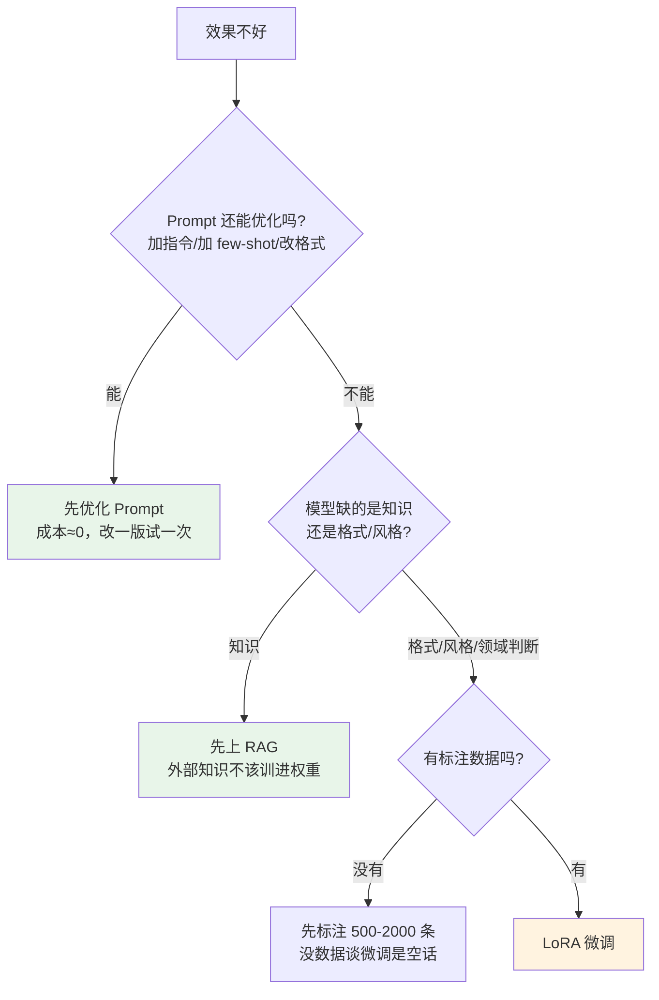
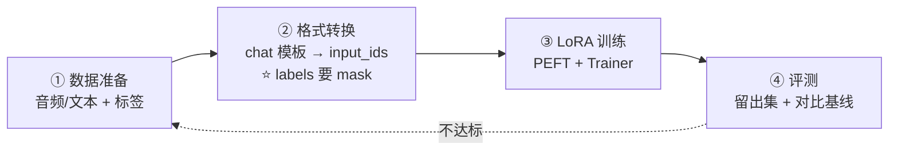
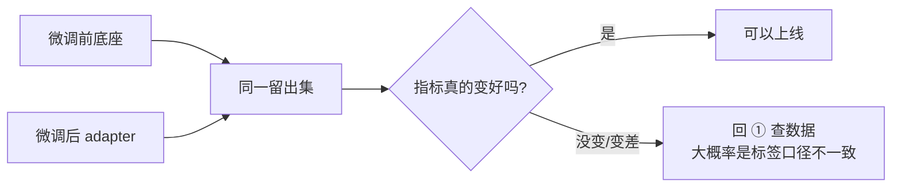
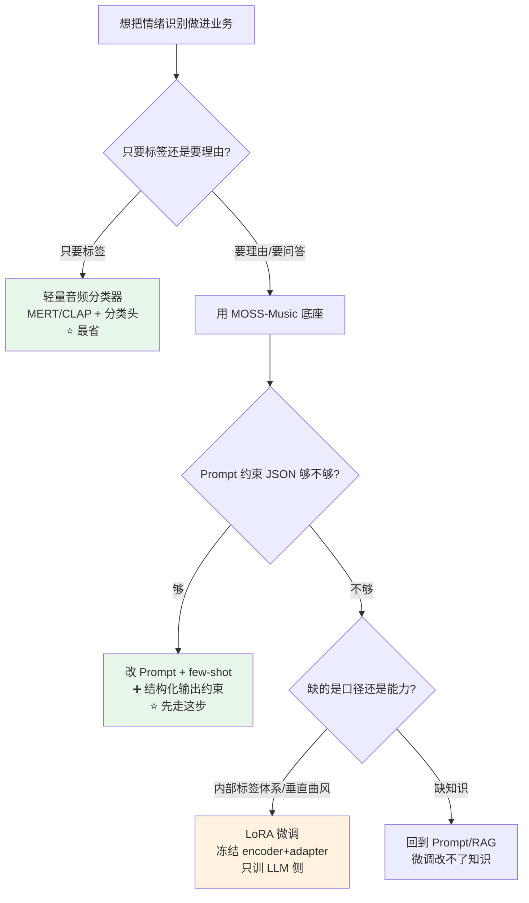

> 最后整理: 2026-09-14 | 来源: 从 llm-agent-mcp.md 拆分 + 2026-09-14 对话扩充（§3-§7）

微调是在预训练基座模型上用你的领域数据再训练一轮，让通用模型变成领域专家。LoRA 是低成本微调方案。

## 1. 微调（Fine-tuning）：让通用模型学你的领域

下面两节是这个主题的两条主线：**改什么**（基座模型 vs 微调后模型）和**改完长什么样**（真实客服案例）。

### 1.1 基座模型 vs 微调后模型

```
基座模型 (Base Model):
  训练数据: 互联网海量文本
  能力: 什么都会一点，什么都不精
  问题: 不懂你的业务术语

微调后模型 (Fine-tuned Model):
  在基座模型基础上，用你的特定数据再训练一小轮
  能力: 学会了你的领域知识、输出格式、语气风格
```

### 1.2 具体例子

```
基座模型面对客服:
  用户: "我的订单三天了还没发货"
  模型: "很抱歉听到这个，你可以联系客服..." ← 太泛了

微调后 (1000条真实客服对话训练):
  用户: "我的订单三天了还没发货"
  模型: "已为您查询，订单 #20260504-0032 状态为'待拣货'，
         预计明天发货。我已标记加急处理。是否需要修改收货地址？"
```

## 2. 全量微调 vs LoRA

| 方式 | 做法 | 成本 |
|------|------|------|
| **全量微调** | 更新模型的全部参数 | 多张 A100/H100 GPU |
| **LoRA** | 只训练一小部分新增参数，原参数不动 | 一张消费级显卡 |

LoRA 的思路：不修改原模型权重，旁边挂两个小矩阵（A 和 B），只训练它们。效果接近全量微调，成本降几个数量级。

---

## 3. 先别急着微调：90% 的"我想微调"其实是 Prompt 问题

微调很贵（要标注数据、要 GPU、要迭代），**先爬完下面这个梯子再决定**：



**判据（记住这三条就够）**：

| 症状 | 该用什么 | 为什么 |
|------|---------|--------|
| 模型**不知道**某个事实（你的产品参数、内部术语） | **RAG** | 知识会变，权重改一次要重训一次 |
| 模型**知道但输出格式不对**、风格不对、判断口径不对 | **微调（LoRA）** | 这是行为塑造，RAG 管不了 |
| 模型偶尔答不对，加几个例子就好了 | **Prompt / few-shot** | 成本零，先试这个 |

> 微调不是"喂知识"，是"**改行为**"。把一堆文档喂进去指望它记住，是最常见的误区——那件事该交给 RAG。

---

## 4. 微调到底在干什么：LoRA 的数学只有两行

```
原始权重（冻结）:  W  ∈ R^(d×d)        ← 不训练
新增旁路（训练）:  ΔW = B · A
                   A ∈ R^(r×d)  (高斯随机初始化)
                   B ∈ R^(d×r)  (零初始化 → 训练开始时 ΔW = 0)

前向计算:  h = (W + ΔW)·x = W·x + B·A·x
```

**关键点**：

- `B` 初始化为 0 → 训练开始时 `ΔW = 0`，模型行为和原模型**完全一致**。这是 LoRA 不破坏原能力的数学保证（全量微调就没有这个保证）。
- 可训练参数量：`r × d × 2`。8B 模型取 r=16 时，通常只训 **0.1%~1%** 的参数。
- 推理性价比：`W + BA` 可以**合并**成一个矩阵，推理零额外延迟。也可以不合并，多适配器**热插拔**（一个底座挂 N 个领域 adapter）。

### QLoRA：把底座压成 4-bit 再挂 LoRA

```
QLoRA = 底座 4-bit 量化（NF4）  +  LoRA 旁路用 bf16 训练  +  paged optimizer
```

| 方案 | 底座精度 | 8B 模型训练显存 | 适合 |
|------|---------|----------------|------|
| 全量微调 | bf16 | 多卡 80G | 有预算、要改底层能力 |
| LoRA | bf16 | ~24G（单卡 4090/A10 可试） | **首选默认方案** |
| QLoRA | 4-bit | ~12-16G | 显存穷、数据量小 |

> 消融结论：数据量小（<1 万条）时，LoRA 和 QLoRA 效果差距很小，**优先省显存**。真正决定成败的是数据质量，不是 r 取 8 还是 64。

### 超参怎么取（照抄起步值）

| 参数 | 起步值 | 说明 |
|------|--------|------|
| `r`（秩） | 8~16 | 小数据集别贪大，r 大更容易过拟合 |
| `lora_alpha` | 2×r（如 32） | 缩放系数，经验值 |
| `lora_dropout` | 0.05~0.1 | 防过拟合 |
| `target_modules` | `q_proj,k_proj,v_proj,o_proj` | 先只挂注意力；不够再挂 MLP |
| `learning_rate` | **1e-4 ~ 2e-4** | LoRA 比全量微调（1e-5~2e-5）大一个数量级 |
| `epochs` | 2~3 | 超过 3 轮基本在过拟合 |
| 有效 batch | 16~32 | 单卡 batch=1 时靠 `grad_accum` 凑 |

---

## 5. 标准四步流水线（任何模型都一样）



### ① 数据：质量 >> 数量

- **标注一致性 > 标注数量**。1000 条口径统一的标签，顶得上 10000 条互相矛盾的。
- **必须留出集**（10~20%）。不划留出集，你无法知道是真变好还是只是背下来了。
- 格式就是"指令 + 输入 + 期望输出"三件套，多模态就是把输入换成 `音频 + 指令`。

### ② 格式转换：这里的坑最多

以 MOSS-Music 为例（读源码实测，不是猜的）：

```python
from src.processing_moss_music import MossMusicProcessor
from src.audio_io import load_audio

processor = MossMusicProcessor.from_pretrained(
    MODEL_PATH, trust_remote_code=True,
    enable_time_marker=True,          # 时间标记开关，训练要跟推理一致
)

raw_audio = load_audio(path, sample_rate=processor.config.mel_sr)  # 16000 Hz
inputs = processor(text=prompt, audios=[raw_audio], return_tensors="pt")
# → input_ids 里音频部分被替换成 audio_token_id（占位符）
```

**最关键的一行是 loss mask**：只对 **assistant 回答部分**算 loss，prompt 和音频占位符的 label 全部设成 `-100`。

```python
labels = inputs["input_ids"].clone()
labels[labels == processor.audio_token_id] = -100   # 音频 token 不算 loss
labels[:prompt_len] = -100                          # 问句部分不算 loss
inputs["labels"] = labels
```

> 不 mask 的后果：模型学会了"复述问题"和"预测音频 token"，loss 曲线很漂亮，但生成质量崩。这是多模态 SFT 最常见的翻车点。

### ③ 训练：PEFT + Trainer

```python
from peft import LoraConfig, get_peft_model, TaskType

lora_cfg = LoraConfig(
    task_type=TaskType.CAUSAL_LM,
    r=16, lora_alpha=32, lora_dropout=0.05,
    target_modules=["q_proj", "k_proj", "v_proj", "o_proj"],
)
model = get_peft_model(model, lora_cfg)
model.print_trainable_parameters()   # 先看这个数字，应该是 1% 量级

trainer = transformers.Trainer(
    model=model, args=training_args,       # lr=2e-4, epochs=3, bf16=True
    train_dataset=train_ds, eval_dataset=val_ds,
    data_collator=collator,                # 音频 batch 必须自己写 collator
)
trainer.train()
```

`peft` 的机制是**按模块名递归查找**替换——所以只要模型是标准 `PreTrainedModel` 且语言层挂在预期路径上，就能直接挂 LoRA，不需要模型作者提供训练脚本。

### ④ 评测：谁跑不掉这一关



**必查的"变差"信号**：底座原有能力是否退化（灾难性遗忘）。做法很简单——留一批**通用任务**样本，一起测。

---

## 6. 落到 MOSS-Music：能不能拿来做歌曲情绪识别

### 结论：能，而且它是**开箱可用**的，不一定需要微调

三条硬证据（读源码 + README 确认）：

1. **模型能力清单里明确写了情绪**：README 原文是 `Natural-language descriptions of mood, genre, instrumentation, production style, and emotional trajectory`（情绪 + **情绪走向**，后者是逐段情绪变化，不是单标签）。
2. **官方 Gradio demo 的默认问句就包含情绪**（`app.py` 第 18 行）：
   ```
   请从风格与速度、调性与和声、乐器编配、结构安排以及整体情绪几个方面描述这段音乐。
   ```
3. **评测集里有专门的情绪维度**：caption 评测 9 个维度中的 `mood/affect`，音乐 QA 集的 `MMAU-music`、`MuChoMusic` 都含情绪判断。

### 从"能描述情绪"到"输出你要的标签"，中间只差 Prompt

模型默认输出**自然语言描述**（自由文本），而工程上你要的是**结构化标签**。这一步不需要微调，改 Prompt 就行：

```text
你是音乐情绪分析器。听完这首歌，只输出 JSON，不要任何解释：

{
  "valence": <0-1 数字，越接近1越正向/愉悦>,
  "arousal": <0-1 数字，越接近1越高能量/激烈>,
  "primary": "<主导情绪：开心/平静/悲伤/愤怒/紧张/怀旧/浪漫>",
  "segments": [{"start": "<秒>", "end": "<秒>", "emotion": "<段落情绪>"}]
}
```

**为什么用 JSON 而不是让它自由发挥**：自由文本没法直接算指标、没法入库、没法 A/B。先用**严格 JSON 模板 + few-shot 两个例子**试，能收敛就不必微调。

> 更硬的做法：SGLang/vLLM 侧开**结构化输出约束**（guided decoding / JSON schema），从解码层面保证格式合法，连"模型偶尔多说一句话"都杜绝掉。

### 什么时候才真的需要微调

| 需求 | 要不要微调 | 理由 |
|------|-----------|------|
| 输出固定标签体系的情绪 | ❌ 先试 Prompt | 模型本来就会判断情绪，只是要约束输出形式 |
| 情绪做**连续值回归**（valence/arousal 打分） | ⚠️ 看要求 | 靠 Prompt 让模型打分会漂；要稳定数值就得微调 |
| 你有一套**内部标签体系**（如业务自定义的 12 类情绪） | ✅ 微调 | 这是领域口径，模型不可能凭空知道 |
| 需要**中文古风/方言/垂直曲风**的细粒度判断 | ✅ 微调 | 长尾领域，底座覆盖不足 |
| 只是想要个情绪标签，不关心解释 | ⚠️ 换方案 | 见下方"边界" |

### 这条路的边界（诚实说）

- **MOSS-Music 是理解模型，不是生成模型**——不能拿它写歌，也不能直接输出概率分布。要概率就套一层分类头或额外的判别模型。
- **如果只要一个情绪标签**：8B 多模态模型跑一首歌，成本远高于一个音频分类小模型（如基于 MERT / CLAP 的轻量分类器）。MOSS-Music 的真正价值是**可解释的理由**——"副歌转大调、BPM 拉到 128、配器加了失真吉他，所以判定为激昂"。需要**解释**就当 API 调底座；只需要**标签**就上小分类器。
- **长音频 token 预算**：编码器输出 **12.5 tokens/秒**，一首 5 分钟的歌 ≈ **3750 个音频 token**（不含歌词和回答）。做微调时序列长度直接吃显存，建议**先切 30 秒片段**做样本，推理时再对整曲分段汇总。

### 微调 MOSS-Music 的三个具体坑

1. **仓库里没有训练代码**。只有推理（`infer.py`、`hf_inference.py`、SGLang 服务）和数据标注侧管道 `MOSS-Music-Data-Pipeline`。训练循环得自己写——好消息是它就是个标准 `PreTrainedModel`（内部 `self.language_model = Qwen3Model(...)`），`peft` 能直接找到 `language_model.layers[i].self_attn.q_proj` 挂 adapter，**挂在 `language_model` 上是安全的**。
2. **DeepStack 注入靠 forward hook**。模型在 LLM 浅层通过 `register_forward_hook` 注入音频特征。这是**前向 hook**，与 LoRA 的权重替换互不干扰——但如果你自己要复刻训练代码，**别把 hook 关掉**，否则等于把一个退化的模型拿去训。
3. **三块组件要不要一起训**：`audio_encoder`（32 层）+ `audio_adapter`（GatedMLP）+ `language_model`（Qwen3-8B）。默认策略是**冻结编码器和 adapter，只训 LLM 侧的 LoRA**——你改的是"怎么描述情绪"的口径，不是"怎么听声音"。除非你的曲风极度长尾（如特定民族乐器），否则不要去动编码器。

### 许可：能商用

Apache License 2.0。微调后的 adapter 可以商用，注意保留许可证与声明。

---

## 7. 一张图记住整条路



---

> 关联: [LLM 核心原理](./LLM（大语言模型）.md) · [Agent 与 MCP](<./Agent 与 MCP.md>) · [Prompt 与 RAG](<./Prompt 与 RAG.md>) · [moss-music](../应用/MOSS-Music：开源音乐理解模型.md) — §6 的落地对象（情绪识别 + 微调实操）
> 关联: [本地部署 LLM](<./本地部署 LLM.md>) — 训练/推理的显存与量化基础
