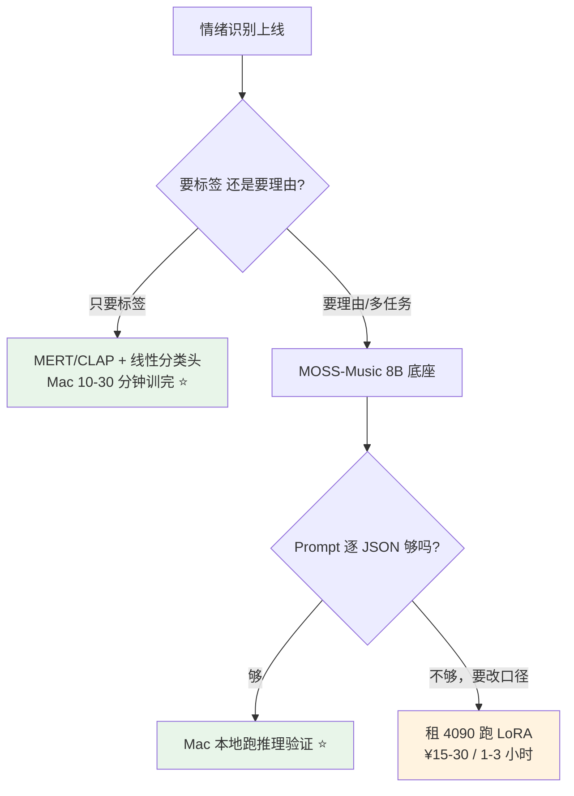
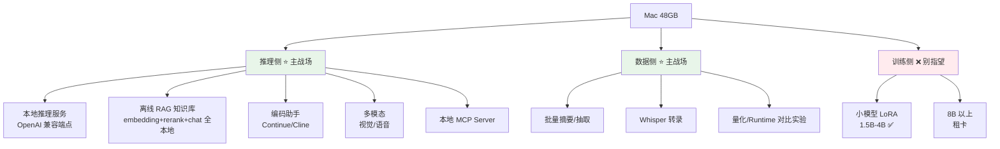

# 本地部署 LLM：小模型 + Ollama 实践

> 最后整理: 2026-09-11 | 来源: 对话

## 一句话定位

本地跑大模型不需要高配显卡——小参数模型（0.5B-3B）量化后在消费级 CPU 上就能跑，Ollama 把部署简化成一条命令。

---

## 1. 小模型能做什么

| 能做好 | 能做但一般 | 做不好 |
|--------|-----------|--------|
| 简单 QA | 写邮件/短文 | 复杂逻辑推理 |
| 翻译短文本 | 代码生成（简单） | 多步推理 |
| 摘要短文本 | 对话聊天 | 数学/编程难题 |

**核心限制**：小模型的问题不是"跑不跑得动"（都跑得动），而是"智能程度"。0.5B 基本只能说正确的废话，1.5B 能应付日常，3B 才开始有"像个正经助手"的感觉。

---

## 2. 推荐的小模型清单

| 模型 | 参数量 | 量化后大小 | 中文能力 | 推荐场景 |
|------|--------|-----------|----------|----------|
| **qwen3:0.6b** | 0.6B | ~400 MB | 优秀 | 最小可用，树莓派都能跑 |
| **qwen3:1.7b** | 1.7B | ~1.1 GB | 优秀 | 中文小模型首选 |
| **qwen3:4b** | 4B | ~2.5 GB | 优秀 | 1.7B 不够聪明时的下一档 |
| **gemma3:1b** | 1B | ~800 MB | 中上 | Google 出品，英文/多语言均衡 |
| **phi4-mini** | 3.8B | ~2.5 GB | 中上 | 微软出品，逻辑推理强 |

**中文场景推荐 qwen3:1.7b**，0.6B 太弱（只能做简单 QA），1.7B 是中文小模型甜点。

> **模型迭代很快**，上表的版本号（qwen3 / gemma3 / phi4-mini）以 2026-09 为准，实际部署前请以 [Ollama 模型库](https://ollama.com/library) 的当前 tag 为准；清单里的"哪一档参数"比"哪一代版本"更稳定。

---

## 3. 配置要求

```
0.9B 参数量 × 2 bytes (FP16) = ~1.8 GB 显存/内存

最低配置:
  CPU:  任何 4 核以上的 x86/ARM
  内存: 8 GB
  显卡: 不需要
  硬盘: 留 3 GB 空间放模型文件

实际体验:
  CPU 推理: ~5-10 tokens/s（能用但不快）
  有 GPU: ~50-100 tokens/s（飞起）
```

### 性能预期

```
0.5B 模型 (Apple M1/M2 CPU):
  推理速度: ~30-50 tokens/s
  启动时间: ~2 秒
  内存占用: ~400 MB

1.5B 模型 (Apple M1/M2 CPU):
  推理速度: ~15-30 tokens/s
  启动时间: ~3 秒
  内存占用: ~1 GB

3B 模型 (Apple M1/M2 CPU):
  推理速度: ~8-15 tokens/s
  启动时间: ~5 秒
  内存占用: ~2 GB

注：Intel CPU 大概是以上速度的 1/3 到 1/2
```

---

## 4. 量化精度

### 4.1 Q4 / Q5 / Q6 到底是什么

**一句话：Q 后面的数字 = 每个权重用几个 bit 存。数字越小越省内存，但越容易失真。**

训练出来的模型权重原本是 **FP16**（每个权重 16 bit，2 字节）。量化就是把这些高精度浮点数**压成低比特**：

```
FP16 权重（16 bit/权重）
  1.2345678  →  000111011010...   ← 精确但占地方
        ↓ 量化（找最接近的低比特表示 + 缩放因子）
Q4 权重（约 4 bit/权重）
  1.23       →  1010             ← 省 4 倍空间，但损失一点精度
```

**为什么能压**：神经网络权重里大量值挤在 0 附近，真正"需要精度"的只有少数。所以低比特表示配合**缩放因子（scale）+ 按块分组**，能压掉大部分冗余而损失很小——这就是量化的理论基础（细节见 [llm.md 量化章节](./LLM（大语言模型）.md)）。

**为什么从 Q4 起步而不是 Q2**：低于 4 bit 时，模型开始"记不住"细节，表现为胡言乱语、不遵守格式、长推理链断裂。**4 bit 是实践中的质量地板**。

### 4.2 命名规则：`Q4_K_M` 怎么读

以 `Q4_K_M` 为例，拆成三段：

```
Q   4   _K_   M
│   │    │    └── M = Medium：同一档位内的尺寸变体
│   │    │                 S = Small（更小更糙）
│   │    │                 L = Large（更接近上一档质量）
│   │    └────── K = K-quant：分块+混合精度的高级量化方法
│   │                     （没有 _K_ 的是老式均匀量化，如 Q4_0/Q4_1）
│   └─────────── 4 = 约 4 bit/权重
└─────────────── 量化（Quantized）
```

| 命名片段 | 含义 | 记忆方式 |
|---------|------|---------|
| `Q4` `Q5` `Q6` `Q8` | 每权重比特数 | **数字越大 = 越准、越占内存、越慢** |
| `_0` `_1` | 老式均匀量化（无 _K_） | 基本被淘汰，别选 |
| `_K` | K-quant，按块分组 + 块内混合关键权重保精度 | **现代默认，选它** |
| `_S` `_M` `_L` | 同档位的 小/中/大 变体 | 体积 ~= S < M < L |
| `IQ` 前缀 | Importance-aware 量化，为极低比特设计 | 只在 Q3 以下才有优势 |

**还有个隐藏规律**：`Q4_K_M` 的实际平均比特数不是 4，而是约 **4.5 bit**（因为 K-quant 会给关键层多分配位数）。所以它质量接近"4.5 bit"，比老式 `Q4_0` 明显好。

### 4.3 常用档位对照：质量 / 体积 / 该不该用

| 档位 | 每权重实际 bit | 相对 FP16 体积 | 质量体感 | 用途 |
|------|--------------|--------------|---------|------|
| `Q2_K` | ~2.6 | ~1/6 | 明显变笨，输出容易跑偏 | ❌ 别用（除非只是塞进内存看看） |
| `Q3_K_M` | ~3.4 | ~1/5 | 有损但能用 | 内存实在不够时的妥协 |
| **`Q4_K_M`** | **~4.5** | **~1/8** | **几乎无损** | **✅ 默认首选** |
| `Q5_K_M` | ~5.5 | ~1/6 | 比 Q4 略好 | 内存有富余时升级 |
| `Q6_K` | ~6.6 | ~1/5 | 几乎与 FP16 无差 | 27B 级模型 + 48GB 很合适 |
| `Q8_0` | ~8.5 | ~1/4 | 几乎无损 | 小模型 + 宽裕内存 |
| `FP16` | 16 | 1× | 基准 | 只在有训练/微调需求时 |

> 有评测显示 **Q5 与 Q6 的困惑度（perplexity）差距很小，Q4 也在可接受范围**，但到 Q3 以下分数开始明显下滑。所以"**尽量别低于 Q4**"这条经验是有依据的。

### 4.4 48GB 上怎么选（实用决策）

**规则：在留足余量后，尽量选高的那一档。**

```
算一下：剩余内存 = 48 − 权重(Qx) − KV Cache − 系统占用(建议留 8~10GB)

Qwen3.6-27B 举例（Q4 权重 ~15GB）：
  Q4_K_M → ~15GB，剩 33GB → 可以上 Q5/Q6
  Q6_K  → ~21GB，剩 27GB → 仍然很宽裕 ⭐ 选这个
  Q8_0  → ~28GB，剩 20GB → 可以，但长上下文的 KV Cache 会吃紧
```

**一句话决策**：

| 你的情况 | 选 |
|---------|-----|
| 想省内存、多模型并行 | `Q4_K_M` |
| **单模型 + 48GB、想要最好质量** | **`Q6_K`** |
| 要跑 32k+ 长上下文 | `Q5_K_M`（给 KV Cache 留空间） |
| 27B 以下小模型 | `Q8_0`（本来就小，直接上高精度） |
| 72B 这种上限档 | 只能 `Q4_K_M`，别想更高 |

### 4.5 三个高频误区

| 误区 | 真相 |
|------|------|
| "Q4 就是 4 bit，那 Q4 模型大小 = 参数量 × 0.5 字节" | 实际 Q4_K_M 约 **4.5 bit**，所以经验公式是 **×0.55~0.60 GB/B** 而不是 0.5 |
| "量化只是省内存，不影响速度" | 量化**同时影响速度**：内存带宽是瓶颈，权重更小 → 读取更快 → **通常更快**（所以在 Mac 上 Q4 比 FP16 快得多） |
| "量化后的模型可以继续微调" | ❌ 通常不行——低比特权重的梯度更新精度不够。**要微调请用 FP16/BF16 底座 + LoRA**（见 §8、[微调与 LoRA](<./微调与 LoRA：让通用模型学你的领域.md>)） |

> Ollama 仓库里的模型已经是量化好的 GGUF 格式，通常无需手动操作。

**需要手动量化的场景**：从 HuggingFace 下载的原始 FP16 模型、自己微调训练出来的模型、想自定义量化精度。

> 关联: [llm.md 量化章节](./LLM（大语言模型）.md) — 量化原理详解

---

## 5. Ollama 详解

### 是什么

Ollama 就是一个本地 LLM 运行器（Runner）。类比：

```
Java 程序:  Java 代码（.jar） + JVM → 运行
大模型:     模型文件（GGUF） + Ollama → 运行
```

本质上，Ollama 内部就是在用 llama.cpp 推理引擎 + GGUF 格式的量化模型文件，只是把这套流程包装成了一条命令。

### 架构

```
装 Ollama 后，实际上装了两部分:

1. ollama server（后台守护进程）
   - 一直跑在后台
   - 加载模型到内存/显存
   - 提供 HTTP API（localhost:11434）

2. ollama CLI（前端命令行）
   - 你敲的 ollama run xxx
   - 连接 localhost:11434 发请求
   - 展示输出

┌──────────┐    HTTP POST     ┌──────────────────┐
│ ollama   │ ───────────────→ │ ollama server    │
│ run xxx  │ ←── stream ───── │ (加载模型/推理)    │
└──────────┘                  └──────────────────┘
                                     │
                                     ▼
                              ┌──────────────┐
                              │ 模型文件加载    │
                              │ 到内存/显存     │
                              └──────────────┘
```

### 三种使用方式

```bash
# 方式1: 交互式对话
ollama run qwen3:1.7b
>>> 你好
>>> 什么是机器学习？

# 方式2: 一次性提问（问完就退）
ollama run qwen3:1.7b "帮我解释什么是 transformer"

# 方式3: API 服务（给其他程序调用）
curl http://localhost:11434/api/generate \
  -d '{"model":"qwen3:1.7b","prompt":"你好"}'
```

### 资源占用

| 状态 | CPU | 内存 | 磁盘 |
|------|-----|------|------|
| Ollama 没启动 | 0 | 0 | 模型文件占 ~1 GB |
| server 运行但没加载模型 | ~0 | ~100 MB | ~1 GB |
| 模型加载中（对话中） | 低（idle 时几乎 0） | ~1 GB | ~1 GB |
| 对话结束但 keepalive 还没到 | 低 | ~1 GB（模型在内存） | ~1 GB |
| keepalive 超时后 | ~0 | ~100 MB | ~1 GB |

**模型自动卸载**：Ollama 默认 5 分钟后自动卸载模型（内存释放，磁盘保留）。

```bash
# 自定义保持时间
OLLAMA_KEEP_ALIVE=5m ollama run qwen3:1.7b    # 5 分钟
OLLAMA_KEEP_ALIVE=0 ollama run qwen3:1.7b      # 永久驻留
OLLAMA_KEEP_ALIVE=-1 ollama run qwen3:1.7b     # 用完即走
```

### 退出方式

```bash
# 交互式对话中:
>>> /bye           # 退出交互
# 或者 Ctrl+D

# 停止 ollama server:
ollama stop qwen3:1.7b    # 卸载指定模型
# 或者:
brew services stop ollama   # 完全停止后台服务

# 暴力方案:
pkill ollama               # 杀进程
```

日常用法：问完直接 `/bye` 或 `Ctrl+D`，模型 5 分钟后自动释放，无需手动操作。

---

## 6. 安装步骤（macOS）

```bash
# 1. 安装 Ollama
brew install ollama
# 或者: curl -fsSL https://ollama.com/install.sh | sh

# 2. 启动并运行一个小模型
ollama run qwen3:1.7b
# 首次运行会自动下载模型文件（~1 GB），之后即可对话

# 3. 对话示例
>>> 你好，请帮我解释一下什么是机器学习

# 4. 其他可选模型
ollama run qwen3:0.6b         # 更小更快
ollama run gemma3:1b         # Google 出品，多语言均衡
ollama run phi4-mini         # 微软出品，逻辑推理强
```

### llama.cpp 方式（不用 Ollama，更灵活）

```bash
# 1. 安装
brew install llama.cpp

# 2. 下载模型（HuggingFace GGUF 格式）
huggingface-cli download Qwen/Qwen3-1.7B-GGUF \
  --include "*q4_k_m.gguf" \
  --local-dir ./models

# 3. 启动交互式对话
llama-cli --model ./models/qwen3-1.7b-q4_k_m.gguf \
  --ctx-size 4096 \
  --interactive \
  --prompt "你好"

# 4. 或者启动 API 服务器（给其他程序调用）
llama-server --model ./models/qwen3-1.7b-q4_k_m.gguf \
  --host 127.0.0.1 \
  --port 8080 \
  --ctx-size 4096

# 然后: curl http://127.0.0.1:8080/v1/chat/completions \
#   -H "Content-Type: application/json" \
#   -d '{"messages":[{"role":"user","content":"你好"}]}'
```

**Ollama vs llama.cpp**：Ollama 一条命令搞定，llama.cpp 需要自己下载模型但灵活性更高（可自定义量化精度、上下文长度等参数）。

---

## 7. Ollama 进阶玩法

### 7.1 本地 API（给代码调用）

Ollama 自带 HTTP API（`localhost:11434`），兼容 OpenAI 格式。任何支持 OpenAI SDK 的代码都能直接切到本地模型：

```python
# pip install openai
from openai import OpenAI

client = OpenAI(base_url="http://localhost:11434/v1", api_key="ollama")

resp = client.chat.completions.create(
    model="qwen3:1.7b",
    messages=[{"role": "user", "content": "解释一下 Python 的装饰器"}]
)
print(resp.choices[0].message.content)
```

也可以直接用 `curl`：

```bash
curl http://localhost:11434/v1/chat/completions \
  -H "Content-Type: application/json" \
  -d '{"model":"qwen3:1.7b","messages":[{"role":"user","content":"你好"}]}'
```

**价值**：Python 脚本、AI 应用、IDE 插件都能用本地模型，不花钱、不联网、不限流。

### 7.2 跑多模态模型（看图说话）

Ollama 支持视觉模型，可以直接喂图片：

```bash
ollama run llava:7b         # LLaVA，能看懂图片
ollama run minicpm-v:8b     # MiniCPM-V，中文视觉理解更好
```

### 7.3 Embedding 模型（向量化）

做 RAG/相似度匹配时需要把文本转成向量：

```bash
ollama pull nomic-embed-text   # 专用 embedding 模型

curl http://localhost:11434/api/embed \
  -d '{"model":"nomic-embed-text","input":["你好","hello"]}'
```

返回两个向量，可以算余弦相似度。

### 7.4 自定义模型（Modelfile）

基于基础模型创建自定义"人格"：

```dockerfile
# Modelfile
FROM qwen3:1.7b

SYSTEM """
你是一个资深 Java 后端开发助手。
回答时要用简洁的技术语言，优先给代码示例。
不要说废话。
"""
```

```bash
# 构建自定义模型
ollama create my-assistant -f Modelfile

# 使用
ollama run my-assistant
```

**相当于给模型写了个 System Prompt 模板**，以后不用每次都重复设定。

### 7.5 常用模型管理命令

```bash
ollama list                    # 查看本地已下载的模型
ollama rm qwen3:0.6b         # 删除不用的模型（省磁盘）
ollama cp qwen3:1.7b my-qa   # 复制模型（方便改 Modelfile）
ollama show qwen3:1.7b       # 查看模型详情（参数量、架构等）
```

### 7.6 Web UI（图形界面）

```bash
# Open WebUI（最流行的 Ollama Web 界面，类 ChatGPT 体验）
docker run -d -p 3000:8080 \
  -v open-webui:/app/backend/data \
  --name open-webui \
  ghcr.io/open-webui/open-webui:main

# 浏览器访问 http://localhost:3000
```

### 7.7 模型存储路径

```
macOS 默认路径:  ~/.ollama/models/
├── manifests/     ← 模型元数据
└── blobs/         ← 模型权重文件（GGUF）

自定义路径:
  OLLAMA_MODELS=/Volumes/外置硬盘/ollama-models ollama run qwen3:1.7b
  # 或永久设置: echo 'export OLLAMA_MODELS="..."' >> ~/.zshrc
```

**不需要切换到特殊目录**，Ollama 在任何工作目录下行为一致。

---

## 8. Mac 能不能拿来微调？48G 够不够？

**结论：48GB 统一内存"装得下"8B 模型的 LoRA，但"跑得动"是另一回事——实际不建议在 Mac 上训 8B。**

### 8.1 先分清两件事：容量 vs 带宽

ROI 最高的认知：**微调瓶颈不是"内存够不够"，是"内存带宽 + 后端算子覆盖"。**

| 设备 | 统一内存/显存带宽 | 相对 4090 |
|------|-----------------|----------|
| M4 Pro（48GB 档） | 273 GB/s | 0.27× |
| **M5 Pro（48GB 档，20 核 GPU）** | **307 GB/s** | 0.30× |
| M4 Max（48GB 档） | 546 GB/s（满配 40 核 GPU；14 核 CPU 版本 410 GB/s） | 0.54× |
| **M5 Max（48GB 档）** | **614 GB/s** | 0.61× |
| RTX 4090（24GB） | 1008 GB/s | 1× |
| A100 80GB | 1555~2039 GB/s | 1.5~2× |
| H100 80GB | ~3350 GB/s | 3.3× |

> 数据来源：[Apple M4 Pro/Max 规格](https://support.apple.com/en-nz/121553)（273/410/546 GB/s 三档）、[Apple M5 Pro/Max 规格](https://support.apple.com/en-za/126319)（307 GB/s / 460 GB/s / 614 GB/s 三档）。

**换代带来的真实提升：换带宽，不是换级别。**

```
M4 Pro → M5 Pro:  273 → 307 GB/s  (+12%)   ← 同一档位内的迭代，追不上 4090
M4 Max → M5 Max:  546 → 614 GB/s  (+12%)   ← 同上
M5 Pro → M5 Max:  307 → 614 GB/s  (2×)     ← 跨档才有意义，翻倍
```

> **结论：M5 Pro 48G 依然是"准 4090 的三分之一"这一档。** 想靠换 M5 Pro 解决微调问题，是买错了方向——要跳档得跳到 **M5 Max**（还得是满配 GPU 那档）。

**M5 新增的 Neural Accelerators 值得单独说一句**：Apple 宣称 M5 Pro/Max 的 GPU 内神经加速器带来 **4× 于 M4 Pro/Max 的峰值 AI 算力**，且首次采用 **Fusion Architecture**（把两颗第三代 3nm 裸片用先进封装拼成一颗，M5 Pro 为 18 核 CPU + 20 核 GPU）。但要清醒：

- 那是**峰值算力**，微调是**显存带宽敏感**任务，两者不是一回事
- 能不能吃到，取决于 **PyTorch MPS / MLX 是否用上新的 Neural Accelerator API**——框架跟进通常滞后半年到一年
- 参考来源：[MacRumors 发布报道](https://www.macrumors.com/2026/03/03/apple-unveils-macbook-pro-with-m5-pro-and-m5-max-chips-with-neural-accelerators/)、[Electronic Specifier 架构分析](https://www.electronicspecifier.com/news/analysis/apples-m5-chips-whats-actually-new/)

**算一下显存账**（8B 音乐理解模型）：

```
底座权重 bf16:      8B × 2B = 16 GB
+ 音频编码器(32层):          ~1.5 GB
+ LoRA 参数(r=16):           ~0.1 GB（可忽略）
+ 梯度 + Adam 状态:          ~0.5 GB
+ 激活值(batch=1, 序列 4k):  5~10 GB   ← 变量最大的一项
─────────────────────────────────────
合计约 23~28 GB → 48GB 内存**装得下**
```

### 8.2 但 MPS 后端有三个真实的坑

| 坑 | 后果 |
|----|------|
| **bitsandbytes 在 MPS 上基本不可用** | ❌ **QLoRA 走不通**，只能 bf16 LoRA（好在 PyTorch 新版 macOS 支持 bf16 混合精度了） |
| **FlashAttention 2 无 MPS 实现** | 退化成朴素 attention，长序列显存和速度都吃亏 |
| **自定义多模态代码路径** | 音频编码器 + DeepStack forward hook 这类非标准算子，MPS 很容易缺算子 → **静默回退 CPU** → 慢到不可用 |

第三点最致命：它不会报错，只会让你以为"Mac 就是慢"。

> ⚠️ **这三个坑跟芯片代数无关。** M5 Pro 在这三件事上和 M4 Pro 处境相同——`bitsandbytes` 不会因为 M5 就支持 MPS，`FlashAttention` 不会因为你换了芯片就多出 Metal 实现，第三方多模态代码里的自定义算子也不会自动补全。**换芯片解决不了后端生态问题。**

### 8.3 时间账：为什么 Mac 训练不划算

假设 2000 条 30 秒片段（约 375 audio token/条）：

| 设备 | 单步耗时（估） | 3 epoch 总时长 |
|------|--------------|---------------|
| RTX 4090 | ~1-2 s | **约 1.5~3 小时** |
| A100 | ~0.5-1 s | 约 1 小时 |
| M5 Max（若算子全支持） | ~9-18 s | 约 9~22 小时 |
| M5 Pro（若算子全支持） | ~18-36 s | **约 18~45 小时** |
| M4 Max（若算子全支持） | ~10-20 s | 约 10~25 小时 |
| 任一 Mac（部分回退 CPU） | 不可估 | 天数级，别试 |

> 单步耗时的估算口径：按 `M4 Max 基线 × (546 / 本机带宽)` 缩放。M5 Pro 307 GB/s → 约 1.8× M4 Max 的耗时。

**租云 GPU 的成本对比**（[RunPod 公开价](https://toolchase.com/tool/runpod/) 4090 $0.69/hr，A100 $1.39~2.34/hr；国内平台 4090/A100 档位价量级接近）：

```
4090 跑 3 小时 ≈ $2 ≈ ¥15        ← 一次性训练的真实成本
A100 跑 1.5 小时 ≈ $2.5 ≈ ¥18
```

**结论：训练花 ¥15~30 租卡，比在 Mac 上耗 20 小时（还未必跑得起来）划算得多。** 换 M5 Pro 只把 20 小时压到 18~45 小时区间里的某一点，**没有改变结论**。

### 8.4 Mac 到底该怎么用（三分法）

| 阶段 | Mac 48GB 合适吗 | 说明 |
|------|---------------|------|
| **数据准备 / 标注 / 听样本** | ✅ 非常合适 | 你的主力工作机 |
| **推理 / 试 Prompt / 验证效果** | ✅ 可以（8B bf16 能跑，慢） | 先用小样本验证 Prompt 够不够，再决定要不要微调 |
| **训练 8B 级模型** | ❌ 不划算（M4/M5 都一样） | 租云 GPU |
| **训练小模型（分类头 / 4B 以下）** | ✅ 可行 | 冻结底座 + 只训分类头，10~30 分钟 |

> 一句话记住：**Mac 是"数据 + 推理 + 验证"的机器，不是"训练 8B"的机器。** 换 M4 Pro → M5 Pro 在这个判断上不动分毫；真要推高训练能力，得跳到 M5 Max（614 GB/s）甚至独立 GPU 服务器，而且还得等框架把 Neural Accelerator 吃进去。

### 8.5 一个更省的选择：别微调 8B，训个小分类头

情绪识别这类**分类任务**，真正划算的做法是：

```
冻结的音频编码器（如 MERT，95M/330M）
        ↓ 输出 embedding（不训练）
   一层线性分类头（几千个参数）
        ↓
     情绪标签
```

- **MERT** 是专门做音乐理解的自监督模型（95M / 330M，[论文](https://browse.arxiv.org/abs/2306.00107v2)），走 CQT + RVQ 路线，本来就是为音乐任务设计的
- 训练量：**Mac 上 10~30 分钟**就够，参数从几亿降到几千
- 而且分类任务上，**专用小模型经常比 8B 多模态模型更准**（它没有被通用能力分散容量）

**什么时候还是该用 8B 多模态底座**：你要的不只是标签，而是**能解释的理由**（"副歌转大调、BPM 128、加失真吉他 → 激昂"），或者要顺带产出歌词、和弦、曲式。



---

## 9. Mac 上能玩什么？14 个真实可做的项目

**先记住一句话区分：Mac 是极好的「推理 + 数据」玩具，是极差的「训练」机器。** §8 讲的是后者为什么不行，这一章讲前者有多好玩。

### 9.1 一图看全景



### 9.2 每个项目的难度与产出

| # | 玩法 | 难度 | 用到的能力 | 产出/学到什么 |
|---|------|------|-----------|--------------|
| 1 | **本地推理服务**：`ollama serve` / `mlx_lm.server` 起一个 OpenAI 兼容端点 | ⭐ | 统一内存 + 量化 | 整个局域网都能用，还能被你的 Agent 代码调用 |
| 2 | **多模型并行**：48GB 是"能同时跑好几个"的档位 | ⭐⭐ | 显存账 | 一个 chat 模型 + 一个 embedding + 一个 rerank 同时在线——这是 24GB 卡做不到的 |
| 3 | **离线 RAG 知识库**：embedding + 向量库 + 本地 LLM 全在机器上 | ⭐⭐⭐ | 全套 | 断网可用、数据不出机器；**可以拿你的 kb/ 做实验对象** |
| 4 | **量化对比实验**：同一模型 Q4/Q5/Q8 + 不同 runtime 跑同一批任务 | ⭐⭐ | 评测方法 | 得到"这个任务上多大模型 + 什么量化够用"的**实测结论**，不是别人说的 |
| 5 | **Runtime 横评**：MLX vs llama.cpp vs Ollama | ⭐⭐ | 基准测试 | §9.3 的表格你可以自己复现，顺便看 M5 神经加速器到底兑现了多少 |
| 6 | **编码助手本地化**：Continue.dev / Cline 指向本地端点 | ⭐⭐ | 上下文管理 | 代码不出机器；体感速度你会有判断 |
| 7 | **批量摘要/结构化抽取**：邮件、日志、PDF 批量过一遍本地模型出 JSON | ⭐⭐ | 结构化输出 | **零 API 成本**，跑一万条也不心疼 |
| 8 | **Whisper 本地转录**：会议录音、播客、视频 | ⭐⭐ | 音频栈 | Apple Silicon 上 Whisper 跑得很好，实用度极高 |
| 9 | **多模态试玩**：视觉模型看图/读图表 | ⭐⭐⭐ | VLM + MPS | 探索性强，但 Mac 上多模态算子覆盖不如纯文本成熟 |
| 10 | **本地 MCP Server**：自研 MCP 工具，后端接本地模型 | ⭐⭐⭐ | MCP 协议 | 真练手项目，跟你的 DSH 插件知识直接打通 |
| 11 | **小模型 LoRA 微调**：1.5B~4B | ⭐⭐⭐ | LoRA + MLX | **Mac 唯一能舒服训的规模**，10~30 分钟出 adapter |
| 12 | **长上下文实验**：4k / 32k / 128k 的显存与速度曲线、KV cache 量化 | ⭐⭐⭐ | KV Cache | 搞懂"上下文为什么贵"，直接反哺线上 Agent 设计 |
| 13 | **语音对话闭环**：Whisper 听 → 本地 LLM 想 → TTS 说 | ⭐⭐⭐⭐ | 全栈 | 完全离线的语音助手 |
| 14 | **模型格式转换/量化**：HF → GGUF / MLX 量化 | ⭐⭐⭐ | 工具链 | 顺手把你从 HF 下的模型变成 Mac 能跑的版本 |

### 9.3 性能基准：Mac 本地推理到底多快

**实测数据**（2026-05，[llm-benchpacks M4/M5 扫描](https://raw.githubusercontent.com/ephes/llm-benchpacks/b2b724cd3d1ce07bf57df60822cdc52cb140f1c6/docs/qwen36-m4-m5-benchmark-summary.md)，中位 total tok/s）：

| runtime | 模型 | M5 Max 64GB | M4 Max 128GB |
|---------|------|------------|-------------|
| **MLX** | **MoE**（35B-A3B 4bit） | **~105** | ~90 |
| **MLX** | dense（27B 4bit） | **~30** | ~26 |
| llama.cpp | MoE | ~92 | ~66 |
| llama.cpp | dense | ~25 | ~22 |
| Ollama | MoE | ~48 | ~40 |
| Ollama | dense | ~14 | ~13 |

**三个立刻可用的结论**：

1. **MLX 比 Ollama 快一倍以上**（dense：30 vs 14）。在 Mac 上，**runtime 的选择比模型的选择更影响体感**。
2. **MoE 是 Mac 的甜点**。35B-A3B 这种"总参数 35B、激活只 3B"的模型，速度是 dense 27B 的 **3.5 倍**，但质量接近 35B 档——**48GB 内存能让它跑 4bit**，这是 Mac 本地体验质变的关键。
3. **Ollama 0.19 已把 Apple Silicon 后端换成 MLX**（[报道](http://www.jimo.studio/blog/ollama-019-engine-switch-how-apple-m5-chip-doubles-local-llm-performance/)：prefill 1154→1810 tok/s +57%，decode 58→112 tok/s +93%）。所以上表的 Ollama 数字是**旧引擎时代**的，升级后应接近 MLX。**装了就升到最新版。**

**M5 Pro 48G 上的预期**（⚠️ 推算，非实测——按带宽比例缩放）：

| 模型类型 | M5 Pro 估算 | 体感 |
|---------|-----------|------|
| MoE（35B-A3B 4bit） | ~50-60 tok/s | 流畅，能当日常助手 |
| dense（27B 4bit） | ~15-18 tok/s | 能用，比人阅读快一点 |
| 小模型（7B/8B 4bit） | ~60-90 tok/s | 飞快 |

> 推算口径：MLX 数字 ÷ (614/307 = 2)，再考虑 MoE 的激活参数少、对带宽不敏感，放宽到 0.5~0.6×。**要真实数字就得自己跑一遍**（这正是玩法 5 的价值）。

### 9.4 硬边界（别浪费时间的地方）

| 别做的事情 | 为什么 |
|-----------|--------|
| 想跑 70B 密度模型 | 48GB 只能 Q2~Q3，质量崩了，速度也就 5 tok/s 级 |
| 想训 8B 以上 | §8 已结论：租卡 |
| 指望多模态像纯文本一样稳 | MPS 算子覆盖不均，容易静默回退 CPU |
| 用 Q4 量化模型做精细推理 | 量化损失在长链推理上会放大 |
| 不升级 runtime 就下结论 | 引擎迭代（如 Ollama 换 MLX）能差一倍 |

### 9.5 从哪个开始？——两个推荐起点

**起点 A：一次做完 1 + 4 + 5（一个下午）**
```
装 MLX（或升级 Ollama 到最新）
→ 下一对对比模型：MoE 35B-A3B 4bit  vs  dense 27B 4bit
→ 同一个 20 题的测试集跑两边，记录 tok/s 和正确率
→ 你会亲身体会到「运行时 + 模型形态」这两个变量有多重要
```

**起点 B：把 kb/ 变成离线 RAG（一个周末）**
```
本地 embedding 模型把 kb/ 的 md 切块向量化
→ 本地 chat 模型（MoE 4bit）做生成
→ 断网测试：它能不能回答「我 MOSS-Music 那篇笔记说了什么」
```
这套下来你会同时摸到：切块策略、向量检索、rerank、上下文拼接、prompt 设计——**全部零 API 成本地练一遍**。

> 通用原则：**先挑一个你真有数据的小场景**（自己的笔记、自己的代码、自己的录音），跑通闭环 >> 追新模型。

---

## 10. 48GB 能跑哪些模型 + 放着不动到底吃多少资源

### 10.1 选型心法：先算内存，再选模型

**Q4 量化的经验公式**（业界通用口径，dense 模型）：

```
Q4 权重大小 ≈ 参数量(B) × 0.55~0.60 GB
显存总需求 ≈ 权重 + KV Cache + 框架开销(~1GB)
```

KV Cache 别忽略：上下文越长、模型层数越多，它膨胀得越快。**32k 上下文下，KV Cache 常常能吃掉 2~6GB**——这就是"模型装得下但一跑长上下文就 OOM"的常见原因。

### 10.2 按 48GB 分档的推荐（2026-09 数据）

参考 [BenchLM 2026-09-10 榜单](https://benchlm.ai/best/local-llm)（模型代际变化快，**看档位比看具体型号更稳**）：

| 档位 | 代表模型 | Q4 内存 | 48GB 上怎么摆 |
|------|---------|--------|--------------|
| **甜点档（强烈推荐）** | **Qwen3.6-27B**（dense，262K ctx） | ~15GB | 可上 **Q5/Q6 更高精度**，或和 embedding 模型并存 |
| | **Gemma 4 31B**（dense，256K ctx，多模态） | ~18GB | 同上，多模态选它 |
| 小快档 | Gemma 4 12B / GPT-OSS 20B（MoE） | 7~12GB | 塞 3~5 个不同用途模型毫无压力 |
| **MoE 速度档（Mac 专属甜点）** | **Qwen3.6-35B-A3B**（总 35B、激活 3B） | ~20GB | **速度是 dense 27B 的 3.5×，质量接近 35B 档** |
| 上限档 | Qwen2.5-72B（dense） | ~40GB | 只能 Q4 + 短上下文，且几乎挤满内存 |
| 别想档 | Kimi K2.5（120B dense） | ~68GB | ❌ 超出 48GB |
| | GLM-5.1（744B MoE） | ~420GB | ❌ 要 512GB Mac Studio |

**结论：你的 48GB 甜点区是「27B~35B 带 Q4~Q6」**，正好覆盖"日常助手 + 编码助手 + 长上下文"三件事，而且还能留出 20GB 给系统和其他应用。想再往上，MoE 是唯一划算的方向。

### 10.3 推荐组合（48GB 同时在线）

```
chat 主力:  Qwen3.6-35B-A3B  Q4    ~20GB   ← 日常问答、编码
复杂任务:   Qwen3.6-27B      Q5    ~19GB   ← 轮换使用（和上面二选一常驻）
embedding:  bge-m3 / nomic   8bit  ~1GB    ← RAG 检索
rerank:     小 reranker           ~1GB    ← 精排
────────────────────────────────────────
常驻约 22GB，峰值 42GB  ← 这就是 24GB 卡做不到的事
```

### 10.4 放着不动到底吃多少资源？

**先破除最大的误解，再讲真实成本。**

```
❌ 常见误解：模型一直跑着 = 一直在烧 GPU
✅ 事实：推理是「按需」的——没有请求时，没有计算在跑
```

推理服务和挖矿的本质区别：**挖矿是持续哈希，推理是收到请求才算前向**。所以"跑起来不调用"时，**算力成本几乎为零**。

但要分清三个状态：

| 状态 | CPU/GPU | 内存 | 功耗（估） | 说明 |
|------|---------|------|-----------|------|
| **① 进程活着，模型已卸载** | ≈0% | 几百 MB | 与静止系统无异 | Ollama 默认 5 分钟不活跃就卸载整个模型 |
| **② 模型常驻，无请求** | ≈0% | **整个模型（20~40GB）** | 比①高一点 | ⚠️ 内存被占满，这才是真正的成本 |
| **③ 正在推理** | 高（GPU 打满） | 模型 + KV Cache | 显著上升 | 只在几百毫秒~几十秒内发生 |
| **④ 批量跑 1000 首歌/文档** | 持续高 | 同上 | **持续高位 + 风扇起飞** | 这才是唯一真正"贵"的场景 |

**所以真实成本不是电费，是这三样：**

1. **内存机会成本** ⭐ 最主要。20~40GB 被长期占住，你的 IDE、Docker、浏览器就被挤出去，macOS 开始压缩内存甚至 swap——**你会觉得"整机变卡了"**，但 `ollama` 进程的 CPU 是 0%。Mac 没有独立显存，统一内存就是普通内存，这个挤压是直接的。
2. **常驻功耗的隐性成本**。模型常驻时内存保持通电状态，功耗略高于卸载后，但**远小于推理时**。笔记本插电时基本可忽略。
3. **热与风扇循环**。每次加载模型是几秒的满速读取，会短暂拉高功耗和温度；如果频繁冷启动（加载 → 卸载 → 加载），**体感和损耗都比常驻差**。

### 10.5 三种策略怎么选（`keep_alive` 调优）

[Ollama API 文档](https://raw.githubusercontent.com/ollama/ollama/main/docs/api.md)：`keep_alive` 控制**请求结束后模型在内存里停留多久**，默认 `5m`；设为 `0` 则立即卸载。

| 你的用法 | 建议设置 | 理由 |
|---------|---------|------|
| **偶尔问一下**（一天几次） | 保持默认 `5m`，甚至设 `0` | 让出内存给日常工作，接受几秒冷启动 |
| **连着调试一下午** | `keep_alive: "4h"` | 避免每次冷启动，值得用 20GB 换流畅 |
| **要跑长上下文/大模型** | 显式 `0` 并在跑完确认已卸载 | 防内存长期占住拖慢全机 |
| **批量处理任务** | 常驻 + 然后 `0` 卸载 | 批量过程避免反复加载，跑完立刻还内存 |

```bash
# 看当前有哪些模型常驻、各占多少内存
ollama ps

# 立刻卸载
curl http://localhost:11434/api/generate -d '{"model":"qwen3.6:27b","keep_alive":0}'

# 想知道真实功耗开销（macOS 自带，需要 sudo）
sudo powermetrics --samplers cpu_power -i 1000 -n 5
```

> 想验证"闲置到底吃多少"：跑 `ollama ps` 记住内存占用 → 静置 10 分钟 → 再看一次。你会看到它**要么已经自动卸载（内存全部还回）**，要么常驻但 CPU 时间几乎不涨。

### 10.6 一条实用结论

**把本地模型当成一个"内存昂贵、算力免费"的组件来设计。**

- **内存**：这才是你真正要精打细算的资源 → 用 `keep_alive` 主动管理
- **算力**：不用不花钱 → 可以放心把它挂在一个常开的服务后面，闲置成本极低
- **反过来说**：如果你要跑的是**持续批量任务**，那它就从"免费"变成"持续耗电 + 风扇噪音"，这时候该考虑挪到云 GPU 上按小时计费（见 §8.3 的成本对比）

---

## 11. 实战：M5 Pro 48G 跑通 Qwen3.6 27B（2026-09-14 实测）

§9 和 §10 讲的都是原理和别人的数据，这一章是**在 M5 Pro 48GB 上亲手跑出来的真实数字**——包括一路踩的坑。

### 11.1 环境与安装方式（不装 Homebrew、不装 GUI）

目标：**只用 CLI，全部文件可控，不往系统目录里塞东西**。

```bash
# ① 下官方预编译包（v0.34.0，160MB，实测 22MB/s）
mkdir -p <workdir>/.local-ollama && cd <workdir>/.local-ollama
curl -LO https://github.com/ollama/ollama/releases/download/v0.34.0/ollama-darwin.tgz
tar xzf ollama-darwin.tgz          # 解压出 ollama / llama-server / llama-quantize / *.dylib + mlx_metal_v3、v4
```

**关键发现：tarball 里已经有 `MLX_LICENSE` 和 `mlx_metal_v3/v4` 目录**——这验证了 §9.3 那条"Ollama 已内置 MLX 后端"，不是道听途说。

```bash
# ② 模型目录改用自定义路径（否则默认落在 ~/.ollama/models）
export OLLAMA_MODELS=$PWD/models
export OLLAMA_HOST=127.0.0.1:11434
./ollama serve &
```

启动日志里能直接看到后端和上下文默认值，**这两行是判断"到底有没有用上 GPU"的关键证据**：

```
INFO source=types.go  msg="inference compute" library=Metal name="Apple M5 Pro" total="37.4 GiB" available="37.4 GiB"
INFO source=routes.go msg="vram-based default context" total_vram="37.4 GiB" default_num_ctx=32768
```

> ⚠️ **坑 1：密钥目录硬编码，无法用环境变量改。** Ollama 启动时一定要在 `~/.ollama/` 建 `id_ed25519` 密钥对，**二进制里没有对应的环境变量**（可以从 `strings ./ollama | grep OLLAMA_` 确认没有 key 路径项）。所以即使你用 `OLLAMA_MODELS` 把权重挪走了，**家目录还是会被写**。本次是手动 `mkdir -p ~/.ollama` 才放行的。

### 11.2 实测性能（这才是重点）

两个模型都拉下来跑了同一道题（"用三句话解释注意力机制"，`num_predict=200`，关闭思考链）：

| 指标 | `qwen3.6:27b-mlx`（dense） | `qwen3.6:35b-a3b`（MoE） | 对比 |
|------|--------------------------|------------------------|------|
| 权重体积 | 18 GB | 22 GB | |
| 常驻内存 | **19.1 GB** | **22.5 GB** | |
| **生成速度（decode）** | **24.9 tok/s** | **58.1 tok/s** | **MoE 快 2.3×** |
| 首 token（prefill） | 45 tok/s | 42 tok/s | 打平 |
| **冷启动加载** | ~4 s | **5.0 s** | 体积越大越慢 |
| 回答质量 | 正确、通顺 | 正确、更简洁 | 目测同一档 |

**两条结论，都跟预期不一样：**

1. **MLX 版比推算的快一倍多。** §9.3 我按 M5 Max 数据除以 2 推算 M5 Pro ≈ 11 tok/s，实测 **24.9 tok/s**。说明 (a) M5 Pro 的实际带宽/算力好于线性缩放估计，(b) **MLX 引擎的效率确实兑现了**。→ **教训：带宽缩放只能估个量级，别拿它当结论。**
2. **MoE 的速度优势在 Mac 上兑现得非常彻底**：58 tok/s vs 25 tok/s，**2.3 倍**。而两者常驻内存只差 3.4GB。→ **48G Mac 上，MoE 是毫无争议的首选形态。**

### 11.3 只有"一个模型常驻"（默认行为，别踩）

实测触发第二个模型时，**第一个被直接挤掉**：

```
加载 35b-a3b 后：  常驻 1 个，22.47 GB
再请求 27b-mlx：   常驻 1 个，19.10 GB   ← 35b-a3b 已被卸载
```

**后果**：交替使用两个模型 = 每次都付一次 4~5 秒冷启动（每次 22GB 从 SSD 重读）。

**这不是 bug，是保护**——默认同一时刻只服务一个模型，避免内存被挤爆。想要两个都常驻：

```bash
OLLAMA_MAX_LOADED_MODELS=2 ./ollama serve &   # 34GB 常驻，48G 上可行但要留神
```

### 11.4 系统侧资源实况（对应 §10 的理论）

跑完一轮后的真实状态：

```
free=2.2GB  active=9.3GB  inactive=6.8GB  wired=19.2GB
swap: total = 0.00M  used = 0.00M          ← 零 swap，模型完全驻留内存
```

**这一组数字把 §10 的说法坐实了**：

- `wired=19.2GB` ≈ 模型权重完全 pin 在物理内存里，**没被换到磁盘** → 所以速度稳定、没有 swap 抖动
- `free=2.2GB` 看着吓人，但 macOS 会把 inactive 内存随时回收，**实际用起来不卡**
- **`swap used = 0`** 是关键指标——48GB 跑 27B/35B 都在舒适区，**还没摸到内存墙**

### 11.5 可直接复用的脚本

```bash
# bench.sh：发一次请求，打印 prefill / decode 速度 + 常驻占用
curl -s http://127.0.0.1:11434/api/chat -d '{
  "model": "qwen3.6:35b-a3b",
  "messages": [{"role":"user","content":"你的问题"}],
  "stream": false, "think": false,
  "options": {"num_predict": 200}
}'   # 返回体里的 prompt_eval_duration / eval_duration / eval_count 就是全部指标
```

**三个字段的含义**（自己写基准时直接用）：

| 字段 | 含义 |
|------|------|
| `load_duration` | 冷启动加载时间（权重从 SSD 读进内存） |
| `prompt_eval_count` ÷ `prompt_eval_duration` | **prefill 速度**（读你的输入，随上下文长度线性增长） |
| `eval_count` ÷ `eval_duration` | **decode 速度**（生成速度，也就是体感快慢，模型加载后基本恒定） |

### 11.6 一句话总结

**在 M5 Pro 48GB 上，`ollama pull qwen3.6:35b-a3b` 是"体验最好 / 性价比最高"的单条命令**：58 tok/s 的生成速度已经接近"读起来不觉得卡"的档位，22.5GB 常驻还留了一半内存，冷启动 5 秒可以接受。

> 想要更快的追问响应，把 `OLLAMA_KEEP_ALIVE` 调长（避免 5 分钟后卸载再冷启动）；想要跑长上下文，注意 `default_num_ctx=32768` 是 Ollama 按显存自动定的，显式调大会显著吃 KV Cache。

---

> 关联: [llm.md](./LLM（大语言模型）.md) — LLM 核心原理（架构、KV Cache、量化原理）
> 关联: [微调与 LoRA](<./微调与 LoRA：让通用模型学你的领域.md>) — §3-§5 的决策梯子、LoRA 数学与四步流水线（本章是它的"硬件篇"）
> 关联: [MCP 协议](<./MCP 协议：AI 界的 USB-C.md>) — 玩法 10「本地 MCP Server」的协议基础
