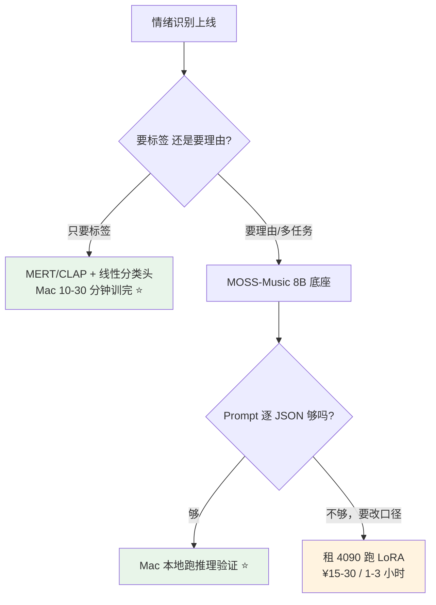

# 本地部署 LLM：小模型 + Ollama 实践

> 最后整理: 2026-09-11 | 来源: 对话

## 一句话定位

本地跑大模型不需要高配显卡——小参数模型（0.5B-3B）量化后在消费级 CPU 上就能跑，Ollama 把部署简化成一条命令。

---

## 1. 小模型能做什么

| 能做好 | 能做但一般 | 做不好 |
|--------|-----------|--------|
| 简单 QA | 写邮件/短文 | 复杂逻辑推理 |
| 翻译短文本 | 代码生成（简单） | 多步推理 |
| 摘要短文本 | 对话聊天 | 数学/编程难题 |

**核心限制**：小模型的问题不是"跑不跑得动"（都跑得动），而是"智能程度"。0.5B 基本只能说正确的废话，1.5B 能应付日常，3B 才开始有"像个正经助手"的感觉。

---

## 2. 推荐的小模型清单

| 模型 | 参数量 | 量化后大小 | 中文能力 | 推荐场景 |
|------|--------|-----------|----------|----------|
| **qwen3:0.6b** | 0.6B | ~400 MB | 优秀 | 最小可用，树莓派都能跑 |
| **qwen3:1.7b** | 1.7B | ~1.1 GB | 优秀 | 中文小模型首选 |
| **qwen3:4b** | 4B | ~2.5 GB | 优秀 | 1.7B 不够聪明时的下一档 |
| **gemma3:1b** | 1B | ~800 MB | 中上 | Google 出品，英文/多语言均衡 |
| **phi4-mini** | 3.8B | ~2.5 GB | 中上 | 微软出品，逻辑推理强 |

**中文场景推荐 qwen3:1.7b**，0.6B 太弱（只能做简单 QA），1.7B 是中文小模型甜点。

> **模型迭代很快**，上表的版本号（qwen3 / gemma3 / phi4-mini）以 2026-09 为准，实际部署前请以 [Ollama 模型库](https://ollama.com/library) 的当前 tag 为准；清单里的"哪一档参数"比"哪一代版本"更稳定。

---

## 3. 配置要求

```
0.9B 参数量 × 2 bytes (FP16) = ~1.8 GB 显存/内存

最低配置:
  CPU:  任何 4 核以上的 x86/ARM
  内存: 8 GB
  显卡: 不需要
  硬盘: 留 3 GB 空间放模型文件

实际体验:
  CPU 推理: ~5-10 tokens/s（能用但不快）
  有 GPU: ~50-100 tokens/s（飞起）
```

### 性能预期

```
0.5B 模型 (Apple M1/M2 CPU):
  推理速度: ~30-50 tokens/s
  启动时间: ~2 秒
  内存占用: ~400 MB

1.5B 模型 (Apple M1/M2 CPU):
  推理速度: ~15-30 tokens/s
  启动时间: ~3 秒
  内存占用: ~1 GB

3B 模型 (Apple M1/M2 CPU):
  推理速度: ~8-15 tokens/s
  启动时间: ~5 秒
  内存占用: ~2 GB

注：Intel CPU 大概是以上速度的 1/3 到 1/2
```

---

## 4. 量化精度

Ollama 仓库里的模型已经是量化好的 GGUF 格式，无需手动操作。

| 精度 | 大小比例 | 说明 | Ollama 默认使用 |
|------|----------|------|-----------------|
| Q2_K | 原始 / 16 | 便宜但质量下降明显 | 不用 |
| **Q4_K_M** | 原始 / 8 | **精度损失极小** | ✅ 默认 |
| Q5_K_M | 原始 / 6 | 几乎无损 | 偶尔用 |
| Q8_0 | 原始 / 4 | 接近无损 | 高配场景 |

**需要手动量化的场景**：从 HuggingFace 下载的原始 FP16 模型、自己微调训练出来的模型、想自定义量化精度。

> 关联: [llm.md 量化章节](./LLM（大语言模型）.md) — 量化原理详解

---

## 5. Ollama 详解

### 是什么

Ollama 就是一个本地 LLM 运行器（Runner）。类比：

```
Java 程序:  Java 代码（.jar） + JVM → 运行
大模型:     模型文件（GGUF） + Ollama → 运行
```

本质上，Ollama 内部就是在用 llama.cpp 推理引擎 + GGUF 格式的量化模型文件，只是把这套流程包装成了一条命令。

### 架构

```
装 Ollama 后，实际上装了两部分:

1. ollama server（后台守护进程）
   - 一直跑在后台
   - 加载模型到内存/显存
   - 提供 HTTP API（localhost:11434）

2. ollama CLI（前端命令行）
   - 你敲的 ollama run xxx
   - 连接 localhost:11434 发请求
   - 展示输出

┌──────────┐    HTTP POST     ┌──────────────────┐
│ ollama   │ ───────────────→ │ ollama server    │
│ run xxx  │ ←── stream ───── │ (加载模型/推理)    │
└──────────┘                  └──────────────────┘
                                     │
                                     ▼
                              ┌──────────────┐
                              │ 模型文件加载    │
                              │ 到内存/显存     │
                              └──────────────┘
```

### 三种使用方式

```bash
# 方式1: 交互式对话
ollama run qwen3:1.7b
>>> 你好
>>> 什么是机器学习？

# 方式2: 一次性提问（问完就退）
ollama run qwen3:1.7b "帮我解释什么是 transformer"

# 方式3: API 服务（给其他程序调用）
curl http://localhost:11434/api/generate \
  -d '{"model":"qwen3:1.7b","prompt":"你好"}'
```

### 资源占用

| 状态 | CPU | 内存 | 磁盘 |
|------|-----|------|------|
| Ollama 没启动 | 0 | 0 | 模型文件占 ~1 GB |
| server 运行但没加载模型 | ~0 | ~100 MB | ~1 GB |
| 模型加载中（对话中） | 低（idle 时几乎 0） | ~1 GB | ~1 GB |
| 对话结束但 keepalive 还没到 | 低 | ~1 GB（模型在内存） | ~1 GB |
| keepalive 超时后 | ~0 | ~100 MB | ~1 GB |

**模型自动卸载**：Ollama 默认 5 分钟后自动卸载模型（内存释放，磁盘保留）。

```bash
# 自定义保持时间
OLLAMA_KEEP_ALIVE=5m ollama run qwen3:1.7b    # 5 分钟
OLLAMA_KEEP_ALIVE=0 ollama run qwen3:1.7b      # 永久驻留
OLLAMA_KEEP_ALIVE=-1 ollama run qwen3:1.7b     # 用完即走
```

### 退出方式

```bash
# 交互式对话中:
>>> /bye           # 退出交互
# 或者 Ctrl+D

# 停止 ollama server:
ollama stop qwen3:1.7b    # 卸载指定模型
# 或者:
brew services stop ollama   # 完全停止后台服务

# 暴力方案:
pkill ollama               # 杀进程
```

日常用法：问完直接 `/bye` 或 `Ctrl+D`，模型 5 分钟后自动释放，无需手动操作。

---

## 6. 安装步骤（macOS）

```bash
# 1. 安装 Ollama
brew install ollama
# 或者: curl -fsSL https://ollama.com/install.sh | sh

# 2. 启动并运行一个小模型
ollama run qwen3:1.7b
# 首次运行会自动下载模型文件（~1 GB），之后即可对话

# 3. 对话示例
>>> 你好，请帮我解释一下什么是机器学习

# 4. 其他可选模型
ollama run qwen3:0.6b         # 更小更快
ollama run gemma3:1b         # Google 出品，多语言均衡
ollama run phi4-mini         # 微软出品，逻辑推理强
```

### llama.cpp 方式（不用 Ollama，更灵活）

```bash
# 1. 安装
brew install llama.cpp

# 2. 下载模型（HuggingFace GGUF 格式）
huggingface-cli download Qwen/Qwen3-1.7B-GGUF \
  --include "*q4_k_m.gguf" \
  --local-dir ./models

# 3. 启动交互式对话
llama-cli --model ./models/qwen3-1.7b-q4_k_m.gguf \
  --ctx-size 4096 \
  --interactive \
  --prompt "你好"

# 4. 或者启动 API 服务器（给其他程序调用）
llama-server --model ./models/qwen3-1.7b-q4_k_m.gguf \
  --host 127.0.0.1 \
  --port 8080 \
  --ctx-size 4096

# 然后: curl http://127.0.0.1:8080/v1/chat/completions \
#   -H "Content-Type: application/json" \
#   -d '{"messages":[{"role":"user","content":"你好"}]}'
```

**Ollama vs llama.cpp**：Ollama 一条命令搞定，llama.cpp 需要自己下载模型但灵活性更高（可自定义量化精度、上下文长度等参数）。

---

## 7. Ollama 进阶玩法

### 7.1 本地 API（给代码调用）

Ollama 自带 HTTP API（`localhost:11434`），兼容 OpenAI 格式。任何支持 OpenAI SDK 的代码都能直接切到本地模型：

```python
# pip install openai
from openai import OpenAI

client = OpenAI(base_url="http://localhost:11434/v1", api_key="ollama")

resp = client.chat.completions.create(
    model="qwen3:1.7b",
    messages=[{"role": "user", "content": "解释一下 Python 的装饰器"}]
)
print(resp.choices[0].message.content)
```

也可以直接用 `curl`：

```bash
curl http://localhost:11434/v1/chat/completions \
  -H "Content-Type: application/json" \
  -d '{"model":"qwen3:1.7b","messages":[{"role":"user","content":"你好"}]}'
```

**价值**：Python 脚本、AI 应用、IDE 插件都能用本地模型，不花钱、不联网、不限流。

### 7.2 跑多模态模型（看图说话）

Ollama 支持视觉模型，可以直接喂图片：

```bash
ollama run llava:7b         # LLaVA，能看懂图片
ollama run minicpm-v:8b     # MiniCPM-V，中文视觉理解更好
```

### 7.3 Embedding 模型（向量化）

做 RAG/相似度匹配时需要把文本转成向量：

```bash
ollama pull nomic-embed-text   # 专用 embedding 模型

curl http://localhost:11434/api/embed \
  -d '{"model":"nomic-embed-text","input":["你好","hello"]}'
```

返回两个向量，可以算余弦相似度。

### 7.4 自定义模型（Modelfile）

基于基础模型创建自定义"人格"：

```dockerfile
# Modelfile
FROM qwen3:1.7b

SYSTEM """
你是一个资深 Java 后端开发助手。
回答时要用简洁的技术语言，优先给代码示例。
不要说废话。
"""
```

```bash
# 构建自定义模型
ollama create my-assistant -f Modelfile

# 使用
ollama run my-assistant
```

**相当于给模型写了个 System Prompt 模板**，以后不用每次都重复设定。

### 7.5 常用模型管理命令

```bash
ollama list                    # 查看本地已下载的模型
ollama rm qwen3:0.6b         # 删除不用的模型（省磁盘）
ollama cp qwen3:1.7b my-qa   # 复制模型（方便改 Modelfile）
ollama show qwen3:1.7b       # 查看模型详情（参数量、架构等）
```

### 7.6 Web UI（图形界面）

```bash
# Open WebUI（最流行的 Ollama Web 界面，类 ChatGPT 体验）
docker run -d -p 3000:8080 \
  -v open-webui:/app/backend/data \
  --name open-webui \
  ghcr.io/open-webui/open-webui:main

# 浏览器访问 http://localhost:3000
```

### 7.7 模型存储路径

```
macOS 默认路径:  ~/.ollama/models/
├── manifests/     ← 模型元数据
└── blobs/         ← 模型权重文件（GGUF）

自定义路径:
  OLLAMA_MODELS=/Volumes/外置硬盘/ollama-models ollama run qwen3:1.7b
  # 或永久设置: echo 'export OLLAMA_MODELS="..."' >> ~/.zshrc
```

**不需要切换到特殊目录**，Ollama 在任何工作目录下行为一致。

---

## 8. Mac 能不能拿来微调？48G 够不够？

**结论：48GB 统一内存"装得下"8B 模型的 LoRA，但"跑得动"是另一回事——实际不建议在 Mac 上训 8B。**

### 8.1 先分清两件事：容量 vs 带宽

ROI 最高的认知：**微调瓶颈不是"内存够不够"，是"内存带宽 + 后端算子覆盖"。**

| 设备 | 统一内存/显存带宽 | 相对 4090 |
|------|-----------------|----------|
| M4 Pro（48GB 档） | **273 GB/s** | 0.27× |
| M4 Max（48GB 档） | **546 GB/s**（满配 40 核 GPU；14 核 CPU 版本 410 GB/s） | 0.54× |
| RTX 4090（24GB） | 1008 GB/s | 1× |
| A100 80GB | 1555~2039 GB/s | 1.5~2× |
| H100 80GB | ~3350 GB/s | 3.3× |

> 数据来源：[Apple 官方规格](https://support.apple.com/en-nz/121553)（273/410/546 GB/s 三档）。

**算一下显存账**（8B 音乐理解模型）：

```
底座权重 bf16:      8B × 2B = 16 GB
+ 音频编码器(32层):          ~1.5 GB
+ LoRA 参数(r=16):           ~0.1 GB（可忽略）
+ 梯度 + Adam 状态:          ~0.5 GB
+ 激活值(batch=1, 序列 4k):  5~10 GB   ← 变量最大的一项
─────────────────────────────────────
合计约 23~28 GB → 48GB 内存**装得下**
```

### 8.2 但 MPS 后端有三个真实的坑

| 坑 | 后果 |
|----|------|
| **bitsandbytes 在 MPS 上基本不可用** | ❌ **QLoRA 走不通**，只能 bf16 LoRA（好在 PyTorch 新版 macOS 支持 bf16 混合精度了） |
| **FlashAttention 2 无 MPS 实现** | 退化成朴素 attention，长序列显存和速度都吃亏 |
| **自定义多模态代码路径** | 音频编码器 + DeepStack forward hook 这类非标准算子，MPS 很容易缺算子 → **静默回退 CPU** → 慢到不可用 |

第三点最致命：它不会报错，只会让你以为"Mac 就是慢"。

### 8.3 时间账：为什么 Mac 训练不划算

假设 2000 条 30 秒片段（约 375 audio token/条）：

| 设备 | 单步耗时（估） | 3 epoch 总时长 |
|------|--------------|---------------|
| RTX 4090 | ~1-2 s | **约 1.5~3 小时** |
| A100 | ~0.5-1 s | 约 1 小时 |
| M4 Max（若算子全支持） | ~10-20 s | **约 10~25 小时** |
| M4 Max（部分回退 CPU） | 不可估 | 天数级，别试 |

**租云 GPU 的成本对比**（[RunPod 公开价](https://toolchase.com/tool/runpod/) 4090 $0.69/hr，A100 $1.39~2.34/hr；国内平台 4090/A100 档位价量级接近）：

```
4090 跑 3 小时 ≈ $2 ≈ ¥15        ← 一次性训练的真实成本
A100 跑 1.5 小时 ≈ $2.5 ≈ ¥18
```

**结论：训练花 ¥15~30 租卡，比在 Mac 上耗 20 小时（还未必跑得起来）划算得多。**

### 8.4 Mac 到底该怎么用（三分法）

| 阶段 | Mac 48GB 合适吗 | 说明 |
|------|---------------|------|
| **数据准备 / 标注 / 听样本** | ✅ 非常合适 | 你的主力工作机 |
| **推理 / 试 Prompt / 验证效果** | ✅ 可以（8B bf16 能跑，慢） | 先用小样本验证 Prompt 够不够，再决定要不要微调 |
| **训练 8B 级模型** | ❌ 不划算 | 租云 GPU |
| **训练小模型（分类头 / 4B 以下）** | ✅ 可行 | 冻结底座 + 只训分类头，10~30 分钟 |

### 8.5 一个更省的选择：别微调 8B，训个小分类头

情绪识别这类**分类任务**，真正划算的做法是：

```
冻结的音频编码器（如 MERT，95M/330M）
        ↓ 输出 embedding（不训练）
   一层线性分类头（几千个参数）
        ↓
     情绪标签
```

- **MERT** 是专门做音乐理解的自监督模型（95M / 330M，[论文](https://browse.arxiv.org/abs/2306.00107v2)），走 CQT + RVQ 路线，本来就是为音乐任务设计的
- 训练量：**Mac 上 10~30 分钟**就够，参数从几亿降到几千
- 而且分类任务上，**专用小模型经常比 8B 多模态模型更准**（它没有被通用能力分散容量）

**什么时候还是该用 8B 多模态底座**：你要的不只是标签，而是**能解释的理由**（"副歌转大调、BPM 128、加失真吉他 → 激昂"），或者要顺带产出歌词、和弦、曲式。



---

> 关联: [llm.md](./LLM（大语言模型）.md) — LLM 核心原理（架构、KV Cache、量化原理）
> 关联: [微调与 LoRA](<./微调与 LoRA：让通用模型学你的领域.md>) — §3-§5 的决策梯子、LoRA 数学与四步流水线（本章是它的"硬件篇"）
