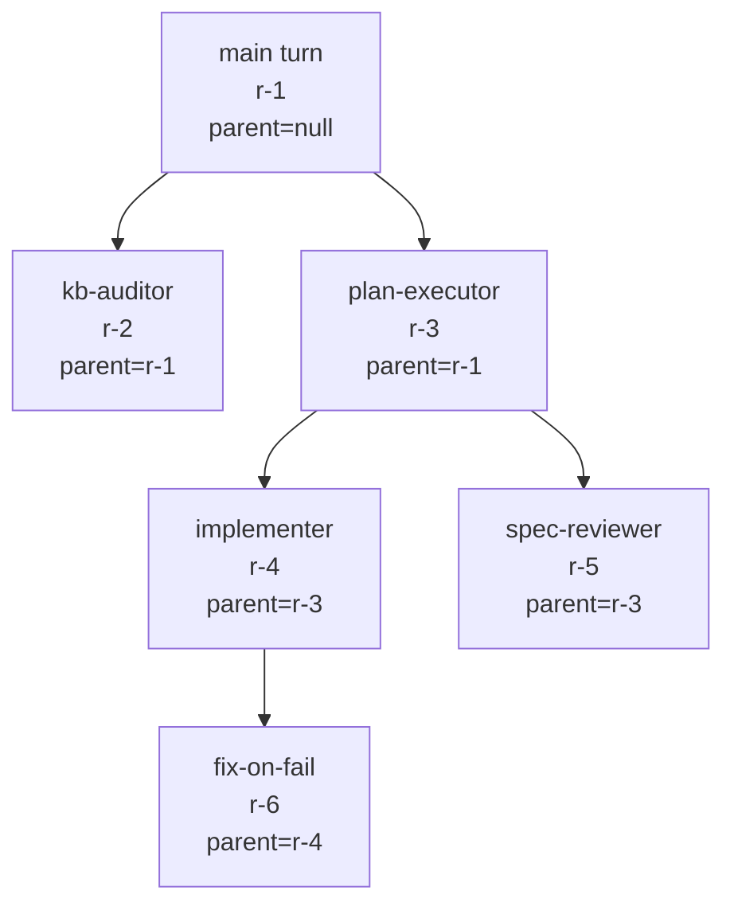
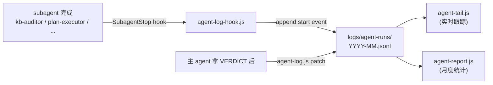

# Agent Observability：调用链追踪与排障

> 最后整理: 2026-06-03 | 来源: 黄佳《Claude Code 工程化实战》课程 + Anthropic Building Effective Agents + 本项目 logs/agent-runs/ 落地实战

> 关联: [子智能体（subagents）机制与实战](<../Claude-Code/子智能体（subagents）机制与实战.md>) — subagent 是 observability 最重要的 trace 对象
> 关联: [Agent 四大设计范式（深度展开）](<./Agent 四大设计范式（深度展开）.md>) — Orchestrator-Worker 的 trace 拼树
> 关联: [Hooks 事件全景与拦截机制](<../Claude-Code/Hooks 事件全景与拦截机制.md>) — SubagentStop hook 是埋点底座
> 关联: [Harness Engineering：AI Agent 时代的工程范式](<../Claude-Code/Harness Engineering：AI Agent 时代的工程范式.md>) — observability 是 harness 三层模型的"文档层"

---

## §1 一句话定位

**Observability = "知道 agent 在干什么"的能力。**

不是单一工具，是一类工具/方法的统称。在 Agent 场景具体回答 4 个问题：

1. **谁调了谁**：主 agent 调了哪些 subagent？嵌套了几层？
2. **干了什么**：每个 agent 用了哪些 tool？参数是什么？返回什么？
3. **慢在哪**：哪一步耗时最长？是 LLM 调用慢还是 tool 慢？
4. **挂在哪**：哪一步失败了？为什么？是超时、tool error 还是 LLM 拒绝？

回答不了这 4 个问题，agent 上生产就是黑盒——出 bug 只能凭感觉调 prompt，毫无工程化可言。

---

## §2 为什么 agent 比传统服务更难排障

传统 Java 后端排障靠的是：日志（log4j）+ 指标（Prometheus QPS/latency）+ 链路（Skywalking trace）。Agent 套用过来不够用：

| 维度 | 传统服务 | Agent 系统 |
|---|---|---|
| **行为是否确定** | 输入 X → 输出 Y 稳定 | 同样输入两次执行路径不同（LLM 非确定性） |
| **调用链是否预定** | 代码里 if/else 写死 | LLM 运行时决定调哪个 tool / 哪个 subagent |
| **失败模式** | 异常 stack trace 清楚 | "LLM 选错了工具""LLM 总结丢了关键信息"——日志里没异常但结果错 |
| **耗时构成** | DB 查询 / 网络 IO 占大头 | LLM 调用占 80%+，且每次 token 数不同 |
| **可重放** | 同样 SQL 跑一次结果一致 | 同样 prompt 跑两次输出不同（temperature > 0） |

具体后果：

- **traditional log（"info: doing X"）记不下 LLM 的"思考过程"** —— 思考过程在 prompt response 里，不打印就丢
- **传统 metric（QPS / P99）不够** —— 你需要的是 "tool A 被 agent X 调用了几次，每次成功率"
- **stack trace 找不到根因** —— 真正的"根因"是 LLM 选了错的工具，不是某段代码 throw exception

所以 Agent observability 必须**专门设计**——传统 APM 工具能给你 LLM API 调用的时延，但拼不出 "Lead Researcher → Sub-Agent 3 → Web Search → 失败 → fallback 到 Sub-Agent 5" 这种 agent 级时序。

---

## §3 核心数据模型：span + parent_id 拼树

不管哪家工具，底层都用同一套数据模型——**分布式追踪的 span 概念**搬到 agent 上：

```
每条 run 是一个 span：
{
  id: "r-2026-06-03-02-06-0363",   // span id（唯一）
  parent_id: null | "r-...",        // 形成 tree
  agent: "main" | "kb-auditor" | "implementer" | ...,
  start_time: "2026-06-03T02:06:15.832Z",
  duration_ms: 16791209,
  tools_used: ["Read", "Grep", "Bash", ...],
  outcome: success | partial | blocked | unknown,
  // 可选字段
  title: "审 Agent 与 MCP.md",
  summary: "VERDICT: minor (6 处建议)。Mermaid 化 + 章节归属调整",
  files_changed: [...]
}
```

**parent_id 是关键**——把扁平的事件流拼成树：



这棵树就是**完整调用链**。每条边是一次 spawn，每个节点是一段 agent 执行。渲染成 timeline / Gantt / waterfall 都行——形态不同但底层数据一致。

---

## §4 主流工具对比

| 工具 | 定位 | 接入方式 | 适合场景 | 缺点 |
|---|---|---|---|---|
| **Anthropic Console** | API 层 trace + token 统计 | 有 API key 就有，免费 | 看每次 LLM 调用的 prompt / response / tokens | 看不到 agent 级别（只看 API call） |
| **LangSmith** | LangChain 生态标配 | `LANGSMITH_API_KEY=...` env，SDK 自动埋点 | LangChain / LangGraph 项目，可视化 chain 时序图 | 强绑 LangChain，原生不支持 Agent SDK |
| **Helicone** | API 代理 | 改 `base_url` 指向 helicone.ai | 任何 OpenAI/Anthropic 兼容 SDK，0 代码改 | 多一跳网络；仅 API 层数据 |
| **OpenTelemetry (OTLP)** | 通用 trace 协议 | OTLP exporter env var + SDK | 已有 Jaeger/Datadog/Tempo 想接进去 | 需要自己埋点 / 选 instrumentation 包 |
| **Langfuse** | LangSmith 的开源对手 | 自部署 / SaaS | 想自部署、不想依赖 LangChain | 生态没 LangSmith 大 |
| **自建 hook + jsonl** | 项目级最简方案 | Claude Code SubagentStop hook 写 jsonl | 单人/小团队、不想引依赖 | 没有 P95 / 复杂查询，仅事件流 |

> **本项目当前选择**：自建 hook + jsonl（见 §5 详解）。规模 <10 run/day，agent 数量 ≤5，hook + jsonl 完全够。规模上来再升级。

### §4.1 选型决策表

| 你的状况 | 推荐方案 |
|---|---|
| 单人 KB / 个人项目 | 自建 hook + jsonl |
| 团队 5 人内、用 Claude Code 为主 | 自建 hook + jsonl + 共享一个 dashboard 脚本 |
| 团队 10+ 人、已用 LangChain | LangSmith |
| 已有 OTel 基础设施（Jaeger / Datadog） | OTel exporter |
| 跨多家 LLM provider（不只 Anthropic） | Helicone（代理层）+ OTel |
| 需要 P95 / P99 / 复杂聚合 | LangSmith / Langfuse / Datadog |

---

## §5 本项目自建 jsonl 落地详解

### §5.1 整体架构



文件按月切：`logs/agent-runs/2026-06.jsonl`。每行一个 JSON 事件，类型有 `start` / `patch`。

### §5.2 数据流：start event

`SubagentStop` hook 触发时，`scripts/agent-log-hook.js` 写一条 start event：

```jsonl
{"event":"start","id":"r-2026-06-03-02-06-0363","time":"2026-06-02T18:06:15.832Z","agent":"main","parent_id":null,"tools_used":["Skill","Bash","Read","Edit","Write","Agent"],"files_changed":[".claude/agents/README.md","tests/subagents.test.js","..."],"duration_ms":16791209,"outcome":"unknown","model":"claude-opus-4-7","title":null,"summary":null}
```

注意 `outcome="unknown"` + `title=null` + `summary=null`——hook 拿不到语义判断，只能机械记录"调了哪些 tool"。

### §5.3 数据流：patch event（关键纪律）

主 agent dispatch subagent 完拿到 `VERDICT:` 行后，**立即** patch：

```bash
node scripts/agent-log.js patch \
  --id last \
  --title "kb-auditor 审 Agent 与 MCP.md" \
  --summary "VERDICT: minor (6 处建议)。Mermaid 化 + 章节归属调整" \
  --outcome partial
```

写入：

```jsonl
{"event":"patch","id":"r-2026-06-03-02-06-0363","time":"2026-06-02T18:07:32.594Z","title":"kb-auditor 审 Agent 与 MCP.md","summary":"VERDICT: minor...","outcome":"partial"}
```

`agent-tail.js` 和 `agent-report.js` 读取时按 `id` fold（同 id 的 start + patch 合并）——start 提供机械事实，patch 补语义。

> 这是项目的强制纪律：`memory/feedback-agent-log-patch.md`（见 MEMORY.md 索引）。不 patch 等于这条 run 永远是 unknown，月底报告里就是空白。

### §5.4 outcome 三态判定

| outcome | 何时打 | VERDICT 信号 |
|---|---|---|
| `success` | 全部正常 | `pass` / `completed` |
| `partial` | 跑通有警告 / 部分完成 | `minor` / `partial (N/M)` |
| `blocked` | 失败、卡死、无法 unblock | `major` / `blocked` |

### §5.5 月度报告样例

```
$ node scripts/agent-report.js 2026-06
=== Agent Runs Report 2026-06 ===

总条目数: 23
按 agent 分组:
  main: 18 (success=14, partial=3, blocked=1)
  kb-auditor: 3 (success=1, partial=2)
  idea-extractor: 1 (success=1)
  general-purpose: 1 (partial=1)

工具使用 Top:
  Bash: 21 次
  Read: 19 次
  Edit: 15 次
  Grep: 12 次
  Skill: 11 次
  Agent: 5 次

失败明细:
  r-2026-06-15: blocked at task 3 (plan-executor)
  ...
```

够日常 retro，不够 P95 latency 分析。规模上来想要 latency 分位数 / 复杂聚合 → 升级 LangSmith。

### §5.6 实时跟踪

```
$ node scripts/agent-tail.js -n 5
时间                  agent          标题                                outcome
2026-06-03 02:07     main           应用 audit 建议 + 加 preflight       ✓
2026-06-03 02:06     kb-auditor     审 Agent 与 MCP.md                   ⚠
2026-06-03 01:57     main           写 spec/plan + 实施三 subagent       ✓
...
```

跟 `tail -f` 类似，看最近 N 条 run 的状态。

---

## §6 何时升级到 SaaS

自建 jsonl 是起步合理选择，但有 3 个天花板：

| 痛点 | 自建难做 | SaaS 优势 |
|---|---|---|
| **复杂聚合查询** | jsonl 全表扫，慢 | LangSmith / Langfuse 有索引 |
| **P50/P95/P99 latency** | 需要自己写聚合脚本 | dashboard 直接出 |
| **多人协作 dashboard** | 需要部署 web 服务 | SaaS 自带 |
| **prompt diff / replay** | 没有 prompt 内容（只有 tool 名） | LangSmith 完整存 prompt |
| **告警** | 没有 | 设阈值自动 Slack 通知 |

实际触发升级的信号：

- **Run 量级 ≥ 100/day**：jsonl 文件超过 10 MB，scan 慢
- **agent 类型 ≥ 10**：报告维度多，文本格式不够
- **团队 ≥ 5 人**：每人都要查不同 agent，需要 dashboard
- **要做 latency 分析**：自建需要写聚合脚本，不如直接上 SaaS

升级路径建议：
1. **先加 OTel exporter**——保留 jsonl 双写，外加 OTLP 上 Jaeger 看 trace
2. **再选 SaaS**——LangSmith / Langfuse / Datadog（按团队已有基础设施选）
3. **最后下 jsonl**——确认 SaaS 能完全替代后才下，避免单点依赖

---

## §7 常见坑

### §7.1 忘记 patch agent-log

最常见。主 agent dispatch subagent 拿到 verdict 后只把建议落地、commit，没 patch agent-log → 月底报告里 outcome 全 unknown，价值归零。

**根治**：靠 `memory/feedback-agent-log-patch.md`（项目 memory）强化；项目集成 Stop hook 自动检测"未 patch 的 start event"也可以兜底。

### §7.2 复制 audit 报告全文进主对话

`kb-auditor` 把详细 report 写到 `logs/audits/<file>-YYYY-MM-DD.md`，主 agent 拿 verdict 后**只引用路径**即可。把 200 行 report 复制进主对话 → 浪费 context window。

### §7.3 hook 写入失败静默丢事件

SubagentStop hook 有 timeout（10s）。如果 hook 脚本 bug 或慢 → 事件丢失，外面看不到错误。

**根治**：hook 脚本里加 `try/catch`，失败时写 stderr（hook stderr 会进 Claude Code 调试输出）；hook 内部不依赖网络/外部服务。

### §7.4 trace 拼不出树

`parent_id` 字段没填对——hook 拿不到主 agent 的 run_id 时常见。

**根治**：spawn subagent 时通过 prompt / env var 把 `parent_id` 传给 subagent；subagent 的 hook 优先从 env / prompt 读 parent_id。

### §7.5 大 chain 看不出"瓶颈点"

trace 数据有，但平铺 jsonl 看不出 "哪一步最慢"。

**根治**：报告脚本里按 duration_ms 排序输出 Top N 慢的 run；或者 export 到 OTel 用 Jaeger 看时序图。

---

## §8 与本项目其他系统的关系

| 系统 | 关系 |
|---|---|
| `.claude/agents/*.md`（subagent 定义） | observability 的"被观测对象" |
| SubagentStop hook（settings.json） | observability 的"埋点底座" |
| `scripts/agent-log.js patch` | observability 的"语义补全" |
| `scripts/agent-report.js` | observability 的"分析层" |
| `memory/feedback-agent-log-patch.md` | observability 的"运行纪律" |
| Harness Engineering 三层模型（约束/反馈/文档） | observability 是文档层的核心 |

总结一条线：**hook 写机械事实 → 主 agent patch 补语义 → 报告脚本聚合 → 月度 retro 改进 prompt/tool 配置**。这是 Agent 系统能从"原型"走到"工程化"的关键反馈环。

---

## §9 进阶话题

### §9.1 prompt diff & replay

更高级的 observability 工具能存**完整 prompt + response**，让你：
- 对比两个版本 prompt 的输出差异（A/B test）
- 失败 case 用同样 prompt replay 一次（看是 LLM 非确定性还是 prompt bug）

本项目 jsonl 没存 prompt（只存 tool 列表），无法做这件事。LangSmith / Langfuse 自带。

### §9.2 token 成本分析

每条 run 记 `prompt_tokens` + `completion_tokens` + `cached_tokens`，按 model 价格计算 cost。月底能看出"哪个 agent 最烧钱"——通常是 plan-executor（嵌套 spawn）。

### §9.3 multi-tenant trace

SaaS 场景：多个用户共用 agent 系统，trace 要按 user_id 隔离。span 加 `user_id` 字段、查询时按 user 过滤。本项目单用户不涉及。

### §9.4 与 evals 的联动

把 trace 数据接到 evals 框架（如 promptfoo / DeepEval）：
- 抓真实生产 case → 自动生成 eval set
- prompt 改完 → 跑 eval 验证回归
- evals 失败 → 反查 trace 看根因

这是 agent 系统从"上线即终点"走到"持续改进"的关键。

---

## 总结

Agent observability 的本质：**span + parent_id 拼树 + outcome 三态判定**。

工具选型按团队规模 + 已有基础设施定，但底层数据模型一致——所以**先建轻量自建（hook + jsonl）跑起来**，等真的撞到 SaaS 优势那 5 个痛点再升级。最坏情况：自建运行半年沉淀了规律，升级时直接知道哪些字段值得保留。

不要在还没有 trace 的时候就纠结"该上 LangSmith 还是 Langfuse"——先有 100 条 jsonl 再说。
