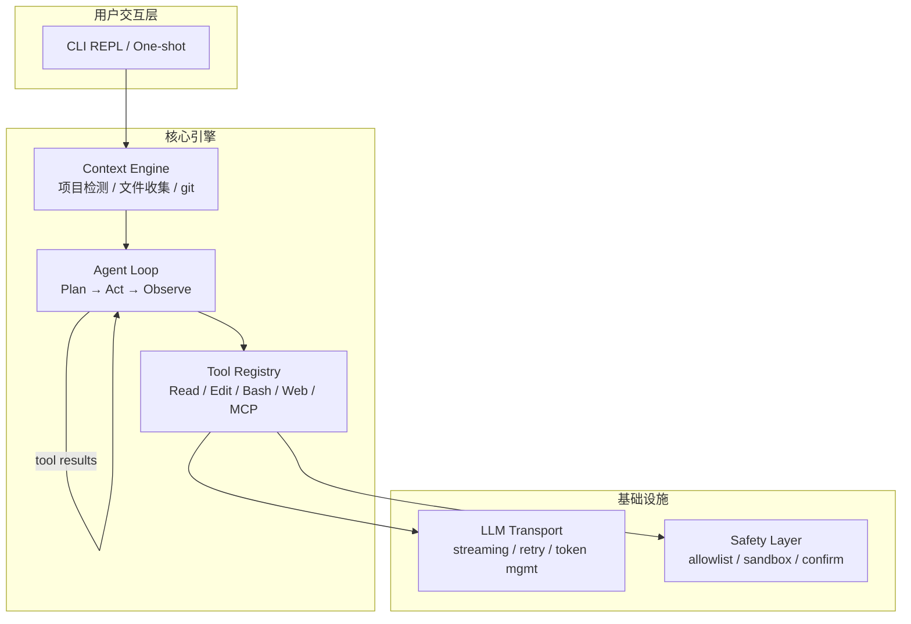
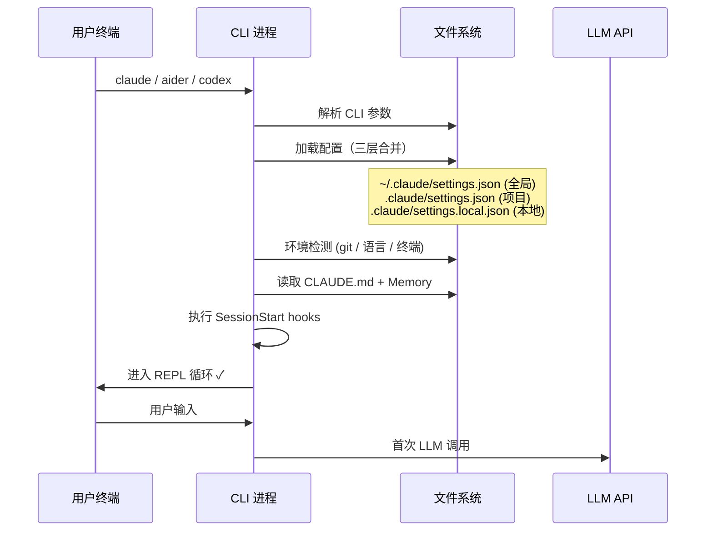
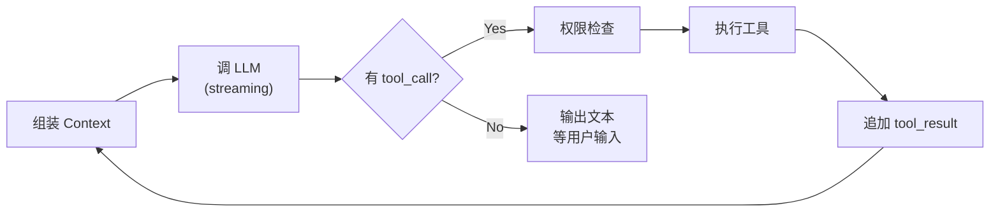
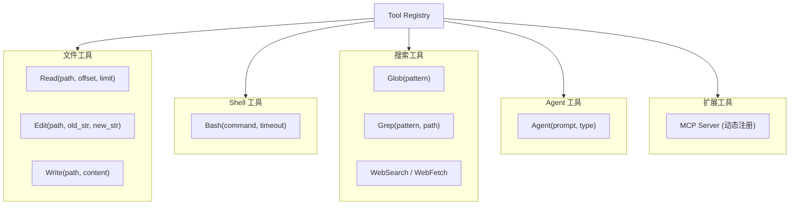
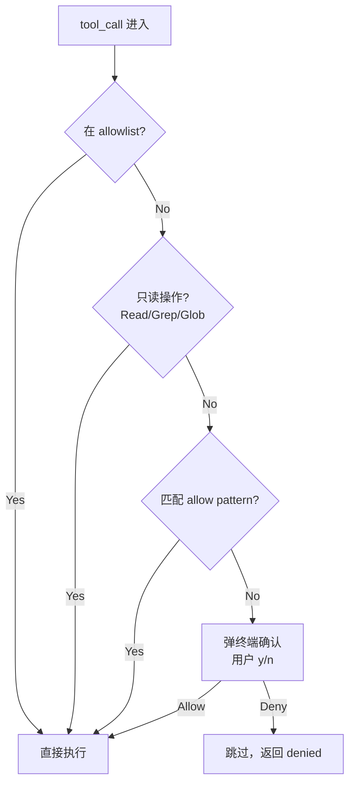
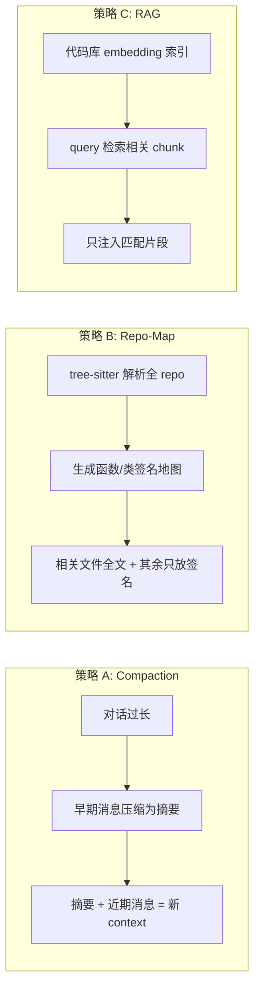
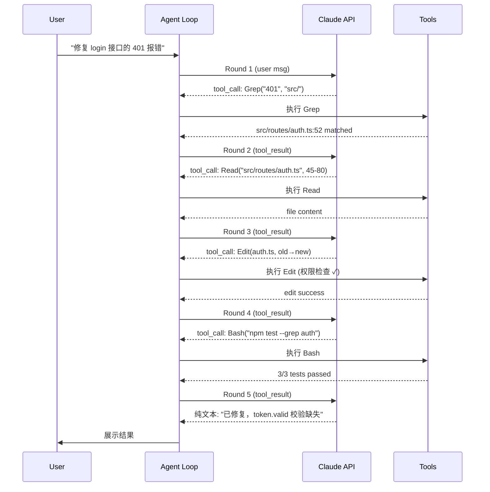

> 最后整理: 2026-06-05 | 来源: 对 Claude Code / Aider / OpenAI Codex CLI 源码的逆向分析 + 实践总结

## 1. 全景架构

所有 CLI coding agent（Claude Code、Aider、Codex CLI、Cursor Agent）底层架构高度趋同——本质是 **LLM + Tool Use + REPL** 的 Agent Loop。



**核心洞察**：这些产品的差异不在架构模式（都是 ReAct），而在 Context 管理策略、编辑可靠性、权限粒度这三个工程细节上。

## 2. 启动流程



**配置合并优先级**（低→高）：全局 → 项目 → 本地 → CLI 参数

启动阶段的关键动作：
- **Git 检测**：获取 branch、status、remote，决定能不能 push
- **项目指令**：CLAUDE.md（Anthropic）/ `.aider.conf.yml`（Aider）/ `codex.md`（OpenAI）
- **Hook 执行**：preflight 检查（如本项目的 15 项 lint）

## 3. Agent Loop — 核心执行引擎

这是所有 CLI agent 最关键的 100 行代码。本质是一个 **ReAct 循环**：



### 伪代码实现

```python
# 最小可运行的 Agent Loop (~30 行核心逻辑)
def agent_loop(messages, tools):
    while True:
        response = llm.chat(messages=messages, tools=tools)
        messages.append({"role": "assistant", "content": response.content})

        tool_calls = [b for b in response.content if b.type == "tool_use"]

        if not tool_calls:
            # 纯文本回复 → 回合结束
            return response.text

        # 执行所有 tool calls
        tool_results = []
        for tc in tool_calls:
            if not permission_check(tc):
                result = "Permission denied by user"
            else:
                result = execute_tool(tc.name, tc.input)
            tool_results.append({
                "type": "tool_result",
                "tool_use_id": tc.id,
                "content": result
            })

        messages.append({"role": "user", "content": tool_results})
        # 自动 loop back → LLM 看到工具结果后继续推理
```

### 关键设计决策

| 设计点 | 做法 | 原因 |
|--------|------|------|
| 循环终止 | LLM 不再发 tool_call | 让模型自己决定何时"够了" |
| 并行工具 | 一次回复可多个 tool_call，并行执行 | 减少 round-trip |
| 错误传播 | 执行失败 → 把 error 作为 tool_result 返回 | LLM 自行修复，不需要硬编码重试 |
| 流式输出 | SSE stream + tool_call 分块解析 | 用户看到实时进度 |

## 4. 工具系统（Tool Registry）



**工具注册是声明式的**——每个工具提供 JSON Schema（名称 + 参数 + 用途描述），LLM 根据 schema 自主决定调用什么。

### 工具定义示例（Claude API 格式）

```json
{
  "name": "edit_file",
  "description": "Replace exact string in a file. old_string must be unique.",
  "input_schema": {
    "type": "object",
    "properties": {
      "file_path": {"type": "string", "description": "Absolute path"},
      "old_string": {"type": "string", "description": "Text to find"},
      "new_string": {"type": "string", "description": "Replacement text"}
    },
    "required": ["file_path", "old_string", "new_string"]
  }
}
```

### 编辑策略对比

| 产品 | 编辑方式 | 优点 | 缺点 |
|------|----------|------|------|
| Claude Code | 精确字符串替换 | 最小化 diff，不会误改 | old_string 必须唯一 |
| Aider | unified diff / whole file | 大段修改高效 | diff 格式容易出错 |
| Codex CLI | whole file rewrite | 实现最简单 | token 浪费大 |
| Cursor | 精确替换 + apply model | 速度快 | 需要专门的 apply 模型 |

## 5. 权限与安全层



**各产品的权限模型**：

| 产品 | 模式 |
|------|------|
| Claude Code | 3 级 allowlist + 逐条确认 + hook 拦截 |
| Aider | auto-commit（文件自动）/ shell 不执行 |
| Codex CLI | suggest → auto-edit → full-auto 三档 |
| Cursor | IDE 沙箱内，用户可 Accept/Reject diff |

## 6. Context Window 管理（最大工程挑战）

这是各家差异最大、投入最重的部分：



| 策略 | 代表产品 | 优点 | 缺点 |
|------|----------|------|------|
| Compaction | Claude Code | 连续长对话不断 | 压缩时可能丢细节 |
| Repo-Map | Aider | 首次就有全局视野 | 大 repo map 本身很大 |
| RAG + Embedding | Cursor | 精准定位 | 需额外索引服务 |

## 7. 完整执行示例

用户输入：`"修复 login 接口的 401 报错"`



## 8. 从 0 搭建 Demo 的最小实现

一个能实际工作的 coding agent demo，核心只需要：

### 最小组件清单

```
my-coding-agent/
├── main.py          ← REPL + Agent Loop (~80 行)
├── tools.py         ← 3 个工具实现 (~60 行)
├── prompts.py       ← System prompt (~30 行)
└── requirements.txt ← anthropic (唯一依赖)
```

### 可运行 Demo（Python，~150 行总计）

```python
# main.py — 完整的 coding agent demo
import anthropic
from tools import TOOLS, execute_tool

client = anthropic.Anthropic()  # 自动读 ANTHROPIC_API_KEY

SYSTEM = """You are a coding assistant. You can read files, edit files, 
and run shell commands to help the user with programming tasks.
Always verify your changes by reading the file after editing."""

def agent_loop(user_msg: str, history: list):
    history.append({"role": "user", "content": user_msg})

    while True:
        response = client.messages.create(
            model="claude-sonnet-4-6",
            max_tokens=4096,
            system=SYSTEM,
            messages=history,
            tools=[t["schema"] for t in TOOLS],
        )
        history.append({"role": "assistant", "content": response.content})

        # 打印文本部分
        for block in response.content:
            if hasattr(block, "text"):
                print(f"\n{block.text}")

        # 提取 tool calls
        tool_uses = [b for b in response.content if b.type == "tool_use"]
        if not tool_uses:
            break  # 回合结束

        # 执行并收集结果
        results = []
        for tu in tool_uses:
            print(f"  🔧 {tu.name}({tu.input})")
            output = execute_tool(tu.name, tu.input)
            print(f"  ✓ done ({len(output)} chars)")
            results.append({
                "type": "tool_result",
                "tool_use_id": tu.id,
                "content": output,
            })
        history.append({"role": "user", "content": results})

def main():
    history = []
    print("Mini Coding Agent (type 'quit' to exit)")
    while True:
        user_input = input("\n> ")
        if user_input.strip().lower() in ("quit", "exit"):
            break
        agent_loop(user_input, history)

if __name__ == "__main__":
    main()
```

```python
# tools.py — 三个核心工具
import subprocess, os

TOOLS = [
    {
        "schema": {
            "name": "read_file",
            "description": "Read a file and return its contents",
            "input_schema": {
                "type": "object",
                "properties": {
                    "path": {"type": "string", "description": "File path"}
                },
                "required": ["path"]
            }
        }
    },
    {
        "schema": {
            "name": "edit_file",
            "description": "Replace old_string with new_string in a file",
            "input_schema": {
                "type": "object",
                "properties": {
                    "path": {"type": "string"},
                    "old_string": {"type": "string"},
                    "new_string": {"type": "string"}
                },
                "required": ["path", "old_string", "new_string"]
            }
        }
    },
    {
        "schema": {
            "name": "bash",
            "description": "Run a shell command and return output",
            "input_schema": {
                "type": "object",
                "properties": {
                    "command": {"type": "string"}
                },
                "required": ["command"]
            }
        }
    },
]

def execute_tool(name: str, params: dict) -> str:
    if name == "read_file":
        path = params["path"]
        if not os.path.exists(path):
            return f"Error: {path} not found"
        with open(path) as f:
            lines = f.readlines()
        return "".join(f"{i+1}\t{l}" for i, l in enumerate(lines))

    elif name == "edit_file":
        path, old, new = params["path"], params["old_string"], params["new_string"]
        with open(path) as f:
            content = f.read()
        if old not in content:
            return f"Error: old_string not found in {path}"
        if content.count(old) > 1:
            return f"Error: old_string appears multiple times, be more specific"
        content = content.replace(old, new, 1)
        with open(path, "w") as f:
            f.write(content)
        return f"Successfully edited {path}"

    elif name == "bash":
        try:
            result = subprocess.run(
                params["command"], shell=True,
                capture_output=True, text=True, timeout=30
            )
            output = result.stdout + result.stderr
            return output[:5000] or "(no output)"
        except subprocess.TimeoutExpired:
            return "Error: command timed out (30s)"

    return f"Unknown tool: {name}"
```

### Demo 到生产的差距

| 维度 | Demo 版 | 生产级（如 Claude Code） |
|------|---------|--------------------------|
| 权限 | 无（全自动） | 3 级 allowlist + 确认弹窗 |
| 流式输出 | 同步等完整响应 | SSE 流式逐字展示 |
| Context 管理 | 无限追加直到 OOM | Compaction + 滑动窗口 |
| 错误恢复 | 直接 crash | 自动重试 + 降级 |
| 编辑安全 | 无备份 | git auto-commit + undo |
| 工具扩展 | 硬编码 3 个 | MCP 协议动态注册 |
| 子 Agent | 无 | 并行分发 + 隔离 worktree |
| 沙箱 | 无 | Docker / 网络隔离 |

## 9. 各产品架构差异对比

| 维度 | Claude Code | Aider | Codex CLI | Cursor |
|------|-------------|-------|-----------|--------|
| 语言 | TypeScript | Python | Rust+TS | TypeScript |
| 运行环境 | 本地进程 | 本地进程 | 本地+Docker 沙箱 | 本地+云 |
| 编辑方式 | 精确字符串替换 | unified diff / whole | whole file | 精确替换+apply model |
| 上下文策略 | Compaction | Repo-map (tree-sitter) | 沙箱全文件 | RAG + embedding |
| 子 Agent | 原生 (Agent tool) | 无 | 无 | 无 |
| 工具扩展 | MCP 协议 | 无 | 无 | 有限插件 |
| Hook 系统 | 完整生命周期 | git hooks only | 无 | 无 |
| 权限模型 | 3 级 + allowlist | auto/ask | 3 mode 切换 | IDE 内嵌 Accept/Reject |
| 开源 | 是 (2025.05) | 是 | 是 | 否 |

> 相关: [Agent 四大设计范式（深度展开）](<./Agent 四大设计范式（深度展开）.md>) | [Harness Engineering](<../Claude-Code/Harness Engineering：AI Agent 时代的工程范式.md>)
