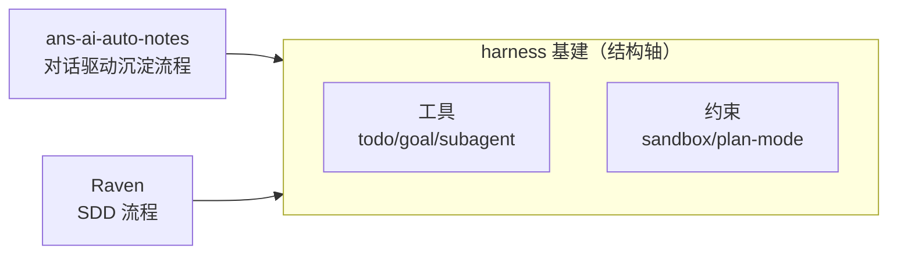
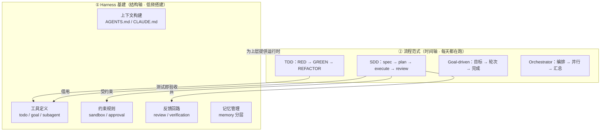

# Harness 与流程范式：SDD 落在哪一层

> 最后整理: 2026-08-20 | 来源: 对话讨论 + Raven DSH 源码（plan-mode / goal）+ ravenspec sdd schema

## 1. 一句话结论

**Harness 是「工厂 + 机器」（基建），SDD / TDD / Goal-driven 是「生产线的 SOP」（流程）；SOP 是通过把机器的按钮（工具）、安全锁（约束）、质检点（反馈）编排起来实现的。**

搞混它们，是因为两者根本不在一个维度上：

- **Harness Engineering 按「结构轴」切**：系统有哪些零件。
- **SDD 这类流程范式按「时间轴」切**：活儿按什么顺序干。

所以「harness 下有没有类似 SDD 的流程范式」这个问法本身就错位了——**SDD 不是 harness 的子集，而是 harness 这个「运行时」之上跑的众多流程之一**。

## 2. 两个概念的切分轴不同

| 维度 | Harness Engineering | SDD / 开发流程范式 |
|---|---|---|
| 切分轴 | 结构（零件的物理位置） | 时间（阶段的先后顺序） |
| 回答的问题 | 「系统由哪些零件组成」 | 「活儿按什么顺序干」 |
| 核心公式 | `Agent = Model + Harness` | `spec → plan → execute → review` |
| 例子 | 上下文构建 / 工具定义 / 约束规则 / 反馈回路 / 记忆管理 / 安全护栏 | PRD(WHY) → specs(WHAT) → design(HOW) → task(TODO) → apply(DO) |
| 性质 | 一次性搭建的「运营系统」 | 每天都在跑的「工作流程」 |

这正好对应一个常被忽略的直觉：**搭建 harness（架构性、低频） vs 日常开发（持续性、高频）确实是两个东西**——一个是把工厂建起来，一个是每天在流水线上按 SOP 干活。

## 3. 同一套 harness 基建，能跑多种流程范式

这是解开困惑的关键一环：**harness（基建）和流程（SOP）不是一对一，而是一对多。**

| 项目 | 跑的流程范式 | harness 基建（约束层） |
|---|---|---|
| `ans-ai-auto-notes` | 对话驱动知识沉淀（自动提取 → 聚合 → 沉淀 → 审计） | CLAUDE.md + hooks（preflight / exit-check / arch-lint）+ skills + subagents + memory |
| Raven（ravenspec `sdd`） | 规范驱动开发（PRD → specs → design → task → apply） | plan mode + `exit_plan_mode` + todo/goal + sandbox/approval + AGENTS.md |

本知识库项目本身**没有一个「SDD 式」的时间轴流程**，它有的是 harness 的三层约束体系（约束 > 文档 > 对话）；而 **Raven 同时具备「harness 基建」（plan mode / goal / skill / subagent 这些运行时机制）和「SDD 流程」（ravenspec `sdd` schema 定义的阶段链）**。

这就是「我理解了 harness 架构，也理解了 SDD 流程，但感觉它们是两个东西」的根源——它们确实是两层，只是会**同时现身**在 Raven 里，让人误以为是同一层的两个变体。



## 4. 流程范式具体落在 harness 的哪个零件上？

流程范式的「流程」是被编码成「工具 + 约束 + 反馈」之后，才成为 harness 的一部分。对照 Raven/DSH 的实际实现：

| Harness 零件 | 承载流程范式的机制 | 对应 SDD 环节 |
|---|---|---|
| 工具定义 | `exit_plan_mode`、`todo_write`、`update_goal`、`create_goal`、`workflow`、`subagent` | 阶段推进、任务拆解、审批门 |
| 约束规则 | plan mode 的 `plan:policy` section、`AGENTS.md`/`CLAUDE.md` 指令链、sandbox/approval policy | 「先规划后动手」的硬约束 |
| 反馈回路 | plan 的 review 审批（`Approve` → `approved: true`）、goal round 循环、verification | 每个阶段的 review checkpoint |

**核心洞察**：`exit_plan_mode` 这个工具本身不规定「你要按 PRD → specs → design → task 走」。是 ravenspec `schemas/sdd/schema.yaml` 里的 `requires` 链才规定了顺序：

```yaml
prd    # 无依赖，起点（WHY）
specs  # requires: prd          （WHAT）
design # requires: prd          （HOW）
task   # requires: specs, design（TODO）
apply  # requires: task         （DO 并 track TASK.md）
```

**「流程范式」(SDD 文档) 借用「harness 工具」(plan mode / todo / goal) 来强制执行自己。** 一句话：SOP 写在 SDD schema 里，执行 SOP 靠的是 harness 的按钮和锁。

## 5. harness 框架下「流程范式」是一个家族，SDD 只是其一

| 范式 | 时间轴阶段 | 本仓库 / ravenspec 里的对应物 |
|---|---|---|
| SDD / Spec-Driven | spec → plan → execute → review | ravenspec `sdd`（PRD/specs/design/task/apply） |
| TDD | RED → GREEN → REFACTOR | `kb-tdd-discipline` skill、Superpowers TDD |
| Goal-driven | 目标 → 轮次推进 → 完成/阻塞 | Raven `dsh-goal` + `dsh-goal-round-driver` |
| Orchestrator-Worker | 编排 → 并行派发 → 汇总 | `subagent` / `subagent_fork` / `workflow` |
| Skill（渐进式披露） | 触发 → 加载 → 按 skill 执行 | Skill 体系（`.claude/skills/`） |

它们之间不是「谁替代谁」，而是**可叠加**。一个完整开发通常是：

> SDD（出 spec/plan）→ TDD（实现每个任务）→ Orchestrator（并行派发子任务）→ Goal（长任务的目标轮次）→ Skill（按需加载领域规范），全部跑在 harness 约束层之上。

## 6. 端到端：把「基建」和「流程」叠起来看



**读图**：下层（harness 基建）是「运行时」，上层（流程范式）是「跑在运行时上的 SOP」。SDD 这条 SOP 之所以能「自动」推进，是因为它每一步都调用下层的工具（`todo_write`）、被下层的约束（plan mode）管住、被下层的反馈（review 审批）验证。

## 7. 结论：harness 架构下到底有没有类似 SDD 的流程范式？

**有，而且是一个家族**，SDD 只是你最近在 Raven 里接触到的那个成员。完整答案分三层：

1. **流程范式不是 harness 的子集，而是 harness 上层的一类东西**。两者是「框架 vs 跑在框架上的流程」的关系，切分轴不同（结构 vs 时间）。
2. **同一套 harness 基建能跑多种流程范式**。本知识库跑的是「对话驱动沉淀」，Raven 跑的是「SDD」，两边共享同一套 harness 思想（约束 > 文档 > 对话）。
3. **业界主流的 AI 开发流程范式家族**：SDD、TDD、Goal-driven、Orchestrator-Worker、Skill 渐进式披露——可叠加使用，且都通过「工具 + 约束 + 反馈」三类 harness 零件落地。

一句话收束：**学 harness 是在「造机器」，学 SDD 是在「学开机后的操作流程」；而 Raven 是把「机器说明书（SDD schema）」和「机器本身（plan mode / goal / skill）」一起给了你，所以会感觉它俩「混在一起」。**

## 8. 关键术语对照

| 术语 | 切分轴 | 一句话 |
|---|---|---|
| Prompt Engineering | 单次对话 | 写好一句话让 LLM 答好 |
| Context Engineering | 每次输入 | 把正确的信息喂给 LLM |
| Harness Engineering | 系统结构 | 设计整个 Agent 系统让它在边界内可靠工作 |
| SDD / 流程范式 | 时间阶段 | 定义活儿按什么顺序干、每步怎么验收 |

> 关联: [Harness Engineering](<../Claude-Code/Harness Engineering：AI Agent 时代的工程范式.md>) — 六项核心能力、四阶段成长路径，本笔记的「结构轴」那一半
> 关联: [Claude Code 进阶工作流](<../Claude-Code/Claude Code 进阶工作流：从能用到高效.md>) — 个人级 Harness 实践：约束>文档>对话 三层模型、hooks/memory/plan/manifest
> 关联: [Skills 渐进式披露架构](<../Claude-Code/Skills 渐进式披露架构.md>) — 流程范式家族里的「Skill」成员的完整机制
