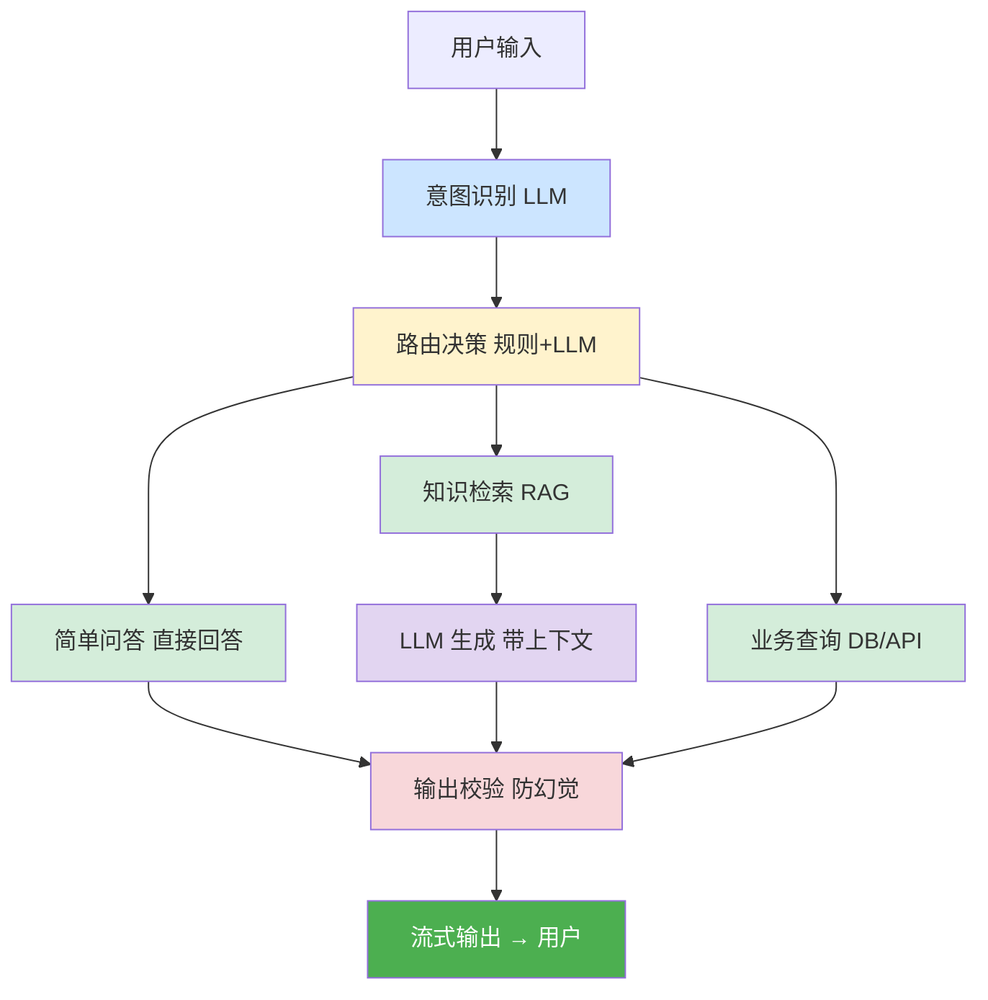
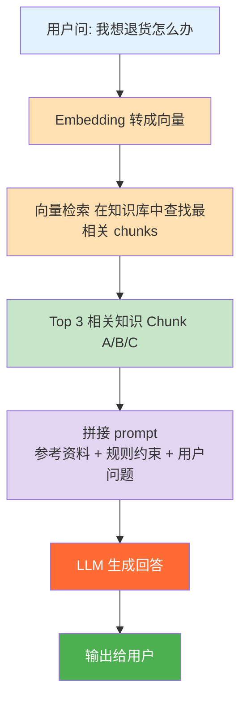
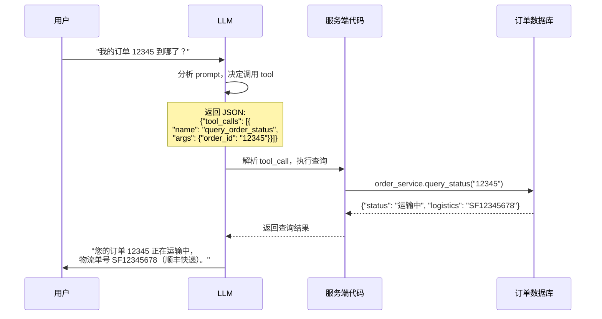
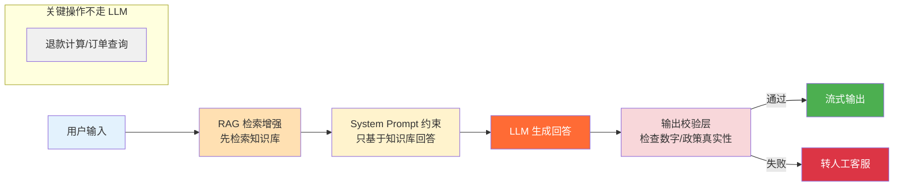
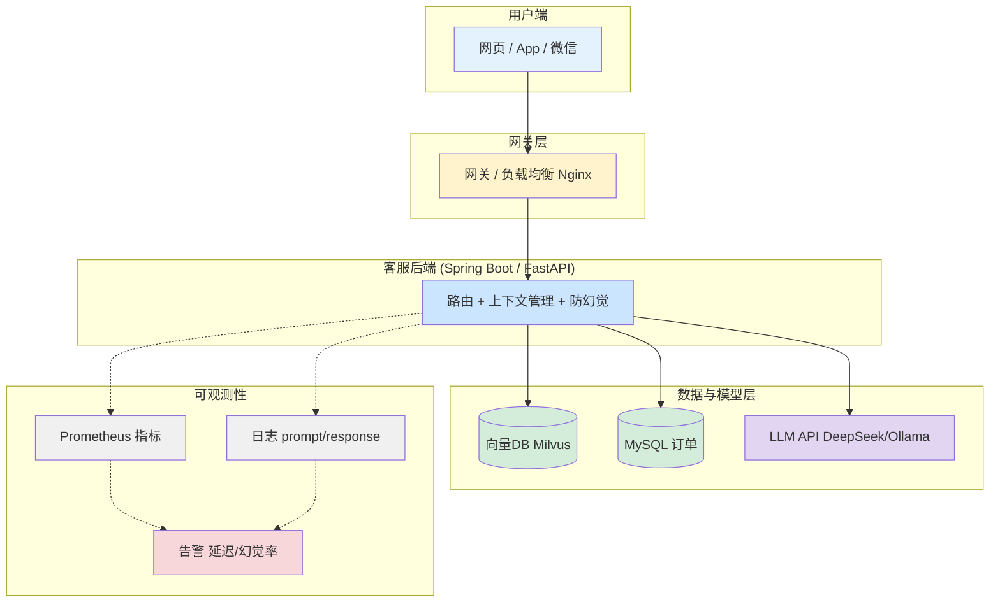

# 基于 LLM 的智能客服系统搭建实战

> 最后整理: 2026-05-07 | 来源: 对话

## 一句话定位

搭建智能客服系统最费时的不是技术搭建，而是知识整理——把散落在各处的政策、FAQ、话术变成结构化的知识块。技术本身约 2-3 周可出 MVP。

---

## 0. 架构全景



底座: 可观测性 + 权限控制 + 日志记录

---

## Step 1: 准备知识数据（最难但也最关键）

LLM 不是万能的——你需要先把公司的业务知识喂给它。

### 1.1 收集原始材料

```
客服知识来源通常散落在:
  ├── 产品文档（Word/PDF/Confluence）
  ├── FAQ 列表（Excel/数据库）
  ├── 退换货政策（网页/内部文档）
  ├── 常见问题话术（客服团队的经验）
  ├── 系统 API 文档（供 Agent 调用参考）
  └── 历史客服对话记录（用于分析高频问题）
```

### 1.2 清洗和结构化

```
原始文档:
  "退换货政策.docx" → 乱七八糟的排版、表格、图片

清洗后:
  {
    "title": "退换货政策",
    "category": "售后",
    "content": "支持7天无理由退货，条件：商品未使用、包装完整...",
    "last_updated": "2026-05-01"
  }
```

这一步没有捷径，需要人工或半自动地把非结构化文档转成干净的结构化数据。

### 1.3 分块（Chunking）

RAG 的核心概念：不能把一整本手册塞给 LLM，要切成小块。

```
太长（不行）:
  [整本 50 页的用户手册] → 超过 LLM 上下文窗口

分块后:
  Chunk 1: "如何注册账号？..."
  Chunk 2: "如何修改密码？..."
  Chunk 3: "忘记密码怎么办？..."
  ...
```

| 策略 | 适用场景 | chunk 大小 |
|------|----------|-----------|
| 按段落分 | FAQ、政策文档 | 每段 200-500 字 |
| 按标题分 | 手册、长文档 | 每个 H2 标题下所有内容 |
| 按语义分 | 对话记录 | 用算法切，保证语义完整 |

### 1.4 向量化 + 存储

```
Chunk 文本 → Embedding 模型 → 向量（一串数字，如 768 维）

"支持7天无理由退货" → [0.12, -0.34, 0.56, ..., 0.08]  (768 个数字)
```

| 方案 | 特点 | 适用 |
|------|------|------|
| **Milvus** | 专用向量数据库，支持十亿级 | 大规模生产 |
| **Chroma** | 轻量，Python 一行代码 | 小项目/原型 |
| **Qdrant** | Rust 实现，速度快 | 中等规模 |
| **pgvector** | PostgreSQL 插件 | 已有 PG 的团队 |
| **ES 8.x** | ElasticSearch 原生支持向量 | 已有 ES 的团队 |

```python
# Chroma 示例（最简单）
import chromadb

client = chromadb.Client()
collection = client.create_collection("customer_service")

# 存入
collection.add(
    documents=["支持7天无理由退货", "退款3个工作日内到账"],
    ids=["policy_return", "policy_refund"]
)

# 检索
results = collection.query(
    query_texts=["我想退货怎么办"],
    n_results=3  # 返回最相关的 3 条
)
# 返回: ["支持7天无理由退货", ...]
```

> 关联: [llm-prompt-rag](../大模型/Prompt 与 RAG.md) — RAG 原理详解
> 关联: [local-llm-deployment](../大模型/本地部署 LLM.md) — Embedding 模型本地部署

---

## Step 2: 搭建 RAG 检索管线

RAG = Retrieval-Augmented Generation（检索增强生成）。



### Prompt 模板

```
"请根据以下参考资料回答用户关于'退货'的问题:

参考资料:
---
{Chunk A 内容}
---
{Chunk B 内容}
---
{Chunk C 内容}

规则:
1. 只基于以上参考资料回答
2. 如果资料不足，说'这个问题我需要转接人工客服'
3. 不要编造任何政策或数字

用户问题: {user_question}"
```

### 进阶：混合检索

光靠向量检索不够——有些精确匹配向量检索找不到。

```
用户问: "订单号 12345678 的状态"

纯向量检索: 找不到（因为这不是语义问题，是精确查询）

混合检索:
  ES 关键词匹配  → 找到 "订单状态查询" 相关 chunk
  +
  向量语义检索    → 找到 "如何查看订单" 相关 chunk
  =
  合并结果给 LLM
```

---

## Step 3: 接入 LLM

### 3.1 选模型

| 选择 | 特点 | 适合 |
|------|------|------|
| **云端 API**（DeepSeek/GPT/Claude） | 智能高，按 token 收费 | 生产环境 |
| **本地 Ollama** | 免费，隐私好，但智能有限 | 开发测试/内部系统 |
| **混合** | 简单问题本地，复杂问题云端 | 成本最优 |

### 3.2 调用方式

```python
from openai import OpenAI

# 用云端 API
client = OpenAI(
    base_url="https://api.deepseek.com/v1",
    api_key="sk-xxx"
)

# 或用本地 Ollama（同一个 SDK，兼容 OpenAI 格式）
# client = OpenAI(base_url="http://localhost:11434/v1", api_key="ollama")

response = client.chat.completions.create(
    model="deepseek-chat",
    messages=[{"role": "user", "content": prompt}],
    temperature=0.2,       # 低随机性，客服场景
    stream=True,           # 流式输出
    max_tokens=1024
)

for chunk in response:
    print(chunk.choices[0].delta.content, end="")  # 打字效果输出
```

---

## Step 4: Tool Calling（查数据库/API）

RAG 只能回答知识库里的东西。如果用户问"我的订单到哪了"，这不是知识问题，是业务数据查询。

### 4.1 完整调用流程



### 4.2 多工具组合

```
用户: "我要退货，然后退款"

LLM 连续调用:
  Step 1: create_return_request(order_id="12345", reason="不喜欢")
          ↓ 返回: {"return_id": "R001", "status": "已受理"}
  Step 2: create_refund_request(order_id="12345", reason="退货退款")
          ↓ 返回: {"refund_id": "RF001", "ETA": "3个工作日"}
  Step 3: 综合两个结果 → "您的退货申请 R001 已受理，退款 RF001 将在 3 个工作日内到账。"
```

> 关联: [llm-app-design](./LLM 应用设计.md) — Function Calling 完整 5 步流程

---

## Step 5: 上下文管理

```
第 1 轮: prompt = system + "你好"                          → 500 tokens
第 2 轮: prompt = system + 第1轮 + "我的订单呢？"           → 1000 tokens
第 N 轮: 越来越长... 费用递增，最终超窗口限制
```

### 管理策略

```python
class ConversationContext:
    def __init__(self, max_history=10):
        self.system_prompt = "你是智能客服..."
        self.messages = []
        self.user_profile = {}  # 关键信息常驻
        self.max_history = max_history

    def build_prompt(self, new_question):
        # 关键信息始终在 system prompt 里
        system = f"""{self.system_prompt}

用户信息:
- 用户ID: {self.user_profile.get('id', '未知')}
- 当前订单: {self.user_profile.get('current_order', '无')}
"""
        # 历史只保留最近 N 轮
        history = self.messages[-self.max_history * 2:]

        return [
            {"role": "system", "content": system},
            *history,
            {"role": "user", "content": new_question}
        ]
```

**推荐组合**：关键信息常驻（system prompt）+ 最近 N 轮保留 + 超过 N 轮的旧历史做摘要压缩。

---

## Step 6: 防幻觉

客服场景最怕幻觉——LLM 编造不存在的政策或金额。

```
幻觉例子:
  用户: "你们支持七天无理由退货吗？"
  幻觉: "当然支持！我们还提供 30 天超长退换期，并且免运费。"
                                        ↑ 根本没有这个政策
```

### 四层防线



### 校验层示例

```python
def validate_response(llm_response, retrieved_chunks):
    """输出校验层"""
    import re

    # 规则 1: 检查是否编造了数字
    numbers_in_response = re.findall(r'\d+\.?\d*', llm_response)
    numbers_in_chunks = re.findall(r'\d+\.?\d*', ' '.join(retrieved_chunks))

    for num in numbers_in_response:
        if num not in numbers_in_chunks:
            return False, f"可能编造了数字: {num}"

    # 规则 2: 检查是否引用了不存在的政策
    policies_mentioned = extract_policy_names(llm_response)
    known_policies = load_known_policies()
    for policy in policies_mentioned:
        if policy not in known_policies:
            return False, f"引用了不存在的政策: {policy}"

    return True, None
```

---

## Step 7: 部署架构



### 技术栈建议

| 层 | 推荐技术 | 原因 |
|----|---------|------|
| 网关 | Nginx / Spring Cloud Gateway | 团队已有的 |
| 后端 | Spring Boot（Java）或 FastAPI（Python） | 看团队技术栈 |
| 向量库 | Milvus（大）/ Chroma（小）/ pgvector（已有 PG） | 都行 |
| LLM | DeepSeek API（便宜）/ Ollama 本地（开发） | 混合用 |
| 缓存 | Redis | 高频问题缓存 |
| 日志 | ELK / 自建 | 每次 LLM 调用都要记 |

---

## Step 8: 上线后的运维

```
监控指标:
  ├── 平均响应时间（P99 < 5s）
  ├── LLM 调用费用（每天/每月 token 消耗）
  ├── 幻觉率（用户反馈"回答不对"的比例）
  ├── 转人工率（LLM 答不了转人工的比例）
  └── 用户满意度（好评/差评）

持续优化:
  ├── 每周分析 Top 10 失败 case → 补充知识库
  ├── 定期更新政策文档 → 向量库重新索引
  ├── 监控 prompt token 增长 → 优化上下文管理
  └── A/B 测试不同 prompt 模板 → 选效果最好的
```

---

## 工作量估算

| 阶段 | 工作内容 | 人天 |
|------|---------|------|
| 知识整理 | 收集、清洗、结构化文档 | 5-10 天（人工密集型） |
| RAG 搭建 | Embedding + 向量库 + 检索 | 2-3 天 |
| LLM 接入 | Prompt 工程 + Tool Calling | 2-3 天 |
| 后端开发 | 接口 + 上下文管理 + 防幻觉 | 5-7 天 |
| 前端集成 | 聊天 UI + 流式输出 | 2-3 天 |
| 测试调优 | 覆盖高频场景 + 优化 prompt | 3-5 天 |
| 上线运维 | 部署 + 监控 + 告警 | 2-3 天 |

**总计: 约 20-35 人天**（一个全栈开发 + 一个 AI 开发，2-3 周可出 MVP）。

最费时的不是技术搭建，而是**知识整理**——把散落在各处的政策、FAQ、话术变成结构化的知识块。这一步没有捷径。

---

> 关联: [llm-app-design](./LLM 应用设计.md) — LLM 应用设计 9 大维度
> 关联: [llm-prompt-rag](../大模型/Prompt 与 RAG.md) — RAG 原理详解
> 关联: [local-llm-deployment](../大模型/本地部署 LLM.md) — Ollama 本地部署
