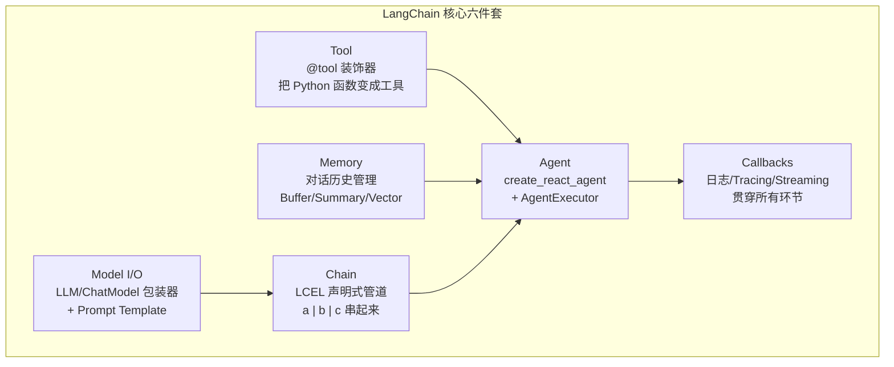

# LangChain Agent 开发指南

> 最后整理: 2026-05-26 | 来源: 对话讨论

> 关联: [agent-development-practice](<./Agent 开发实战：选型、框架与思维转换.md>) — Spring AI Agent 开发（Java 路线）
> 关联: [agent-patterns](<./Agent 四大设计范式（深度展开）.md>) — Agent 四大范式深度展开
> 关联: [openai-agents-sdk](<./OpenAI Agents SDK 与多角色协作.md>) — Multi-Agent 协作与 Handoff 机制

---

## 1. 一句话定位

```
Spring AI:  "我帮你把 Agent 循环跑起来，你只写工具方法"
LangChain:  "我给你标准化的零件（Chain/Tool/Memory/Prompt），
            你自己决定怎么组装，我帮你管流水线"
```

Spring AI 的 [Demo A](<./Agent 开发实战：选型、框架与思维转换.md>) 只需要 1 行代码跑 ReAct 循环。LangChain 做同样的事需要 ~30 行——但每一行你都看得到在干什么，每一环都可以替换。

---

## 2. 核心抽象（乐高积木零件清单）



### Model I/O

对各家 LLM API 的统一包装。和 Spring AI 的 `ChatModel` 接口一样的目的，但支持 50+ 供应商：

```python
from langchain_openai import ChatOpenAI

llm = ChatOpenAI(model="gpt-4o", temperature=0)
# 换 DeepSeek 只改 base_url，代码不动
llm = ChatOpenAI(
    model="deepseek-chat",
    base_url="https://api.deepseek.com/v1",
    api_key="sk-xxx"
)
```

### Prompt Template

把 prompt 结构化和参数化，而非字符串拼接：

```python
from langchain_core.prompts import ChatPromptTemplate

prompt = ChatPromptTemplate.from_messages([
    ("system", "你是{role}，用{language}回复"),
    ("user", "{input}")
])
# 调用时填充: prompt.invoke({"role": "客服", "language": "中文", "input": "..."})
```

### Tool

把 Python 函数变成 LLM 可调用的工具——和 Spring AI 的 `FunctionCallback` / `@Tool` 等价：

```python
from langchain_core.tools import tool

@tool
def query_order(order_id: str) -> str:
    """查询订单详情，包括状态、金额、物流信息"""
    return f"订单 {order_id}: 已发货，¥299"

@tool
def refund_order(order_id: str, reason: str) -> str:
    """发起退款申请，需要订单号和退款原因"""
    return f"退款已提交: {order_id}"
```

### Chain — 最核心的概念

用 `|` 管道符把多个步骤串成一个流水线（LCEL: LangChain Expression Language）：

```python
chain = prompt | llm | output_parser
# 读法: prompt 的输出 → 喂给 llm → llm 的输出 → 喂给 output_parser
result = chain.invoke({"input": "你好"})
```

**Chain 是固定流程**（先 A 再 B 再 C），**Agent 是动态流程**（LLM 自己决定先调哪个工具、调几次）。

### Memory

对话历史管理，LangChain 提供多种策略：

| 策略 | 做法 | 适用场景 |
|------|------|---------|
| `ConversationBufferMemory` | 全量保留 | 短对话，简单直接 |
| `ConversationSummaryMemory` | LLM 做摘要压缩 | 长对话，省 token |
| `ConversationBufferWindowMemory` | 滑动窗口，保留最近 K 轮 | 平衡成本与上下文 |

---

## 3. LangChain 做 Agent 的完整代码

对应 Spring AI Demo A（80 行、1 行 ReAct）的 LangChain 版本：

```python
from langchain_openai import ChatOpenAI
from langchain_core.tools import tool
from langchain.agents import create_react_agent, AgentExecutor
from langchain_core.prompts import ChatPromptTemplate

# ===== 第 1 步: 定义工具 =====
@tool
def query_orders(user_id: str) -> str:
    """根据 userId 查询订单列表，返回订单号、金额、状态"""
    db = {
        "123": [{"orderId": "8842", "amount": "¥299", "status": "已发货"},
                {"orderId": "8843", "amount": "¥158", "status": "待付款"}]
    }
    orders = db.get(user_id, [])
    return str(orders) if orders else f"用户 {user_id} 暂无订单"

@tool
def refund_order(order_id: str, amount: float) -> str:
    """根据 orderId 发起退款，参数包含退款金额"""
    return f"退款成功！订单 {order_id} 已退款 ¥{amount}"

# ===== 第 2 步: 创建 LLM =====
llm = ChatOpenAI(
    model="deepseek-chat",
    base_url="https://api.deepseek.com/v1",
    api_key="sk-xxx",
    temperature=0
)

# ===== 第 3 步: 定义 ReAct Prompt 模板 =====
prompt = ChatPromptTemplate.from_messages([
    ("system", """你是电商客服助手。
    
    可用工具:
    {tools}
    
    工具名称: {tool_names}
    
    请按以下格式回答:
    Thought: 分析当前状况，决定下一步
    Action: 工具名称
    Action Input: 工具参数(JSON)
    Observation: 工具返回结果(系统填入)
    ... (可以多轮)
    Final Answer: 最终回复
    """),
    ("placeholder", "{chat_history}"),
    ("human", "{input}"),
    ("placeholder", "{agent_scratchpad}")  # ← ReAct 中间步骤暂存区
])

# ===== 第 4 步: 创建 Agent + Executor =====
tools = [query_orders, refund_order]

agent = create_react_agent(llm, tools, prompt)

executor = AgentExecutor(
    agent=agent,
    tools=tools,
    max_iterations=10,           # ← 最大工具调用轮数（防死循环）
    verbose=True,                # ← 打印每轮 Thought/Action/Observation
    handle_parsing_errors=True   # ← LLM 输出格式错误时自动重试
)

# ===== 第 5 步: 调用 =====
result = executor.invoke({
    "input": "帮我查用户123的订单，然后把所有已发货的退款"
})

print(result["output"])
```

**运行时 verbose=True 的输出**：

```
> Entering new AgentExecutor chain...
Thought: 用户要查订单并退款。先查用户123的订单。
Action: query_orders
Action Input: {"user_id": "123"}
Observation: [{"orderId":"8842","amount":"¥299","status":"已发货"},
              {"orderId":"8843","amount":"¥158","status":"待付款"}]

Thought: 8842 已发货可以退款，8843 待付款不能退。先退 8842。
Action: refund_order
Action Input: {"order_id":"8842","amount":299}
Observation: 退款成功！订单 8842 已退款 ¥299

Thought: 任务完成。总结结果。
Final Answer: 用户123共有2个订单：
1. 订单8842（¥299，已发货）→ 已退款
2. 订单8843（¥158，待付款）→ 未签收不可退款
```

---

## 4. LangChain vs Spring AI 的架构对比

```
同一个 ReAct Agent，两个框架怎么做:

Spring AI（黑盒模式）:
  ┌─────────────────────────────────┐
  │  chatClient.prompt()            │
  │    .user("查订单123")           │
  │    .tools(tools)                │
  │    .call()                      │  ← 一行，Spring AI 内部完成:
  │    .content()                   │     拼 JSON Schema → HTTP 请求
  │                                 │     → 解析 tool_call → 执行
  │   你只看到这一行                │     → 喂回结果 → 循环
  └─────────────────────────────────┘     → 返回最终文本

LangChain（白盒模式）:
  ┌─────────────────────────────────┐
  │  prompt = ChatPromptTemplate()  │  ← 你定义 Prompt 模板
  │  llm = ChatOpenAI(...)          │  ← 你创建 LLM 实例
  │  agent = create_react_agent()   │  ← 你组装 Agent
  │  executor = AgentExecutor()     │  ← 你配置执行器
  │  executor.invoke({"input":".."})│  ← 你触发执行
  │                                 │
  │  每一步都看得见，每一环都能换    │
  └─────────────────────────────────┘
```

| 维度 | Spring AI | LangChain |
|------|-----------|-----------|
| **设计哲学** | 约定优于配置，帮你做决策 | 零件标准化，你自己组装 |
| **Agent 循环** | 内置 ReAct，一行 `.call()` | `create_react_agent` + `AgentExecutor`，~20 行 |
| **工具定义** | `FunctionCallback.builder()` 或 `@Tool` 注解 | `@tool` 装饰器 |
| **灵活性** | 低——改 ReAct 策略要动框架代码 | 高——换一个 Agent 类型就是改一行 |
| **可观测性** | 依托 Spring Boot Actuator + 自建 | 内置 Callbacks + LangSmith/Langfuse 集成 |
| **语言** | **Java** | Python / TypeScript（**没有 Java SDK**） |
| **学习曲线** | 低（Spring 生态无缝） | 中（需理解 Chain/Memory/Agent 多种抽象） |
| **适合场景** | Java 团队快速接入 LLM | 需高度定制 Agent 行为的项目 |

---

## 5. LangGraph —— LangChain 的进化版

LangChain 的 Agent 本质是一个**线性循环**（Thought → Action → Observation → Thought → ...）。LangGraph 把 Agent 流程建模为**显式有向图（StateGraph）**。

```
LangChain Agent:         LangGraph:
  线性循环                  显式状态机

  Thought → Action          ┌─────┐     ┌──────────┐
      ↑        ↓            │query│ ←── │  decide  │
      └──Observation        └──┬──┘     └────┬─────┘
                               │             │
  无法自定义中间路径         ┌──▼──┐     ┌───▼────┐
                            │refund│ ←── │summarize│
                            └─────┘     └────────┘

                            每个节点是纯函数
                            边是条件跳转
                            图结构可以任意复杂
```

### LangGraph 三个核心创新

1. **显式状态**：Agent 的所有状态（消息历史、中间结果、执行位置）存在一个 `State` 对象里，每个节点读 State → 计算 → 写回 State
2. **条件路由**：边的跳转可以是 LLM 决定的（"下一步该调哪个工具？"），也可以是确定性规则（"如果退款金额 > 1000，走人工审批节点"）
3. **Checkpoint 持久化**：每一步执行后自动保存 State，可以随时中断、恢复、回放——对长任务和人工审批场景至关重要

### LangGraph 代码示例

```python
from langgraph.graph import StateGraph, END
from typing import TypedDict

class AgentState(TypedDict):
    messages: list
    next_step: str

# 每个节点是一个函数: State → State
def router(state: AgentState) -> AgentState:
    """LLM 决定下一步做什么"""
    response = llm.invoke(state["messages"])
    if "FINAL" in response:
        state["next_step"] = "end"
    else:
        state["next_step"] = "tool_executor"
    return state

def tool_executor(state: AgentState) -> AgentState:
    """执行工具调用"""
    # ... 执行工具，结果追加到 messages
    return state

# 建图
graph = StateGraph(AgentState)
graph.add_node("router", router)
graph.add_node("tool_executor", tool_executor)

# 条件边: router → tool_executor 或 END
graph.add_conditional_edges(
    "router",
    lambda s: s["next_step"],
    {"tool_executor": "tool_executor", "end": END}
)
graph.add_edge("tool_executor", "router")  # 执行完回到 router 再判断
graph.set_entry_point("router")

app = graph.compile()
result = app.invoke({"messages": [HumanMessage("帮我退款")]})
```

---

## 6. 对 Java 开发者的实用建议

```
你的情况: Java 后端，Spring 生态

方案 A: 纯 Java 路线（推荐起步）
  Spring AI → ChatClient + FunctionCallback
  优势: 零语言切换、Spring Boot 原生集成、运维体系一致
  局限: 生态不如 Python，复杂 Agent 编排能力弱

方案 B: Java + Python 混合
  Java 负责: 业务逻辑、工具实现、API 网关
  Python 负责: Agent 编排（LangChain/LangGraph）
  通信: HTTP/gRPC
  典型架构: Spring Boot 应用 → 内嵌 Python Agent Engine → 调 LLM API

方案 C: 全 Python（从零开始且以 Agent 为核心）
  Python FastAPI + LangGraph + Langfuse
```

**现阶段最值得花时间的**：先用 Spring AI 把 Agent 跑起来，然后看 **LangGraph 的 StateGraph 设计思想**——即使不写 Python，Graph 建模 Agent 流程的思维能直接迁移到任何 Agent 架构设计里。

---

## 7. LangChain → LangGraph 学习路径

### 推荐路线（总计约 2 周）

```
第 1 天: 跑通最小 LangChain
  └→ pip install langchain langchain-openai
  └→ 写一个 Chain: prompt | llm | output_parser
  └→ 目标: 理解 LCEL (| 管道符) 的"声明式流水线"思维
  └→ 产出: 一个能调 LLM 并解析输出的 Python 脚本

第 2-3 天: 用 LangChain 写一个 ReAct Agent
  └→ 定义 2-3 个 @tool
  └→ create_react_agent + AgentExecutor
  └→ verbose=True 观察每一步 Thought/Action/Observation
  └→ 目标: 理解 Agent 循环的每一步在代码里对应什么
  └→ 产出: 一个能多步推理的 Agent（比如查天气+发邮件）

第 4-5 天: 深入 Agent 的可观测性
  └→ 加 Callbacks，记录每次 LLM 调用和工具调用
  └→ 集成 Langfuse（免费 tier），看 tracing 面板
  └→ 目标: 理解"Agent 的每一步都可以追溯"
  └→ 产出: Agent 的完整执行轨迹可视化

第 6-8 天: 进入 LangGraph
  └→ 核心概念: StateGraph, Node, Edge, Conditional Edge
  └→ 把第 3 天的 ReAct Agent 用 LangGraph 重写
  └→ 目标: 理解"Agent 流程不是线性循环，而是有向图"
  └→ 产出: 一个带条件路由的 StateGraph Agent

第 9-10 天: LangGraph 进阶
  └→ Checkpoint 持久化（中断恢复）
  └→ Human-in-the-loop（审批节点）
  └→ 并行节点执行
  └→ 目标: 理解生产级 Agent 的可靠性机制
  └→ 产出: 一个带人工审批节点的 Agent
```

### 学习资源

| 阶段 | 资源 | 时间 |
|------|------|------|
| **入门** | [LangChain 官方 Quickstart](https://python.langchain.com/docs/tutorials/) — 跟着敲一遍 | 2-3h |
| **Agent** | [Build an Agent](https://python.langchain.com/docs/tutorials/agents/) — 官方 Agent 教程 | 2-3h |
| **LangGraph** | [LangGraph Quick Start](https://langchain-ai.github.io/langgraph/tutorials/introduction/) — 图建模入门 | 3-4h |
| **进阶** | [LangGraph Agent 示例库](https://github.com/langchain-ai/langgraph/tree/main/examples) | 持续 |

### 动手第一步

**不要从读文档开始。从跑代码开始。**

```bash
# 1. 创建虚拟环境
python -m venv langchain-env && source langchain-env/bin/activate

# 2. 安装
pip install langchain langchain-openai langgraph

# 3. 设置 API Key
export DEEPSEEK_API_KEY="sk-xxx"

# 4. 跑第一个 Chain（10 行代码）
python -c "
from langchain_openai import ChatOpenAI
from langchain_core.prompts import ChatPromptTemplate

llm = ChatOpenAI(model='deepseek-chat', base_url='https://api.deepseek.com/v1')
prompt = ChatPromptTemplate.from_template('用一句话解释: {concept}')
chain = prompt | llm
print(chain.invoke({'concept': 'Java 的 GC'}).content)
"

# 如果这 10 行能跑通，你已经理解了 LangChain 最核心的抽象。
# 接下来就是把 Chain 升级成 Agent（加 tool + 加循环）。
```

### 对照学习法

用已有的 Spring AI 知识做锚点：

| Spring AI 概念 | LangChain 对应 | 区别 |
|---------------|---------------|------|
| `ChatModel` 接口 | `BaseChatModel` | 几乎一样 |
| `ChatClient` | `AgentExecutor` | LangChain 显式配置，Spring AI 自动 |
| `FunctionCallback` | `@tool` 装饰器 | 几乎一样 |
| `.call().content()` | `executor.invoke()` | LangChain 需显式组装 Agent |
| `ChatMemoryAdvisor` | `ConversationBufferMemory` | LangChain 多种策略可选 |
| Spring Boot AutoConfig | 无 | LangChain 全手动组装 |
| `@Tool` (MCP) | langchain-mcp-adapters | 都支持 MCP |

---

> 关联: [agent-development-practice](<./Agent 开发实战：选型、框架与思维转换.md>) — Spring AI 路线的 Agent 开发（Java 原生）
> 关联: [spring-ai-vs-langchain](<./Spring AI vs LangChain 深度对比：从 Java 后端视角彻底搞懂.md>) — Spring AI vs LangChain 深度对比
> 关联: [agent-patterns](<./Agent 四大设计范式（深度展开）.md>) — Agent 四大范式的架构展开
> 关联: [agent-tech-stacks](<./主流 Agent 产品技术栈解剖：自研循环 vs 框架之争.md>) — 主流 Agent 产品（Claude Code 等）技术栈解剖
> 关联: [agent-ops-and-resilience](<./Agent 应用运维与韧性：架构之外的生存指南.md>) — Agent 应用运维与韧性
