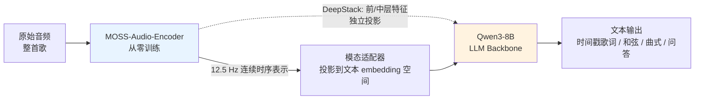
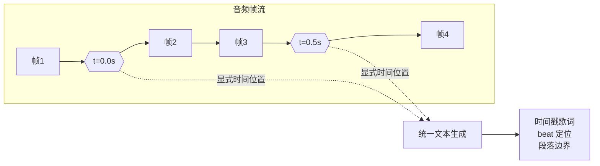
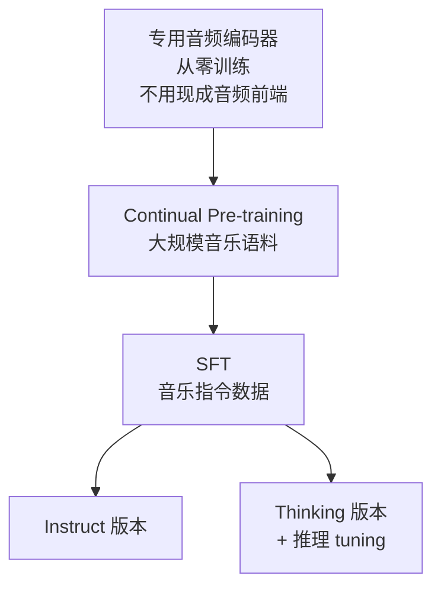

# MOSS-Music：开源音乐理解模型

> 最后整理: 2026-09-14 | 来源: 对话

## 一句话定位

MOSS-Music = **音频编码器 + 投影适配器 + Qwen3-8B** 的三段式架构，专门被「音乐」继续预训练过的开源模型；核心卖点是**让模型知道「第几秒发生了什么」**，所以能吐带时间戳的歌词、和弦进行和曲式段落。

> 关联: [多模态 LLM](<../大模型/多模态 LLM.md>) — 它是「音频模态 LLM」的一个具体实例，套的就是同一套「编码器 + 投影层 + LLM」范式
> 关联: [LLM（大语言模型）](../大模型/LLM（大语言模型）.md) — 底层大脑

---

## 2026-09-14 - 这是啥玩意儿？一句话先破除歧义

### 先破歧义：「MOSS」是一个家族，不是一件事

听到 MOSS 先问是哪一支，否则很容易对不上话：

| 名字 | 是谁 | 干什么的 | 记忆锚点 |
|------|------|---------|---------|
| **MOSS**（原型） | 复旦 NLP 组，2023 | 对话语言模型，复刻 ChatGPT 那一波 | 这波大模型浪潮的「国产早期代表」 |
| **MOSS-Audio / MOSS-TTSD** | OpenMOSS 团队 | 通用音频理解 / 语音对话 | 语音、环境声、音效 |
| **MOSS-Music** | OpenMOSS + MOSI.AI + 上海创智学院 | **音乐理解**（本文主角） | 8B、2026-05 开源 |

**一句话**：MOSS-Music 不是「一个能生成音乐的模型」，也**不是**网易云音乐的内部项目——它是 **MOSI.AI / OpenMOSS 团队 2026 年 5 月开源的音乐理解（music understanding）模型**，8B 参数，HuggingFace + ModelScope 都能下。

> 如果指的是内部某个同名服务，那跟下面这套东西是两码事——本地 kb / KnowVault 都没有相关记录，得另外给线索。

### 「音乐理解」到底要理解什么

音乐 ≠ 音频 + 歌词。要真听懂一首歌，得同时感知**和声结构、节奏、音色、配器、演唱细节、歌词文本**，还要在**时间轴上联合推理**。MOSS-Music 的目标就是把这些能力塞进一个模型里：

| 能力 | 具体输出 |
|------|---------|
| **歌词 ASR（带时间戳）** | 唱歌转文字，句级 + 词级时间戳，能扛住伴奏 |
| **音乐描述 / 打标（captioning / tagging）** | 自然语言描述情绪、流派、配器、制作风格、情绪走向 |
| **调式 / 速度 / 和弦推理** | 调号、beat、downbeat、和弦进行，支持**带时间戳的和弦转录** |
| **曲式结构分析** | 切出 intro / verse / chorus / bridge / outro，并解释重复与对比 |
| **乐器与人声识别** | 主奏乐器；独唱 / 合唱、性别、音区 |
| **音乐 QA 与长曲分析** | 基于整首歌的开放式问答；*Thinking* 版本带思维链推理 |

---

## 2026-09-14 - 架构：三段式，和视觉多模态 LLM 同构

```
原始音频 → [MOSS-Audio-Encoder] → 12.5 Hz 时序表示
         → [模态适配器 adapter] → 投影进 LLM 的 embedding 空间
         → [Qwen3-8B] → 自回归生成文本
```



**和「看图」的多模态 LLM 是同一套骨架**：ViT 换成音频编码器，patch 换成音频帧。第 3 步「投影对齐」完全一样——把非文本模态映射到文字 token 的同一个空间，后面 Transformer 不动。

| 维度 | MOSS-Music-8B-Instruct | MOSS-Music-8B-Thinking |
|------|----------------------|----------------------|
| 音频编码器 | MOSS-Audio-Encoder | MOSS-Audio-Encoder |
| LLM Backbone | Qwen3-8B | Qwen3-8B |
| 总参数 | ~9.1B | ~9.1B |
| 定位 | 直接指令跟随，要什么答什么 | 更强的**思维链推理**，适合音乐分析 |
| 下载 | [HF](https://huggingface.co/OpenMOSS-Team/MOSS-Music-8B-Instruct) / [ModelScope](https://modelscope.cn/models/openmoss/MOSS-Music-8B-Instruct) | [HF](https://huggingface.co/OpenMOSS-Team/MOSS-Music-8B-Thinking) |

> 官方说 4B 小版本「may follow」。

---

## 2026-09-14 - 两个真正有意思的技术点（值得抄思路）

整个模型最值得记的不是「8B」这个数字，而是下面两个设计。它们的动机都可以直接迁移到别的多模态/长时序任务上。

### 1. DeepStack 跨层特征注入：别只用编码器最后一层

**问题**：只用编码器顶层特征，会丢掉低层韵律、瞬态事件、局部时频结构。

**为什么音乐上特别致命**：和弦识别、结构分析、音色描述依赖的恰恰是**节奏、音色、瞬态、乐器质感**——这些信息在「已经很高级、很语义化」的顶层表示里基本被抹平了。

**做法**：在编码器和 LLM 之间加一个 DeepStack 式的跨层注入模块——除了最后一层，还挑前层/中层特征，**各自独立投影**，注入到 LLM 的**浅层**。这样低层声学细节到高层语义抽象的多粒度信息全都保住。

```
只用顶层（传统做法）：
  音频 → [enc 第 24 层] ──────────────→ LLM
                          ✗ 丢掉：瞬态、音色、局部时频结构

DeepStack 注入（MOSS-Music）：
  音频 → [enc 第 6 层]  ─proj─→ ┐
         [enc 第 12 层] ─proj─→ ├─→ LLM 浅层
         [enc 第 24 层] ──────→ ┘
                          ✓ 低层细节 + 高层语义 同时在场
```

> **可迁移的 idea**：任何「高层语义够用、但底层细节决定成败」的任务（音频、视频、代码结构分析）都可以考虑跨层注入，而不是死磕顶层表示。

### 2. 时间标记插入：让模型显式知道「第几秒」

**做法**：预训练时，**按固定时间间隔在音频帧表示之间插入显式的时间 token**，标注时间位置。

**为什么关键**：音乐理解里时间是核心维度。有了显式时间 token，模型能在**统一的文本生成框架**里学会「什么时候发生了什么」——于是下面这些能力自然长出来：

- 带时间戳的歌词 ASR（不靠后处理对齐）
- beat / downbeat 定位
- 段落边界检测
- 长曲回顾式 QA（「副歌第二次进来时配器变了什么？」）



> **可迁移的 idea**：与其让模型「自己猜时间」，不如把时间做成**输入的一部分**——这是一个注入归纳偏置（inductive bias）的经典手法。

---

## 2026-09-14 - 怎么训出来的 & 怎么跑起来

### 训练：三步走



1. **编码器从零训练**（而不是拿现成音频前端）——为了更鲁棒的声学表示、更紧的时间对齐、以及跨音乐风格/歌唱/非语音声学的可扩展性。
2. **Continual pre-training**：在数据管道产出的**大规模多样音乐语料**上继续预训练，重点压**歌唱、歌词、整曲覆盖**。
3. **SFT**：音乐指令数据，覆盖 captioning、歌词 ASR、和弦/调式/结构分析、长曲 QA。
4. **Thinking 版本再加 Reasoning tuning**。

### 配套数据管道：MOSS-Music-Data-Pipeline

模型能训出来，一半功劳在这条**从原始音频 → chat 格式训练样本**的端到端流水线（独立开源仓库）：时长检测 → MIR 特征抽取 → 歌曲结构分割 → 歌词 ASR → 元数据清洗 → 用 Qwen3-Omni / MusicFlamingo 等 audio-language model 做 caption / query 生成。

> **这才是真正值钱的部分**：模型权重能下载，但「怎么造出百万小时级别的音乐标注数据」才是壁垒。

### 本地跑起来

README 给的三条路：**SGLang Serving**（部署服务）、**Transformers 本地推理**（单机跑）、**Gradio App**（点开就用的 demo 界面）。环境构建 + 权重加载按 HF 上的 model card 走。

---

## 2026-09-14 - 效果如何：别只看 headline 分

### 音乐 QA / 理解（Accuracy↑，节选）

| 模型 | MMAU-music | MMAU-mini-music | MMAU-Pro-music | MuChoMusic | Music-AVQA | GTZAN | **Avg** |
|---|---:|---:|---:|---:|---:|---:|---:|
| **MOSS-Music-8B-Instruct** | **79.33** | **80.78** | 71.02 | **89.39** | **76.78** | **93.59** | **80.38** |
| Gemini-3.1-Pro | 71.69 | 77.18 | **73.06** | 79.53 | 61.51 | 86.39 | 75.17 |
| MusicFlamingo | 76.83 | 76.35 | 65.60 | 74.58 | 73.60 | 84.45 | 73.87 |
| Qwen3-Omni | 65.76 | 68.77 | 66.27 | 78.77 | 56.05 | 80.15 | 66.75 |
| Kimi-Audio-7B-Instruct | 47.95 | 52.25 | 59.10 | 70.18 | 68.90 | 39.54 | 56.90 |

（Avg 由 MMAU-music / MMAU-mini-music / MMAU-Pro-music / MMAR-music / MuChoMusic / Music-AVQA / GTZAN / Medley-Solos-DB 八个基准算出；NSynth 三个子任务因偏 note-level 细粒度识别，单列不计入主均分。）

### 音乐描述 captioning（GPT-5.4-as-a-Judge，1-5 分）

| 模型 | MusicCaps Avg | SDD Avg |
|---|---:|---:|
| **MOSS-Music-8B-Thinking** | **4.53** | 4.45 |
| **MOSS-Music-8B-Instruct** | 4.36 | **4.58** |
| Gemini-3.1-Pro | 4.42 | 4.48 |
| MusicFlamingo | 4.21 | 4.26 |
| Qwen3-Omni | 3.96 | 4.02 |

**怎么读这张表（官方自己给的解释，挺诚实的）**：

- **结构理解是明显优势项**：`Structure / Form / Progression` 维度 MOSS-Music 领先最多，SDD 上更明显——正好对应上面「时间标记 + 跨层注入」两个设计。
- **细粒度配器仍然别人更好**：`Instrumentation / Timbre` 维度 MusicFlamingo 与 Gemini-3.1-Pro 更能打；`Scene / Use Case` 维度 Gemini-3.1-Pro 最好。
- **歌词 ASR** 在 MUSDB18（带伴奏英文流行，WER↓）、MIR-1K（中文卡拉 OK，CER↓）等基准上评测。

> 数字别当定论：榜单是 2026-05 的，且 caption 评测用的是 GPT-5.4-as-a-Judge（评判模型本身也会漂）。

---

## 2026-09-14 - 什么场景下真的有用

| 场景 | 用法 |
|------|------|
| 音乐内容库自动打标 | 一次推理拿到情绪 / 流派 / 配器 / 曲式，替代人工标注 |
| 歌词时间轴生产 | 直接出句级/词级时间戳，省掉强制对齐（forced alignment）那套 |
| 翻唱 / 伴奏参考 | 带时间戳的和弦转录 → 和声分析、教学 |
| 音乐教学 | 「副歌第二次为什么更有张力」这类基于整曲的问答 |
| 长音频 QA 的架构参考 | 做播客 / 会议 / 长视频理解时，抄它的时间表征方案 |

**边界**：它是**理解**模型，不是生成模型——不能拿去写歌/编曲/续写旋律。要生成得看 Suno / MusicGen 那一类。

---

## 参考

- [OpenMOSS/MOSS-Music（GitHub）](https://github.com/OpenMOSS/MOSS-Music) — 主仓库，架构说明与评测表都在 README
- [MOSS-Music-8B-Instruct（HuggingFace）](https://huggingface.co/OpenMOSS-Team/MOSS-Music-8B-Instruct)
- [MOSS-Music-8B-Thinking（HuggingFace）](https://huggingface.co/OpenMOSS-Team/MOSS-Music-8B-Thinking)
- 数据管道：[MOSS-Music-Data-Pipeline](https://github.com/wx9songs/MOSS-Music-Data-Pipeline)
- 相关：[MOSS-Audio](https://github.com/OpenMOSS/MOSS-Audio) — 同一音频 backbone 的通用音频理解版本

> 关联: [多模态 LLM](<../大模型/多模态 LLM.md>) — 「编码器 + 投影 + LLM」范式的概念基础
