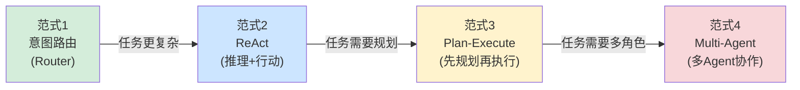
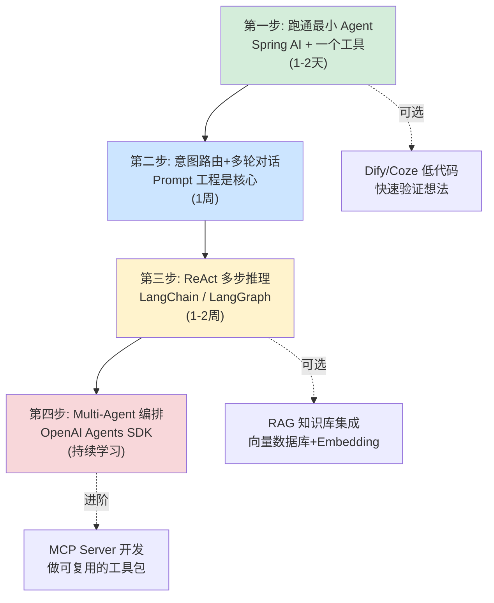
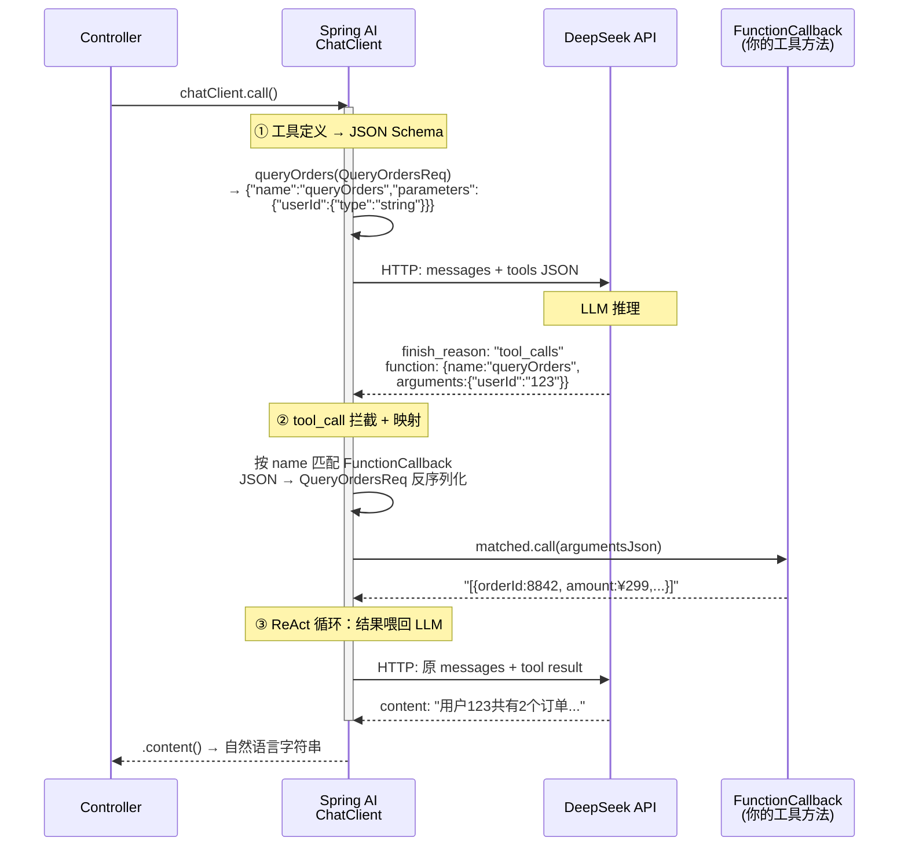

# Agent 开发实战：选型、框架与思维转换

> 最后整理: 2026-05-23 | 来源: 对话讨论（新增从零搭建 Agent + MCP Java 实战指南）

> 关联: [agent-patterns](./agent-patterns.md) — 四范式深度展开（架构图 / Prompt 模板 / 典型案例）

## Agent 开发的四大设计范式

开发一个 Agent 系统，不同的任务复杂度适合不同的架构范式。下面从简单到复杂排列：



| 范式 | 适合场景 | 典型产品 | 复杂度 |
|------|---------|---------|--------|
| **意图路由** | 客服答疑、FAQ 查询 | 各类客服 Bot | ★☆☆☆ |
| **ReAct** | 需要多步推理+工具调用 | Claude Code、ChatGPT Plugins | ★★☆☆ |
| **Plan-Execute** | 复杂任务需要先规划再执行 | Devin、AutoGPT | ★★★☆ |
| **Multi-Agent** | 多角色协作的大型任务 | OpenAI Agents SDK、CrewAI | ★★★★ |

---

> **四范式深度展开（架构图 / Prompt 模板 / 典型案例）请见 → [agent-patterns](./agent-patterns.md)**
>
> 本文聚焦"怎么选 + 用什么 + 怎么学 + 思维怎么转"，是 agent-patterns 的导览页。
> 下面的"四种范式怎么选 / 主流框架速查 / 学习路径 / vs Java 对比"是选型与落地的关键内容。

---

## 四种范式怎么选

| 你的任务 | 推荐范式 | 原因 |
|---------|---------|------|
| 客服答疑、FAQ 查询 | 意图路由 | 一问一答，不需要多步推理 |
| 信息搜索+汇总 | ReAct | 需要多步搜索、前后步骤有依赖 |
| 搭建一个完整项目 | Plan-Execute | 步骤多且可预见，需要全局规划 |
| 复杂的多角色协作 | Multi-Agent | 不同角色有不同专长和工具集 |
| 混合场景 | **组合使用** | 实际产品常常混用多种范式 |

最后一行很重要——**实际产品往往混用**。比如一个智能客服系统可能用意图路由做第一层分类，复杂问题走 ReAct 循环，后台运维任务走 Plan-Execute。

---

## 主流 Agent 开发框架速查

| 框架 | 语言 | 核心范式 | 适合场景 | 上手难度 |
|------|------|---------|---------|---------|
| **Spring AI** | Java | 意图路由 + FC | Java 后端快速接入 | ★☆☆ |
| **LangChain** | Python | ReAct + 工具链 | 通用 Agent 开发 | ★★☆ |
| **LangGraph** | Python | 有状态图 + 多步 | 复杂流程编排 | ★★★ |
| **OpenAI Agents SDK** | Python | Multi-Agent + Handoff | 多角色协作 | ★★☆ |
| **CrewAI** | Python | Multi-Agent + 角色 | 团队模拟协作 | ★★☆ |
| **Dify / Coze** | 低代码 | 可视化编排 | 快速验证想法 | ★☆☆ |

### Java 开发者快速上手示例（Spring AI）

```java
// 1. 用 @Tool 注解定义工具
@Component
public class OrderTools {
    @Tool(description = "查询订单详情，包括状态、金额、物流信息")
    public OrderInfo queryOrder(@Param("订单号") String orderId) {
        return orderService.getById(orderId);
    }
    
    @Tool(description = "发起退款申请")
    public RefundResult applyRefund(
        @Param("订单号") String orderId,
        @Param("退款原因") String reason) {
        return refundService.apply(orderId, reason);
    }
}

// 2. 配置 ChatClient
@Bean
public ChatClient chatClient(ChatModel model, OrderTools tools) {
    return ChatClient.builder(model)
        .defaultSystem(SYSTEM_PROMPT)
        .defaultTools(tools)
        .defaultAdvisors(new MessageChatMemoryAdvisor(memory))
        .build();
}

// 3. Controller
@PostMapping("/chat")
public Flux<String> chat(@RequestBody ChatRequest req) {
    return chatClient.prompt().user(req.getMessage())
        .stream().content();
}
```

---

## Agent 开发的学习路径



| 阶段 | 做什么 | 产出 |
|------|--------|------|
| **第一步** | 做一个"能查数据库的聊天机器人" | 最小可用 demo |
| **第二步** | 加意图路由 + 追问机制 | 客服答疑工具雏形 |
| **第三步** | 实现 ReAct 循环，接 RAG | 能多步推理+查文档回答 |
| **第四步** | 多 Agent 协作 | 复杂任务自动拆分+流转 |

---

## Agent 开发 vs 传统 Java 应用开发

Java 开发者第一次接触 Agent 开发时，容易不自觉地用传统思维套，踩很多坑。最根本的区别在于：

```
传统 Java 应用:
  controller.getOrder("12345") → 永远返回同一个订单数据
  100% 可预测、可复现

Agent 应用:
  用户: "帮我看看上次买的东西到哪了"  
  → 第一次: "您的订单正在配送中，预计今天送达"
  → 第二次: "包裹已到您附近的配送站，马上就到啦"
  → 意思一样，表述不同；甚至可能理解错"上次"指的是哪个订单
```

### 六个核心维度对比

| 维度 | 传统 Java 应用 | Agent 应用 |
|------|---------------|-----------|
| **核心逻辑** | 你写的 if-else / 业务规则 | LLM 推理 + 你写的工具 |
| **输入输出** | 结构化（JSON/表单） | 自然语言（任意表述） |
| **流程控制** | 你定义的流程图 | LLM 自主决策下一步 |
| **测试方法** | 断言精确结果 | 模糊匹配 + 人工评估 |
| **调试方式** | 看日志 + 断点 | 看 Prompt + LLM 输出链路 |
| **核心技能** | 写代码 | 写 Prompt + 设计工具 |

### 用"退款"场景看区别

**传统 Java——你控制整个流程：**

```java
@PostMapping("/refund")
public Result applyRefund(@RequestBody RefundRequest req) {
    if (req.getOrderId() == null) throw new BadRequest("缺少订单号");
    Order order = orderService.getById(req.getOrderId());
    if (order.getStatus() != DELIVERED) 
        throw new BizException("未签收不可退款");
    if (daysBetween(order.getDeliverTime(), now()) > 7)
        throw new BizException("超过7天退款期");
    refundService.apply(order, req.getReason());
    return Result.success("退款申请已提交");
}
```

**Agent——你只提供"能力"，LLM 决定调用顺序：**

```java
@Tool(description = "查询订单详情，返回状态、金额、签收时间")
public OrderInfo queryOrder(@Param("订单号") String orderId) {
    return orderService.getById(orderId);
}

@Tool(description = "发起退款，仅限已签收且在7天内的订单")
public RefundResult applyRefund(
    @Param("订单号") String orderId,
    @Param("退款原因") String reason) {
    // 业务校验仍然在工具内部！
    Order order = orderService.getById(orderId);
    if (order.getStatus() != DELIVERED) 
        return RefundResult.fail("该订单未签收，暂不支持退款");
    if (daysBetween(order.getDeliverTime(), now()) > 7)
        return RefundResult.fail("已超过7天退款期");
    refundService.apply(order, reason);
    return RefundResult.success("退款申请已提交");
}
// 先查订单还是直接退款？由 LLM 自己判断
```

### 六个设计要点

#### 1. 工具描述决定一切

LLM 通过工具的 description 决定什么时候调什么工具。description 写不好，LLM 就会选错工具或传错参数。

```java
// ❌ 差——LLM 不知道什么时候该用
@Tool(description = "查询数据")
public Object query(String param) { ... }

// ✅ 好——明确用途、参数格式、限制条件
@Tool(description = "查询订单详情，包括状态、金额、物流。" +
     "需要订单号（格式如 2026050100123）。" +
     "如果用户没提供订单号，请先询问。")
public OrderInfo queryOrder(@Param("订单号，纯数字") String orderId) { ... }
```

#### 2. 业务校验必须在工具内部

```java
// ❌ 危险：靠 Prompt 告诉 LLM "超过7天不能退"
//    LLM 可能忘记、可能算错天数、可能被 Prompt 注入绕过

// ✅ 安全：工具内部硬编码校验
@Tool(description = "发起退款申请")
public RefundResult applyRefund(String orderId, String reason) {
    Order order = orderService.getById(orderId);
    if (daysBetween(order.getDeliverTime(), now()) > 7) {
        return RefundResult.fail("已超过7天退款期");
    }
    // ...
}
```

**原则：LLM 负责理解意图和组织语言，业务规则和数据校验走传统代码路径。**

#### 3. 测试方式完全不同

```java
// 传统：精确断言
assertEquals("退款申请已提交", result.getMessage());

// Agent：模糊评估——LLM 每次措辞不同
assertTrue(response.contains("退款") || response.contains("退货"));
verify(refundService).apply(any(), any());  // 验证工具确实被调用了
```

**Agent 测试三层**：工具单测（和传统一样）→ 路由测试（LLM 是否选对工具）→ 端到端评估（人工或 eval 框架）

### 团队级质量保障：Pre-PR 与 AI 辅助测试

当团队 90% 代码由 AI 生成时，测试策略也需要升级。美团在 31 万行代码重构中沉淀了两套互补机制：

**Pre-PR（预审）机制**：

```
传统流程: 编码 → 提交 PR → Reviewer 从头看到尾
Pre-PR:   编码 → AI 自查多轮 → 修复AI能发现的问题 → AI生成PR文档 → 人工CR聚焦业务语义
```

人工 CR 的价值从"你写得对吗？"转变为"我们是否在正确的约束下解决正确的问题？"

**AI 辅助测试 SOP（Human-in-the-loop 模式）**：

团队尝试了两条路线：
- **路线 A（AI 全自动）**：AI 读 PRD + diff → 全自动生成用例 → 人最后把关 → **失败**：AI 缺乏全局业务认知，容易漏掉隐性高危场景，同时发散大量无价值边缘用例
- **路线 B（人主导 + AI 辅助）✅**：人定范围、判风险 → AI 扫描代码、生成用例 → 人 review 确认

路线 B 的 5 步 SOP：

| 步骤 | 人做什么 | AI 做什么 |
|------|---------|----------|
| 1. 建立范围 | 审核确认测试范围 | 从流量 + 代码变更双向扫描受影响接口 |
| 2. 风险分级 | 判定风险等级，决定测试深度 | 读代码回答：改了多少、分支在哪、旧数据兼容吗 |
| 3. 设计分组 | 审核分组，补充业务特殊场景 | 判定表方法"先拆后合"，自动生成最小 Case 组合 |
| 4. 生成步骤 | 校验步骤匹配度，补充边界 | 按"一步操作、多维验证"模板展开 |
| 5. 验证覆盖 | 最终确认无盲区 | 自动生成接口×维度覆盖矩阵，标记未覆盖项 |

**核心原则**：AI 负责"生成"和"扫描"（体力活），人负责"判断"和"确认"（需要业务认知），每步都有 Human-in-the-loop。

> 关联: [AI Coding 团队治理](../AI-Coding/ai-coding-team-governance.md) — Pre-PR 机制详解 + 完整 5 步测试 SOP 表格

#### 4. 可观测性要求更高

传统应用看日志就够了。Agent 应用需要完整记录：

- 完整 Prompt（system + user + history）
- 工具调用链路（名称 + 参数 + 返回值）
- LLM 原始输出
- 模型版本、temperature、token 消耗

#### 5. 错误处理返回描述而非异常

```java
// 传统：抛异常，前端展示错误码
throw new BizException(ErrorCode.ORDER_NOT_FOUND, "订单不存在");

// Agent：返回描述性错误，让 LLM 自然语言告诉用户
if (order == null) {
    return OrderInfo.error("未找到订单 " + orderId + "，请确认订单号是否正确");
}
```

#### 6. 成本模型完全不同

```
传统: 成本 ≈ 服务器资源，和输入长度基本无关
Agent: 成本 ≈ token 消耗，按输入+输出字数计费

第 1 轮对话:  ~500 tokens ≈ ¥0.01
第 20 轮对话: ~10000 tokens ≈ ¥0.2  ← 单轮成本涨了 20 倍
```

需要做上下文管理：滑动窗口、摘要压缩、关键信息提取。

### 思维转换总结

```
传统 Java 开发者: 我控制一切 → 我定义流程 → 我处理所有分支 → 确定结果
Agent 开发者:     我提供能力 → LLM 决定顺序 → 我兜底业务规则 → 正确但不同的结果

从"流程控制者"变成"能力提供者 + 兜底守门员"
```

> 关联: [Agent 与 MCP](../大模型/llm-agent-mcp.md) — Agent 循环、MCP 协议、FC 机制、Agent vs MCP 的概念原理
> 关联: [MCP 协议实现内幕](../大模型/mcp-protocol.md) — Spring AI MCP Server 完整代码与 @Tool 机制
> 关联: [OpenAI Agents SDK](./openai-agents-sdk.md) — 多角色协作与 Handoff 机制
> 关联: [LLM 智能客服实战](./llm-customer-service.md) — 从零搭建客服系统全流程
> 关联: [LLM 应用设计](./llm-app-design.md) — 确定性 vs 概率性、上下文管理、幻觉防控
> 关联: [Spring AI](../../Java/spring-ai.md) — Spring 生态的 LLM 集成

---

## 从零搭建 Agent + MCP（Java，Spring AI + DeepSeek）

> 最后整理: 2026-05-23 | 来源: 对话讨论

本章手把手从零搭建两个 demo：一个 Agent 应用（HTTP 对话服务）、一个 MCP Server（Claude Code 直连工具）。两者可以放在同一个 Spring Boot 项目里，共享 Service 层。

### Demo A：Agent 应用（ReAct 范式，~80 行）

**不需要 MCP，工具就是普通 Java 方法，直接注册给 Spring AI。**

依赖（`pom.xml`）：

```xml
<dependency>
    <groupId>org.springframework.ai</groupId>
    <artifactId>spring-ai-starter-client-openai</artifactId>
    <version>1.0.0</version>  <!-- DeepSeek 兼容 OpenAI 格式 -->
</dependency>
```

配置文件（`application.yml`）：

```yaml
spring.ai.openai:
  api-key: ${DEEPSEEK_API_KEY}
  base-url: https://api.deepseek.com/v1
  chat.options.model: deepseek-chat
```

核心代码：

```java
@SpringBootApplication
public class AgentDemoApplication {
    public static void main(String[] args) {
        SpringApplication.run(AgentDemoApplication.class, args);
    }
}

@Configuration
class ToolConfig {

    // 模拟数据库
    private static final Map<String, List<Map<String, String>>> DB = Map.of(
        "123", List.of(
            Map.of("orderId", "8842", "amount", "¥299", "status", "已发货"),
            Map.of("orderId", "8843", "amount", "¥158", "status", "待付款")
        )
    );

    @Bean
    public List<FunctionCallback> tools() {
        return List.of(
            // 工具 1: 查订单
            FunctionCallback.builder()
                .function("queryOrders", (QueryOrdersReq req) -> {
                    var orders = DB.getOrDefault(req.userId, List.of());
                    return orders.isEmpty()
                        ? "用户 " + req.userId + " 暂无订单"
                        : orders.toString();
                })
                .description("根据 userId 查询订单列表")
                .inputType(QueryOrdersReq.class)
                .build(),

            // 工具 2: 退款（模拟，实际场景扣库存/退款）
            FunctionCallback.builder()
                .function("refundOrder", (RefundReq req) ->
                    "退款成功！订单 " + req.orderId + " 已退款 ¥" + req.amount
                        + "，退款单号 RFND-" + System.currentTimeMillis())
                .description("根据 orderId 发起退款，参数包含退款金额")
                .inputType(RefundReq.class)
                .build()
        );
    }

    record QueryOrdersReq(String userId) {}
    record RefundReq(String orderId, double amount) {}
}

@RestController
class AgentController {

    @Autowired
    private ChatClient chatClient;

    @Autowired
    private List<FunctionCallback> tools;

    @PostMapping("/chat")
    public String chat(@RequestBody String userMessage) {
        // Spring AI 自动 ReAct 循环：调 LLM → 收 tool_call → 执行 → 喂回 → ...
        return chatClient.prompt()
            .system("你是电商客服助手。用户问订单/退款时，必须先调用工具获取真实数据再回复。")
            .user(userMessage)
            .tools(tools)
            .call()
            .content();
    }
}
```

**启动后**：`curl -X POST http://localhost:8080/chat -d "帮我查用户123的订单"` → DeepSeek 自动推理 → 调 `queryOrders` → 返回结果。

**时间估算**：Maven 配依赖 5 分钟 + 写代码 15 分钟 + 调试 10 分钟 = **约 30 分钟**。

#### Spring AI 帮你做了哪些脏活？

Demo A 的 Controller 只有一行 `chatClient.prompt()...call().content()`，看起来什么都没做。实际上 Spring AI 在这一行背后自动完成了三件重活：



**三件脏活拆解**：

| Spring AI 做了什么 | 你的代码里体现在哪 | 如果手写，需要写什么 |
|---|---|---|
| **① 工具定义 → JSON Schema** | `FunctionCallback.builder().inputType(QueryOrdersReq.class)` — 你只给了 Java 类型 | 反射读 record 字段 → 拼 JSON Schema → 塞进 `tools` 数组 |
| **② tool_call → 函数调用** | 完全隐藏。你只写了 lambda 实现，没写任何"收到 FC 后怎么办"的代码 | 解析 HTTP 响应 → 检查 `finish_reason` → 提取 `function.name` → 按名字映射到具体方法 → JSON 反序列化参数 → 执行 |
| **③ ReAct 循环（结果喂回）** | 完全隐藏。你只调了一次 `.call()` | 判断 LLM 返回的是文字还是 tool_call → 如果是 tool_call，执行后拼 tool message → 再次 HTTP 请求 → 可能还要循环（多轮 tool_call 场景） |

#### 如果不用 Spring AI，手写是什么样？

下面是用 **Java 11 HttpClient + Jackson** 手写同一个功能的完整代码（~200 行，对比 Spring AI 的一行 `.call()`）：

```java
// ============ 手写版：Agent FC 执行循环 ============

// 1. 手动定义工具（没有 @Tool 注解，没有 inputType 自动推导）
Map<String, Function<String, String>> tools = Map.of(
    "queryOrders", (json) -> {
        QueryOrdersReq req = parseJson(json, QueryOrdersReq.class);
        var orders = DB.getOrDefault(req.userId, List.of());
        return orders.isEmpty() ? "无订单" : orders.toString();
    },
    "refundOrder", (json) -> {
        RefundReq req = parseJson(json, RefundReq.class);
        return "退款成功！订单 " + req.orderId + " 已退款";
    }
);

// 2. 手动把工具定义拼成 OpenAI 的 tools JSON（硬编码 JSON Schema）
String toolsJson = """
    [{
      "type": "function",
      "function": {
        "name": "queryOrders",
        "description": "根据 userId 查询订单列表",
        "parameters": {
          "type": "object",
          "properties": {"userId": {"type": "string"}},
          "required": ["userId"]
        }
      }
    }]
    """;

// 3. 手动发 HTTP 请求 + 手动 ReAct 循环
public String chat(String userMessage) throws Exception {
    List<Map<String, Object>> messages = new ArrayList<>();
    messages.add(Map.of("role", "system", "content", "你是电商客服助手..."));
    messages.add(Map.of("role", "user", "content", userMessage));

    // ReAct 循环——最多 10 轮防止死循环
    for (int i = 0; i < 10; i++) {
        String response = httpPost("https://api.deepseek.com/v1/chat/completions",
            Map.of("model", "deepseek-chat", "messages", messages, "tools", toolsJson));

        var choice = parseJson(response, Response.class).choices.get(0);

        // 如果是 tool_calls（不是 stop），执行工具
        if ("tool_calls".equals(choice.finish_reason)) {
            var tc = choice.message.tool_calls.get(0);
            String funcName = tc.function.name;      // "queryOrders"
            String argsJson = tc.function.arguments;  // {"userId":"123"}

            // 按名字找到工具 → 执行 → 拿结果
            String toolResult = tools.get(funcName).apply(argsJson);

            // 把 tool_call + tool_result 都拼进 messages
            messages.add(Map.of("role", "assistant", "tool_calls",
                List.of(Map.of("id", tc.id, "type", "function",
                    "function", Map.of("name", funcName, "arguments", argsJson)))));
            messages.add(Map.of("role", "tool", "tool_call_id", tc.id,
                "content", toolResult));
            // 继续循环——LLM 下一轮会基于 tool_result 生成最终回复
        } else {
            return choice.message.content;  // ← 这就是最后的人话回复
        }
    }
    throw new RuntimeException("ReAct 循环超限");
}
```

**对比一目了然**：

```
Spring AI:    chatClient.prompt().system(...).user(...).tools(tools).call().content()
手写:         手动拼 tools JSON + 手动 HTTP 请求 + 手动解析 tool_calls
              + 手动名字→函数映射 + 手动 JSON→参数反序列化
              + 手动拼 tool message + 手动再次 HTTP + 手动 ReAct 循环控制

代码量:       1 行 vs ~200 行
```

**Spring AI 的本质不是"帮你调 LLM"，而是"帮你管理 Agent 循环"**——它拦截 tool_call、执行映射、喂回结果、循环控制，这一整套逻辑你不需要写。

### Demo B：MCP Server（供 Claude Code 调用，~40 行）

依赖（`pom.xml`）：

```xml
<dependency>
    <groupId>org.springframework.ai</groupId>
    <artifactId>spring-ai-starter-mcp-server-webmvc</artifactId>
    <version>1.0.0</version>
</dependency>
```

核心代码（和上面 Agent 应用放在同一个项目里）：

```java
@SpringBootApplication
@EnableMcpServer  // ← 就这一个注解
public class McpServerDemoApplication {
    public static void main(String[] args) {
        SpringApplication.run(McpServerDemoApplication.class, args);
    }
}

@Component
class OrderMcpTools {

    @Autowired
    private OrderService orderService;  // ← 和 Agent 的 ToolConfig 共享同一套业务逻辑

    @Tool(description = "根据用户ID查询订单列表，返回订单号、金额、状态")
    public List<Order> queryOrders(
        @ToolParam(description = "用户ID") String userId) {
        return orderService.queryByUser(userId);
    }

    @Tool(description = "根据订单号发起退款，返回退款单号")
    public String refundOrder(
        @ToolParam(description = "订单号") String orderId,
        @ToolParam(description = "退款金额(元)") double amount) {
        return orderService.refund(orderId, amount);
    }
}
```

Claude Code 连接配置（项目根目录 `.mcp.json`）：

```json
{
  "mcpServers": {
    "order-service": {
      "command": "java",
      "args": ["-jar", "target/mcp-server-demo.jar"]
    }
  }
}
```

**配好之后**：在 Claude Code 对话中直接说"帮我查 user_id=123 的订单"——Claude Code 自动发现你的 MCP Server，调用 `@Tool` 方法，结果直接返回。

**时间估算**：加依赖 2 分钟 + 写代码 10 分钟 + `mvn package` + 配 `.mcp.json` 3 分钟 = **约 15-20 分钟**。

### 两个 Demo 的关系

```
┌────────────────────────────────────────┐
│  同一个 Spring Boot 项目               │
│                                        │
│  Demo A（Agent HTTP 服务）             │
│  POST /chat → ChatClient → DeepSeek    │
│             → FunctionCallback         │
│             → 自然语言回复             │
│                                        │
│  Demo B（MCP Server）                  │
│  stdin ← Claude Code                   │
│       → @EnableMcpServer               │
│       → @Tool 反射调用                 │
│       → stdout 返回                    │
│                                        │
│  共享: OrderService（业务逻辑层）       │
└────────────────────────────────────────┘
```

两者不冲突——Agent 服务通过 HTTP 服务外部用户，MCP Server 通过 stdio 服务 Claude Code。同一个 Service 层被两个入口共享。

### 时间总览

| Demo | 代码量 | 预估时间 | 说明 |
|------|--------|---------|------|
| MCP Server | ~40 行 | 15-20 分钟 | 最简单，立刻在 Claude Code 里看到效果 |
| Agent 应用 | ~80 行 | 30-40 分钟 | 需处理 DeepSeek API + 调工具 |
| 两个一起 | ~120 行 | 45-60 分钟 | 一个项目两个入口，共享 Service |
| **推荐路线** | | | 先 MCP Server（快速正反馈）→ 再加 Agent HTTP 入口 |

---

## 2026-05-24 - Function Call 本质 & MCP 调用 vs 硬编码调用 & MCP 为什么不是注册中心

### Function Call 是 LLM 的一种输出格式

LLM 的输出本质就是生成文本。Function Call 是一种**结构化文本输出**——LLM 不输出自然语言，而是输出 JSON 告诉外部程序"调用什么工具、参数是什么"。

```
正常回答：  "北京今天晴天，28°C"
Function Call：{ "function": "get_weather", "arguments": { "city": "北京" } }
```

**LLM 不执行函数**，它只是"猜"出 JSON。真正的执行是 Agent 框架拿到 JSON 后调用。

完整流程：用户提问 → Agent 把问题 + 工具定义发给 LLM → LLM 输出 Function Call JSON → Agent 执行工具 → 结果返回 LLM → LLM 生成最终回答。

### 用 MCP 调用 vs 不用 MCP 调用

**方式 A：硬编码工具（不用 MCP）**

```java
// 在 Agent 代码里手动定义每个工具
List<Tool> tools = List.of(
    Tool.builder().name("query_order")
        .function(params -> orderService.queryById(params.get("orderId")))
        .build()
);
```

问题：每加一个工具就改 Agent 代码、重新部署。工具和 Agent 强耦合。

**方式 B：MCP 动态发现**

```java
// 连接 MCP Server，自动获取工具列表
McpClient client = McpClient.connect("stdio", "order-mcp-server");
List<Tool> tools = client.listTools();  // 自动包含所有工具
FunctionCallResult result = client.callTool("query_order", arguments);
```

核心对比：

| 维度 | 硬编码 | MCP |
|------|-------|-----|
| 工具定义 | 写死在 Agent 中 | MCP Server 暴露，Agent 动态发现 |
| 新增工具 | 改 Agent → 重新部署 | 只改 MCP Server → Agent 自动获取 |
| 工具复用 | 仅当前 Agent | 任何 MCP Agent 可用 |
| 协议 | 无标准 | JSON-RPC 2.0 |
| 耦合度 | 强耦合 | 松耦合 |

**一句话**：MCP 的价值不在于"能不能调用"，在于工具的标准化发现和热插拔。

### MCP 为什么不是 Dubbo 式的注册中心？

Dubbo 注册中心解决的是：**同一服务有 N 个实例，消费者需要知道地址做负载均衡。**

MCP 的场景完全不同：

| 维度 | Dubbo 注册中心 | MCP |
|------|--------------|-----|
| 发现什么 | 同一服务的 N 个实例地址 | 不同服务的工具能力列表 |
| 通信方式 | TCP 长连接，需 IP:Port | stdio 管道，本地进程通信 |
| 动态性 | 实例扩缩容，地址频繁变 | 工具列表稳定，配置文件写死 |
| 负载均衡 | 核心需求 | 不需要，每种工具只有一个 Server |
| 调用频率 | 每秒数千次 | 每次对话几次 |
| 部署形态 | 分布式集群 | 本地进程（sidecar） |

**本质区别**：Dubbo 是"同一种服务在哪里"（实例级发现），MCP 是"有哪些种工具可用"（能力级发现）。

但 MCP 未来做企业级生态时，可能需要一种"工具市场/插件商店"——注册的是**工具能力**（name + description + schema）而非**实例地址**（IP:Port），更像 App Store 而非 Nacos。

---

## 2026-05-24 - 上千工具如何选择 & MCP Server 负载分析

### 上千个工具 LLM 怎么选？三种方案

工具描述占 ~200 tokens/个，1000 个 = 200K tokens，直接塞满上下文。必须做**工具筛选**。

**方案 1：分类路由（两级选择）**

- 第一级：LLM 从 ~10 个分类中选
- 第二级：LLM 从选中分类下的 ~20 个工具中选
- 优点：简单。缺点：分类需人工维护

**方案 2：语义检索（向量召回）**

- 提前把所有工具 description 做 Embedding 存入向量库
- 用户问题 Embedding → 相似度搜索 → Top 5-10 工具 → 发给 LLM
- 优点：全自动。缺点：需向量库

**方案 3：分层 Agent（专家分工）**

- 路由 Agent 只知道有哪些专家 Agent
- 每个专家 Agent 挂自己领域的 20-50 个工具
- 优点：架构最清晰。缺点：多一跳延迟

| 工具规模 | 推荐 |
|---------|------|
| < 20 | 全量塞给 LLM |
| 20-100 | 分类路由或向量召回 |
| 100-1000+ | 分层 Agent + 向量召回 |

### MCP Server 负载高不高？

**结论：当前几乎不是瓶颈。**

```
瓶颈排序：
1. LLM 推理 (~3-10秒/次)      ← 绝对瓶颈
2. 外部 API/DB (~50-500ms)     ← 工具本身耗时
3. MCP 协议通信 (<10ms)        ← 不是瓶颈
```

一次完整 Agent 调用 6-7 秒，MCP 通信只占 <20ms。LLM 推理速度限制了用户请求频率，MCP Server 大部分时间在空闲。

**stdio vs HTTP 两种模式**：

| 模式 | 扩展性 | 适用 |
|------|--------|------|
| stdio（主流） | 单进程，不可扩展 | 开发者本地 |
| HTTP/SSE | 可多实例水平扩展 | 生产环境 |

生产环境高并发（如 1000 用户并发客服），用 HTTP 模式 + 负载均衡，和普通微服务一样扩展。

> 关联: [llm-agent-mcp](../大模型/llm-agent-mcp.md) | [mcp-protocol](../大模型/mcp-protocol.md)

---

### 意图识别：工具选择的关键前置步骤

上面讲了三种工具选择方案（分类路由、语义检索、分层 Agent），但在实际生产系统中，几乎都会在最前面加一层 **意图识别（Intent Recognition）**。它不是第四种方案，而是一个**可以叠加在任何方案前面的通用前置步骤**。

#### 典型流程

```
用户输入
   │
   ▼
┌─────────────┐
│  意图识别层   │  ← 判断用户"想干什么"（查物流？退款？闲聊？）
│ (Intent)     │     不需要暴露所有工具给 LLM
└─────┬───────┘
      │ 得到意图标签，如 intent = "物流查询"
      ▼
┌─────────────┐
│  工具路由层   │  ← 根据意图，只加载该领域下的十几个工具
│ (Routing)    │     而不是上千个
└─────┬───────┘
      │
      ▼
┌─────────────┐
│  执行层      │  ← LLM 在小范围工具集里做 Function Call
│ (Execution)  │     准确率大幅提升
└─────────────┘
```

#### 与三种方案的关系

| 方案 | 意图识别的角色 |
|------|--------------|
| 分类路由 | 意图识别就是分类路由的"前端"：识别意图 → 映射工具分类 → 加载对应工具集 |
| 语义检索 | 先意图识别缩小范围，再在子集里做向量召回，两层过滤精度更高 |
| 分层 Agent | 意图识别层就是 Orchestrator Agent 的核心职责，决定分派给哪个子 Agent |

#### 为什么意图识别特别有效

1. **大幅缩小搜索空间** — 上千工具按意图过滤到几十个，token 开销和出错概率降一个量级
2. **本身很轻量** — 可以用小模型甚至规则匹配（关键词/正则），不一定要大模型
3. **可以分级** — 粗粒度意图 → 细粒度意图 → 具体工具，层层收敛

#### 实际例子：客服场景

```
用户: "我的快递到哪了？"

第一层意图识别:
  → intent = "物流查询"
  （排除了"退款"、"投诉"、"闲聊"等几十个意图）

第二层工具路由:
  物流查询域下只有 5 个工具:
  - queryLogisticsStatus(trackingNo)
  - queryLogisticsDetail(trackingNo)
  - queryEstimatedArrival(trackingNo)
  - queryLogisticsMap(trackingNo)
  - queryCarrierInfo(trackingNo)

第三层 LLM Function Call:
  在 5 个工具里选 → queryLogisticsStatus
  准确率极高
```

不做意图识别直接把 1000 个工具全塞给 LLM，不仅慢，还容易选错。**大部分生产级 Agent 系统，第一层都是意图识别。**

---

## Agent、Skill、MCP Tool 的协作机制

### 三者的本质分工

| 概念 | 本质 | 类比 | 粒度 |
|------|------|------|------|
| **Agent** | 大脑，负责理解、推理、决策 | 项目经理 | 全局决策 |
| **Skill** | 工作流/方法论，指导怎么做一类事 | SOP 手册 | 流程编排 |
| **MCP Tool** | 原子能力，做一件具体的事 | 螺丝刀、扳手 | 单次操作 |

> **一句话总结**：Agent 决定"做什么"，Skill 规定"怎么做"，MCP Tool 负责"具体执行"。

### Skill 按需加载机制（以 Claude Code / Aone Copilot 为例）

#### 核心设计：两级信息结构

Skill 不是一次性全部加载的，而是分**注册表**和**完整内容**两级：

```
═══════════════════════════════════════════════════════════
  第一级：Skill 注册表（始终在 System Prompt 中）
  ─ 只有 name + description + file_path
  ─ 所有 Skill 加起来约几百 token
═══════════════════════════════════════════════════════════

  skills:
  ┌───────────────────────────────────────────────┐
  │ name: brainstorming                           │
  │ desc: "创建功能前使用，探索需求和设计"          │  ← ~30 token
  │ path: /skills/brainstorming/SKILL.md          │
  ├───────────────────────────────────────────────┤
  │ name: test-driven-development                 │
  │ desc: "实现功能前使用，先写测试再写代码"        │  ← ~30 token
  │ path: /skills/tdd/SKILL.md                    │
  ├───────────────────────────────────────────────┤
  │ name: systematic-debugging                    │
  │ desc: "遇到 bug 时使用，系统化排查"             │  ← ~30 token
  │ path: /skills/debugging/SKILL.md              │
  └───────────────────────────────────────────────┘

═══════════════════════════════════════════════════════════
  第二级：Skill 完整内容（按需读取，可能几千 token）
  ─ 包含完整的 Checklist、流程定义、规则约束
  ─ 只有被激活时才通过 read_file 加载
═══════════════════════════════════════════════════════════
```

#### 完整交互流程（带参数示例）

以用户说 **"帮我开发一个新功能"** 为例，展示 Agent 如何发现 Skill、加载 Skill、调用 MCP Tool 的全过程：

```
用户输入: "帮我开发一个日志查询功能"
  │
  ▼
╔══════════════════════════════════════════════════════╗
║  STEP 1: Agent 扫描 Skill 注册表（已在上下文中）      ║
║                                                      ║
║  LLM 内部推理:                                        ║
║  "用户要开发新功能"                                    ║
║  → brainstorming.desc = "创建功能前使用" ← 命中!       ║
║  → tdd.desc = "实现功能前使用" ← 暂不需要              ║
║  → debugging.desc = "遇到 bug 时使用" ← 不匹配         ║
╚══════════════════════════════════════════════════════╝
  │
  ▼
╔══════════════════════════════════════════════════════╗
║  STEP 2: 加载命中 Skill 的完整内容                    ║
║                                                      ║
║  调用: read_file(path="/skills/brainstorming/SKILL.md")║
║                                                      ║
║  返回内容（几千 token）:                               ║
║  ┌──────────────────────────────────────────────┐    ║
║  │ # Brainstorming Skill                        │    ║
║  │ ## Checklist:                                 │    ║
║  │ 1. 探索项目上下文                              │    ║
║  │ 2. 问澄清问题（一次一个）                      │    ║
║  │ 3. 提出 2-3 种方案                            │    ║
║  │ 4. 确认设计                                   │    ║
║  │ 5. 写设计文档                                 │    ║
║  │ 6. 完成后 → 激活 writing-plans Skill          │    ║
║  └──────────────────────────────────────────────┘    ║
╚══════════════════════════════════════════════════════╝
  │
  ▼
╔══════════════════════════════════════════════════════╗
║  STEP 3: 按 Skill 流程执行，每步调用 MCP Tool         ║
╚══════════════════════════════════════════════════════╝
  │
  ├─ Checklist 第 1 步: "探索项目上下文"
  │   ├→ codebase_search(question="日志查询相关模块")
  │   ├→ read_file(path="src/main/...")
  │   └→ list_directory(path="src/")
  │
  ├─ Checklist 第 2 步: "问澄清问题"
  │   └→ 直接向用户提问: "查询的日志来源是什么？ELK/文件/数据库？"
  │
  ├─ Checklist 第 3 步: "提出方案"
  │   └→ 输出 2-3 种方案对比（纯推理，无 Tool 调用）
  │
  ├─ Checklist 第 4 步: "确认设计"
  │   └→ 等待用户确认
  │
  ├─ Checklist 第 5 步: "写设计文档"
  │   └→ create_file(path="docs/specs/log-query-design.md", content="...")
  │
  └─ Checklist 第 6 步: "激活下一个 Skill"
      │
      ▼
╔══════════════════════════════════════════════════════╗
║  STEP 4: 链式触发 writing-plans Skill                ║
║                                                      ║
║  调用: read_file(path="/skills/writing-plans/SKILL.md")║
║  → 加载计划编写流程 → 继续执行...                      ║
╚══════════════════════════════════════════════════════╝
```

#### MCP Tool 的发现与调用流程

MCP Tool 的加载和 Skill 类似，也是两级结构，但有额外的**协议握手**过程：

```
═══════════════════════════════════════════════════════════
  Agent 启动时：MCP Server 注册
═══════════════════════════════════════════════════════════

Agent 启动
  │
  ├─ 读取配置文件（如 mcp_config.json）
  │   {
  │     "mcpServers": {
  │       "文档知识库": { "command": "node", "args": ["doc-server.js"] },
  │       "代码搜索":  { "command": "python", "args": ["code-search.py"] }
  │     }
  │   }
  │
  ├─ 逐个启动 MCP Server 进程
  │
  └─ 向每个 Server 发送 tools/list 请求（协议握手）
      │
      ▼
    MCP Server 返回工具清单:
    ┌─────────────────────────────────────────┐
    │ { "tools": [                            │
    │   {                                     │
    │     "name": "searchCodeWiki",           │
    │     "description": "在代码知识库中搜索",  │
    │     "inputSchema": {                    │
    │       "type": "object",                 │
    │       "properties": {                   │
    │         "query": { "type": "string" },  │
    │         "top": { "type": "integer" }    │
    │       }                                 │
    │     }                                   │
    │   },                                    │
    │   { "name": "getPageContent", ... },    │
    │   ...                                   │
    │ ]}                                      │
    └─────────────────────────────────────────┘
      │
      ▼
    Agent 将所有工具的 name+desc+schema
    注入 System Prompt（或 tools 参数）

═══════════════════════════════════════════════════════════
  运行时：MCP Tool 调用
═══════════════════════════════════════════════════════════

用户: "帮我查一下代码知识库里关于登录的文档"
  │
  ▼
LLM 推理 → 选择工具 → 输出 Function Call:
  {
    "tool": "searchCodeWiki",
    "arguments": {
      "query": "登录功能",
      "codeRepoNames": ["myapp/backend"],
      "top": 5
    }
  }
  │
  ▼
Agent 框架拦截 → 路由到对应的 MCP Server:
  │
  ├─ 通过 stdio/HTTP 发送 tools/call 请求:
  │   {
  │     "method": "tools/call",
  │     "params": {
  │       "name": "searchCodeWiki",
  │       "arguments": { "query": "登录功能", ... }
  │     }
  │   }
  │
  ├─ MCP Server 执行 → 返回结果:
  │   {
  │     "content": [
  │       { "type": "text", "text": "找到 3 篇相关文档..." }
  │     ]
  │   }
  │
  └─ Agent 把结果放回 LLM 上下文 → LLM 生成最终回复

```

#### MCP Tool 的加载策略（以 Claude Code / Aone Copilot 为例）

根据工具数量，MCP Tool 有两种加载策略：

**策略一：全量注入 — Claude Code / Aone Copilot 当前使用的方式**

以 Aone Copilot 为例，注册的工具约 30-40 个（read_file、file_replace、codebase_search、各 MCP 工具等），每个 schema 约 200 token，总计约 6000-8000 token。对 200K 上下文窗口来说完全可以接受，所以每轮 LLM 调用都全量注入：

```
Agent 启动
  ├─ 读取 MCP 配置（如 mcp_config.json / IDE 插件配置）
  ├─ 启动所有 MCP Server 进程
  ├─ 向每个 Server 发 tools/list → 拿到所有工具元信息
  └─ 全部注入每一轮 LLM 调用的 tools 参数
      → LLM 每轮都能看到所有工具并直接选择

对比 Skill 的按需加载:
  MCP Tool: 30-40 个 × 200 token = ~8000 token → 全量注入，每轮都在
  Skill:    15 个注册表 × 30 token = ~450 token → 注册表全量
            但完整内容 ~2000-5000 token/个 → 按需 read_file 加载
```

**为什么 MCP Tool 可以全量而 Skill 必须按需？** 因为 MCP Tool 只需 schema（已在 tools 参数中，无需额外加载），而 Skill 的完整流程定义很长，不可能全部塞进去。

**策略二：按需加载 — 企业级大规模场景**

当工具数量到达几百上千时，全量注入不可行：

```
企业级 Agent 平台:
  HR 系统 MCP:     30 个工具
  财务系统 MCP:    25 个工具
  物流系统 MCP:    40 个工具
  CRM 系统 MCP:    35 个工具
  ...
  总计: 500+ 个工具 × 200 token = 100,000 token → 不可接受

此时需要按需加载:
  启动时 tools/list 获取所有工具元信息
  → 存入外部索引（向量库/分类索引），不塞进 LLM
  → 每次用户请求时:
     1. 意图识别: "我要请假" → HR 域
     2. 只注入 HR 系统的 30 个工具 schema
     3. LLM 在 30 个里选 → 准确率高
```

**本质上 MCP Tool 和 Skill 都可以按需加载**，但目前 Claude Code / Aone Copilot 这类开发者工具因为工具数量可控，采用的是全量注入策略。

#### 全景对比：Skill vs MCP Tool 的加载方式

| 维度 | Skill | MCP Tool |
|------|-------|----------|
| **注册时机** | Agent 启动时读配置 | Agent 启动时通过 tools/list 握手获取 |
| **元信息内容** | name + description (~30 token) | name + description + inputSchema (~100-500 token) |
| **数量级** | 几个~几十个 | 可能上百~上千个 |
| **匹配方式** | LLM 直接在上下文中匹配（数量少放得下） | 少量时全量注入；大量时意图识别/语义检索按需筛选 |
| **按需加载** | 命中后 read_file 读取完整 Skill 内容 | 大量工具时每次请求只注入匹配到的少量工具 schema |
| **调用协议** | 无协议，就是读取一段 Markdown | MCP 协议（JSON-RPC over stdio/HTTP） |
| **链式触发** | 支持（Skill A → Skill B） | 不支持（Tool 是无状态原子操作） |
| **有无状态** | 有流程状态（进行到第几步） | 无状态，每次调用独立 |
