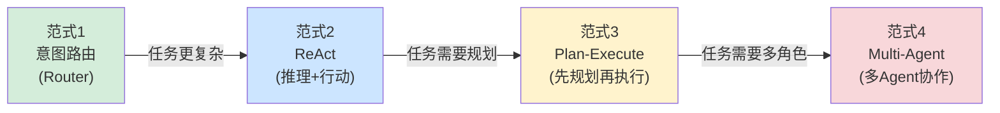
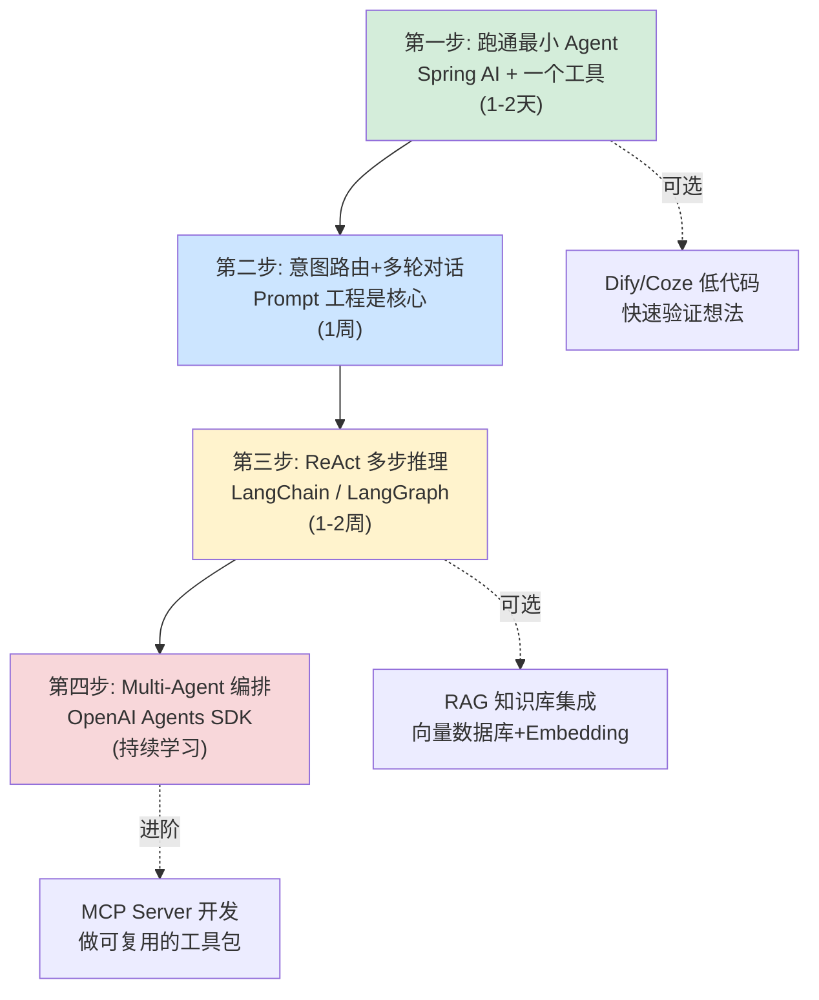

# Agent 开发实战：选型、框架与思维转换

> 最后整理: 2026-05-09（最近一次拆分: 2026-05-21）| 来源: 对话讨论

> 关联: [agent-patterns](./agent-patterns.md) — 四范式深度展开（架构图 / Prompt 模板 / 典型案例）

## Agent 开发的四大设计范式

开发一个 Agent 系统，不同的任务复杂度适合不同的架构范式。下面从简单到复杂排列：



| 范式 | 适合场景 | 典型产品 | 复杂度 |
|------|---------|---------|--------|
| **意图路由** | 客服答疑、FAQ 查询 | 各类客服 Bot | ★☆☆☆ |
| **ReAct** | 需要多步推理+工具调用 | Claude Code、ChatGPT Plugins | ★★☆☆ |
| **Plan-Execute** | 复杂任务需要先规划再执行 | Devin、AutoGPT | ★★★☆ |
| **Multi-Agent** | 多角色协作的大型任务 | OpenAI Agents SDK、CrewAI | ★★★★ |

---

> **四范式深度展开（架构图 / Prompt 模板 / 典型案例）请见 → [agent-patterns](./agent-patterns.md)**
>
> 本文聚焦"怎么选 + 用什么 + 怎么学 + 思维怎么转"，是 agent-patterns 的导览页。
> 下面的"四种范式怎么选 / 主流框架速查 / 学习路径 / vs Java 对比"是选型与落地的关键内容。

---

## 四种范式怎么选

| 你的任务 | 推荐范式 | 原因 |
|---------|---------|------|
| 客服答疑、FAQ 查询 | 意图路由 | 一问一答，不需要多步推理 |
| 信息搜索+汇总 | ReAct | 需要多步搜索、前后步骤有依赖 |
| 搭建一个完整项目 | Plan-Execute | 步骤多且可预见，需要全局规划 |
| 复杂的多角色协作 | Multi-Agent | 不同角色有不同专长和工具集 |
| 混合场景 | **组合使用** | 实际产品常常混用多种范式 |

最后一行很重要——**实际产品往往混用**。比如一个智能客服系统可能用意图路由做第一层分类，复杂问题走 ReAct 循环，后台运维任务走 Plan-Execute。

---

## 主流 Agent 开发框架速查

| 框架 | 语言 | 核心范式 | 适合场景 | 上手难度 |
|------|------|---------|---------|---------|
| **Spring AI** | Java | 意图路由 + FC | Java 后端快速接入 | ★☆☆ |
| **LangChain** | Python | ReAct + 工具链 | 通用 Agent 开发 | ★★☆ |
| **LangGraph** | Python | 有状态图 + 多步 | 复杂流程编排 | ★★★ |
| **OpenAI Agents SDK** | Python | Multi-Agent + Handoff | 多角色协作 | ★★☆ |
| **CrewAI** | Python | Multi-Agent + 角色 | 团队模拟协作 | ★★☆ |
| **Dify / Coze** | 低代码 | 可视化编排 | 快速验证想法 | ★☆☆ |

### Java 开发者快速上手示例（Spring AI）

```java
// 1. 用 @Tool 注解定义工具
@Component
public class OrderTools {
    @Tool(description = "查询订单详情，包括状态、金额、物流信息")
    public OrderInfo queryOrder(@Param("订单号") String orderId) {
        return orderService.getById(orderId);
    }
    
    @Tool(description = "发起退款申请")
    public RefundResult applyRefund(
        @Param("订单号") String orderId,
        @Param("退款原因") String reason) {
        return refundService.apply(orderId, reason);
    }
}

// 2. 配置 ChatClient
@Bean
public ChatClient chatClient(ChatModel model, OrderTools tools) {
    return ChatClient.builder(model)
        .defaultSystem(SYSTEM_PROMPT)
        .defaultTools(tools)
        .defaultAdvisors(new MessageChatMemoryAdvisor(memory))
        .build();
}

// 3. Controller
@PostMapping("/chat")
public Flux<String> chat(@RequestBody ChatRequest req) {
    return chatClient.prompt().user(req.getMessage())
        .stream().content();
}
```

---

## Agent 开发的学习路径



| 阶段 | 做什么 | 产出 |
|------|--------|------|
| **第一步** | 做一个"能查数据库的聊天机器人" | 最小可用 demo |
| **第二步** | 加意图路由 + 追问机制 | 客服答疑工具雏形 |
| **第三步** | 实现 ReAct 循环，接 RAG | 能多步推理+查文档回答 |
| **第四步** | 多 Agent 协作 | 复杂任务自动拆分+流转 |

---

## Agent 开发 vs 传统 Java 应用开发

Java 开发者第一次接触 Agent 开发时，容易不自觉地用传统思维套，踩很多坑。最根本的区别在于：

```
传统 Java 应用:
  controller.getOrder("12345") → 永远返回同一个订单数据
  100% 可预测、可复现

Agent 应用:
  用户: "帮我看看上次买的东西到哪了"  
  → 第一次: "您的订单正在配送中，预计今天送达"
  → 第二次: "包裹已到您附近的配送站，马上就到啦"
  → 意思一样，表述不同；甚至可能理解错"上次"指的是哪个订单
```

### 六个核心维度对比

| 维度 | 传统 Java 应用 | Agent 应用 |
|------|---------------|-----------|
| **核心逻辑** | 你写的 if-else / 业务规则 | LLM 推理 + 你写的工具 |
| **输入输出** | 结构化（JSON/表单） | 自然语言（任意表述） |
| **流程控制** | 你定义的流程图 | LLM 自主决策下一步 |
| **测试方法** | 断言精确结果 | 模糊匹配 + 人工评估 |
| **调试方式** | 看日志 + 断点 | 看 Prompt + LLM 输出链路 |
| **核心技能** | 写代码 | 写 Prompt + 设计工具 |

### 用"退款"场景看区别

**传统 Java——你控制整个流程：**

```java
@PostMapping("/refund")
public Result applyRefund(@RequestBody RefundRequest req) {
    if (req.getOrderId() == null) throw new BadRequest("缺少订单号");
    Order order = orderService.getById(req.getOrderId());
    if (order.getStatus() != DELIVERED) 
        throw new BizException("未签收不可退款");
    if (daysBetween(order.getDeliverTime(), now()) > 7)
        throw new BizException("超过7天退款期");
    refundService.apply(order, req.getReason());
    return Result.success("退款申请已提交");
}
```

**Agent——你只提供"能力"，LLM 决定调用顺序：**

```java
@Tool(description = "查询订单详情，返回状态、金额、签收时间")
public OrderInfo queryOrder(@Param("订单号") String orderId) {
    return orderService.getById(orderId);
}

@Tool(description = "发起退款，仅限已签收且在7天内的订单")
public RefundResult applyRefund(
    @Param("订单号") String orderId,
    @Param("退款原因") String reason) {
    // 业务校验仍然在工具内部！
    Order order = orderService.getById(orderId);
    if (order.getStatus() != DELIVERED) 
        return RefundResult.fail("该订单未签收，暂不支持退款");
    if (daysBetween(order.getDeliverTime(), now()) > 7)
        return RefundResult.fail("已超过7天退款期");
    refundService.apply(order, reason);
    return RefundResult.success("退款申请已提交");
}
// 先查订单还是直接退款？由 LLM 自己判断
```

### 六个设计要点

#### 1. 工具描述决定一切

LLM 通过工具的 description 决定什么时候调什么工具。description 写不好，LLM 就会选错工具或传错参数。

```java
// ❌ 差——LLM 不知道什么时候该用
@Tool(description = "查询数据")
public Object query(String param) { ... }

// ✅ 好——明确用途、参数格式、限制条件
@Tool(description = "查询订单详情，包括状态、金额、物流。" +
     "需要订单号（格式如 2026050100123）。" +
     "如果用户没提供订单号，请先询问。")
public OrderInfo queryOrder(@Param("订单号，纯数字") String orderId) { ... }
```

#### 2. 业务校验必须在工具内部

```java
// ❌ 危险：靠 Prompt 告诉 LLM "超过7天不能退"
//    LLM 可能忘记、可能算错天数、可能被 Prompt 注入绕过

// ✅ 安全：工具内部硬编码校验
@Tool(description = "发起退款申请")
public RefundResult applyRefund(String orderId, String reason) {
    Order order = orderService.getById(orderId);
    if (daysBetween(order.getDeliverTime(), now()) > 7) {
        return RefundResult.fail("已超过7天退款期");
    }
    // ...
}
```

**原则：LLM 负责理解意图和组织语言，业务规则和数据校验走传统代码路径。**

#### 3. 测试方式完全不同

```java
// 传统：精确断言
assertEquals("退款申请已提交", result.getMessage());

// Agent：模糊评估——LLM 每次措辞不同
assertTrue(response.contains("退款") || response.contains("退货"));
verify(refundService).apply(any(), any());  // 验证工具确实被调用了
```

**Agent 测试三层**：工具单测（和传统一样）→ 路由测试（LLM 是否选对工具）→ 端到端评估（人工或 eval 框架）

### 团队级质量保障：Pre-PR 与 AI 辅助测试

当团队 90% 代码由 AI 生成时，测试策略也需要升级。美团在 31 万行代码重构中沉淀了两套互补机制：

**Pre-PR（预审）机制**：

```
传统流程: 编码 → 提交 PR → Reviewer 从头看到尾
Pre-PR:   编码 → AI 自查多轮 → 修复AI能发现的问题 → AI生成PR文档 → 人工CR聚焦业务语义
```

人工 CR 的价值从"你写得对吗？"转变为"我们是否在正确的约束下解决正确的问题？"

**AI 辅助测试 SOP（Human-in-the-loop 模式）**：

团队尝试了两条路线：
- **路线 A（AI 全自动）**：AI 读 PRD + diff → 全自动生成用例 → 人最后把关 → **失败**：AI 缺乏全局业务认知，容易漏掉隐性高危场景，同时发散大量无价值边缘用例
- **路线 B（人主导 + AI 辅助）✅**：人定范围、判风险 → AI 扫描代码、生成用例 → 人 review 确认

路线 B 的 5 步 SOP：

| 步骤 | 人做什么 | AI 做什么 |
|------|---------|----------|
| 1. 建立范围 | 审核确认测试范围 | 从流量 + 代码变更双向扫描受影响接口 |
| 2. 风险分级 | 判定风险等级，决定测试深度 | 读代码回答：改了多少、分支在哪、旧数据兼容吗 |
| 3. 设计分组 | 审核分组，补充业务特殊场景 | 判定表方法"先拆后合"，自动生成最小 Case 组合 |
| 4. 生成步骤 | 校验步骤匹配度，补充边界 | 按"一步操作、多维验证"模板展开 |
| 5. 验证覆盖 | 最终确认无盲区 | 自动生成接口×维度覆盖矩阵，标记未覆盖项 |

**核心原则**：AI 负责"生成"和"扫描"（体力活），人负责"判断"和"确认"（需要业务认知），每步都有 Human-in-the-loop。

> 关联: [AI Coding 团队治理](../AI-Coding/ai-coding-team-governance.md) — Pre-PR 机制详解 + 完整 5 步测试 SOP 表格

#### 4. 可观测性要求更高

传统应用看日志就够了。Agent 应用需要完整记录：

- 完整 Prompt（system + user + history）
- 工具调用链路（名称 + 参数 + 返回值）
- LLM 原始输出
- 模型版本、temperature、token 消耗

#### 5. 错误处理返回描述而非异常

```java
// 传统：抛异常，前端展示错误码
throw new BizException(ErrorCode.ORDER_NOT_FOUND, "订单不存在");

// Agent：返回描述性错误，让 LLM 自然语言告诉用户
if (order == null) {
    return OrderInfo.error("未找到订单 " + orderId + "，请确认订单号是否正确");
}
```

#### 6. 成本模型完全不同

```
传统: 成本 ≈ 服务器资源，和输入长度基本无关
Agent: 成本 ≈ token 消耗，按输入+输出字数计费

第 1 轮对话:  ~500 tokens ≈ ¥0.01
第 20 轮对话: ~10000 tokens ≈ ¥0.2  ← 单轮成本涨了 20 倍
```

需要做上下文管理：滑动窗口、摘要压缩、关键信息提取。

### 思维转换总结

```
传统 Java 开发者: 我控制一切 → 我定义流程 → 我处理所有分支 → 确定结果
Agent 开发者:     我提供能力 → LLM 决定顺序 → 我兜底业务规则 → 正确但不同的结果

从"流程控制者"变成"能力提供者 + 兜底守门员"
```

> 关联: [Agent 与 MCP](../大模型/llm-agent-mcp.md) — Agent 循环、MCP 协议、FC 机制的概念原理
> 关联: [OpenAI Agents SDK](./openai-agents-sdk.md) — 多角色协作与 Handoff 机制
> 关联: [LLM 智能客服实战](./llm-customer-service.md) — 从零搭建客服系统全流程
> 关联: [LLM 应用设计](./llm-app-design.md) — 确定性 vs 概率性、上下文管理、幻觉防控
> 关联: [Spring AI](../../Java/spring-ai.md) — Spring 生态的 LLM 集成
